Huge library of matcap PNG textures organized by color

## Navigation
* [Home](/)
* [Page 1](PAGE-1.md)
* [Page 2](PAGE-2.md)
* Page 3
* [Page 4](PAGE-4.md)
## Page 5 Matcaps
### 7F5134_7F5134_22120A_452110
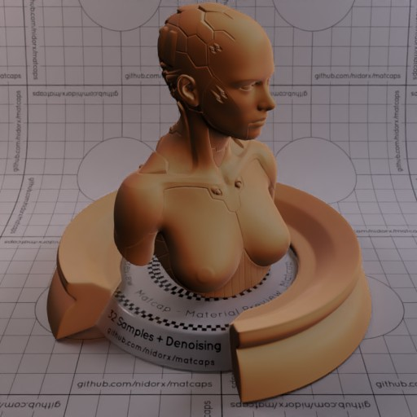

[[1024px](https://github.com/nidorx/matcaps/raw/master/1024/7F5134_7F5134_22120A_452110.png)]
[[512px](https://github.com/nidorx/matcaps/raw/master/512/7F5134_7F5134_22120A_452110-512px.png)]
[[256px](https://github.com/nidorx/matcaps/raw/master/256/7F5134_7F5134_22120A_452110-256px.png)]
[[128px](https://github.com/nidorx/matcaps/raw/master/128/7F5134_7F5134_22120A_452110-128px.png)]
[[64px](https://github.com/nidorx/matcaps/raw/master/64/7F5134_7F5134_22120A_452110-64px.png)]
[[ZBrush Material (ZMT)](https://github.com/nidorx/matcaps/raw/master/zmt/7F5134_7F5134_22120A_452110.zmt)]

---
### 826A59_826A59_E0C9B9_CBAD99
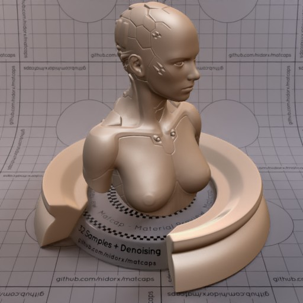

[[1024px](https://github.com/nidorx/matcaps/raw/master/1024/826A59_826A59_E0C9B9_CBAD99.png)]
[[512px](https://github.com/nidorx/matcaps/raw/master/512/826A59_826A59_E0C9B9_CBAD99-512px.png)]
[[256px](https://github.com/nidorx/matcaps/raw/master/256/826A59_826A59_E0C9B9_CBAD99-256px.png)]
[[128px](https://github.com/nidorx/matcaps/raw/master/128/826A59_826A59_E0C9B9_CBAD99-128px.png)]
[[64px](https://github.com/nidorx/matcaps/raw/master/64/826A59_826A59_E0C9B9_CBAD99-64px.png)]
[[ZBrush Material (ZMT)](https://github.com/nidorx/matcaps/raw/master/zmt/826A59_826A59_E0C9B9_CBAD99.zmt)]

---
### 837667_837667_DCD4C8_C5BAAC
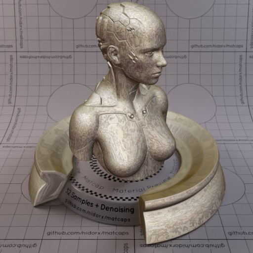

[[1024px](https://github.com/nidorx/matcaps/raw/master/1024/837667_837667_DCD4C8_C5BAAC.png)]
[[512px](https://github.com/nidorx/matcaps/raw/master/512/837667_837667_DCD4C8_C5BAAC-512px.png)]
[[256px](https://github.com/nidorx/matcaps/raw/master/256/837667_837667_DCD4C8_C5BAAC-256px.png)]
[[128px](https://github.com/nidorx/matcaps/raw/master/128/837667_837667_DCD4C8_C5BAAC-128px.png)]
[[64px](https://github.com/nidorx/matcaps/raw/master/64/837667_837667_DCD4C8_C5BAAC-64px.png)]
[[ZBrush Material (ZMT)](https://github.com/nidorx/matcaps/raw/master/zmt/837667_837667_DCD4C8_C5BAAC.zmt)]

---
### 85694C_85694C_D1A67A_3C2F22
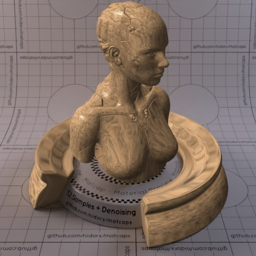

[[1024px](https://github.com/nidorx/matcaps/raw/master/1024/85694C_85694C_D1A67A_3C2F22.png)]
[[512px](https://github.com/nidorx/matcaps/raw/master/512/85694C_85694C_D1A67A_3C2F22-512px.png)]
[[256px](https://github.com/nidorx/matcaps/raw/master/256/85694C_85694C_D1A67A_3C2F22-256px.png)]
[[128px](https://github.com/nidorx/matcaps/raw/master/128/85694C_85694C_D1A67A_3C2F22-128px.png)]
[[64px](https://github.com/nidorx/matcaps/raw/master/64/85694C_85694C_D1A67A_3C2F22-64px.png)]
[[ZBrush Material (ZMT)](https://github.com/nidorx/matcaps/raw/master/zmt/85694C_85694C_D1A67A_3C2F22.zmt)]

---
### 857B61_857B61_ACE5D4_593D28
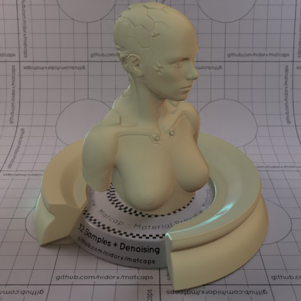

[[1024px](https://github.com/nidorx/matcaps/raw/master/1024/857B61_857B61_ACE5D4_593D28.png)]
[[512px](https://github.com/nidorx/matcaps/raw/master/512/857B61_857B61_ACE5D4_593D28-512px.png)]
[[256px](https://github.com/nidorx/matcaps/raw/master/256/857B61_857B61_ACE5D4_593D28-256px.png)]
[[128px](https://github.com/nidorx/matcaps/raw/master/128/857B61_857B61_ACE5D4_593D28-128px.png)]
[[64px](https://github.com/nidorx/matcaps/raw/master/64/857B61_857B61_ACE5D4_593D28-64px.png)]
[[ZBrush Material (ZMT)](https://github.com/nidorx/matcaps/raw/master/zmt/857B61_857B61_ACE5D4_593D28.zmt)]

---
### 85B9D3_85B9D3_C9EAF9_417277
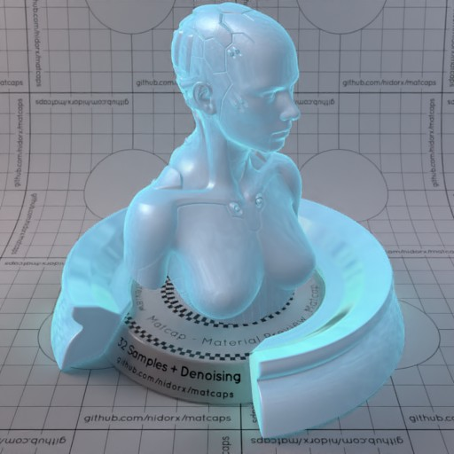

[[1024px](https://github.com/nidorx/matcaps/raw/master/1024/85B9D3_85B9D3_C9EAF9_417277.png)]
[[512px](https://github.com/nidorx/matcaps/raw/master/512/85B9D3_85B9D3_C9EAF9_417277-512px.png)]
[[256px](https://github.com/nidorx/matcaps/raw/master/256/85B9D3_85B9D3_C9EAF9_417277-256px.png)]
[[128px](https://github.com/nidorx/matcaps/raw/master/128/85B9D3_85B9D3_C9EAF9_417277-128px.png)]
[[64px](https://github.com/nidorx/matcaps/raw/master/64/85B9D3_85B9D3_C9EAF9_417277-64px.png)]
[[ZBrush Material (ZMT)](https://github.com/nidorx/matcaps/raw/master/zmt/85B9D3_85B9D3_C9EAF9_417277.zmt)]

---
### 887153_887153_E5C188_433729
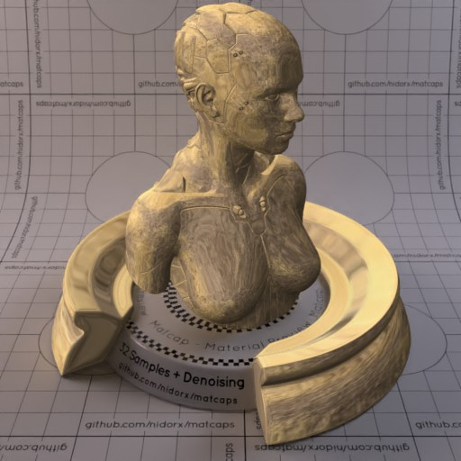

[[1024px](https://github.com/nidorx/matcaps/raw/master/1024/887153_887153_E5C188_433729.png)]
[[512px](https://github.com/nidorx/matcaps/raw/master/512/887153_887153_E5C188_433729-512px.png)]
[[256px](https://github.com/nidorx/matcaps/raw/master/256/887153_887153_E5C188_433729-256px.png)]
[[128px](https://github.com/nidorx/matcaps/raw/master/128/887153_887153_E5C188_433729-128px.png)]
[[64px](https://github.com/nidorx/matcaps/raw/master/64/887153_887153_E5C188_433729-64px.png)]
[[ZBrush Material (ZMT)](https://github.com/nidorx/matcaps/raw/master/zmt/887153_887153_E5C188_433729.zmt)]

---
### 888D8F_888D8F_515454_646A6C
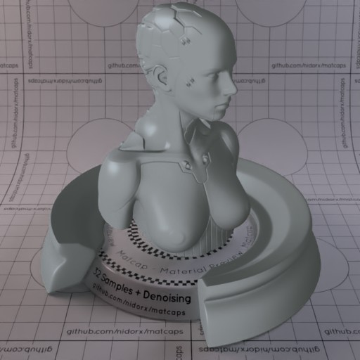

[[1024px](https://github.com/nidorx/matcaps/raw/master/1024/888D8F_888D8F_515454_646A6C.png)]
[[512px](https://github.com/nidorx/matcaps/raw/master/512/888D8F_888D8F_515454_646A6C-512px.png)]
[[256px](https://github.com/nidorx/matcaps/raw/master/256/888D8F_888D8F_515454_646A6C-256px.png)]
[[128px](https://github.com/nidorx/matcaps/raw/master/128/888D8F_888D8F_515454_646A6C-128px.png)]
[[64px](https://github.com/nidorx/matcaps/raw/master/64/888D8F_888D8F_515454_646A6C-64px.png)]
[[ZBrush Material (ZMT)](https://github.com/nidorx/matcaps/raw/master/zmt/888D8F_888D8F_515454_646A6C.zmt)]

---
### 89204B_89204B_17080D_DA4377
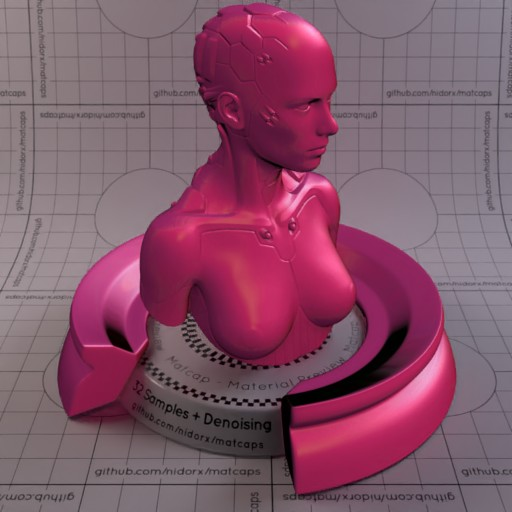

[[1024px](https://github.com/nidorx/matcaps/raw/master/1024/89204B_89204B_17080D_DA4377.png)]
[[512px](https://github.com/nidorx/matcaps/raw/master/512/89204B_89204B_17080D_DA4377-512px.png)]
[[256px](https://github.com/nidorx/matcaps/raw/master/256/89204B_89204B_17080D_DA4377-256px.png)]
[[128px](https://github.com/nidorx/matcaps/raw/master/128/89204B_89204B_17080D_DA4377-128px.png)]
[[64px](https://github.com/nidorx/matcaps/raw/master/64/89204B_89204B_17080D_DA4377-64px.png)]
[[ZBrush Material (ZMT)](https://github.com/nidorx/matcaps/raw/master/zmt/89204B_89204B_17080D_DA4377.zmt)]

---
### 8955D0_8955D0_744CC4_EA4AEF
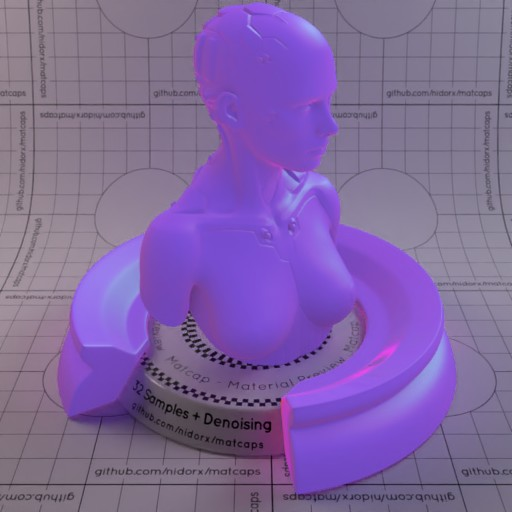

[[1024px](https://github.com/nidorx/matcaps/raw/master/1024/8955D0_8955D0_744CC4_EA4AEF.png)]
[[512px](https://github.com/nidorx/matcaps/raw/master/512/8955D0_8955D0_744CC4_EA4AEF-512px.png)]
[[256px](https://github.com/nidorx/matcaps/raw/master/256/8955D0_8955D0_744CC4_EA4AEF-256px.png)]
[[128px](https://github.com/nidorx/matcaps/raw/master/128/8955D0_8955D0_744CC4_EA4AEF-128px.png)]
[[64px](https://github.com/nidorx/matcaps/raw/master/64/8955D0_8955D0_744CC4_EA4AEF-64px.png)]
[[ZBrush Material (ZMT)](https://github.com/nidorx/matcaps/raw/master/zmt/8955D0_8955D0_744CC4_EA4AEF.zmt)]

---
### 8A3B3D_8A3B3D_DA5F62_461F20
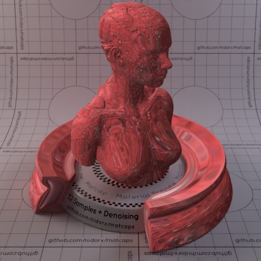

[[1024px](https://github.com/nidorx/matcaps/raw/master/1024/8A3B3D_8A3B3D_DA5F62_461F20.png)]
[[512px](https://github.com/nidorx/matcaps/raw/master/512/8A3B3D_8A3B3D_DA5F62_461F20-512px.png)]
[[256px](https://github.com/nidorx/matcaps/raw/master/256/8A3B3D_8A3B3D_DA5F62_461F20-256px.png)]
[[128px](https://github.com/nidorx/matcaps/raw/master/128/8A3B3D_8A3B3D_DA5F62_461F20-128px.png)]
[[64px](https://github.com/nidorx/matcaps/raw/master/64/8A3B3D_8A3B3D_DA5F62_461F20-64px.png)]
[[ZBrush Material (ZMT)](https://github.com/nidorx/matcaps/raw/master/zmt/8A3B3D_8A3B3D_DA5F62_461F20.zmt)]

---
### 8A5B34_8A5B34_F3BD7C_DA9758
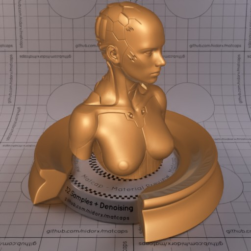

[[1024px](https://github.com/nidorx/matcaps/raw/master/1024/8A5B34_8A5B34_F3BD7C_DA9758.png)]
[[512px](https://github.com/nidorx/matcaps/raw/master/512/8A5B34_8A5B34_F3BD7C_DA9758-512px.png)]
[[256px](https://github.com/nidorx/matcaps/raw/master/256/8A5B34_8A5B34_F3BD7C_DA9758-256px.png)]
[[128px](https://github.com/nidorx/matcaps/raw/master/128/8A5B34_8A5B34_F3BD7C_DA9758-128px.png)]
[[64px](https://github.com/nidorx/matcaps/raw/master/64/8A5B34_8A5B34_F3BD7C_DA9758-64px.png)]
[[ZBrush Material (ZMT)](https://github.com/nidorx/matcaps/raw/master/zmt/8A5B34_8A5B34_F3BD7C_DA9758.zmt)]

---
### 8B892C_8B892C_D4E856_475E2D
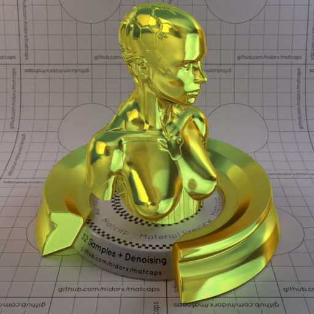

[[1024px](https://github.com/nidorx/matcaps/raw/master/1024/8B892C_8B892C_D4E856_475E2D.png)]
[[512px](https://github.com/nidorx/matcaps/raw/master/512/8B892C_8B892C_D4E856_475E2D-512px.png)]
[[256px](https://github.com/nidorx/matcaps/raw/master/256/8B892C_8B892C_D4E856_475E2D-256px.png)]
[[128px](https://github.com/nidorx/matcaps/raw/master/128/8B892C_8B892C_D4E856_475E2D-128px.png)]
[[64px](https://github.com/nidorx/matcaps/raw/master/64/8B892C_8B892C_D4E856_475E2D-64px.png)]
[[ZBrush Material (ZMT)](https://github.com/nidorx/matcaps/raw/master/zmt/8B892C_8B892C_D4E856_475E2D.zmt)]

---
### 8E7C67_8E7C67_E2C6A5_3B332A
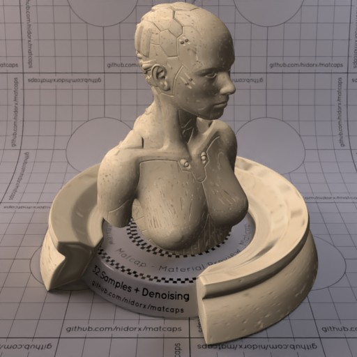

[[1024px](https://github.com/nidorx/matcaps/raw/master/1024/8E7C67_8E7C67_E2C6A5_3B332A.png)]
[[512px](https://github.com/nidorx/matcaps/raw/master/512/8E7C67_8E7C67_E2C6A5_3B332A-512px.png)]
[[256px](https://github.com/nidorx/matcaps/raw/master/256/8E7C67_8E7C67_E2C6A5_3B332A-256px.png)]
[[128px](https://github.com/nidorx/matcaps/raw/master/128/8E7C67_8E7C67_E2C6A5_3B332A-128px.png)]
[[64px](https://github.com/nidorx/matcaps/raw/master/64/8E7C67_8E7C67_E2C6A5_3B332A-64px.png)]
[[ZBrush Material (ZMT)](https://github.com/nidorx/matcaps/raw/master/zmt/8E7C67_8E7C67_E2C6A5_3B332A.zmt)]

---
### 8E907C_8E907C_B1B5A7_D7DBD0
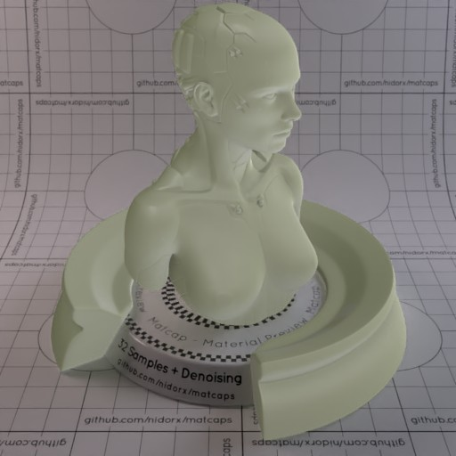

[[1024px](https://github.com/nidorx/matcaps/raw/master/1024/8E907C_8E907C_B1B5A7_D7DBD0.png)]
[[512px](https://github.com/nidorx/matcaps/raw/master/512/8E907C_8E907C_B1B5A7_D7DBD0-512px.png)]
[[256px](https://github.com/nidorx/matcaps/raw/master/256/8E907C_8E907C_B1B5A7_D7DBD0-256px.png)]
[[128px](https://github.com/nidorx/matcaps/raw/master/128/8E907C_8E907C_B1B5A7_D7DBD0-128px.png)]
[[64px](https://github.com/nidorx/matcaps/raw/master/64/8E907C_8E907C_B1B5A7_D7DBD0-64px.png)]
[[ZBrush Material (ZMT)](https://github.com/nidorx/matcaps/raw/master/zmt/8E907C_8E907C_B1B5A7_D7DBD0.zmt)]

---
### 8F4E20_8F4E20_E8B06B_391A08

[[1024px](https://github.com/nidorx/matcaps/raw/master/1024/8F4E20_8F4E20_E8B06B_391A08.png)]
[[512px](https://github.com/nidorx/matcaps/raw/master/512/8F4E20_8F4E20_E8B06B_391A08-512px.png)]
[[256px](https://github.com/nidorx/matcaps/raw/master/256/8F4E20_8F4E20_E8B06B_391A08-256px.png)]
[[128px](https://github.com/nidorx/matcaps/raw/master/128/8F4E20_8F4E20_E8B06B_391A08-128px.png)]
[[64px](https://github.com/nidorx/matcaps/raw/master/64/8F4E20_8F4E20_E8B06B_391A08-64px.png)]
[~~ZBrush Material (ZMT)~~]

---
### 8F7B61_8F7B61_D6B892_4E4436
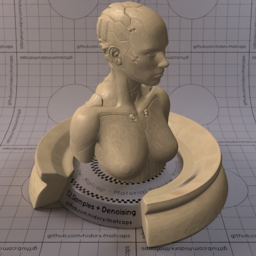

[[1024px](https://github.com/nidorx/matcaps/raw/master/1024/8F7B61_8F7B61_D6B892_4E4436.png)]
[[512px](https://github.com/nidorx/matcaps/raw/master/512/8F7B61_8F7B61_D6B892_4E4436-512px.png)]
[[256px](https://github.com/nidorx/matcaps/raw/master/256/8F7B61_8F7B61_D6B892_4E4436-256px.png)]
[[128px](https://github.com/nidorx/matcaps/raw/master/128/8F7B61_8F7B61_D6B892_4E4436-128px.png)]
[[64px](https://github.com/nidorx/matcaps/raw/master/64/8F7B61_8F7B61_D6B892_4E4436-64px.png)]
[[ZBrush Material (ZMT)](https://github.com/nidorx/matcaps/raw/master/zmt/8F7B61_8F7B61_D6B892_4E4436.zmt)]

---
### 908E8E_908E8E_292828_454444

[[1024px](https://github.com/nidorx/matcaps/raw/master/1024/908E8E_908E8E_292828_454444.png)]
[[512px](https://github.com/nidorx/matcaps/raw/master/512/908E8E_908E8E_292828_454444-512px.png)]
[[256px](https://github.com/nidorx/matcaps/raw/master/256/908E8E_908E8E_292828_454444-256px.png)]
[[128px](https://github.com/nidorx/matcaps/raw/master/128/908E8E_908E8E_292828_454444-128px.png)]
[[64px](https://github.com/nidorx/matcaps/raw/master/64/908E8E_908E8E_292828_454444-64px.png)]
[[ZBrush Material (ZMT)](https://github.com/nidorx/matcaps/raw/master/zmt/908E8E_908E8E_292828_454444.zmt)]

---
### 909473_909473_555D4B_C2CCA2

[[1024px](https://github.com/nidorx/matcaps/raw/master/1024/909473_909473_555D4B_C2CCA2.png)]
[[512px](https://github.com/nidorx/matcaps/raw/master/512/909473_909473_555D4B_C2CCA2-512px.png)]
[[256px](https://github.com/nidorx/matcaps/raw/master/256/909473_909473_555D4B_C2CCA2-256px.png)]
[[128px](https://github.com/nidorx/matcaps/raw/master/128/909473_909473_555D4B_C2CCA2-128px.png)]
[[64px](https://github.com/nidorx/matcaps/raw/master/64/909473_909473_555D4B_C2CCA2-64px.png)]
[[ZBrush Material (ZMT)](https://github.com/nidorx/matcaps/raw/master/zmt/909473_909473_555D4B_C2CCA2.zmt)]

---
### 927253_927253_EECEA7_D8B792

[[1024px](https://github.com/nidorx/matcaps/raw/master/1024/927253_927253_EECEA7_D8B792.png)]
[[512px](https://github.com/nidorx/matcaps/raw/master/512/927253_927253_EECEA7_D8B792-512px.png)]
[[256px](https://github.com/nidorx/matcaps/raw/master/256/927253_927253_EECEA7_D8B792-256px.png)]
[[128px](https://github.com/nidorx/matcaps/raw/master/128/927253_927253_EECEA7_D8B792-128px.png)]
[[64px](https://github.com/nidorx/matcaps/raw/master/64/927253_927253_EECEA7_D8B792-64px.png)]
[[ZBrush Material (ZMT)](https://github.com/nidorx/matcaps/raw/master/zmt/927253_927253_EECEA7_D8B792.zmt)]

---
### 935555_935555_F6DAD9_D39393

[[1024px](https://github.com/nidorx/matcaps/raw/master/1024/935555_935555_F6DAD9_D39393.png)]
[[512px](https://github.com/nidorx/matcaps/raw/master/512/935555_935555_F6DAD9_D39393-512px.png)]
[[256px](https://github.com/nidorx/matcaps/raw/master/256/935555_935555_F6DAD9_D39393-256px.png)]
[[128px](https://github.com/nidorx/matcaps/raw/master/128/935555_935555_F6DAD9_D39393-128px.png)]
[[64px](https://github.com/nidorx/matcaps/raw/master/64/935555_935555_F6DAD9_D39393-64px.png)]
[[ZBrush Material (ZMT)](https://github.com/nidorx/matcaps/raw/master/zmt/935555_935555_F6DAD9_D39393.zmt)]

---
### 945D43_945D43_E5AAA0_351F14

[[1024px](https://github.com/nidorx/matcaps/raw/master/1024/945D43_945D43_E5AAA0_351F14.png)]
[[512px](https://github.com/nidorx/matcaps/raw/master/512/945D43_945D43_E5AAA0_351F14-512px.png)]
[[256px](https://github.com/nidorx/matcaps/raw/master/256/945D43_945D43_E5AAA0_351F14-256px.png)]
[[128px](https://github.com/nidorx/matcaps/raw/master/128/945D43_945D43_E5AAA0_351F14-128px.png)]
[[64px](https://github.com/nidorx/matcaps/raw/master/64/945D43_945D43_E5AAA0_351F14-64px.png)]
[~~ZBrush Material (ZMT)~~]

---
### 977970_977970_E1D9D8_DAC8C1

[[1024px](https://github.com/nidorx/matcaps/raw/master/1024/977970_977970_E1D9D8_DAC8C1.png)]
[[512px](https://github.com/nidorx/matcaps/raw/master/512/977970_977970_E1D9D8_DAC8C1-512px.png)]
[[256px](https://github.com/nidorx/matcaps/raw/master/256/977970_977970_E1D9D8_DAC8C1-256px.png)]
[[128px](https://github.com/nidorx/matcaps/raw/master/128/977970_977970_E1D9D8_DAC8C1-128px.png)]
[[64px](https://github.com/nidorx/matcaps/raw/master/64/977970_977970_E1D9D8_DAC8C1-64px.png)]
[[ZBrush Material (ZMT)](https://github.com/nidorx/matcaps/raw/master/zmt/977970_977970_E1D9D8_DAC8C1.zmt)]

---
### 989784_989784_665542_BFECE5

[[1024px](https://github.com/nidorx/matcaps/raw/master/1024/989784_989784_665542_BFECE5.png)]
[[512px](https://github.com/nidorx/matcaps/raw/master/512/989784_989784_665542_BFECE5-512px.png)]
[[256px](https://github.com/nidorx/matcaps/raw/master/256/989784_989784_665542_BFECE5-256px.png)]
[[128px](https://github.com/nidorx/matcaps/raw/master/128/989784_989784_665542_BFECE5-128px.png)]
[[64px](https://github.com/nidorx/matcaps/raw/master/64/989784_989784_665542_BFECE5-64px.png)]
[[ZBrush Material (ZMT)](https://github.com/nidorx/matcaps/raw/master/zmt/989784_989784_665542_BFECE5.zmt)]

---
### 9B9994_9B9994_E1E0DB_474643

[[1024px](https://github.com/nidorx/matcaps/raw/master/1024/9B9994_9B9994_E1E0DB_474643.png)]
[[512px](https://github.com/nidorx/matcaps/raw/master/512/9B9994_9B9994_E1E0DB_474643-512px.png)]
[[256px](https://github.com/nidorx/matcaps/raw/master/256/9B9994_9B9994_E1E0DB_474643-256px.png)]
[[128px](https://github.com/nidorx/matcaps/raw/master/128/9B9994_9B9994_E1E0DB_474643-128px.png)]
[[64px](https://github.com/nidorx/matcaps/raw/master/64/9B9994_9B9994_E1E0DB_474643-64px.png)]
[[ZBrush Material (ZMT)](https://github.com/nidorx/matcaps/raw/master/zmt/9B9994_9B9994_E1E0DB_474643.zmt)]

---
### 9D8F84_9D8F84_5D4544_D9D3C9

[[1024px](https://github.com/nidorx/matcaps/raw/master/1024/9D8F84_9D8F84_5D4544_D9D3C9.png)]
[[512px](https://github.com/nidorx/matcaps/raw/master/512/9D8F84_9D8F84_5D4544_D9D3C9-512px.png)]
[[256px](https://github.com/nidorx/matcaps/raw/master/256/9D8F84_9D8F84_5D4544_D9D3C9-256px.png)]
[[128px](https://github.com/nidorx/matcaps/raw/master/128/9D8F84_9D8F84_5D4544_D9D3C9-128px.png)]
[[64px](https://github.com/nidorx/matcaps/raw/master/64/9D8F84_9D8F84_5D4544_D9D3C9-64px.png)]
[[ZBrush Material (ZMT)](https://github.com/nidorx/matcaps/raw/master/zmt/9D8F84_9D8F84_5D4544_D9D3C9.zmt)]

---
### A49994_A49994_695244_C4C2CF

[[1024px](https://github.com/nidorx/matcaps/raw/master/1024/A49994_A49994_695244_C4C2CF.png)]
[[512px](https://github.com/nidorx/matcaps/raw/master/512/A49994_A49994_695244_C4C2CF-512px.png)]
[[256px](https://github.com/nidorx/matcaps/raw/master/256/A49994_A49994_695244_C4C2CF-256px.png)]
[[128px](https://github.com/nidorx/matcaps/raw/master/128/A49994_A49994_695244_C4C2CF-128px.png)]
[[64px](https://github.com/nidorx/matcaps/raw/master/64/A49994_A49994_695244_C4C2CF-64px.png)]
[[ZBrush Material (ZMT)](https://github.com/nidorx/matcaps/raw/master/zmt/A49994_A49994_695244_C4C2CF.zmt)]

---
### A88C77_A88C77_DAD2C7_623532-1

[[1024px](https://github.com/nidorx/matcaps/raw/master/1024/A88C77_A88C77_DAD2C7_623532-1.png)]
[[512px](https://github.com/nidorx/matcaps/raw/master/512/A88C77_A88C77_DAD2C7_623532-1-512px.png)]
[[256px](https://github.com/nidorx/matcaps/raw/master/256/A88C77_A88C77_DAD2C7_623532-1-256px.png)]
[[128px](https://github.com/nidorx/matcaps/raw/master/128/A88C77_A88C77_DAD2C7_623532-1-128px.png)]
[[64px](https://github.com/nidorx/matcaps/raw/master/64/A88C77_A88C77_DAD2C7_623532-1-64px.png)]
[~~ZBrush Material (ZMT)~~]

---
### A88C77_A88C77_DAD2C7_623532

[[1024px](https://github.com/nidorx/matcaps/raw/master/1024/A88C77_A88C77_DAD2C7_623532.png)]
[[512px](https://github.com/nidorx/matcaps/raw/master/512/A88C77_A88C77_DAD2C7_623532-512px.png)]
[[256px](https://github.com/nidorx/matcaps/raw/master/256/A88C77_A88C77_DAD2C7_623532-256px.png)]
[[128px](https://github.com/nidorx/matcaps/raw/master/128/A88C77_A88C77_DAD2C7_623532-128px.png)]
[[64px](https://github.com/nidorx/matcaps/raw/master/64/A88C77_A88C77_DAD2C7_623532-64px.png)]
[[ZBrush Material (ZMT)](https://github.com/nidorx/matcaps/raw/master/zmt/A88C77_A88C77_DAD2C7_623532.zmt)]

---
### A98D6A_A98D6A_F2D3AB_FBE6BE

[[1024px](https://github.com/nidorx/matcaps/raw/master/1024/A98D6A_A98D6A_F2D3AB_FBE6BE.png)]
[[512px](https://github.com/nidorx/matcaps/raw/master/512/A98D6A_A98D6A_F2D3AB_FBE6BE-512px.png)]
[[256px](https://github.com/nidorx/matcaps/raw/master/256/A98D6A_A98D6A_F2D3AB_FBE6BE-256px.png)]
[[128px](https://github.com/nidorx/matcaps/raw/master/128/A98D6A_A98D6A_F2D3AB_FBE6BE-128px.png)]
[[64px](https://github.com/nidorx/matcaps/raw/master/64/A98D6A_A98D6A_F2D3AB_FBE6BE-64px.png)]
[[ZBrush Material (ZMT)](https://github.com/nidorx/matcaps/raw/master/zmt/A98D6A_A98D6A_F2D3AB_FBE6BE.zmt)]

---
### AD9E81_AD9E81_F1E5CE_6B5C3E

[[1024px](https://github.com/nidorx/matcaps/raw/master/1024/AD9E81_AD9E81_F1E5CE_6B5C3E.png)]
[[512px](https://github.com/nidorx/matcaps/raw/master/512/AD9E81_AD9E81_F1E5CE_6B5C3E-512px.png)]
[[256px](https://github.com/nidorx/matcaps/raw/master/256/AD9E81_AD9E81_F1E5CE_6B5C3E-256px.png)]
[[128px](https://github.com/nidorx/matcaps/raw/master/128/AD9E81_AD9E81_F1E5CE_6B5C3E-128px.png)]
[[64px](https://github.com/nidorx/matcaps/raw/master/64/AD9E81_AD9E81_F1E5CE_6B5C3E-64px.png)]
[[ZBrush Material (ZMT)](https://github.com/nidorx/matcaps/raw/master/zmt/AD9E81_AD9E81_F1E5CE_6B5C3E.zmt)]

---
### ADC2CD_ADC2CD_DFF7FA_C9E6F5

[[1024px](https://github.com/nidorx/matcaps/raw/master/1024/ADC2CD_ADC2CD_DFF7FA_C9E6F5.png)]
[[512px](https://github.com/nidorx/matcaps/raw/master/512/ADC2CD_ADC2CD_DFF7FA_C9E6F5-512px.png)]
[[256px](https://github.com/nidorx/matcaps/raw/master/256/ADC2CD_ADC2CD_DFF7FA_C9E6F5-256px.png)]
[[128px](https://github.com/nidorx/matcaps/raw/master/128/ADC2CD_ADC2CD_DFF7FA_C9E6F5-128px.png)]
[[64px](https://github.com/nidorx/matcaps/raw/master/64/ADC2CD_ADC2CD_DFF7FA_C9E6F5-64px.png)]
[[ZBrush Material (ZMT)](https://github.com/nidorx/matcaps/raw/master/zmt/ADC2CD_ADC2CD_DFF7FA_C9E6F5.zmt)]

---
### AE9D99_AE9D99_29303B_585F70

[[1024px](https://github.com/nidorx/matcaps/raw/master/1024/AE9D99_AE9D99_29303B_585F70.png)]
[[512px](https://github.com/nidorx/matcaps/raw/master/512/AE9D99_AE9D99_29303B_585F70-512px.png)]
[[256px](https://github.com/nidorx/matcaps/raw/master/256/AE9D99_AE9D99_29303B_585F70-256px.png)]
[[128px](https://github.com/nidorx/matcaps/raw/master/128/AE9D99_AE9D99_29303B_585F70-128px.png)]
[[64px](https://github.com/nidorx/matcaps/raw/master/64/AE9D99_AE9D99_29303B_585F70-64px.png)]
[[ZBrush Material (ZMT)](https://github.com/nidorx/matcaps/raw/master/zmt/AE9D99_AE9D99_29303B_585F70.zmt)]

---
### AF986F_AF986F_CDB489_9C7C5B

[[1024px](https://github.com/nidorx/matcaps/raw/master/1024/AF986F_AF986F_CDB489_9C7C5B.png)]
[[512px](https://github.com/nidorx/matcaps/raw/master/512/AF986F_AF986F_CDB489_9C7C5B-512px.png)]
[[256px](https://github.com/nidorx/matcaps/raw/master/256/AF986F_AF986F_CDB489_9C7C5B-256px.png)]
[[128px](https://github.com/nidorx/matcaps/raw/master/128/AF986F_AF986F_CDB489_9C7C5B-128px.png)]
[[64px](https://github.com/nidorx/matcaps/raw/master/64/AF986F_AF986F_CDB489_9C7C5B-64px.png)]
[[ZBrush Material (ZMT)](https://github.com/nidorx/matcaps/raw/master/zmt/AF986F_AF986F_CDB489_9C7C5B.zmt)]

---
### AF987A_AF987A_2F2416_523F27

[[1024px](https://github.com/nidorx/matcaps/raw/master/1024/AF987A_AF987A_2F2416_523F27.png)]
[[512px](https://github.com/nidorx/matcaps/raw/master/512/AF987A_AF987A_2F2416_523F27-512px.png)]
[[256px](https://github.com/nidorx/matcaps/raw/master/256/AF987A_AF987A_2F2416_523F27-256px.png)]
[[128px](https://github.com/nidorx/matcaps/raw/master/128/AF987A_AF987A_2F2416_523F27-128px.png)]
[[64px](https://github.com/nidorx/matcaps/raw/master/64/AF987A_AF987A_2F2416_523F27-64px.png)]
[~~ZBrush Material (ZMT)~~]

---
### B06932_B06932_451B09_7B3E16

[[1024px](https://github.com/nidorx/matcaps/raw/master/1024/B06932_B06932_451B09_7B3E16.png)]
[[512px](https://github.com/nidorx/matcaps/raw/master/512/B06932_B06932_451B09_7B3E16-512px.png)]
[[256px](https://github.com/nidorx/matcaps/raw/master/256/B06932_B06932_451B09_7B3E16-256px.png)]
[[128px](https://github.com/nidorx/matcaps/raw/master/128/B06932_B06932_451B09_7B3E16-128px.png)]
[[64px](https://github.com/nidorx/matcaps/raw/master/64/B06932_B06932_451B09_7B3E16-64px.png)]
[~~ZBrush Material (ZMT)~~]

---
### B09273_B09273_7A573D_C7AF97

[[1024px](https://github.com/nidorx/matcaps/raw/master/1024/B09273_B09273_7A573D_C7AF97.png)]
[[512px](https://github.com/nidorx/matcaps/raw/master/512/B09273_B09273_7A573D_C7AF97-512px.png)]
[[256px](https://github.com/nidorx/matcaps/raw/master/256/B09273_B09273_7A573D_C7AF97-256px.png)]
[[128px](https://github.com/nidorx/matcaps/raw/master/128/B09273_B09273_7A573D_C7AF97-128px.png)]
[[64px](https://github.com/nidorx/matcaps/raw/master/64/B09273_B09273_7A573D_C7AF97-64px.png)]
[[ZBrush Material (ZMT)](https://github.com/nidorx/matcaps/raw/master/zmt/B09273_B09273_7A573D_C7AF97.zmt)]

---
### B0B0B0_B0B0B0_6E6E6E_848484

[[1024px](https://github.com/nidorx/matcaps/raw/master/1024/B0B0B0_B0B0B0_6E6E6E_848484.png)]
[[512px](https://github.com/nidorx/matcaps/raw/master/512/B0B0B0_B0B0B0_6E6E6E_848484-512px.png)]
[[256px](https://github.com/nidorx/matcaps/raw/master/256/B0B0B0_B0B0B0_6E6E6E_848484-256px.png)]
[[128px](https://github.com/nidorx/matcaps/raw/master/128/B0B0B0_B0B0B0_6E6E6E_848484-128px.png)]
[[64px](https://github.com/nidorx/matcaps/raw/master/64/B0B0B0_B0B0B0_6E6E6E_848484-64px.png)]
[~~ZBrush Material (ZMT)~~]

---
### B1A395_B1A395_EFE6E1_635A47

[[1024px](https://github.com/nidorx/matcaps/raw/master/1024/B1A395_B1A395_EFE6E1_635A47.png)]
[[512px](https://github.com/nidorx/matcaps/raw/master/512/B1A395_B1A395_EFE6E1_635A47-512px.png)]
[[256px](https://github.com/nidorx/matcaps/raw/master/256/B1A395_B1A395_EFE6E1_635A47-256px.png)]
[[128px](https://github.com/nidorx/matcaps/raw/master/128/B1A395_B1A395_EFE6E1_635A47-128px.png)]
[[64px](https://github.com/nidorx/matcaps/raw/master/64/B1A395_B1A395_EFE6E1_635A47-64px.png)]
[~~ZBrush Material (ZMT)~~]

---
### B3AA93_B3AA93_F4EFD7_E1DDC2

[[1024px](https://github.com/nidorx/matcaps/raw/master/1024/B3AA93_B3AA93_F4EFD7_E1DDC2.png)]
[[512px](https://github.com/nidorx/matcaps/raw/master/512/B3AA93_B3AA93_F4EFD7_E1DDC2-512px.png)]
[[256px](https://github.com/nidorx/matcaps/raw/master/256/B3AA93_B3AA93_F4EFD7_E1DDC2-256px.png)]
[[128px](https://github.com/nidorx/matcaps/raw/master/128/B3AA93_B3AA93_F4EFD7_E1DDC2-128px.png)]
[[64px](https://github.com/nidorx/matcaps/raw/master/64/B3AA93_B3AA93_F4EFD7_E1DDC2-64px.png)]
[[ZBrush Material (ZMT)](https://github.com/nidorx/matcaps/raw/master/zmt/B3AA93_B3AA93_F4EFD7_E1DDC2.zmt)]

---
### B47A5B_B47A5B_301E14_704A31

[[1024px](https://github.com/nidorx/matcaps/raw/master/1024/B47A5B_B47A5B_301E14_704A31.png)]
[[512px](https://github.com/nidorx/matcaps/raw/master/512/B47A5B_B47A5B_301E14_704A31-512px.png)]
[[256px](https://github.com/nidorx/matcaps/raw/master/256/B47A5B_B47A5B_301E14_704A31-256px.png)]
[[128px](https://github.com/nidorx/matcaps/raw/master/128/B47A5B_B47A5B_301E14_704A31-128px.png)]
[[64px](https://github.com/nidorx/matcaps/raw/master/64/B47A5B_B47A5B_301E14_704A31-64px.png)]
[[ZBrush Material (ZMT)](https://github.com/nidorx/matcaps/raw/master/zmt/B47A5B_B47A5B_301E14_704A31.zmt)]

---
### B5987E_B5987E_F8E4DC_6F5939

[[1024px](https://github.com/nidorx/matcaps/raw/master/1024/B5987E_B5987E_F8E4DC_6F5939.png)]
[[512px](https://github.com/nidorx/matcaps/raw/master/512/B5987E_B5987E_F8E4DC_6F5939-512px.png)]
[[256px](https://github.com/nidorx/matcaps/raw/master/256/B5987E_B5987E_F8E4DC_6F5939-256px.png)]
[[128px](https://github.com/nidorx/matcaps/raw/master/128/B5987E_B5987E_F8E4DC_6F5939-128px.png)]
[[64px](https://github.com/nidorx/matcaps/raw/master/64/B5987E_B5987E_F8E4DC_6F5939-64px.png)]
[~~ZBrush Material (ZMT)~~]

---
### B86137_B86137_FBCA6F_6F3C37

[[1024px](https://github.com/nidorx/matcaps/raw/master/1024/B86137_B86137_FBCA6F_6F3C37.png)]
[[512px](https://github.com/nidorx/matcaps/raw/master/512/B86137_B86137_FBCA6F_6F3C37-512px.png)]
[[256px](https://github.com/nidorx/matcaps/raw/master/256/B86137_B86137_FBCA6F_6F3C37-256px.png)]
[[128px](https://github.com/nidorx/matcaps/raw/master/128/B86137_B86137_FBCA6F_6F3C37-128px.png)]
[[64px](https://github.com/nidorx/matcaps/raw/master/64/B86137_B86137_FBCA6F_6F3C37-64px.png)]
[[ZBrush Material (ZMT)](https://github.com/nidorx/matcaps/raw/master/zmt/B86137_B86137_FBCA6F_6F3C37.zmt)]

---
### B98A6D_B98A6D_7B4F38_D1A68F

[[1024px](https://github.com/nidorx/matcaps/raw/master/1024/B98A6D_B98A6D_7B4F38_D1A68F.png)]
[[512px](https://github.com/nidorx/matcaps/raw/master/512/B98A6D_B98A6D_7B4F38_D1A68F-512px.png)]
[[256px](https://github.com/nidorx/matcaps/raw/master/256/B98A6D_B98A6D_7B4F38_D1A68F-256px.png)]
[[128px](https://github.com/nidorx/matcaps/raw/master/128/B98A6D_B98A6D_7B4F38_D1A68F-128px.png)]
[[64px](https://github.com/nidorx/matcaps/raw/master/64/B98A6D_B98A6D_7B4F38_D1A68F-64px.png)]
[[ZBrush Material (ZMT)](https://github.com/nidorx/matcaps/raw/master/zmt/B98A6D_B98A6D_7B4F38_D1A68F.zmt)]

---
### BC928D_BC928D_F9E2D6_654445

[[1024px](https://github.com/nidorx/matcaps/raw/master/1024/BC928D_BC928D_F9E2D6_654445.png)]
[[512px](https://github.com/nidorx/matcaps/raw/master/512/BC928D_BC928D_F9E2D6_654445-512px.png)]
[[256px](https://github.com/nidorx/matcaps/raw/master/256/BC928D_BC928D_F9E2D6_654445-256px.png)]
[[128px](https://github.com/nidorx/matcaps/raw/master/128/BC928D_BC928D_F9E2D6_654445-128px.png)]
[[64px](https://github.com/nidorx/matcaps/raw/master/64/BC928D_BC928D_F9E2D6_654445-64px.png)]
[[ZBrush Material (ZMT)](https://github.com/nidorx/matcaps/raw/master/zmt/BC928D_BC928D_F9E2D6_654445.zmt)]

---
### BD5345_BD5345_460F11_732622

[[1024px](https://github.com/nidorx/matcaps/raw/master/1024/BD5345_BD5345_460F11_732622.png)]
[[512px](https://github.com/nidorx/matcaps/raw/master/512/BD5345_BD5345_460F11_732622-512px.png)]
[[256px](https://github.com/nidorx/matcaps/raw/master/256/BD5345_BD5345_460F11_732622-256px.png)]
[[128px](https://github.com/nidorx/matcaps/raw/master/128/BD5345_BD5345_460F11_732622-128px.png)]
[[64px](https://github.com/nidorx/matcaps/raw/master/64/BD5345_BD5345_460F11_732622-64px.png)]
[~~ZBrush Material (ZMT)~~]

---
### BFB5A4_BFB5A4_DEDCCB_D7D4CC

[[1024px](https://github.com/nidorx/matcaps/raw/master/1024/BFB5A4_BFB5A4_DEDCCB_D7D4CC.png)]
[[512px](https://github.com/nidorx/matcaps/raw/master/512/BFB5A4_BFB5A4_DEDCCB_D7D4CC-512px.png)]
[[256px](https://github.com/nidorx/matcaps/raw/master/256/BFB5A4_BFB5A4_DEDCCB_D7D4CC-256px.png)]
[[128px](https://github.com/nidorx/matcaps/raw/master/128/BFB5A4_BFB5A4_DEDCCB_D7D4CC-128px.png)]
[[64px](https://github.com/nidorx/matcaps/raw/master/64/BFB5A4_BFB5A4_DEDCCB_D7D4CC-64px.png)]
[[ZBrush Material (ZMT)](https://github.com/nidorx/matcaps/raw/master/zmt/BFB5A4_BFB5A4_DEDCCB_D7D4CC.zmt)]

---
### C05429_C05429_ED6129_94492A

[[1024px](https://github.com/nidorx/matcaps/raw/master/1024/C05429_C05429_ED6129_94492A.png)]
[[512px](https://github.com/nidorx/matcaps/raw/master/512/C05429_C05429_ED6129_94492A-512px.png)]
[[256px](https://github.com/nidorx/matcaps/raw/master/256/C05429_C05429_ED6129_94492A-256px.png)]
[[128px](https://github.com/nidorx/matcaps/raw/master/128/C05429_C05429_ED6129_94492A-128px.png)]
[[64px](https://github.com/nidorx/matcaps/raw/master/64/C05429_C05429_ED6129_94492A-64px.png)]
[[ZBrush Material (ZMT)](https://github.com/nidorx/matcaps/raw/master/zmt/C05429_C05429_ED6129_94492A.zmt)]

---
### C1AA92_C1AA92_AD6E29_737889

[[1024px](https://github.com/nidorx/matcaps/raw/master/1024/C1AA92_C1AA92_AD6E29_737889.png)]
[[512px](https://github.com/nidorx/matcaps/raw/master/512/C1AA92_C1AA92_AD6E29_737889-512px.png)]
[[256px](https://github.com/nidorx/matcaps/raw/master/256/C1AA92_C1AA92_AD6E29_737889-256px.png)]
[[128px](https://github.com/nidorx/matcaps/raw/master/128/C1AA92_C1AA92_AD6E29_737889-128px.png)]
[[64px](https://github.com/nidorx/matcaps/raw/master/64/C1AA92_C1AA92_AD6E29_737889-64px.png)]
[[ZBrush Material (ZMT)](https://github.com/nidorx/matcaps/raw/master/zmt/C1AA92_C1AA92_AD6E29_737889.zmt)]

---