A huge library of MatCap textures in PNG and ZMT.

## Navigation
* [Home](/)
* [Page 1](PAGE-1.md)
* [Page 2](PAGE-2.md)
* Page 3
* [Page 4](PAGE-4.md)
* [Page 5](PAGE-5.md)
* [Page 6](PAGE-6.md)
* [Page 7](PAGE-7.md)
* [Page 8](PAGE-8.md)
* [Page 9](PAGE-9.md)
* [Page 10](PAGE-10.md)
* [Page 11](PAGE-11.md)
* [Page 12](PAGE-12.md)
* [Page 13](PAGE-13.md)
* [Page 14](PAGE-14.md)
* [Page 15](PAGE-15.md)
* [Page 16](PAGE-16.md)
* [Page 17](PAGE-17.md)
* [Page 18](PAGE-18.md)
* [Page 19](PAGE-19.md)
* [Page 20](PAGE-20.md)
* [Page 21](PAGE-21.md)
* [Page 22](PAGE-22.md)
* [Page 23](PAGE-23.md)
* [Page 24](PAGE-24.md)
* [Page 25](PAGE-25.md)
* [Page 26](PAGE-26.md)
* [Page 27](PAGE-27.md)
* [Page 28](PAGE-28.md)
* [Page 29](PAGE-29.md)
* [Page 30](PAGE-30.md)
* [Page 31](PAGE-31.md)
* [Page 32](PAGE-32.md)
* [Page 33](PAGE-33.md)
## Page 3 Matcaps
### 254FB0_254FB0_99AFF0_6587D8
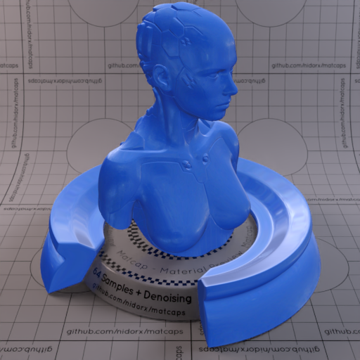

[[1024px](https://github.com/nidorx/matcaps/raw/master/1024/254FB0_254FB0_99AFF0_6587D8.png)]
[[512px](https://github.com/nidorx/matcaps/raw/master/512/254FB0_254FB0_99AFF0_6587D8-512px.png)]
[[256px](https://github.com/nidorx/matcaps/raw/master/256/254FB0_254FB0_99AFF0_6587D8-256px.png)]
[[128px](https://github.com/nidorx/matcaps/raw/master/128/254FB0_254FB0_99AFF0_6587D8-128px.png)]
[[64px](https://github.com/nidorx/matcaps/raw/master/64/254FB0_254FB0_99AFF0_6587D8-64px.png)]
[[ZBrush Material (ZMT)](https://github.com/nidorx/matcaps/raw/master/zmt/254FB0_254FB0_99AFF0_6587D8.zmt)]

---
### 27222B_27222B_677491_484F6A

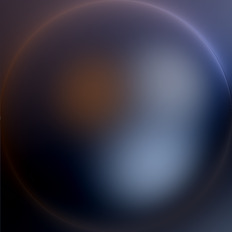

[[1024px](https://github.com/nidorx/matcaps/raw/master/1024/27222B_27222B_677491_484F6A.png)]
[[512px](https://github.com/nidorx/matcaps/raw/master/512/27222B_27222B_677491_484F6A-512px.png)]
[[256px](https://github.com/nidorx/matcaps/raw/master/256/27222B_27222B_677491_484F6A-256px.png)]
[[128px](https://github.com/nidorx/matcaps/raw/master/128/27222B_27222B_677491_484F6A-128px.png)]
[[64px](https://github.com/nidorx/matcaps/raw/master/64/27222B_27222B_677491_484F6A-64px.png)]
[[ZBrush Material (ZMT)](https://github.com/nidorx/matcaps/raw/master/zmt/27222B_27222B_677491_484F6A.zmt)]

---
### 281813_281813_604233_4B3426
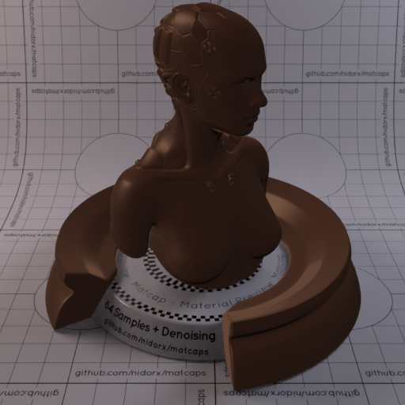
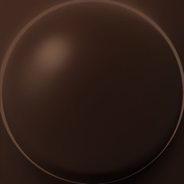

[[1024px](https://github.com/nidorx/matcaps/raw/master/1024/281813_281813_604233_4B3426.png)]
[[512px](https://github.com/nidorx/matcaps/raw/master/512/281813_281813_604233_4B3426-512px.png)]
[[256px](https://github.com/nidorx/matcaps/raw/master/256/281813_281813_604233_4B3426-256px.png)]
[[128px](https://github.com/nidorx/matcaps/raw/master/128/281813_281813_604233_4B3426-128px.png)]
[[64px](https://github.com/nidorx/matcaps/raw/master/64/281813_281813_604233_4B3426-64px.png)]
[[ZBrush Material (ZMT)](https://github.com/nidorx/matcaps/raw/master/zmt/281813_281813_604233_4B3426.zmt)]

---
### 28292A_28292A_D3DAE5_A3ACB8
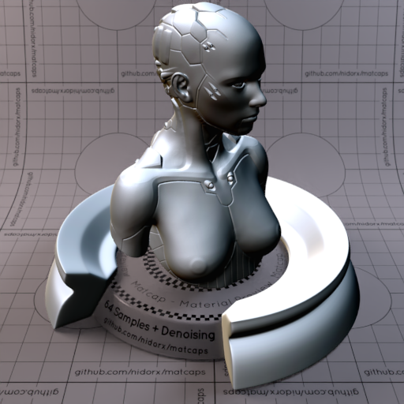

[[1024px](https://github.com/nidorx/matcaps/raw/master/1024/28292A_28292A_D3DAE5_A3ACB8.png)]
[[512px](https://github.com/nidorx/matcaps/raw/master/512/28292A_28292A_D3DAE5_A3ACB8-512px.png)]
[[256px](https://github.com/nidorx/matcaps/raw/master/256/28292A_28292A_D3DAE5_A3ACB8-256px.png)]
[[128px](https://github.com/nidorx/matcaps/raw/master/128/28292A_28292A_D3DAE5_A3ACB8-128px.png)]
[[64px](https://github.com/nidorx/matcaps/raw/master/64/28292A_28292A_D3DAE5_A3ACB8-64px.png)]
[[ZBrush Material (ZMT)](https://github.com/nidorx/matcaps/raw/master/zmt/28292A_28292A_D3DAE5_A3ACB8.zmt)]

---
### 291912_291912_473531_3C2C25
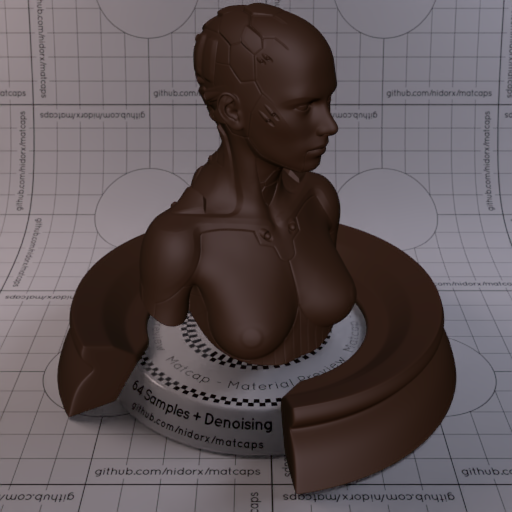
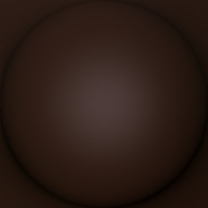

[[1024px](https://github.com/nidorx/matcaps/raw/master/1024/291912_291912_473531_3C2C25.png)]
[[512px](https://github.com/nidorx/matcaps/raw/master/512/291912_291912_473531_3C2C25-512px.png)]
[[256px](https://github.com/nidorx/matcaps/raw/master/256/291912_291912_473531_3C2C25-256px.png)]
[[128px](https://github.com/nidorx/matcaps/raw/master/128/291912_291912_473531_3C2C25-128px.png)]
[[64px](https://github.com/nidorx/matcaps/raw/master/64/291912_291912_473531_3C2C25-64px.png)]
[[ZBrush Material (ZMT)](https://github.com/nidorx/matcaps/raw/master/zmt/291912_291912_473531_3C2C25.zmt)]

---
### 293534_293534_B2BFC5_738289
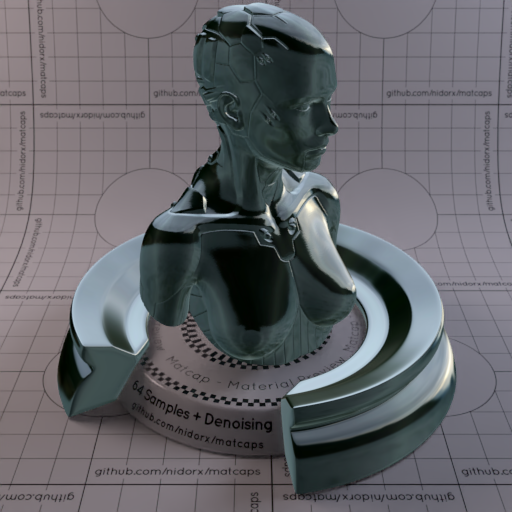

[[1024px](https://github.com/nidorx/matcaps/raw/master/1024/293534_293534_B2BFC5_738289.png)]
[[512px](https://github.com/nidorx/matcaps/raw/master/512/293534_293534_B2BFC5_738289-512px.png)]
[[256px](https://github.com/nidorx/matcaps/raw/master/256/293534_293534_B2BFC5_738289-256px.png)]
[[128px](https://github.com/nidorx/matcaps/raw/master/128/293534_293534_B2BFC5_738289-128px.png)]
[[64px](https://github.com/nidorx/matcaps/raw/master/64/293534_293534_B2BFC5_738289-64px.png)]
[~~ZBrush Material (ZMT)~~]

---
### 293D21_293D21_ABC692_73B255
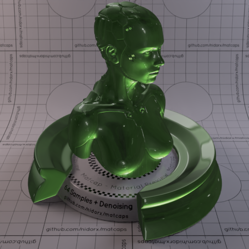

[[1024px](https://github.com/nidorx/matcaps/raw/master/1024/293D21_293D21_ABC692_73B255.png)]
[[512px](https://github.com/nidorx/matcaps/raw/master/512/293D21_293D21_ABC692_73B255-512px.png)]
[[256px](https://github.com/nidorx/matcaps/raw/master/256/293D21_293D21_ABC692_73B255-256px.png)]
[[128px](https://github.com/nidorx/matcaps/raw/master/128/293D21_293D21_ABC692_73B255-128px.png)]
[[64px](https://github.com/nidorx/matcaps/raw/master/64/293D21_293D21_ABC692_73B255-64px.png)]
[[ZBrush Material (ZMT)](https://github.com/nidorx/matcaps/raw/master/zmt/293D21_293D21_ABC692_73B255.zmt)]

---
### 2A2A2A_2A2A2A_B3B3B3_6D6D6D

[[1024px](https://github.com/nidorx/matcaps/raw/master/1024/2A2A2A_2A2A2A_B3B3B3_6D6D6D.png)]
[[512px](https://github.com/nidorx/matcaps/raw/master/512/2A2A2A_2A2A2A_B3B3B3_6D6D6D-512px.png)]
[[256px](https://github.com/nidorx/matcaps/raw/master/256/2A2A2A_2A2A2A_B3B3B3_6D6D6D-256px.png)]
[[128px](https://github.com/nidorx/matcaps/raw/master/128/2A2A2A_2A2A2A_B3B3B3_6D6D6D-128px.png)]
[[64px](https://github.com/nidorx/matcaps/raw/master/64/2A2A2A_2A2A2A_B3B3B3_6D6D6D-64px.png)]
[~~ZBrush Material (ZMT)~~]

---
### 2A2A2A_2A2A2A_DBDBDB_6A6A6A

[[1024px](https://github.com/nidorx/matcaps/raw/master/1024/2A2A2A_2A2A2A_DBDBDB_6A6A6A.png)]
[[512px](https://github.com/nidorx/matcaps/raw/master/512/2A2A2A_2A2A2A_DBDBDB_6A6A6A-512px.png)]
[[256px](https://github.com/nidorx/matcaps/raw/master/256/2A2A2A_2A2A2A_DBDBDB_6A6A6A-256px.png)]
[[128px](https://github.com/nidorx/matcaps/raw/master/128/2A2A2A_2A2A2A_DBDBDB_6A6A6A-128px.png)]
[[64px](https://github.com/nidorx/matcaps/raw/master/64/2A2A2A_2A2A2A_DBDBDB_6A6A6A-64px.png)]
[~~ZBrush Material (ZMT)~~]

---
### 2A2D21_2A2D21_555742_898974
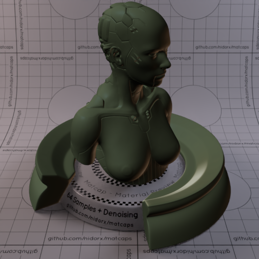

[[1024px](https://github.com/nidorx/matcaps/raw/master/1024/2A2D21_2A2D21_555742_898974.png)]
[[512px](https://github.com/nidorx/matcaps/raw/master/512/2A2D21_2A2D21_555742_898974-512px.png)]
[[256px](https://github.com/nidorx/matcaps/raw/master/256/2A2D21_2A2D21_555742_898974-256px.png)]
[[128px](https://github.com/nidorx/matcaps/raw/master/128/2A2D21_2A2D21_555742_898974-128px.png)]
[[64px](https://github.com/nidorx/matcaps/raw/master/64/2A2D21_2A2D21_555742_898974-64px.png)]
[[ZBrush Material (ZMT)](https://github.com/nidorx/matcaps/raw/master/zmt/2A2D21_2A2D21_555742_898974.zmt)]

---
### 2A4BA7_2A4BA7_1B2D44_1F3768
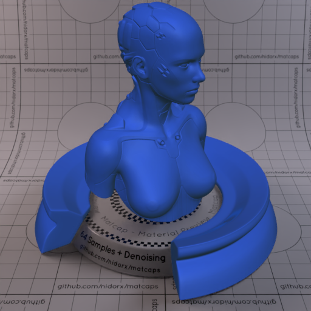
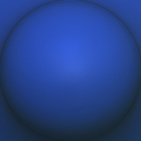

[[1024px](https://github.com/nidorx/matcaps/raw/master/1024/2A4BA7_2A4BA7_1B2D44_1F3768.png)]
[[512px](https://github.com/nidorx/matcaps/raw/master/512/2A4BA7_2A4BA7_1B2D44_1F3768-512px.png)]
[[256px](https://github.com/nidorx/matcaps/raw/master/256/2A4BA7_2A4BA7_1B2D44_1F3768-256px.png)]
[[128px](https://github.com/nidorx/matcaps/raw/master/128/2A4BA7_2A4BA7_1B2D44_1F3768-128px.png)]
[[64px](https://github.com/nidorx/matcaps/raw/master/64/2A4BA7_2A4BA7_1B2D44_1F3768-64px.png)]
[[ZBrush Material (ZMT)](https://github.com/nidorx/matcaps/raw/master/zmt/2A4BA7_2A4BA7_1B2D44_1F3768.zmt)]

---
### 2A6276_2A6276_041218_739BA6

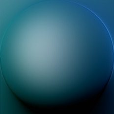

[[1024px](https://github.com/nidorx/matcaps/raw/master/1024/2A6276_2A6276_041218_739BA6.png)]
[[512px](https://github.com/nidorx/matcaps/raw/master/512/2A6276_2A6276_041218_739BA6-512px.png)]
[[256px](https://github.com/nidorx/matcaps/raw/master/256/2A6276_2A6276_041218_739BA6-256px.png)]
[[128px](https://github.com/nidorx/matcaps/raw/master/128/2A6276_2A6276_041218_739BA6-128px.png)]
[[64px](https://github.com/nidorx/matcaps/raw/master/64/2A6276_2A6276_041218_739BA6-64px.png)]
[[ZBrush Material (ZMT)](https://github.com/nidorx/matcaps/raw/master/zmt/2A6276_2A6276_041218_739BA6.zmt)]

---
### 2B2828_2B2828_7B796F_534F4A
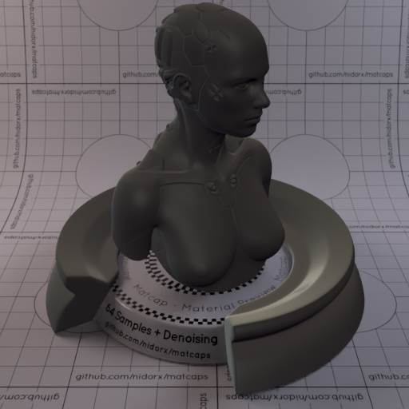

[[1024px](https://github.com/nidorx/matcaps/raw/master/1024/2B2828_2B2828_7B796F_534F4A.png)]
[[512px](https://github.com/nidorx/matcaps/raw/master/512/2B2828_2B2828_7B796F_534F4A-512px.png)]
[[256px](https://github.com/nidorx/matcaps/raw/master/256/2B2828_2B2828_7B796F_534F4A-256px.png)]
[[128px](https://github.com/nidorx/matcaps/raw/master/128/2B2828_2B2828_7B796F_534F4A-128px.png)]
[[64px](https://github.com/nidorx/matcaps/raw/master/64/2B2828_2B2828_7B796F_534F4A-64px.png)]
[[ZBrush Material (ZMT)](https://github.com/nidorx/matcaps/raw/master/zmt/2B2828_2B2828_7B796F_534F4A.zmt)]

---
### 2B2B22_2B2B22_3C3C30_464538

[[1024px](https://github.com/nidorx/matcaps/raw/master/1024/2B2B22_2B2B22_3C3C30_464538.png)]
[[512px](https://github.com/nidorx/matcaps/raw/master/512/2B2B22_2B2B22_3C3C30_464538-512px.png)]
[[256px](https://github.com/nidorx/matcaps/raw/master/256/2B2B22_2B2B22_3C3C30_464538-256px.png)]
[[128px](https://github.com/nidorx/matcaps/raw/master/128/2B2B22_2B2B22_3C3C30_464538-128px.png)]
[[64px](https://github.com/nidorx/matcaps/raw/master/64/2B2B22_2B2B22_3C3C30_464538-64px.png)]
[[ZBrush Material (ZMT)](https://github.com/nidorx/matcaps/raw/master/zmt/2B2B22_2B2B22_3C3C30_464538.zmt)]

---
### 2D2D2A_2D2D2A_74716E_8F8C8C

[[1024px](https://github.com/nidorx/matcaps/raw/master/1024/2D2D2A_2D2D2A_74716E_8F8C8C.png)]
[[512px](https://github.com/nidorx/matcaps/raw/master/512/2D2D2A_2D2D2A_74716E_8F8C8C-512px.png)]
[[256px](https://github.com/nidorx/matcaps/raw/master/256/2D2D2A_2D2D2A_74716E_8F8C8C-256px.png)]
[[128px](https://github.com/nidorx/matcaps/raw/master/128/2D2D2A_2D2D2A_74716E_8F8C8C-128px.png)]
[[64px](https://github.com/nidorx/matcaps/raw/master/64/2D2D2A_2D2D2A_74716E_8F8C8C-64px.png)]
[[ZBrush Material (ZMT)](https://github.com/nidorx/matcaps/raw/master/zmt/2D2D2A_2D2D2A_74716E_8F8C8C.zmt)]

---
### 2D2D2F_2D2D2F_C6C2C5_727176

[[1024px](https://github.com/nidorx/matcaps/raw/master/1024/2D2D2F_2D2D2F_C6C2C5_727176.png)]
[[512px](https://github.com/nidorx/matcaps/raw/master/512/2D2D2F_2D2D2F_C6C2C5_727176-512px.png)]
[[256px](https://github.com/nidorx/matcaps/raw/master/256/2D2D2F_2D2D2F_C6C2C5_727176-256px.png)]
[[128px](https://github.com/nidorx/matcaps/raw/master/128/2D2D2F_2D2D2F_C6C2C5_727176-128px.png)]
[[64px](https://github.com/nidorx/matcaps/raw/master/64/2D2D2F_2D2D2F_C6C2C5_727176-64px.png)]
[[ZBrush Material (ZMT)](https://github.com/nidorx/matcaps/raw/master/zmt/2D2D2F_2D2D2F_C6C2C5_727176.zmt)]

---
### 2D8753_2D8753_5CD6A5_45BB82
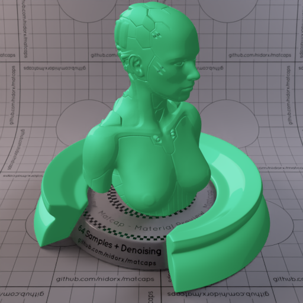

[[1024px](https://github.com/nidorx/matcaps/raw/master/1024/2D8753_2D8753_5CD6A5_45BB82.png)]
[[512px](https://github.com/nidorx/matcaps/raw/master/512/2D8753_2D8753_5CD6A5_45BB82-512px.png)]
[[256px](https://github.com/nidorx/matcaps/raw/master/256/2D8753_2D8753_5CD6A5_45BB82-256px.png)]
[[128px](https://github.com/nidorx/matcaps/raw/master/128/2D8753_2D8753_5CD6A5_45BB82-128px.png)]
[[64px](https://github.com/nidorx/matcaps/raw/master/64/2D8753_2D8753_5CD6A5_45BB82-64px.png)]
[~~ZBrush Material (ZMT)~~]

---
### 2E2E2D_2E2E2D_7D7C76_A3A39F

[[1024px](https://github.com/nidorx/matcaps/raw/master/1024/2E2E2D_2E2E2D_7D7C76_A3A39F.png)]
[[512px](https://github.com/nidorx/matcaps/raw/master/512/2E2E2D_2E2E2D_7D7C76_A3A39F-512px.png)]
[[256px](https://github.com/nidorx/matcaps/raw/master/256/2E2E2D_2E2E2D_7D7C76_A3A39F-256px.png)]
[[128px](https://github.com/nidorx/matcaps/raw/master/128/2E2E2D_2E2E2D_7D7C76_A3A39F-128px.png)]
[[64px](https://github.com/nidorx/matcaps/raw/master/64/2E2E2D_2E2E2D_7D7C76_A3A39F-64px.png)]
[[ZBrush Material (ZMT)](https://github.com/nidorx/matcaps/raw/master/zmt/2E2E2D_2E2E2D_7D7C76_A3A39F.zmt)]

---
### 2E763A_2E763A_78A0B7_B3D1CF
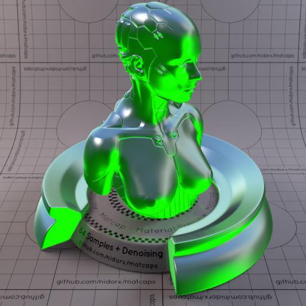

[[1024px](https://github.com/nidorx/matcaps/raw/master/1024/2E763A_2E763A_78A0B7_B3D1CF.png)]
[[512px](https://github.com/nidorx/matcaps/raw/master/512/2E763A_2E763A_78A0B7_B3D1CF-512px.png)]
[[256px](https://github.com/nidorx/matcaps/raw/master/256/2E763A_2E763A_78A0B7_B3D1CF-256px.png)]
[[128px](https://github.com/nidorx/matcaps/raw/master/128/2E763A_2E763A_78A0B7_B3D1CF-128px.png)]
[[64px](https://github.com/nidorx/matcaps/raw/master/64/2E763A_2E763A_78A0B7_B3D1CF-64px.png)]
[[ZBrush Material (ZMT)](https://github.com/nidorx/matcaps/raw/master/zmt/2E763A_2E763A_78A0B7_B3D1CF.zmt)]

---
### 2EAC9E_2EAC9E_61EBE3_4DDDD1

[[1024px](https://github.com/nidorx/matcaps/raw/master/1024/2EAC9E_2EAC9E_61EBE3_4DDDD1.png)]
[[512px](https://github.com/nidorx/matcaps/raw/master/512/2EAC9E_2EAC9E_61EBE3_4DDDD1-512px.png)]
[[256px](https://github.com/nidorx/matcaps/raw/master/256/2EAC9E_2EAC9E_61EBE3_4DDDD1-256px.png)]
[[128px](https://github.com/nidorx/matcaps/raw/master/128/2EAC9E_2EAC9E_61EBE3_4DDDD1-128px.png)]
[[64px](https://github.com/nidorx/matcaps/raw/master/64/2EAC9E_2EAC9E_61EBE3_4DDDD1-64px.png)]
[~~ZBrush Material (ZMT)~~]

---