Huge library of matcap PNG textures organized by color

## Navigation
* [Home](/)
* [Page 1](PAGE-1.md)
* [Page 2](PAGE-2.md)
* Page 3
* [Page 4](PAGE-4.md)
* [Page 5](PAGE-5.md)
* [Page 6](PAGE-6.md)
* [Page 7](PAGE-7.md)
* [Page 8](PAGE-8.md)
## Page 9 Matcaps
### 562D2A_562D2A_2E1615_7E4945

[[1024px](https://github.com/nidorx/matcaps/raw/master/1024/562D2A_562D2A_2E1615_7E4945.png)]
[[512px](https://github.com/nidorx/matcaps/raw/master/512/562D2A_562D2A_2E1615_7E4945-512px.png)]
[[256px](https://github.com/nidorx/matcaps/raw/master/256/562D2A_562D2A_2E1615_7E4945-256px.png)]
[[128px](https://github.com/nidorx/matcaps/raw/master/128/562D2A_562D2A_2E1615_7E4945-128px.png)]
[[64px](https://github.com/nidorx/matcaps/raw/master/64/562D2A_562D2A_2E1615_7E4945-64px.png)]
[[ZBrush Material (ZMT)](https://github.com/nidorx/matcaps/raw/master/zmt/562D2A_562D2A_2E1615_7E4945.zmt)]

---
### 57553F_57553F_C6C3AF_8C8768

[[1024px](https://github.com/nidorx/matcaps/raw/master/1024/57553F_57553F_C6C3AF_8C8768.png)]
[[512px](https://github.com/nidorx/matcaps/raw/master/512/57553F_57553F_C6C3AF_8C8768-512px.png)]
[[256px](https://github.com/nidorx/matcaps/raw/master/256/57553F_57553F_C6C3AF_8C8768-256px.png)]
[[128px](https://github.com/nidorx/matcaps/raw/master/128/57553F_57553F_C6C3AF_8C8768-128px.png)]
[[64px](https://github.com/nidorx/matcaps/raw/master/64/57553F_57553F_C6C3AF_8C8768-64px.png)]
[[ZBrush Material (ZMT)](https://github.com/nidorx/matcaps/raw/master/zmt/57553F_57553F_C6C3AF_8C8768.zmt)]

---
### 57583E_57583E_969788_292920

[[1024px](https://github.com/nidorx/matcaps/raw/master/1024/57583E_57583E_969788_292920.png)]
[[512px](https://github.com/nidorx/matcaps/raw/master/512/57583E_57583E_969788_292920-512px.png)]
[[256px](https://github.com/nidorx/matcaps/raw/master/256/57583E_57583E_969788_292920-256px.png)]
[[128px](https://github.com/nidorx/matcaps/raw/master/128/57583E_57583E_969788_292920-128px.png)]
[[64px](https://github.com/nidorx/matcaps/raw/master/64/57583E_57583E_969788_292920-64px.png)]
[[ZBrush Material (ZMT)](https://github.com/nidorx/matcaps/raw/master/zmt/57583E_57583E_969788_292920.zmt)]

---
### 582410_582410_83381A_1F0C04

[[1024px](https://github.com/nidorx/matcaps/raw/master/1024/582410_582410_83381A_1F0C04.png)]
[[512px](https://github.com/nidorx/matcaps/raw/master/512/582410_582410_83381A_1F0C04-512px.png)]
[[256px](https://github.com/nidorx/matcaps/raw/master/256/582410_582410_83381A_1F0C04-256px.png)]
[[128px](https://github.com/nidorx/matcaps/raw/master/128/582410_582410_83381A_1F0C04-128px.png)]
[[64px](https://github.com/nidorx/matcaps/raw/master/64/582410_582410_83381A_1F0C04-64px.png)]
[[ZBrush Material (ZMT)](https://github.com/nidorx/matcaps/raw/master/zmt/582410_582410_83381A_1F0C04.zmt)]

---
### 586A51_586A51_CCD5AA_8C9675

[[1024px](https://github.com/nidorx/matcaps/raw/master/1024/586A51_586A51_CCD5AA_8C9675.png)]
[[512px](https://github.com/nidorx/matcaps/raw/master/512/586A51_586A51_CCD5AA_8C9675-512px.png)]
[[256px](https://github.com/nidorx/matcaps/raw/master/256/586A51_586A51_CCD5AA_8C9675-256px.png)]
[[128px](https://github.com/nidorx/matcaps/raw/master/128/586A51_586A51_CCD5AA_8C9675-128px.png)]
[[64px](https://github.com/nidorx/matcaps/raw/master/64/586A51_586A51_CCD5AA_8C9675-64px.png)]
[[ZBrush Material (ZMT)](https://github.com/nidorx/matcaps/raw/master/zmt/586A51_586A51_CCD5AA_8C9675.zmt)]

---
### 593E2C_593E2C_E5D8A9_BC9F79

[[1024px](https://github.com/nidorx/matcaps/raw/master/1024/593E2C_593E2C_E5D8A9_BC9F79.png)]
[[512px](https://github.com/nidorx/matcaps/raw/master/512/593E2C_593E2C_E5D8A9_BC9F79-512px.png)]
[[256px](https://github.com/nidorx/matcaps/raw/master/256/593E2C_593E2C_E5D8A9_BC9F79-256px.png)]
[[128px](https://github.com/nidorx/matcaps/raw/master/128/593E2C_593E2C_E5D8A9_BC9F79-128px.png)]
[[64px](https://github.com/nidorx/matcaps/raw/master/64/593E2C_593E2C_E5D8A9_BC9F79-64px.png)]
[[ZBrush Material (ZMT)](https://github.com/nidorx/matcaps/raw/master/zmt/593E2C_593E2C_E5D8A9_BC9F79.zmt)]

---
### 595356_595356_CDBFC6_AA9DA3

[[1024px](https://github.com/nidorx/matcaps/raw/master/1024/595356_595356_CDBFC6_AA9DA3.png)]
[[512px](https://github.com/nidorx/matcaps/raw/master/512/595356_595356_CDBFC6_AA9DA3-512px.png)]
[[256px](https://github.com/nidorx/matcaps/raw/master/256/595356_595356_CDBFC6_AA9DA3-256px.png)]
[[128px](https://github.com/nidorx/matcaps/raw/master/128/595356_595356_CDBFC6_AA9DA3-128px.png)]
[[64px](https://github.com/nidorx/matcaps/raw/master/64/595356_595356_CDBFC6_AA9DA3-64px.png)]
[[ZBrush Material (ZMT)](https://github.com/nidorx/matcaps/raw/master/zmt/595356_595356_CDBFC6_AA9DA3.zmt)]

---
### 596773_596773_B3C6CE_98AFB9
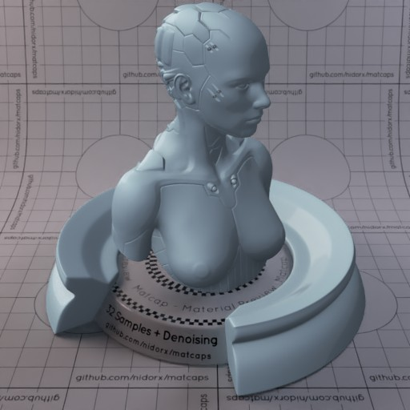

[[1024px](https://github.com/nidorx/matcaps/raw/master/1024/596773_596773_B3C6CE_98AFB9.png)]
[[512px](https://github.com/nidorx/matcaps/raw/master/512/596773_596773_B3C6CE_98AFB9-512px.png)]
[[256px](https://github.com/nidorx/matcaps/raw/master/256/596773_596773_B3C6CE_98AFB9-256px.png)]
[[128px](https://github.com/nidorx/matcaps/raw/master/128/596773_596773_B3C6CE_98AFB9-128px.png)]
[[64px](https://github.com/nidorx/matcaps/raw/master/64/596773_596773_B3C6CE_98AFB9-64px.png)]
[~~ZBrush Material (ZMT)~~]

---
### 5A492B_5A492B_DEC583_987D4D

[[1024px](https://github.com/nidorx/matcaps/raw/master/1024/5A492B_5A492B_DEC583_987D4D.png)]
[[512px](https://github.com/nidorx/matcaps/raw/master/512/5A492B_5A492B_DEC583_987D4D-512px.png)]
[[256px](https://github.com/nidorx/matcaps/raw/master/256/5A492B_5A492B_DEC583_987D4D-256px.png)]
[[128px](https://github.com/nidorx/matcaps/raw/master/128/5A492B_5A492B_DEC583_987D4D-128px.png)]
[[64px](https://github.com/nidorx/matcaps/raw/master/64/5A492B_5A492B_DEC583_987D4D-64px.png)]
[[ZBrush Material (ZMT)](https://github.com/nidorx/matcaps/raw/master/zmt/5A492B_5A492B_DEC583_987D4D.zmt)]

---
### 5B4CBC_5B4CBC_B59AF2_9B84EB
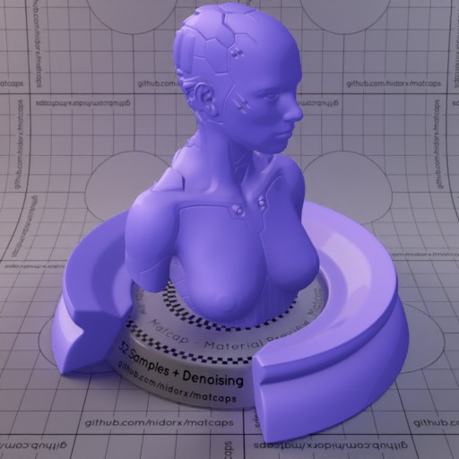

[[1024px](https://github.com/nidorx/matcaps/raw/master/1024/5B4CBC_5B4CBC_B59AF2_9B84EB.png)]
[[512px](https://github.com/nidorx/matcaps/raw/master/512/5B4CBC_5B4CBC_B59AF2_9B84EB-512px.png)]
[[256px](https://github.com/nidorx/matcaps/raw/master/256/5B4CBC_5B4CBC_B59AF2_9B84EB-256px.png)]
[[128px](https://github.com/nidorx/matcaps/raw/master/128/5B4CBC_5B4CBC_B59AF2_9B84EB-128px.png)]
[[64px](https://github.com/nidorx/matcaps/raw/master/64/5B4CBC_5B4CBC_B59AF2_9B84EB-64px.png)]
[~~ZBrush Material (ZMT)~~]

---
### 5B5428_5B5428_C5A052_A28B46

[[1024px](https://github.com/nidorx/matcaps/raw/master/1024/5B5428_5B5428_C5A052_A28B46.png)]
[[512px](https://github.com/nidorx/matcaps/raw/master/512/5B5428_5B5428_C5A052_A28B46-512px.png)]
[[256px](https://github.com/nidorx/matcaps/raw/master/256/5B5428_5B5428_C5A052_A28B46-256px.png)]
[[128px](https://github.com/nidorx/matcaps/raw/master/128/5B5428_5B5428_C5A052_A28B46-128px.png)]
[[64px](https://github.com/nidorx/matcaps/raw/master/64/5B5428_5B5428_C5A052_A28B46-64px.png)]
[[ZBrush Material (ZMT)](https://github.com/nidorx/matcaps/raw/master/zmt/5B5428_5B5428_C5A052_A28B46.zmt)]

---
### 5C045C_5C045C_BD0DBD_930493

[[1024px](https://github.com/nidorx/matcaps/raw/master/1024/5C045C_5C045C_BD0DBD_930493.png)]
[[512px](https://github.com/nidorx/matcaps/raw/master/512/5C045C_5C045C_BD0DBD_930493-512px.png)]
[[256px](https://github.com/nidorx/matcaps/raw/master/256/5C045C_5C045C_BD0DBD_930493-256px.png)]
[[128px](https://github.com/nidorx/matcaps/raw/master/128/5C045C_5C045C_BD0DBD_930493-128px.png)]
[[64px](https://github.com/nidorx/matcaps/raw/master/64/5C045C_5C045C_BD0DBD_930493-64px.png)]
[~~ZBrush Material (ZMT)~~]

---
### 5C2E0C_5C2E0C_C36924_9F4F14
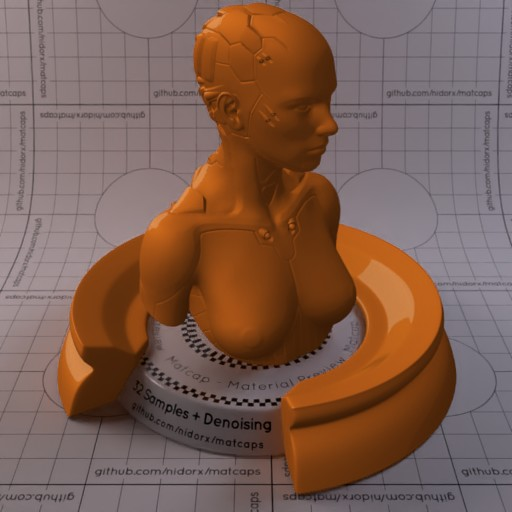

[[1024px](https://github.com/nidorx/matcaps/raw/master/1024/5C2E0C_5C2E0C_C36924_9F4F14.png)]
[[512px](https://github.com/nidorx/matcaps/raw/master/512/5C2E0C_5C2E0C_C36924_9F4F14-512px.png)]
[[256px](https://github.com/nidorx/matcaps/raw/master/256/5C2E0C_5C2E0C_C36924_9F4F14-256px.png)]
[[128px](https://github.com/nidorx/matcaps/raw/master/128/5C2E0C_5C2E0C_C36924_9F4F14-128px.png)]
[[64px](https://github.com/nidorx/matcaps/raw/master/64/5C2E0C_5C2E0C_C36924_9F4F14-64px.png)]
[~~ZBrush Material (ZMT)~~]

---
### 5C5C04_5C5C04_BDBD0D_939304
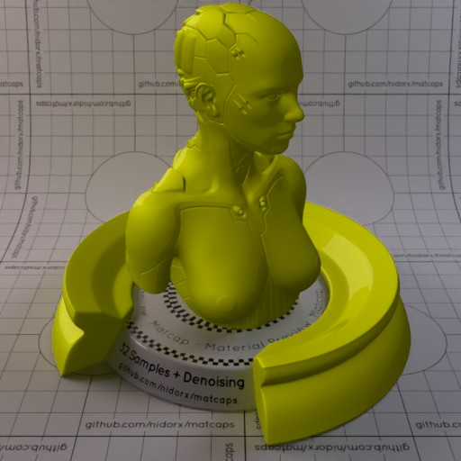

[[1024px](https://github.com/nidorx/matcaps/raw/master/1024/5C5C04_5C5C04_BDBD0D_939304.png)]
[[512px](https://github.com/nidorx/matcaps/raw/master/512/5C5C04_5C5C04_BDBD0D_939304-512px.png)]
[[256px](https://github.com/nidorx/matcaps/raw/master/256/5C5C04_5C5C04_BDBD0D_939304-256px.png)]
[[128px](https://github.com/nidorx/matcaps/raw/master/128/5C5C04_5C5C04_BDBD0D_939304-128px.png)]
[[64px](https://github.com/nidorx/matcaps/raw/master/64/5C5C04_5C5C04_BDBD0D_939304-64px.png)]
[~~ZBrush Material (ZMT)~~]

---
### 5D5D5D_5D5D5D_CDCDCD_232323

[[1024px](https://github.com/nidorx/matcaps/raw/master/1024/5D5D5D_5D5D5D_CDCDCD_232323.png)]
[[512px](https://github.com/nidorx/matcaps/raw/master/512/5D5D5D_5D5D5D_CDCDCD_232323-512px.png)]
[[256px](https://github.com/nidorx/matcaps/raw/master/256/5D5D5D_5D5D5D_CDCDCD_232323-256px.png)]
[[128px](https://github.com/nidorx/matcaps/raw/master/128/5D5D5D_5D5D5D_CDCDCD_232323-128px.png)]
[[64px](https://github.com/nidorx/matcaps/raw/master/64/5D5D5D_5D5D5D_CDCDCD_232323-64px.png)]
[[ZBrush Material (ZMT)](https://github.com/nidorx/matcaps/raw/master/zmt/5D5D5D_5D5D5D_CDCDCD_232323.zmt)]

---
### 5D5E5A_5D5E5A_A1A29B_2A2927

[[1024px](https://github.com/nidorx/matcaps/raw/master/1024/5D5E5A_5D5E5A_A1A29B_2A2927.png)]
[[512px](https://github.com/nidorx/matcaps/raw/master/512/5D5E5A_5D5E5A_A1A29B_2A2927-512px.png)]
[[256px](https://github.com/nidorx/matcaps/raw/master/256/5D5E5A_5D5E5A_A1A29B_2A2927-256px.png)]
[[128px](https://github.com/nidorx/matcaps/raw/master/128/5D5E5A_5D5E5A_A1A29B_2A2927-128px.png)]
[[64px](https://github.com/nidorx/matcaps/raw/master/64/5D5E5A_5D5E5A_A1A29B_2A2927-64px.png)]
[[ZBrush Material (ZMT)](https://github.com/nidorx/matcaps/raw/master/zmt/5D5E5A_5D5E5A_A1A29B_2A2927.zmt)]

---
### 5ECBA4_5ECBA4_BCFAE7_92EED0
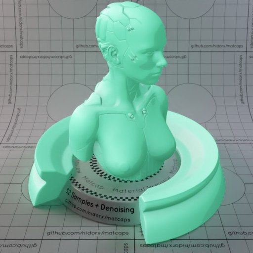

[[1024px](https://github.com/nidorx/matcaps/raw/master/1024/5ECBA4_5ECBA4_BCFAE7_92EED0.png)]
[[512px](https://github.com/nidorx/matcaps/raw/master/512/5ECBA4_5ECBA4_BCFAE7_92EED0-512px.png)]
[[256px](https://github.com/nidorx/matcaps/raw/master/256/5ECBA4_5ECBA4_BCFAE7_92EED0-256px.png)]
[[128px](https://github.com/nidorx/matcaps/raw/master/128/5ECBA4_5ECBA4_BCFAE7_92EED0-128px.png)]
[[64px](https://github.com/nidorx/matcaps/raw/master/64/5ECBA4_5ECBA4_BCFAE7_92EED0-64px.png)]
[~~ZBrush Material (ZMT)~~]

---
### 5F4F50_5F4F50_A18E8E_8C7C7B

[[1024px](https://github.com/nidorx/matcaps/raw/master/1024/5F4F50_5F4F50_A18E8E_8C7C7B.png)]
[[512px](https://github.com/nidorx/matcaps/raw/master/512/5F4F50_5F4F50_A18E8E_8C7C7B-512px.png)]
[[256px](https://github.com/nidorx/matcaps/raw/master/256/5F4F50_5F4F50_A18E8E_8C7C7B-256px.png)]
[[128px](https://github.com/nidorx/matcaps/raw/master/128/5F4F50_5F4F50_A18E8E_8C7C7B-128px.png)]
[[64px](https://github.com/nidorx/matcaps/raw/master/64/5F4F50_5F4F50_A18E8E_8C7C7B-64px.png)]
[[ZBrush Material (ZMT)](https://github.com/nidorx/matcaps/raw/master/zmt/5F4F50_5F4F50_A18E8E_8C7C7B.zmt)]

---
### 5F5F5F_5F5F5F_BDBDBD_A4A4A4
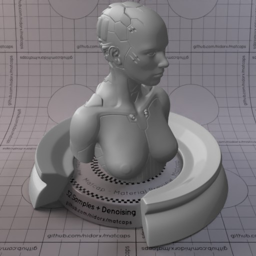
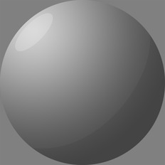

[[1024px](https://github.com/nidorx/matcaps/raw/master/1024/5F5F5F_5F5F5F_BDBDBD_A4A4A4.png)]
[[512px](https://github.com/nidorx/matcaps/raw/master/512/5F5F5F_5F5F5F_BDBDBD_A4A4A4-512px.png)]
[[256px](https://github.com/nidorx/matcaps/raw/master/256/5F5F5F_5F5F5F_BDBDBD_A4A4A4-256px.png)]
[[128px](https://github.com/nidorx/matcaps/raw/master/128/5F5F5F_5F5F5F_BDBDBD_A4A4A4-128px.png)]
[[64px](https://github.com/nidorx/matcaps/raw/master/64/5F5F5F_5F5F5F_BDBDBD_A4A4A4-64px.png)]
[~~ZBrush Material (ZMT)~~]

---
### 604A30_604A30_DC9065_212C14

[[1024px](https://github.com/nidorx/matcaps/raw/master/1024/604A30_604A30_DC9065_212C14.png)]
[[512px](https://github.com/nidorx/matcaps/raw/master/512/604A30_604A30_DC9065_212C14-512px.png)]
[[256px](https://github.com/nidorx/matcaps/raw/master/256/604A30_604A30_DC9065_212C14-256px.png)]
[[128px](https://github.com/nidorx/matcaps/raw/master/128/604A30_604A30_DC9065_212C14-128px.png)]
[[64px](https://github.com/nidorx/matcaps/raw/master/64/604A30_604A30_DC9065_212C14-64px.png)]
[[ZBrush Material (ZMT)](https://github.com/nidorx/matcaps/raw/master/zmt/604A30_604A30_DC9065_212C14.zmt)]

---
### 60534A_60534A_211813_9B948E

[[1024px](https://github.com/nidorx/matcaps/raw/master/1024/60534A_60534A_211813_9B948E.png)]
[[512px](https://github.com/nidorx/matcaps/raw/master/512/60534A_60534A_211813_9B948E-512px.png)]
[[256px](https://github.com/nidorx/matcaps/raw/master/256/60534A_60534A_211813_9B948E-256px.png)]
[[128px](https://github.com/nidorx/matcaps/raw/master/128/60534A_60534A_211813_9B948E-128px.png)]
[[64px](https://github.com/nidorx/matcaps/raw/master/64/60534A_60534A_211813_9B948E-64px.png)]
[[ZBrush Material (ZMT)](https://github.com/nidorx/matcaps/raw/master/zmt/60534A_60534A_211813_9B948E.zmt)]

---
### 605352_605352_E9CCC5_C7A8A3

[[1024px](https://github.com/nidorx/matcaps/raw/master/1024/605352_605352_E9CCC5_C7A8A3.png)]
[[512px](https://github.com/nidorx/matcaps/raw/master/512/605352_605352_E9CCC5_C7A8A3-512px.png)]
[[256px](https://github.com/nidorx/matcaps/raw/master/256/605352_605352_E9CCC5_C7A8A3-256px.png)]
[[128px](https://github.com/nidorx/matcaps/raw/master/128/605352_605352_E9CCC5_C7A8A3-128px.png)]
[[64px](https://github.com/nidorx/matcaps/raw/master/64/605352_605352_E9CCC5_C7A8A3-64px.png)]
[[ZBrush Material (ZMT)](https://github.com/nidorx/matcaps/raw/master/zmt/605352_605352_E9CCC5_C7A8A3.zmt)]

---
### 624541_624541_FCD0C6_E4A19A

[[1024px](https://github.com/nidorx/matcaps/raw/master/1024/624541_624541_FCD0C6_E4A19A.png)]
[[512px](https://github.com/nidorx/matcaps/raw/master/512/624541_624541_FCD0C6_E4A19A-512px.png)]
[[256px](https://github.com/nidorx/matcaps/raw/master/256/624541_624541_FCD0C6_E4A19A-256px.png)]
[[128px](https://github.com/nidorx/matcaps/raw/master/128/624541_624541_FCD0C6_E4A19A-128px.png)]
[[64px](https://github.com/nidorx/matcaps/raw/master/64/624541_624541_FCD0C6_E4A19A-64px.png)]
[[ZBrush Material (ZMT)](https://github.com/nidorx/matcaps/raw/master/zmt/624541_624541_FCD0C6_E4A19A.zmt)]

---
### 626A57_626A57_3B3F33_7D8973

[[1024px](https://github.com/nidorx/matcaps/raw/master/1024/626A57_626A57_3B3F33_7D8973.png)]
[[512px](https://github.com/nidorx/matcaps/raw/master/512/626A57_626A57_3B3F33_7D8973-512px.png)]
[[256px](https://github.com/nidorx/matcaps/raw/master/256/626A57_626A57_3B3F33_7D8973-256px.png)]
[[128px](https://github.com/nidorx/matcaps/raw/master/128/626A57_626A57_3B3F33_7D8973-128px.png)]
[[64px](https://github.com/nidorx/matcaps/raw/master/64/626A57_626A57_3B3F33_7D8973-64px.png)]
[[ZBrush Material (ZMT)](https://github.com/nidorx/matcaps/raw/master/zmt/626A57_626A57_3B3F33_7D8973.zmt)]

---
### 627D72_627D72_A6CAAA_202C28

[[1024px](https://github.com/nidorx/matcaps/raw/master/1024/627D72_627D72_A6CAAA_202C28.png)]
[[512px](https://github.com/nidorx/matcaps/raw/master/512/627D72_627D72_A6CAAA_202C28-512px.png)]
[[256px](https://github.com/nidorx/matcaps/raw/master/256/627D72_627D72_A6CAAA_202C28-256px.png)]
[[128px](https://github.com/nidorx/matcaps/raw/master/128/627D72_627D72_A6CAAA_202C28-128px.png)]
[[64px](https://github.com/nidorx/matcaps/raw/master/64/627D72_627D72_A6CAAA_202C28-64px.png)]
[[ZBrush Material (ZMT)](https://github.com/nidorx/matcaps/raw/master/zmt/627D72_627D72_A6CAAA_202C28.zmt)]

---
### 630463_630463_C30CC3_9B049B
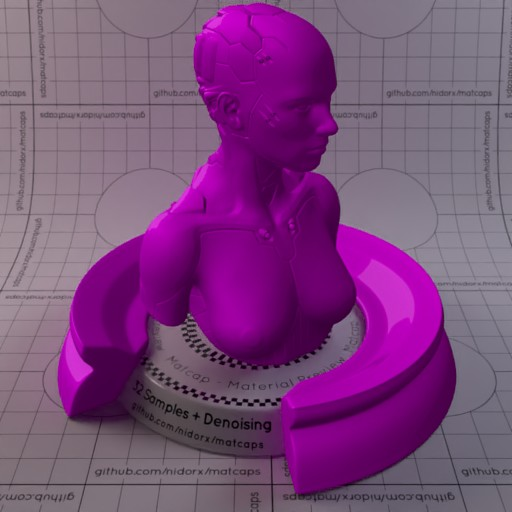

[[1024px](https://github.com/nidorx/matcaps/raw/master/1024/630463_630463_C30CC3_9B049B.png)]
[[512px](https://github.com/nidorx/matcaps/raw/master/512/630463_630463_C30CC3_9B049B-512px.png)]
[[256px](https://github.com/nidorx/matcaps/raw/master/256/630463_630463_C30CC3_9B049B-256px.png)]
[[128px](https://github.com/nidorx/matcaps/raw/master/128/630463_630463_C30CC3_9B049B-128px.png)]
[[64px](https://github.com/nidorx/matcaps/raw/master/64/630463_630463_C30CC3_9B049B-64px.png)]
[~~ZBrush Material (ZMT)~~]

---
### 63584B_63584B_E6E0D6_A8A092-1

[[1024px](https://github.com/nidorx/matcaps/raw/master/1024/63584B_63584B_E6E0D6_A8A092-1.png)]
[[512px](https://github.com/nidorx/matcaps/raw/master/512/63584B_63584B_E6E0D6_A8A092-1-512px.png)]
[[256px](https://github.com/nidorx/matcaps/raw/master/256/63584B_63584B_E6E0D6_A8A092-1-256px.png)]
[[128px](https://github.com/nidorx/matcaps/raw/master/128/63584B_63584B_E6E0D6_A8A092-1-128px.png)]
[[64px](https://github.com/nidorx/matcaps/raw/master/64/63584B_63584B_E6E0D6_A8A092-1-64px.png)]
[~~ZBrush Material (ZMT)~~]

---
### 63584B_63584B_E6E0D6_A8A092

[[1024px](https://github.com/nidorx/matcaps/raw/master/1024/63584B_63584B_E6E0D6_A8A092.png)]
[[512px](https://github.com/nidorx/matcaps/raw/master/512/63584B_63584B_E6E0D6_A8A092-512px.png)]
[[256px](https://github.com/nidorx/matcaps/raw/master/256/63584B_63584B_E6E0D6_A8A092-256px.png)]
[[128px](https://github.com/nidorx/matcaps/raw/master/128/63584B_63584B_E6E0D6_A8A092-128px.png)]
[[64px](https://github.com/nidorx/matcaps/raw/master/64/63584B_63584B_E6E0D6_A8A092-64px.png)]
[[ZBrush Material (ZMT)](https://github.com/nidorx/matcaps/raw/master/zmt/63584B_63584B_E6E0D6_A8A092.zmt)]

---
### 636D6C_636D6C_D4E7ED_ABBCC4

[[1024px](https://github.com/nidorx/matcaps/raw/master/1024/636D6C_636D6C_D4E7ED_ABBCC4.png)]
[[512px](https://github.com/nidorx/matcaps/raw/master/512/636D6C_636D6C_D4E7ED_ABBCC4-512px.png)]
[[256px](https://github.com/nidorx/matcaps/raw/master/256/636D6C_636D6C_D4E7ED_ABBCC4-256px.png)]
[[128px](https://github.com/nidorx/matcaps/raw/master/128/636D6C_636D6C_D4E7ED_ABBCC4-128px.png)]
[[64px](https://github.com/nidorx/matcaps/raw/master/64/636D6C_636D6C_D4E7ED_ABBCC4-64px.png)]
[~~ZBrush Material (ZMT)~~]

---
### 65A0BA_65A0BA_C3E4F1_A7D5E6

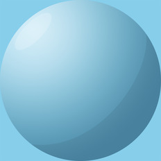

[[1024px](https://github.com/nidorx/matcaps/raw/master/1024/65A0BA_65A0BA_C3E4F1_A7D5E6.png)]
[[512px](https://github.com/nidorx/matcaps/raw/master/512/65A0BA_65A0BA_C3E4F1_A7D5E6-512px.png)]
[[256px](https://github.com/nidorx/matcaps/raw/master/256/65A0BA_65A0BA_C3E4F1_A7D5E6-256px.png)]
[[128px](https://github.com/nidorx/matcaps/raw/master/128/65A0BA_65A0BA_C3E4F1_A7D5E6-128px.png)]
[[64px](https://github.com/nidorx/matcaps/raw/master/64/65A0BA_65A0BA_C3E4F1_A7D5E6-64px.png)]
[~~ZBrush Material (ZMT)~~]

---
### 65A0C7_65A0C7_C3E4F8_A7D5EF-1

[[1024px](https://github.com/nidorx/matcaps/raw/master/1024/65A0C7_65A0C7_C3E4F8_A7D5EF-1.png)]
[[512px](https://github.com/nidorx/matcaps/raw/master/512/65A0C7_65A0C7_C3E4F8_A7D5EF-1-512px.png)]
[[256px](https://github.com/nidorx/matcaps/raw/master/256/65A0C7_65A0C7_C3E4F8_A7D5EF-1-256px.png)]
[[128px](https://github.com/nidorx/matcaps/raw/master/128/65A0C7_65A0C7_C3E4F8_A7D5EF-1-128px.png)]
[[64px](https://github.com/nidorx/matcaps/raw/master/64/65A0C7_65A0C7_C3E4F8_A7D5EF-1-64px.png)]
[~~ZBrush Material (ZMT)~~]

---
### 65A0C7_65A0C7_C3E4F8_A7D5EF
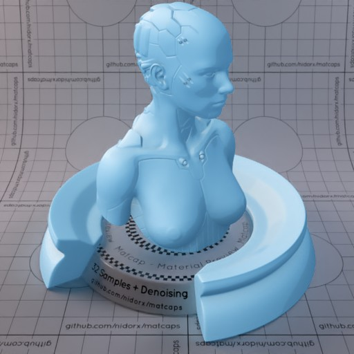

[[1024px](https://github.com/nidorx/matcaps/raw/master/1024/65A0C7_65A0C7_C3E4F8_A7D5EF.png)]
[[512px](https://github.com/nidorx/matcaps/raw/master/512/65A0C7_65A0C7_C3E4F8_A7D5EF-512px.png)]
[[256px](https://github.com/nidorx/matcaps/raw/master/256/65A0C7_65A0C7_C3E4F8_A7D5EF-256px.png)]
[[128px](https://github.com/nidorx/matcaps/raw/master/128/65A0C7_65A0C7_C3E4F8_A7D5EF-128px.png)]
[[64px](https://github.com/nidorx/matcaps/raw/master/64/65A0C7_65A0C7_C3E4F8_A7D5EF-64px.png)]
[~~ZBrush Material (ZMT)~~]

---
### 666864_666864_B3B4AB_2F2F2C

[[1024px](https://github.com/nidorx/matcaps/raw/master/1024/666864_666864_B3B4AB_2F2F2C.png)]
[[512px](https://github.com/nidorx/matcaps/raw/master/512/666864_666864_B3B4AB_2F2F2C-512px.png)]
[[256px](https://github.com/nidorx/matcaps/raw/master/256/666864_666864_B3B4AB_2F2F2C-256px.png)]
[[128px](https://github.com/nidorx/matcaps/raw/master/128/666864_666864_B3B4AB_2F2F2C-128px.png)]
[[64px](https://github.com/nidorx/matcaps/raw/master/64/666864_666864_B3B4AB_2F2F2C-64px.png)]
[[ZBrush Material (ZMT)](https://github.com/nidorx/matcaps/raw/master/zmt/666864_666864_B3B4AB_2F2F2C.zmt)]

---
### 678E67_678E67_C4D9C4_ACC8AC
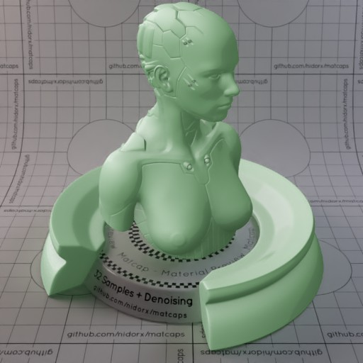
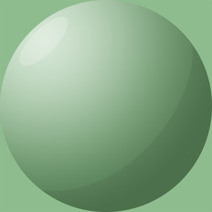

[[1024px](https://github.com/nidorx/matcaps/raw/master/1024/678E67_678E67_C4D9C4_ACC8AC.png)]
[[512px](https://github.com/nidorx/matcaps/raw/master/512/678E67_678E67_C4D9C4_ACC8AC-512px.png)]
[[256px](https://github.com/nidorx/matcaps/raw/master/256/678E67_678E67_C4D9C4_ACC8AC-256px.png)]
[[128px](https://github.com/nidorx/matcaps/raw/master/128/678E67_678E67_C4D9C4_ACC8AC-128px.png)]
[[64px](https://github.com/nidorx/matcaps/raw/master/64/678E67_678E67_C4D9C4_ACC8AC-64px.png)]
[~~ZBrush Material (ZMT)~~]

---
### 68049F_68049F_C90DE6_A404CF
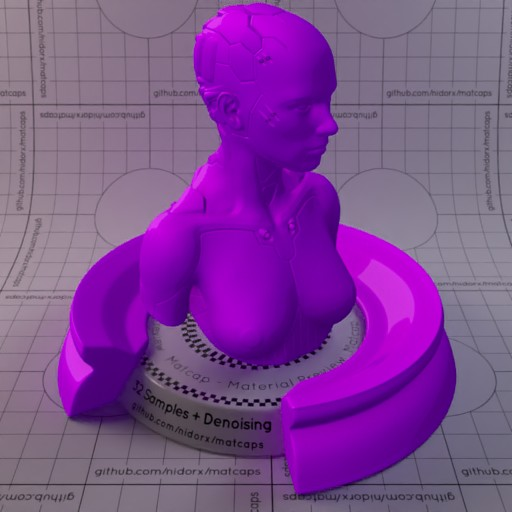

[[1024px](https://github.com/nidorx/matcaps/raw/master/1024/68049F_68049F_C90DE6_A404CF.png)]
[[512px](https://github.com/nidorx/matcaps/raw/master/512/68049F_68049F_C90DE6_A404CF-512px.png)]
[[256px](https://github.com/nidorx/matcaps/raw/master/256/68049F_68049F_C90DE6_A404CF-256px.png)]
[[128px](https://github.com/nidorx/matcaps/raw/master/128/68049F_68049F_C90DE6_A404CF-128px.png)]
[[64px](https://github.com/nidorx/matcaps/raw/master/64/68049F_68049F_C90DE6_A404CF-64px.png)]
[~~ZBrush Material (ZMT)~~]

---
### 685B57_685B57_BEB1B1_9B99A4

[[1024px](https://github.com/nidorx/matcaps/raw/master/1024/685B57_685B57_BEB1B1_9B99A4.png)]
[[512px](https://github.com/nidorx/matcaps/raw/master/512/685B57_685B57_BEB1B1_9B99A4-512px.png)]
[[256px](https://github.com/nidorx/matcaps/raw/master/256/685B57_685B57_BEB1B1_9B99A4-256px.png)]
[[128px](https://github.com/nidorx/matcaps/raw/master/128/685B57_685B57_BEB1B1_9B99A4-128px.png)]
[[64px](https://github.com/nidorx/matcaps/raw/master/64/685B57_685B57_BEB1B1_9B99A4-64px.png)]
[[ZBrush Material (ZMT)](https://github.com/nidorx/matcaps/raw/master/zmt/685B57_685B57_BEB1B1_9B99A4.zmt)]

---
### 686B73_686B73_2A2B2D_D5D9DD

[[1024px](https://github.com/nidorx/matcaps/raw/master/1024/686B73_686B73_2A2B2D_D5D9DD.png)]
[[512px](https://github.com/nidorx/matcaps/raw/master/512/686B73_686B73_2A2B2D_D5D9DD-512px.png)]
[[256px](https://github.com/nidorx/matcaps/raw/master/256/686B73_686B73_2A2B2D_D5D9DD-256px.png)]
[[128px](https://github.com/nidorx/matcaps/raw/master/128/686B73_686B73_2A2B2D_D5D9DD-128px.png)]
[[64px](https://github.com/nidorx/matcaps/raw/master/64/686B73_686B73_2A2B2D_D5D9DD-64px.png)]
[[ZBrush Material (ZMT)](https://github.com/nidorx/matcaps/raw/master/zmt/686B73_686B73_2A2B2D_D5D9DD.zmt)]

---
### 696347_696347_98B0A2_28261E

[[1024px](https://github.com/nidorx/matcaps/raw/master/1024/696347_696347_98B0A2_28261E.png)]
[[512px](https://github.com/nidorx/matcaps/raw/master/512/696347_696347_98B0A2_28261E-512px.png)]
[[256px](https://github.com/nidorx/matcaps/raw/master/256/696347_696347_98B0A2_28261E-256px.png)]
[[128px](https://github.com/nidorx/matcaps/raw/master/128/696347_696347_98B0A2_28261E-128px.png)]
[[64px](https://github.com/nidorx/matcaps/raw/master/64/696347_696347_98B0A2_28261E-64px.png)]
[[ZBrush Material (ZMT)](https://github.com/nidorx/matcaps/raw/master/zmt/696347_696347_98B0A2_28261E.zmt)]

---
### 6A5338_6A5338_1C120B_C5975F

[[1024px](https://github.com/nidorx/matcaps/raw/master/1024/6A5338_6A5338_1C120B_C5975F.png)]
[[512px](https://github.com/nidorx/matcaps/raw/master/512/6A5338_6A5338_1C120B_C5975F-512px.png)]
[[256px](https://github.com/nidorx/matcaps/raw/master/256/6A5338_6A5338_1C120B_C5975F-256px.png)]
[[128px](https://github.com/nidorx/matcaps/raw/master/128/6A5338_6A5338_1C120B_C5975F-128px.png)]
[[64px](https://github.com/nidorx/matcaps/raw/master/64/6A5338_6A5338_1C120B_C5975F-64px.png)]
[[ZBrush Material (ZMT)](https://github.com/nidorx/matcaps/raw/master/zmt/6A5338_6A5338_1C120B_C5975F.zmt)]

---
### 6BBD6B_6BBD6B_C8F3C8_A3E2A3
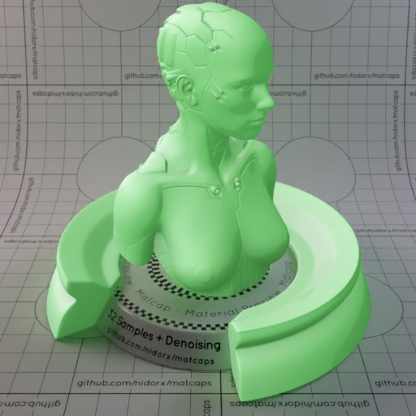

[[1024px](https://github.com/nidorx/matcaps/raw/master/1024/6BBD6B_6BBD6B_C8F3C8_A3E2A3.png)]
[[512px](https://github.com/nidorx/matcaps/raw/master/512/6BBD6B_6BBD6B_C8F3C8_A3E2A3-512px.png)]
[[256px](https://github.com/nidorx/matcaps/raw/master/256/6BBD6B_6BBD6B_C8F3C8_A3E2A3-256px.png)]
[[128px](https://github.com/nidorx/matcaps/raw/master/128/6BBD6B_6BBD6B_C8F3C8_A3E2A3-128px.png)]
[[64px](https://github.com/nidorx/matcaps/raw/master/64/6BBD6B_6BBD6B_C8F3C8_A3E2A3-64px.png)]
[~~ZBrush Material (ZMT)~~]

---
### 6C52AA_6C52AA_C9A6EA_A681D6
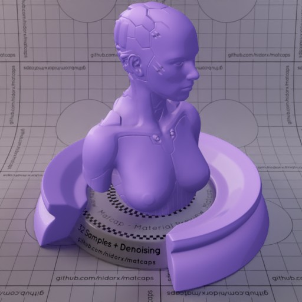

[[1024px](https://github.com/nidorx/matcaps/raw/master/1024/6C52AA_6C52AA_C9A6EA_A681D6.png)]
[[512px](https://github.com/nidorx/matcaps/raw/master/512/6C52AA_6C52AA_C9A6EA_A681D6-512px.png)]
[[256px](https://github.com/nidorx/matcaps/raw/master/256/6C52AA_6C52AA_C9A6EA_A681D6-256px.png)]
[[128px](https://github.com/nidorx/matcaps/raw/master/128/6C52AA_6C52AA_C9A6EA_A681D6-128px.png)]
[[64px](https://github.com/nidorx/matcaps/raw/master/64/6C52AA_6C52AA_C9A6EA_A681D6-64px.png)]
[~~ZBrush Material (ZMT)~~]

---
### 6C5DC3_6C5DC3_352D66_5C4CAB
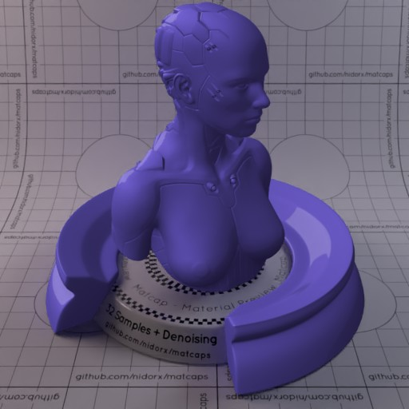

[[1024px](https://github.com/nidorx/matcaps/raw/master/1024/6C5DC3_6C5DC3_352D66_5C4CAB.png)]
[[512px](https://github.com/nidorx/matcaps/raw/master/512/6C5DC3_6C5DC3_352D66_5C4CAB-512px.png)]
[[256px](https://github.com/nidorx/matcaps/raw/master/256/6C5DC3_6C5DC3_352D66_5C4CAB-256px.png)]
[[128px](https://github.com/nidorx/matcaps/raw/master/128/6C5DC3_6C5DC3_352D66_5C4CAB-128px.png)]
[[64px](https://github.com/nidorx/matcaps/raw/master/64/6C5DC3_6C5DC3_352D66_5C4CAB-64px.png)]
[~~ZBrush Material (ZMT)~~]

---
### 6D1616_6D1616_E6CDBA_DE2B24

[[1024px](https://github.com/nidorx/matcaps/raw/master/1024/6D1616_6D1616_E6CDBA_DE2B24.png)]
[[512px](https://github.com/nidorx/matcaps/raw/master/512/6D1616_6D1616_E6CDBA_DE2B24-512px.png)]
[[256px](https://github.com/nidorx/matcaps/raw/master/256/6D1616_6D1616_E6CDBA_DE2B24-256px.png)]
[[128px](https://github.com/nidorx/matcaps/raw/master/128/6D1616_6D1616_E6CDBA_DE2B24-128px.png)]
[[64px](https://github.com/nidorx/matcaps/raw/master/64/6D1616_6D1616_E6CDBA_DE2B24-64px.png)]
[[ZBrush Material (ZMT)](https://github.com/nidorx/matcaps/raw/master/zmt/6D1616_6D1616_E6CDBA_DE2B24.zmt)]

---
### 6D6050_6D6050_C8C2B9_A2998E

[[1024px](https://github.com/nidorx/matcaps/raw/master/1024/6D6050_6D6050_C8C2B9_A2998E.png)]
[[512px](https://github.com/nidorx/matcaps/raw/master/512/6D6050_6D6050_C8C2B9_A2998E-512px.png)]
[[256px](https://github.com/nidorx/matcaps/raw/master/256/6D6050_6D6050_C8C2B9_A2998E-256px.png)]
[[128px](https://github.com/nidorx/matcaps/raw/master/128/6D6050_6D6050_C8C2B9_A2998E-128px.png)]
[[64px](https://github.com/nidorx/matcaps/raw/master/64/6D6050_6D6050_C8C2B9_A2998E-64px.png)]
[[ZBrush Material (ZMT)](https://github.com/nidorx/matcaps/raw/master/zmt/6D6050_6D6050_C8C2B9_A2998E.zmt)]

---
### 6D6D6D_6D6D6D_3E3E3E_C0C0C0

[[1024px](https://github.com/nidorx/matcaps/raw/master/1024/6D6D6D_6D6D6D_3E3E3E_C0C0C0.png)]
[[512px](https://github.com/nidorx/matcaps/raw/master/512/6D6D6D_6D6D6D_3E3E3E_C0C0C0-512px.png)]
[[256px](https://github.com/nidorx/matcaps/raw/master/256/6D6D6D_6D6D6D_3E3E3E_C0C0C0-256px.png)]
[[128px](https://github.com/nidorx/matcaps/raw/master/128/6D6D6D_6D6D6D_3E3E3E_C0C0C0-128px.png)]
[[64px](https://github.com/nidorx/matcaps/raw/master/64/6D6D6D_6D6D6D_3E3E3E_C0C0C0-64px.png)]
[[ZBrush Material (ZMT)](https://github.com/nidorx/matcaps/raw/master/zmt/6D6D6D_6D6D6D_3E3E3E_C0C0C0.zmt)]

---
### 6E2E36_6E2E36_D3A1A0_BD7175

[[1024px](https://github.com/nidorx/matcaps/raw/master/1024/6E2E36_6E2E36_D3A1A0_BD7175.png)]
[[512px](https://github.com/nidorx/matcaps/raw/master/512/6E2E36_6E2E36_D3A1A0_BD7175-512px.png)]
[[256px](https://github.com/nidorx/matcaps/raw/master/256/6E2E36_6E2E36_D3A1A0_BD7175-256px.png)]
[[128px](https://github.com/nidorx/matcaps/raw/master/128/6E2E36_6E2E36_D3A1A0_BD7175-128px.png)]
[[64px](https://github.com/nidorx/matcaps/raw/master/64/6E2E36_6E2E36_D3A1A0_BD7175-64px.png)]
[[ZBrush Material (ZMT)](https://github.com/nidorx/matcaps/raw/master/zmt/6E2E36_6E2E36_D3A1A0_BD7175.zmt)]

---
### 6E7181_6E7181_D1CFDF_ABAFC7

[[1024px](https://github.com/nidorx/matcaps/raw/master/1024/6E7181_6E7181_D1CFDF_ABAFC7.png)]
[[512px](https://github.com/nidorx/matcaps/raw/master/512/6E7181_6E7181_D1CFDF_ABAFC7-512px.png)]
[[256px](https://github.com/nidorx/matcaps/raw/master/256/6E7181_6E7181_D1CFDF_ABAFC7-256px.png)]
[[128px](https://github.com/nidorx/matcaps/raw/master/128/6E7181_6E7181_D1CFDF_ABAFC7-128px.png)]
[[64px](https://github.com/nidorx/matcaps/raw/master/64/6E7181_6E7181_D1CFDF_ABAFC7-64px.png)]
[[ZBrush Material (ZMT)](https://github.com/nidorx/matcaps/raw/master/zmt/6E7181_6E7181_D1CFDF_ABAFC7.zmt)]

---
### 6E8C48_6E8C48_B8CDA7_344018

[[1024px](https://github.com/nidorx/matcaps/raw/master/1024/6E8C48_6E8C48_B8CDA7_344018.png)]
[[512px](https://github.com/nidorx/matcaps/raw/master/512/6E8C48_6E8C48_B8CDA7_344018-512px.png)]
[[256px](https://github.com/nidorx/matcaps/raw/master/256/6E8C48_6E8C48_B8CDA7_344018-256px.png)]
[[128px](https://github.com/nidorx/matcaps/raw/master/128/6E8C48_6E8C48_B8CDA7_344018-128px.png)]
[[64px](https://github.com/nidorx/matcaps/raw/master/64/6E8C48_6E8C48_B8CDA7_344018-64px.png)]
[[ZBrush Material (ZMT)](https://github.com/nidorx/matcaps/raw/master/zmt/6E8C48_6E8C48_B8CDA7_344018.zmt)]

---
### 6EC66E_6EC66E_C9F8C9_A3E8A3
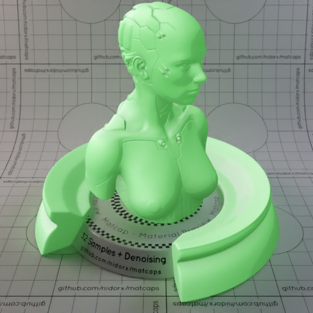

[[1024px](https://github.com/nidorx/matcaps/raw/master/1024/6EC66E_6EC66E_C9F8C9_A3E8A3.png)]
[[512px](https://github.com/nidorx/matcaps/raw/master/512/6EC66E_6EC66E_C9F8C9_A3E8A3-512px.png)]
[[256px](https://github.com/nidorx/matcaps/raw/master/256/6EC66E_6EC66E_C9F8C9_A3E8A3-256px.png)]
[[128px](https://github.com/nidorx/matcaps/raw/master/128/6EC66E_6EC66E_C9F8C9_A3E8A3-128px.png)]
[[64px](https://github.com/nidorx/matcaps/raw/master/64/6EC66E_6EC66E_C9F8C9_A3E8A3-64px.png)]
[~~ZBrush Material (ZMT)~~]

---