A huge library of MatCap textures in PNG and ZMT.

## Navigation
* [Home](/)
* [Page 1](PAGE-1.md)
* [Page 2](PAGE-2.md)
* Page 3
* [Page 4](PAGE-4.md)
* [Page 5](PAGE-5.md)
* [Page 6](PAGE-6.md)
* [Page 7](PAGE-7.md)
* [Page 8](PAGE-8.md)
* [Page 9](PAGE-9.md)
* [Page 10](PAGE-10.md)
* [Page 11](PAGE-11.md)
* [Page 12](PAGE-12.md)
* [Page 13](PAGE-13.md)
* [Page 14](PAGE-14.md)
* [Page 15](PAGE-15.md)
* [Page 16](PAGE-16.md)
* [Page 17](PAGE-17.md)
* [Page 18](PAGE-18.md)
* [Page 19](PAGE-19.md)
* [Page 20](PAGE-20.md)
* [Page 21](PAGE-21.md)
* [Page 22](PAGE-22.md)
* [Page 23](PAGE-23.md)
* [Page 24](PAGE-24.md)
* [Page 25](PAGE-25.md)
* [Page 26](PAGE-26.md)
* [Page 27](PAGE-27.md)
* [Page 28](PAGE-28.md)
* [Page 29](PAGE-29.md)
* [Page 30](PAGE-30.md)
* [Page 31](PAGE-31.md)
* [Page 32](PAGE-32.md)
* [Page 33](PAGE-33.md)
## Page 3 Matcaps
### 254FB0_99AFF0_6587D8_1D3279
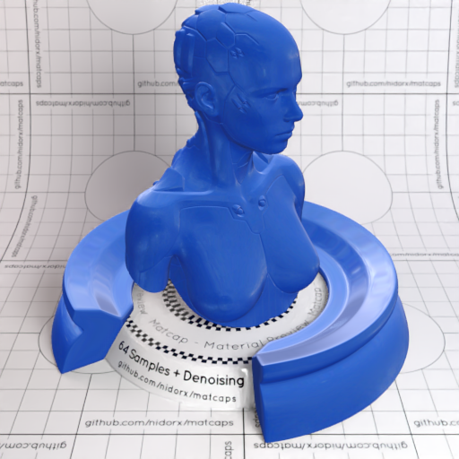
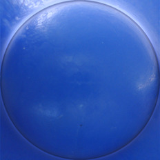

[[1024px](https://github.com/nidorx/matcaps/raw/master/1024/254FB0_99AFF0_6587D8_1D3279.png)]
[[512px](https://github.com/nidorx/matcaps/raw/master/512/254FB0_99AFF0_6587D8_1D3279-512px.png)]
[[256px](https://github.com/nidorx/matcaps/raw/master/256/254FB0_99AFF0_6587D8_1D3279-256px.png)]
[[128px](https://github.com/nidorx/matcaps/raw/master/128/254FB0_99AFF0_6587D8_1D3279-128px.png)]
[[64px](https://github.com/nidorx/matcaps/raw/master/64/254FB0_99AFF0_6587D8_1D3279-64px.png)]
[[ZBrush Material (ZMT)](https://github.com/nidorx/matcaps/raw/master/zmt/254FB0_99AFF0_6587D8_1D3279.zmt)]

---
### 27222B_677491_484F6A_5D657A
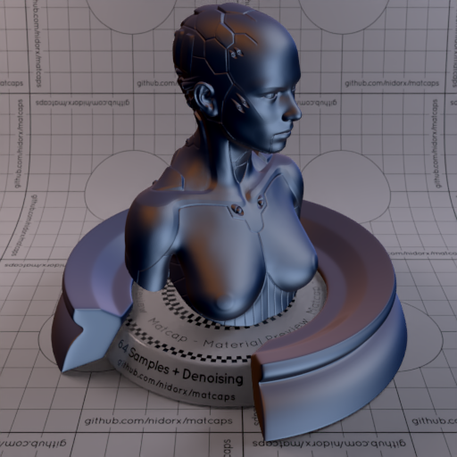

[[1024px](https://github.com/nidorx/matcaps/raw/master/1024/27222B_677491_484F6A_5D657A.png)]
[[512px](https://github.com/nidorx/matcaps/raw/master/512/27222B_677491_484F6A_5D657A-512px.png)]
[[256px](https://github.com/nidorx/matcaps/raw/master/256/27222B_677491_484F6A_5D657A-256px.png)]
[[128px](https://github.com/nidorx/matcaps/raw/master/128/27222B_677491_484F6A_5D657A-128px.png)]
[[64px](https://github.com/nidorx/matcaps/raw/master/64/27222B_677491_484F6A_5D657A-64px.png)]
[[ZBrush Material (ZMT)](https://github.com/nidorx/matcaps/raw/master/zmt/27222B_677491_484F6A_5D657A.zmt)]

---
### 281813_604233_4B3426_442B22
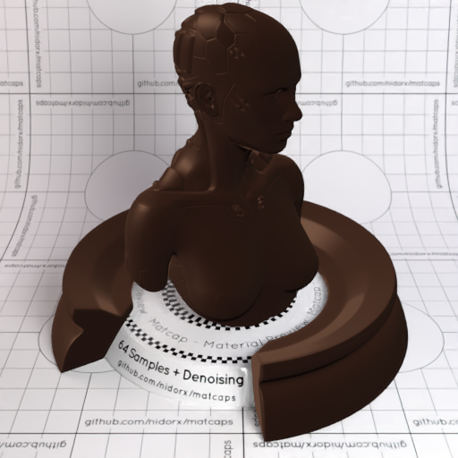

[[1024px](https://github.com/nidorx/matcaps/raw/master/1024/281813_604233_4B3426_442B22.png)]
[[512px](https://github.com/nidorx/matcaps/raw/master/512/281813_604233_4B3426_442B22-512px.png)]
[[256px](https://github.com/nidorx/matcaps/raw/master/256/281813_604233_4B3426_442B22-256px.png)]
[[128px](https://github.com/nidorx/matcaps/raw/master/128/281813_604233_4B3426_442B22-128px.png)]
[[64px](https://github.com/nidorx/matcaps/raw/master/64/281813_604233_4B3426_442B22-64px.png)]
[[ZBrush Material (ZMT)](https://github.com/nidorx/matcaps/raw/master/zmt/281813_604233_4B3426_442B22.zmt)]

---
### 28292A_D3DAE5_A3ACB8_818183
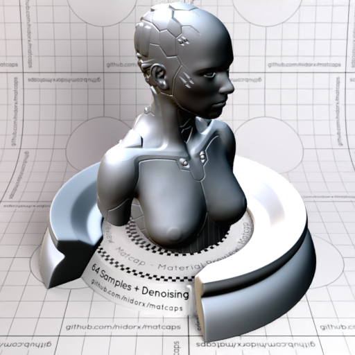
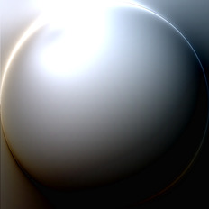

[[1024px](https://github.com/nidorx/matcaps/raw/master/1024/28292A_D3DAE5_A3ACB8_818183.png)]
[[512px](https://github.com/nidorx/matcaps/raw/master/512/28292A_D3DAE5_A3ACB8_818183-512px.png)]
[[256px](https://github.com/nidorx/matcaps/raw/master/256/28292A_D3DAE5_A3ACB8_818183-256px.png)]
[[128px](https://github.com/nidorx/matcaps/raw/master/128/28292A_D3DAE5_A3ACB8_818183-128px.png)]
[[64px](https://github.com/nidorx/matcaps/raw/master/64/28292A_D3DAE5_A3ACB8_818183-64px.png)]
[[ZBrush Material (ZMT)](https://github.com/nidorx/matcaps/raw/master/zmt/28292A_D3DAE5_A3ACB8_818183.zmt)]

---
### 291912_473531_3C2C25_3A2424
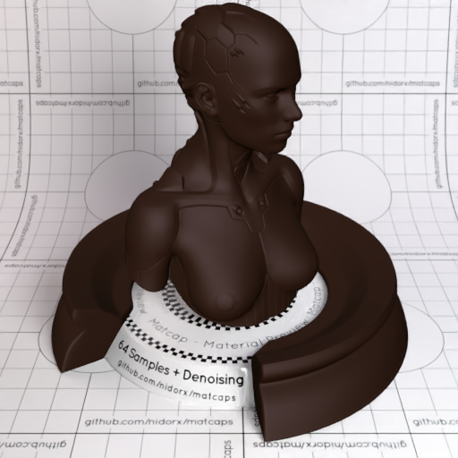

[[1024px](https://github.com/nidorx/matcaps/raw/master/1024/291912_473531_3C2C25_3A2424.png)]
[[512px](https://github.com/nidorx/matcaps/raw/master/512/291912_473531_3C2C25_3A2424-512px.png)]
[[256px](https://github.com/nidorx/matcaps/raw/master/256/291912_473531_3C2C25_3A2424-256px.png)]
[[128px](https://github.com/nidorx/matcaps/raw/master/128/291912_473531_3C2C25_3A2424-128px.png)]
[[64px](https://github.com/nidorx/matcaps/raw/master/64/291912_473531_3C2C25_3A2424-64px.png)]
[[ZBrush Material (ZMT)](https://github.com/nidorx/matcaps/raw/master/zmt/291912_473531_3C2C25_3A2424.zmt)]

---
### 293534_B2BFC5_738289_8A9AA7
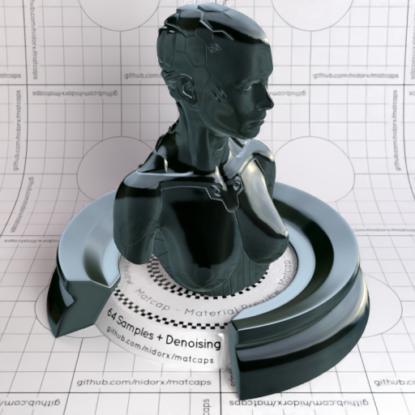
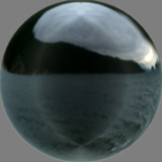

[[1024px](https://github.com/nidorx/matcaps/raw/master/1024/293534_B2BFC5_738289_8A9AA7.png)]
[[512px](https://github.com/nidorx/matcaps/raw/master/512/293534_B2BFC5_738289_8A9AA7-512px.png)]
[[256px](https://github.com/nidorx/matcaps/raw/master/256/293534_B2BFC5_738289_8A9AA7-256px.png)]
[[128px](https://github.com/nidorx/matcaps/raw/master/128/293534_B2BFC5_738289_8A9AA7-128px.png)]
[[64px](https://github.com/nidorx/matcaps/raw/master/64/293534_B2BFC5_738289_8A9AA7-64px.png)]
[~~ZBrush Material (ZMT)~~]

---
### 293D21_ABC692_73B255_667C5C
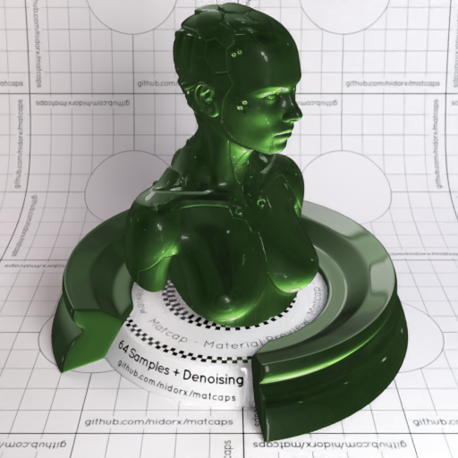

[[1024px](https://github.com/nidorx/matcaps/raw/master/1024/293D21_ABC692_73B255_667C5C.png)]
[[512px](https://github.com/nidorx/matcaps/raw/master/512/293D21_ABC692_73B255_667C5C-512px.png)]
[[256px](https://github.com/nidorx/matcaps/raw/master/256/293D21_ABC692_73B255_667C5C-256px.png)]
[[128px](https://github.com/nidorx/matcaps/raw/master/128/293D21_ABC692_73B255_667C5C-128px.png)]
[[64px](https://github.com/nidorx/matcaps/raw/master/64/293D21_ABC692_73B255_667C5C-64px.png)]
[[ZBrush Material (ZMT)](https://github.com/nidorx/matcaps/raw/master/zmt/293D21_ABC692_73B255_667C5C.zmt)]

---
### 2A2A2A_B3B3B3_6D6D6D_848C8C
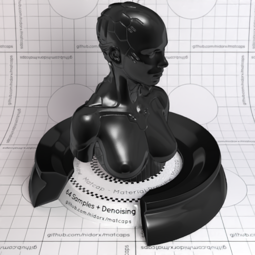

[[1024px](https://github.com/nidorx/matcaps/raw/master/1024/2A2A2A_B3B3B3_6D6D6D_848C8C.png)]
[[512px](https://github.com/nidorx/matcaps/raw/master/512/2A2A2A_B3B3B3_6D6D6D_848C8C-512px.png)]
[[256px](https://github.com/nidorx/matcaps/raw/master/256/2A2A2A_B3B3B3_6D6D6D_848C8C-256px.png)]
[[128px](https://github.com/nidorx/matcaps/raw/master/128/2A2A2A_B3B3B3_6D6D6D_848C8C-128px.png)]
[[64px](https://github.com/nidorx/matcaps/raw/master/64/2A2A2A_B3B3B3_6D6D6D_848C8C-64px.png)]
[~~ZBrush Material (ZMT)~~]

---
### 2A2A2A_DBDBDB_6A6A6A_949494
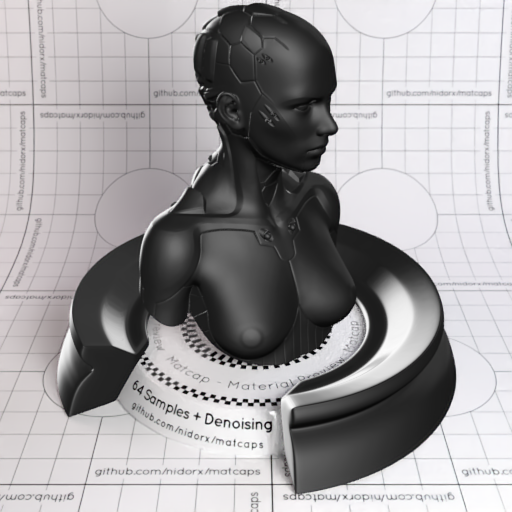
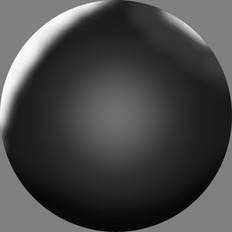

[[1024px](https://github.com/nidorx/matcaps/raw/master/1024/2A2A2A_DBDBDB_6A6A6A_949494.png)]
[[512px](https://github.com/nidorx/matcaps/raw/master/512/2A2A2A_DBDBDB_6A6A6A_949494-512px.png)]
[[256px](https://github.com/nidorx/matcaps/raw/master/256/2A2A2A_DBDBDB_6A6A6A_949494-256px.png)]
[[128px](https://github.com/nidorx/matcaps/raw/master/128/2A2A2A_DBDBDB_6A6A6A_949494-128px.png)]
[[64px](https://github.com/nidorx/matcaps/raw/master/64/2A2A2A_DBDBDB_6A6A6A_949494-64px.png)]
[~~ZBrush Material (ZMT)~~]

---
### 2A2D21_555742_898974_6C745B
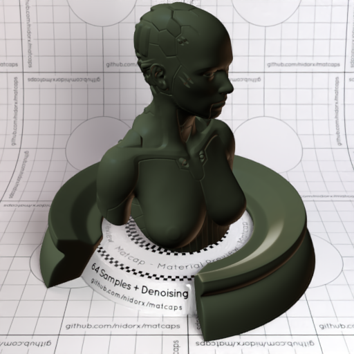

[[1024px](https://github.com/nidorx/matcaps/raw/master/1024/2A2D21_555742_898974_6C745B.png)]
[[512px](https://github.com/nidorx/matcaps/raw/master/512/2A2D21_555742_898974_6C745B-512px.png)]
[[256px](https://github.com/nidorx/matcaps/raw/master/256/2A2D21_555742_898974_6C745B-256px.png)]
[[128px](https://github.com/nidorx/matcaps/raw/master/128/2A2D21_555742_898974_6C745B-128px.png)]
[[64px](https://github.com/nidorx/matcaps/raw/master/64/2A2D21_555742_898974_6C745B-64px.png)]
[[ZBrush Material (ZMT)](https://github.com/nidorx/matcaps/raw/master/zmt/2A2D21_555742_898974_6C745B.zmt)]

---
### 2A4BA7_1B2D44_1F3768_233C81
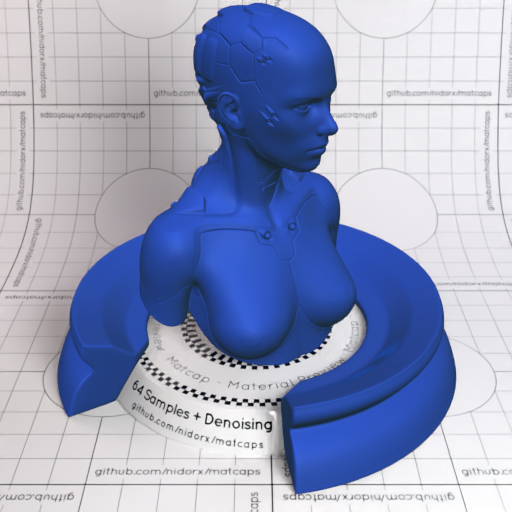

[[1024px](https://github.com/nidorx/matcaps/raw/master/1024/2A4BA7_1B2D44_1F3768_233C81.png)]
[[512px](https://github.com/nidorx/matcaps/raw/master/512/2A4BA7_1B2D44_1F3768_233C81-512px.png)]
[[256px](https://github.com/nidorx/matcaps/raw/master/256/2A4BA7_1B2D44_1F3768_233C81-256px.png)]
[[128px](https://github.com/nidorx/matcaps/raw/master/128/2A4BA7_1B2D44_1F3768_233C81-128px.png)]
[[64px](https://github.com/nidorx/matcaps/raw/master/64/2A4BA7_1B2D44_1F3768_233C81-64px.png)]
[[ZBrush Material (ZMT)](https://github.com/nidorx/matcaps/raw/master/zmt/2A4BA7_1B2D44_1F3768_233C81.zmt)]

---
### 2A6276_041218_739BA6_042941
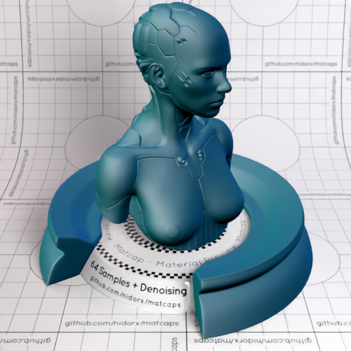

[[1024px](https://github.com/nidorx/matcaps/raw/master/1024/2A6276_041218_739BA6_042941.png)]
[[512px](https://github.com/nidorx/matcaps/raw/master/512/2A6276_041218_739BA6_042941-512px.png)]
[[256px](https://github.com/nidorx/matcaps/raw/master/256/2A6276_041218_739BA6_042941-256px.png)]
[[128px](https://github.com/nidorx/matcaps/raw/master/128/2A6276_041218_739BA6_042941-128px.png)]
[[64px](https://github.com/nidorx/matcaps/raw/master/64/2A6276_041218_739BA6_042941-64px.png)]
[[ZBrush Material (ZMT)](https://github.com/nidorx/matcaps/raw/master/zmt/2A6276_041218_739BA6_042941.zmt)]

---
### 2B2828_7B796F_534F4A_616464
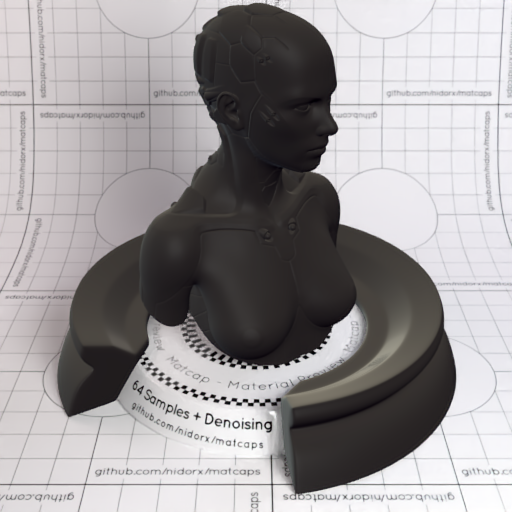
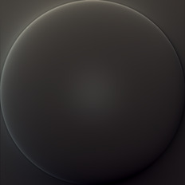

[[1024px](https://github.com/nidorx/matcaps/raw/master/1024/2B2828_7B796F_534F4A_616464.png)]
[[512px](https://github.com/nidorx/matcaps/raw/master/512/2B2828_7B796F_534F4A_616464-512px.png)]
[[256px](https://github.com/nidorx/matcaps/raw/master/256/2B2828_7B796F_534F4A_616464-256px.png)]
[[128px](https://github.com/nidorx/matcaps/raw/master/128/2B2828_7B796F_534F4A_616464-128px.png)]
[[64px](https://github.com/nidorx/matcaps/raw/master/64/2B2828_7B796F_534F4A_616464-64px.png)]
[[ZBrush Material (ZMT)](https://github.com/nidorx/matcaps/raw/master/zmt/2B2828_7B796F_534F4A_616464.zmt)]

---
### 2B2B22_3C3C30_464538_121210
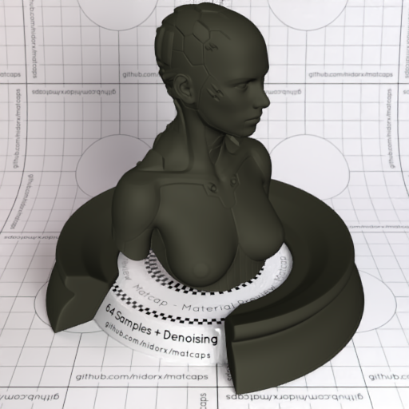

[[1024px](https://github.com/nidorx/matcaps/raw/master/1024/2B2B22_3C3C30_464538_121210.png)]
[[512px](https://github.com/nidorx/matcaps/raw/master/512/2B2B22_3C3C30_464538_121210-512px.png)]
[[256px](https://github.com/nidorx/matcaps/raw/master/256/2B2B22_3C3C30_464538_121210-256px.png)]
[[128px](https://github.com/nidorx/matcaps/raw/master/128/2B2B22_3C3C30_464538_121210-128px.png)]
[[64px](https://github.com/nidorx/matcaps/raw/master/64/2B2B22_3C3C30_464538_121210-64px.png)]
[[ZBrush Material (ZMT)](https://github.com/nidorx/matcaps/raw/master/zmt/2B2B22_3C3C30_464538_121210.zmt)]

---
### 2D2D2A_74716E_8F8C8C_92958E
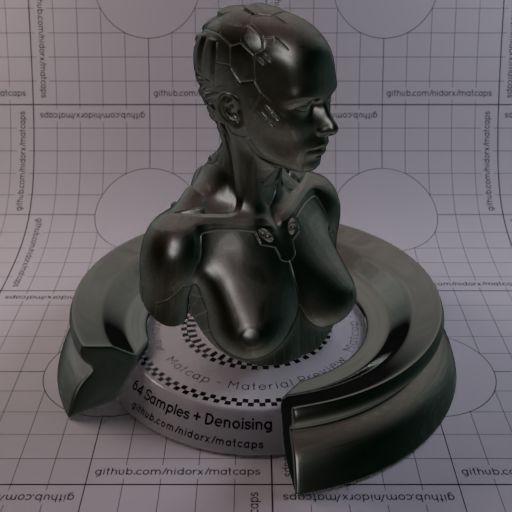
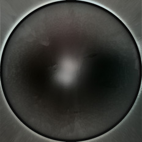

[[1024px](https://github.com/nidorx/matcaps/raw/master/1024/2D2D2A_74716E_8F8C8C_92958E.png)]
[[512px](https://github.com/nidorx/matcaps/raw/master/512/2D2D2A_74716E_8F8C8C_92958E-512px.png)]
[[256px](https://github.com/nidorx/matcaps/raw/master/256/2D2D2A_74716E_8F8C8C_92958E-256px.png)]
[[128px](https://github.com/nidorx/matcaps/raw/master/128/2D2D2A_74716E_8F8C8C_92958E-128px.png)]
[[64px](https://github.com/nidorx/matcaps/raw/master/64/2D2D2A_74716E_8F8C8C_92958E-64px.png)]
[[ZBrush Material (ZMT)](https://github.com/nidorx/matcaps/raw/master/zmt/2D2D2A_74716E_8F8C8C_92958E.zmt)]

---
### 2D2D2F_C6C2C5_727176_94949B
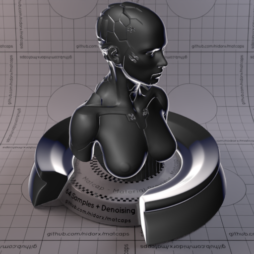
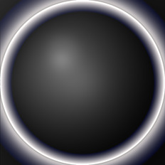

[[1024px](https://github.com/nidorx/matcaps/raw/master/1024/2D2D2F_C6C2C5_727176_94949B.png)]
[[512px](https://github.com/nidorx/matcaps/raw/master/512/2D2D2F_C6C2C5_727176_94949B-512px.png)]
[[256px](https://github.com/nidorx/matcaps/raw/master/256/2D2D2F_C6C2C5_727176_94949B-256px.png)]
[[128px](https://github.com/nidorx/matcaps/raw/master/128/2D2D2F_C6C2C5_727176_94949B-128px.png)]
[[64px](https://github.com/nidorx/matcaps/raw/master/64/2D2D2F_C6C2C5_727176_94949B-64px.png)]
[[ZBrush Material (ZMT)](https://github.com/nidorx/matcaps/raw/master/zmt/2D2D2F_C6C2C5_727176_94949B.zmt)]

---
### 2D8753_5CD6A5_45BB82_4CC494
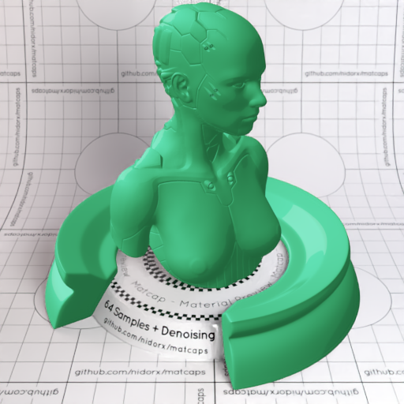

[[1024px](https://github.com/nidorx/matcaps/raw/master/1024/2D8753_5CD6A5_45BB82_4CC494.png)]
[[512px](https://github.com/nidorx/matcaps/raw/master/512/2D8753_5CD6A5_45BB82_4CC494-512px.png)]
[[256px](https://github.com/nidorx/matcaps/raw/master/256/2D8753_5CD6A5_45BB82_4CC494-256px.png)]
[[128px](https://github.com/nidorx/matcaps/raw/master/128/2D8753_5CD6A5_45BB82_4CC494-128px.png)]
[[64px](https://github.com/nidorx/matcaps/raw/master/64/2D8753_5CD6A5_45BB82_4CC494-64px.png)]
[~~ZBrush Material (ZMT)~~]

---
### 2E2E2D_7D7C76_A3A39F_949C94
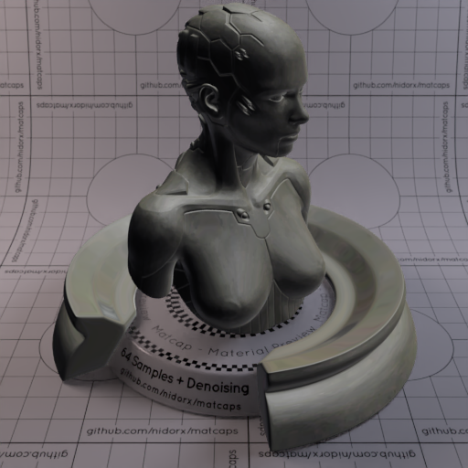
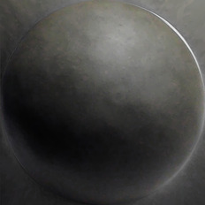

[[1024px](https://github.com/nidorx/matcaps/raw/master/1024/2E2E2D_7D7C76_A3A39F_949C94.png)]
[[512px](https://github.com/nidorx/matcaps/raw/master/512/2E2E2D_7D7C76_A3A39F_949C94-512px.png)]
[[256px](https://github.com/nidorx/matcaps/raw/master/256/2E2E2D_7D7C76_A3A39F_949C94-256px.png)]
[[128px](https://github.com/nidorx/matcaps/raw/master/128/2E2E2D_7D7C76_A3A39F_949C94-128px.png)]
[[64px](https://github.com/nidorx/matcaps/raw/master/64/2E2E2D_7D7C76_A3A39F_949C94-64px.png)]
[[ZBrush Material (ZMT)](https://github.com/nidorx/matcaps/raw/master/zmt/2E2E2D_7D7C76_A3A39F_949C94.zmt)]

---
### 2E763A_78A0B7_B3D1CF_14F209
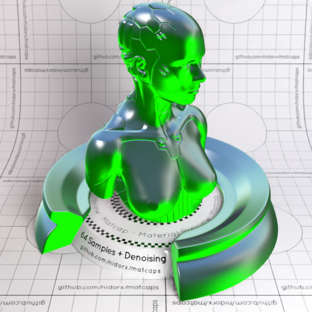
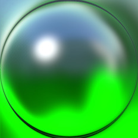

[[1024px](https://github.com/nidorx/matcaps/raw/master/1024/2E763A_78A0B7_B3D1CF_14F209.png)]
[[512px](https://github.com/nidorx/matcaps/raw/master/512/2E763A_78A0B7_B3D1CF_14F209-512px.png)]
[[256px](https://github.com/nidorx/matcaps/raw/master/256/2E763A_78A0B7_B3D1CF_14F209-256px.png)]
[[128px](https://github.com/nidorx/matcaps/raw/master/128/2E763A_78A0B7_B3D1CF_14F209-128px.png)]
[[64px](https://github.com/nidorx/matcaps/raw/master/64/2E763A_78A0B7_B3D1CF_14F209-64px.png)]
[[ZBrush Material (ZMT)](https://github.com/nidorx/matcaps/raw/master/zmt/2E763A_78A0B7_B3D1CF_14F209.zmt)]

---
### 2EAC9E_61EBE3_4DDDD1_43D1C6
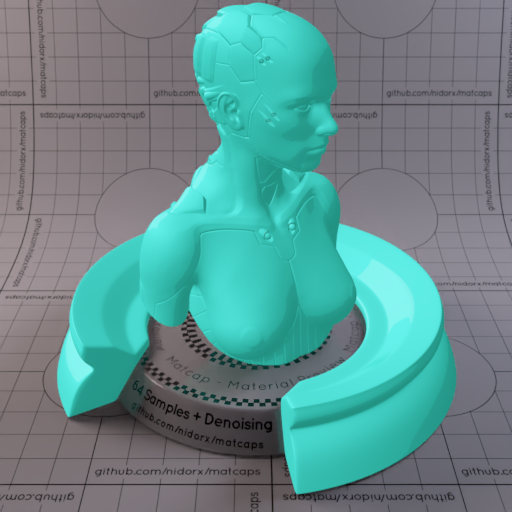
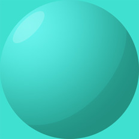

[[1024px](https://github.com/nidorx/matcaps/raw/master/1024/2EAC9E_61EBE3_4DDDD1_43D1C6.png)]
[[512px](https://github.com/nidorx/matcaps/raw/master/512/2EAC9E_61EBE3_4DDDD1_43D1C6-512px.png)]
[[256px](https://github.com/nidorx/matcaps/raw/master/256/2EAC9E_61EBE3_4DDDD1_43D1C6-256px.png)]
[[128px](https://github.com/nidorx/matcaps/raw/master/128/2EAC9E_61EBE3_4DDDD1_43D1C6-128px.png)]
[[64px](https://github.com/nidorx/matcaps/raw/master/64/2EAC9E_61EBE3_4DDDD1_43D1C6-64px.png)]
[~~ZBrush Material (ZMT)~~]

---