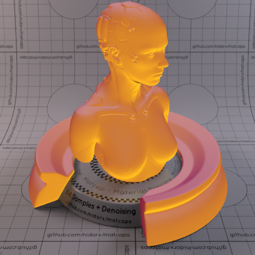
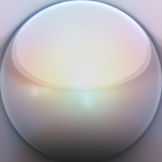
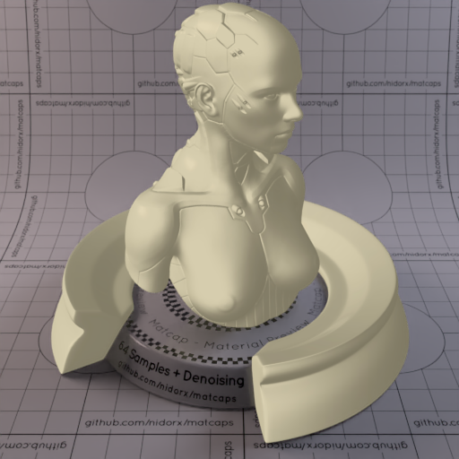
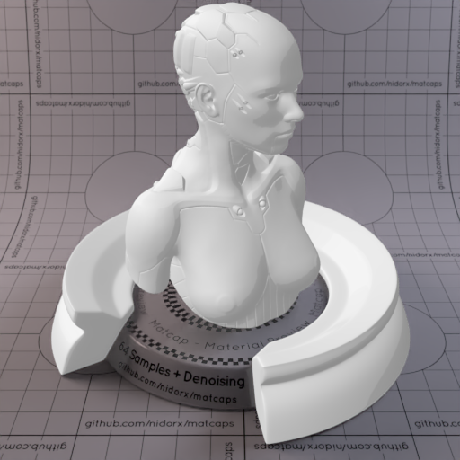
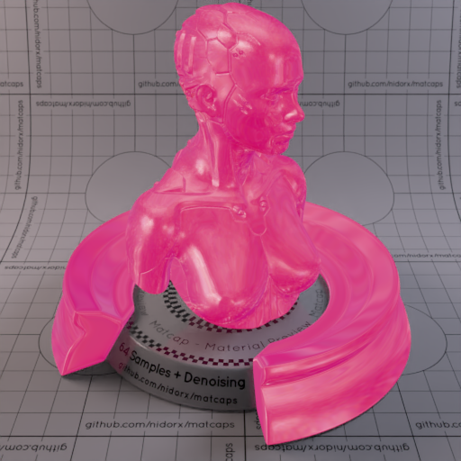
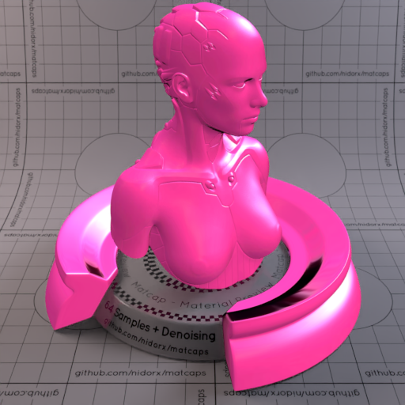
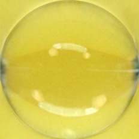
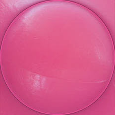
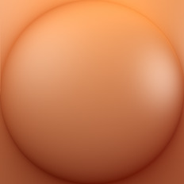

A huge library of MatCap textures in PNG and ZMT.

## Navigation
* [Home](/)
* [Page 1](PAGE-1.md)
* [Page 2](PAGE-2.md)
* [Page 3](PAGE-3.md)
* [Page 4](PAGE-4.md)
* [Page 5](PAGE-5.md)
* [Page 6](PAGE-6.md)
* [Page 7](PAGE-7.md)
* [Page 8](PAGE-8.md)
* [Page 9](PAGE-9.md)
* [Page 10](PAGE-10.md)
* [Page 11](PAGE-11.md)
* [Page 12](PAGE-12.md)
* [Page 13](PAGE-13.md)
* [Page 14](PAGE-14.md)
* [Page 15](PAGE-15.md)
* [Page 16](PAGE-16.md)
* [Page 17](PAGE-17.md)
* [Page 18](PAGE-18.md)
* [Page 19](PAGE-19.md)
* [Page 20](PAGE-20.md)
* [Page 21](PAGE-21.md)
* [Page 22](PAGE-22.md)
* [Page 23](PAGE-23.md)
* [Page 24](PAGE-24.md)
* [Page 25](PAGE-25.md)
* [Page 26](PAGE-26.md)
* [Page 27](PAGE-27.md)
* [Page 28](PAGE-28.md)
* [Page 29](PAGE-29.md)
* Page 30
* [Page 31](PAGE-31.md)
* [Page 32](PAGE-32.md)
* [Page 33](PAGE-33.md)
## Page 30 Matcaps
### D07E3F_D07E3F_FBBD1F_8D2840

[[1024px](https://github.com/nidorx/matcaps/raw/master/1024/D07E3F_D07E3F_FBBD1F_8D2840.png)]
[[512px](https://github.com/nidorx/matcaps/raw/master/512/D07E3F_D07E3F_FBBD1F_8D2840-512px.png)]
[[256px](https://github.com/nidorx/matcaps/raw/master/256/D07E3F_D07E3F_FBBD1F_8D2840-256px.png)]
[[128px](https://github.com/nidorx/matcaps/raw/master/128/D07E3F_D07E3F_FBBD1F_8D2840-128px.png)]
[[64px](https://github.com/nidorx/matcaps/raw/master/64/D07E3F_D07E3F_FBBD1F_8D2840-64px.png)]
[[ZBrush Material (ZMT)](https://github.com/nidorx/matcaps/raw/master/zmt/D07E3F_D07E3F_FBBD1F_8D2840.zmt)]

---
### D0CCCB_D0CCCB_524D50_928891

[[1024px](https://github.com/nidorx/matcaps/raw/master/1024/D0CCCB_D0CCCB_524D50_928891.png)]
[[512px](https://github.com/nidorx/matcaps/raw/master/512/D0CCCB_D0CCCB_524D50_928891-512px.png)]
[[256px](https://github.com/nidorx/matcaps/raw/master/256/D0CCCB_D0CCCB_524D50_928891-256px.png)]
[[128px](https://github.com/nidorx/matcaps/raw/master/128/D0CCCB_D0CCCB_524D50_928891-128px.png)]
[[64px](https://github.com/nidorx/matcaps/raw/master/64/D0CCCB_D0CCCB_524D50_928891-64px.png)]
[[ZBrush Material (ZMT)](https://github.com/nidorx/matcaps/raw/master/zmt/D0CCCB_D0CCCB_524D50_928891.zmt)]

---
### D0D3BE_D0D3BE_816854_998366

[[1024px](https://github.com/nidorx/matcaps/raw/master/1024/D0D3BE_D0D3BE_816854_998366.png)]
[[512px](https://github.com/nidorx/matcaps/raw/master/512/D0D3BE_D0D3BE_816854_998366-512px.png)]
[[256px](https://github.com/nidorx/matcaps/raw/master/256/D0D3BE_D0D3BE_816854_998366-256px.png)]
[[128px](https://github.com/nidorx/matcaps/raw/master/128/D0D3BE_D0D3BE_816854_998366-128px.png)]
[[64px](https://github.com/nidorx/matcaps/raw/master/64/D0D3BE_D0D3BE_816854_998366-64px.png)]
[[ZBrush Material (ZMT)](https://github.com/nidorx/matcaps/raw/master/zmt/D0D3BE_D0D3BE_816854_998366.zmt)]

---
### D1AC04_D1AC04_F8E50A_EDD004

[[1024px](https://github.com/nidorx/matcaps/raw/master/1024/D1AC04_D1AC04_F8E50A_EDD004.png)]
[[512px](https://github.com/nidorx/matcaps/raw/master/512/D1AC04_D1AC04_F8E50A_EDD004-512px.png)]
[[256px](https://github.com/nidorx/matcaps/raw/master/256/D1AC04_D1AC04_F8E50A_EDD004-256px.png)]
[[128px](https://github.com/nidorx/matcaps/raw/master/128/D1AC04_D1AC04_F8E50A_EDD004-128px.png)]
[[64px](https://github.com/nidorx/matcaps/raw/master/64/D1AC04_D1AC04_F8E50A_EDD004-64px.png)]
[~~ZBrush Material (ZMT)~~]

---
### D3CAAB_D3CAAB_8C866E_C0B89A

[[1024px](https://github.com/nidorx/matcaps/raw/master/1024/D3CAAB_D3CAAB_8C866E_C0B89A.png)]
[[512px](https://github.com/nidorx/matcaps/raw/master/512/D3CAAB_D3CAAB_8C866E_C0B89A-512px.png)]
[[256px](https://github.com/nidorx/matcaps/raw/master/256/D3CAAB_D3CAAB_8C866E_C0B89A-256px.png)]
[[128px](https://github.com/nidorx/matcaps/raw/master/128/D3CAAB_D3CAAB_8C866E_C0B89A-128px.png)]
[[64px](https://github.com/nidorx/matcaps/raw/master/64/D3CAAB_D3CAAB_8C866E_C0B89A-64px.png)]
[[ZBrush Material (ZMT)](https://github.com/nidorx/matcaps/raw/master/zmt/D3CAAB_D3CAAB_8C866E_C0B89A.zmt)]

---
### D4855F_D4855F_92512D_AE6742

[[1024px](https://github.com/nidorx/matcaps/raw/master/1024/D4855F_D4855F_92512D_AE6742.png)]
[[512px](https://github.com/nidorx/matcaps/raw/master/512/D4855F_D4855F_92512D_AE6742-512px.png)]
[[256px](https://github.com/nidorx/matcaps/raw/master/256/D4855F_D4855F_92512D_AE6742-256px.png)]
[[128px](https://github.com/nidorx/matcaps/raw/master/128/D4855F_D4855F_92512D_AE6742-128px.png)]
[[64px](https://github.com/nidorx/matcaps/raw/master/64/D4855F_D4855F_92512D_AE6742-64px.png)]
[[ZBrush Material (ZMT)](https://github.com/nidorx/matcaps/raw/master/zmt/D4855F_D4855F_92512D_AE6742.zmt)]

---
### D54C2B_D54C2B_5F1105_F39382

[[1024px](https://github.com/nidorx/matcaps/raw/master/1024/D54C2B_D54C2B_5F1105_F39382.png)]
[[512px](https://github.com/nidorx/matcaps/raw/master/512/D54C2B_D54C2B_5F1105_F39382-512px.png)]
[[256px](https://github.com/nidorx/matcaps/raw/master/256/D54C2B_D54C2B_5F1105_F39382-256px.png)]
[[128px](https://github.com/nidorx/matcaps/raw/master/128/D54C2B_D54C2B_5F1105_F39382-128px.png)]
[[64px](https://github.com/nidorx/matcaps/raw/master/64/D54C2B_D54C2B_5F1105_F39382-64px.png)]
[[ZBrush Material (ZMT)](https://github.com/nidorx/matcaps/raw/master/zmt/D54C2B_D54C2B_5F1105_F39382.zmt)]

---
### D5B5B4_D5B5B4_9E6C6F_F5E9EF

[[1024px](https://github.com/nidorx/matcaps/raw/master/1024/D5B5B4_D5B5B4_9E6C6F_F5E9EF.png)]
[[512px](https://github.com/nidorx/matcaps/raw/master/512/D5B5B4_D5B5B4_9E6C6F_F5E9EF-512px.png)]
[[256px](https://github.com/nidorx/matcaps/raw/master/256/D5B5B4_D5B5B4_9E6C6F_F5E9EF-256px.png)]
[[128px](https://github.com/nidorx/matcaps/raw/master/128/D5B5B4_D5B5B4_9E6C6F_F5E9EF-128px.png)]
[[64px](https://github.com/nidorx/matcaps/raw/master/64/D5B5B4_D5B5B4_9E6C6F_F5E9EF-64px.png)]
[[ZBrush Material (ZMT)](https://github.com/nidorx/matcaps/raw/master/zmt/D5B5B4_D5B5B4_9E6C6F_F5E9EF.zmt)]

---
### D5D5D5_D5D5D5_929292_ACACAC

[[1024px](https://github.com/nidorx/matcaps/raw/master/1024/D5D5D5_D5D5D5_929292_ACACAC.png)]
[[512px](https://github.com/nidorx/matcaps/raw/master/512/D5D5D5_D5D5D5_929292_ACACAC-512px.png)]
[[256px](https://github.com/nidorx/matcaps/raw/master/256/D5D5D5_D5D5D5_929292_ACACAC-256px.png)]
[[128px](https://github.com/nidorx/matcaps/raw/master/128/D5D5D5_D5D5D5_929292_ACACAC-128px.png)]
[[64px](https://github.com/nidorx/matcaps/raw/master/64/D5D5D5_D5D5D5_929292_ACACAC-64px.png)]
[~~ZBrush Material (ZMT)~~]

---
### D64480_D64480_E27497_EA9BB1

[[1024px](https://github.com/nidorx/matcaps/raw/master/1024/D64480_D64480_E27497_EA9BB1.png)]
[[512px](https://github.com/nidorx/matcaps/raw/master/512/D64480_D64480_E27497_EA9BB1-512px.png)]
[[256px](https://github.com/nidorx/matcaps/raw/master/256/D64480_D64480_E27497_EA9BB1-256px.png)]
[[128px](https://github.com/nidorx/matcaps/raw/master/128/D64480_D64480_E27497_EA9BB1-128px.png)]
[[64px](https://github.com/nidorx/matcaps/raw/master/64/D64480_D64480_E27497_EA9BB1-64px.png)]
[[ZBrush Material (ZMT)](https://github.com/nidorx/matcaps/raw/master/zmt/D64480_D64480_E27497_EA9BB1.zmt)]

---
### D7D7C3_D7D7C3_AAAA92_F5F5EA

[[1024px](https://github.com/nidorx/matcaps/raw/master/1024/D7D7C3_D7D7C3_AAAA92_F5F5EA.png)]
[[512px](https://github.com/nidorx/matcaps/raw/master/512/D7D7C3_D7D7C3_AAAA92_F5F5EA-512px.png)]
[[256px](https://github.com/nidorx/matcaps/raw/master/256/D7D7C3_D7D7C3_AAAA92_F5F5EA-256px.png)]
[[128px](https://github.com/nidorx/matcaps/raw/master/128/D7D7C3_D7D7C3_AAAA92_F5F5EA-128px.png)]
[[64px](https://github.com/nidorx/matcaps/raw/master/64/D7D7C3_D7D7C3_AAAA92_F5F5EA-64px.png)]
[~~ZBrush Material (ZMT)~~]

---
### D7DFDB_D7DFDB_AAB5AF_F5FAF7

[[1024px](https://github.com/nidorx/matcaps/raw/master/1024/D7DFDB_D7DFDB_AAB5AF_F5FAF7.png)]
[[512px](https://github.com/nidorx/matcaps/raw/master/512/D7DFDB_D7DFDB_AAB5AF_F5FAF7-512px.png)]
[[256px](https://github.com/nidorx/matcaps/raw/master/256/D7DFDB_D7DFDB_AAB5AF_F5FAF7-256px.png)]
[[128px](https://github.com/nidorx/matcaps/raw/master/128/D7DFDB_D7DFDB_AAB5AF_F5FAF7-128px.png)]
[[64px](https://github.com/nidorx/matcaps/raw/master/64/D7DFDB_D7DFDB_AAB5AF_F5FAF7-64px.png)]
[~~ZBrush Material (ZMT)~~]

---
### D8388B_D8388B_230A14_FCC8FC

[[1024px](https://github.com/nidorx/matcaps/raw/master/1024/D8388B_D8388B_230A14_FCC8FC.png)]
[[512px](https://github.com/nidorx/matcaps/raw/master/512/D8388B_D8388B_230A14_FCC8FC-512px.png)]
[[256px](https://github.com/nidorx/matcaps/raw/master/256/D8388B_D8388B_230A14_FCC8FC-256px.png)]
[[128px](https://github.com/nidorx/matcaps/raw/master/128/D8388B_D8388B_230A14_FCC8FC-128px.png)]
[[64px](https://github.com/nidorx/matcaps/raw/master/64/D8388B_D8388B_230A14_FCC8FC-64px.png)]
[[ZBrush Material (ZMT)](https://github.com/nidorx/matcaps/raw/master/zmt/D8388B_D8388B_230A14_FCC8FC.zmt)]

---
### D8C949_D8C949_F5F19E_6B7855

[[1024px](https://github.com/nidorx/matcaps/raw/master/1024/D8C949_D8C949_F5F19E_6B7855.png)]
[[512px](https://github.com/nidorx/matcaps/raw/master/512/D8C949_D8C949_F5F19E_6B7855-512px.png)]
[[256px](https://github.com/nidorx/matcaps/raw/master/256/D8C949_D8C949_F5F19E_6B7855-256px.png)]
[[128px](https://github.com/nidorx/matcaps/raw/master/128/D8C949_D8C949_F5F19E_6B7855-128px.png)]
[[64px](https://github.com/nidorx/matcaps/raw/master/64/D8C949_D8C949_F5F19E_6B7855-64px.png)]
[[ZBrush Material (ZMT)](https://github.com/nidorx/matcaps/raw/master/zmt/D8C949_D8C949_F5F19E_6B7855.zmt)]

---
### D8D8E5_D8D8E5_9D9DAF_B4B4C4

[[1024px](https://github.com/nidorx/matcaps/raw/master/1024/D8D8E5_D8D8E5_9D9DAF_B4B4C4.png)]
[[512px](https://github.com/nidorx/matcaps/raw/master/512/D8D8E5_D8D8E5_9D9DAF_B4B4C4-512px.png)]
[[256px](https://github.com/nidorx/matcaps/raw/master/256/D8D8E5_D8D8E5_9D9DAF_B4B4C4-256px.png)]
[[128px](https://github.com/nidorx/matcaps/raw/master/128/D8D8E5_D8D8E5_9D9DAF_B4B4C4-128px.png)]
[[64px](https://github.com/nidorx/matcaps/raw/master/64/D8D8E5_D8D8E5_9D9DAF_B4B4C4-64px.png)]
[~~ZBrush Material (ZMT)~~]

---
### DA5788_DA5788_DE94BD_E078A3

[[1024px](https://github.com/nidorx/matcaps/raw/master/1024/DA5788_DA5788_DE94BD_E078A3.png)]
[[512px](https://github.com/nidorx/matcaps/raw/master/512/DA5788_DA5788_DE94BD_E078A3-512px.png)]
[[256px](https://github.com/nidorx/matcaps/raw/master/256/DA5788_DA5788_DE94BD_E078A3-256px.png)]
[[128px](https://github.com/nidorx/matcaps/raw/master/128/DA5788_DA5788_DE94BD_E078A3-128px.png)]
[[64px](https://github.com/nidorx/matcaps/raw/master/64/DA5788_DA5788_DE94BD_E078A3-64px.png)]
[[ZBrush Material (ZMT)](https://github.com/nidorx/matcaps/raw/master/zmt/DA5788_DA5788_DE94BD_E078A3.zmt)]

---
### DBDBBB_DBDBBB_F7F7E4_AFAF89

[[1024px](https://github.com/nidorx/matcaps/raw/master/1024/DBDBBB_DBDBBB_F7F7E4_AFAF89.png)]
[[512px](https://github.com/nidorx/matcaps/raw/master/512/DBDBBB_DBDBBB_F7F7E4_AFAF89-512px.png)]
[[256px](https://github.com/nidorx/matcaps/raw/master/256/DBDBBB_DBDBBB_F7F7E4_AFAF89-256px.png)]
[[128px](https://github.com/nidorx/matcaps/raw/master/128/DBDBBB_DBDBBB_F7F7E4_AFAF89-128px.png)]
[[64px](https://github.com/nidorx/matcaps/raw/master/64/DBDBBB_DBDBBB_F7F7E4_AFAF89-64px.png)]
[~~ZBrush Material (ZMT)~~]

---
### DC3E04_DC3E04_B52604_FC7D20

[[1024px](https://github.com/nidorx/matcaps/raw/master/1024/DC3E04_DC3E04_B52604_FC7D20.png)]
[[512px](https://github.com/nidorx/matcaps/raw/master/512/DC3E04_DC3E04_B52604_FC7D20-512px.png)]
[[256px](https://github.com/nidorx/matcaps/raw/master/256/DC3E04_DC3E04_B52604_FC7D20-256px.png)]
[[128px](https://github.com/nidorx/matcaps/raw/master/128/DC3E04_DC3E04_B52604_FC7D20-128px.png)]
[[64px](https://github.com/nidorx/matcaps/raw/master/64/DC3E04_DC3E04_B52604_FC7D20-64px.png)]
[~~ZBrush Material (ZMT)~~]

---
### DE9261_DE9261_86361E_A85A37

[[1024px](https://github.com/nidorx/matcaps/raw/master/1024/DE9261_DE9261_86361E_A85A37.png)]
[[512px](https://github.com/nidorx/matcaps/raw/master/512/DE9261_DE9261_86361E_A85A37-512px.png)]
[[256px](https://github.com/nidorx/matcaps/raw/master/256/DE9261_DE9261_86361E_A85A37-256px.png)]
[[128px](https://github.com/nidorx/matcaps/raw/master/128/DE9261_DE9261_86361E_A85A37-128px.png)]
[[64px](https://github.com/nidorx/matcaps/raw/master/64/DE9261_DE9261_86361E_A85A37-64px.png)]
[[ZBrush Material (ZMT)](https://github.com/nidorx/matcaps/raw/master/zmt/DE9261_DE9261_86361E_A85A37.zmt)]

---
### DEDEC4_DEDEC4_B5B597_F9F9EA

[[1024px](https://github.com/nidorx/matcaps/raw/master/1024/DEDEC4_DEDEC4_B5B597_F9F9EA.png)]
[[512px](https://github.com/nidorx/matcaps/raw/master/512/DEDEC4_DEDEC4_B5B597_F9F9EA-512px.png)]
[[256px](https://github.com/nidorx/matcaps/raw/master/256/DEDEC4_DEDEC4_B5B597_F9F9EA-256px.png)]
[[128px](https://github.com/nidorx/matcaps/raw/master/128/DEDEC4_DEDEC4_B5B597_F9F9EA-128px.png)]
[[64px](https://github.com/nidorx/matcaps/raw/master/64/DEDEC4_DEDEC4_B5B597_F9F9EA-64px.png)]
[~~ZBrush Material (ZMT)~~]

---