A huge library of MatCap textures in PNG and ZMT.

## Navigation
* [Home](/)
* [Page 1](PAGE-1.md)
* [Page 2](PAGE-2.md)
* [Page 3](PAGE-3.md)
* [Page 4](PAGE-4.md)
* [Page 5](PAGE-5.md)
* [Page 6](PAGE-6.md)
* [Page 7](PAGE-7.md)
* [Page 8](PAGE-8.md)
* [Page 9](PAGE-9.md)
* [Page 10](PAGE-10.md)
* [Page 11](PAGE-11.md)
* [Page 12](PAGE-12.md)
* [Page 13](PAGE-13.md)
* [Page 14](PAGE-14.md)
* [Page 15](PAGE-15.md)
* [Page 16](PAGE-16.md)
* [Page 17](PAGE-17.md)
* [Page 18](PAGE-18.md)
* [Page 19](PAGE-19.md)
* [Page 20](PAGE-20.md)
* [Page 21](PAGE-21.md)
* [Page 22](PAGE-22.md)
* [Page 23](PAGE-23.md)
* [Page 24](PAGE-24.md)
* [Page 25](PAGE-25.md)
* [Page 26](PAGE-26.md)
* [Page 27](PAGE-27.md)
* [Page 28](PAGE-28.md)
* [Page 29](PAGE-29.md)
* Page 30
* [Page 31](PAGE-31.md)
* [Page 32](PAGE-32.md)
* [Page 33](PAGE-33.md)
## Page 30 Matcaps
### D07E3F_FBBD1F_8D2840_24120C
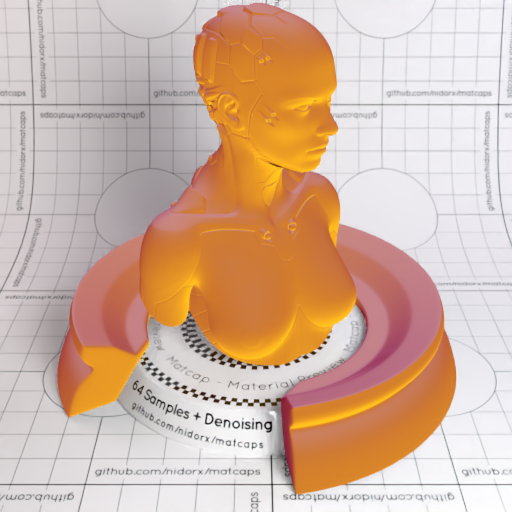
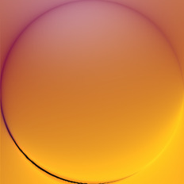

[[1024px](https://github.com/nidorx/matcaps/raw/master/1024/D07E3F_FBBD1F_8D2840_24120C.png)]
[[512px](https://github.com/nidorx/matcaps/raw/master/512/D07E3F_FBBD1F_8D2840_24120C-512px.png)]
[[256px](https://github.com/nidorx/matcaps/raw/master/256/D07E3F_FBBD1F_8D2840_24120C-256px.png)]
[[128px](https://github.com/nidorx/matcaps/raw/master/128/D07E3F_FBBD1F_8D2840_24120C-128px.png)]
[[64px](https://github.com/nidorx/matcaps/raw/master/64/D07E3F_FBBD1F_8D2840_24120C-64px.png)]
[[ZBrush Material (ZMT)](https://github.com/nidorx/matcaps/raw/master/zmt/D07E3F_FBBD1F_8D2840_24120C.zmt)]

---
### D0CCCB_524D50_928891_727581
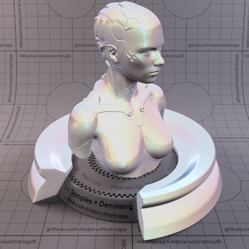

[[1024px](https://github.com/nidorx/matcaps/raw/master/1024/D0CCCB_524D50_928891_727581.png)]
[[512px](https://github.com/nidorx/matcaps/raw/master/512/D0CCCB_524D50_928891_727581-512px.png)]
[[256px](https://github.com/nidorx/matcaps/raw/master/256/D0CCCB_524D50_928891_727581-256px.png)]
[[128px](https://github.com/nidorx/matcaps/raw/master/128/D0CCCB_524D50_928891_727581-128px.png)]
[[64px](https://github.com/nidorx/matcaps/raw/master/64/D0CCCB_524D50_928891_727581-64px.png)]
[[ZBrush Material (ZMT)](https://github.com/nidorx/matcaps/raw/master/zmt/D0CCCB_524D50_928891_727581.zmt)]

---
### D0D3BE_816854_998366_685146
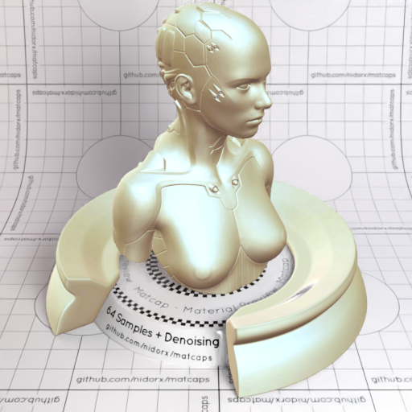
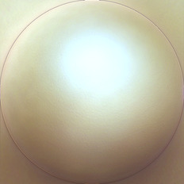

[[1024px](https://github.com/nidorx/matcaps/raw/master/1024/D0D3BE_816854_998366_685146.png)]
[[512px](https://github.com/nidorx/matcaps/raw/master/512/D0D3BE_816854_998366_685146-512px.png)]
[[256px](https://github.com/nidorx/matcaps/raw/master/256/D0D3BE_816854_998366_685146-256px.png)]
[[128px](https://github.com/nidorx/matcaps/raw/master/128/D0D3BE_816854_998366_685146-128px.png)]
[[64px](https://github.com/nidorx/matcaps/raw/master/64/D0D3BE_816854_998366_685146-64px.png)]
[[ZBrush Material (ZMT)](https://github.com/nidorx/matcaps/raw/master/zmt/D0D3BE_816854_998366_685146.zmt)]

---
### D1AC04_F8E50A_EDD004_B38D04
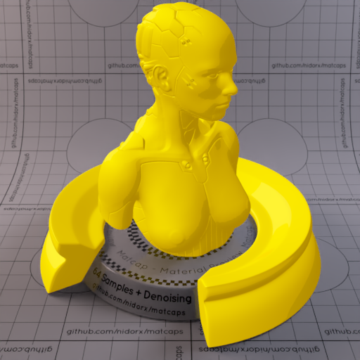

[[1024px](https://github.com/nidorx/matcaps/raw/master/1024/D1AC04_F8E50A_EDD004_B38D04.png)]
[[512px](https://github.com/nidorx/matcaps/raw/master/512/D1AC04_F8E50A_EDD004_B38D04-512px.png)]
[[256px](https://github.com/nidorx/matcaps/raw/master/256/D1AC04_F8E50A_EDD004_B38D04-256px.png)]
[[128px](https://github.com/nidorx/matcaps/raw/master/128/D1AC04_F8E50A_EDD004_B38D04-128px.png)]
[[64px](https://github.com/nidorx/matcaps/raw/master/64/D1AC04_F8E50A_EDD004_B38D04-64px.png)]
[~~ZBrush Material (ZMT)~~]

---
### D3CAAB_8C866E_C0B89A_AEA68A
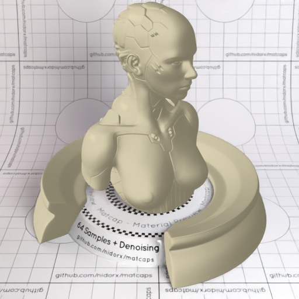
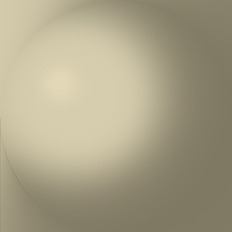

[[1024px](https://github.com/nidorx/matcaps/raw/master/1024/D3CAAB_8C866E_C0B89A_AEA68A.png)]
[[512px](https://github.com/nidorx/matcaps/raw/master/512/D3CAAB_8C866E_C0B89A_AEA68A-512px.png)]
[[256px](https://github.com/nidorx/matcaps/raw/master/256/D3CAAB_8C866E_C0B89A_AEA68A-256px.png)]
[[128px](https://github.com/nidorx/matcaps/raw/master/128/D3CAAB_8C866E_C0B89A_AEA68A-128px.png)]
[[64px](https://github.com/nidorx/matcaps/raw/master/64/D3CAAB_8C866E_C0B89A_AEA68A-64px.png)]
[[ZBrush Material (ZMT)](https://github.com/nidorx/matcaps/raw/master/zmt/D3CAAB_8C866E_C0B89A_AEA68A.zmt)]

---
### D4855F_92512D_AE6742_A75C2C
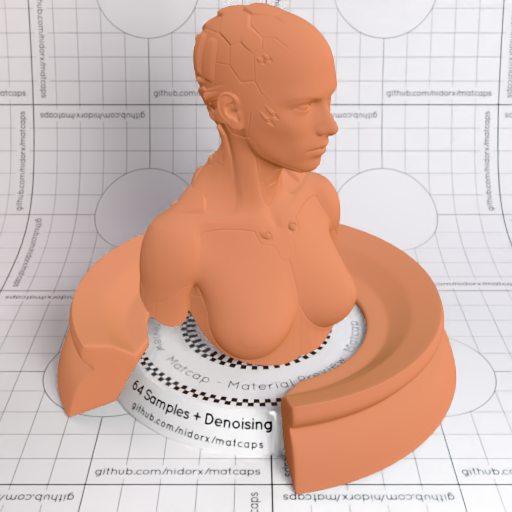
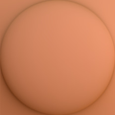

[[1024px](https://github.com/nidorx/matcaps/raw/master/1024/D4855F_92512D_AE6742_A75C2C.png)]
[[512px](https://github.com/nidorx/matcaps/raw/master/512/D4855F_92512D_AE6742_A75C2C-512px.png)]
[[256px](https://github.com/nidorx/matcaps/raw/master/256/D4855F_92512D_AE6742_A75C2C-256px.png)]
[[128px](https://github.com/nidorx/matcaps/raw/master/128/D4855F_92512D_AE6742_A75C2C-128px.png)]
[[64px](https://github.com/nidorx/matcaps/raw/master/64/D4855F_92512D_AE6742_A75C2C-64px.png)]
[[ZBrush Material (ZMT)](https://github.com/nidorx/matcaps/raw/master/zmt/D4855F_92512D_AE6742_A75C2C.zmt)]

---
### D54C2B_5F1105_F39382_F08375
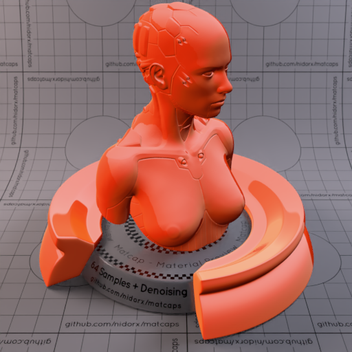

[[1024px](https://github.com/nidorx/matcaps/raw/master/1024/D54C2B_5F1105_F39382_F08375.png)]
[[512px](https://github.com/nidorx/matcaps/raw/master/512/D54C2B_5F1105_F39382_F08375-512px.png)]
[[256px](https://github.com/nidorx/matcaps/raw/master/256/D54C2B_5F1105_F39382_F08375-256px.png)]
[[128px](https://github.com/nidorx/matcaps/raw/master/128/D54C2B_5F1105_F39382_F08375-128px.png)]
[[64px](https://github.com/nidorx/matcaps/raw/master/64/D54C2B_5F1105_F39382_F08375-64px.png)]
[[ZBrush Material (ZMT)](https://github.com/nidorx/matcaps/raw/master/zmt/D54C2B_5F1105_F39382_F08375.zmt)]

---
### D5B5B4_9E6C6F_F5E9EF_A57986
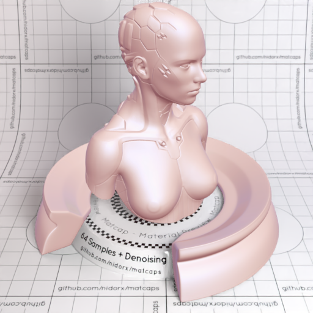
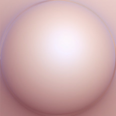

[[1024px](https://github.com/nidorx/matcaps/raw/master/1024/D5B5B4_9E6C6F_F5E9EF_A57986.png)]
[[512px](https://github.com/nidorx/matcaps/raw/master/512/D5B5B4_9E6C6F_F5E9EF_A57986-512px.png)]
[[256px](https://github.com/nidorx/matcaps/raw/master/256/D5B5B4_9E6C6F_F5E9EF_A57986-256px.png)]
[[128px](https://github.com/nidorx/matcaps/raw/master/128/D5B5B4_9E6C6F_F5E9EF_A57986-128px.png)]
[[64px](https://github.com/nidorx/matcaps/raw/master/64/D5B5B4_9E6C6F_F5E9EF_A57986-64px.png)]
[[ZBrush Material (ZMT)](https://github.com/nidorx/matcaps/raw/master/zmt/D5B5B4_9E6C6F_F5E9EF_A57986.zmt)]

---
### D5D5D5_929292_ACACAC_B4B4B4
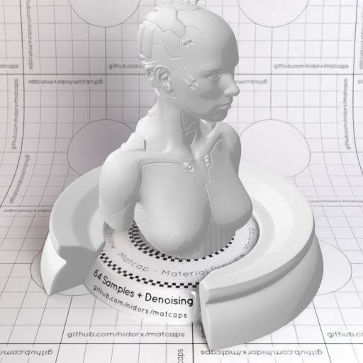

[[1024px](https://github.com/nidorx/matcaps/raw/master/1024/D5D5D5_929292_ACACAC_B4B4B4.png)]
[[512px](https://github.com/nidorx/matcaps/raw/master/512/D5D5D5_929292_ACACAC_B4B4B4-512px.png)]
[[256px](https://github.com/nidorx/matcaps/raw/master/256/D5D5D5_929292_ACACAC_B4B4B4-256px.png)]
[[128px](https://github.com/nidorx/matcaps/raw/master/128/D5D5D5_929292_ACACAC_B4B4B4-128px.png)]
[[64px](https://github.com/nidorx/matcaps/raw/master/64/D5D5D5_929292_ACACAC_B4B4B4-64px.png)]
[~~ZBrush Material (ZMT)~~]

---
### D64480_E27497_EA9BB1_CD156F
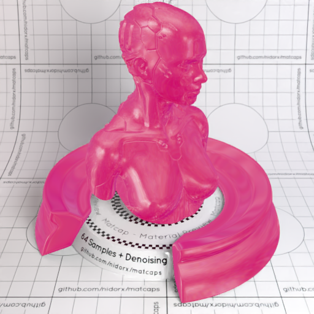

[[1024px](https://github.com/nidorx/matcaps/raw/master/1024/D64480_E27497_EA9BB1_CD156F.png)]
[[512px](https://github.com/nidorx/matcaps/raw/master/512/D64480_E27497_EA9BB1_CD156F-512px.png)]
[[256px](https://github.com/nidorx/matcaps/raw/master/256/D64480_E27497_EA9BB1_CD156F-256px.png)]
[[128px](https://github.com/nidorx/matcaps/raw/master/128/D64480_E27497_EA9BB1_CD156F-128px.png)]
[[64px](https://github.com/nidorx/matcaps/raw/master/64/D64480_E27497_EA9BB1_CD156F-64px.png)]
[[ZBrush Material (ZMT)](https://github.com/nidorx/matcaps/raw/master/zmt/D64480_E27497_EA9BB1_CD156F.zmt)]

---
### D7D7C3_AAAA92_F5F5EA_BCBCA4
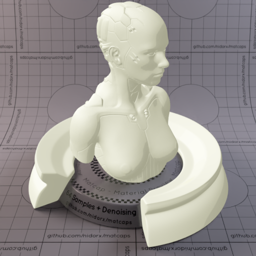
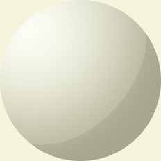

[[1024px](https://github.com/nidorx/matcaps/raw/master/1024/D7D7C3_AAAA92_F5F5EA_BCBCA4.png)]
[[512px](https://github.com/nidorx/matcaps/raw/master/512/D7D7C3_AAAA92_F5F5EA_BCBCA4-512px.png)]
[[256px](https://github.com/nidorx/matcaps/raw/master/256/D7D7C3_AAAA92_F5F5EA_BCBCA4-256px.png)]
[[128px](https://github.com/nidorx/matcaps/raw/master/128/D7D7C3_AAAA92_F5F5EA_BCBCA4-128px.png)]
[[64px](https://github.com/nidorx/matcaps/raw/master/64/D7D7C3_AAAA92_F5F5EA_BCBCA4-64px.png)]
[~~ZBrush Material (ZMT)~~]

---
### D7DFDB_AAB5AF_F5FAF7_BCC4C4
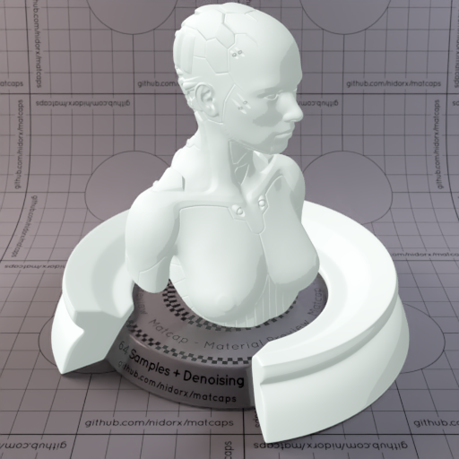

[[1024px](https://github.com/nidorx/matcaps/raw/master/1024/D7DFDB_AAB5AF_F5FAF7_BCC4C4.png)]
[[512px](https://github.com/nidorx/matcaps/raw/master/512/D7DFDB_AAB5AF_F5FAF7_BCC4C4-512px.png)]
[[256px](https://github.com/nidorx/matcaps/raw/master/256/D7DFDB_AAB5AF_F5FAF7_BCC4C4-256px.png)]
[[128px](https://github.com/nidorx/matcaps/raw/master/128/D7DFDB_AAB5AF_F5FAF7_BCC4C4-128px.png)]
[[64px](https://github.com/nidorx/matcaps/raw/master/64/D7DFDB_AAB5AF_F5FAF7_BCC4C4-64px.png)]
[~~ZBrush Material (ZMT)~~]

---
### D8388B_230A14_FCC8FC_FC71E1
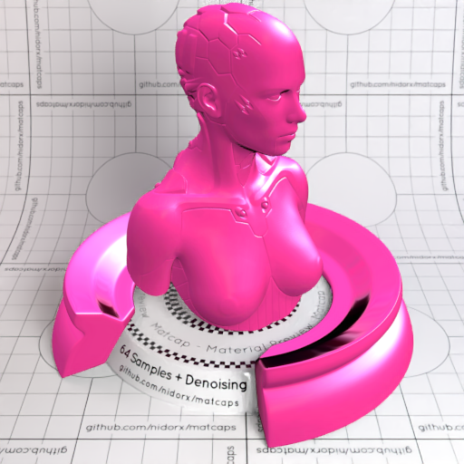
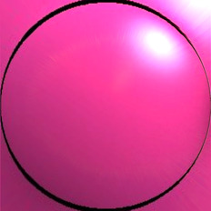

[[1024px](https://github.com/nidorx/matcaps/raw/master/1024/D8388B_230A14_FCC8FC_FC71E1.png)]
[[512px](https://github.com/nidorx/matcaps/raw/master/512/D8388B_230A14_FCC8FC_FC71E1-512px.png)]
[[256px](https://github.com/nidorx/matcaps/raw/master/256/D8388B_230A14_FCC8FC_FC71E1-256px.png)]
[[128px](https://github.com/nidorx/matcaps/raw/master/128/D8388B_230A14_FCC8FC_FC71E1-128px.png)]
[[64px](https://github.com/nidorx/matcaps/raw/master/64/D8388B_230A14_FCC8FC_FC71E1-64px.png)]
[[ZBrush Material (ZMT)](https://github.com/nidorx/matcaps/raw/master/zmt/D8388B_230A14_FCC8FC_FC71E1.zmt)]

---
### D8C949_F5F19E_6B7855_9A9858
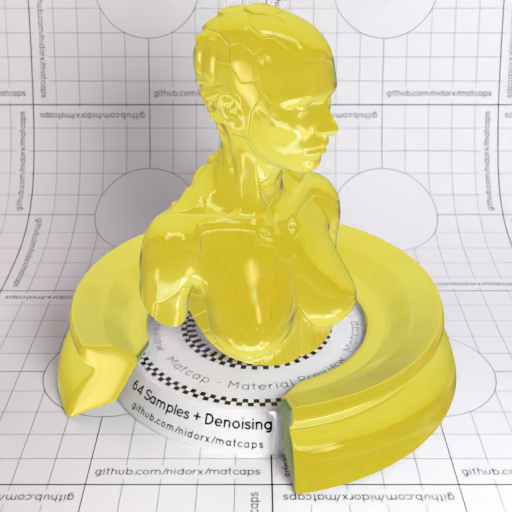

[[1024px](https://github.com/nidorx/matcaps/raw/master/1024/D8C949_F5F19E_6B7855_9A9858.png)]
[[512px](https://github.com/nidorx/matcaps/raw/master/512/D8C949_F5F19E_6B7855_9A9858-512px.png)]
[[256px](https://github.com/nidorx/matcaps/raw/master/256/D8C949_F5F19E_6B7855_9A9858-256px.png)]
[[128px](https://github.com/nidorx/matcaps/raw/master/128/D8C949_F5F19E_6B7855_9A9858-128px.png)]
[[64px](https://github.com/nidorx/matcaps/raw/master/64/D8C949_F5F19E_6B7855_9A9858-64px.png)]
[[ZBrush Material (ZMT)](https://github.com/nidorx/matcaps/raw/master/zmt/D8C949_F5F19E_6B7855_9A9858.zmt)]

---
### D8D8E5_9D9DAF_B4B4C4_B4B4CC
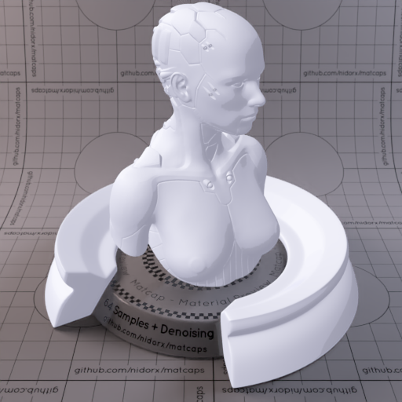

[[1024px](https://github.com/nidorx/matcaps/raw/master/1024/D8D8E5_9D9DAF_B4B4C4_B4B4CC.png)]
[[512px](https://github.com/nidorx/matcaps/raw/master/512/D8D8E5_9D9DAF_B4B4C4_B4B4CC-512px.png)]
[[256px](https://github.com/nidorx/matcaps/raw/master/256/D8D8E5_9D9DAF_B4B4C4_B4B4CC-256px.png)]
[[128px](https://github.com/nidorx/matcaps/raw/master/128/D8D8E5_9D9DAF_B4B4C4_B4B4CC-128px.png)]
[[64px](https://github.com/nidorx/matcaps/raw/master/64/D8D8E5_9D9DAF_B4B4C4_B4B4CC-64px.png)]
[~~ZBrush Material (ZMT)~~]

---
### DA5788_DE94BD_E078A3_DD83B4

[[1024px](https://github.com/nidorx/matcaps/raw/master/1024/DA5788_DE94BD_E078A3_DD83B4.png)]
[[512px](https://github.com/nidorx/matcaps/raw/master/512/DA5788_DE94BD_E078A3_DD83B4-512px.png)]
[[256px](https://github.com/nidorx/matcaps/raw/master/256/DA5788_DE94BD_E078A3_DD83B4-256px.png)]
[[128px](https://github.com/nidorx/matcaps/raw/master/128/DA5788_DE94BD_E078A3_DD83B4-128px.png)]
[[64px](https://github.com/nidorx/matcaps/raw/master/64/DA5788_DE94BD_E078A3_DD83B4-64px.png)]
[[ZBrush Material (ZMT)](https://github.com/nidorx/matcaps/raw/master/zmt/DA5788_DE94BD_E078A3_DD83B4.zmt)]

---
### DBDBBB_F7F7E4_AFAF89_C4C49C
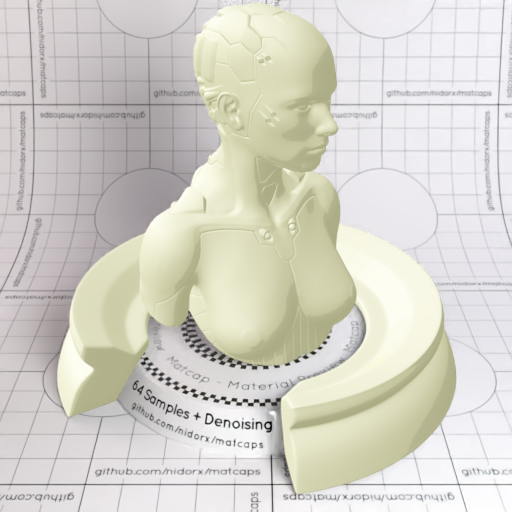
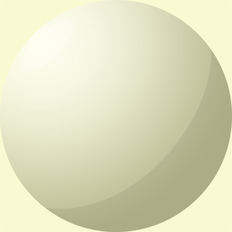

[[1024px](https://github.com/nidorx/matcaps/raw/master/1024/DBDBBB_F7F7E4_AFAF89_C4C49C.png)]
[[512px](https://github.com/nidorx/matcaps/raw/master/512/DBDBBB_F7F7E4_AFAF89_C4C49C-512px.png)]
[[256px](https://github.com/nidorx/matcaps/raw/master/256/DBDBBB_F7F7E4_AFAF89_C4C49C-256px.png)]
[[128px](https://github.com/nidorx/matcaps/raw/master/128/DBDBBB_F7F7E4_AFAF89_C4C49C-128px.png)]
[[64px](https://github.com/nidorx/matcaps/raw/master/64/DBDBBB_F7F7E4_AFAF89_C4C49C-64px.png)]
[~~ZBrush Material (ZMT)~~]

---
### DC3E04_B52604_FC7D20_F85F04
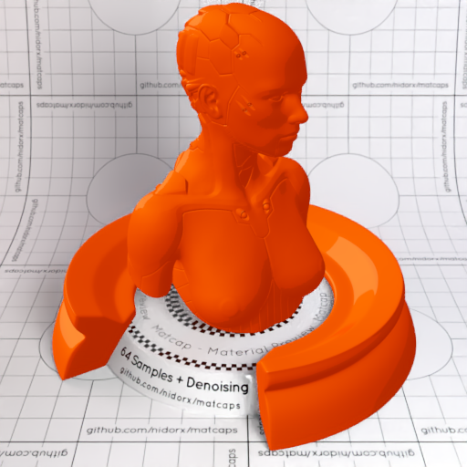

[[1024px](https://github.com/nidorx/matcaps/raw/master/1024/DC3E04_B52604_FC7D20_F85F04.png)]
[[512px](https://github.com/nidorx/matcaps/raw/master/512/DC3E04_B52604_FC7D20_F85F04-512px.png)]
[[256px](https://github.com/nidorx/matcaps/raw/master/256/DC3E04_B52604_FC7D20_F85F04-256px.png)]
[[128px](https://github.com/nidorx/matcaps/raw/master/128/DC3E04_B52604_FC7D20_F85F04-128px.png)]
[[64px](https://github.com/nidorx/matcaps/raw/master/64/DC3E04_B52604_FC7D20_F85F04-64px.png)]
[~~ZBrush Material (ZMT)~~]

---
### DE9261_86361E_A85A37_944C2C
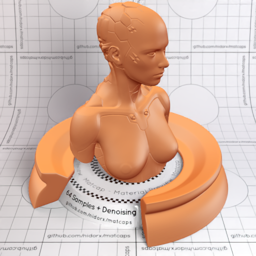

[[1024px](https://github.com/nidorx/matcaps/raw/master/1024/DE9261_86361E_A85A37_944C2C.png)]
[[512px](https://github.com/nidorx/matcaps/raw/master/512/DE9261_86361E_A85A37_944C2C-512px.png)]
[[256px](https://github.com/nidorx/matcaps/raw/master/256/DE9261_86361E_A85A37_944C2C-256px.png)]
[[128px](https://github.com/nidorx/matcaps/raw/master/128/DE9261_86361E_A85A37_944C2C-128px.png)]
[[64px](https://github.com/nidorx/matcaps/raw/master/64/DE9261_86361E_A85A37_944C2C-64px.png)]
[[ZBrush Material (ZMT)](https://github.com/nidorx/matcaps/raw/master/zmt/DE9261_86361E_A85A37_944C2C.zmt)]

---
### DEDEC4_B5B597_F9F9EA_C4C4AB
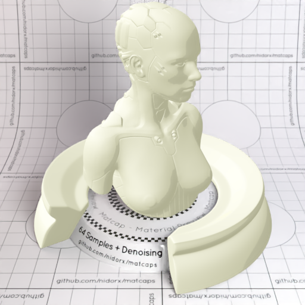

[[1024px](https://github.com/nidorx/matcaps/raw/master/1024/DEDEC4_B5B597_F9F9EA_C4C4AB.png)]
[[512px](https://github.com/nidorx/matcaps/raw/master/512/DEDEC4_B5B597_F9F9EA_C4C4AB-512px.png)]
[[256px](https://github.com/nidorx/matcaps/raw/master/256/DEDEC4_B5B597_F9F9EA_C4C4AB-256px.png)]
[[128px](https://github.com/nidorx/matcaps/raw/master/128/DEDEC4_B5B597_F9F9EA_C4C4AB-128px.png)]
[[64px](https://github.com/nidorx/matcaps/raw/master/64/DEDEC4_B5B597_F9F9EA_C4C4AB-64px.png)]
[~~ZBrush Material (ZMT)~~]

---