A huge library of MatCap textures in PNG and ZMT.

## Navigation
* [Home](/)
* [Page 1](PAGE-1.md)
* [Page 2](PAGE-2.md)
* [Page 3](PAGE-3.md)
* [Page 4](PAGE-4.md)
* [Page 5](PAGE-5.md)
* [Page 6](PAGE-6.md)
* [Page 7](PAGE-7.md)
* [Page 8](PAGE-8.md)
* [Page 9](PAGE-9.md)
* [Page 10](PAGE-10.md)
* [Page 11](PAGE-11.md)
* [Page 12](PAGE-12.md)
* [Page 13](PAGE-13.md)
* [Page 14](PAGE-14.md)
* [Page 15](PAGE-15.md)
* [Page 16](PAGE-16.md)
* [Page 17](PAGE-17.md)
* [Page 18](PAGE-18.md)
* [Page 19](PAGE-19.md)
* [Page 20](PAGE-20.md)
* [Page 21](PAGE-21.md)
* [Page 22](PAGE-22.md)
* [Page 23](PAGE-23.md)
* [Page 24](PAGE-24.md)
* [Page 25](PAGE-25.md)
* [Page 26](PAGE-26.md)
* [Page 27](PAGE-27.md)
* [Page 28](PAGE-28.md)
* [Page 29](PAGE-29.md)
* [Page 30](PAGE-30.md)
* Page 31
* [Page 32](PAGE-32.md)
* [Page 33](PAGE-33.md)
## Page 31 Matcaps
### DEE3E8_A6AEB5_BCC4CC_BCC4C4
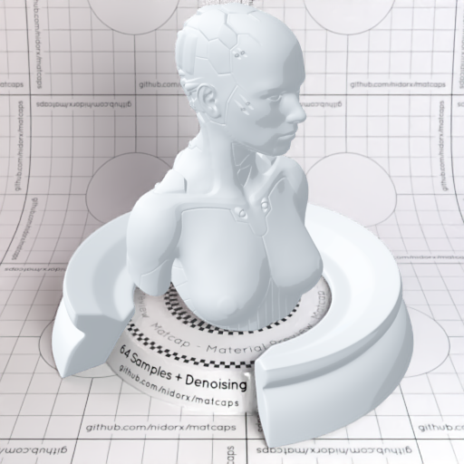

[[1024px](https://github.com/nidorx/matcaps/raw/master/1024/DEE3E8_A6AEB5_BCC4CC_BCC4C4.png)]
[[512px](https://github.com/nidorx/matcaps/raw/master/512/DEE3E8_A6AEB5_BCC4CC_BCC4C4-512px.png)]
[[256px](https://github.com/nidorx/matcaps/raw/master/256/DEE3E8_A6AEB5_BCC4CC_BCC4C4-256px.png)]
[[128px](https://github.com/nidorx/matcaps/raw/master/128/DEE3E8_A6AEB5_BCC4CC_BCC4C4-128px.png)]
[[64px](https://github.com/nidorx/matcaps/raw/master/64/DEE3E8_A6AEB5_BCC4CC_BCC4C4-64px.png)]
[~~ZBrush Material (ZMT)~~]

---
### DEE8DE_A6B5A6_BCCCBC_BCC4BC
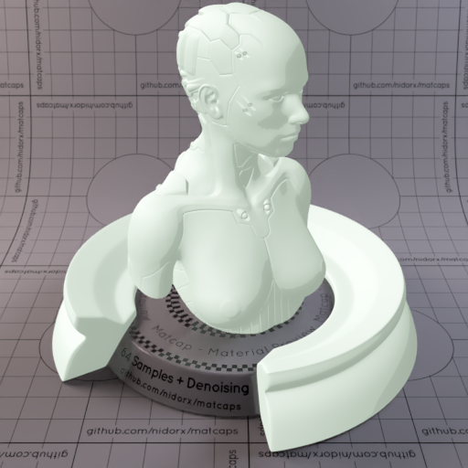
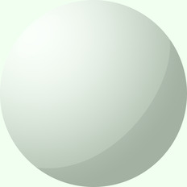

[[1024px](https://github.com/nidorx/matcaps/raw/master/1024/DEE8DE_A6B5A6_BCCCBC_BCC4BC.png)]
[[512px](https://github.com/nidorx/matcaps/raw/master/512/DEE8DE_A6B5A6_BCCCBC_BCC4BC-512px.png)]
[[256px](https://github.com/nidorx/matcaps/raw/master/256/DEE8DE_A6B5A6_BCCCBC_BCC4BC-256px.png)]
[[128px](https://github.com/nidorx/matcaps/raw/master/128/DEE8DE_A6B5A6_BCCCBC_BCC4BC-128px.png)]
[[64px](https://github.com/nidorx/matcaps/raw/master/64/DEE8DE_A6B5A6_BCCCBC_BCC4BC-64px.png)]
[~~ZBrush Material (ZMT)~~]

---
### DEE8E8_A6B5B5_BCCCCC_BAC4C4
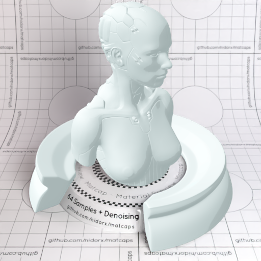
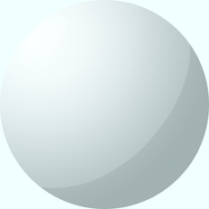

[[1024px](https://github.com/nidorx/matcaps/raw/master/1024/DEE8E8_A6B5B5_BCCCCC_BAC4C4.png)]
[[512px](https://github.com/nidorx/matcaps/raw/master/512/DEE8E8_A6B5B5_BCCCCC_BAC4C4-512px.png)]
[[256px](https://github.com/nidorx/matcaps/raw/master/256/DEE8E8_A6B5B5_BCCCCC_BAC4C4-256px.png)]
[[128px](https://github.com/nidorx/matcaps/raw/master/128/DEE8E8_A6B5B5_BCCCCC_BAC4C4-128px.png)]
[[64px](https://github.com/nidorx/matcaps/raw/master/64/DEE8E8_A6B5B5_BCCCCC_BAC4C4-64px.png)]
[~~ZBrush Material (ZMT)~~]

---
### DFD9C2_B5AE92_F9F7EA_C4C4A4
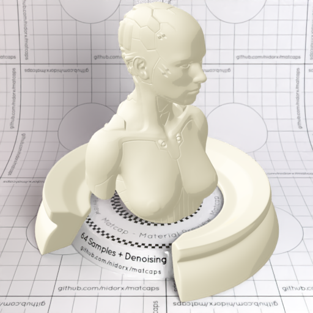

[[1024px](https://github.com/nidorx/matcaps/raw/master/1024/DFD9C2_B5AE92_F9F7EA_C4C4A4.png)]
[[512px](https://github.com/nidorx/matcaps/raw/master/512/DFD9C2_B5AE92_F9F7EA_C4C4A4-512px.png)]
[[256px](https://github.com/nidorx/matcaps/raw/master/256/DFD9C2_B5AE92_F9F7EA_C4C4A4-256px.png)]
[[128px](https://github.com/nidorx/matcaps/raw/master/128/DFD9C2_B5AE92_F9F7EA_C4C4A4-128px.png)]
[[64px](https://github.com/nidorx/matcaps/raw/master/64/DFD9C2_B5AE92_F9F7EA_C4C4A4-64px.png)]
[~~ZBrush Material (ZMT)~~]

---
### DFDBB7_F9F8E3_B5AF86_BCBC8C
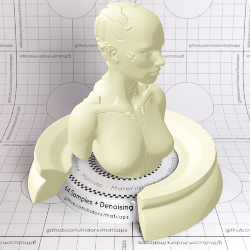

[[1024px](https://github.com/nidorx/matcaps/raw/master/1024/DFDBB7_F9F8E3_B5AF86_BCBC8C.png)]
[[512px](https://github.com/nidorx/matcaps/raw/master/512/DFDBB7_F9F8E3_B5AF86_BCBC8C-512px.png)]
[[256px](https://github.com/nidorx/matcaps/raw/master/256/DFDBB7_F9F8E3_B5AF86_BCBC8C-256px.png)]
[[128px](https://github.com/nidorx/matcaps/raw/master/128/DFDBB7_F9F8E3_B5AF86_BCBC8C-128px.png)]
[[64px](https://github.com/nidorx/matcaps/raw/master/64/DFDBB7_F9F8E3_B5AF86_BCBC8C-64px.png)]
[~~ZBrush Material (ZMT)~~]

---
### DFDFCA_4D2D07_6B5224_857145
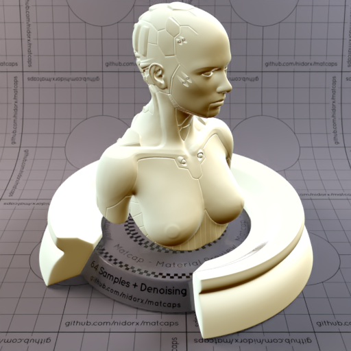

[[1024px](https://github.com/nidorx/matcaps/raw/master/1024/DFDFCA_4D2D07_6B5224_857145.png)]
[[512px](https://github.com/nidorx/matcaps/raw/master/512/DFDFCA_4D2D07_6B5224_857145-512px.png)]
[[256px](https://github.com/nidorx/matcaps/raw/master/256/DFDFCA_4D2D07_6B5224_857145-256px.png)]
[[128px](https://github.com/nidorx/matcaps/raw/master/128/DFDFCA_4D2D07_6B5224_857145-128px.png)]
[[64px](https://github.com/nidorx/matcaps/raw/master/64/DFDFCA_4D2D07_6B5224_857145-64px.png)]
[[ZBrush Material (ZMT)](https://github.com/nidorx/matcaps/raw/master/zmt/DFDFCA_4D2D07_6B5224_857145.zmt)]

---
### DFDFD6_58544E_81766A_989288
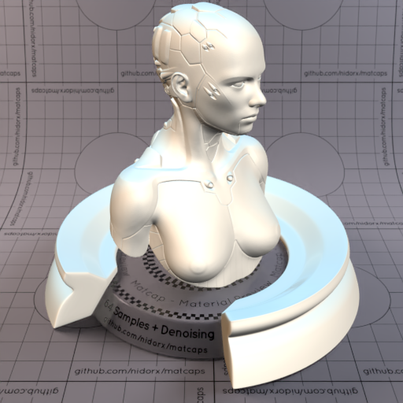
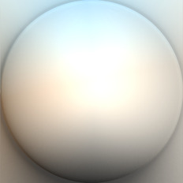

[[1024px](https://github.com/nidorx/matcaps/raw/master/1024/DFDFD6_58544E_81766A_989288.png)]
[[512px](https://github.com/nidorx/matcaps/raw/master/512/DFDFD6_58544E_81766A_989288-512px.png)]
[[256px](https://github.com/nidorx/matcaps/raw/master/256/DFDFD6_58544E_81766A_989288-256px.png)]
[[128px](https://github.com/nidorx/matcaps/raw/master/128/DFDFD6_58544E_81766A_989288-128px.png)]
[[64px](https://github.com/nidorx/matcaps/raw/master/64/DFDFD6_58544E_81766A_989288-64px.png)]
[[ZBrush Material (ZMT)](https://github.com/nidorx/matcaps/raw/master/zmt/DFDFD6_58544E_81766A_989288.zmt)]

---
### E1E1D4_777C7B_9FA19A_898F8D
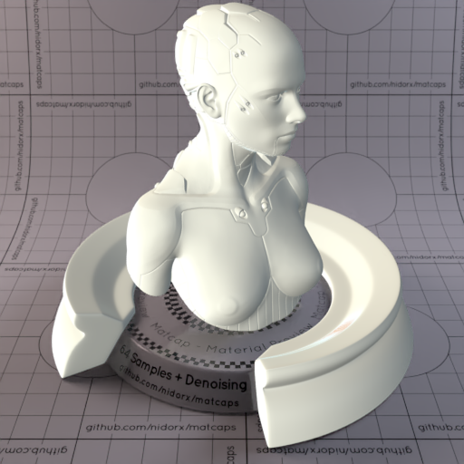

[[1024px](https://github.com/nidorx/matcaps/raw/master/1024/E1E1D4_777C7B_9FA19A_898F8D.png)]
[[512px](https://github.com/nidorx/matcaps/raw/master/512/E1E1D4_777C7B_9FA19A_898F8D-512px.png)]
[[256px](https://github.com/nidorx/matcaps/raw/master/256/E1E1D4_777C7B_9FA19A_898F8D-256px.png)]
[[128px](https://github.com/nidorx/matcaps/raw/master/128/E1E1D4_777C7B_9FA19A_898F8D-128px.png)]
[[64px](https://github.com/nidorx/matcaps/raw/master/64/E1E1D4_777C7B_9FA19A_898F8D-64px.png)]
[[ZBrush Material (ZMT)](https://github.com/nidorx/matcaps/raw/master/zmt/E1E1D4_777C7B_9FA19A_898F8D.zmt)]

---
### E1E1E0_363636_989897_747472
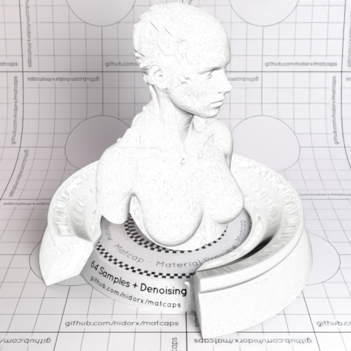

[[1024px](https://github.com/nidorx/matcaps/raw/master/1024/E1E1E0_363636_989897_747472.png)]
[[512px](https://github.com/nidorx/matcaps/raw/master/512/E1E1E0_363636_989897_747472-512px.png)]
[[256px](https://github.com/nidorx/matcaps/raw/master/256/E1E1E0_363636_989897_747472-256px.png)]
[[128px](https://github.com/nidorx/matcaps/raw/master/128/E1E1E0_363636_989897_747472-128px.png)]
[[64px](https://github.com/nidorx/matcaps/raw/master/64/E1E1E0_363636_989897_747472-64px.png)]
[[ZBrush Material (ZMT)](https://github.com/nidorx/matcaps/raw/master/zmt/E1E1E0_363636_989897_747472.zmt)]

---
### E2D3BC_867255_B39E7F_96836C
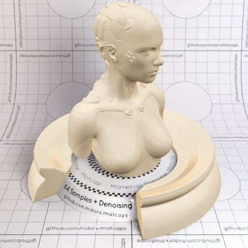

[[1024px](https://github.com/nidorx/matcaps/raw/master/1024/E2D3BC_867255_B39E7F_96836C.png)]
[[512px](https://github.com/nidorx/matcaps/raw/master/512/E2D3BC_867255_B39E7F_96836C-512px.png)]
[[256px](https://github.com/nidorx/matcaps/raw/master/256/E2D3BC_867255_B39E7F_96836C-256px.png)]
[[128px](https://github.com/nidorx/matcaps/raw/master/128/E2D3BC_867255_B39E7F_96836C-128px.png)]
[[64px](https://github.com/nidorx/matcaps/raw/master/64/E2D3BC_867255_B39E7F_96836C-64px.png)]
[[ZBrush Material (ZMT)](https://github.com/nidorx/matcaps/raw/master/zmt/E2D3BC_867255_B39E7F_96836C.zmt)]

---
### E2E2E7_AEAEB5_C4C4CC_C4C4C4
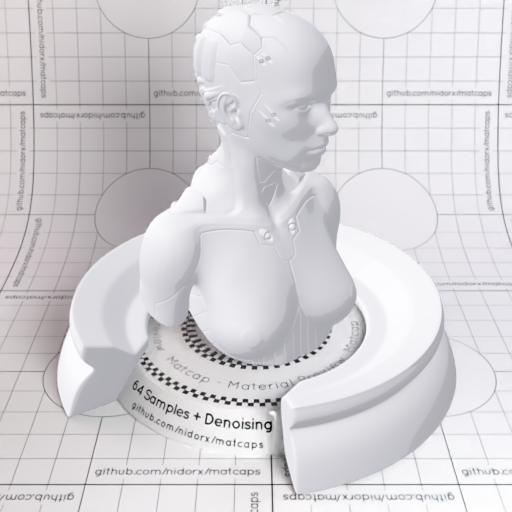
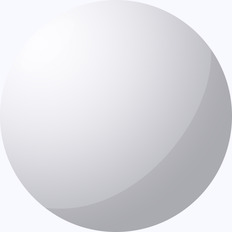

[[1024px](https://github.com/nidorx/matcaps/raw/master/1024/E2E2E7_AEAEB5_C4C4CC_C4C4C4.png)]
[[512px](https://github.com/nidorx/matcaps/raw/master/512/E2E2E7_AEAEB5_C4C4CC_C4C4C4-512px.png)]
[[256px](https://github.com/nidorx/matcaps/raw/master/256/E2E2E7_AEAEB5_C4C4CC_C4C4C4-256px.png)]
[[128px](https://github.com/nidorx/matcaps/raw/master/128/E2E2E7_AEAEB5_C4C4CC_C4C4C4-128px.png)]
[[64px](https://github.com/nidorx/matcaps/raw/master/64/E2E2E7_AEAEB5_C4C4CC_C4C4C4-64px.png)]
[~~ZBrush Material (ZMT)~~]

---
### E42E12_F35132_F86949_B71B0A
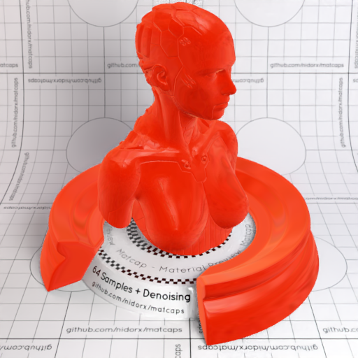

[[1024px](https://github.com/nidorx/matcaps/raw/master/1024/E42E12_F35132_F86949_B71B0A.png)]
[[512px](https://github.com/nidorx/matcaps/raw/master/512/E42E12_F35132_F86949_B71B0A-512px.png)]
[[256px](https://github.com/nidorx/matcaps/raw/master/256/E42E12_F35132_F86949_B71B0A-256px.png)]
[[128px](https://github.com/nidorx/matcaps/raw/master/128/E42E12_F35132_F86949_B71B0A-128px.png)]
[[64px](https://github.com/nidorx/matcaps/raw/master/64/E42E12_F35132_F86949_B71B0A-64px.png)]
[[ZBrush Material (ZMT)](https://github.com/nidorx/matcaps/raw/master/zmt/E42E12_F35132_F86949_B71B0A.zmt)]

---
### E5DED7_AFA69D_C4BCB4_C3BAAB
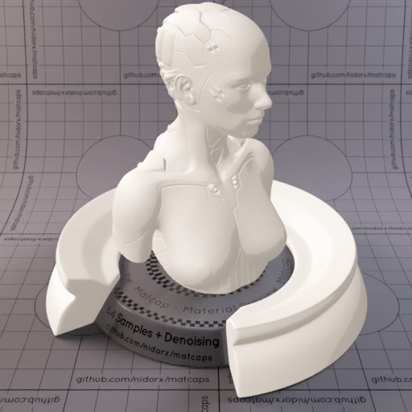

[[1024px](https://github.com/nidorx/matcaps/raw/master/1024/E5DED7_AFA69D_C4BCB4_C3BAAB.png)]
[[512px](https://github.com/nidorx/matcaps/raw/master/512/E5DED7_AFA69D_C4BCB4_C3BAAB-512px.png)]
[[256px](https://github.com/nidorx/matcaps/raw/master/256/E5DED7_AFA69D_C4BCB4_C3BAAB-256px.png)]
[[128px](https://github.com/nidorx/matcaps/raw/master/128/E5DED7_AFA69D_C4BCB4_C3BAAB-128px.png)]
[[64px](https://github.com/nidorx/matcaps/raw/master/64/E5DED7_AFA69D_C4BCB4_C3BAAB-64px.png)]
[~~ZBrush Material (ZMT)~~]

---
### E6BF3C_5A4719_977726_FCFC82

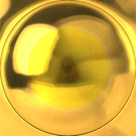

[[1024px](https://github.com/nidorx/matcaps/raw/master/1024/E6BF3C_5A4719_977726_FCFC82.png)]
[[512px](https://github.com/nidorx/matcaps/raw/master/512/E6BF3C_5A4719_977726_FCFC82-512px.png)]
[[256px](https://github.com/nidorx/matcaps/raw/master/256/E6BF3C_5A4719_977726_FCFC82-256px.png)]
[[128px](https://github.com/nidorx/matcaps/raw/master/128/E6BF3C_5A4719_977726_FCFC82-128px.png)]
[[64px](https://github.com/nidorx/matcaps/raw/master/64/E6BF3C_5A4719_977726_FCFC82-64px.png)]
[[ZBrush Material (ZMT)](https://github.com/nidorx/matcaps/raw/master/zmt/E6BF3C_5A4719_977726_FCFC82.zmt)]

---
### E6E3E3_B5AFAF_CCC4C4_C4C4C4
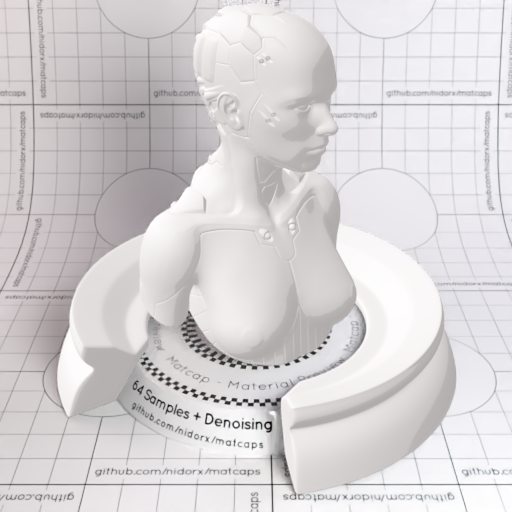

[[1024px](https://github.com/nidorx/matcaps/raw/master/1024/E6E3E3_B5AFAF_CCC4C4_C4C4C4.png)]
[[512px](https://github.com/nidorx/matcaps/raw/master/512/E6E3E3_B5AFAF_CCC4C4_C4C4C4-512px.png)]
[[256px](https://github.com/nidorx/matcaps/raw/master/256/E6E3E3_B5AFAF_CCC4C4_C4C4C4-256px.png)]
[[128px](https://github.com/nidorx/matcaps/raw/master/128/E6E3E3_B5AFAF_CCC4C4_C4C4C4-128px.png)]
[[64px](https://github.com/nidorx/matcaps/raw/master/64/E6E3E3_B5AFAF_CCC4C4_C4C4C4-64px.png)]
[~~ZBrush Material (ZMT)~~]

---
### E6E6E6_AAAAAA_C4C4C4_CCCCCC
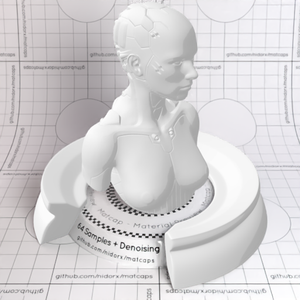

[[1024px](https://github.com/nidorx/matcaps/raw/master/1024/E6E6E6_AAAAAA_C4C4C4_CCCCCC.png)]
[[512px](https://github.com/nidorx/matcaps/raw/master/512/E6E6E6_AAAAAA_C4C4C4_CCCCCC-512px.png)]
[[256px](https://github.com/nidorx/matcaps/raw/master/256/E6E6E6_AAAAAA_C4C4C4_CCCCCC-256px.png)]
[[128px](https://github.com/nidorx/matcaps/raw/master/128/E6E6E6_AAAAAA_C4C4C4_CCCCCC-128px.png)]
[[64px](https://github.com/nidorx/matcaps/raw/master/64/E6E6E6_AAAAAA_C4C4C4_CCCCCC-64px.png)]
[~~ZBrush Material (ZMT)~~]

---
### E7632F_FBA06B_BB2905_FB865E
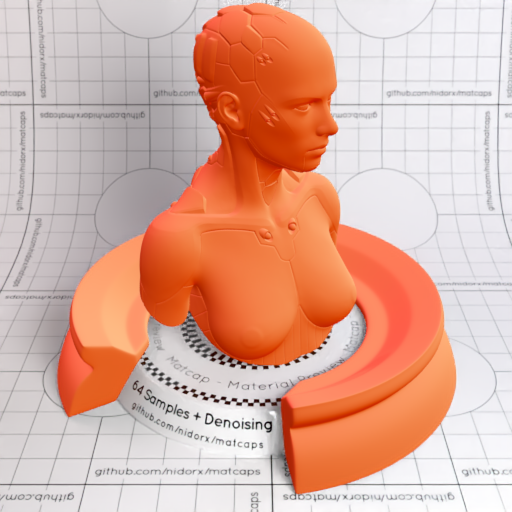

[[1024px](https://github.com/nidorx/matcaps/raw/master/1024/E7632F_FBA06B_BB2905_FB865E.png)]
[[512px](https://github.com/nidorx/matcaps/raw/master/512/E7632F_FBA06B_BB2905_FB865E-512px.png)]
[[256px](https://github.com/nidorx/matcaps/raw/master/256/E7632F_FBA06B_BB2905_FB865E-256px.png)]
[[128px](https://github.com/nidorx/matcaps/raw/master/128/E7632F_FBA06B_BB2905_FB865E-128px.png)]
[[64px](https://github.com/nidorx/matcaps/raw/master/64/E7632F_FBA06B_BB2905_FB865E-64px.png)]
[[ZBrush Material (ZMT)](https://github.com/nidorx/matcaps/raw/master/zmt/E7632F_FBA06B_BB2905_FB865E.zmt)]

---
### E7E2D8_B1AA9D_C9C2B3_BCB4AC

[[1024px](https://github.com/nidorx/matcaps/raw/master/1024/E7E2D8_B1AA9D_C9C2B3_BCB4AC.png)]
[[512px](https://github.com/nidorx/matcaps/raw/master/512/E7E2D8_B1AA9D_C9C2B3_BCB4AC-512px.png)]
[[256px](https://github.com/nidorx/matcaps/raw/master/256/E7E2D8_B1AA9D_C9C2B3_BCB4AC-256px.png)]
[[128px](https://github.com/nidorx/matcaps/raw/master/128/E7E2D8_B1AA9D_C9C2B3_BCB4AC-128px.png)]
[[64px](https://github.com/nidorx/matcaps/raw/master/64/E7E2D8_B1AA9D_C9C2B3_BCB4AC-64px.png)]
[~~ZBrush Material (ZMT)~~]

---
### E80404_B50404_CB0404_FC3333
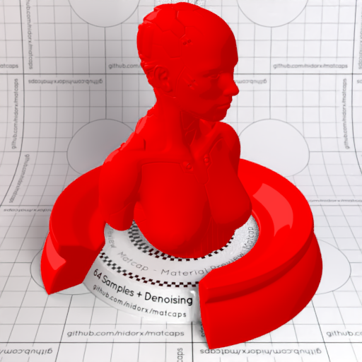

[[1024px](https://github.com/nidorx/matcaps/raw/master/1024/E80404_B50404_CB0404_FC3333.png)]
[[512px](https://github.com/nidorx/matcaps/raw/master/512/E80404_B50404_CB0404_FC3333-512px.png)]
[[256px](https://github.com/nidorx/matcaps/raw/master/256/E80404_B50404_CB0404_FC3333-256px.png)]
[[128px](https://github.com/nidorx/matcaps/raw/master/128/E80404_B50404_CB0404_FC3333-128px.png)]
[[64px](https://github.com/nidorx/matcaps/raw/master/64/E80404_B50404_CB0404_FC3333-64px.png)]
[~~ZBrush Material (ZMT)~~]

---
### E804E8_B504B5_CC04CC_FC33FC
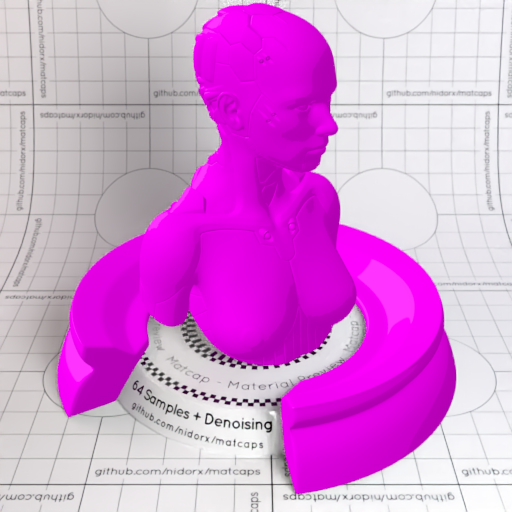

[[1024px](https://github.com/nidorx/matcaps/raw/master/1024/E804E8_B504B5_CC04CC_FC33FC.png)]
[[512px](https://github.com/nidorx/matcaps/raw/master/512/E804E8_B504B5_CC04CC_FC33FC-512px.png)]
[[256px](https://github.com/nidorx/matcaps/raw/master/256/E804E8_B504B5_CC04CC_FC33FC-256px.png)]
[[128px](https://github.com/nidorx/matcaps/raw/master/128/E804E8_B504B5_CC04CC_FC33FC-128px.png)]
[[64px](https://github.com/nidorx/matcaps/raw/master/64/E804E8_B504B5_CC04CC_FC33FC-64px.png)]
[~~ZBrush Material (ZMT)~~]

---