A huge library of MatCap textures in PNG and ZMT.

## Navigation
* [Home](/)
* [Page 1](PAGE-1.md)
* [Page 2](PAGE-2.md)
* [Page 3](PAGE-3.md)
* [Page 4](PAGE-4.md)
* [Page 5](PAGE-5.md)
* [Page 6](PAGE-6.md)
* [Page 7](PAGE-7.md)
* [Page 8](PAGE-8.md)
* [Page 9](PAGE-9.md)
* [Page 10](PAGE-10.md)
* [Page 11](PAGE-11.md)
* [Page 12](PAGE-12.md)
* [Page 13](PAGE-13.md)
* [Page 14](PAGE-14.md)
* [Page 15](PAGE-15.md)
* [Page 16](PAGE-16.md)
* [Page 17](PAGE-17.md)
* [Page 18](PAGE-18.md)
* [Page 19](PAGE-19.md)
* [Page 20](PAGE-20.md)
* [Page 21](PAGE-21.md)
* [Page 22](PAGE-22.md)
* [Page 23](PAGE-23.md)
* [Page 24](PAGE-24.md)
* [Page 25](PAGE-25.md)
* [Page 26](PAGE-26.md)
* [Page 27](PAGE-27.md)
* [Page 28](PAGE-28.md)
* [Page 29](PAGE-29.md)
* [Page 30](PAGE-30.md)
* Page 31
* [Page 32](PAGE-32.md)
* [Page 33](PAGE-33.md)
## Page 31 Matcaps
### DEE3E8_DEE3E8_A6AEB5_BCC4CC
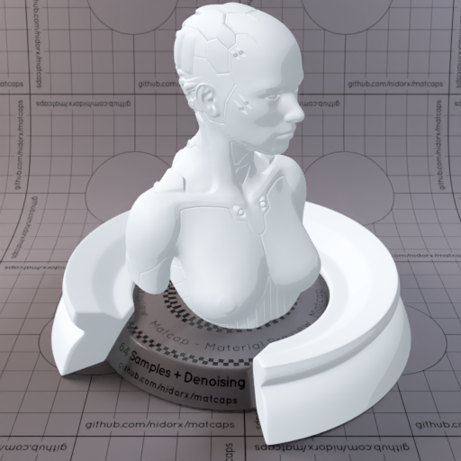
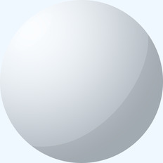

[[1024px](https://github.com/nidorx/matcaps/raw/master/1024/DEE3E8_DEE3E8_A6AEB5_BCC4CC.png)]
[[512px](https://github.com/nidorx/matcaps/raw/master/512/DEE3E8_DEE3E8_A6AEB5_BCC4CC-512px.png)]
[[256px](https://github.com/nidorx/matcaps/raw/master/256/DEE3E8_DEE3E8_A6AEB5_BCC4CC-256px.png)]
[[128px](https://github.com/nidorx/matcaps/raw/master/128/DEE3E8_DEE3E8_A6AEB5_BCC4CC-128px.png)]
[[64px](https://github.com/nidorx/matcaps/raw/master/64/DEE3E8_DEE3E8_A6AEB5_BCC4CC-64px.png)]
[~~ZBrush Material (ZMT)~~]

---
### DEE8DE_DEE8DE_A6B5A6_BCCCBC

[[1024px](https://github.com/nidorx/matcaps/raw/master/1024/DEE8DE_DEE8DE_A6B5A6_BCCCBC.png)]
[[512px](https://github.com/nidorx/matcaps/raw/master/512/DEE8DE_DEE8DE_A6B5A6_BCCCBC-512px.png)]
[[256px](https://github.com/nidorx/matcaps/raw/master/256/DEE8DE_DEE8DE_A6B5A6_BCCCBC-256px.png)]
[[128px](https://github.com/nidorx/matcaps/raw/master/128/DEE8DE_DEE8DE_A6B5A6_BCCCBC-128px.png)]
[[64px](https://github.com/nidorx/matcaps/raw/master/64/DEE8DE_DEE8DE_A6B5A6_BCCCBC-64px.png)]
[~~ZBrush Material (ZMT)~~]

---
### DEE8E8_DEE8E8_A6B5B5_BCCCCC
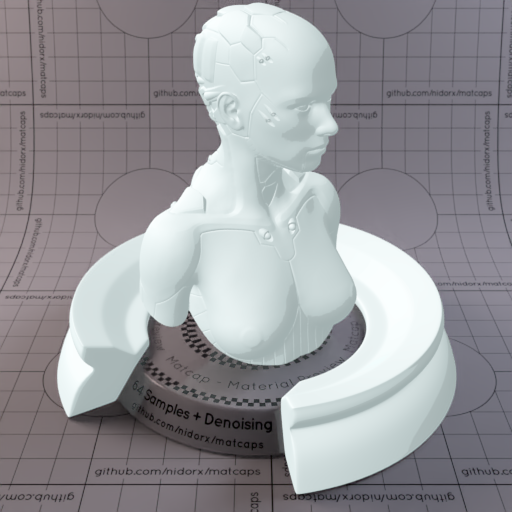

[[1024px](https://github.com/nidorx/matcaps/raw/master/1024/DEE8E8_DEE8E8_A6B5B5_BCCCCC.png)]
[[512px](https://github.com/nidorx/matcaps/raw/master/512/DEE8E8_DEE8E8_A6B5B5_BCCCCC-512px.png)]
[[256px](https://github.com/nidorx/matcaps/raw/master/256/DEE8E8_DEE8E8_A6B5B5_BCCCCC-256px.png)]
[[128px](https://github.com/nidorx/matcaps/raw/master/128/DEE8E8_DEE8E8_A6B5B5_BCCCCC-128px.png)]
[[64px](https://github.com/nidorx/matcaps/raw/master/64/DEE8E8_DEE8E8_A6B5B5_BCCCCC-64px.png)]
[~~ZBrush Material (ZMT)~~]

---
### DFD9C2_DFD9C2_B5AE92_F9F7EA

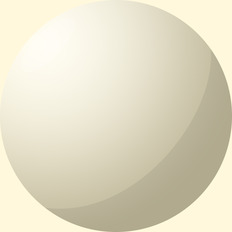

[[1024px](https://github.com/nidorx/matcaps/raw/master/1024/DFD9C2_DFD9C2_B5AE92_F9F7EA.png)]
[[512px](https://github.com/nidorx/matcaps/raw/master/512/DFD9C2_DFD9C2_B5AE92_F9F7EA-512px.png)]
[[256px](https://github.com/nidorx/matcaps/raw/master/256/DFD9C2_DFD9C2_B5AE92_F9F7EA-256px.png)]
[[128px](https://github.com/nidorx/matcaps/raw/master/128/DFD9C2_DFD9C2_B5AE92_F9F7EA-128px.png)]
[[64px](https://github.com/nidorx/matcaps/raw/master/64/DFD9C2_DFD9C2_B5AE92_F9F7EA-64px.png)]
[~~ZBrush Material (ZMT)~~]

---
### DFDBB7_DFDBB7_F9F8E3_B5AF86

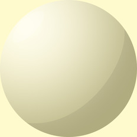

[[1024px](https://github.com/nidorx/matcaps/raw/master/1024/DFDBB7_DFDBB7_F9F8E3_B5AF86.png)]
[[512px](https://github.com/nidorx/matcaps/raw/master/512/DFDBB7_DFDBB7_F9F8E3_B5AF86-512px.png)]
[[256px](https://github.com/nidorx/matcaps/raw/master/256/DFDBB7_DFDBB7_F9F8E3_B5AF86-256px.png)]
[[128px](https://github.com/nidorx/matcaps/raw/master/128/DFDBB7_DFDBB7_F9F8E3_B5AF86-128px.png)]
[[64px](https://github.com/nidorx/matcaps/raw/master/64/DFDBB7_DFDBB7_F9F8E3_B5AF86-64px.png)]
[~~ZBrush Material (ZMT)~~]

---
### DFDFCA_DFDFCA_4D2D07_6B5224

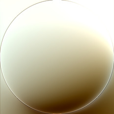

[[1024px](https://github.com/nidorx/matcaps/raw/master/1024/DFDFCA_DFDFCA_4D2D07_6B5224.png)]
[[512px](https://github.com/nidorx/matcaps/raw/master/512/DFDFCA_DFDFCA_4D2D07_6B5224-512px.png)]
[[256px](https://github.com/nidorx/matcaps/raw/master/256/DFDFCA_DFDFCA_4D2D07_6B5224-256px.png)]
[[128px](https://github.com/nidorx/matcaps/raw/master/128/DFDFCA_DFDFCA_4D2D07_6B5224-128px.png)]
[[64px](https://github.com/nidorx/matcaps/raw/master/64/DFDFCA_DFDFCA_4D2D07_6B5224-64px.png)]
[[ZBrush Material (ZMT)](https://github.com/nidorx/matcaps/raw/master/zmt/DFDFCA_DFDFCA_4D2D07_6B5224.zmt)]

---
### DFDFD6_DFDFD6_58544E_81766A

[[1024px](https://github.com/nidorx/matcaps/raw/master/1024/DFDFD6_DFDFD6_58544E_81766A.png)]
[[512px](https://github.com/nidorx/matcaps/raw/master/512/DFDFD6_DFDFD6_58544E_81766A-512px.png)]
[[256px](https://github.com/nidorx/matcaps/raw/master/256/DFDFD6_DFDFD6_58544E_81766A-256px.png)]
[[128px](https://github.com/nidorx/matcaps/raw/master/128/DFDFD6_DFDFD6_58544E_81766A-128px.png)]
[[64px](https://github.com/nidorx/matcaps/raw/master/64/DFDFD6_DFDFD6_58544E_81766A-64px.png)]
[[ZBrush Material (ZMT)](https://github.com/nidorx/matcaps/raw/master/zmt/DFDFD6_DFDFD6_58544E_81766A.zmt)]

---
### E1E1D4_E1E1D4_777C7B_9FA19A

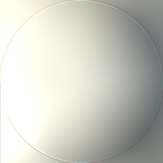

[[1024px](https://github.com/nidorx/matcaps/raw/master/1024/E1E1D4_E1E1D4_777C7B_9FA19A.png)]
[[512px](https://github.com/nidorx/matcaps/raw/master/512/E1E1D4_E1E1D4_777C7B_9FA19A-512px.png)]
[[256px](https://github.com/nidorx/matcaps/raw/master/256/E1E1D4_E1E1D4_777C7B_9FA19A-256px.png)]
[[128px](https://github.com/nidorx/matcaps/raw/master/128/E1E1D4_E1E1D4_777C7B_9FA19A-128px.png)]
[[64px](https://github.com/nidorx/matcaps/raw/master/64/E1E1D4_E1E1D4_777C7B_9FA19A-64px.png)]
[[ZBrush Material (ZMT)](https://github.com/nidorx/matcaps/raw/master/zmt/E1E1D4_E1E1D4_777C7B_9FA19A.zmt)]

---
### E1E1E0_E1E1E0_363636_989897
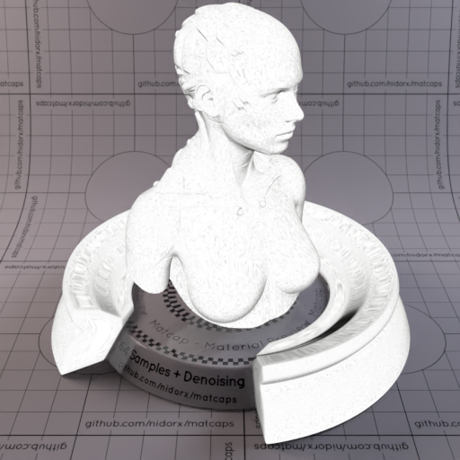

[[1024px](https://github.com/nidorx/matcaps/raw/master/1024/E1E1E0_E1E1E0_363636_989897.png)]
[[512px](https://github.com/nidorx/matcaps/raw/master/512/E1E1E0_E1E1E0_363636_989897-512px.png)]
[[256px](https://github.com/nidorx/matcaps/raw/master/256/E1E1E0_E1E1E0_363636_989897-256px.png)]
[[128px](https://github.com/nidorx/matcaps/raw/master/128/E1E1E0_E1E1E0_363636_989897-128px.png)]
[[64px](https://github.com/nidorx/matcaps/raw/master/64/E1E1E0_E1E1E0_363636_989897-64px.png)]
[[ZBrush Material (ZMT)](https://github.com/nidorx/matcaps/raw/master/zmt/E1E1E0_E1E1E0_363636_989897.zmt)]

---
### E2D3BC_E2D3BC_867255_B39E7F
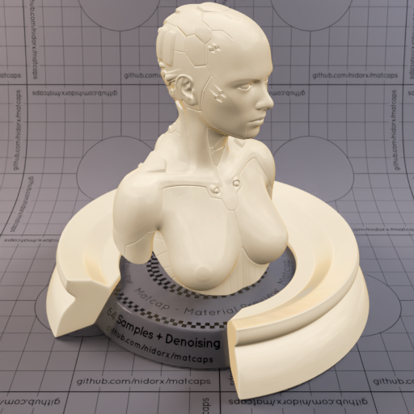
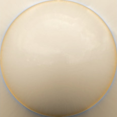

[[1024px](https://github.com/nidorx/matcaps/raw/master/1024/E2D3BC_E2D3BC_867255_B39E7F.png)]
[[512px](https://github.com/nidorx/matcaps/raw/master/512/E2D3BC_E2D3BC_867255_B39E7F-512px.png)]
[[256px](https://github.com/nidorx/matcaps/raw/master/256/E2D3BC_E2D3BC_867255_B39E7F-256px.png)]
[[128px](https://github.com/nidorx/matcaps/raw/master/128/E2D3BC_E2D3BC_867255_B39E7F-128px.png)]
[[64px](https://github.com/nidorx/matcaps/raw/master/64/E2D3BC_E2D3BC_867255_B39E7F-64px.png)]
[[ZBrush Material (ZMT)](https://github.com/nidorx/matcaps/raw/master/zmt/E2D3BC_E2D3BC_867255_B39E7F.zmt)]

---
### E2E2E7_E2E2E7_AEAEB5_C4C4CC
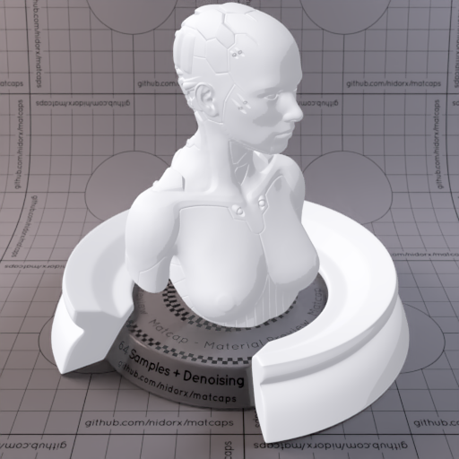

[[1024px](https://github.com/nidorx/matcaps/raw/master/1024/E2E2E7_E2E2E7_AEAEB5_C4C4CC.png)]
[[512px](https://github.com/nidorx/matcaps/raw/master/512/E2E2E7_E2E2E7_AEAEB5_C4C4CC-512px.png)]
[[256px](https://github.com/nidorx/matcaps/raw/master/256/E2E2E7_E2E2E7_AEAEB5_C4C4CC-256px.png)]
[[128px](https://github.com/nidorx/matcaps/raw/master/128/E2E2E7_E2E2E7_AEAEB5_C4C4CC-128px.png)]
[[64px](https://github.com/nidorx/matcaps/raw/master/64/E2E2E7_E2E2E7_AEAEB5_C4C4CC-64px.png)]
[~~ZBrush Material (ZMT)~~]

---
### E42E12_E42E12_F35132_F86949
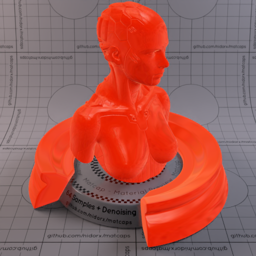

[[1024px](https://github.com/nidorx/matcaps/raw/master/1024/E42E12_E42E12_F35132_F86949.png)]
[[512px](https://github.com/nidorx/matcaps/raw/master/512/E42E12_E42E12_F35132_F86949-512px.png)]
[[256px](https://github.com/nidorx/matcaps/raw/master/256/E42E12_E42E12_F35132_F86949-256px.png)]
[[128px](https://github.com/nidorx/matcaps/raw/master/128/E42E12_E42E12_F35132_F86949-128px.png)]
[[64px](https://github.com/nidorx/matcaps/raw/master/64/E42E12_E42E12_F35132_F86949-64px.png)]
[[ZBrush Material (ZMT)](https://github.com/nidorx/matcaps/raw/master/zmt/E42E12_E42E12_F35132_F86949.zmt)]

---
### E5DED7_E5DED7_AFA69D_C4BCB4

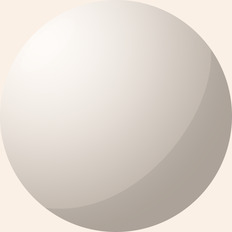

[[1024px](https://github.com/nidorx/matcaps/raw/master/1024/E5DED7_E5DED7_AFA69D_C4BCB4.png)]
[[512px](https://github.com/nidorx/matcaps/raw/master/512/E5DED7_E5DED7_AFA69D_C4BCB4-512px.png)]
[[256px](https://github.com/nidorx/matcaps/raw/master/256/E5DED7_E5DED7_AFA69D_C4BCB4-256px.png)]
[[128px](https://github.com/nidorx/matcaps/raw/master/128/E5DED7_E5DED7_AFA69D_C4BCB4-128px.png)]
[[64px](https://github.com/nidorx/matcaps/raw/master/64/E5DED7_E5DED7_AFA69D_C4BCB4-64px.png)]
[~~ZBrush Material (ZMT)~~]

---
### E6BF3C_E6BF3C_5A4719_977726

[[1024px](https://github.com/nidorx/matcaps/raw/master/1024/E6BF3C_E6BF3C_5A4719_977726.png)]
[[512px](https://github.com/nidorx/matcaps/raw/master/512/E6BF3C_E6BF3C_5A4719_977726-512px.png)]
[[256px](https://github.com/nidorx/matcaps/raw/master/256/E6BF3C_E6BF3C_5A4719_977726-256px.png)]
[[128px](https://github.com/nidorx/matcaps/raw/master/128/E6BF3C_E6BF3C_5A4719_977726-128px.png)]
[[64px](https://github.com/nidorx/matcaps/raw/master/64/E6BF3C_E6BF3C_5A4719_977726-64px.png)]
[[ZBrush Material (ZMT)](https://github.com/nidorx/matcaps/raw/master/zmt/E6BF3C_E6BF3C_5A4719_977726.zmt)]

---
### E6E3E3_E6E3E3_B5AFAF_CCC4C4

[[1024px](https://github.com/nidorx/matcaps/raw/master/1024/E6E3E3_E6E3E3_B5AFAF_CCC4C4.png)]
[[512px](https://github.com/nidorx/matcaps/raw/master/512/E6E3E3_E6E3E3_B5AFAF_CCC4C4-512px.png)]
[[256px](https://github.com/nidorx/matcaps/raw/master/256/E6E3E3_E6E3E3_B5AFAF_CCC4C4-256px.png)]
[[128px](https://github.com/nidorx/matcaps/raw/master/128/E6E3E3_E6E3E3_B5AFAF_CCC4C4-128px.png)]
[[64px](https://github.com/nidorx/matcaps/raw/master/64/E6E3E3_E6E3E3_B5AFAF_CCC4C4-64px.png)]
[~~ZBrush Material (ZMT)~~]

---
### E6E6E6_E6E6E6_AAAAAA_C4C4C4
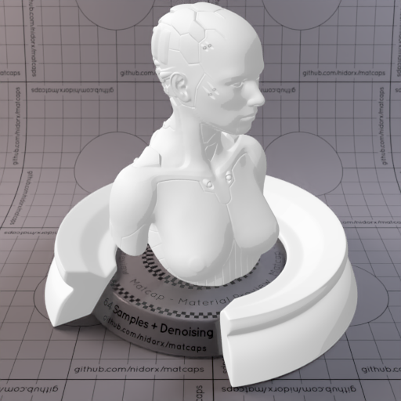

[[1024px](https://github.com/nidorx/matcaps/raw/master/1024/E6E6E6_E6E6E6_AAAAAA_C4C4C4.png)]
[[512px](https://github.com/nidorx/matcaps/raw/master/512/E6E6E6_E6E6E6_AAAAAA_C4C4C4-512px.png)]
[[256px](https://github.com/nidorx/matcaps/raw/master/256/E6E6E6_E6E6E6_AAAAAA_C4C4C4-256px.png)]
[[128px](https://github.com/nidorx/matcaps/raw/master/128/E6E6E6_E6E6E6_AAAAAA_C4C4C4-128px.png)]
[[64px](https://github.com/nidorx/matcaps/raw/master/64/E6E6E6_E6E6E6_AAAAAA_C4C4C4-64px.png)]
[~~ZBrush Material (ZMT)~~]

---
### E7632F_E7632F_FBA06B_BB2905
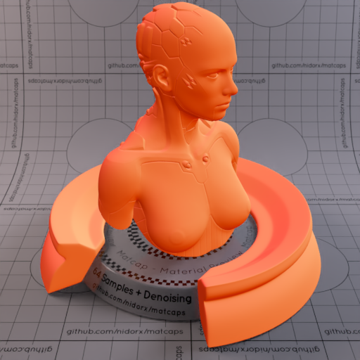
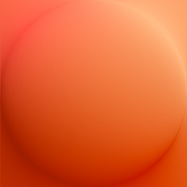

[[1024px](https://github.com/nidorx/matcaps/raw/master/1024/E7632F_E7632F_FBA06B_BB2905.png)]
[[512px](https://github.com/nidorx/matcaps/raw/master/512/E7632F_E7632F_FBA06B_BB2905-512px.png)]
[[256px](https://github.com/nidorx/matcaps/raw/master/256/E7632F_E7632F_FBA06B_BB2905-256px.png)]
[[128px](https://github.com/nidorx/matcaps/raw/master/128/E7632F_E7632F_FBA06B_BB2905-128px.png)]
[[64px](https://github.com/nidorx/matcaps/raw/master/64/E7632F_E7632F_FBA06B_BB2905-64px.png)]
[[ZBrush Material (ZMT)](https://github.com/nidorx/matcaps/raw/master/zmt/E7632F_E7632F_FBA06B_BB2905.zmt)]

---
### E7E2D8_E7E2D8_B1AA9D_C9C2B3
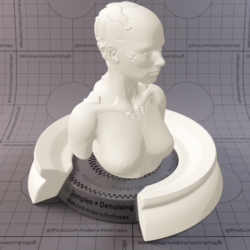

[[1024px](https://github.com/nidorx/matcaps/raw/master/1024/E7E2D8_E7E2D8_B1AA9D_C9C2B3.png)]
[[512px](https://github.com/nidorx/matcaps/raw/master/512/E7E2D8_E7E2D8_B1AA9D_C9C2B3-512px.png)]
[[256px](https://github.com/nidorx/matcaps/raw/master/256/E7E2D8_E7E2D8_B1AA9D_C9C2B3-256px.png)]
[[128px](https://github.com/nidorx/matcaps/raw/master/128/E7E2D8_E7E2D8_B1AA9D_C9C2B3-128px.png)]
[[64px](https://github.com/nidorx/matcaps/raw/master/64/E7E2D8_E7E2D8_B1AA9D_C9C2B3-64px.png)]
[~~ZBrush Material (ZMT)~~]

---
### E80404_E80404_B50404_CB0404
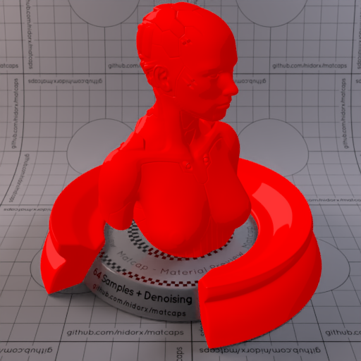
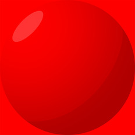

[[1024px](https://github.com/nidorx/matcaps/raw/master/1024/E80404_E80404_B50404_CB0404.png)]
[[512px](https://github.com/nidorx/matcaps/raw/master/512/E80404_E80404_B50404_CB0404-512px.png)]
[[256px](https://github.com/nidorx/matcaps/raw/master/256/E80404_E80404_B50404_CB0404-256px.png)]
[[128px](https://github.com/nidorx/matcaps/raw/master/128/E80404_E80404_B50404_CB0404-128px.png)]
[[64px](https://github.com/nidorx/matcaps/raw/master/64/E80404_E80404_B50404_CB0404-64px.png)]
[~~ZBrush Material (ZMT)~~]

---
### E804E8_E804E8_B504B5_CC04CC

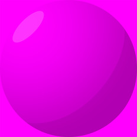

[[1024px](https://github.com/nidorx/matcaps/raw/master/1024/E804E8_E804E8_B504B5_CC04CC.png)]
[[512px](https://github.com/nidorx/matcaps/raw/master/512/E804E8_E804E8_B504B5_CC04CC-512px.png)]
[[256px](https://github.com/nidorx/matcaps/raw/master/256/E804E8_E804E8_B504B5_CC04CC-256px.png)]
[[128px](https://github.com/nidorx/matcaps/raw/master/128/E804E8_E804E8_B504B5_CC04CC-128px.png)]
[[64px](https://github.com/nidorx/matcaps/raw/master/64/E804E8_E804E8_B504B5_CC04CC-64px.png)]
[~~ZBrush Material (ZMT)~~]

---