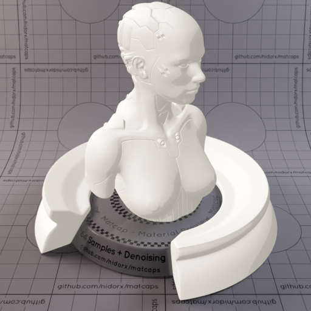
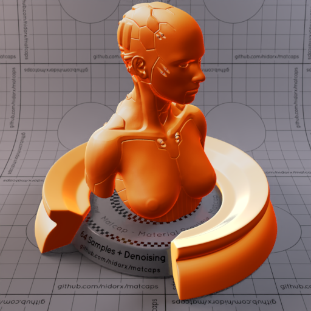
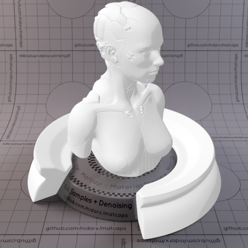
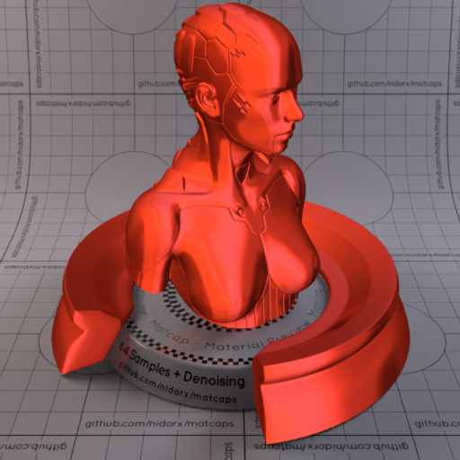
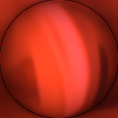
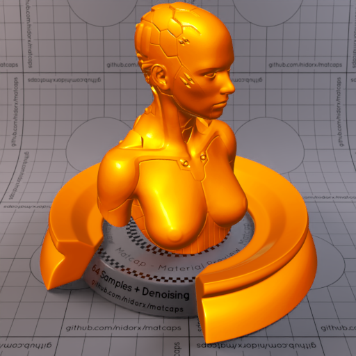
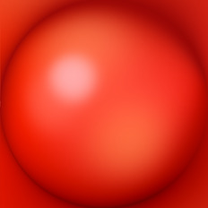
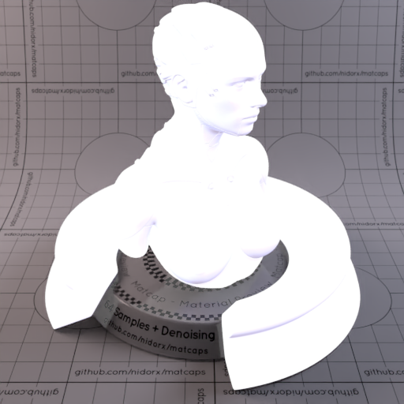
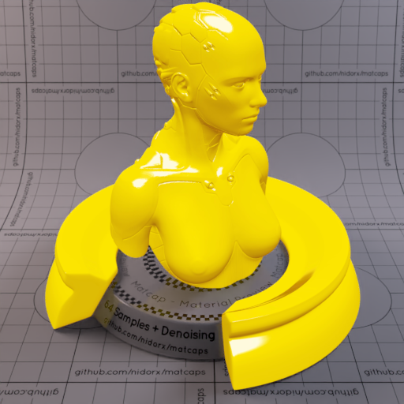
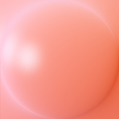

A huge library of MatCap textures in PNG and ZMT.

## Navigation
* [Home](/)
* [Page 1](PAGE-1.md)
* [Page 2](PAGE-2.md)
* [Page 3](PAGE-3.md)
* [Page 4](PAGE-4.md)
* [Page 5](PAGE-5.md)
* [Page 6](PAGE-6.md)
* [Page 7](PAGE-7.md)
* [Page 8](PAGE-8.md)
* [Page 9](PAGE-9.md)
* [Page 10](PAGE-10.md)
* [Page 11](PAGE-11.md)
* [Page 12](PAGE-12.md)
* [Page 13](PAGE-13.md)
* [Page 14](PAGE-14.md)
* [Page 15](PAGE-15.md)
* [Page 16](PAGE-16.md)
* [Page 17](PAGE-17.md)
* [Page 18](PAGE-18.md)
* [Page 19](PAGE-19.md)
* [Page 20](PAGE-20.md)
* [Page 21](PAGE-21.md)
* [Page 22](PAGE-22.md)
* [Page 23](PAGE-23.md)
* [Page 24](PAGE-24.md)
* [Page 25](PAGE-25.md)
* [Page 26](PAGE-26.md)
* [Page 27](PAGE-27.md)
* [Page 28](PAGE-28.md)
* [Page 29](PAGE-29.md)
* [Page 30](PAGE-30.md)
* [Page 31](PAGE-31.md)
* Page 32
* [Page 33](PAGE-33.md)
## Page 32 Matcaps
### E8DEE1_E8DEE1_B5A6AA_CCBCC1

[[1024px](https://github.com/nidorx/matcaps/raw/master/1024/E8DEE1_E8DEE1_B5A6AA_CCBCC1.png)]
[[512px](https://github.com/nidorx/matcaps/raw/master/512/E8DEE1_E8DEE1_B5A6AA_CCBCC1-512px.png)]
[[256px](https://github.com/nidorx/matcaps/raw/master/256/E8DEE1_E8DEE1_B5A6AA_CCBCC1-256px.png)]
[[128px](https://github.com/nidorx/matcaps/raw/master/128/E8DEE1_E8DEE1_B5A6AA_CCBCC1-128px.png)]
[[64px](https://github.com/nidorx/matcaps/raw/master/64/E8DEE1_E8DEE1_B5A6AA_CCBCC1-64px.png)]
[~~ZBrush Material (ZMT)~~]

---
### E8E5DE_E8E5DE_B5AFA6_CCC5BC

[[1024px](https://github.com/nidorx/matcaps/raw/master/1024/E8E5DE_E8E5DE_B5AFA6_CCC5BC.png)]
[[512px](https://github.com/nidorx/matcaps/raw/master/512/E8E5DE_E8E5DE_B5AFA6_CCC5BC-512px.png)]
[[256px](https://github.com/nidorx/matcaps/raw/master/256/E8E5DE_E8E5DE_B5AFA6_CCC5BC-256px.png)]
[[128px](https://github.com/nidorx/matcaps/raw/master/128/E8E5DE_E8E5DE_B5AFA6_CCC5BC-128px.png)]
[[64px](https://github.com/nidorx/matcaps/raw/master/64/E8E5DE_E8E5DE_B5AFA6_CCC5BC-64px.png)]
[~~ZBrush Material (ZMT)~~]

---
### E8E8DE_E8E8DE_B5B5A6_CCCCBC

[[1024px](https://github.com/nidorx/matcaps/raw/master/1024/E8E8DE_E8E8DE_B5B5A6_CCCCBC.png)]
[[512px](https://github.com/nidorx/matcaps/raw/master/512/E8E8DE_E8E8DE_B5B5A6_CCCCBC-512px.png)]
[[256px](https://github.com/nidorx/matcaps/raw/master/256/E8E8DE_E8E8DE_B5B5A6_CCCCBC-256px.png)]
[[128px](https://github.com/nidorx/matcaps/raw/master/128/E8E8DE_E8E8DE_B5B5A6_CCCCBC-128px.png)]
[[64px](https://github.com/nidorx/matcaps/raw/master/64/E8E8DE_E8E8DE_B5B5A6_CCCCBC-64px.png)]
[~~ZBrush Material (ZMT)~~]

---
### E9CCA1_E9CCA1_A63106_DF8C3B

[[1024px](https://github.com/nidorx/matcaps/raw/master/1024/E9CCA1_E9CCA1_A63106_DF8C3B.png)]
[[512px](https://github.com/nidorx/matcaps/raw/master/512/E9CCA1_E9CCA1_A63106_DF8C3B-512px.png)]
[[256px](https://github.com/nidorx/matcaps/raw/master/256/E9CCA1_E9CCA1_A63106_DF8C3B-256px.png)]
[[128px](https://github.com/nidorx/matcaps/raw/master/128/E9CCA1_E9CCA1_A63106_DF8C3B-128px.png)]
[[64px](https://github.com/nidorx/matcaps/raw/master/64/E9CCA1_E9CCA1_A63106_DF8C3B-64px.png)]
[[ZBrush Material (ZMT)](https://github.com/nidorx/matcaps/raw/master/zmt/E9CCA1_E9CCA1_A63106_DF8C3B.zmt)]

---
### EA783E_EA783E_6D4830_905837

[[1024px](https://github.com/nidorx/matcaps/raw/master/1024/EA783E_EA783E_6D4830_905837.png)]
[[512px](https://github.com/nidorx/matcaps/raw/master/512/EA783E_EA783E_6D4830_905837-512px.png)]
[[256px](https://github.com/nidorx/matcaps/raw/master/256/EA783E_EA783E_6D4830_905837-256px.png)]
[[128px](https://github.com/nidorx/matcaps/raw/master/128/EA783E_EA783E_6D4830_905837-128px.png)]
[[64px](https://github.com/nidorx/matcaps/raw/master/64/EA783E_EA783E_6D4830_905837-64px.png)]
[[ZBrush Material (ZMT)](https://github.com/nidorx/matcaps/raw/master/zmt/EA783E_EA783E_6D4830_905837.zmt)]

---
### EAD8D6_EAD8D6_B59A97_CCB4B0

[[1024px](https://github.com/nidorx/matcaps/raw/master/1024/EAD8D6_EAD8D6_B59A97_CCB4B0.png)]
[[512px](https://github.com/nidorx/matcaps/raw/master/512/EAD8D6_EAD8D6_B59A97_CCB4B0-512px.png)]
[[256px](https://github.com/nidorx/matcaps/raw/master/256/EAD8D6_EAD8D6_B59A97_CCB4B0-256px.png)]
[[128px](https://github.com/nidorx/matcaps/raw/master/128/EAD8D6_EAD8D6_B59A97_CCB4B0-128px.png)]
[[64px](https://github.com/nidorx/matcaps/raw/master/64/EAD8D6_EAD8D6_B59A97_CCB4B0-64px.png)]
[~~ZBrush Material (ZMT)~~]

---
### EAEAEA_EAEAEA_B5B5B5_CCCCCC

[[1024px](https://github.com/nidorx/matcaps/raw/master/1024/EAEAEA_EAEAEA_B5B5B5_CCCCCC.png)]
[[512px](https://github.com/nidorx/matcaps/raw/master/512/EAEAEA_EAEAEA_B5B5B5_CCCCCC-512px.png)]
[[256px](https://github.com/nidorx/matcaps/raw/master/256/EAEAEA_EAEAEA_B5B5B5_CCCCCC-256px.png)]
[[128px](https://github.com/nidorx/matcaps/raw/master/128/EAEAEA_EAEAEA_B5B5B5_CCCCCC-128px.png)]
[[64px](https://github.com/nidorx/matcaps/raw/master/64/EAEAEA_EAEAEA_B5B5B5_CCCCCC-64px.png)]
[~~ZBrush Material (ZMT)~~]

---
### EAEAEA_EAEAEA_B6B6B6_CCCCCC

[[1024px](https://github.com/nidorx/matcaps/raw/master/1024/EAEAEA_EAEAEA_B6B6B6_CCCCCC.png)]
[[512px](https://github.com/nidorx/matcaps/raw/master/512/EAEAEA_EAEAEA_B6B6B6_CCCCCC-512px.png)]
[[256px](https://github.com/nidorx/matcaps/raw/master/256/EAEAEA_EAEAEA_B6B6B6_CCCCCC-256px.png)]
[[128px](https://github.com/nidorx/matcaps/raw/master/128/EAEAEA_EAEAEA_B6B6B6_CCCCCC-128px.png)]
[[64px](https://github.com/nidorx/matcaps/raw/master/64/EAEAEA_EAEAEA_B6B6B6_CCCCCC-64px.png)]
[[ZBrush Material (ZMT)](https://github.com/nidorx/matcaps/raw/master/zmt/EAEAEA_EAEAEA_B6B6B6_CCCCCC.zmt)]

---
### ED4630_ED4630_791A0E_A42716

[[1024px](https://github.com/nidorx/matcaps/raw/master/1024/ED4630_ED4630_791A0E_A42716.png)]
[[512px](https://github.com/nidorx/matcaps/raw/master/512/ED4630_ED4630_791A0E_A42716-512px.png)]
[[256px](https://github.com/nidorx/matcaps/raw/master/256/ED4630_ED4630_791A0E_A42716-256px.png)]
[[128px](https://github.com/nidorx/matcaps/raw/master/128/ED4630_ED4630_791A0E_A42716-128px.png)]
[[64px](https://github.com/nidorx/matcaps/raw/master/64/ED4630_ED4630_791A0E_A42716-64px.png)]
[[ZBrush Material (ZMT)](https://github.com/nidorx/matcaps/raw/master/zmt/ED4630_ED4630_791A0E_A42716.zmt)]

---
### ED5087_ED5087_FAC3D0_1C0B0C

[[1024px](https://github.com/nidorx/matcaps/raw/master/1024/ED5087_ED5087_FAC3D0_1C0B0C.png)]
[[512px](https://github.com/nidorx/matcaps/raw/master/512/ED5087_ED5087_FAC3D0_1C0B0C-512px.png)]
[[256px](https://github.com/nidorx/matcaps/raw/master/256/ED5087_ED5087_FAC3D0_1C0B0C-256px.png)]
[[128px](https://github.com/nidorx/matcaps/raw/master/128/ED5087_ED5087_FAC3D0_1C0B0C-128px.png)]
[[64px](https://github.com/nidorx/matcaps/raw/master/64/ED5087_ED5087_FAC3D0_1C0B0C-64px.png)]
[[ZBrush Material (ZMT)](https://github.com/nidorx/matcaps/raw/master/zmt/ED5087_ED5087_FAC3D0_1C0B0C.zmt)]

---
### ED7F04_ED7F04_FCD60E_7E2D04

[[1024px](https://github.com/nidorx/matcaps/raw/master/1024/ED7F04_ED7F04_FCD60E_7E2D04.png)]
[[512px](https://github.com/nidorx/matcaps/raw/master/512/ED7F04_ED7F04_FCD60E_7E2D04-512px.png)]
[[256px](https://github.com/nidorx/matcaps/raw/master/256/ED7F04_ED7F04_FCD60E_7E2D04-256px.png)]
[[128px](https://github.com/nidorx/matcaps/raw/master/128/ED7F04_ED7F04_FCD60E_7E2D04-128px.png)]
[[64px](https://github.com/nidorx/matcaps/raw/master/64/ED7F04_ED7F04_FCD60E_7E2D04-64px.png)]
[[ZBrush Material (ZMT)](https://github.com/nidorx/matcaps/raw/master/zmt/ED7F04_ED7F04_FCD60E_7E2D04.zmt)]

---
### EDED06_EDED06_B5B504_CCCC04

[[1024px](https://github.com/nidorx/matcaps/raw/master/1024/EDED06_EDED06_B5B504_CCCC04.png)]
[[512px](https://github.com/nidorx/matcaps/raw/master/512/EDED06_EDED06_B5B504_CCCC04-512px.png)]
[[256px](https://github.com/nidorx/matcaps/raw/master/256/EDED06_EDED06_B5B504_CCCC04-256px.png)]
[[128px](https://github.com/nidorx/matcaps/raw/master/128/EDED06_EDED06_B5B504_CCCC04-128px.png)]
[[64px](https://github.com/nidorx/matcaps/raw/master/64/EDED06_EDED06_B5B504_CCCC04-64px.png)]
[~~ZBrush Material (ZMT)~~]

---
### EE4128_EE4128_FC8E82_9A0704

[[1024px](https://github.com/nidorx/matcaps/raw/master/1024/EE4128_EE4128_FC8E82_9A0704.png)]
[[512px](https://github.com/nidorx/matcaps/raw/master/512/EE4128_EE4128_FC8E82_9A0704-512px.png)]
[[256px](https://github.com/nidorx/matcaps/raw/master/256/EE4128_EE4128_FC8E82_9A0704-256px.png)]
[[128px](https://github.com/nidorx/matcaps/raw/master/128/EE4128_EE4128_FC8E82_9A0704-128px.png)]
[[64px](https://github.com/nidorx/matcaps/raw/master/64/EE4128_EE4128_FC8E82_9A0704-64px.png)]
[[ZBrush Material (ZMT)](https://github.com/nidorx/matcaps/raw/master/zmt/EE4128_EE4128_FC8E82_9A0704.zmt)]

---
### EEECFB_EEECFB_BFB6D5_D0C8EB

[[1024px](https://github.com/nidorx/matcaps/raw/master/1024/EEECFB_EEECFB_BFB6D5_D0C8EB.png)]
[[512px](https://github.com/nidorx/matcaps/raw/master/512/EEECFB_EEECFB_BFB6D5_D0C8EB-512px.png)]
[[256px](https://github.com/nidorx/matcaps/raw/master/256/EEECFB_EEECFB_BFB6D5_D0C8EB-256px.png)]
[[128px](https://github.com/nidorx/matcaps/raw/master/128/EEECFB_EEECFB_BFB6D5_D0C8EB-128px.png)]
[[64px](https://github.com/nidorx/matcaps/raw/master/64/EEECFB_EEECFB_BFB6D5_D0C8EB-64px.png)]
[[ZBrush Material (ZMT)](https://github.com/nidorx/matcaps/raw/master/zmt/EEECFB_EEECFB_BFB6D5_D0C8EB.zmt)]

---
### F0D504_F0D504_FBFAD3_B98609

[[1024px](https://github.com/nidorx/matcaps/raw/master/1024/F0D504_F0D504_FBFAD3_B98609.png)]
[[512px](https://github.com/nidorx/matcaps/raw/master/512/F0D504_F0D504_FBFAD3_B98609-512px.png)]
[[256px](https://github.com/nidorx/matcaps/raw/master/256/F0D504_F0D504_FBFAD3_B98609-256px.png)]
[[128px](https://github.com/nidorx/matcaps/raw/master/128/F0D504_F0D504_FBFAD3_B98609-128px.png)]
[[64px](https://github.com/nidorx/matcaps/raw/master/64/F0D504_F0D504_FBFAD3_B98609-64px.png)]
[~~ZBrush Material (ZMT)~~]

---
### F75F0B_F75F0B_461604_9A3004

[[1024px](https://github.com/nidorx/matcaps/raw/master/1024/F75F0B_F75F0B_461604_9A3004.png)]
[[512px](https://github.com/nidorx/matcaps/raw/master/512/F75F0B_F75F0B_461604_9A3004-512px.png)]
[[256px](https://github.com/nidorx/matcaps/raw/master/256/F75F0B_F75F0B_461604_9A3004-256px.png)]
[[128px](https://github.com/nidorx/matcaps/raw/master/128/F75F0B_F75F0B_461604_9A3004-128px.png)]
[[64px](https://github.com/nidorx/matcaps/raw/master/64/F75F0B_F75F0B_461604_9A3004-64px.png)]
[[ZBrush Material (ZMT)](https://github.com/nidorx/matcaps/raw/master/zmt/F75F0B_F75F0B_461604_9A3004.zmt)]

---
### F77777_F77777_FBE1E1_FAB2B2

[[1024px](https://github.com/nidorx/matcaps/raw/master/1024/F77777_F77777_FBE1E1_FAB2B2.png)]
[[512px](https://github.com/nidorx/matcaps/raw/master/512/F77777_F77777_FBE1E1_FAB2B2-512px.png)]
[[256px](https://github.com/nidorx/matcaps/raw/master/256/F77777_F77777_FBE1E1_FAB2B2-256px.png)]
[[128px](https://github.com/nidorx/matcaps/raw/master/128/F77777_F77777_FBE1E1_FAB2B2-128px.png)]
[[64px](https://github.com/nidorx/matcaps/raw/master/64/F77777_F77777_FBE1E1_FAB2B2-64px.png)]
[[ZBrush Material (ZMT)](https://github.com/nidorx/matcaps/raw/master/zmt/F77777_F77777_FBE1E1_FAB2B2.zmt)]

---
### F79686_F79686_FCCBD4_E76644

[[1024px](https://github.com/nidorx/matcaps/raw/master/1024/F79686_F79686_FCCBD4_E76644.png)]
[[512px](https://github.com/nidorx/matcaps/raw/master/512/F79686_F79686_FCCBD4_E76644-512px.png)]
[[256px](https://github.com/nidorx/matcaps/raw/master/256/F79686_F79686_FCCBD4_E76644-256px.png)]
[[128px](https://github.com/nidorx/matcaps/raw/master/128/F79686_F79686_FCCBD4_E76644-128px.png)]
[[64px](https://github.com/nidorx/matcaps/raw/master/64/F79686_F79686_FCCBD4_E76644-64px.png)]
[[ZBrush Material (ZMT)](https://github.com/nidorx/matcaps/raw/master/zmt/F79686_F79686_FCCBD4_E76644.zmt)]

---
### F9E6C7_F9E6C7_FCF7DF_EDD3AA

[[1024px](https://github.com/nidorx/matcaps/raw/master/1024/F9E6C7_F9E6C7_FCF7DF_EDD3AA.png)]
[[512px](https://github.com/nidorx/matcaps/raw/master/512/F9E6C7_F9E6C7_FCF7DF_EDD3AA-512px.png)]
[[256px](https://github.com/nidorx/matcaps/raw/master/256/F9E6C7_F9E6C7_FCF7DF_EDD3AA-256px.png)]
[[128px](https://github.com/nidorx/matcaps/raw/master/128/F9E6C7_F9E6C7_FCF7DF_EDD3AA-128px.png)]
[[64px](https://github.com/nidorx/matcaps/raw/master/64/F9E6C7_F9E6C7_FCF7DF_EDD3AA-64px.png)]
[[ZBrush Material (ZMT)](https://github.com/nidorx/matcaps/raw/master/zmt/F9E6C7_F9E6C7_FCF7DF_EDD3AA.zmt)]

---
### FBB43F_FBB43F_FBE993_FB552E

[[1024px](https://github.com/nidorx/matcaps/raw/master/1024/FBB43F_FBB43F_FBE993_FB552E.png)]
[[512px](https://github.com/nidorx/matcaps/raw/master/512/FBB43F_FBB43F_FBE993_FB552E-512px.png)]
[[256px](https://github.com/nidorx/matcaps/raw/master/256/FBB43F_FBB43F_FBE993_FB552E-256px.png)]
[[128px](https://github.com/nidorx/matcaps/raw/master/128/FBB43F_FBB43F_FBE993_FB552E-128px.png)]
[[64px](https://github.com/nidorx/matcaps/raw/master/64/FBB43F_FBB43F_FBE993_FB552E-64px.png)]
[[ZBrush Material (ZMT)](https://github.com/nidorx/matcaps/raw/master/zmt/FBB43F_FBB43F_FBE993_FB552E.zmt)]

---