A huge library of MatCap textures in PNG and ZMT.

## Navigation
* [Home](/)
* [Page 1](PAGE-1.md)
* [Page 2](PAGE-2.md)
* [Page 3](PAGE-3.md)
* [Page 4](PAGE-4.md)
* [Page 5](PAGE-5.md)
* [Page 6](PAGE-6.md)
* [Page 7](PAGE-7.md)
* [Page 8](PAGE-8.md)
* [Page 9](PAGE-9.md)
* [Page 10](PAGE-10.md)
* [Page 11](PAGE-11.md)
* [Page 12](PAGE-12.md)
* [Page 13](PAGE-13.md)
* [Page 14](PAGE-14.md)
* [Page 15](PAGE-15.md)
* [Page 16](PAGE-16.md)
* [Page 17](PAGE-17.md)
* [Page 18](PAGE-18.md)
* [Page 19](PAGE-19.md)
* [Page 20](PAGE-20.md)
* [Page 21](PAGE-21.md)
* [Page 22](PAGE-22.md)
* [Page 23](PAGE-23.md)
* [Page 24](PAGE-24.md)
* [Page 25](PAGE-25.md)
* [Page 26](PAGE-26.md)
* [Page 27](PAGE-27.md)
* [Page 28](PAGE-28.md)
* [Page 29](PAGE-29.md)
* [Page 30](PAGE-30.md)
* [Page 31](PAGE-31.md)
* Page 32
* [Page 33](PAGE-33.md)
## Page 32 Matcaps
### E8DEE1_B5A6AA_CCBCC1_C4BBBC
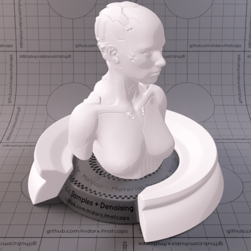

[[1024px](https://github.com/nidorx/matcaps/raw/master/1024/E8DEE1_B5A6AA_CCBCC1_C4BBBC.png)]
[[512px](https://github.com/nidorx/matcaps/raw/master/512/E8DEE1_B5A6AA_CCBCC1_C4BBBC-512px.png)]
[[256px](https://github.com/nidorx/matcaps/raw/master/256/E8DEE1_B5A6AA_CCBCC1_C4BBBC-256px.png)]
[[128px](https://github.com/nidorx/matcaps/raw/master/128/E8DEE1_B5A6AA_CCBCC1_C4BBBC-128px.png)]
[[64px](https://github.com/nidorx/matcaps/raw/master/64/E8DEE1_B5A6AA_CCBCC1_C4BBBC-64px.png)]
[~~ZBrush Material (ZMT)~~]

---
### E8E5DE_B5AFA6_CCC5BC_C4C4BB
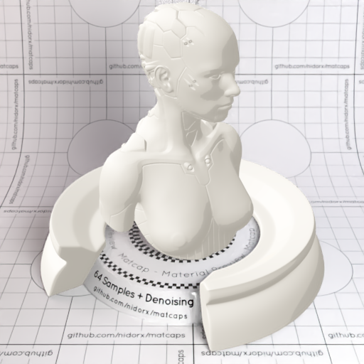
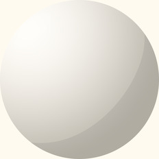

[[1024px](https://github.com/nidorx/matcaps/raw/master/1024/E8E5DE_B5AFA6_CCC5BC_C4C4BB.png)]
[[512px](https://github.com/nidorx/matcaps/raw/master/512/E8E5DE_B5AFA6_CCC5BC_C4C4BB-512px.png)]
[[256px](https://github.com/nidorx/matcaps/raw/master/256/E8E5DE_B5AFA6_CCC5BC_C4C4BB-256px.png)]
[[128px](https://github.com/nidorx/matcaps/raw/master/128/E8E5DE_B5AFA6_CCC5BC_C4C4BB-128px.png)]
[[64px](https://github.com/nidorx/matcaps/raw/master/64/E8E5DE_B5AFA6_CCC5BC_C4C4BB-64px.png)]
[~~ZBrush Material (ZMT)~~]

---
### E8E8DE_B5B5A6_CCCCBC_C4C4BA
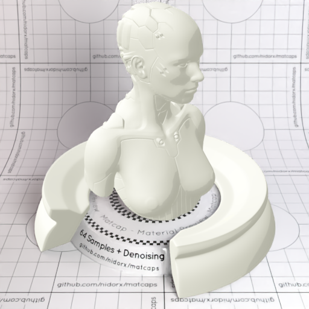

[[1024px](https://github.com/nidorx/matcaps/raw/master/1024/E8E8DE_B5B5A6_CCCCBC_C4C4BA.png)]
[[512px](https://github.com/nidorx/matcaps/raw/master/512/E8E8DE_B5B5A6_CCCCBC_C4C4BA-512px.png)]
[[256px](https://github.com/nidorx/matcaps/raw/master/256/E8E8DE_B5B5A6_CCCCBC_C4C4BA-256px.png)]
[[128px](https://github.com/nidorx/matcaps/raw/master/128/E8E8DE_B5B5A6_CCCCBC_C4C4BA-128px.png)]
[[64px](https://github.com/nidorx/matcaps/raw/master/64/E8E8DE_B5B5A6_CCCCBC_C4C4BA-64px.png)]
[~~ZBrush Material (ZMT)~~]

---
### E9CCA1_A63106_DF8C3B_621304
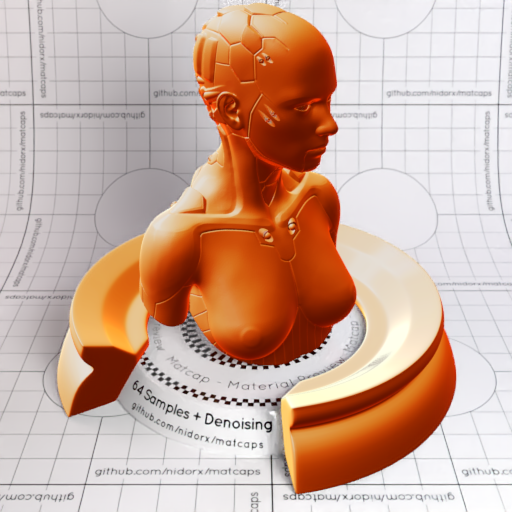

[[1024px](https://github.com/nidorx/matcaps/raw/master/1024/E9CCA1_A63106_DF8C3B_621304.png)]
[[512px](https://github.com/nidorx/matcaps/raw/master/512/E9CCA1_A63106_DF8C3B_621304-512px.png)]
[[256px](https://github.com/nidorx/matcaps/raw/master/256/E9CCA1_A63106_DF8C3B_621304-256px.png)]
[[128px](https://github.com/nidorx/matcaps/raw/master/128/E9CCA1_A63106_DF8C3B_621304-128px.png)]
[[64px](https://github.com/nidorx/matcaps/raw/master/64/E9CCA1_A63106_DF8C3B_621304-64px.png)]
[[ZBrush Material (ZMT)](https://github.com/nidorx/matcaps/raw/master/zmt/E9CCA1_A63106_DF8C3B_621304.zmt)]

---
### EA783E_6D4830_905837_FCDC6C
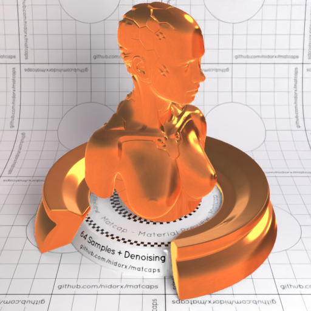
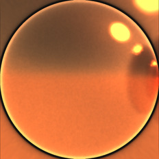

[[1024px](https://github.com/nidorx/matcaps/raw/master/1024/EA783E_6D4830_905837_FCDC6C.png)]
[[512px](https://github.com/nidorx/matcaps/raw/master/512/EA783E_6D4830_905837_FCDC6C-512px.png)]
[[256px](https://github.com/nidorx/matcaps/raw/master/256/EA783E_6D4830_905837_FCDC6C-256px.png)]
[[128px](https://github.com/nidorx/matcaps/raw/master/128/EA783E_6D4830_905837_FCDC6C-128px.png)]
[[64px](https://github.com/nidorx/matcaps/raw/master/64/EA783E_6D4830_905837_FCDC6C-64px.png)]
[[ZBrush Material (ZMT)](https://github.com/nidorx/matcaps/raw/master/zmt/EA783E_6D4830_905837_FCDC6C.zmt)]

---
### EAD8D6_B59A97_CCB4B0_C9ABAB
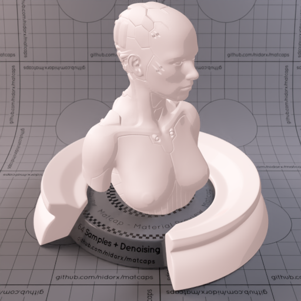

[[1024px](https://github.com/nidorx/matcaps/raw/master/1024/EAD8D6_B59A97_CCB4B0_C9ABAB.png)]
[[512px](https://github.com/nidorx/matcaps/raw/master/512/EAD8D6_B59A97_CCB4B0_C9ABAB-512px.png)]
[[256px](https://github.com/nidorx/matcaps/raw/master/256/EAD8D6_B59A97_CCB4B0_C9ABAB-256px.png)]
[[128px](https://github.com/nidorx/matcaps/raw/master/128/EAD8D6_B59A97_CCB4B0_C9ABAB-128px.png)]
[[64px](https://github.com/nidorx/matcaps/raw/master/64/EAD8D6_B59A97_CCB4B0_C9ABAB-64px.png)]
[~~ZBrush Material (ZMT)~~]

---
### EAEAEA_B5B5B5_CCCCCC_D4D4D4
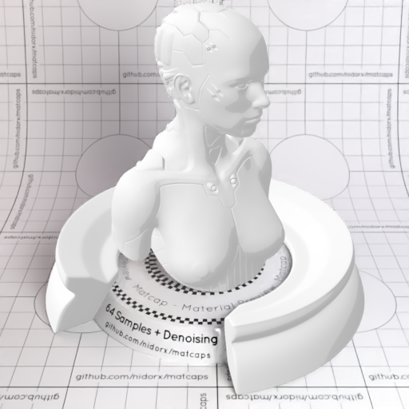
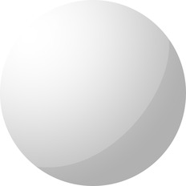

[[1024px](https://github.com/nidorx/matcaps/raw/master/1024/EAEAEA_B5B5B5_CCCCCC_D4D4D4.png)]
[[512px](https://github.com/nidorx/matcaps/raw/master/512/EAEAEA_B5B5B5_CCCCCC_D4D4D4-512px.png)]
[[256px](https://github.com/nidorx/matcaps/raw/master/256/EAEAEA_B5B5B5_CCCCCC_D4D4D4-256px.png)]
[[128px](https://github.com/nidorx/matcaps/raw/master/128/EAEAEA_B5B5B5_CCCCCC_D4D4D4-128px.png)]
[[64px](https://github.com/nidorx/matcaps/raw/master/64/EAEAEA_B5B5B5_CCCCCC_D4D4D4-64px.png)]
[~~ZBrush Material (ZMT)~~]

---
### EAEAEA_B6B6B6_CCCCCC_C4C4C4
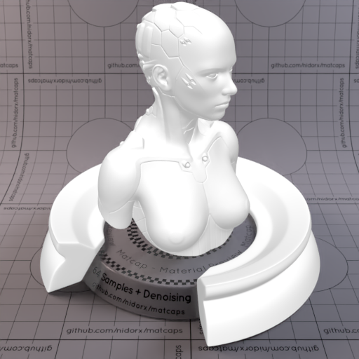

[[1024px](https://github.com/nidorx/matcaps/raw/master/1024/EAEAEA_B6B6B6_CCCCCC_C4C4C4.png)]
[[512px](https://github.com/nidorx/matcaps/raw/master/512/EAEAEA_B6B6B6_CCCCCC_C4C4C4-512px.png)]
[[256px](https://github.com/nidorx/matcaps/raw/master/256/EAEAEA_B6B6B6_CCCCCC_C4C4C4-256px.png)]
[[128px](https://github.com/nidorx/matcaps/raw/master/128/EAEAEA_B6B6B6_CCCCCC_C4C4C4-128px.png)]
[[64px](https://github.com/nidorx/matcaps/raw/master/64/EAEAEA_B6B6B6_CCCCCC_C4C4C4-64px.png)]
[[ZBrush Material (ZMT)](https://github.com/nidorx/matcaps/raw/master/zmt/EAEAEA_B6B6B6_CCCCCC_C4C4C4.zmt)]

---
### ED4630_791A0E_A42716_501009
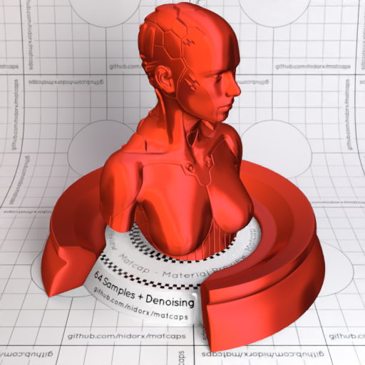

[[1024px](https://github.com/nidorx/matcaps/raw/master/1024/ED4630_791A0E_A42716_501009.png)]
[[512px](https://github.com/nidorx/matcaps/raw/master/512/ED4630_791A0E_A42716_501009-512px.png)]
[[256px](https://github.com/nidorx/matcaps/raw/master/256/ED4630_791A0E_A42716_501009-256px.png)]
[[128px](https://github.com/nidorx/matcaps/raw/master/128/ED4630_791A0E_A42716_501009-128px.png)]
[[64px](https://github.com/nidorx/matcaps/raw/master/64/ED4630_791A0E_A42716_501009-64px.png)]
[[ZBrush Material (ZMT)](https://github.com/nidorx/matcaps/raw/master/zmt/ED4630_791A0E_A42716_501009.zmt)]

---
### ED5087_FAC3D0_1C0B0C_FC84CC
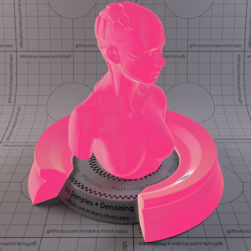
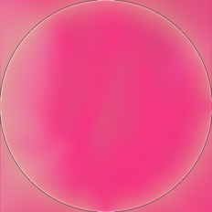

[[1024px](https://github.com/nidorx/matcaps/raw/master/1024/ED5087_FAC3D0_1C0B0C_FC84CC.png)]
[[512px](https://github.com/nidorx/matcaps/raw/master/512/ED5087_FAC3D0_1C0B0C_FC84CC-512px.png)]
[[256px](https://github.com/nidorx/matcaps/raw/master/256/ED5087_FAC3D0_1C0B0C_FC84CC-256px.png)]
[[128px](https://github.com/nidorx/matcaps/raw/master/128/ED5087_FAC3D0_1C0B0C_FC84CC-128px.png)]
[[64px](https://github.com/nidorx/matcaps/raw/master/64/ED5087_FAC3D0_1C0B0C_FC84CC-64px.png)]
[[ZBrush Material (ZMT)](https://github.com/nidorx/matcaps/raw/master/zmt/ED5087_FAC3D0_1C0B0C_FC84CC.zmt)]

---
### ED7F04_FCD60E_7E2D04_B73E04
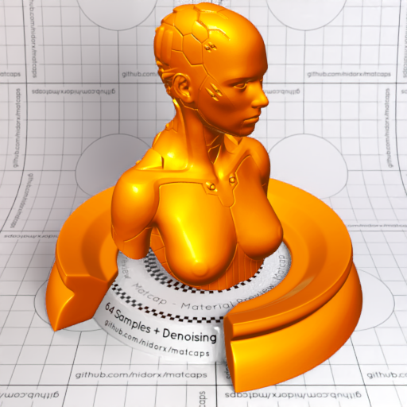
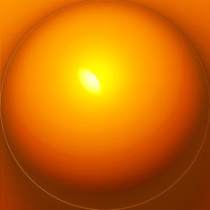

[[1024px](https://github.com/nidorx/matcaps/raw/master/1024/ED7F04_FCD60E_7E2D04_B73E04.png)]
[[512px](https://github.com/nidorx/matcaps/raw/master/512/ED7F04_FCD60E_7E2D04_B73E04-512px.png)]
[[256px](https://github.com/nidorx/matcaps/raw/master/256/ED7F04_FCD60E_7E2D04_B73E04-256px.png)]
[[128px](https://github.com/nidorx/matcaps/raw/master/128/ED7F04_FCD60E_7E2D04_B73E04-128px.png)]
[[64px](https://github.com/nidorx/matcaps/raw/master/64/ED7F04_FCD60E_7E2D04_B73E04-64px.png)]
[[ZBrush Material (ZMT)](https://github.com/nidorx/matcaps/raw/master/zmt/ED7F04_FCD60E_7E2D04_B73E04.zmt)]

---
### EDED06_B5B504_CCCC04_D4D404
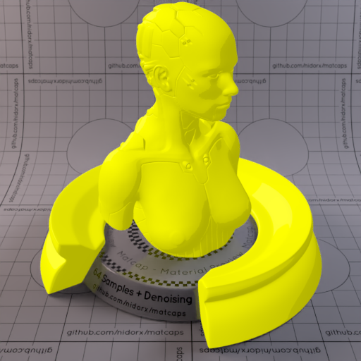

[[1024px](https://github.com/nidorx/matcaps/raw/master/1024/EDED06_B5B504_CCCC04_D4D404.png)]
[[512px](https://github.com/nidorx/matcaps/raw/master/512/EDED06_B5B504_CCCC04_D4D404-512px.png)]
[[256px](https://github.com/nidorx/matcaps/raw/master/256/EDED06_B5B504_CCCC04_D4D404-256px.png)]
[[128px](https://github.com/nidorx/matcaps/raw/master/128/EDED06_B5B504_CCCC04_D4D404-128px.png)]
[[64px](https://github.com/nidorx/matcaps/raw/master/64/EDED06_B5B504_CCCC04_D4D404-64px.png)]
[~~ZBrush Material (ZMT)~~]

---
### EE4128_FC8E82_9A0704_BF0F05

[[1024px](https://github.com/nidorx/matcaps/raw/master/1024/EE4128_FC8E82_9A0704_BF0F05.png)]
[[512px](https://github.com/nidorx/matcaps/raw/master/512/EE4128_FC8E82_9A0704_BF0F05-512px.png)]
[[256px](https://github.com/nidorx/matcaps/raw/master/256/EE4128_FC8E82_9A0704_BF0F05-256px.png)]
[[128px](https://github.com/nidorx/matcaps/raw/master/128/EE4128_FC8E82_9A0704_BF0F05-128px.png)]
[[64px](https://github.com/nidorx/matcaps/raw/master/64/EE4128_FC8E82_9A0704_BF0F05-64px.png)]
[[ZBrush Material (ZMT)](https://github.com/nidorx/matcaps/raw/master/zmt/EE4128_FC8E82_9A0704_BF0F05.zmt)]

---
### EEECFB_BFB6D5_D0C8EB_CCC4DC
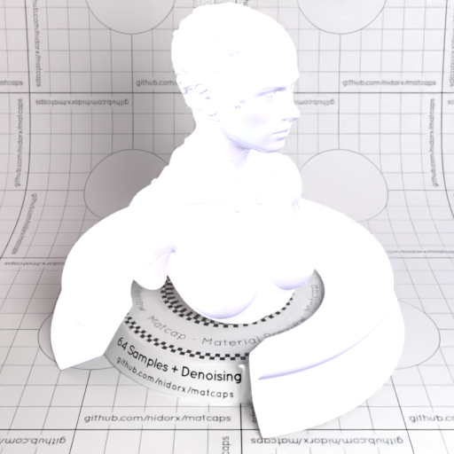

[[1024px](https://github.com/nidorx/matcaps/raw/master/1024/EEECFB_BFB6D5_D0C8EB_CCC4DC.png)]
[[512px](https://github.com/nidorx/matcaps/raw/master/512/EEECFB_BFB6D5_D0C8EB_CCC4DC-512px.png)]
[[256px](https://github.com/nidorx/matcaps/raw/master/256/EEECFB_BFB6D5_D0C8EB_CCC4DC-256px.png)]
[[128px](https://github.com/nidorx/matcaps/raw/master/128/EEECFB_BFB6D5_D0C8EB_CCC4DC-128px.png)]
[[64px](https://github.com/nidorx/matcaps/raw/master/64/EEECFB_BFB6D5_D0C8EB_CCC4DC-64px.png)]
[[ZBrush Material (ZMT)](https://github.com/nidorx/matcaps/raw/master/zmt/EEECFB_BFB6D5_D0C8EB_CCC4DC.zmt)]

---
### F0D504_FBFAD3_B98609_CDA204
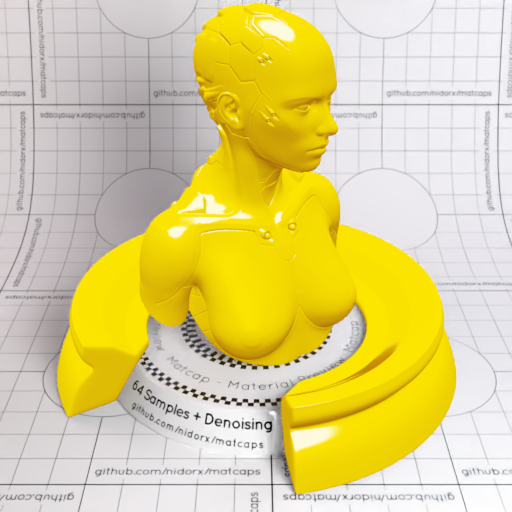

[[1024px](https://github.com/nidorx/matcaps/raw/master/1024/F0D504_FBFAD3_B98609_CDA204.png)]
[[512px](https://github.com/nidorx/matcaps/raw/master/512/F0D504_FBFAD3_B98609_CDA204-512px.png)]
[[256px](https://github.com/nidorx/matcaps/raw/master/256/F0D504_FBFAD3_B98609_CDA204-256px.png)]
[[128px](https://github.com/nidorx/matcaps/raw/master/128/F0D504_FBFAD3_B98609_CDA204-128px.png)]
[[64px](https://github.com/nidorx/matcaps/raw/master/64/F0D504_FBFAD3_B98609_CDA204-64px.png)]
[~~ZBrush Material (ZMT)~~]

---
### F75F0B_461604_9A3004_FB9D2F
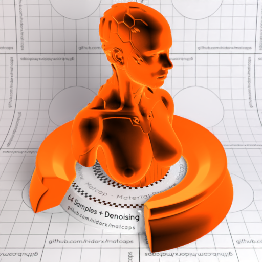

[[1024px](https://github.com/nidorx/matcaps/raw/master/1024/F75F0B_461604_9A3004_FB9D2F.png)]
[[512px](https://github.com/nidorx/matcaps/raw/master/512/F75F0B_461604_9A3004_FB9D2F-512px.png)]
[[256px](https://github.com/nidorx/matcaps/raw/master/256/F75F0B_461604_9A3004_FB9D2F-256px.png)]
[[128px](https://github.com/nidorx/matcaps/raw/master/128/F75F0B_461604_9A3004_FB9D2F-128px.png)]
[[64px](https://github.com/nidorx/matcaps/raw/master/64/F75F0B_461604_9A3004_FB9D2F-64px.png)]
[[ZBrush Material (ZMT)](https://github.com/nidorx/matcaps/raw/master/zmt/F75F0B_461604_9A3004_FB9D2F.zmt)]

---
### F77777_FBE1E1_FAB2B2_FBC4C4
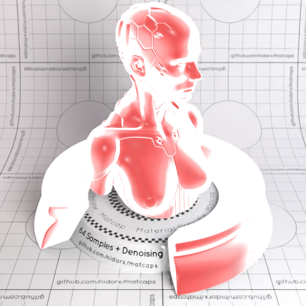
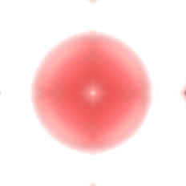

[[1024px](https://github.com/nidorx/matcaps/raw/master/1024/F77777_FBE1E1_FAB2B2_FBC4C4.png)]
[[512px](https://github.com/nidorx/matcaps/raw/master/512/F77777_FBE1E1_FAB2B2_FBC4C4-512px.png)]
[[256px](https://github.com/nidorx/matcaps/raw/master/256/F77777_FBE1E1_FAB2B2_FBC4C4-256px.png)]
[[128px](https://github.com/nidorx/matcaps/raw/master/128/F77777_FBE1E1_FAB2B2_FBC4C4-128px.png)]
[[64px](https://github.com/nidorx/matcaps/raw/master/64/F77777_FBE1E1_FAB2B2_FBC4C4-64px.png)]
[[ZBrush Material (ZMT)](https://github.com/nidorx/matcaps/raw/master/zmt/F77777_FBE1E1_FAB2B2_FBC4C4.zmt)]

---
### F79686_FCCBD4_E76644_E76B56
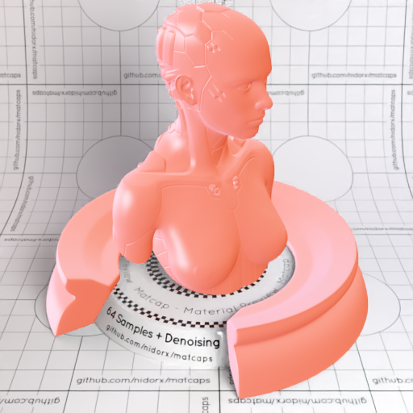

[[1024px](https://github.com/nidorx/matcaps/raw/master/1024/F79686_FCCBD4_E76644_E76B56.png)]
[[512px](https://github.com/nidorx/matcaps/raw/master/512/F79686_FCCBD4_E76644_E76B56-512px.png)]
[[256px](https://github.com/nidorx/matcaps/raw/master/256/F79686_FCCBD4_E76644_E76B56-256px.png)]
[[128px](https://github.com/nidorx/matcaps/raw/master/128/F79686_FCCBD4_E76644_E76B56-128px.png)]
[[64px](https://github.com/nidorx/matcaps/raw/master/64/F79686_FCCBD4_E76644_E76B56-64px.png)]
[[ZBrush Material (ZMT)](https://github.com/nidorx/matcaps/raw/master/zmt/F79686_FCCBD4_E76644_E76B56.zmt)]

---
### F9E6C7_FCF7DF_EDD3AA_F1D4B4
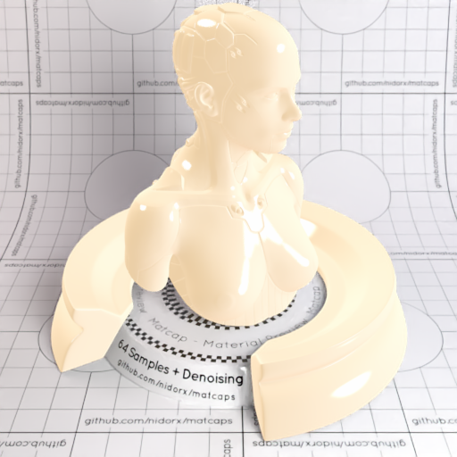

[[1024px](https://github.com/nidorx/matcaps/raw/master/1024/F9E6C7_FCF7DF_EDD3AA_F1D4B4.png)]
[[512px](https://github.com/nidorx/matcaps/raw/master/512/F9E6C7_FCF7DF_EDD3AA_F1D4B4-512px.png)]
[[256px](https://github.com/nidorx/matcaps/raw/master/256/F9E6C7_FCF7DF_EDD3AA_F1D4B4-256px.png)]
[[128px](https://github.com/nidorx/matcaps/raw/master/128/F9E6C7_FCF7DF_EDD3AA_F1D4B4-128px.png)]
[[64px](https://github.com/nidorx/matcaps/raw/master/64/F9E6C7_FCF7DF_EDD3AA_F1D4B4-64px.png)]
[[ZBrush Material (ZMT)](https://github.com/nidorx/matcaps/raw/master/zmt/F9E6C7_FCF7DF_EDD3AA_F1D4B4.zmt)]

---
### FBB43F_FBE993_FB552E_FCDD65
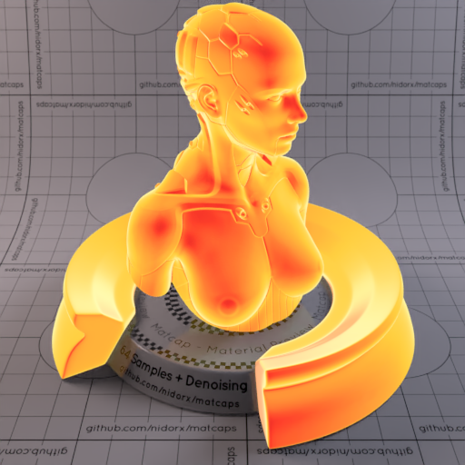

[[1024px](https://github.com/nidorx/matcaps/raw/master/1024/FBB43F_FBE993_FB552E_FCDD65.png)]
[[512px](https://github.com/nidorx/matcaps/raw/master/512/FBB43F_FBE993_FB552E_FCDD65-512px.png)]
[[256px](https://github.com/nidorx/matcaps/raw/master/256/FBB43F_FBE993_FB552E_FCDD65-256px.png)]
[[128px](https://github.com/nidorx/matcaps/raw/master/128/FBB43F_FBE993_FB552E_FCDD65-128px.png)]
[[64px](https://github.com/nidorx/matcaps/raw/master/64/FBB43F_FBE993_FB552E_FCDD65-64px.png)]
[[ZBrush Material (ZMT)](https://github.com/nidorx/matcaps/raw/master/zmt/FBB43F_FBE993_FB552E_FCDD65.zmt)]

---