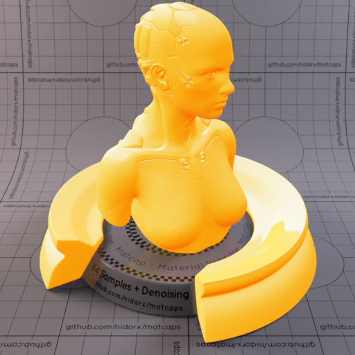

A huge library of MatCap textures in PNG and ZMT.

## Navigation
* [Home](/)
* [Page 1](PAGE-1.md)
* [Page 2](PAGE-2.md)
* [Page 3](PAGE-3.md)
* [Page 4](PAGE-4.md)
* [Page 5](PAGE-5.md)
* [Page 6](PAGE-6.md)
* [Page 7](PAGE-7.md)
* [Page 8](PAGE-8.md)
* [Page 9](PAGE-9.md)
* [Page 10](PAGE-10.md)
* [Page 11](PAGE-11.md)
* [Page 12](PAGE-12.md)
* [Page 13](PAGE-13.md)
* [Page 14](PAGE-14.md)
* [Page 15](PAGE-15.md)
* [Page 16](PAGE-16.md)
* [Page 17](PAGE-17.md)
* [Page 18](PAGE-18.md)
* [Page 19](PAGE-19.md)
* [Page 20](PAGE-20.md)
* [Page 21](PAGE-21.md)
* [Page 22](PAGE-22.md)
* [Page 23](PAGE-23.md)
* [Page 24](PAGE-24.md)
* [Page 25](PAGE-25.md)
* [Page 26](PAGE-26.md)
* [Page 27](PAGE-27.md)
* [Page 28](PAGE-28.md)
* [Page 29](PAGE-29.md)
* [Page 30](PAGE-30.md)
* [Page 31](PAGE-31.md)
* [Page 32](PAGE-32.md)
* Page 33
## Page 33 Matcaps
### FBB82D_FBB82D_FBEDBF_FBDE7D

[[1024px](https://github.com/nidorx/matcaps/raw/master/1024/FBB82D_FBB82D_FBEDBF_FBDE7D.png)]
[[512px](https://github.com/nidorx/matcaps/raw/master/512/FBB82D_FBB82D_FBEDBF_FBDE7D-512px.png)]
[[256px](https://github.com/nidorx/matcaps/raw/master/256/FBB82D_FBB82D_FBEDBF_FBDE7D-256px.png)]
[[128px](https://github.com/nidorx/matcaps/raw/master/128/FBB82D_FBB82D_FBEDBF_FBDE7D-128px.png)]
[[64px](https://github.com/nidorx/matcaps/raw/master/64/FBB82D_FBB82D_FBEDBF_FBDE7D-64px.png)]
[[ZBrush Material (ZMT)](https://github.com/nidorx/matcaps/raw/master/zmt/FBB82D_FBB82D_FBEDBF_FBDE7D.zmt)]

---