Huge library of matcap PNG textures organized by color

## Navigation
* [Home](/)
* [Page 1](PAGE-1.md)
* [Page 2](PAGE-2.md)
* [Page 3](PAGE-3.md)
* Page 4
* [Page 5](PAGE-5.md)
## Page 6 Matcaps
### A98D6A_A98D6A_F2D3AB_FBE6BE

[[1024px](https://github.com/nidorx/matcaps/raw/master/1024/A98D6A_A98D6A_F2D3AB_FBE6BE.png)]
[[512px](https://github.com/nidorx/matcaps/raw/master/512/A98D6A_A98D6A_F2D3AB_FBE6BE-512px.png)]
[[256px](https://github.com/nidorx/matcaps/raw/master/256/A98D6A_A98D6A_F2D3AB_FBE6BE-256px.png)]
[[128px](https://github.com/nidorx/matcaps/raw/master/128/A98D6A_A98D6A_F2D3AB_FBE6BE-128px.png)]
[[64px](https://github.com/nidorx/matcaps/raw/master/64/A98D6A_A98D6A_F2D3AB_FBE6BE-64px.png)]
[[ZBrush Material (ZMT)](https://github.com/nidorx/matcaps/raw/master/zmt/A98D6A_A98D6A_F2D3AB_FBE6BE.zmt)]

---
### AD9E81_AD9E81_F1E5CE_6B5C3E

[[1024px](https://github.com/nidorx/matcaps/raw/master/1024/AD9E81_AD9E81_F1E5CE_6B5C3E.png)]
[[512px](https://github.com/nidorx/matcaps/raw/master/512/AD9E81_AD9E81_F1E5CE_6B5C3E-512px.png)]
[[256px](https://github.com/nidorx/matcaps/raw/master/256/AD9E81_AD9E81_F1E5CE_6B5C3E-256px.png)]
[[128px](https://github.com/nidorx/matcaps/raw/master/128/AD9E81_AD9E81_F1E5CE_6B5C3E-128px.png)]
[[64px](https://github.com/nidorx/matcaps/raw/master/64/AD9E81_AD9E81_F1E5CE_6B5C3E-64px.png)]
[[ZBrush Material (ZMT)](https://github.com/nidorx/matcaps/raw/master/zmt/AD9E81_AD9E81_F1E5CE_6B5C3E.zmt)]

---
### ADC2CD_ADC2CD_DFF7FA_C9E6F5

[[1024px](https://github.com/nidorx/matcaps/raw/master/1024/ADC2CD_ADC2CD_DFF7FA_C9E6F5.png)]
[[512px](https://github.com/nidorx/matcaps/raw/master/512/ADC2CD_ADC2CD_DFF7FA_C9E6F5-512px.png)]
[[256px](https://github.com/nidorx/matcaps/raw/master/256/ADC2CD_ADC2CD_DFF7FA_C9E6F5-256px.png)]
[[128px](https://github.com/nidorx/matcaps/raw/master/128/ADC2CD_ADC2CD_DFF7FA_C9E6F5-128px.png)]
[[64px](https://github.com/nidorx/matcaps/raw/master/64/ADC2CD_ADC2CD_DFF7FA_C9E6F5-64px.png)]
[[ZBrush Material (ZMT)](https://github.com/nidorx/matcaps/raw/master/zmt/ADC2CD_ADC2CD_DFF7FA_C9E6F5.zmt)]

---
### AE9D99_AE9D99_29303B_585F70

[[1024px](https://github.com/nidorx/matcaps/raw/master/1024/AE9D99_AE9D99_29303B_585F70.png)]
[[512px](https://github.com/nidorx/matcaps/raw/master/512/AE9D99_AE9D99_29303B_585F70-512px.png)]
[[256px](https://github.com/nidorx/matcaps/raw/master/256/AE9D99_AE9D99_29303B_585F70-256px.png)]
[[128px](https://github.com/nidorx/matcaps/raw/master/128/AE9D99_AE9D99_29303B_585F70-128px.png)]
[[64px](https://github.com/nidorx/matcaps/raw/master/64/AE9D99_AE9D99_29303B_585F70-64px.png)]
[[ZBrush Material (ZMT)](https://github.com/nidorx/matcaps/raw/master/zmt/AE9D99_AE9D99_29303B_585F70.zmt)]

---
### AF986F_AF986F_CDB489_9C7C5B

[[1024px](https://github.com/nidorx/matcaps/raw/master/1024/AF986F_AF986F_CDB489_9C7C5B.png)]
[[512px](https://github.com/nidorx/matcaps/raw/master/512/AF986F_AF986F_CDB489_9C7C5B-512px.png)]
[[256px](https://github.com/nidorx/matcaps/raw/master/256/AF986F_AF986F_CDB489_9C7C5B-256px.png)]
[[128px](https://github.com/nidorx/matcaps/raw/master/128/AF986F_AF986F_CDB489_9C7C5B-128px.png)]
[[64px](https://github.com/nidorx/matcaps/raw/master/64/AF986F_AF986F_CDB489_9C7C5B-64px.png)]
[[ZBrush Material (ZMT)](https://github.com/nidorx/matcaps/raw/master/zmt/AF986F_AF986F_CDB489_9C7C5B.zmt)]

---
### AF987A_AF987A_2F2416_523F27

[[1024px](https://github.com/nidorx/matcaps/raw/master/1024/AF987A_AF987A_2F2416_523F27.png)]
[[512px](https://github.com/nidorx/matcaps/raw/master/512/AF987A_AF987A_2F2416_523F27-512px.png)]
[[256px](https://github.com/nidorx/matcaps/raw/master/256/AF987A_AF987A_2F2416_523F27-256px.png)]
[[128px](https://github.com/nidorx/matcaps/raw/master/128/AF987A_AF987A_2F2416_523F27-128px.png)]
[[64px](https://github.com/nidorx/matcaps/raw/master/64/AF987A_AF987A_2F2416_523F27-64px.png)]
[~~ZBrush Material (ZMT)~~]

---
### B06932_B06932_451B09_7B3E16

[[1024px](https://github.com/nidorx/matcaps/raw/master/1024/B06932_B06932_451B09_7B3E16.png)]
[[512px](https://github.com/nidorx/matcaps/raw/master/512/B06932_B06932_451B09_7B3E16-512px.png)]
[[256px](https://github.com/nidorx/matcaps/raw/master/256/B06932_B06932_451B09_7B3E16-256px.png)]
[[128px](https://github.com/nidorx/matcaps/raw/master/128/B06932_B06932_451B09_7B3E16-128px.png)]
[[64px](https://github.com/nidorx/matcaps/raw/master/64/B06932_B06932_451B09_7B3E16-64px.png)]
[~~ZBrush Material (ZMT)~~]

---
### B09273_B09273_7A573D_C7AF97

[[1024px](https://github.com/nidorx/matcaps/raw/master/1024/B09273_B09273_7A573D_C7AF97.png)]
[[512px](https://github.com/nidorx/matcaps/raw/master/512/B09273_B09273_7A573D_C7AF97-512px.png)]
[[256px](https://github.com/nidorx/matcaps/raw/master/256/B09273_B09273_7A573D_C7AF97-256px.png)]
[[128px](https://github.com/nidorx/matcaps/raw/master/128/B09273_B09273_7A573D_C7AF97-128px.png)]
[[64px](https://github.com/nidorx/matcaps/raw/master/64/B09273_B09273_7A573D_C7AF97-64px.png)]
[[ZBrush Material (ZMT)](https://github.com/nidorx/matcaps/raw/master/zmt/B09273_B09273_7A573D_C7AF97.zmt)]

---
### B0B0B0_B0B0B0_6E6E6E_848484

[[1024px](https://github.com/nidorx/matcaps/raw/master/1024/B0B0B0_B0B0B0_6E6E6E_848484.png)]
[[512px](https://github.com/nidorx/matcaps/raw/master/512/B0B0B0_B0B0B0_6E6E6E_848484-512px.png)]
[[256px](https://github.com/nidorx/matcaps/raw/master/256/B0B0B0_B0B0B0_6E6E6E_848484-256px.png)]
[[128px](https://github.com/nidorx/matcaps/raw/master/128/B0B0B0_B0B0B0_6E6E6E_848484-128px.png)]
[[64px](https://github.com/nidorx/matcaps/raw/master/64/B0B0B0_B0B0B0_6E6E6E_848484-64px.png)]
[~~ZBrush Material (ZMT)~~]

---
### B1A395_B1A395_EFE6E1_635A47

[[1024px](https://github.com/nidorx/matcaps/raw/master/1024/B1A395_B1A395_EFE6E1_635A47.png)]
[[512px](https://github.com/nidorx/matcaps/raw/master/512/B1A395_B1A395_EFE6E1_635A47-512px.png)]
[[256px](https://github.com/nidorx/matcaps/raw/master/256/B1A395_B1A395_EFE6E1_635A47-256px.png)]
[[128px](https://github.com/nidorx/matcaps/raw/master/128/B1A395_B1A395_EFE6E1_635A47-128px.png)]
[[64px](https://github.com/nidorx/matcaps/raw/master/64/B1A395_B1A395_EFE6E1_635A47-64px.png)]
[~~ZBrush Material (ZMT)~~]

---
### B3AA93_B3AA93_F4EFD7_E1DDC2

[[1024px](https://github.com/nidorx/matcaps/raw/master/1024/B3AA93_B3AA93_F4EFD7_E1DDC2.png)]
[[512px](https://github.com/nidorx/matcaps/raw/master/512/B3AA93_B3AA93_F4EFD7_E1DDC2-512px.png)]
[[256px](https://github.com/nidorx/matcaps/raw/master/256/B3AA93_B3AA93_F4EFD7_E1DDC2-256px.png)]
[[128px](https://github.com/nidorx/matcaps/raw/master/128/B3AA93_B3AA93_F4EFD7_E1DDC2-128px.png)]
[[64px](https://github.com/nidorx/matcaps/raw/master/64/B3AA93_B3AA93_F4EFD7_E1DDC2-64px.png)]
[[ZBrush Material (ZMT)](https://github.com/nidorx/matcaps/raw/master/zmt/B3AA93_B3AA93_F4EFD7_E1DDC2.zmt)]

---
### B47A5B_B47A5B_301E14_704A31

[[1024px](https://github.com/nidorx/matcaps/raw/master/1024/B47A5B_B47A5B_301E14_704A31.png)]
[[512px](https://github.com/nidorx/matcaps/raw/master/512/B47A5B_B47A5B_301E14_704A31-512px.png)]
[[256px](https://github.com/nidorx/matcaps/raw/master/256/B47A5B_B47A5B_301E14_704A31-256px.png)]
[[128px](https://github.com/nidorx/matcaps/raw/master/128/B47A5B_B47A5B_301E14_704A31-128px.png)]
[[64px](https://github.com/nidorx/matcaps/raw/master/64/B47A5B_B47A5B_301E14_704A31-64px.png)]
[[ZBrush Material (ZMT)](https://github.com/nidorx/matcaps/raw/master/zmt/B47A5B_B47A5B_301E14_704A31.zmt)]

---
### B5987E_B5987E_F8E4DC_6F5939

[[1024px](https://github.com/nidorx/matcaps/raw/master/1024/B5987E_B5987E_F8E4DC_6F5939.png)]
[[512px](https://github.com/nidorx/matcaps/raw/master/512/B5987E_B5987E_F8E4DC_6F5939-512px.png)]
[[256px](https://github.com/nidorx/matcaps/raw/master/256/B5987E_B5987E_F8E4DC_6F5939-256px.png)]
[[128px](https://github.com/nidorx/matcaps/raw/master/128/B5987E_B5987E_F8E4DC_6F5939-128px.png)]
[[64px](https://github.com/nidorx/matcaps/raw/master/64/B5987E_B5987E_F8E4DC_6F5939-64px.png)]
[~~ZBrush Material (ZMT)~~]

---
### B62D33_B62D33_E4868B_7E2D34

[[1024px](https://github.com/nidorx/matcaps/raw/master/1024/B62D33_B62D33_E4868B_7E2D34.png)]
[[512px](https://github.com/nidorx/matcaps/raw/master/512/B62D33_B62D33_E4868B_7E2D34-512px.png)]
[[256px](https://github.com/nidorx/matcaps/raw/master/256/B62D33_B62D33_E4868B_7E2D34-256px.png)]
[[128px](https://github.com/nidorx/matcaps/raw/master/128/B62D33_B62D33_E4868B_7E2D34-128px.png)]
[[64px](https://github.com/nidorx/matcaps/raw/master/64/B62D33_B62D33_E4868B_7E2D34-64px.png)]
[[ZBrush Material (ZMT)](https://github.com/nidorx/matcaps/raw/master/zmt/B62D33_B62D33_E4868B_7E2D34.zmt)]

---
### B86137_B86137_FBCA6F_6F3C37

[[1024px](https://github.com/nidorx/matcaps/raw/master/1024/B86137_B86137_FBCA6F_6F3C37.png)]
[[512px](https://github.com/nidorx/matcaps/raw/master/512/B86137_B86137_FBCA6F_6F3C37-512px.png)]
[[256px](https://github.com/nidorx/matcaps/raw/master/256/B86137_B86137_FBCA6F_6F3C37-256px.png)]
[[128px](https://github.com/nidorx/matcaps/raw/master/128/B86137_B86137_FBCA6F_6F3C37-128px.png)]
[[64px](https://github.com/nidorx/matcaps/raw/master/64/B86137_B86137_FBCA6F_6F3C37-64px.png)]
[[ZBrush Material (ZMT)](https://github.com/nidorx/matcaps/raw/master/zmt/B86137_B86137_FBCA6F_6F3C37.zmt)]

---
### B98A6D_B98A6D_7B4F38_D1A68F
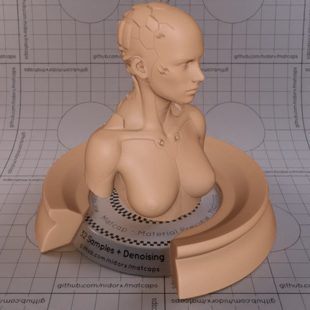

[[1024px](https://github.com/nidorx/matcaps/raw/master/1024/B98A6D_B98A6D_7B4F38_D1A68F.png)]
[[512px](https://github.com/nidorx/matcaps/raw/master/512/B98A6D_B98A6D_7B4F38_D1A68F-512px.png)]
[[256px](https://github.com/nidorx/matcaps/raw/master/256/B98A6D_B98A6D_7B4F38_D1A68F-256px.png)]
[[128px](https://github.com/nidorx/matcaps/raw/master/128/B98A6D_B98A6D_7B4F38_D1A68F-128px.png)]
[[64px](https://github.com/nidorx/matcaps/raw/master/64/B98A6D_B98A6D_7B4F38_D1A68F-64px.png)]
[[ZBrush Material (ZMT)](https://github.com/nidorx/matcaps/raw/master/zmt/B98A6D_B98A6D_7B4F38_D1A68F.zmt)]

---
### BAADA8_BAADA8_ECE6E7_9A8378
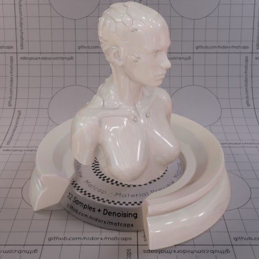
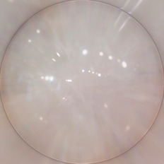

[[1024px](https://github.com/nidorx/matcaps/raw/master/1024/BAADA8_BAADA8_ECE6E7_9A8378.png)]
[[512px](https://github.com/nidorx/matcaps/raw/master/512/BAADA8_BAADA8_ECE6E7_9A8378-512px.png)]
[[256px](https://github.com/nidorx/matcaps/raw/master/256/BAADA8_BAADA8_ECE6E7_9A8378-256px.png)]
[[128px](https://github.com/nidorx/matcaps/raw/master/128/BAADA8_BAADA8_ECE6E7_9A8378-128px.png)]
[[64px](https://github.com/nidorx/matcaps/raw/master/64/BAADA8_BAADA8_ECE6E7_9A8378-64px.png)]
[[ZBrush Material (ZMT)](https://github.com/nidorx/matcaps/raw/master/zmt/BAADA8_BAADA8_ECE6E7_9A8378.zmt)]

---
### BC928D_BC928D_F9E2D6_654445
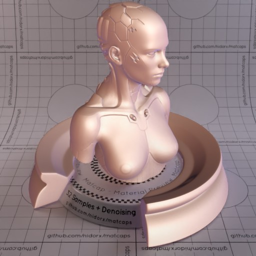

[[1024px](https://github.com/nidorx/matcaps/raw/master/1024/BC928D_BC928D_F9E2D6_654445.png)]
[[512px](https://github.com/nidorx/matcaps/raw/master/512/BC928D_BC928D_F9E2D6_654445-512px.png)]
[[256px](https://github.com/nidorx/matcaps/raw/master/256/BC928D_BC928D_F9E2D6_654445-256px.png)]
[[128px](https://github.com/nidorx/matcaps/raw/master/128/BC928D_BC928D_F9E2D6_654445-128px.png)]
[[64px](https://github.com/nidorx/matcaps/raw/master/64/BC928D_BC928D_F9E2D6_654445-64px.png)]
[[ZBrush Material (ZMT)](https://github.com/nidorx/matcaps/raw/master/zmt/BC928D_BC928D_F9E2D6_654445.zmt)]

---
### BD5345_BD5345_460F11_732622

[[1024px](https://github.com/nidorx/matcaps/raw/master/1024/BD5345_BD5345_460F11_732622.png)]
[[512px](https://github.com/nidorx/matcaps/raw/master/512/BD5345_BD5345_460F11_732622-512px.png)]
[[256px](https://github.com/nidorx/matcaps/raw/master/256/BD5345_BD5345_460F11_732622-256px.png)]
[[128px](https://github.com/nidorx/matcaps/raw/master/128/BD5345_BD5345_460F11_732622-128px.png)]
[[64px](https://github.com/nidorx/matcaps/raw/master/64/BD5345_BD5345_460F11_732622-64px.png)]
[~~ZBrush Material (ZMT)~~]

---
### BF8E78_BF8E78_E5CCBF_753E32
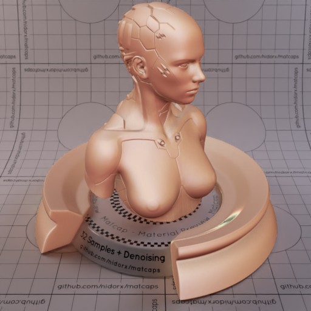

[[1024px](https://github.com/nidorx/matcaps/raw/master/1024/BF8E78_BF8E78_E5CCBF_753E32.png)]
[[512px](https://github.com/nidorx/matcaps/raw/master/512/BF8E78_BF8E78_E5CCBF_753E32-512px.png)]
[[256px](https://github.com/nidorx/matcaps/raw/master/256/BF8E78_BF8E78_E5CCBF_753E32-256px.png)]
[[128px](https://github.com/nidorx/matcaps/raw/master/128/BF8E78_BF8E78_E5CCBF_753E32-128px.png)]
[[64px](https://github.com/nidorx/matcaps/raw/master/64/BF8E78_BF8E78_E5CCBF_753E32-64px.png)]
[[ZBrush Material (ZMT)](https://github.com/nidorx/matcaps/raw/master/zmt/BF8E78_BF8E78_E5CCBF_753E32.zmt)]

---
### BFB5A4_BFB5A4_DEDCCB_D7D4CC
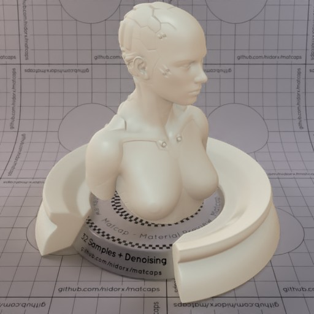
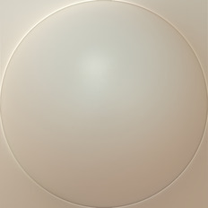

[[1024px](https://github.com/nidorx/matcaps/raw/master/1024/BFB5A4_BFB5A4_DEDCCB_D7D4CC.png)]
[[512px](https://github.com/nidorx/matcaps/raw/master/512/BFB5A4_BFB5A4_DEDCCB_D7D4CC-512px.png)]
[[256px](https://github.com/nidorx/matcaps/raw/master/256/BFB5A4_BFB5A4_DEDCCB_D7D4CC-256px.png)]
[[128px](https://github.com/nidorx/matcaps/raw/master/128/BFB5A4_BFB5A4_DEDCCB_D7D4CC-128px.png)]
[[64px](https://github.com/nidorx/matcaps/raw/master/64/BFB5A4_BFB5A4_DEDCCB_D7D4CC-64px.png)]
[[ZBrush Material (ZMT)](https://github.com/nidorx/matcaps/raw/master/zmt/BFB5A4_BFB5A4_DEDCCB_D7D4CC.zmt)]

---
### C05429_C05429_ED6129_94492A
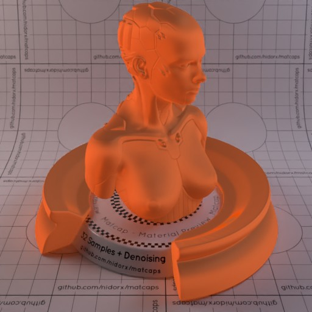
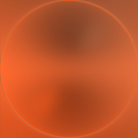

[[1024px](https://github.com/nidorx/matcaps/raw/master/1024/C05429_C05429_ED6129_94492A.png)]
[[512px](https://github.com/nidorx/matcaps/raw/master/512/C05429_C05429_ED6129_94492A-512px.png)]
[[256px](https://github.com/nidorx/matcaps/raw/master/256/C05429_C05429_ED6129_94492A-256px.png)]
[[128px](https://github.com/nidorx/matcaps/raw/master/128/C05429_C05429_ED6129_94492A-128px.png)]
[[64px](https://github.com/nidorx/matcaps/raw/master/64/C05429_C05429_ED6129_94492A-64px.png)]
[[ZBrush Material (ZMT)](https://github.com/nidorx/matcaps/raw/master/zmt/C05429_C05429_ED6129_94492A.zmt)]

---
### C1AA92_C1AA92_AD6E29_737889
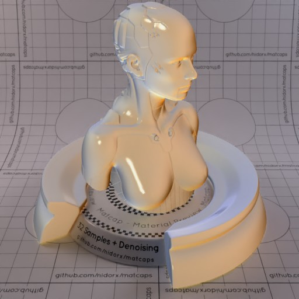
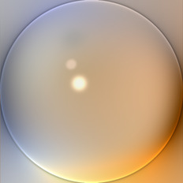

[[1024px](https://github.com/nidorx/matcaps/raw/master/1024/C1AA92_C1AA92_AD6E29_737889.png)]
[[512px](https://github.com/nidorx/matcaps/raw/master/512/C1AA92_C1AA92_AD6E29_737889-512px.png)]
[[256px](https://github.com/nidorx/matcaps/raw/master/256/C1AA92_C1AA92_AD6E29_737889-256px.png)]
[[128px](https://github.com/nidorx/matcaps/raw/master/128/C1AA92_C1AA92_AD6E29_737889-128px.png)]
[[64px](https://github.com/nidorx/matcaps/raw/master/64/C1AA92_C1AA92_AD6E29_737889-64px.png)]
[[ZBrush Material (ZMT)](https://github.com/nidorx/matcaps/raw/master/zmt/C1AA92_C1AA92_AD6E29_737889.zmt)]

---
### C28E4E_C28E4E_845119_0B0805
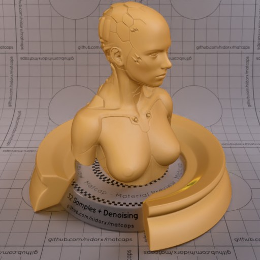
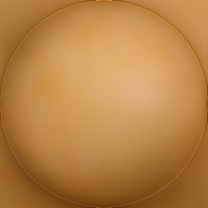

[[1024px](https://github.com/nidorx/matcaps/raw/master/1024/C28E4E_C28E4E_845119_0B0805.png)]
[[512px](https://github.com/nidorx/matcaps/raw/master/512/C28E4E_C28E4E_845119_0B0805-512px.png)]
[[256px](https://github.com/nidorx/matcaps/raw/master/256/C28E4E_C28E4E_845119_0B0805-256px.png)]
[[128px](https://github.com/nidorx/matcaps/raw/master/128/C28E4E_C28E4E_845119_0B0805-128px.png)]
[[64px](https://github.com/nidorx/matcaps/raw/master/64/C28E4E_C28E4E_845119_0B0805-64px.png)]
[[ZBrush Material (ZMT)](https://github.com/nidorx/matcaps/raw/master/zmt/C28E4E_C28E4E_845119_0B0805.zmt)]

---
### C2A391_C2A391_523728_785741
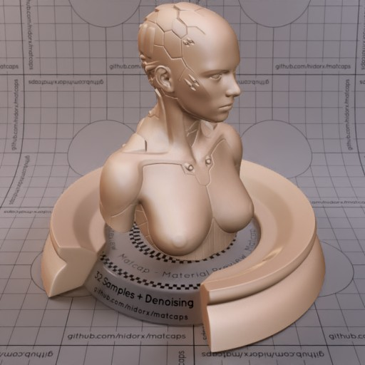
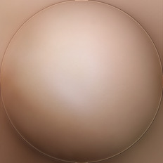

[[1024px](https://github.com/nidorx/matcaps/raw/master/1024/C2A391_C2A391_523728_785741.png)]
[[512px](https://github.com/nidorx/matcaps/raw/master/512/C2A391_C2A391_523728_785741-512px.png)]
[[256px](https://github.com/nidorx/matcaps/raw/master/256/C2A391_C2A391_523728_785741-256px.png)]
[[128px](https://github.com/nidorx/matcaps/raw/master/128/C2A391_C2A391_523728_785741-128px.png)]
[[64px](https://github.com/nidorx/matcaps/raw/master/64/C2A391_C2A391_523728_785741-64px.png)]
[[ZBrush Material (ZMT)](https://github.com/nidorx/matcaps/raw/master/zmt/C2A391_C2A391_523728_785741.zmt)]

---
### C2AB7D_C2AB7D_4A412E_7A6B4E

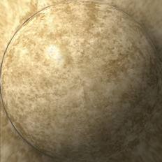

[[1024px](https://github.com/nidorx/matcaps/raw/master/1024/C2AB7D_C2AB7D_4A412E_7A6B4E.png)]
[[512px](https://github.com/nidorx/matcaps/raw/master/512/C2AB7D_C2AB7D_4A412E_7A6B4E-512px.png)]
[[256px](https://github.com/nidorx/matcaps/raw/master/256/C2AB7D_C2AB7D_4A412E_7A6B4E-256px.png)]
[[128px](https://github.com/nidorx/matcaps/raw/master/128/C2AB7D_C2AB7D_4A412E_7A6B4E-128px.png)]
[[64px](https://github.com/nidorx/matcaps/raw/master/64/C2AB7D_C2AB7D_4A412E_7A6B4E-64px.png)]
[[ZBrush Material (ZMT)](https://github.com/nidorx/matcaps/raw/master/zmt/C2AB7D_C2AB7D_4A412E_7A6B4E.zmt)]

---
### C4A591_C4A591_635448_F2D9D5

[[1024px](https://github.com/nidorx/matcaps/raw/master/1024/C4A591_C4A591_635448_F2D9D5.png)]
[[512px](https://github.com/nidorx/matcaps/raw/master/512/C4A591_C4A591_635448_F2D9D5-512px.png)]
[[256px](https://github.com/nidorx/matcaps/raw/master/256/C4A591_C4A591_635448_F2D9D5-256px.png)]
[[128px](https://github.com/nidorx/matcaps/raw/master/128/C4A591_C4A591_635448_F2D9D5-128px.png)]
[[64px](https://github.com/nidorx/matcaps/raw/master/64/C4A591_C4A591_635448_F2D9D5-64px.png)]
[~~ZBrush Material (ZMT)~~]

---
### C4C6C6_C4C6C6_4D5756_646463

[[1024px](https://github.com/nidorx/matcaps/raw/master/1024/C4C6C6_C4C6C6_4D5756_646463.png)]
[[512px](https://github.com/nidorx/matcaps/raw/master/512/C4C6C6_C4C6C6_4D5756_646463-512px.png)]
[[256px](https://github.com/nidorx/matcaps/raw/master/256/C4C6C6_C4C6C6_4D5756_646463-256px.png)]
[[128px](https://github.com/nidorx/matcaps/raw/master/128/C4C6C6_C4C6C6_4D5756_646463-128px.png)]
[[64px](https://github.com/nidorx/matcaps/raw/master/64/C4C6C6_C4C6C6_4D5756_646463-64px.png)]
[~~ZBrush Material (ZMT)~~]

---
### C5A292_C5A292_635247_F2D7D6

[[1024px](https://github.com/nidorx/matcaps/raw/master/1024/C5A292_C5A292_635247_F2D7D6.png)]
[[512px](https://github.com/nidorx/matcaps/raw/master/512/C5A292_C5A292_635247_F2D7D6-512px.png)]
[[256px](https://github.com/nidorx/matcaps/raw/master/256/C5A292_C5A292_635247_F2D7D6-256px.png)]
[[128px](https://github.com/nidorx/matcaps/raw/master/128/C5A292_C5A292_635247_F2D7D6-128px.png)]
[[64px](https://github.com/nidorx/matcaps/raw/master/64/C5A292_C5A292_635247_F2D7D6-64px.png)]
[~~ZBrush Material (ZMT)~~]

---
### C7C0AC_C7C0AC_2E181B_543B30
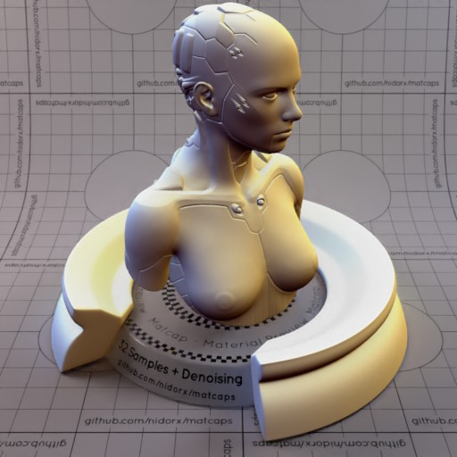

[[1024px](https://github.com/nidorx/matcaps/raw/master/1024/C7C0AC_C7C0AC_2E181B_543B30.png)]
[[512px](https://github.com/nidorx/matcaps/raw/master/512/C7C0AC_C7C0AC_2E181B_543B30-512px.png)]
[[256px](https://github.com/nidorx/matcaps/raw/master/256/C7C0AC_C7C0AC_2E181B_543B30-256px.png)]
[[128px](https://github.com/nidorx/matcaps/raw/master/128/C7C0AC_C7C0AC_2E181B_543B30-128px.png)]
[[64px](https://github.com/nidorx/matcaps/raw/master/64/C7C0AC_C7C0AC_2E181B_543B30-64px.png)]
[[ZBrush Material (ZMT)](https://github.com/nidorx/matcaps/raw/master/zmt/C7C0AC_C7C0AC_2E181B_543B30.zmt)]

---
### C8C8C8_C8C8C8_3F3F3F_787878
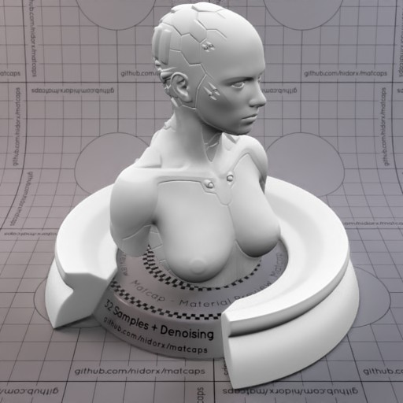

[[1024px](https://github.com/nidorx/matcaps/raw/master/1024/C8C8C8_C8C8C8_3F3F3F_787878.png)]
[[512px](https://github.com/nidorx/matcaps/raw/master/512/C8C8C8_C8C8C8_3F3F3F_787878-512px.png)]
[[256px](https://github.com/nidorx/matcaps/raw/master/256/C8C8C8_C8C8C8_3F3F3F_787878-256px.png)]
[[128px](https://github.com/nidorx/matcaps/raw/master/128/C8C8C8_C8C8C8_3F3F3F_787878-128px.png)]
[[64px](https://github.com/nidorx/matcaps/raw/master/64/C8C8C8_C8C8C8_3F3F3F_787878-64px.png)]
[[ZBrush Material (ZMT)](https://github.com/nidorx/matcaps/raw/master/zmt/C8C8C8_C8C8C8_3F3F3F_787878.zmt)]

---
### C8D1DC_C8D1DC_575B62_818892
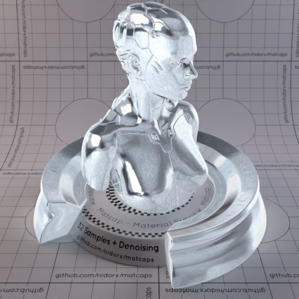

[[1024px](https://github.com/nidorx/matcaps/raw/master/1024/C8D1DC_C8D1DC_575B62_818892.png)]
[[512px](https://github.com/nidorx/matcaps/raw/master/512/C8D1DC_C8D1DC_575B62_818892-512px.png)]
[[256px](https://github.com/nidorx/matcaps/raw/master/256/C8D1DC_C8D1DC_575B62_818892-256px.png)]
[[128px](https://github.com/nidorx/matcaps/raw/master/128/C8D1DC_C8D1DC_575B62_818892-128px.png)]
[[64px](https://github.com/nidorx/matcaps/raw/master/64/C8D1DC_C8D1DC_575B62_818892-64px.png)]
[[ZBrush Material (ZMT)](https://github.com/nidorx/matcaps/raw/master/zmt/C8D1DC_C8D1DC_575B62_818892.zmt)]

---
### C99A8B_C99A8B_491B0E_6E4136

[[1024px](https://github.com/nidorx/matcaps/raw/master/1024/C99A8B_C99A8B_491B0E_6E4136.png)]
[[512px](https://github.com/nidorx/matcaps/raw/master/512/C99A8B_C99A8B_491B0E_6E4136-512px.png)]
[[256px](https://github.com/nidorx/matcaps/raw/master/256/C99A8B_C99A8B_491B0E_6E4136-256px.png)]
[[128px](https://github.com/nidorx/matcaps/raw/master/128/C99A8B_C99A8B_491B0E_6E4136-128px.png)]
[[64px](https://github.com/nidorx/matcaps/raw/master/64/C99A8B_C99A8B_491B0E_6E4136-64px.png)]
[[ZBrush Material (ZMT)](https://github.com/nidorx/matcaps/raw/master/zmt/C99A8B_C99A8B_491B0E_6E4136.zmt)]

---
### CB7146_CB7146_551D0F_7C270D
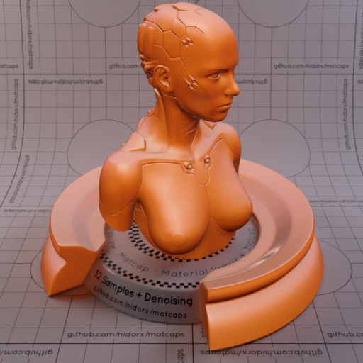
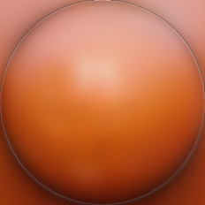

[[1024px](https://github.com/nidorx/matcaps/raw/master/1024/CB7146_CB7146_551D0F_7C270D.png)]
[[512px](https://github.com/nidorx/matcaps/raw/master/512/CB7146_CB7146_551D0F_7C270D-512px.png)]
[[256px](https://github.com/nidorx/matcaps/raw/master/256/CB7146_CB7146_551D0F_7C270D-256px.png)]
[[128px](https://github.com/nidorx/matcaps/raw/master/128/CB7146_CB7146_551D0F_7C270D-128px.png)]
[[64px](https://github.com/nidorx/matcaps/raw/master/64/CB7146_CB7146_551D0F_7C270D-64px.png)]
[[ZBrush Material (ZMT)](https://github.com/nidorx/matcaps/raw/master/zmt/CB7146_CB7146_551D0F_7C270D.zmt)]

---
### CBCBCB_CBCBCB_595959_8C8C8C
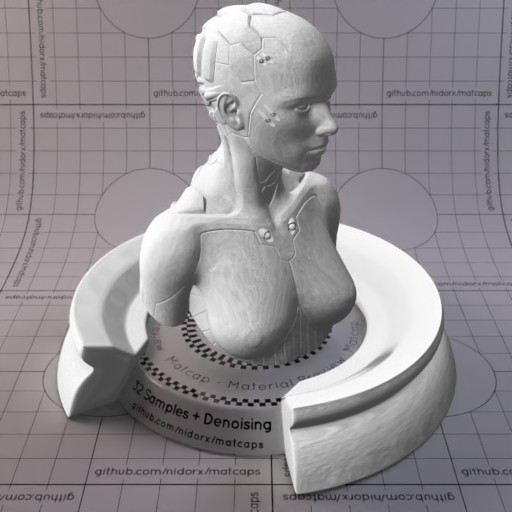

[[1024px](https://github.com/nidorx/matcaps/raw/master/1024/CBCBCB_CBCBCB_595959_8C8C8C.png)]
[[512px](https://github.com/nidorx/matcaps/raw/master/512/CBCBCB_CBCBCB_595959_8C8C8C-512px.png)]
[[256px](https://github.com/nidorx/matcaps/raw/master/256/CBCBCB_CBCBCB_595959_8C8C8C-256px.png)]
[[128px](https://github.com/nidorx/matcaps/raw/master/128/CBCBCB_CBCBCB_595959_8C8C8C-128px.png)]
[[64px](https://github.com/nidorx/matcaps/raw/master/64/CBCBCB_CBCBCB_595959_8C8C8C-64px.png)]
[[ZBrush Material (ZMT)](https://github.com/nidorx/matcaps/raw/master/zmt/CBCBCB_CBCBCB_595959_8C8C8C.zmt)]

---
### CC9A7E_CC9A7E_8A5249_C06A3E
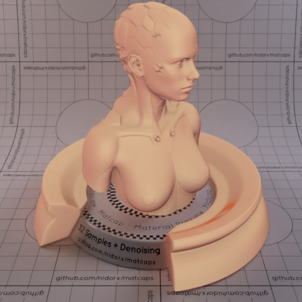
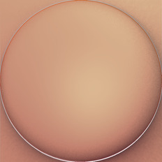

[[1024px](https://github.com/nidorx/matcaps/raw/master/1024/CC9A7E_CC9A7E_8A5249_C06A3E.png)]
[[512px](https://github.com/nidorx/matcaps/raw/master/512/CC9A7E_CC9A7E_8A5249_C06A3E-512px.png)]
[[256px](https://github.com/nidorx/matcaps/raw/master/256/CC9A7E_CC9A7E_8A5249_C06A3E-256px.png)]
[[128px](https://github.com/nidorx/matcaps/raw/master/128/CC9A7E_CC9A7E_8A5249_C06A3E-128px.png)]
[[64px](https://github.com/nidorx/matcaps/raw/master/64/CC9A7E_CC9A7E_8A5249_C06A3E-64px.png)]
[[ZBrush Material (ZMT)](https://github.com/nidorx/matcaps/raw/master/zmt/CC9A7E_CC9A7E_8A5249_C06A3E.zmt)]

---
### CDC3B8_CDC3B8_5A3F3C_67545A
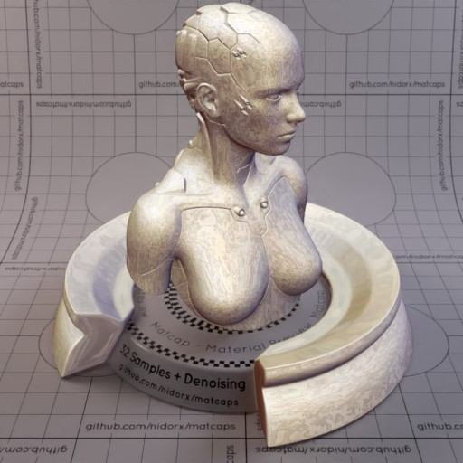

[[1024px](https://github.com/nidorx/matcaps/raw/master/1024/CDC3B8_CDC3B8_5A3F3C_67545A.png)]
[[512px](https://github.com/nidorx/matcaps/raw/master/512/CDC3B8_CDC3B8_5A3F3C_67545A-512px.png)]
[[256px](https://github.com/nidorx/matcaps/raw/master/256/CDC3B8_CDC3B8_5A3F3C_67545A-256px.png)]
[[128px](https://github.com/nidorx/matcaps/raw/master/128/CDC3B8_CDC3B8_5A3F3C_67545A-128px.png)]
[[64px](https://github.com/nidorx/matcaps/raw/master/64/CDC3B8_CDC3B8_5A3F3C_67545A-64px.png)]
[[ZBrush Material (ZMT)](https://github.com/nidorx/matcaps/raw/master/zmt/CDC3B8_CDC3B8_5A3F3C_67545A.zmt)]

---
### CDCBC8_CDCBC8_444342_696765
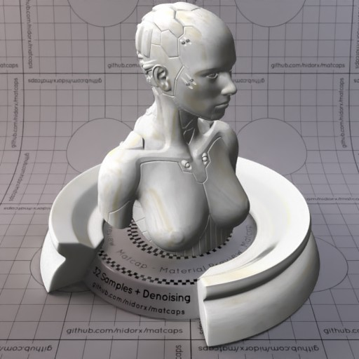

[[1024px](https://github.com/nidorx/matcaps/raw/master/1024/CDCBC8_CDCBC8_444342_696765.png)]
[[512px](https://github.com/nidorx/matcaps/raw/master/512/CDCBC8_CDCBC8_444342_696765-512px.png)]
[[256px](https://github.com/nidorx/matcaps/raw/master/256/CDCBC8_CDCBC8_444342_696765-256px.png)]
[[128px](https://github.com/nidorx/matcaps/raw/master/128/CDCBC8_CDCBC8_444342_696765-128px.png)]
[[64px](https://github.com/nidorx/matcaps/raw/master/64/CDCBC8_CDCBC8_444342_696765-64px.png)]
[[ZBrush Material (ZMT)](https://github.com/nidorx/matcaps/raw/master/zmt/CDCBC8_CDCBC8_444342_696765.zmt)]

---
### CEB299_CEB299_6B5C4C_887564
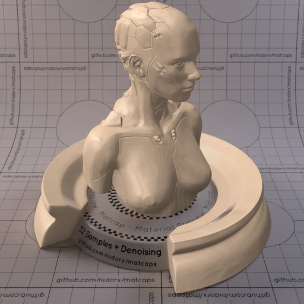
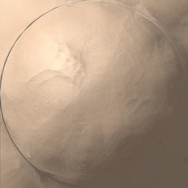

[[1024px](https://github.com/nidorx/matcaps/raw/master/1024/CEB299_CEB299_6B5C4C_887564.png)]
[[512px](https://github.com/nidorx/matcaps/raw/master/512/CEB299_CEB299_6B5C4C_887564-512px.png)]
[[256px](https://github.com/nidorx/matcaps/raw/master/256/CEB299_CEB299_6B5C4C_887564-256px.png)]
[[128px](https://github.com/nidorx/matcaps/raw/master/128/CEB299_CEB299_6B5C4C_887564-128px.png)]
[[64px](https://github.com/nidorx/matcaps/raw/master/64/CEB299_CEB299_6B5C4C_887564-64px.png)]
[[ZBrush Material (ZMT)](https://github.com/nidorx/matcaps/raw/master/zmt/CEB299_CEB299_6B5C4C_887564.zmt)]

---
### D0D3BE_D0D3BE_816854_998366
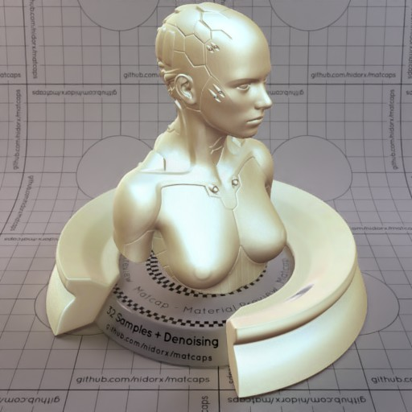

[[1024px](https://github.com/nidorx/matcaps/raw/master/1024/D0D3BE_D0D3BE_816854_998366.png)]
[[512px](https://github.com/nidorx/matcaps/raw/master/512/D0D3BE_D0D3BE_816854_998366-512px.png)]
[[256px](https://github.com/nidorx/matcaps/raw/master/256/D0D3BE_D0D3BE_816854_998366-256px.png)]
[[128px](https://github.com/nidorx/matcaps/raw/master/128/D0D3BE_D0D3BE_816854_998366-128px.png)]
[[64px](https://github.com/nidorx/matcaps/raw/master/64/D0D3BE_D0D3BE_816854_998366-64px.png)]
[[ZBrush Material (ZMT)](https://github.com/nidorx/matcaps/raw/master/zmt/D0D3BE_D0D3BE_816854_998366.zmt)]

---
### D3CAAB_D3CAAB_8C866E_C0B89A
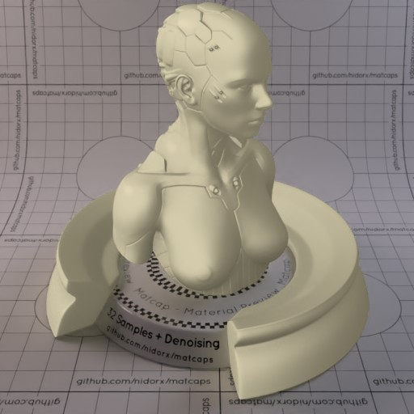

[[1024px](https://github.com/nidorx/matcaps/raw/master/1024/D3CAAB_D3CAAB_8C866E_C0B89A.png)]
[[512px](https://github.com/nidorx/matcaps/raw/master/512/D3CAAB_D3CAAB_8C866E_C0B89A-512px.png)]
[[256px](https://github.com/nidorx/matcaps/raw/master/256/D3CAAB_D3CAAB_8C866E_C0B89A-256px.png)]
[[128px](https://github.com/nidorx/matcaps/raw/master/128/D3CAAB_D3CAAB_8C866E_C0B89A-128px.png)]
[[64px](https://github.com/nidorx/matcaps/raw/master/64/D3CAAB_D3CAAB_8C866E_C0B89A-64px.png)]
[[ZBrush Material (ZMT)](https://github.com/nidorx/matcaps/raw/master/zmt/D3CAAB_D3CAAB_8C866E_C0B89A.zmt)]

---
### D64480_D64480_E27497_EA9BB1-1
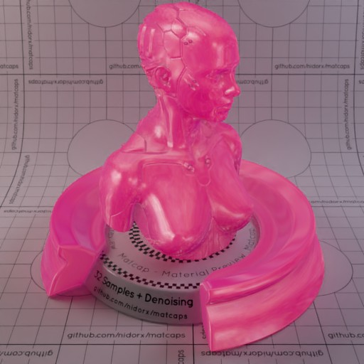
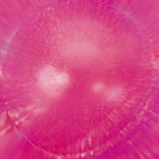

[[1024px](https://github.com/nidorx/matcaps/raw/master/1024/D64480_D64480_E27497_EA9BB1-1.png)]
[[512px](https://github.com/nidorx/matcaps/raw/master/512/D64480_D64480_E27497_EA9BB1-1-512px.png)]
[[256px](https://github.com/nidorx/matcaps/raw/master/256/D64480_D64480_E27497_EA9BB1-1-256px.png)]
[[128px](https://github.com/nidorx/matcaps/raw/master/128/D64480_D64480_E27497_EA9BB1-1-128px.png)]
[[64px](https://github.com/nidorx/matcaps/raw/master/64/D64480_D64480_E27497_EA9BB1-1-64px.png)]
[~~ZBrush Material (ZMT)~~]

---
### D64480_D64480_E27497_EA9BB1

[[1024px](https://github.com/nidorx/matcaps/raw/master/1024/D64480_D64480_E27497_EA9BB1.png)]
[[512px](https://github.com/nidorx/matcaps/raw/master/512/D64480_D64480_E27497_EA9BB1-512px.png)]
[[256px](https://github.com/nidorx/matcaps/raw/master/256/D64480_D64480_E27497_EA9BB1-256px.png)]
[[128px](https://github.com/nidorx/matcaps/raw/master/128/D64480_D64480_E27497_EA9BB1-128px.png)]
[[64px](https://github.com/nidorx/matcaps/raw/master/64/D64480_D64480_E27497_EA9BB1-64px.png)]
[[ZBrush Material (ZMT)](https://github.com/nidorx/matcaps/raw/master/zmt/D64480_D64480_E27497_EA9BB1.zmt)]

---
### D8388B_D8388B_230A14_FCC8FC
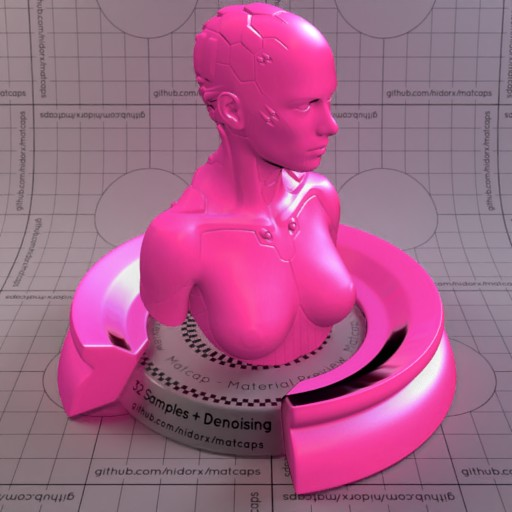

[[1024px](https://github.com/nidorx/matcaps/raw/master/1024/D8388B_D8388B_230A14_FCC8FC.png)]
[[512px](https://github.com/nidorx/matcaps/raw/master/512/D8388B_D8388B_230A14_FCC8FC-512px.png)]
[[256px](https://github.com/nidorx/matcaps/raw/master/256/D8388B_D8388B_230A14_FCC8FC-256px.png)]
[[128px](https://github.com/nidorx/matcaps/raw/master/128/D8388B_D8388B_230A14_FCC8FC-128px.png)]
[[64px](https://github.com/nidorx/matcaps/raw/master/64/D8388B_D8388B_230A14_FCC8FC-64px.png)]
[[ZBrush Material (ZMT)](https://github.com/nidorx/matcaps/raw/master/zmt/D8388B_D8388B_230A14_FCC8FC.zmt)]

---
### E1E1E0_E1E1E0_363636_989897
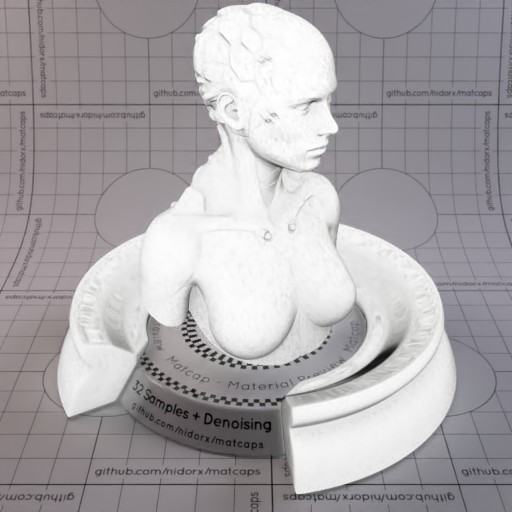
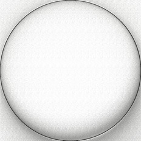

[[1024px](https://github.com/nidorx/matcaps/raw/master/1024/E1E1E0_E1E1E0_363636_989897.png)]
[[512px](https://github.com/nidorx/matcaps/raw/master/512/E1E1E0_E1E1E0_363636_989897-512px.png)]
[[256px](https://github.com/nidorx/matcaps/raw/master/256/E1E1E0_E1E1E0_363636_989897-256px.png)]
[[128px](https://github.com/nidorx/matcaps/raw/master/128/E1E1E0_E1E1E0_363636_989897-128px.png)]
[[64px](https://github.com/nidorx/matcaps/raw/master/64/E1E1E0_E1E1E0_363636_989897-64px.png)]
[[ZBrush Material (ZMT)](https://github.com/nidorx/matcaps/raw/master/zmt/E1E1E0_E1E1E0_363636_989897.zmt)]

---
### E42E12_E42E12_F35132_F86949
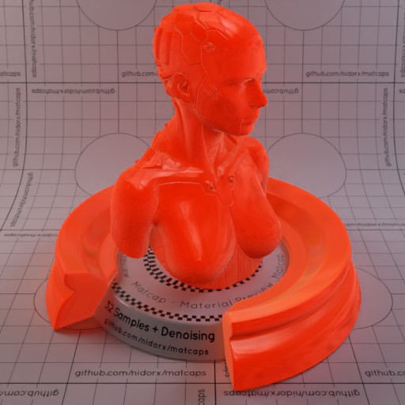
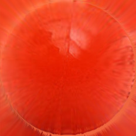

[[1024px](https://github.com/nidorx/matcaps/raw/master/1024/E42E12_E42E12_F35132_F86949.png)]
[[512px](https://github.com/nidorx/matcaps/raw/master/512/E42E12_E42E12_F35132_F86949-512px.png)]
[[256px](https://github.com/nidorx/matcaps/raw/master/256/E42E12_E42E12_F35132_F86949-256px.png)]
[[128px](https://github.com/nidorx/matcaps/raw/master/128/E42E12_E42E12_F35132_F86949-128px.png)]
[[64px](https://github.com/nidorx/matcaps/raw/master/64/E42E12_E42E12_F35132_F86949-64px.png)]
[[ZBrush Material (ZMT)](https://github.com/nidorx/matcaps/raw/master/zmt/E42E12_E42E12_F35132_F86949.zmt)]

---
### E6BF3C_E6BF3C_5A4719_977726
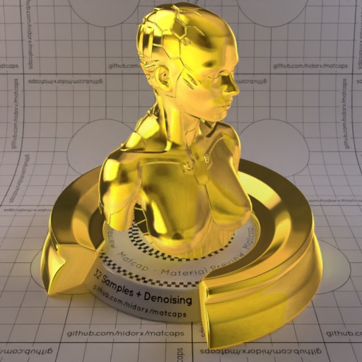

[[1024px](https://github.com/nidorx/matcaps/raw/master/1024/E6BF3C_E6BF3C_5A4719_977726.png)]
[[512px](https://github.com/nidorx/matcaps/raw/master/512/E6BF3C_E6BF3C_5A4719_977726-512px.png)]
[[256px](https://github.com/nidorx/matcaps/raw/master/256/E6BF3C_E6BF3C_5A4719_977726-256px.png)]
[[128px](https://github.com/nidorx/matcaps/raw/master/128/E6BF3C_E6BF3C_5A4719_977726-128px.png)]
[[64px](https://github.com/nidorx/matcaps/raw/master/64/E6BF3C_E6BF3C_5A4719_977726-64px.png)]
[[ZBrush Material (ZMT)](https://github.com/nidorx/matcaps/raw/master/zmt/E6BF3C_E6BF3C_5A4719_977726.zmt)]

---
### EA783E_EA783E_6D4830_905837
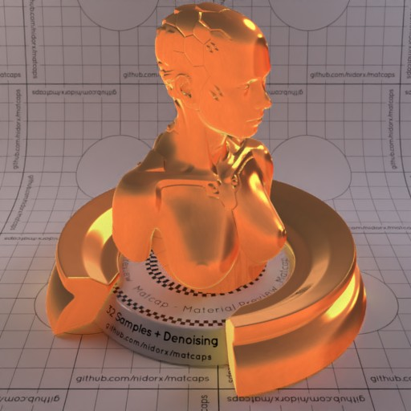

[[1024px](https://github.com/nidorx/matcaps/raw/master/1024/EA783E_EA783E_6D4830_905837.png)]
[[512px](https://github.com/nidorx/matcaps/raw/master/512/EA783E_EA783E_6D4830_905837-512px.png)]
[[256px](https://github.com/nidorx/matcaps/raw/master/256/EA783E_EA783E_6D4830_905837-256px.png)]
[[128px](https://github.com/nidorx/matcaps/raw/master/128/EA783E_EA783E_6D4830_905837-128px.png)]
[[64px](https://github.com/nidorx/matcaps/raw/master/64/EA783E_EA783E_6D4830_905837-64px.png)]
[[ZBrush Material (ZMT)](https://github.com/nidorx/matcaps/raw/master/zmt/EA783E_EA783E_6D4830_905837.zmt)]

---
### ED5087_ED5087_FAC3D0_1C0B0C

[[1024px](https://github.com/nidorx/matcaps/raw/master/1024/ED5087_ED5087_FAC3D0_1C0B0C.png)]
[[512px](https://github.com/nidorx/matcaps/raw/master/512/ED5087_ED5087_FAC3D0_1C0B0C-512px.png)]
[[256px](https://github.com/nidorx/matcaps/raw/master/256/ED5087_ED5087_FAC3D0_1C0B0C-256px.png)]
[[128px](https://github.com/nidorx/matcaps/raw/master/128/ED5087_ED5087_FAC3D0_1C0B0C-128px.png)]
[[64px](https://github.com/nidorx/matcaps/raw/master/64/ED5087_ED5087_FAC3D0_1C0B0C-64px.png)]
[[ZBrush Material (ZMT)](https://github.com/nidorx/matcaps/raw/master/zmt/ED5087_ED5087_FAC3D0_1C0B0C.zmt)]

---