A huge library of MatCap textures in PNG and ZMT.

## Navigation
* [Home](/)
* [Page 1](PAGE-1.md)
* [Page 2](PAGE-2.md)
* [Page 3](PAGE-3.md)
* Page 4
* [Page 5](PAGE-5.md)
* [Page 6](PAGE-6.md)
* [Page 7](PAGE-7.md)
* [Page 8](PAGE-8.md)
* [Page 9](PAGE-9.md)
* [Page 10](PAGE-10.md)
* [Page 11](PAGE-11.md)
* [Page 12](PAGE-12.md)
* [Page 13](PAGE-13.md)
* [Page 14](PAGE-14.md)
* [Page 15](PAGE-15.md)
* [Page 16](PAGE-16.md)
* [Page 17](PAGE-17.md)
* [Page 18](PAGE-18.md)
* [Page 19](PAGE-19.md)
* [Page 20](PAGE-20.md)
* [Page 21](PAGE-21.md)
* [Page 22](PAGE-22.md)
* [Page 23](PAGE-23.md)
* [Page 24](PAGE-24.md)
* [Page 25](PAGE-25.md)
* [Page 26](PAGE-26.md)
* [Page 27](PAGE-27.md)
* [Page 28](PAGE-28.md)
* [Page 29](PAGE-29.md)
* [Page 30](PAGE-30.md)
* [Page 31](PAGE-31.md)
* [Page 32](PAGE-32.md)
* [Page 33](PAGE-33.md)
## Page 4 Matcaps
### 2F2FAA_2F2FAA_1E1E87_10104E

[[1024px](https://github.com/nidorx/matcaps/raw/master/1024/2F2FAA_2F2FAA_1E1E87_10104E.png)]
[[512px](https://github.com/nidorx/matcaps/raw/master/512/2F2FAA_2F2FAA_1E1E87_10104E-512px.png)]
[[256px](https://github.com/nidorx/matcaps/raw/master/256/2F2FAA_2F2FAA_1E1E87_10104E-256px.png)]
[[128px](https://github.com/nidorx/matcaps/raw/master/128/2F2FAA_2F2FAA_1E1E87_10104E-128px.png)]
[[64px](https://github.com/nidorx/matcaps/raw/master/64/2F2FAA_2F2FAA_1E1E87_10104E-64px.png)]
[~~ZBrush Material (ZMT)~~]

---
### 2F3747_2F3747_6A7C9E_54637F
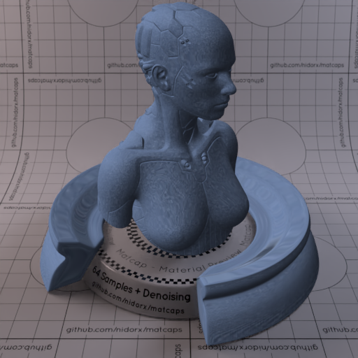
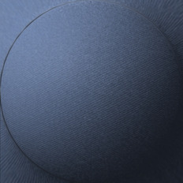

[[1024px](https://github.com/nidorx/matcaps/raw/master/1024/2F3747_2F3747_6A7C9E_54637F.png)]
[[512px](https://github.com/nidorx/matcaps/raw/master/512/2F3747_2F3747_6A7C9E_54637F-512px.png)]
[[256px](https://github.com/nidorx/matcaps/raw/master/256/2F3747_2F3747_6A7C9E_54637F-256px.png)]
[[128px](https://github.com/nidorx/matcaps/raw/master/128/2F3747_2F3747_6A7C9E_54637F-128px.png)]
[[64px](https://github.com/nidorx/matcaps/raw/master/64/2F3747_2F3747_6A7C9E_54637F-64px.png)]
[[ZBrush Material (ZMT)](https://github.com/nidorx/matcaps/raw/master/zmt/2F3747_2F3747_6A7C9E_54637F.zmt)]

---
### 300706_300706_888576_822821
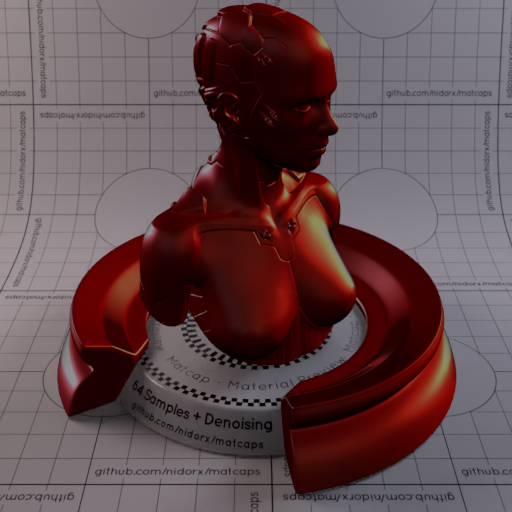
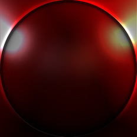

[[1024px](https://github.com/nidorx/matcaps/raw/master/1024/300706_300706_888576_822821.png)]
[[512px](https://github.com/nidorx/matcaps/raw/master/512/300706_300706_888576_822821-512px.png)]
[[256px](https://github.com/nidorx/matcaps/raw/master/256/300706_300706_888576_822821-256px.png)]
[[128px](https://github.com/nidorx/matcaps/raw/master/128/300706_300706_888576_822821-128px.png)]
[[64px](https://github.com/nidorx/matcaps/raw/master/64/300706_300706_888576_822821-64px.png)]
[[ZBrush Material (ZMT)](https://github.com/nidorx/matcaps/raw/master/zmt/300706_300706_888576_822821.zmt)]

---
### 302721_302721_CAC1BB_7A706A
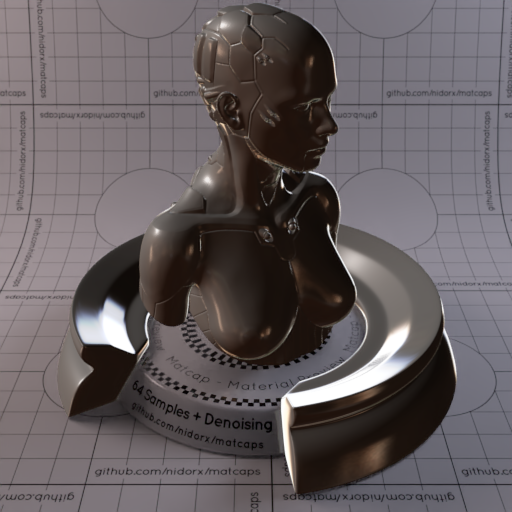
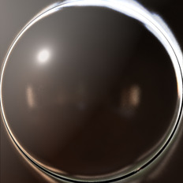

[[1024px](https://github.com/nidorx/matcaps/raw/master/1024/302721_302721_CAC1BB_7A706A.png)]
[[512px](https://github.com/nidorx/matcaps/raw/master/512/302721_302721_CAC1BB_7A706A-512px.png)]
[[256px](https://github.com/nidorx/matcaps/raw/master/256/302721_302721_CAC1BB_7A706A-256px.png)]
[[128px](https://github.com/nidorx/matcaps/raw/master/128/302721_302721_CAC1BB_7A706A-128px.png)]
[[64px](https://github.com/nidorx/matcaps/raw/master/64/302721_302721_CAC1BB_7A706A-64px.png)]
[[ZBrush Material (ZMT)](https://github.com/nidorx/matcaps/raw/master/zmt/302721_302721_CAC1BB_7A706A.zmt)]

---
### 304FB1_304FB1_69A1EF_5081DF
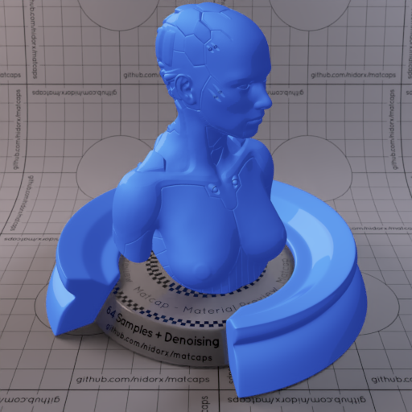

[[1024px](https://github.com/nidorx/matcaps/raw/master/1024/304FB1_304FB1_69A1EF_5081DF.png)]
[[512px](https://github.com/nidorx/matcaps/raw/master/512/304FB1_304FB1_69A1EF_5081DF-512px.png)]
[[256px](https://github.com/nidorx/matcaps/raw/master/256/304FB1_304FB1_69A1EF_5081DF-256px.png)]
[[128px](https://github.com/nidorx/matcaps/raw/master/128/304FB1_304FB1_69A1EF_5081DF-128px.png)]
[[64px](https://github.com/nidorx/matcaps/raw/master/64/304FB1_304FB1_69A1EF_5081DF-64px.png)]
[~~ZBrush Material (ZMT)~~]

---
### 312C34_312C34_A2AAB3_61656A
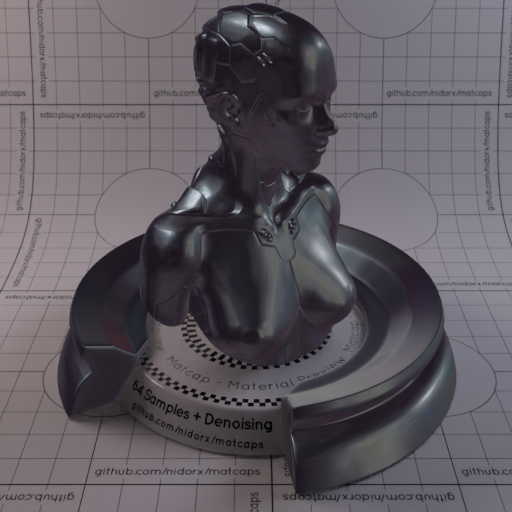

[[1024px](https://github.com/nidorx/matcaps/raw/master/1024/312C34_312C34_A2AAB3_61656A.png)]
[[512px](https://github.com/nidorx/matcaps/raw/master/512/312C34_312C34_A2AAB3_61656A-512px.png)]
[[256px](https://github.com/nidorx/matcaps/raw/master/256/312C34_312C34_A2AAB3_61656A-256px.png)]
[[128px](https://github.com/nidorx/matcaps/raw/master/128/312C34_312C34_A2AAB3_61656A-128px.png)]
[[64px](https://github.com/nidorx/matcaps/raw/master/64/312C34_312C34_A2AAB3_61656A-64px.png)]
[[ZBrush Material (ZMT)](https://github.com/nidorx/matcaps/raw/master/zmt/312C34_312C34_A2AAB3_61656A.zmt)]

---
### 312D20_312D20_80675C_8B8C8B
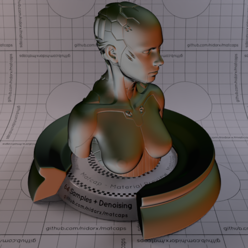

[[1024px](https://github.com/nidorx/matcaps/raw/master/1024/312D20_312D20_80675C_8B8C8B.png)]
[[512px](https://github.com/nidorx/matcaps/raw/master/512/312D20_312D20_80675C_8B8C8B-512px.png)]
[[256px](https://github.com/nidorx/matcaps/raw/master/256/312D20_312D20_80675C_8B8C8B-256px.png)]
[[128px](https://github.com/nidorx/matcaps/raw/master/128/312D20_312D20_80675C_8B8C8B-128px.png)]
[[64px](https://github.com/nidorx/matcaps/raw/master/64/312D20_312D20_80675C_8B8C8B-64px.png)]
[[ZBrush Material (ZMT)](https://github.com/nidorx/matcaps/raw/master/zmt/312D20_312D20_80675C_8B8C8B.zmt)]

---
### 313131_313131_BBBBBB_878787

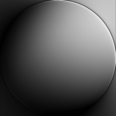

[[1024px](https://github.com/nidorx/matcaps/raw/master/1024/313131_313131_BBBBBB_878787.png)]
[[512px](https://github.com/nidorx/matcaps/raw/master/512/313131_313131_BBBBBB_878787-512px.png)]
[[256px](https://github.com/nidorx/matcaps/raw/master/256/313131_313131_BBBBBB_878787-256px.png)]
[[128px](https://github.com/nidorx/matcaps/raw/master/128/313131_313131_BBBBBB_878787-128px.png)]
[[64px](https://github.com/nidorx/matcaps/raw/master/64/313131_313131_BBBBBB_878787-64px.png)]
[[ZBrush Material (ZMT)](https://github.com/nidorx/matcaps/raw/master/zmt/313131_313131_BBBBBB_878787.zmt)]

---
### 320455_320455_720DBE_560496
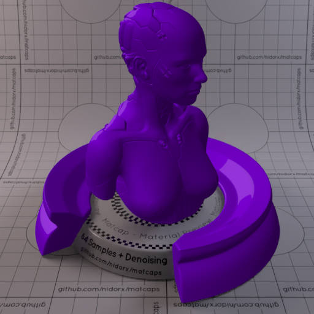

[[1024px](https://github.com/nidorx/matcaps/raw/master/1024/320455_320455_720DBE_560496.png)]
[[512px](https://github.com/nidorx/matcaps/raw/master/512/320455_320455_720DBE_560496-512px.png)]
[[256px](https://github.com/nidorx/matcaps/raw/master/256/320455_320455_720DBE_560496-256px.png)]
[[128px](https://github.com/nidorx/matcaps/raw/master/128/320455_320455_720DBE_560496-128px.png)]
[[64px](https://github.com/nidorx/matcaps/raw/master/64/320455_320455_720DBE_560496-64px.png)]
[~~ZBrush Material (ZMT)~~]

---
### 32201D_32201D_613C3C_563533

[[1024px](https://github.com/nidorx/matcaps/raw/master/1024/32201D_32201D_613C3C_563533.png)]
[[512px](https://github.com/nidorx/matcaps/raw/master/512/32201D_32201D_613C3C_563533-512px.png)]
[[256px](https://github.com/nidorx/matcaps/raw/master/256/32201D_32201D_613C3C_563533-256px.png)]
[[128px](https://github.com/nidorx/matcaps/raw/master/128/32201D_32201D_613C3C_563533-128px.png)]
[[64px](https://github.com/nidorx/matcaps/raw/master/64/32201D_32201D_613C3C_563533-64px.png)]
[[ZBrush Material (ZMT)](https://github.com/nidorx/matcaps/raw/master/zmt/32201D_32201D_613C3C_563533.zmt)]

---
### 32302B_32302B_4C4842_121211
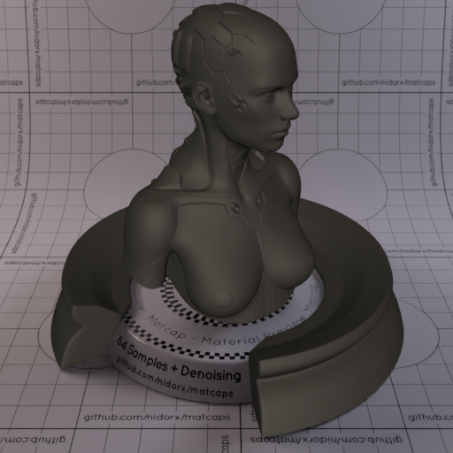

[[1024px](https://github.com/nidorx/matcaps/raw/master/1024/32302B_32302B_4C4842_121211.png)]
[[512px](https://github.com/nidorx/matcaps/raw/master/512/32302B_32302B_4C4842_121211-512px.png)]
[[256px](https://github.com/nidorx/matcaps/raw/master/256/32302B_32302B_4C4842_121211-256px.png)]
[[128px](https://github.com/nidorx/matcaps/raw/master/128/32302B_32302B_4C4842_121211-128px.png)]
[[64px](https://github.com/nidorx/matcaps/raw/master/64/32302B_32302B_4C4842_121211-64px.png)]
[[ZBrush Material (ZMT)](https://github.com/nidorx/matcaps/raw/master/zmt/32302B_32302B_4C4842_121211.zmt)]

---
### 323C4D_323C4D_B79039_7C6A44

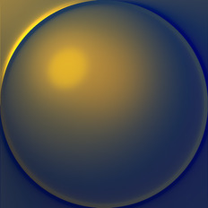

[[1024px](https://github.com/nidorx/matcaps/raw/master/1024/323C4D_323C4D_B79039_7C6A44.png)]
[[512px](https://github.com/nidorx/matcaps/raw/master/512/323C4D_323C4D_B79039_7C6A44-512px.png)]
[[256px](https://github.com/nidorx/matcaps/raw/master/256/323C4D_323C4D_B79039_7C6A44-256px.png)]
[[128px](https://github.com/nidorx/matcaps/raw/master/128/323C4D_323C4D_B79039_7C6A44-128px.png)]
[[64px](https://github.com/nidorx/matcaps/raw/master/64/323C4D_323C4D_B79039_7C6A44-64px.png)]
[[ZBrush Material (ZMT)](https://github.com/nidorx/matcaps/raw/master/zmt/323C4D_323C4D_B79039_7C6A44.zmt)]

---
### 326666_326666_66CBC9_C0B8AE
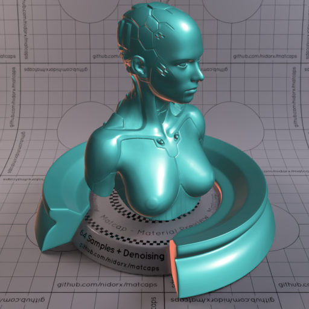

[[1024px](https://github.com/nidorx/matcaps/raw/master/1024/326666_326666_66CBC9_C0B8AE.png)]
[[512px](https://github.com/nidorx/matcaps/raw/master/512/326666_326666_66CBC9_C0B8AE-512px.png)]
[[256px](https://github.com/nidorx/matcaps/raw/master/256/326666_326666_66CBC9_C0B8AE-256px.png)]
[[128px](https://github.com/nidorx/matcaps/raw/master/128/326666_326666_66CBC9_C0B8AE-128px.png)]
[[64px](https://github.com/nidorx/matcaps/raw/master/64/326666_326666_66CBC9_C0B8AE-64px.png)]
[[ZBrush Material (ZMT)](https://github.com/nidorx/matcaps/raw/master/zmt/326666_326666_66CBC9_C0B8AE.zmt)]

---
### 331A0B_331A0B_B17038_7D4E28

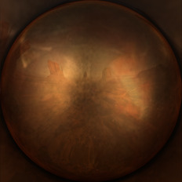

[[1024px](https://github.com/nidorx/matcaps/raw/master/1024/331A0B_331A0B_B17038_7D4E28.png)]
[[512px](https://github.com/nidorx/matcaps/raw/master/512/331A0B_331A0B_B17038_7D4E28-512px.png)]
[[256px](https://github.com/nidorx/matcaps/raw/master/256/331A0B_331A0B_B17038_7D4E28-256px.png)]
[[128px](https://github.com/nidorx/matcaps/raw/master/128/331A0B_331A0B_B17038_7D4E28-128px.png)]
[[64px](https://github.com/nidorx/matcaps/raw/master/64/331A0B_331A0B_B17038_7D4E28-64px.png)]
[[ZBrush Material (ZMT)](https://github.com/nidorx/matcaps/raw/master/zmt/331A0B_331A0B_B17038_7D4E28.zmt)]

---
### 336EB3_336EB3_152578_A4C5E2

[[1024px](https://github.com/nidorx/matcaps/raw/master/1024/336EB3_336EB3_152578_A4C5E2.png)]
[[512px](https://github.com/nidorx/matcaps/raw/master/512/336EB3_336EB3_152578_A4C5E2-512px.png)]
[[256px](https://github.com/nidorx/matcaps/raw/master/256/336EB3_336EB3_152578_A4C5E2-256px.png)]
[[128px](https://github.com/nidorx/matcaps/raw/master/128/336EB3_336EB3_152578_A4C5E2-128px.png)]
[[64px](https://github.com/nidorx/matcaps/raw/master/64/336EB3_336EB3_152578_A4C5E2-64px.png)]
[[ZBrush Material (ZMT)](https://github.com/nidorx/matcaps/raw/master/zmt/336EB3_336EB3_152578_A4C5E2.zmt)]

---
### 34352A_34352A_718184_50605E

[[1024px](https://github.com/nidorx/matcaps/raw/master/1024/34352A_34352A_718184_50605E.png)]
[[512px](https://github.com/nidorx/matcaps/raw/master/512/34352A_34352A_718184_50605E-512px.png)]
[[256px](https://github.com/nidorx/matcaps/raw/master/256/34352A_34352A_718184_50605E-256px.png)]
[[128px](https://github.com/nidorx/matcaps/raw/master/128/34352A_34352A_718184_50605E-128px.png)]
[[64px](https://github.com/nidorx/matcaps/raw/master/64/34352A_34352A_718184_50605E-64px.png)]
[[ZBrush Material (ZMT)](https://github.com/nidorx/matcaps/raw/master/zmt/34352A_34352A_718184_50605E.zmt)]

---
### 346088_346088_6ABED7_56A0C5
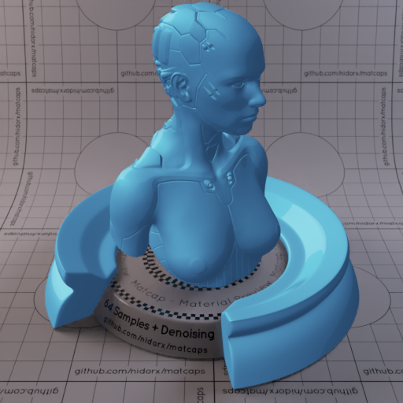

[[1024px](https://github.com/nidorx/matcaps/raw/master/1024/346088_346088_6ABED7_56A0C5.png)]
[[512px](https://github.com/nidorx/matcaps/raw/master/512/346088_346088_6ABED7_56A0C5-512px.png)]
[[256px](https://github.com/nidorx/matcaps/raw/master/256/346088_346088_6ABED7_56A0C5-256px.png)]
[[128px](https://github.com/nidorx/matcaps/raw/master/128/346088_346088_6ABED7_56A0C5-128px.png)]
[[64px](https://github.com/nidorx/matcaps/raw/master/64/346088_346088_6ABED7_56A0C5-64px.png)]
[~~ZBrush Material (ZMT)~~]

---
### 34A09C_34A09C_6EE5E3_5CD7D3
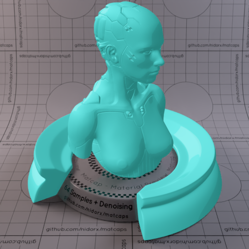

[[1024px](https://github.com/nidorx/matcaps/raw/master/1024/34A09C_34A09C_6EE5E3_5CD7D3.png)]
[[512px](https://github.com/nidorx/matcaps/raw/master/512/34A09C_34A09C_6EE5E3_5CD7D3-512px.png)]
[[256px](https://github.com/nidorx/matcaps/raw/master/256/34A09C_34A09C_6EE5E3_5CD7D3-256px.png)]
[[128px](https://github.com/nidorx/matcaps/raw/master/128/34A09C_34A09C_6EE5E3_5CD7D3-128px.png)]
[[64px](https://github.com/nidorx/matcaps/raw/master/64/34A09C_34A09C_6EE5E3_5CD7D3-64px.png)]
[~~ZBrush Material (ZMT)~~]

---
### 34AB94_34AB94_36DFC1_19F9EB

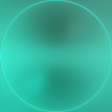

[[1024px](https://github.com/nidorx/matcaps/raw/master/1024/34AB94_34AB94_36DFC1_19F9EB.png)]
[[512px](https://github.com/nidorx/matcaps/raw/master/512/34AB94_34AB94_36DFC1_19F9EB-512px.png)]
[[256px](https://github.com/nidorx/matcaps/raw/master/256/34AB94_34AB94_36DFC1_19F9EB-256px.png)]
[[128px](https://github.com/nidorx/matcaps/raw/master/128/34AB94_34AB94_36DFC1_19F9EB-128px.png)]
[[64px](https://github.com/nidorx/matcaps/raw/master/64/34AB94_34AB94_36DFC1_19F9EB-64px.png)]
[[ZBrush Material (ZMT)](https://github.com/nidorx/matcaps/raw/master/zmt/34AB94_34AB94_36DFC1_19F9EB.zmt)]

---
### 353535_353535_CFCFCF_828282
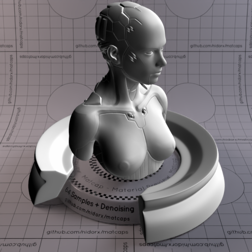
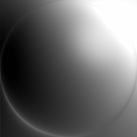

[[1024px](https://github.com/nidorx/matcaps/raw/master/1024/353535_353535_CFCFCF_828282.png)]
[[512px](https://github.com/nidorx/matcaps/raw/master/512/353535_353535_CFCFCF_828282-512px.png)]
[[256px](https://github.com/nidorx/matcaps/raw/master/256/353535_353535_CFCFCF_828282-256px.png)]
[[128px](https://github.com/nidorx/matcaps/raw/master/128/353535_353535_CFCFCF_828282-128px.png)]
[[64px](https://github.com/nidorx/matcaps/raw/master/64/353535_353535_CFCFCF_828282-64px.png)]
[[ZBrush Material (ZMT)](https://github.com/nidorx/matcaps/raw/master/zmt/353535_353535_CFCFCF_828282.zmt)]

---