Huge library of matcap PNG textures organized by color

## Navigation
* [Home](/)
* [Page 1](PAGE-1.md)
* [Page 2](PAGE-2.md)
* [Page 3](PAGE-3.md)
* Page 4
* [Page 5](PAGE-5.md)
* [Page 6](PAGE-6.md)
* [Page 7](PAGE-7.md)
* [Page 8](PAGE-8.md)
## Page 9 Matcaps
### 6F503E_6F503E_D59A70_221812

[[1024px](https://github.com/nidorx/matcaps/raw/master/1024/6F503E_6F503E_D59A70_221812.png)]
[[512px](https://github.com/nidorx/matcaps/raw/master/512/6F503E_6F503E_D59A70_221812-512px.png)]
[[256px](https://github.com/nidorx/matcaps/raw/master/256/6F503E_6F503E_D59A70_221812-256px.png)]
[[128px](https://github.com/nidorx/matcaps/raw/master/128/6F503E_6F503E_D59A70_221812-128px.png)]
[[64px](https://github.com/nidorx/matcaps/raw/master/64/6F503E_6F503E_D59A70_221812-64px.png)]
[[ZBrush Material (ZMT)](https://github.com/nidorx/matcaps/raw/master/zmt/6F503E_6F503E_D59A70_221812.zmt)]

---
### 714C30_714C30_EAD7C5_CC9265

[[1024px](https://github.com/nidorx/matcaps/raw/master/1024/714C30_714C30_EAD7C5_CC9265.png)]
[[512px](https://github.com/nidorx/matcaps/raw/master/512/714C30_714C30_EAD7C5_CC9265-512px.png)]
[[256px](https://github.com/nidorx/matcaps/raw/master/256/714C30_714C30_EAD7C5_CC9265-256px.png)]
[[128px](https://github.com/nidorx/matcaps/raw/master/128/714C30_714C30_EAD7C5_CC9265-128px.png)]
[[64px](https://github.com/nidorx/matcaps/raw/master/64/714C30_714C30_EAD7C5_CC9265-64px.png)]
[[ZBrush Material (ZMT)](https://github.com/nidorx/matcaps/raw/master/zmt/714C30_714C30_EAD7C5_CC9265.zmt)]

---
### 716049_716049_D1C8B9_3F160C

[[1024px](https://github.com/nidorx/matcaps/raw/master/1024/716049_716049_D1C8B9_3F160C.png)]
[[512px](https://github.com/nidorx/matcaps/raw/master/512/716049_716049_D1C8B9_3F160C-512px.png)]
[[256px](https://github.com/nidorx/matcaps/raw/master/256/716049_716049_D1C8B9_3F160C-256px.png)]
[[128px](https://github.com/nidorx/matcaps/raw/master/128/716049_716049_D1C8B9_3F160C-128px.png)]
[[64px](https://github.com/nidorx/matcaps/raw/master/64/716049_716049_D1C8B9_3F160C-64px.png)]
[[ZBrush Material (ZMT)](https://github.com/nidorx/matcaps/raw/master/zmt/716049_716049_D1C8B9_3F160C.zmt)]

---
### 71623B_71623B_ECDE8C_30250A

[[1024px](https://github.com/nidorx/matcaps/raw/master/1024/71623B_71623B_ECDE8C_30250A.png)]
[[512px](https://github.com/nidorx/matcaps/raw/master/512/71623B_71623B_ECDE8C_30250A-512px.png)]
[[256px](https://github.com/nidorx/matcaps/raw/master/256/71623B_71623B_ECDE8C_30250A-256px.png)]
[[128px](https://github.com/nidorx/matcaps/raw/master/128/71623B_71623B_ECDE8C_30250A-128px.png)]
[[64px](https://github.com/nidorx/matcaps/raw/master/64/71623B_71623B_ECDE8C_30250A-64px.png)]
[~~ZBrush Material (ZMT)~~]

---
### 72625B_72625B_F0DFD0_D9BAA5

[[1024px](https://github.com/nidorx/matcaps/raw/master/1024/72625B_72625B_F0DFD0_D9BAA5.png)]
[[512px](https://github.com/nidorx/matcaps/raw/master/512/72625B_72625B_F0DFD0_D9BAA5-512px.png)]
[[256px](https://github.com/nidorx/matcaps/raw/master/256/72625B_72625B_F0DFD0_D9BAA5-256px.png)]
[[128px](https://github.com/nidorx/matcaps/raw/master/128/72625B_72625B_F0DFD0_D9BAA5-128px.png)]
[[64px](https://github.com/nidorx/matcaps/raw/master/64/72625B_72625B_F0DFD0_D9BAA5-64px.png)]
[[ZBrush Material (ZMT)](https://github.com/nidorx/matcaps/raw/master/zmt/72625B_72625B_F0DFD0_D9BAA5.zmt)]

---
### 728473_728473_534C40_7BCEC8
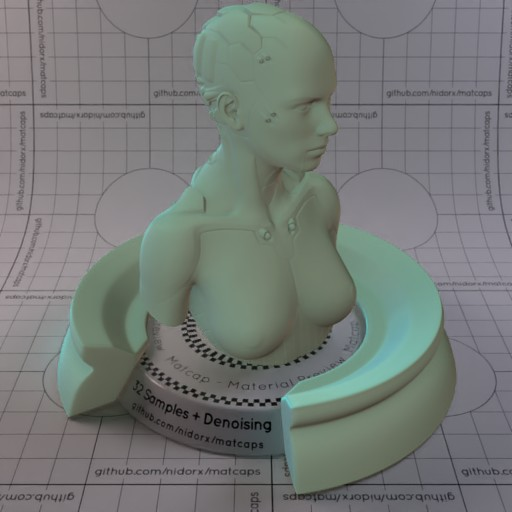

[[1024px](https://github.com/nidorx/matcaps/raw/master/1024/728473_728473_534C40_7BCEC8.png)]
[[512px](https://github.com/nidorx/matcaps/raw/master/512/728473_728473_534C40_7BCEC8-512px.png)]
[[256px](https://github.com/nidorx/matcaps/raw/master/256/728473_728473_534C40_7BCEC8-256px.png)]
[[128px](https://github.com/nidorx/matcaps/raw/master/128/728473_728473_534C40_7BCEC8-128px.png)]
[[64px](https://github.com/nidorx/matcaps/raw/master/64/728473_728473_534C40_7BCEC8-64px.png)]
[[ZBrush Material (ZMT)](https://github.com/nidorx/matcaps/raw/master/zmt/728473_728473_534C40_7BCEC8.zmt)]

---
### 745359_745359_BFAEA8_9B8384
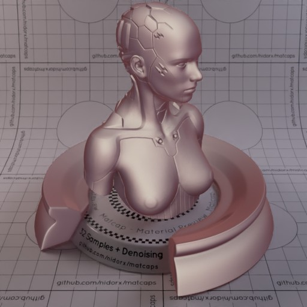

[[1024px](https://github.com/nidorx/matcaps/raw/master/1024/745359_745359_BFAEA8_9B8384.png)]
[[512px](https://github.com/nidorx/matcaps/raw/master/512/745359_745359_BFAEA8_9B8384-512px.png)]
[[256px](https://github.com/nidorx/matcaps/raw/master/256/745359_745359_BFAEA8_9B8384-256px.png)]
[[128px](https://github.com/nidorx/matcaps/raw/master/128/745359_745359_BFAEA8_9B8384-128px.png)]
[[64px](https://github.com/nidorx/matcaps/raw/master/64/745359_745359_BFAEA8_9B8384-64px.png)]
[[ZBrush Material (ZMT)](https://github.com/nidorx/matcaps/raw/master/zmt/745359_745359_BFAEA8_9B8384.zmt)]

---
### 747A6F_747A6F_292E2A_ACA79F
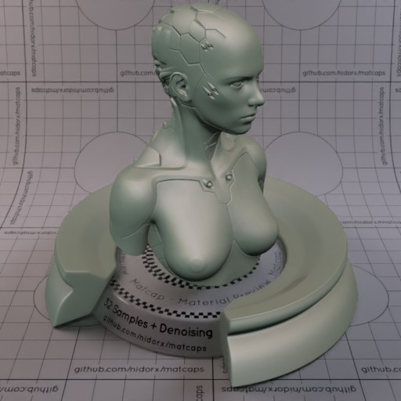

[[1024px](https://github.com/nidorx/matcaps/raw/master/1024/747A6F_747A6F_292E2A_ACA79F.png)]
[[512px](https://github.com/nidorx/matcaps/raw/master/512/747A6F_747A6F_292E2A_ACA79F-512px.png)]
[[256px](https://github.com/nidorx/matcaps/raw/master/256/747A6F_747A6F_292E2A_ACA79F-256px.png)]
[[128px](https://github.com/nidorx/matcaps/raw/master/128/747A6F_747A6F_292E2A_ACA79F-128px.png)]
[[64px](https://github.com/nidorx/matcaps/raw/master/64/747A6F_747A6F_292E2A_ACA79F-64px.png)]
[[ZBrush Material (ZMT)](https://github.com/nidorx/matcaps/raw/master/zmt/747A6F_747A6F_292E2A_ACA79F.zmt)]

---
### 75723E_75723E_C0C3A0_2A1E0E
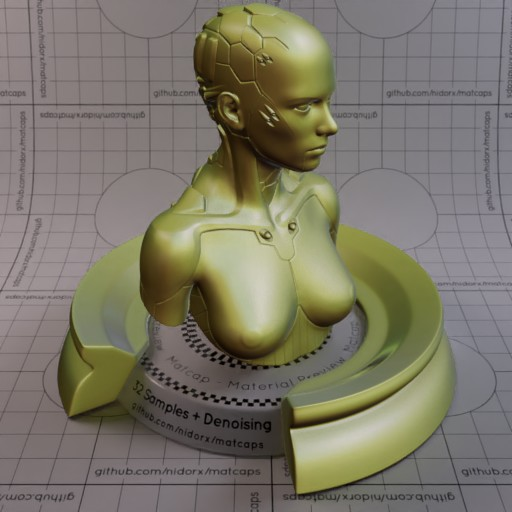

[[1024px](https://github.com/nidorx/matcaps/raw/master/1024/75723E_75723E_C0C3A0_2A1E0E.png)]
[[512px](https://github.com/nidorx/matcaps/raw/master/512/75723E_75723E_C0C3A0_2A1E0E-512px.png)]
[[256px](https://github.com/nidorx/matcaps/raw/master/256/75723E_75723E_C0C3A0_2A1E0E-256px.png)]
[[128px](https://github.com/nidorx/matcaps/raw/master/128/75723E_75723E_C0C3A0_2A1E0E-128px.png)]
[[64px](https://github.com/nidorx/matcaps/raw/master/64/75723E_75723E_C0C3A0_2A1E0E-64px.png)]
[[ZBrush Material (ZMT)](https://github.com/nidorx/matcaps/raw/master/zmt/75723E_75723E_C0C3A0_2A1E0E.zmt)]

---
### 764739_764739_D0917B_2A1611
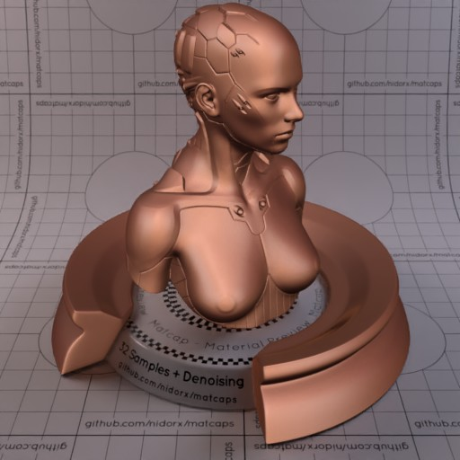

[[1024px](https://github.com/nidorx/matcaps/raw/master/1024/764739_764739_D0917B_2A1611.png)]
[[512px](https://github.com/nidorx/matcaps/raw/master/512/764739_764739_D0917B_2A1611-512px.png)]
[[256px](https://github.com/nidorx/matcaps/raw/master/256/764739_764739_D0917B_2A1611-256px.png)]
[[128px](https://github.com/nidorx/matcaps/raw/master/128/764739_764739_D0917B_2A1611-128px.png)]
[[64px](https://github.com/nidorx/matcaps/raw/master/64/764739_764739_D0917B_2A1611-64px.png)]
[[ZBrush Material (ZMT)](https://github.com/nidorx/matcaps/raw/master/zmt/764739_764739_D0917B_2A1611.zmt)]

---
### 765938_765938_1F1009_A59C7C
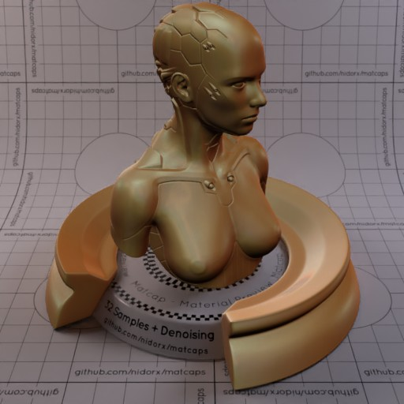

[[1024px](https://github.com/nidorx/matcaps/raw/master/1024/765938_765938_1F1009_A59C7C.png)]
[[512px](https://github.com/nidorx/matcaps/raw/master/512/765938_765938_1F1009_A59C7C-512px.png)]
[[256px](https://github.com/nidorx/matcaps/raw/master/256/765938_765938_1F1009_A59C7C-256px.png)]
[[128px](https://github.com/nidorx/matcaps/raw/master/128/765938_765938_1F1009_A59C7C-128px.png)]
[[64px](https://github.com/nidorx/matcaps/raw/master/64/765938_765938_1F1009_A59C7C-64px.png)]
[[ZBrush Material (ZMT)](https://github.com/nidorx/matcaps/raw/master/zmt/765938_765938_1F1009_A59C7C.zmt)]

---
### 773012_773012_AE5124_4D1908
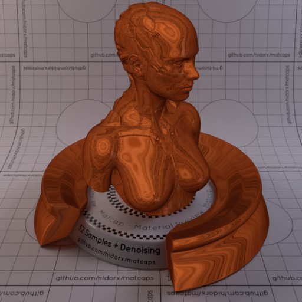

[[1024px](https://github.com/nidorx/matcaps/raw/master/1024/773012_773012_AE5124_4D1908.png)]
[[512px](https://github.com/nidorx/matcaps/raw/master/512/773012_773012_AE5124_4D1908-512px.png)]
[[256px](https://github.com/nidorx/matcaps/raw/master/256/773012_773012_AE5124_4D1908-256px.png)]
[[128px](https://github.com/nidorx/matcaps/raw/master/128/773012_773012_AE5124_4D1908-128px.png)]
[[64px](https://github.com/nidorx/matcaps/raw/master/64/773012_773012_AE5124_4D1908-64px.png)]
[[ZBrush Material (ZMT)](https://github.com/nidorx/matcaps/raw/master/zmt/773012_773012_AE5124_4D1908.zmt)]

---
### 7877EE_7877EE_D87FC5_75D9C7-1
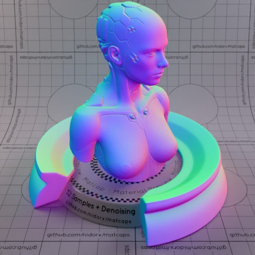
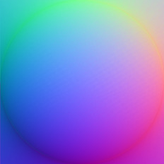

[[1024px](https://github.com/nidorx/matcaps/raw/master/1024/7877EE_7877EE_D87FC5_75D9C7-1.png)]
[[512px](https://github.com/nidorx/matcaps/raw/master/512/7877EE_7877EE_D87FC5_75D9C7-1-512px.png)]
[[256px](https://github.com/nidorx/matcaps/raw/master/256/7877EE_7877EE_D87FC5_75D9C7-1-256px.png)]
[[128px](https://github.com/nidorx/matcaps/raw/master/128/7877EE_7877EE_D87FC5_75D9C7-1-128px.png)]
[[64px](https://github.com/nidorx/matcaps/raw/master/64/7877EE_7877EE_D87FC5_75D9C7-1-64px.png)]
[~~ZBrush Material (ZMT)~~]

---
### 7877EE_7877EE_D87FC5_75D9C7

[[1024px](https://github.com/nidorx/matcaps/raw/master/1024/7877EE_7877EE_D87FC5_75D9C7.png)]
[[512px](https://github.com/nidorx/matcaps/raw/master/512/7877EE_7877EE_D87FC5_75D9C7-512px.png)]
[[256px](https://github.com/nidorx/matcaps/raw/master/256/7877EE_7877EE_D87FC5_75D9C7-256px.png)]
[[128px](https://github.com/nidorx/matcaps/raw/master/128/7877EE_7877EE_D87FC5_75D9C7-128px.png)]
[[64px](https://github.com/nidorx/matcaps/raw/master/64/7877EE_7877EE_D87FC5_75D9C7-64px.png)]
[[ZBrush Material (ZMT)](https://github.com/nidorx/matcaps/raw/master/zmt/7877EE_7877EE_D87FC5_75D9C7.zmt)]

---
### 796F52_796F52_36413A_C9B48C

[[1024px](https://github.com/nidorx/matcaps/raw/master/1024/796F52_796F52_36413A_C9B48C.png)]
[[512px](https://github.com/nidorx/matcaps/raw/master/512/796F52_796F52_36413A_C9B48C-512px.png)]
[[256px](https://github.com/nidorx/matcaps/raw/master/256/796F52_796F52_36413A_C9B48C-256px.png)]
[[128px](https://github.com/nidorx/matcaps/raw/master/128/796F52_796F52_36413A_C9B48C-128px.png)]
[[64px](https://github.com/nidorx/matcaps/raw/master/64/796F52_796F52_36413A_C9B48C-64px.png)]
[[ZBrush Material (ZMT)](https://github.com/nidorx/matcaps/raw/master/zmt/796F52_796F52_36413A_C9B48C.zmt)]

---
### 7A7A7A_7A7A7A_D0D0D0_BCBCBC
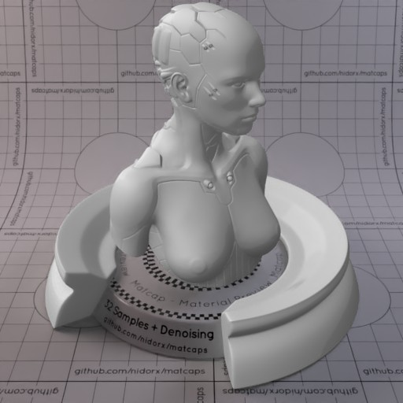

[[1024px](https://github.com/nidorx/matcaps/raw/master/1024/7A7A7A_7A7A7A_D0D0D0_BCBCBC.png)]
[[512px](https://github.com/nidorx/matcaps/raw/master/512/7A7A7A_7A7A7A_D0D0D0_BCBCBC-512px.png)]
[[256px](https://github.com/nidorx/matcaps/raw/master/256/7A7A7A_7A7A7A_D0D0D0_BCBCBC-256px.png)]
[[128px](https://github.com/nidorx/matcaps/raw/master/128/7A7A7A_7A7A7A_D0D0D0_BCBCBC-128px.png)]
[[64px](https://github.com/nidorx/matcaps/raw/master/64/7A7A7A_7A7A7A_D0D0D0_BCBCBC-64px.png)]
[~~ZBrush Material (ZMT)~~]

---
### 7D6651_7D6651_F8E3BF_CEA987

[[1024px](https://github.com/nidorx/matcaps/raw/master/1024/7D6651_7D6651_F8E3BF_CEA987.png)]
[[512px](https://github.com/nidorx/matcaps/raw/master/512/7D6651_7D6651_F8E3BF_CEA987-512px.png)]
[[256px](https://github.com/nidorx/matcaps/raw/master/256/7D6651_7D6651_F8E3BF_CEA987-256px.png)]
[[128px](https://github.com/nidorx/matcaps/raw/master/128/7D6651_7D6651_F8E3BF_CEA987-128px.png)]
[[64px](https://github.com/nidorx/matcaps/raw/master/64/7D6651_7D6651_F8E3BF_CEA987-64px.png)]
[[ZBrush Material (ZMT)](https://github.com/nidorx/matcaps/raw/master/zmt/7D6651_7D6651_F8E3BF_CEA987.zmt)]

---
### 7DA1BA_7DA1BA_A4CCE8_5D7A8B

[[1024px](https://github.com/nidorx/matcaps/raw/master/1024/7DA1BA_7DA1BA_A4CCE8_5D7A8B.png)]
[[512px](https://github.com/nidorx/matcaps/raw/master/512/7DA1BA_7DA1BA_A4CCE8_5D7A8B-512px.png)]
[[256px](https://github.com/nidorx/matcaps/raw/master/256/7DA1BA_7DA1BA_A4CCE8_5D7A8B-256px.png)]
[[128px](https://github.com/nidorx/matcaps/raw/master/128/7DA1BA_7DA1BA_A4CCE8_5D7A8B-128px.png)]
[[64px](https://github.com/nidorx/matcaps/raw/master/64/7DA1BA_7DA1BA_A4CCE8_5D7A8B-64px.png)]
[[ZBrush Material (ZMT)](https://github.com/nidorx/matcaps/raw/master/zmt/7DA1BA_7DA1BA_A4CCE8_5D7A8B.zmt)]

---
### 7E5344_7E5344_22120E_CCAB9C
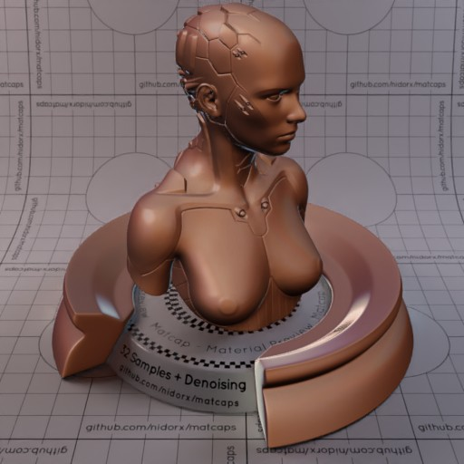

[[1024px](https://github.com/nidorx/matcaps/raw/master/1024/7E5344_7E5344_22120E_CCAB9C.png)]
[[512px](https://github.com/nidorx/matcaps/raw/master/512/7E5344_7E5344_22120E_CCAB9C-512px.png)]
[[256px](https://github.com/nidorx/matcaps/raw/master/256/7E5344_7E5344_22120E_CCAB9C-256px.png)]
[[128px](https://github.com/nidorx/matcaps/raw/master/128/7E5344_7E5344_22120E_CCAB9C-128px.png)]
[[64px](https://github.com/nidorx/matcaps/raw/master/64/7E5344_7E5344_22120E_CCAB9C-64px.png)]
[[ZBrush Material (ZMT)](https://github.com/nidorx/matcaps/raw/master/zmt/7E5344_7E5344_22120E_CCAB9C.zmt)]

---
### 7F5134_7F5134_22120A_452110

[[1024px](https://github.com/nidorx/matcaps/raw/master/1024/7F5134_7F5134_22120A_452110.png)]
[[512px](https://github.com/nidorx/matcaps/raw/master/512/7F5134_7F5134_22120A_452110-512px.png)]
[[256px](https://github.com/nidorx/matcaps/raw/master/256/7F5134_7F5134_22120A_452110-256px.png)]
[[128px](https://github.com/nidorx/matcaps/raw/master/128/7F5134_7F5134_22120A_452110-128px.png)]
[[64px](https://github.com/nidorx/matcaps/raw/master/64/7F5134_7F5134_22120A_452110-64px.png)]
[[ZBrush Material (ZMT)](https://github.com/nidorx/matcaps/raw/master/zmt/7F5134_7F5134_22120A_452110.zmt)]

---
### 803537_803537_310F10_C35A5D-1
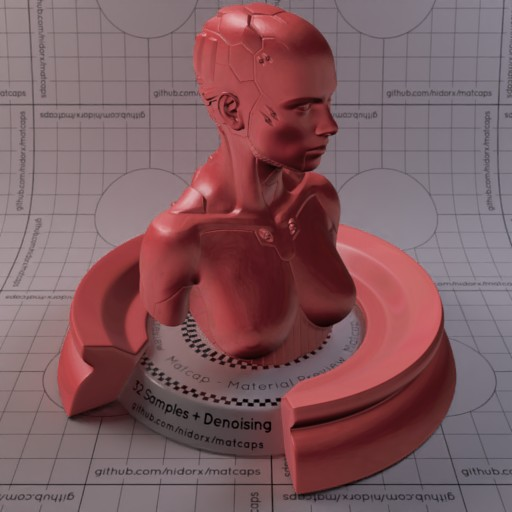
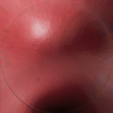

[[1024px](https://github.com/nidorx/matcaps/raw/master/1024/803537_803537_310F10_C35A5D-1.png)]
[[512px](https://github.com/nidorx/matcaps/raw/master/512/803537_803537_310F10_C35A5D-1-512px.png)]
[[256px](https://github.com/nidorx/matcaps/raw/master/256/803537_803537_310F10_C35A5D-1-256px.png)]
[[128px](https://github.com/nidorx/matcaps/raw/master/128/803537_803537_310F10_C35A5D-1-128px.png)]
[[64px](https://github.com/nidorx/matcaps/raw/master/64/803537_803537_310F10_C35A5D-1-64px.png)]
[~~ZBrush Material (ZMT)~~]

---
### 803537_803537_310F10_C35A5D

[[1024px](https://github.com/nidorx/matcaps/raw/master/1024/803537_803537_310F10_C35A5D.png)]
[[512px](https://github.com/nidorx/matcaps/raw/master/512/803537_803537_310F10_C35A5D-512px.png)]
[[256px](https://github.com/nidorx/matcaps/raw/master/256/803537_803537_310F10_C35A5D-256px.png)]
[[128px](https://github.com/nidorx/matcaps/raw/master/128/803537_803537_310F10_C35A5D-128px.png)]
[[64px](https://github.com/nidorx/matcaps/raw/master/64/803537_803537_310F10_C35A5D-64px.png)]
[[ZBrush Material (ZMT)](https://github.com/nidorx/matcaps/raw/master/zmt/803537_803537_310F10_C35A5D.zmt)]

---
### 80A6B4_80A6B4_D5E9EF_B2D0D9
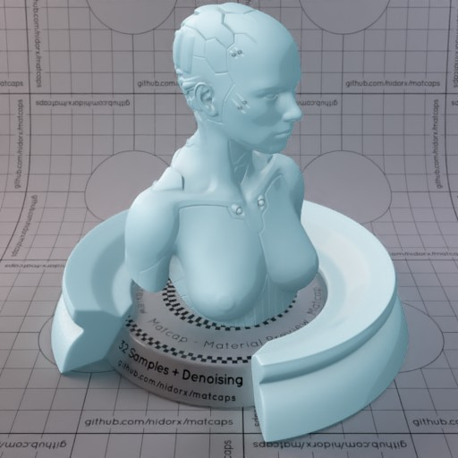

[[1024px](https://github.com/nidorx/matcaps/raw/master/1024/80A6B4_80A6B4_D5E9EF_B2D0D9.png)]
[[512px](https://github.com/nidorx/matcaps/raw/master/512/80A6B4_80A6B4_D5E9EF_B2D0D9-512px.png)]
[[256px](https://github.com/nidorx/matcaps/raw/master/256/80A6B4_80A6B4_D5E9EF_B2D0D9-256px.png)]
[[128px](https://github.com/nidorx/matcaps/raw/master/128/80A6B4_80A6B4_D5E9EF_B2D0D9-128px.png)]
[[64px](https://github.com/nidorx/matcaps/raw/master/64/80A6B4_80A6B4_D5E9EF_B2D0D9-64px.png)]
[~~ZBrush Material (ZMT)~~]

---
### 80CA23_80CA23_B7EE37_D5FA4C
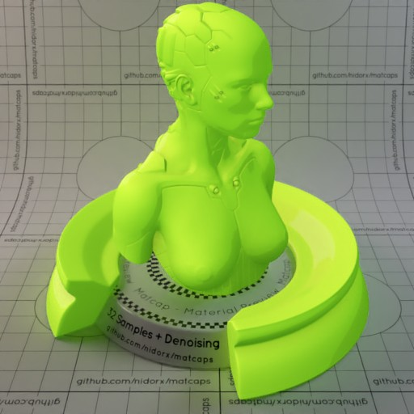

[[1024px](https://github.com/nidorx/matcaps/raw/master/1024/80CA23_80CA23_B7EE37_D5FA4C.png)]
[[512px](https://github.com/nidorx/matcaps/raw/master/512/80CA23_80CA23_B7EE37_D5FA4C-512px.png)]
[[256px](https://github.com/nidorx/matcaps/raw/master/256/80CA23_80CA23_B7EE37_D5FA4C-256px.png)]
[[128px](https://github.com/nidorx/matcaps/raw/master/128/80CA23_80CA23_B7EE37_D5FA4C-128px.png)]
[[64px](https://github.com/nidorx/matcaps/raw/master/64/80CA23_80CA23_B7EE37_D5FA4C-64px.png)]
[~~ZBrush Material (ZMT)~~]

---
### 815C41_815C41_F6C99A_D39F77
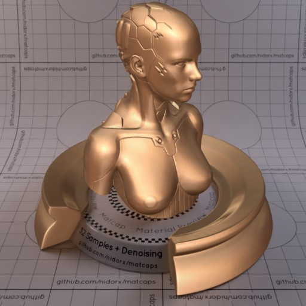

[[1024px](https://github.com/nidorx/matcaps/raw/master/1024/815C41_815C41_F6C99A_D39F77.png)]
[[512px](https://github.com/nidorx/matcaps/raw/master/512/815C41_815C41_F6C99A_D39F77-512px.png)]
[[256px](https://github.com/nidorx/matcaps/raw/master/256/815C41_815C41_F6C99A_D39F77-256px.png)]
[[128px](https://github.com/nidorx/matcaps/raw/master/128/815C41_815C41_F6C99A_D39F77-128px.png)]
[[64px](https://github.com/nidorx/matcaps/raw/master/64/815C41_815C41_F6C99A_D39F77-64px.png)]
[[ZBrush Material (ZMT)](https://github.com/nidorx/matcaps/raw/master/zmt/815C41_815C41_F6C99A_D39F77.zmt)]

---
### 8194AB_8194AB_D6DFEB_C0CEDE-1

[[1024px](https://github.com/nidorx/matcaps/raw/master/1024/8194AB_8194AB_D6DFEB_C0CEDE-1.png)]
[[512px](https://github.com/nidorx/matcaps/raw/master/512/8194AB_8194AB_D6DFEB_C0CEDE-1-512px.png)]
[[256px](https://github.com/nidorx/matcaps/raw/master/256/8194AB_8194AB_D6DFEB_C0CEDE-1-256px.png)]
[[128px](https://github.com/nidorx/matcaps/raw/master/128/8194AB_8194AB_D6DFEB_C0CEDE-1-128px.png)]
[[64px](https://github.com/nidorx/matcaps/raw/master/64/8194AB_8194AB_D6DFEB_C0CEDE-1-64px.png)]
[~~ZBrush Material (ZMT)~~]

---
### 8194AB_8194AB_D6DFEB_C0CEDE
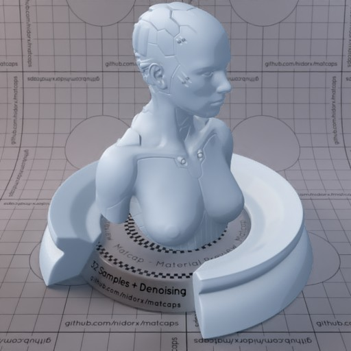

[[1024px](https://github.com/nidorx/matcaps/raw/master/1024/8194AB_8194AB_D6DFEB_C0CEDE.png)]
[[512px](https://github.com/nidorx/matcaps/raw/master/512/8194AB_8194AB_D6DFEB_C0CEDE-512px.png)]
[[256px](https://github.com/nidorx/matcaps/raw/master/256/8194AB_8194AB_D6DFEB_C0CEDE-256px.png)]
[[128px](https://github.com/nidorx/matcaps/raw/master/128/8194AB_8194AB_D6DFEB_C0CEDE-128px.png)]
[[64px](https://github.com/nidorx/matcaps/raw/master/64/8194AB_8194AB_D6DFEB_C0CEDE-64px.png)]
[~~ZBrush Material (ZMT)~~]

---
### 81ADB3_81ADB3_D6ECEE_BFDEE1
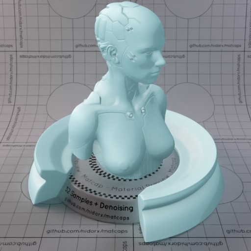

[[1024px](https://github.com/nidorx/matcaps/raw/master/1024/81ADB3_81ADB3_D6ECEE_BFDEE1.png)]
[[512px](https://github.com/nidorx/matcaps/raw/master/512/81ADB3_81ADB3_D6ECEE_BFDEE1-512px.png)]
[[256px](https://github.com/nidorx/matcaps/raw/master/256/81ADB3_81ADB3_D6ECEE_BFDEE1-256px.png)]
[[128px](https://github.com/nidorx/matcaps/raw/master/128/81ADB3_81ADB3_D6ECEE_BFDEE1-128px.png)]
[[64px](https://github.com/nidorx/matcaps/raw/master/64/81ADB3_81ADB3_D6ECEE_BFDEE1-64px.png)]
[~~ZBrush Material (ZMT)~~]

---
### 81BABA_81BABA_D5F3F3_BBE4E4
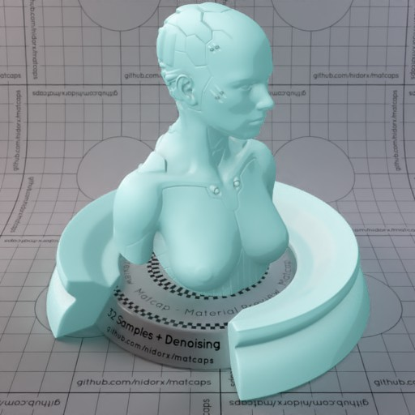

[[1024px](https://github.com/nidorx/matcaps/raw/master/1024/81BABA_81BABA_D5F3F3_BBE4E4.png)]
[[512px](https://github.com/nidorx/matcaps/raw/master/512/81BABA_81BABA_D5F3F3_BBE4E4-512px.png)]
[[256px](https://github.com/nidorx/matcaps/raw/master/256/81BABA_81BABA_D5F3F3_BBE4E4-256px.png)]
[[128px](https://github.com/nidorx/matcaps/raw/master/128/81BABA_81BABA_D5F3F3_BBE4E4-128px.png)]
[[64px](https://github.com/nidorx/matcaps/raw/master/64/81BABA_81BABA_D5F3F3_BBE4E4-64px.png)]
[~~ZBrush Material (ZMT)~~]

---
### 826A59_826A59_E0C9B9_CBAD99

[[1024px](https://github.com/nidorx/matcaps/raw/master/1024/826A59_826A59_E0C9B9_CBAD99.png)]
[[512px](https://github.com/nidorx/matcaps/raw/master/512/826A59_826A59_E0C9B9_CBAD99-512px.png)]
[[256px](https://github.com/nidorx/matcaps/raw/master/256/826A59_826A59_E0C9B9_CBAD99-256px.png)]
[[128px](https://github.com/nidorx/matcaps/raw/master/128/826A59_826A59_E0C9B9_CBAD99-128px.png)]
[[64px](https://github.com/nidorx/matcaps/raw/master/64/826A59_826A59_E0C9B9_CBAD99-64px.png)]
[[ZBrush Material (ZMT)](https://github.com/nidorx/matcaps/raw/master/zmt/826A59_826A59_E0C9B9_CBAD99.zmt)]

---
### 837667_837667_DCD4C8_C5BAAC

[[1024px](https://github.com/nidorx/matcaps/raw/master/1024/837667_837667_DCD4C8_C5BAAC.png)]
[[512px](https://github.com/nidorx/matcaps/raw/master/512/837667_837667_DCD4C8_C5BAAC-512px.png)]
[[256px](https://github.com/nidorx/matcaps/raw/master/256/837667_837667_DCD4C8_C5BAAC-256px.png)]
[[128px](https://github.com/nidorx/matcaps/raw/master/128/837667_837667_DCD4C8_C5BAAC-128px.png)]
[[64px](https://github.com/nidorx/matcaps/raw/master/64/837667_837667_DCD4C8_C5BAAC-64px.png)]
[[ZBrush Material (ZMT)](https://github.com/nidorx/matcaps/raw/master/zmt/837667_837667_DCD4C8_C5BAAC.zmt)]

---
### 855D08_855D08_DAC31B_BF9B0C
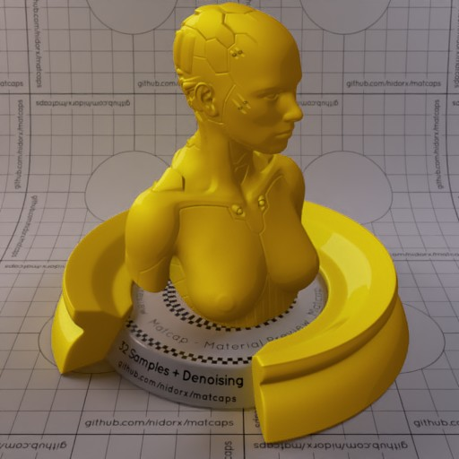

[[1024px](https://github.com/nidorx/matcaps/raw/master/1024/855D08_855D08_DAC31B_BF9B0C.png)]
[[512px](https://github.com/nidorx/matcaps/raw/master/512/855D08_855D08_DAC31B_BF9B0C-512px.png)]
[[256px](https://github.com/nidorx/matcaps/raw/master/256/855D08_855D08_DAC31B_BF9B0C-256px.png)]
[[128px](https://github.com/nidorx/matcaps/raw/master/128/855D08_855D08_DAC31B_BF9B0C-128px.png)]
[[64px](https://github.com/nidorx/matcaps/raw/master/64/855D08_855D08_DAC31B_BF9B0C-64px.png)]
[~~ZBrush Material (ZMT)~~]

---
### 85694C_85694C_D1A67A_3C2F22

[[1024px](https://github.com/nidorx/matcaps/raw/master/1024/85694C_85694C_D1A67A_3C2F22.png)]
[[512px](https://github.com/nidorx/matcaps/raw/master/512/85694C_85694C_D1A67A_3C2F22-512px.png)]
[[256px](https://github.com/nidorx/matcaps/raw/master/256/85694C_85694C_D1A67A_3C2F22-256px.png)]
[[128px](https://github.com/nidorx/matcaps/raw/master/128/85694C_85694C_D1A67A_3C2F22-128px.png)]
[[64px](https://github.com/nidorx/matcaps/raw/master/64/85694C_85694C_D1A67A_3C2F22-64px.png)]
[[ZBrush Material (ZMT)](https://github.com/nidorx/matcaps/raw/master/zmt/85694C_85694C_D1A67A_3C2F22.zmt)]

---
### 857B61_857B61_ACE5D4_593D28

[[1024px](https://github.com/nidorx/matcaps/raw/master/1024/857B61_857B61_ACE5D4_593D28.png)]
[[512px](https://github.com/nidorx/matcaps/raw/master/512/857B61_857B61_ACE5D4_593D28-512px.png)]
[[256px](https://github.com/nidorx/matcaps/raw/master/256/857B61_857B61_ACE5D4_593D28-256px.png)]
[[128px](https://github.com/nidorx/matcaps/raw/master/128/857B61_857B61_ACE5D4_593D28-128px.png)]
[[64px](https://github.com/nidorx/matcaps/raw/master/64/857B61_857B61_ACE5D4_593D28-64px.png)]
[[ZBrush Material (ZMT)](https://github.com/nidorx/matcaps/raw/master/zmt/857B61_857B61_ACE5D4_593D28.zmt)]

---
### 85B9D3_85B9D3_C9EAF9_417277

[[1024px](https://github.com/nidorx/matcaps/raw/master/1024/85B9D3_85B9D3_C9EAF9_417277.png)]
[[512px](https://github.com/nidorx/matcaps/raw/master/512/85B9D3_85B9D3_C9EAF9_417277-512px.png)]
[[256px](https://github.com/nidorx/matcaps/raw/master/256/85B9D3_85B9D3_C9EAF9_417277-256px.png)]
[[128px](https://github.com/nidorx/matcaps/raw/master/128/85B9D3_85B9D3_C9EAF9_417277-128px.png)]
[[64px](https://github.com/nidorx/matcaps/raw/master/64/85B9D3_85B9D3_C9EAF9_417277-64px.png)]
[[ZBrush Material (ZMT)](https://github.com/nidorx/matcaps/raw/master/zmt/85B9D3_85B9D3_C9EAF9_417277.zmt)]

---
### 887153_887153_E5C188_433729

[[1024px](https://github.com/nidorx/matcaps/raw/master/1024/887153_887153_E5C188_433729.png)]
[[512px](https://github.com/nidorx/matcaps/raw/master/512/887153_887153_E5C188_433729-512px.png)]
[[256px](https://github.com/nidorx/matcaps/raw/master/256/887153_887153_E5C188_433729-256px.png)]
[[128px](https://github.com/nidorx/matcaps/raw/master/128/887153_887153_E5C188_433729-128px.png)]
[[64px](https://github.com/nidorx/matcaps/raw/master/64/887153_887153_E5C188_433729-64px.png)]
[[ZBrush Material (ZMT)](https://github.com/nidorx/matcaps/raw/master/zmt/887153_887153_E5C188_433729.zmt)]

---
### 888D8F_888D8F_515454_646A6C

[[1024px](https://github.com/nidorx/matcaps/raw/master/1024/888D8F_888D8F_515454_646A6C.png)]
[[512px](https://github.com/nidorx/matcaps/raw/master/512/888D8F_888D8F_515454_646A6C-512px.png)]
[[256px](https://github.com/nidorx/matcaps/raw/master/256/888D8F_888D8F_515454_646A6C-256px.png)]
[[128px](https://github.com/nidorx/matcaps/raw/master/128/888D8F_888D8F_515454_646A6C-128px.png)]
[[64px](https://github.com/nidorx/matcaps/raw/master/64/888D8F_888D8F_515454_646A6C-64px.png)]
[[ZBrush Material (ZMT)](https://github.com/nidorx/matcaps/raw/master/zmt/888D8F_888D8F_515454_646A6C.zmt)]

---
### 89204B_89204B_17080D_DA4377

[[1024px](https://github.com/nidorx/matcaps/raw/master/1024/89204B_89204B_17080D_DA4377.png)]
[[512px](https://github.com/nidorx/matcaps/raw/master/512/89204B_89204B_17080D_DA4377-512px.png)]
[[256px](https://github.com/nidorx/matcaps/raw/master/256/89204B_89204B_17080D_DA4377-256px.png)]
[[128px](https://github.com/nidorx/matcaps/raw/master/128/89204B_89204B_17080D_DA4377-128px.png)]
[[64px](https://github.com/nidorx/matcaps/raw/master/64/89204B_89204B_17080D_DA4377-64px.png)]
[[ZBrush Material (ZMT)](https://github.com/nidorx/matcaps/raw/master/zmt/89204B_89204B_17080D_DA4377.zmt)]

---
### 8955D0_8955D0_744CC4_EA4AEF

[[1024px](https://github.com/nidorx/matcaps/raw/master/1024/8955D0_8955D0_744CC4_EA4AEF.png)]
[[512px](https://github.com/nidorx/matcaps/raw/master/512/8955D0_8955D0_744CC4_EA4AEF-512px.png)]
[[256px](https://github.com/nidorx/matcaps/raw/master/256/8955D0_8955D0_744CC4_EA4AEF-256px.png)]
[[128px](https://github.com/nidorx/matcaps/raw/master/128/8955D0_8955D0_744CC4_EA4AEF-128px.png)]
[[64px](https://github.com/nidorx/matcaps/raw/master/64/8955D0_8955D0_744CC4_EA4AEF-64px.png)]
[[ZBrush Material (ZMT)](https://github.com/nidorx/matcaps/raw/master/zmt/8955D0_8955D0_744CC4_EA4AEF.zmt)]

---
### 8A3B3D_8A3B3D_DA5F62_461F20

[[1024px](https://github.com/nidorx/matcaps/raw/master/1024/8A3B3D_8A3B3D_DA5F62_461F20.png)]
[[512px](https://github.com/nidorx/matcaps/raw/master/512/8A3B3D_8A3B3D_DA5F62_461F20-512px.png)]
[[256px](https://github.com/nidorx/matcaps/raw/master/256/8A3B3D_8A3B3D_DA5F62_461F20-256px.png)]
[[128px](https://github.com/nidorx/matcaps/raw/master/128/8A3B3D_8A3B3D_DA5F62_461F20-128px.png)]
[[64px](https://github.com/nidorx/matcaps/raw/master/64/8A3B3D_8A3B3D_DA5F62_461F20-64px.png)]
[[ZBrush Material (ZMT)](https://github.com/nidorx/matcaps/raw/master/zmt/8A3B3D_8A3B3D_DA5F62_461F20.zmt)]

---
### 8A3DA1_8A3DA1_D77CE4_C263D4
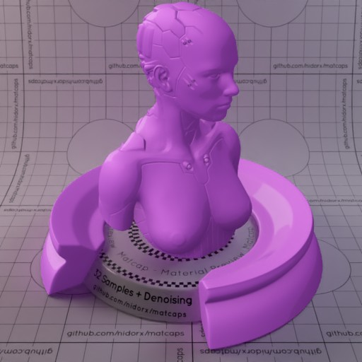

[[1024px](https://github.com/nidorx/matcaps/raw/master/1024/8A3DA1_8A3DA1_D77CE4_C263D4.png)]
[[512px](https://github.com/nidorx/matcaps/raw/master/512/8A3DA1_8A3DA1_D77CE4_C263D4-512px.png)]
[[256px](https://github.com/nidorx/matcaps/raw/master/256/8A3DA1_8A3DA1_D77CE4_C263D4-256px.png)]
[[128px](https://github.com/nidorx/matcaps/raw/master/128/8A3DA1_8A3DA1_D77CE4_C263D4-128px.png)]
[[64px](https://github.com/nidorx/matcaps/raw/master/64/8A3DA1_8A3DA1_D77CE4_C263D4-64px.png)]
[~~ZBrush Material (ZMT)~~]

---
### 8A5B34_8A5B34_F3BD7C_DA9758

[[1024px](https://github.com/nidorx/matcaps/raw/master/1024/8A5B34_8A5B34_F3BD7C_DA9758.png)]
[[512px](https://github.com/nidorx/matcaps/raw/master/512/8A5B34_8A5B34_F3BD7C_DA9758-512px.png)]
[[256px](https://github.com/nidorx/matcaps/raw/master/256/8A5B34_8A5B34_F3BD7C_DA9758-256px.png)]
[[128px](https://github.com/nidorx/matcaps/raw/master/128/8A5B34_8A5B34_F3BD7C_DA9758-128px.png)]
[[64px](https://github.com/nidorx/matcaps/raw/master/64/8A5B34_8A5B34_F3BD7C_DA9758-64px.png)]
[[ZBrush Material (ZMT)](https://github.com/nidorx/matcaps/raw/master/zmt/8A5B34_8A5B34_F3BD7C_DA9758.zmt)]

---
### 8B892C_8B892C_D4E856_475E2D

[[1024px](https://github.com/nidorx/matcaps/raw/master/1024/8B892C_8B892C_D4E856_475E2D.png)]
[[512px](https://github.com/nidorx/matcaps/raw/master/512/8B892C_8B892C_D4E856_475E2D-512px.png)]
[[256px](https://github.com/nidorx/matcaps/raw/master/256/8B892C_8B892C_D4E856_475E2D-256px.png)]
[[128px](https://github.com/nidorx/matcaps/raw/master/128/8B892C_8B892C_D4E856_475E2D-128px.png)]
[[64px](https://github.com/nidorx/matcaps/raw/master/64/8B892C_8B892C_D4E856_475E2D-64px.png)]
[[ZBrush Material (ZMT)](https://github.com/nidorx/matcaps/raw/master/zmt/8B892C_8B892C_D4E856_475E2D.zmt)]

---
### 8D8D8D_8D8D8D_DDDDDD_CCCCCC
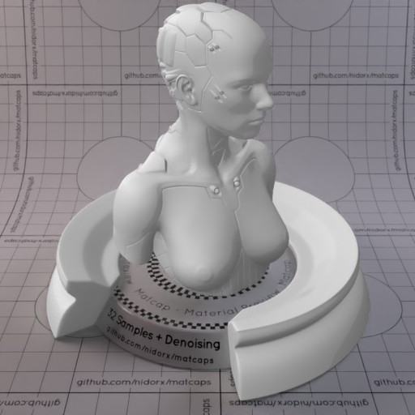

[[1024px](https://github.com/nidorx/matcaps/raw/master/1024/8D8D8D_8D8D8D_DDDDDD_CCCCCC.png)]
[[512px](https://github.com/nidorx/matcaps/raw/master/512/8D8D8D_8D8D8D_DDDDDD_CCCCCC-512px.png)]
[[256px](https://github.com/nidorx/matcaps/raw/master/256/8D8D8D_8D8D8D_DDDDDD_CCCCCC-256px.png)]
[[128px](https://github.com/nidorx/matcaps/raw/master/128/8D8D8D_8D8D8D_DDDDDD_CCCCCC-128px.png)]
[[64px](https://github.com/nidorx/matcaps/raw/master/64/8D8D8D_8D8D8D_DDDDDD_CCCCCC-64px.png)]
[~~ZBrush Material (ZMT)~~]

---
### 8E6767_8E6767_D9C4C4_C8ACAC
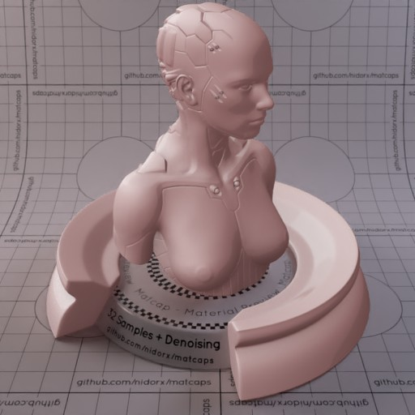

[[1024px](https://github.com/nidorx/matcaps/raw/master/1024/8E6767_8E6767_D9C4C4_C8ACAC.png)]
[[512px](https://github.com/nidorx/matcaps/raw/master/512/8E6767_8E6767_D9C4C4_C8ACAC-512px.png)]
[[256px](https://github.com/nidorx/matcaps/raw/master/256/8E6767_8E6767_D9C4C4_C8ACAC-256px.png)]
[[128px](https://github.com/nidorx/matcaps/raw/master/128/8E6767_8E6767_D9C4C4_C8ACAC-128px.png)]
[[64px](https://github.com/nidorx/matcaps/raw/master/64/8E6767_8E6767_D9C4C4_C8ACAC-64px.png)]
[~~ZBrush Material (ZMT)~~]

---
### 8E7C67_8E7C67_E2C6A5_3B332A

[[1024px](https://github.com/nidorx/matcaps/raw/master/1024/8E7C67_8E7C67_E2C6A5_3B332A.png)]
[[512px](https://github.com/nidorx/matcaps/raw/master/512/8E7C67_8E7C67_E2C6A5_3B332A-512px.png)]
[[256px](https://github.com/nidorx/matcaps/raw/master/256/8E7C67_8E7C67_E2C6A5_3B332A-256px.png)]
[[128px](https://github.com/nidorx/matcaps/raw/master/128/8E7C67_8E7C67_E2C6A5_3B332A-128px.png)]
[[64px](https://github.com/nidorx/matcaps/raw/master/64/8E7C67_8E7C67_E2C6A5_3B332A-64px.png)]
[[ZBrush Material (ZMT)](https://github.com/nidorx/matcaps/raw/master/zmt/8E7C67_8E7C67_E2C6A5_3B332A.zmt)]

---
### 8E907C_8E907C_B1B5A7_D7DBD0

[[1024px](https://github.com/nidorx/matcaps/raw/master/1024/8E907C_8E907C_B1B5A7_D7DBD0.png)]
[[512px](https://github.com/nidorx/matcaps/raw/master/512/8E907C_8E907C_B1B5A7_D7DBD0-512px.png)]
[[256px](https://github.com/nidorx/matcaps/raw/master/256/8E907C_8E907C_B1B5A7_D7DBD0-256px.png)]
[[128px](https://github.com/nidorx/matcaps/raw/master/128/8E907C_8E907C_B1B5A7_D7DBD0-128px.png)]
[[64px](https://github.com/nidorx/matcaps/raw/master/64/8E907C_8E907C_B1B5A7_D7DBD0-64px.png)]
[[ZBrush Material (ZMT)](https://github.com/nidorx/matcaps/raw/master/zmt/8E907C_8E907C_B1B5A7_D7DBD0.zmt)]

---
### 8F4E20_8F4E20_E8B06B_391A08

[[1024px](https://github.com/nidorx/matcaps/raw/master/1024/8F4E20_8F4E20_E8B06B_391A08.png)]
[[512px](https://github.com/nidorx/matcaps/raw/master/512/8F4E20_8F4E20_E8B06B_391A08-512px.png)]
[[256px](https://github.com/nidorx/matcaps/raw/master/256/8F4E20_8F4E20_E8B06B_391A08-256px.png)]
[[128px](https://github.com/nidorx/matcaps/raw/master/128/8F4E20_8F4E20_E8B06B_391A08-128px.png)]
[[64px](https://github.com/nidorx/matcaps/raw/master/64/8F4E20_8F4E20_E8B06B_391A08-64px.png)]
[~~ZBrush Material (ZMT)~~]

---
### 8F7B61_8F7B61_D6B892_4E4436

[[1024px](https://github.com/nidorx/matcaps/raw/master/1024/8F7B61_8F7B61_D6B892_4E4436.png)]
[[512px](https://github.com/nidorx/matcaps/raw/master/512/8F7B61_8F7B61_D6B892_4E4436-512px.png)]
[[256px](https://github.com/nidorx/matcaps/raw/master/256/8F7B61_8F7B61_D6B892_4E4436-256px.png)]
[[128px](https://github.com/nidorx/matcaps/raw/master/128/8F7B61_8F7B61_D6B892_4E4436-128px.png)]
[[64px](https://github.com/nidorx/matcaps/raw/master/64/8F7B61_8F7B61_D6B892_4E4436-64px.png)]
[[ZBrush Material (ZMT)](https://github.com/nidorx/matcaps/raw/master/zmt/8F7B61_8F7B61_D6B892_4E4436.zmt)]

---