A huge library of MatCap textures in PNG and ZMT.

## Navigation
* [Home](/)
* [Page 1](PAGE-1.md)
* [Page 2](PAGE-2.md)
* [Page 3](PAGE-3.md)
* Page 4
* [Page 5](PAGE-5.md)
* [Page 6](PAGE-6.md)
* [Page 7](PAGE-7.md)
* [Page 8](PAGE-8.md)
* [Page 9](PAGE-9.md)
* [Page 10](PAGE-10.md)
* [Page 11](PAGE-11.md)
* [Page 12](PAGE-12.md)
* [Page 13](PAGE-13.md)
* [Page 14](PAGE-14.md)
* [Page 15](PAGE-15.md)
* [Page 16](PAGE-16.md)
* [Page 17](PAGE-17.md)
* [Page 18](PAGE-18.md)
* [Page 19](PAGE-19.md)
* [Page 20](PAGE-20.md)
* [Page 21](PAGE-21.md)
* [Page 22](PAGE-22.md)
* [Page 23](PAGE-23.md)
* [Page 24](PAGE-24.md)
* [Page 25](PAGE-25.md)
* [Page 26](PAGE-26.md)
* [Page 27](PAGE-27.md)
* [Page 28](PAGE-28.md)
* [Page 29](PAGE-29.md)
* [Page 30](PAGE-30.md)
* [Page 31](PAGE-31.md)
* [Page 32](PAGE-32.md)
* [Page 33](PAGE-33.md)
## Page 4 Matcaps
### 2F2FAA_1E1E87_10104E_1C1C70
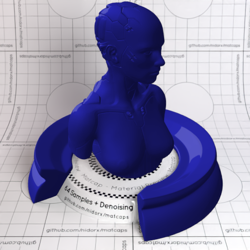

[[1024px](https://github.com/nidorx/matcaps/raw/master/1024/2F2FAA_1E1E87_10104E_1C1C70.png)]
[[512px](https://github.com/nidorx/matcaps/raw/master/512/2F2FAA_1E1E87_10104E_1C1C70-512px.png)]
[[256px](https://github.com/nidorx/matcaps/raw/master/256/2F2FAA_1E1E87_10104E_1C1C70-256px.png)]
[[128px](https://github.com/nidorx/matcaps/raw/master/128/2F2FAA_1E1E87_10104E_1C1C70-128px.png)]
[[64px](https://github.com/nidorx/matcaps/raw/master/64/2F2FAA_1E1E87_10104E_1C1C70-64px.png)]
[~~ZBrush Material (ZMT)~~]

---
### 2F3747_6A7C9E_54637F_62748B
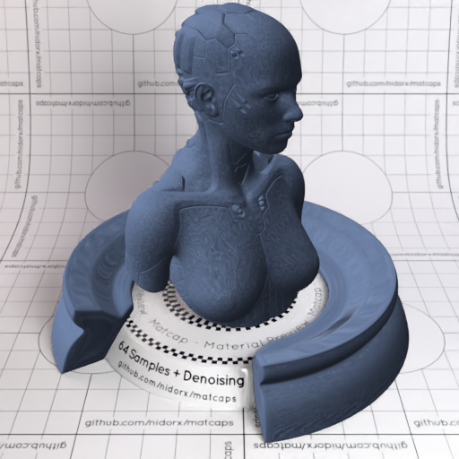

[[1024px](https://github.com/nidorx/matcaps/raw/master/1024/2F3747_6A7C9E_54637F_62748B.png)]
[[512px](https://github.com/nidorx/matcaps/raw/master/512/2F3747_6A7C9E_54637F_62748B-512px.png)]
[[256px](https://github.com/nidorx/matcaps/raw/master/256/2F3747_6A7C9E_54637F_62748B-256px.png)]
[[128px](https://github.com/nidorx/matcaps/raw/master/128/2F3747_6A7C9E_54637F_62748B-128px.png)]
[[64px](https://github.com/nidorx/matcaps/raw/master/64/2F3747_6A7C9E_54637F_62748B-64px.png)]
[[ZBrush Material (ZMT)](https://github.com/nidorx/matcaps/raw/master/zmt/2F3747_6A7C9E_54637F_62748B.zmt)]

---
### 300706_888576_822821_876E79
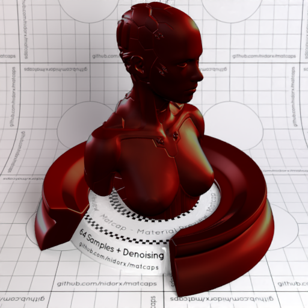

[[1024px](https://github.com/nidorx/matcaps/raw/master/1024/300706_888576_822821_876E79.png)]
[[512px](https://github.com/nidorx/matcaps/raw/master/512/300706_888576_822821_876E79-512px.png)]
[[256px](https://github.com/nidorx/matcaps/raw/master/256/300706_888576_822821_876E79-256px.png)]
[[128px](https://github.com/nidorx/matcaps/raw/master/128/300706_888576_822821_876E79-128px.png)]
[[64px](https://github.com/nidorx/matcaps/raw/master/64/300706_888576_822821_876E79-64px.png)]
[[ZBrush Material (ZMT)](https://github.com/nidorx/matcaps/raw/master/zmt/300706_888576_822821_876E79.zmt)]

---
### 302721_CAC1BB_7A706A_91959B
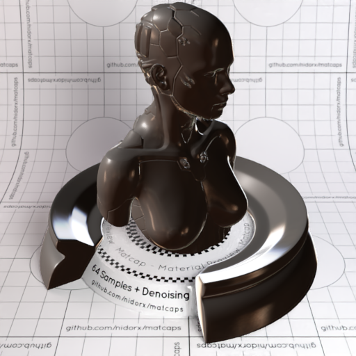

[[1024px](https://github.com/nidorx/matcaps/raw/master/1024/302721_CAC1BB_7A706A_91959B.png)]
[[512px](https://github.com/nidorx/matcaps/raw/master/512/302721_CAC1BB_7A706A_91959B-512px.png)]
[[256px](https://github.com/nidorx/matcaps/raw/master/256/302721_CAC1BB_7A706A_91959B-256px.png)]
[[128px](https://github.com/nidorx/matcaps/raw/master/128/302721_CAC1BB_7A706A_91959B-128px.png)]
[[64px](https://github.com/nidorx/matcaps/raw/master/64/302721_CAC1BB_7A706A_91959B-64px.png)]
[[ZBrush Material (ZMT)](https://github.com/nidorx/matcaps/raw/master/zmt/302721_CAC1BB_7A706A_91959B.zmt)]

---
### 304FB1_69A1EF_5081DF_5C8CE6
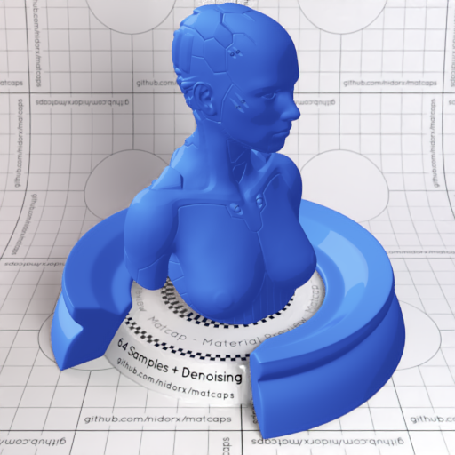

[[1024px](https://github.com/nidorx/matcaps/raw/master/1024/304FB1_69A1EF_5081DF_5C8CE6.png)]
[[512px](https://github.com/nidorx/matcaps/raw/master/512/304FB1_69A1EF_5081DF_5C8CE6-512px.png)]
[[256px](https://github.com/nidorx/matcaps/raw/master/256/304FB1_69A1EF_5081DF_5C8CE6-256px.png)]
[[128px](https://github.com/nidorx/matcaps/raw/master/128/304FB1_69A1EF_5081DF_5C8CE6-128px.png)]
[[64px](https://github.com/nidorx/matcaps/raw/master/64/304FB1_69A1EF_5081DF_5C8CE6-64px.png)]
[~~ZBrush Material (ZMT)~~]

---
### 312C34_A2AAB3_61656A_808494
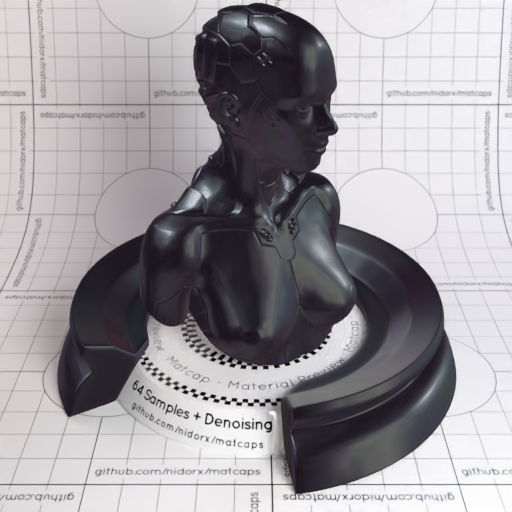
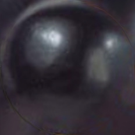

[[1024px](https://github.com/nidorx/matcaps/raw/master/1024/312C34_A2AAB3_61656A_808494.png)]
[[512px](https://github.com/nidorx/matcaps/raw/master/512/312C34_A2AAB3_61656A_808494-512px.png)]
[[256px](https://github.com/nidorx/matcaps/raw/master/256/312C34_A2AAB3_61656A_808494-256px.png)]
[[128px](https://github.com/nidorx/matcaps/raw/master/128/312C34_A2AAB3_61656A_808494-128px.png)]
[[64px](https://github.com/nidorx/matcaps/raw/master/64/312C34_A2AAB3_61656A_808494-64px.png)]
[[ZBrush Material (ZMT)](https://github.com/nidorx/matcaps/raw/master/zmt/312C34_A2AAB3_61656A_808494.zmt)]

---
### 312D20_80675C_8B8C8B_85848C
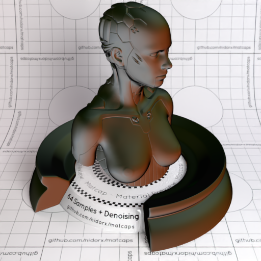
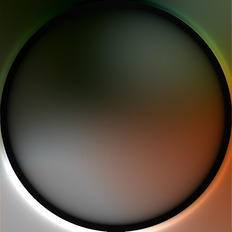

[[1024px](https://github.com/nidorx/matcaps/raw/master/1024/312D20_80675C_8B8C8B_85848C.png)]
[[512px](https://github.com/nidorx/matcaps/raw/master/512/312D20_80675C_8B8C8B_85848C-512px.png)]
[[256px](https://github.com/nidorx/matcaps/raw/master/256/312D20_80675C_8B8C8B_85848C-256px.png)]
[[128px](https://github.com/nidorx/matcaps/raw/master/128/312D20_80675C_8B8C8B_85848C-128px.png)]
[[64px](https://github.com/nidorx/matcaps/raw/master/64/312D20_80675C_8B8C8B_85848C-64px.png)]
[[ZBrush Material (ZMT)](https://github.com/nidorx/matcaps/raw/master/zmt/312D20_80675C_8B8C8B_85848C.zmt)]

---
### 313131_BBBBBB_878787_A3A4A4
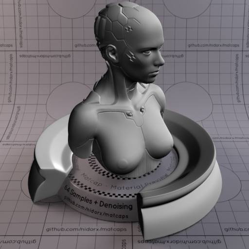

[[1024px](https://github.com/nidorx/matcaps/raw/master/1024/313131_BBBBBB_878787_A3A4A4.png)]
[[512px](https://github.com/nidorx/matcaps/raw/master/512/313131_BBBBBB_878787_A3A4A4-512px.png)]
[[256px](https://github.com/nidorx/matcaps/raw/master/256/313131_BBBBBB_878787_A3A4A4-256px.png)]
[[128px](https://github.com/nidorx/matcaps/raw/master/128/313131_BBBBBB_878787_A3A4A4-128px.png)]
[[64px](https://github.com/nidorx/matcaps/raw/master/64/313131_BBBBBB_878787_A3A4A4-64px.png)]
[[ZBrush Material (ZMT)](https://github.com/nidorx/matcaps/raw/master/zmt/313131_BBBBBB_878787_A3A4A4.zmt)]

---
### 320455_720DBE_560496_47047B
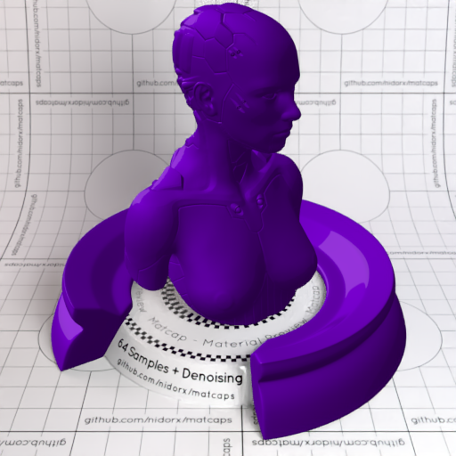
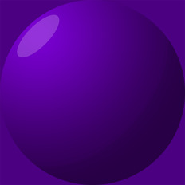

[[1024px](https://github.com/nidorx/matcaps/raw/master/1024/320455_720DBE_560496_47047B.png)]
[[512px](https://github.com/nidorx/matcaps/raw/master/512/320455_720DBE_560496_47047B-512px.png)]
[[256px](https://github.com/nidorx/matcaps/raw/master/256/320455_720DBE_560496_47047B-256px.png)]
[[128px](https://github.com/nidorx/matcaps/raw/master/128/320455_720DBE_560496_47047B-128px.png)]
[[64px](https://github.com/nidorx/matcaps/raw/master/64/320455_720DBE_560496_47047B-64px.png)]
[~~ZBrush Material (ZMT)~~]

---
### 32201D_613C3C_563533_8C655F
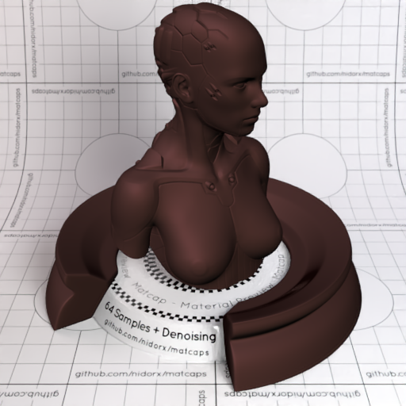
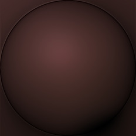

[[1024px](https://github.com/nidorx/matcaps/raw/master/1024/32201D_613C3C_563533_8C655F.png)]
[[512px](https://github.com/nidorx/matcaps/raw/master/512/32201D_613C3C_563533_8C655F-512px.png)]
[[256px](https://github.com/nidorx/matcaps/raw/master/256/32201D_613C3C_563533_8C655F-256px.png)]
[[128px](https://github.com/nidorx/matcaps/raw/master/128/32201D_613C3C_563533_8C655F-128px.png)]
[[64px](https://github.com/nidorx/matcaps/raw/master/64/32201D_613C3C_563533_8C655F-64px.png)]
[[ZBrush Material (ZMT)](https://github.com/nidorx/matcaps/raw/master/zmt/32201D_613C3C_563533_8C655F.zmt)]

---
### 32302B_4C4842_121211_1C1C14
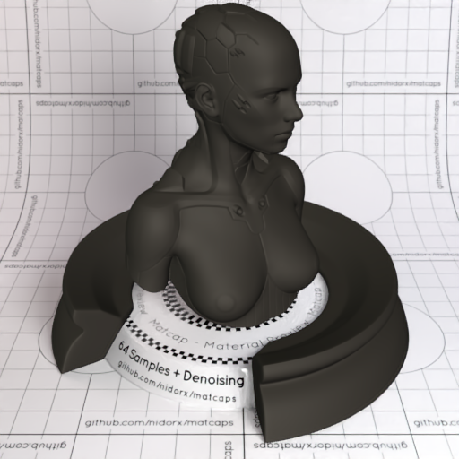

[[1024px](https://github.com/nidorx/matcaps/raw/master/1024/32302B_4C4842_121211_1C1C14.png)]
[[512px](https://github.com/nidorx/matcaps/raw/master/512/32302B_4C4842_121211_1C1C14-512px.png)]
[[256px](https://github.com/nidorx/matcaps/raw/master/256/32302B_4C4842_121211_1C1C14-256px.png)]
[[128px](https://github.com/nidorx/matcaps/raw/master/128/32302B_4C4842_121211_1C1C14-128px.png)]
[[64px](https://github.com/nidorx/matcaps/raw/master/64/32302B_4C4842_121211_1C1C14-64px.png)]
[[ZBrush Material (ZMT)](https://github.com/nidorx/matcaps/raw/master/zmt/32302B_4C4842_121211_1C1C14.zmt)]

---
### 323C4D_B79039_7C6A44_605C48
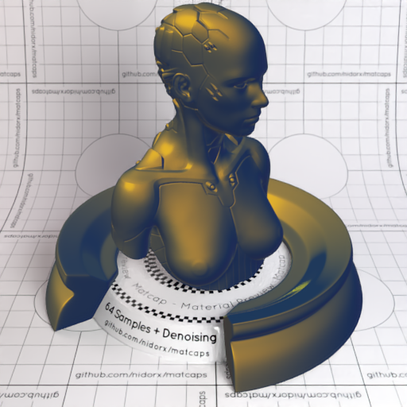

[[1024px](https://github.com/nidorx/matcaps/raw/master/1024/323C4D_B79039_7C6A44_605C48.png)]
[[512px](https://github.com/nidorx/matcaps/raw/master/512/323C4D_B79039_7C6A44_605C48-512px.png)]
[[256px](https://github.com/nidorx/matcaps/raw/master/256/323C4D_B79039_7C6A44_605C48-256px.png)]
[[128px](https://github.com/nidorx/matcaps/raw/master/128/323C4D_B79039_7C6A44_605C48-128px.png)]
[[64px](https://github.com/nidorx/matcaps/raw/master/64/323C4D_B79039_7C6A44_605C48-64px.png)]
[[ZBrush Material (ZMT)](https://github.com/nidorx/matcaps/raw/master/zmt/323C4D_B79039_7C6A44_605C48.zmt)]

---
### 326666_66CBC9_C0B8AE_52B3B4
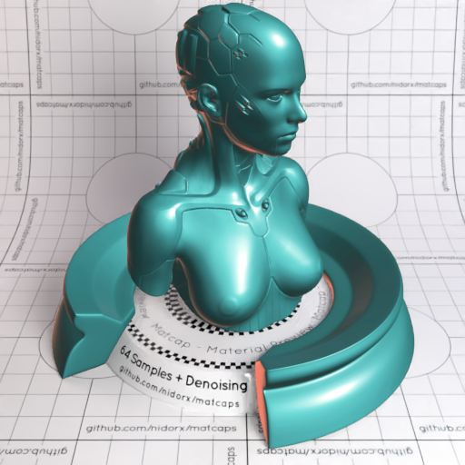
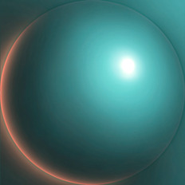

[[1024px](https://github.com/nidorx/matcaps/raw/master/1024/326666_66CBC9_C0B8AE_52B3B4.png)]
[[512px](https://github.com/nidorx/matcaps/raw/master/512/326666_66CBC9_C0B8AE_52B3B4-512px.png)]
[[256px](https://github.com/nidorx/matcaps/raw/master/256/326666_66CBC9_C0B8AE_52B3B4-256px.png)]
[[128px](https://github.com/nidorx/matcaps/raw/master/128/326666_66CBC9_C0B8AE_52B3B4-128px.png)]
[[64px](https://github.com/nidorx/matcaps/raw/master/64/326666_66CBC9_C0B8AE_52B3B4-64px.png)]
[[ZBrush Material (ZMT)](https://github.com/nidorx/matcaps/raw/master/zmt/326666_66CBC9_C0B8AE_52B3B4.zmt)]

---
### 331A0B_B17038_7D4E28_5B351A
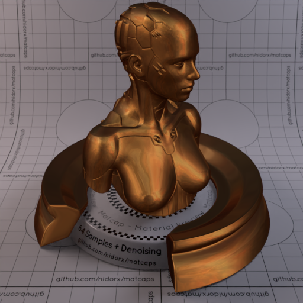

[[1024px](https://github.com/nidorx/matcaps/raw/master/1024/331A0B_B17038_7D4E28_5B351A.png)]
[[512px](https://github.com/nidorx/matcaps/raw/master/512/331A0B_B17038_7D4E28_5B351A-512px.png)]
[[256px](https://github.com/nidorx/matcaps/raw/master/256/331A0B_B17038_7D4E28_5B351A-256px.png)]
[[128px](https://github.com/nidorx/matcaps/raw/master/128/331A0B_B17038_7D4E28_5B351A-128px.png)]
[[64px](https://github.com/nidorx/matcaps/raw/master/64/331A0B_B17038_7D4E28_5B351A-64px.png)]
[[ZBrush Material (ZMT)](https://github.com/nidorx/matcaps/raw/master/zmt/331A0B_B17038_7D4E28_5B351A.zmt)]

---
### 336EB3_152578_A4C5E2_74AED9
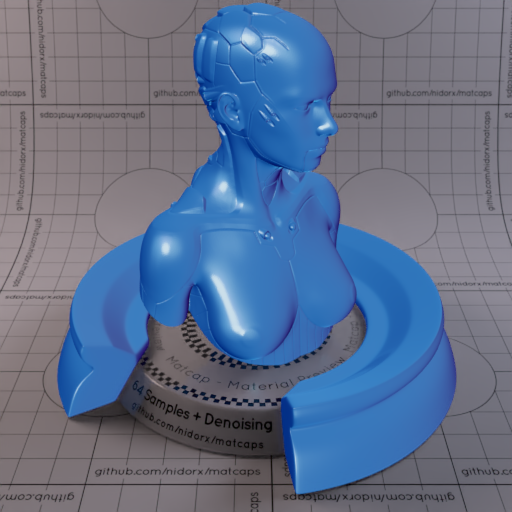
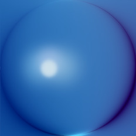

[[1024px](https://github.com/nidorx/matcaps/raw/master/1024/336EB3_152578_A4C5E2_74AED9.png)]
[[512px](https://github.com/nidorx/matcaps/raw/master/512/336EB3_152578_A4C5E2_74AED9-512px.png)]
[[256px](https://github.com/nidorx/matcaps/raw/master/256/336EB3_152578_A4C5E2_74AED9-256px.png)]
[[128px](https://github.com/nidorx/matcaps/raw/master/128/336EB3_152578_A4C5E2_74AED9-128px.png)]
[[64px](https://github.com/nidorx/matcaps/raw/master/64/336EB3_152578_A4C5E2_74AED9-64px.png)]
[[ZBrush Material (ZMT)](https://github.com/nidorx/matcaps/raw/master/zmt/336EB3_152578_A4C5E2_74AED9.zmt)]

---
### 34352A_718184_50605E_6E6761
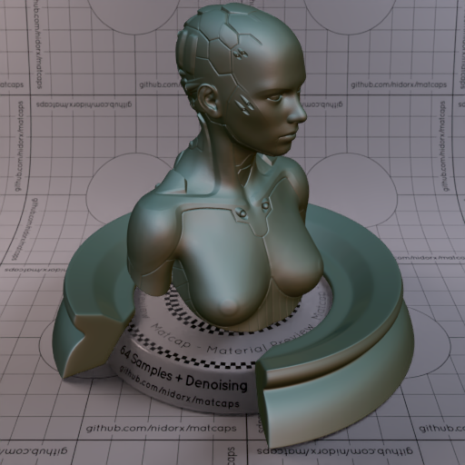
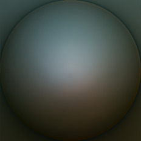

[[1024px](https://github.com/nidorx/matcaps/raw/master/1024/34352A_718184_50605E_6E6761.png)]
[[512px](https://github.com/nidorx/matcaps/raw/master/512/34352A_718184_50605E_6E6761-512px.png)]
[[256px](https://github.com/nidorx/matcaps/raw/master/256/34352A_718184_50605E_6E6761-256px.png)]
[[128px](https://github.com/nidorx/matcaps/raw/master/128/34352A_718184_50605E_6E6761-128px.png)]
[[64px](https://github.com/nidorx/matcaps/raw/master/64/34352A_718184_50605E_6E6761-64px.png)]
[[ZBrush Material (ZMT)](https://github.com/nidorx/matcaps/raw/master/zmt/34352A_718184_50605E_6E6761.zmt)]

---
### 346088_6ABED7_56A0C5_4E91B8
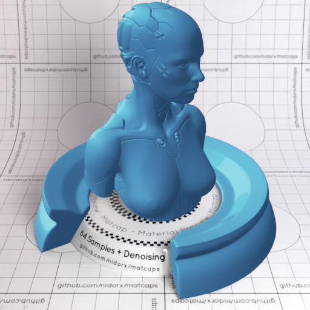
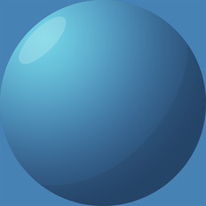

[[1024px](https://github.com/nidorx/matcaps/raw/master/1024/346088_6ABED7_56A0C5_4E91B8.png)]
[[512px](https://github.com/nidorx/matcaps/raw/master/512/346088_6ABED7_56A0C5_4E91B8-512px.png)]
[[256px](https://github.com/nidorx/matcaps/raw/master/256/346088_6ABED7_56A0C5_4E91B8-256px.png)]
[[128px](https://github.com/nidorx/matcaps/raw/master/128/346088_6ABED7_56A0C5_4E91B8-128px.png)]
[[64px](https://github.com/nidorx/matcaps/raw/master/64/346088_6ABED7_56A0C5_4E91B8-64px.png)]
[~~ZBrush Material (ZMT)~~]

---
### 34A09C_6EE5E3_5CD7D3_4EC9C6
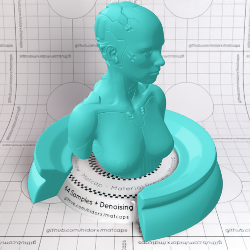
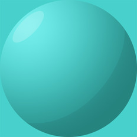

[[1024px](https://github.com/nidorx/matcaps/raw/master/1024/34A09C_6EE5E3_5CD7D3_4EC9C6.png)]
[[512px](https://github.com/nidorx/matcaps/raw/master/512/34A09C_6EE5E3_5CD7D3_4EC9C6-512px.png)]
[[256px](https://github.com/nidorx/matcaps/raw/master/256/34A09C_6EE5E3_5CD7D3_4EC9C6-256px.png)]
[[128px](https://github.com/nidorx/matcaps/raw/master/128/34A09C_6EE5E3_5CD7D3_4EC9C6-128px.png)]
[[64px](https://github.com/nidorx/matcaps/raw/master/64/34A09C_6EE5E3_5CD7D3_4EC9C6-64px.png)]
[~~ZBrush Material (ZMT)~~]

---
### 34AB94_36DFC1_19F9EB_6C6E62
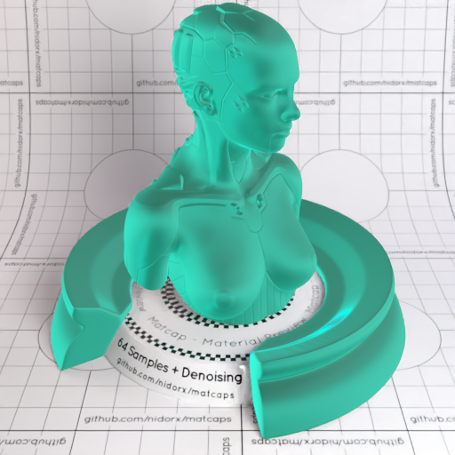

[[1024px](https://github.com/nidorx/matcaps/raw/master/1024/34AB94_36DFC1_19F9EB_6C6E62.png)]
[[512px](https://github.com/nidorx/matcaps/raw/master/512/34AB94_36DFC1_19F9EB_6C6E62-512px.png)]
[[256px](https://github.com/nidorx/matcaps/raw/master/256/34AB94_36DFC1_19F9EB_6C6E62-256px.png)]
[[128px](https://github.com/nidorx/matcaps/raw/master/128/34AB94_36DFC1_19F9EB_6C6E62-128px.png)]
[[64px](https://github.com/nidorx/matcaps/raw/master/64/34AB94_36DFC1_19F9EB_6C6E62-64px.png)]
[[ZBrush Material (ZMT)](https://github.com/nidorx/matcaps/raw/master/zmt/34AB94_36DFC1_19F9EB_6C6E62.zmt)]

---
### 353535_CFCFCF_828282_A4A4A4
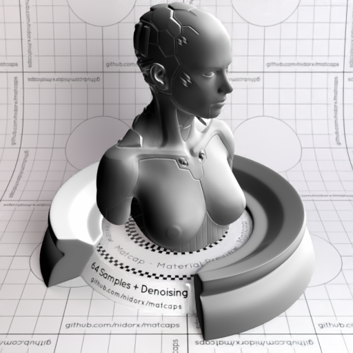

[[1024px](https://github.com/nidorx/matcaps/raw/master/1024/353535_CFCFCF_828282_A4A4A4.png)]
[[512px](https://github.com/nidorx/matcaps/raw/master/512/353535_CFCFCF_828282_A4A4A4-512px.png)]
[[256px](https://github.com/nidorx/matcaps/raw/master/256/353535_CFCFCF_828282_A4A4A4-256px.png)]
[[128px](https://github.com/nidorx/matcaps/raw/master/128/353535_CFCFCF_828282_A4A4A4-128px.png)]
[[64px](https://github.com/nidorx/matcaps/raw/master/64/353535_CFCFCF_828282_A4A4A4-64px.png)]
[[ZBrush Material (ZMT)](https://github.com/nidorx/matcaps/raw/master/zmt/353535_CFCFCF_828282_A4A4A4.zmt)]

---