A huge library of MatCap textures in PNG and ZMT.

## Navigation
* [Home](/)
* [Page 1](PAGE-1.md)
* [Page 2](PAGE-2.md)
* [Page 3](PAGE-3.md)
* [Page 4](PAGE-4.md)
* Page 5
* [Page 6](PAGE-6.md)
* [Page 7](PAGE-7.md)
* [Page 8](PAGE-8.md)
* [Page 9](PAGE-9.md)
* [Page 10](PAGE-10.md)
* [Page 11](PAGE-11.md)
* [Page 12](PAGE-12.md)
* [Page 13](PAGE-13.md)
* [Page 14](PAGE-14.md)
* [Page 15](PAGE-15.md)
* [Page 16](PAGE-16.md)
* [Page 17](PAGE-17.md)
* [Page 18](PAGE-18.md)
* [Page 19](PAGE-19.md)
* [Page 20](PAGE-20.md)
* [Page 21](PAGE-21.md)
* [Page 22](PAGE-22.md)
* [Page 23](PAGE-23.md)
* [Page 24](PAGE-24.md)
* [Page 25](PAGE-25.md)
* [Page 26](PAGE-26.md)
* [Page 27](PAGE-27.md)
* [Page 28](PAGE-28.md)
* [Page 29](PAGE-29.md)
* [Page 30](PAGE-30.md)
* [Page 31](PAGE-31.md)
* [Page 32](PAGE-32.md)
* [Page 33](PAGE-33.md)
## Page 5 Matcaps
### 36220C_C6C391_8C844A_8B7B4C
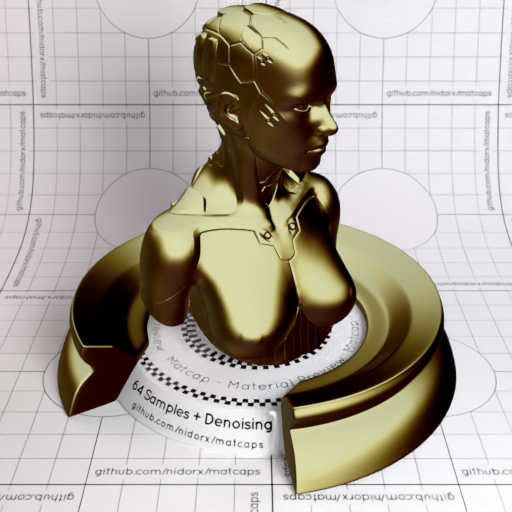
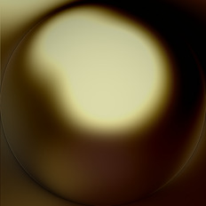

[[1024px](https://github.com/nidorx/matcaps/raw/master/1024/36220C_C6C391_8C844A_8B7B4C.png)]
[[512px](https://github.com/nidorx/matcaps/raw/master/512/36220C_C6C391_8C844A_8B7B4C-512px.png)]
[[256px](https://github.com/nidorx/matcaps/raw/master/256/36220C_C6C391_8C844A_8B7B4C-256px.png)]
[[128px](https://github.com/nidorx/matcaps/raw/master/128/36220C_C6C391_8C844A_8B7B4C-128px.png)]
[[64px](https://github.com/nidorx/matcaps/raw/master/64/36220C_C6C391_8C844A_8B7B4C-64px.png)]
[[ZBrush Material (ZMT)](https://github.com/nidorx/matcaps/raw/master/zmt/36220C_C6C391_8C844A_8B7B4C.zmt)]

---
### 36312E_726461_59504D_645C5C
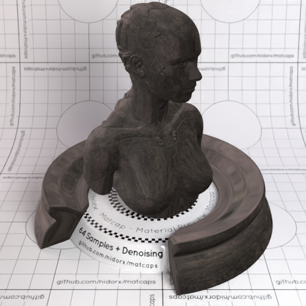

[[1024px](https://github.com/nidorx/matcaps/raw/master/1024/36312E_726461_59504D_645C5C.png)]
[[512px](https://github.com/nidorx/matcaps/raw/master/512/36312E_726461_59504D_645C5C-512px.png)]
[[256px](https://github.com/nidorx/matcaps/raw/master/256/36312E_726461_59504D_645C5C-256px.png)]
[[128px](https://github.com/nidorx/matcaps/raw/master/128/36312E_726461_59504D_645C5C-128px.png)]
[[64px](https://github.com/nidorx/matcaps/raw/master/64/36312E_726461_59504D_645C5C-64px.png)]
[[ZBrush Material (ZMT)](https://github.com/nidorx/matcaps/raw/master/zmt/36312E_726461_59504D_645C5C.zmt)]

---
### 365123_C6E5A3_A8D18D_8EB16C
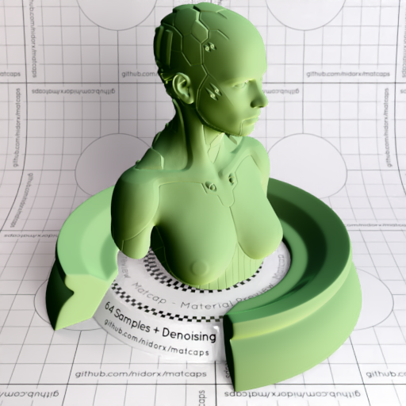
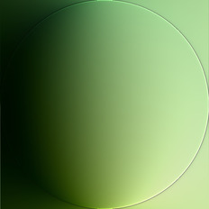

[[1024px](https://github.com/nidorx/matcaps/raw/master/1024/365123_C6E5A3_A8D18D_8EB16C.png)]
[[512px](https://github.com/nidorx/matcaps/raw/master/512/365123_C6E5A3_A8D18D_8EB16C-512px.png)]
[[256px](https://github.com/nidorx/matcaps/raw/master/256/365123_C6E5A3_A8D18D_8EB16C-256px.png)]
[[128px](https://github.com/nidorx/matcaps/raw/master/128/365123_C6E5A3_A8D18D_8EB16C-128px.png)]
[[64px](https://github.com/nidorx/matcaps/raw/master/64/365123_C6E5A3_A8D18D_8EB16C-64px.png)]
[[ZBrush Material (ZMT)](https://github.com/nidorx/matcaps/raw/master/zmt/365123_C6E5A3_A8D18D_8EB16C.zmt)]

---
### 36C8FA_176ACB_24A7EF_1D93EC
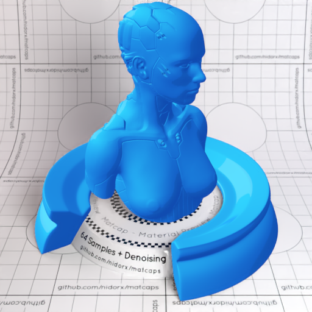

[[1024px](https://github.com/nidorx/matcaps/raw/master/1024/36C8FA_176ACB_24A7EF_1D93EC.png)]
[[512px](https://github.com/nidorx/matcaps/raw/master/512/36C8FA_176ACB_24A7EF_1D93EC-512px.png)]
[[256px](https://github.com/nidorx/matcaps/raw/master/256/36C8FA_176ACB_24A7EF_1D93EC-256px.png)]
[[128px](https://github.com/nidorx/matcaps/raw/master/128/36C8FA_176ACB_24A7EF_1D93EC-128px.png)]
[[64px](https://github.com/nidorx/matcaps/raw/master/64/36C8FA_176ACB_24A7EF_1D93EC-64px.png)]
[~~ZBrush Material (ZMT)~~]

---
### 37C337_279F27_186018_248824
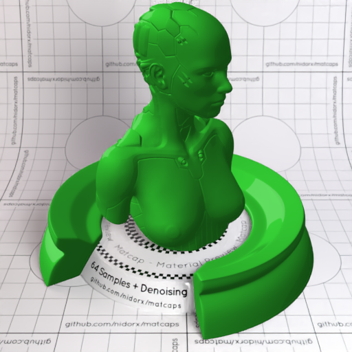

[[1024px](https://github.com/nidorx/matcaps/raw/master/1024/37C337_279F27_186018_248824.png)]
[[512px](https://github.com/nidorx/matcaps/raw/master/512/37C337_279F27_186018_248824-512px.png)]
[[256px](https://github.com/nidorx/matcaps/raw/master/256/37C337_279F27_186018_248824-256px.png)]
[[128px](https://github.com/nidorx/matcaps/raw/master/128/37C337_279F27_186018_248824-128px.png)]
[[64px](https://github.com/nidorx/matcaps/raw/master/64/37C337_279F27_186018_248824-64px.png)]
[~~ZBrush Material (ZMT)~~]

---
### 385264_A1D3E2_86ADC1_6E94A8
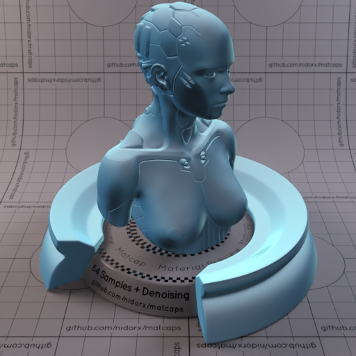

[[1024px](https://github.com/nidorx/matcaps/raw/master/1024/385264_A1D3E2_86ADC1_6E94A8.png)]
[[512px](https://github.com/nidorx/matcaps/raw/master/512/385264_A1D3E2_86ADC1_6E94A8-512px.png)]
[[256px](https://github.com/nidorx/matcaps/raw/master/256/385264_A1D3E2_86ADC1_6E94A8-256px.png)]
[[128px](https://github.com/nidorx/matcaps/raw/master/128/385264_A1D3E2_86ADC1_6E94A8-128px.png)]
[[64px](https://github.com/nidorx/matcaps/raw/master/64/385264_A1D3E2_86ADC1_6E94A8-64px.png)]
[[ZBrush Material (ZMT)](https://github.com/nidorx/matcaps/raw/master/zmt/385264_A1D3E2_86ADC1_6E94A8.zmt)]

---
### 385862_6D8B8D_647B80_1A2E2F
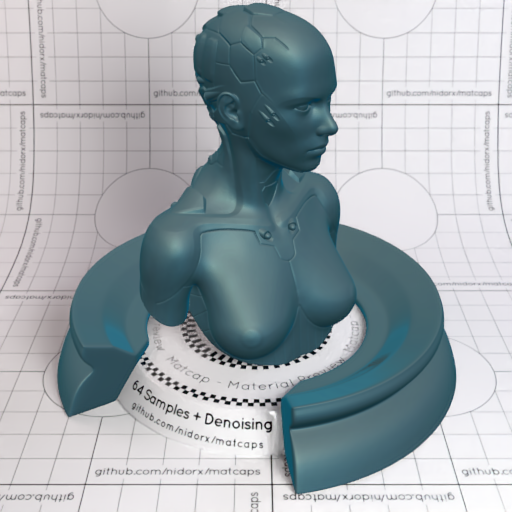

[[1024px](https://github.com/nidorx/matcaps/raw/master/1024/385862_6D8B8D_647B80_1A2E2F.png)]
[[512px](https://github.com/nidorx/matcaps/raw/master/512/385862_6D8B8D_647B80_1A2E2F-512px.png)]
[[256px](https://github.com/nidorx/matcaps/raw/master/256/385862_6D8B8D_647B80_1A2E2F-256px.png)]
[[128px](https://github.com/nidorx/matcaps/raw/master/128/385862_6D8B8D_647B80_1A2E2F-128px.png)]
[[64px](https://github.com/nidorx/matcaps/raw/master/64/385862_6D8B8D_647B80_1A2E2F-64px.png)]
[[ZBrush Material (ZMT)](https://github.com/nidorx/matcaps/raw/master/zmt/385862_6D8B8D_647B80_1A2E2F.zmt)]

---
### 386169_A9CFDB_153C23_7CA3AC
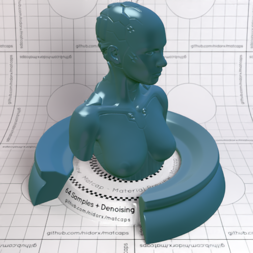
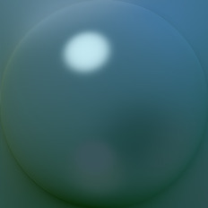

[[1024px](https://github.com/nidorx/matcaps/raw/master/1024/386169_A9CFDB_153C23_7CA3AC.png)]
[[512px](https://github.com/nidorx/matcaps/raw/master/512/386169_A9CFDB_153C23_7CA3AC-512px.png)]
[[256px](https://github.com/nidorx/matcaps/raw/master/256/386169_A9CFDB_153C23_7CA3AC-256px.png)]
[[128px](https://github.com/nidorx/matcaps/raw/master/128/386169_A9CFDB_153C23_7CA3AC-128px.png)]
[[64px](https://github.com/nidorx/matcaps/raw/master/64/386169_A9CFDB_153C23_7CA3AC-64px.png)]
[[ZBrush Material (ZMT)](https://github.com/nidorx/matcaps/raw/master/zmt/386169_A9CFDB_153C23_7CA3AC.zmt)]

---
### 38925D_142B23_1D4835_2A6449
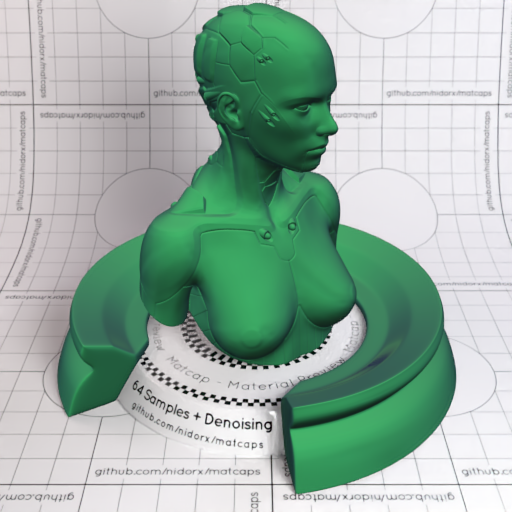

[[1024px](https://github.com/nidorx/matcaps/raw/master/1024/38925D_142B23_1D4835_2A6449.png)]
[[512px](https://github.com/nidorx/matcaps/raw/master/512/38925D_142B23_1D4835_2A6449-512px.png)]
[[256px](https://github.com/nidorx/matcaps/raw/master/256/38925D_142B23_1D4835_2A6449-256px.png)]
[[128px](https://github.com/nidorx/matcaps/raw/master/128/38925D_142B23_1D4835_2A6449-128px.png)]
[[64px](https://github.com/nidorx/matcaps/raw/master/64/38925D_142B23_1D4835_2A6449-64px.png)]
[[ZBrush Material (ZMT)](https://github.com/nidorx/matcaps/raw/master/zmt/38925D_142B23_1D4835_2A6449.zmt)]

---
### 392307_B3AE7D_6D5618_847C42

[[1024px](https://github.com/nidorx/matcaps/raw/master/1024/392307_B3AE7D_6D5618_847C42.png)]
[[512px](https://github.com/nidorx/matcaps/raw/master/512/392307_B3AE7D_6D5618_847C42-512px.png)]
[[256px](https://github.com/nidorx/matcaps/raw/master/256/392307_B3AE7D_6D5618_847C42-256px.png)]
[[128px](https://github.com/nidorx/matcaps/raw/master/128/392307_B3AE7D_6D5618_847C42-128px.png)]
[[64px](https://github.com/nidorx/matcaps/raw/master/64/392307_B3AE7D_6D5618_847C42-64px.png)]
[~~ZBrush Material (ZMT)~~]

---
### 39433A_65866E_86BF8B_BFF8D8
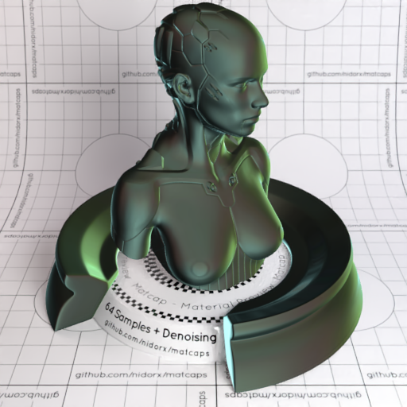
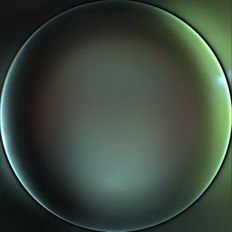

[[1024px](https://github.com/nidorx/matcaps/raw/master/1024/39433A_65866E_86BF8B_BFF8D8.png)]
[[512px](https://github.com/nidorx/matcaps/raw/master/512/39433A_65866E_86BF8B_BFF8D8-512px.png)]
[[256px](https://github.com/nidorx/matcaps/raw/master/256/39433A_65866E_86BF8B_BFF8D8-256px.png)]
[[128px](https://github.com/nidorx/matcaps/raw/master/128/39433A_65866E_86BF8B_BFF8D8-128px.png)]
[[64px](https://github.com/nidorx/matcaps/raw/master/64/39433A_65866E_86BF8B_BFF8D8-64px.png)]
[[ZBrush Material (ZMT)](https://github.com/nidorx/matcaps/raw/master/zmt/39433A_65866E_86BF8B_BFF8D8.zmt)]

---
### 394641_B1A67E_75BEBE_7D7256
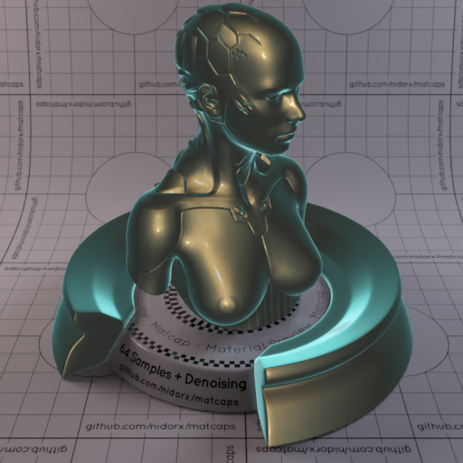

[[1024px](https://github.com/nidorx/matcaps/raw/master/1024/394641_B1A67E_75BEBE_7D7256.png)]
[[512px](https://github.com/nidorx/matcaps/raw/master/512/394641_B1A67E_75BEBE_7D7256-512px.png)]
[[256px](https://github.com/nidorx/matcaps/raw/master/256/394641_B1A67E_75BEBE_7D7256-256px.png)]
[[128px](https://github.com/nidorx/matcaps/raw/master/128/394641_B1A67E_75BEBE_7D7256-128px.png)]
[[64px](https://github.com/nidorx/matcaps/raw/master/64/394641_B1A67E_75BEBE_7D7256-64px.png)]
[[ZBrush Material (ZMT)](https://github.com/nidorx/matcaps/raw/master/zmt/394641_B1A67E_75BEBE_7D7256.zmt)]

---
### 3A2412_A78B5F_705434_836C47
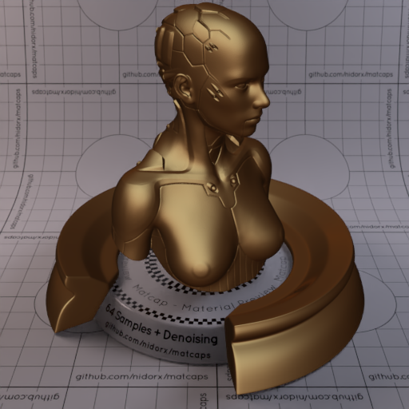

[[1024px](https://github.com/nidorx/matcaps/raw/master/1024/3A2412_A78B5F_705434_836C47.png)]
[[512px](https://github.com/nidorx/matcaps/raw/master/512/3A2412_A78B5F_705434_836C47-512px.png)]
[[256px](https://github.com/nidorx/matcaps/raw/master/256/3A2412_A78B5F_705434_836C47-256px.png)]
[[128px](https://github.com/nidorx/matcaps/raw/master/128/3A2412_A78B5F_705434_836C47-128px.png)]
[[64px](https://github.com/nidorx/matcaps/raw/master/64/3A2412_A78B5F_705434_836C47-64px.png)]
[~~ZBrush Material (ZMT)~~]

---
### 3A3329_C9B090_928069_A9957A
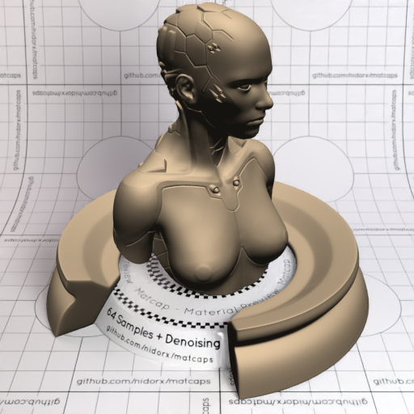

[[1024px](https://github.com/nidorx/matcaps/raw/master/1024/3A3329_C9B090_928069_A9957A.png)]
[[512px](https://github.com/nidorx/matcaps/raw/master/512/3A3329_C9B090_928069_A9957A-512px.png)]
[[256px](https://github.com/nidorx/matcaps/raw/master/256/3A3329_C9B090_928069_A9957A-256px.png)]
[[128px](https://github.com/nidorx/matcaps/raw/master/128/3A3329_C9B090_928069_A9957A-128px.png)]
[[64px](https://github.com/nidorx/matcaps/raw/master/64/3A3329_C9B090_928069_A9957A-64px.png)]
[[ZBrush Material (ZMT)](https://github.com/nidorx/matcaps/raw/master/zmt/3A3329_C9B090_928069_A9957A.zmt)]

---
### 3A3D37_7E7F75_BCBFB6_9C9C94
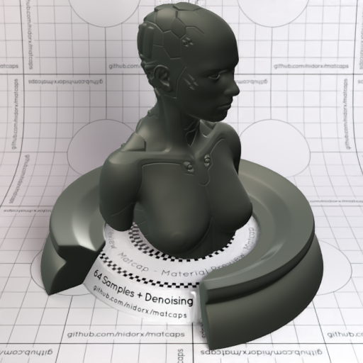
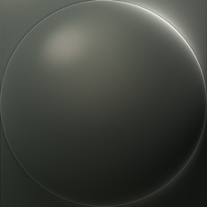

[[1024px](https://github.com/nidorx/matcaps/raw/master/1024/3A3D37_7E7F75_BCBFB6_9C9C94.png)]
[[512px](https://github.com/nidorx/matcaps/raw/master/512/3A3D37_7E7F75_BCBFB6_9C9C94-512px.png)]
[[256px](https://github.com/nidorx/matcaps/raw/master/256/3A3D37_7E7F75_BCBFB6_9C9C94-256px.png)]
[[128px](https://github.com/nidorx/matcaps/raw/master/128/3A3D37_7E7F75_BCBFB6_9C9C94-128px.png)]
[[64px](https://github.com/nidorx/matcaps/raw/master/64/3A3D37_7E7F75_BCBFB6_9C9C94-64px.png)]
[[ZBrush Material (ZMT)](https://github.com/nidorx/matcaps/raw/master/zmt/3A3D37_7E7F75_BCBFB6_9C9C94.zmt)]

---
### 3B3B3B_C7C7C7_878787_A4A4A4
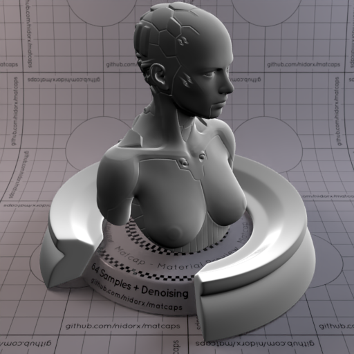

[[1024px](https://github.com/nidorx/matcaps/raw/master/1024/3B3B3B_C7C7C7_878787_A4A4A4.png)]
[[512px](https://github.com/nidorx/matcaps/raw/master/512/3B3B3B_C7C7C7_878787_A4A4A4-512px.png)]
[[256px](https://github.com/nidorx/matcaps/raw/master/256/3B3B3B_C7C7C7_878787_A4A4A4-256px.png)]
[[128px](https://github.com/nidorx/matcaps/raw/master/128/3B3B3B_C7C7C7_878787_A4A4A4-128px.png)]
[[64px](https://github.com/nidorx/matcaps/raw/master/64/3B3B3B_C7C7C7_878787_A4A4A4-64px.png)]
[[ZBrush Material (ZMT)](https://github.com/nidorx/matcaps/raw/master/zmt/3B3B3B_C7C7C7_878787_A4A4A4.zmt)]

---
### 3B3C3F_DAD9D5_929290_ABACA8
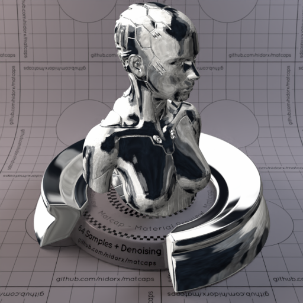

[[1024px](https://github.com/nidorx/matcaps/raw/master/1024/3B3C3F_DAD9D5_929290_ABACA8.png)]
[[512px](https://github.com/nidorx/matcaps/raw/master/512/3B3C3F_DAD9D5_929290_ABACA8-512px.png)]
[[256px](https://github.com/nidorx/matcaps/raw/master/256/3B3C3F_DAD9D5_929290_ABACA8-256px.png)]
[[128px](https://github.com/nidorx/matcaps/raw/master/128/3B3C3F_DAD9D5_929290_ABACA8-128px.png)]
[[64px](https://github.com/nidorx/matcaps/raw/master/64/3B3C3F_DAD9D5_929290_ABACA8-64px.png)]
[[ZBrush Material (ZMT)](https://github.com/nidorx/matcaps/raw/master/zmt/3B3C3F_DAD9D5_929290_ABACA8.zmt)]

---
### 3B4235_7B9395_5B716C_70847B
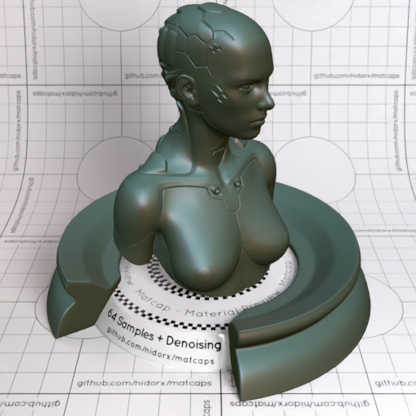

[[1024px](https://github.com/nidorx/matcaps/raw/master/1024/3B4235_7B9395_5B716C_70847B.png)]
[[512px](https://github.com/nidorx/matcaps/raw/master/512/3B4235_7B9395_5B716C_70847B-512px.png)]
[[256px](https://github.com/nidorx/matcaps/raw/master/256/3B4235_7B9395_5B716C_70847B-256px.png)]
[[128px](https://github.com/nidorx/matcaps/raw/master/128/3B4235_7B9395_5B716C_70847B-128px.png)]
[[64px](https://github.com/nidorx/matcaps/raw/master/64/3B4235_7B9395_5B716C_70847B-64px.png)]
[[ZBrush Material (ZMT)](https://github.com/nidorx/matcaps/raw/master/zmt/3B4235_7B9395_5B716C_70847B.zmt)]

---
### 3B6E10_E3F2C3_88AC2E_99CE51
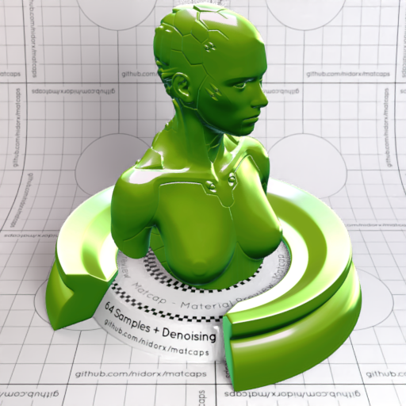
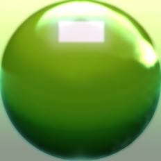

[[1024px](https://github.com/nidorx/matcaps/raw/master/1024/3B6E10_E3F2C3_88AC2E_99CE51.png)]
[[512px](https://github.com/nidorx/matcaps/raw/master/512/3B6E10_E3F2C3_88AC2E_99CE51-512px.png)]
[[256px](https://github.com/nidorx/matcaps/raw/master/256/3B6E10_E3F2C3_88AC2E_99CE51-256px.png)]
[[128px](https://github.com/nidorx/matcaps/raw/master/128/3B6E10_E3F2C3_88AC2E_99CE51-128px.png)]
[[64px](https://github.com/nidorx/matcaps/raw/master/64/3B6E10_E3F2C3_88AC2E_99CE51-64px.png)]
[~~ZBrush Material (ZMT)~~]

---
### 3D1F12_653821_070404_22130B
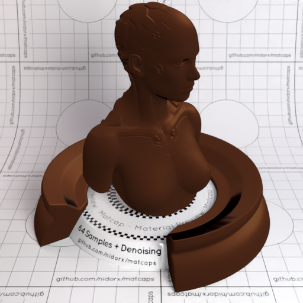

[[1024px](https://github.com/nidorx/matcaps/raw/master/1024/3D1F12_653821_070404_22130B.png)]
[[512px](https://github.com/nidorx/matcaps/raw/master/512/3D1F12_653821_070404_22130B-512px.png)]
[[256px](https://github.com/nidorx/matcaps/raw/master/256/3D1F12_653821_070404_22130B-256px.png)]
[[128px](https://github.com/nidorx/matcaps/raw/master/128/3D1F12_653821_070404_22130B-128px.png)]
[[64px](https://github.com/nidorx/matcaps/raw/master/64/3D1F12_653821_070404_22130B-64px.png)]
[[ZBrush Material (ZMT)](https://github.com/nidorx/matcaps/raw/master/zmt/3D1F12_653821_070404_22130B.zmt)]

---