A huge library of MatCap textures in PNG and ZMT.

## Navigation
* [Home](/)
* [Page 1](PAGE-1.md)
* [Page 2](PAGE-2.md)
* [Page 3](PAGE-3.md)
* [Page 4](PAGE-4.md)
* Page 5
* [Page 6](PAGE-6.md)
* [Page 7](PAGE-7.md)
* [Page 8](PAGE-8.md)
* [Page 9](PAGE-9.md)
* [Page 10](PAGE-10.md)
* [Page 11](PAGE-11.md)
* [Page 12](PAGE-12.md)
* [Page 13](PAGE-13.md)
* [Page 14](PAGE-14.md)
* [Page 15](PAGE-15.md)
* [Page 16](PAGE-16.md)
* [Page 17](PAGE-17.md)
* [Page 18](PAGE-18.md)
* [Page 19](PAGE-19.md)
* [Page 20](PAGE-20.md)
* [Page 21](PAGE-21.md)
* [Page 22](PAGE-22.md)
* [Page 23](PAGE-23.md)
* [Page 24](PAGE-24.md)
* [Page 25](PAGE-25.md)
* [Page 26](PAGE-26.md)
* [Page 27](PAGE-27.md)
* [Page 28](PAGE-28.md)
* [Page 29](PAGE-29.md)
* [Page 30](PAGE-30.md)
* [Page 31](PAGE-31.md)
* [Page 32](PAGE-32.md)
* [Page 33](PAGE-33.md)
## Page 5 Matcaps
### 36220C_36220C_C6C391_8C844A

[[1024px](https://github.com/nidorx/matcaps/raw/master/1024/36220C_36220C_C6C391_8C844A.png)]
[[512px](https://github.com/nidorx/matcaps/raw/master/512/36220C_36220C_C6C391_8C844A-512px.png)]
[[256px](https://github.com/nidorx/matcaps/raw/master/256/36220C_36220C_C6C391_8C844A-256px.png)]
[[128px](https://github.com/nidorx/matcaps/raw/master/128/36220C_36220C_C6C391_8C844A-128px.png)]
[[64px](https://github.com/nidorx/matcaps/raw/master/64/36220C_36220C_C6C391_8C844A-64px.png)]
[[ZBrush Material (ZMT)](https://github.com/nidorx/matcaps/raw/master/zmt/36220C_36220C_C6C391_8C844A.zmt)]

---
### 36312E_36312E_726461_59504D
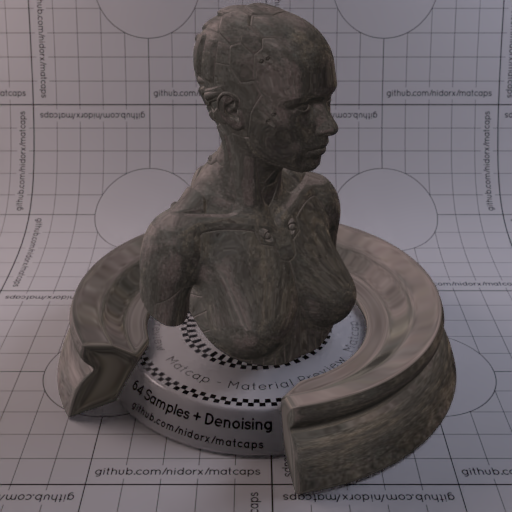

[[1024px](https://github.com/nidorx/matcaps/raw/master/1024/36312E_36312E_726461_59504D.png)]
[[512px](https://github.com/nidorx/matcaps/raw/master/512/36312E_36312E_726461_59504D-512px.png)]
[[256px](https://github.com/nidorx/matcaps/raw/master/256/36312E_36312E_726461_59504D-256px.png)]
[[128px](https://github.com/nidorx/matcaps/raw/master/128/36312E_36312E_726461_59504D-128px.png)]
[[64px](https://github.com/nidorx/matcaps/raw/master/64/36312E_36312E_726461_59504D-64px.png)]
[[ZBrush Material (ZMT)](https://github.com/nidorx/matcaps/raw/master/zmt/36312E_36312E_726461_59504D.zmt)]

---
### 365123_365123_C6E5A3_A8D18D
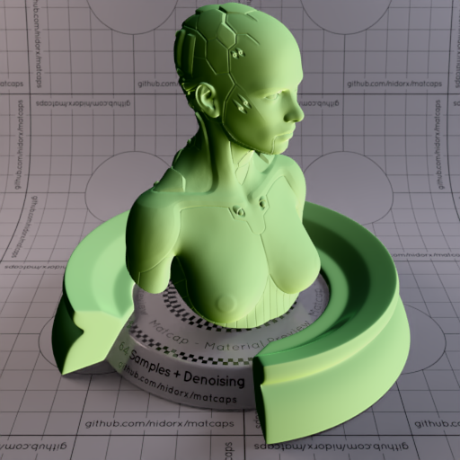

[[1024px](https://github.com/nidorx/matcaps/raw/master/1024/365123_365123_C6E5A3_A8D18D.png)]
[[512px](https://github.com/nidorx/matcaps/raw/master/512/365123_365123_C6E5A3_A8D18D-512px.png)]
[[256px](https://github.com/nidorx/matcaps/raw/master/256/365123_365123_C6E5A3_A8D18D-256px.png)]
[[128px](https://github.com/nidorx/matcaps/raw/master/128/365123_365123_C6E5A3_A8D18D-128px.png)]
[[64px](https://github.com/nidorx/matcaps/raw/master/64/365123_365123_C6E5A3_A8D18D-64px.png)]
[[ZBrush Material (ZMT)](https://github.com/nidorx/matcaps/raw/master/zmt/365123_365123_C6E5A3_A8D18D.zmt)]

---
### 36C8FA_36C8FA_176ACB_24A7EF
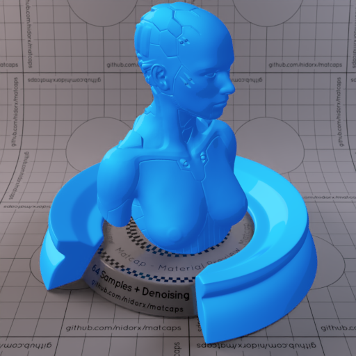

[[1024px](https://github.com/nidorx/matcaps/raw/master/1024/36C8FA_36C8FA_176ACB_24A7EF.png)]
[[512px](https://github.com/nidorx/matcaps/raw/master/512/36C8FA_36C8FA_176ACB_24A7EF-512px.png)]
[[256px](https://github.com/nidorx/matcaps/raw/master/256/36C8FA_36C8FA_176ACB_24A7EF-256px.png)]
[[128px](https://github.com/nidorx/matcaps/raw/master/128/36C8FA_36C8FA_176ACB_24A7EF-128px.png)]
[[64px](https://github.com/nidorx/matcaps/raw/master/64/36C8FA_36C8FA_176ACB_24A7EF-64px.png)]
[~~ZBrush Material (ZMT)~~]

---
### 37C337_37C337_279F27_186018
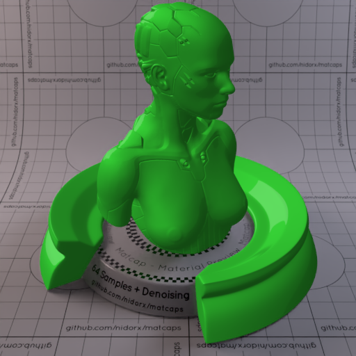

[[1024px](https://github.com/nidorx/matcaps/raw/master/1024/37C337_37C337_279F27_186018.png)]
[[512px](https://github.com/nidorx/matcaps/raw/master/512/37C337_37C337_279F27_186018-512px.png)]
[[256px](https://github.com/nidorx/matcaps/raw/master/256/37C337_37C337_279F27_186018-256px.png)]
[[128px](https://github.com/nidorx/matcaps/raw/master/128/37C337_37C337_279F27_186018-128px.png)]
[[64px](https://github.com/nidorx/matcaps/raw/master/64/37C337_37C337_279F27_186018-64px.png)]
[~~ZBrush Material (ZMT)~~]

---
### 385264_385264_A1D3E2_86ADC1

[[1024px](https://github.com/nidorx/matcaps/raw/master/1024/385264_385264_A1D3E2_86ADC1.png)]
[[512px](https://github.com/nidorx/matcaps/raw/master/512/385264_385264_A1D3E2_86ADC1-512px.png)]
[[256px](https://github.com/nidorx/matcaps/raw/master/256/385264_385264_A1D3E2_86ADC1-256px.png)]
[[128px](https://github.com/nidorx/matcaps/raw/master/128/385264_385264_A1D3E2_86ADC1-128px.png)]
[[64px](https://github.com/nidorx/matcaps/raw/master/64/385264_385264_A1D3E2_86ADC1-64px.png)]
[[ZBrush Material (ZMT)](https://github.com/nidorx/matcaps/raw/master/zmt/385264_385264_A1D3E2_86ADC1.zmt)]

---
### 385862_385862_6D8B8D_647B80
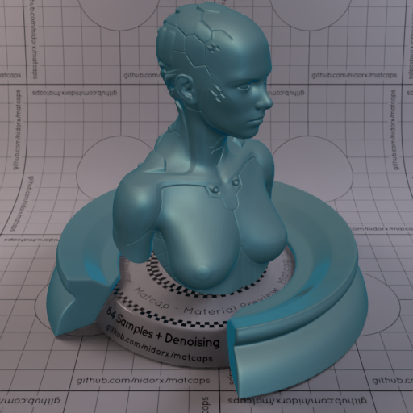
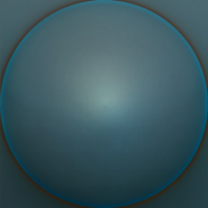

[[1024px](https://github.com/nidorx/matcaps/raw/master/1024/385862_385862_6D8B8D_647B80.png)]
[[512px](https://github.com/nidorx/matcaps/raw/master/512/385862_385862_6D8B8D_647B80-512px.png)]
[[256px](https://github.com/nidorx/matcaps/raw/master/256/385862_385862_6D8B8D_647B80-256px.png)]
[[128px](https://github.com/nidorx/matcaps/raw/master/128/385862_385862_6D8B8D_647B80-128px.png)]
[[64px](https://github.com/nidorx/matcaps/raw/master/64/385862_385862_6D8B8D_647B80-64px.png)]
[[ZBrush Material (ZMT)](https://github.com/nidorx/matcaps/raw/master/zmt/385862_385862_6D8B8D_647B80.zmt)]

---
### 386169_386169_A9CFDB_153C23

[[1024px](https://github.com/nidorx/matcaps/raw/master/1024/386169_386169_A9CFDB_153C23.png)]
[[512px](https://github.com/nidorx/matcaps/raw/master/512/386169_386169_A9CFDB_153C23-512px.png)]
[[256px](https://github.com/nidorx/matcaps/raw/master/256/386169_386169_A9CFDB_153C23-256px.png)]
[[128px](https://github.com/nidorx/matcaps/raw/master/128/386169_386169_A9CFDB_153C23-128px.png)]
[[64px](https://github.com/nidorx/matcaps/raw/master/64/386169_386169_A9CFDB_153C23-64px.png)]
[[ZBrush Material (ZMT)](https://github.com/nidorx/matcaps/raw/master/zmt/386169_386169_A9CFDB_153C23.zmt)]

---
### 38925D_38925D_142B23_1D4835
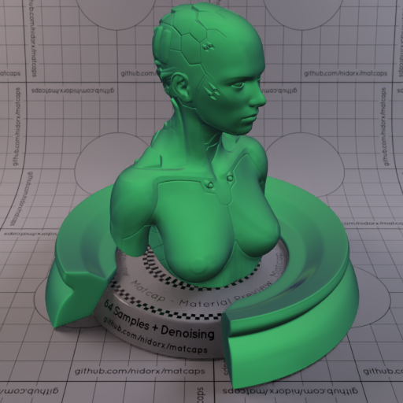
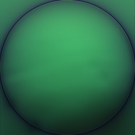

[[1024px](https://github.com/nidorx/matcaps/raw/master/1024/38925D_38925D_142B23_1D4835.png)]
[[512px](https://github.com/nidorx/matcaps/raw/master/512/38925D_38925D_142B23_1D4835-512px.png)]
[[256px](https://github.com/nidorx/matcaps/raw/master/256/38925D_38925D_142B23_1D4835-256px.png)]
[[128px](https://github.com/nidorx/matcaps/raw/master/128/38925D_38925D_142B23_1D4835-128px.png)]
[[64px](https://github.com/nidorx/matcaps/raw/master/64/38925D_38925D_142B23_1D4835-64px.png)]
[[ZBrush Material (ZMT)](https://github.com/nidorx/matcaps/raw/master/zmt/38925D_38925D_142B23_1D4835.zmt)]

---
### 392307_392307_B3AE7D_6D5618

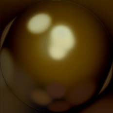

[[1024px](https://github.com/nidorx/matcaps/raw/master/1024/392307_392307_B3AE7D_6D5618.png)]
[[512px](https://github.com/nidorx/matcaps/raw/master/512/392307_392307_B3AE7D_6D5618-512px.png)]
[[256px](https://github.com/nidorx/matcaps/raw/master/256/392307_392307_B3AE7D_6D5618-256px.png)]
[[128px](https://github.com/nidorx/matcaps/raw/master/128/392307_392307_B3AE7D_6D5618-128px.png)]
[[64px](https://github.com/nidorx/matcaps/raw/master/64/392307_392307_B3AE7D_6D5618-64px.png)]
[~~ZBrush Material (ZMT)~~]

---
### 39433A_39433A_65866E_86BF8B
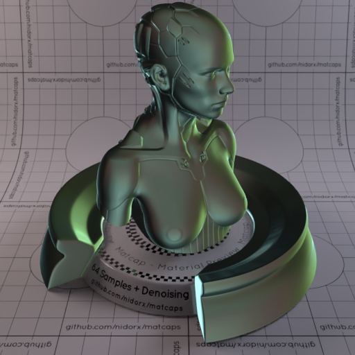

[[1024px](https://github.com/nidorx/matcaps/raw/master/1024/39433A_39433A_65866E_86BF8B.png)]
[[512px](https://github.com/nidorx/matcaps/raw/master/512/39433A_39433A_65866E_86BF8B-512px.png)]
[[256px](https://github.com/nidorx/matcaps/raw/master/256/39433A_39433A_65866E_86BF8B-256px.png)]
[[128px](https://github.com/nidorx/matcaps/raw/master/128/39433A_39433A_65866E_86BF8B-128px.png)]
[[64px](https://github.com/nidorx/matcaps/raw/master/64/39433A_39433A_65866E_86BF8B-64px.png)]
[[ZBrush Material (ZMT)](https://github.com/nidorx/matcaps/raw/master/zmt/39433A_39433A_65866E_86BF8B.zmt)]

---
### 394641_394641_B1A67E_75BEBE

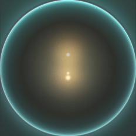

[[1024px](https://github.com/nidorx/matcaps/raw/master/1024/394641_394641_B1A67E_75BEBE.png)]
[[512px](https://github.com/nidorx/matcaps/raw/master/512/394641_394641_B1A67E_75BEBE-512px.png)]
[[256px](https://github.com/nidorx/matcaps/raw/master/256/394641_394641_B1A67E_75BEBE-256px.png)]
[[128px](https://github.com/nidorx/matcaps/raw/master/128/394641_394641_B1A67E_75BEBE-128px.png)]
[[64px](https://github.com/nidorx/matcaps/raw/master/64/394641_394641_B1A67E_75BEBE-64px.png)]
[[ZBrush Material (ZMT)](https://github.com/nidorx/matcaps/raw/master/zmt/394641_394641_B1A67E_75BEBE.zmt)]

---
### 3A2412_3A2412_A78B5F_705434

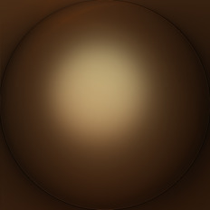

[[1024px](https://github.com/nidorx/matcaps/raw/master/1024/3A2412_3A2412_A78B5F_705434.png)]
[[512px](https://github.com/nidorx/matcaps/raw/master/512/3A2412_3A2412_A78B5F_705434-512px.png)]
[[256px](https://github.com/nidorx/matcaps/raw/master/256/3A2412_3A2412_A78B5F_705434-256px.png)]
[[128px](https://github.com/nidorx/matcaps/raw/master/128/3A2412_3A2412_A78B5F_705434-128px.png)]
[[64px](https://github.com/nidorx/matcaps/raw/master/64/3A2412_3A2412_A78B5F_705434-64px.png)]
[~~ZBrush Material (ZMT)~~]

---
### 3A3329_3A3329_C9B090_928069

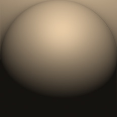

[[1024px](https://github.com/nidorx/matcaps/raw/master/1024/3A3329_3A3329_C9B090_928069.png)]
[[512px](https://github.com/nidorx/matcaps/raw/master/512/3A3329_3A3329_C9B090_928069-512px.png)]
[[256px](https://github.com/nidorx/matcaps/raw/master/256/3A3329_3A3329_C9B090_928069-256px.png)]
[[128px](https://github.com/nidorx/matcaps/raw/master/128/3A3329_3A3329_C9B090_928069-128px.png)]
[[64px](https://github.com/nidorx/matcaps/raw/master/64/3A3329_3A3329_C9B090_928069-64px.png)]
[[ZBrush Material (ZMT)](https://github.com/nidorx/matcaps/raw/master/zmt/3A3329_3A3329_C9B090_928069.zmt)]

---
### 3A3D37_3A3D37_7E7F75_BCBFB6
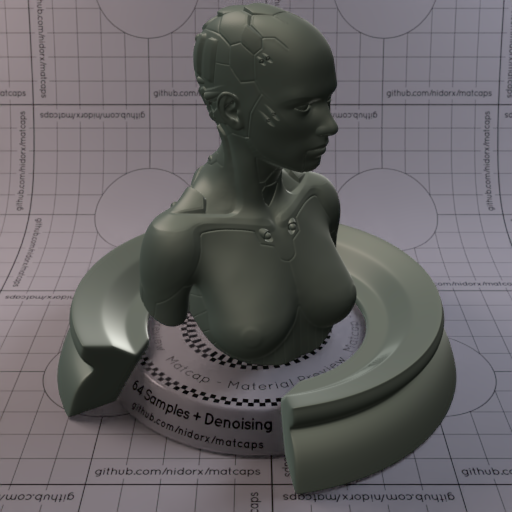

[[1024px](https://github.com/nidorx/matcaps/raw/master/1024/3A3D37_3A3D37_7E7F75_BCBFB6.png)]
[[512px](https://github.com/nidorx/matcaps/raw/master/512/3A3D37_3A3D37_7E7F75_BCBFB6-512px.png)]
[[256px](https://github.com/nidorx/matcaps/raw/master/256/3A3D37_3A3D37_7E7F75_BCBFB6-256px.png)]
[[128px](https://github.com/nidorx/matcaps/raw/master/128/3A3D37_3A3D37_7E7F75_BCBFB6-128px.png)]
[[64px](https://github.com/nidorx/matcaps/raw/master/64/3A3D37_3A3D37_7E7F75_BCBFB6-64px.png)]
[[ZBrush Material (ZMT)](https://github.com/nidorx/matcaps/raw/master/zmt/3A3D37_3A3D37_7E7F75_BCBFB6.zmt)]

---
### 3B3B3B_3B3B3B_C7C7C7_878787

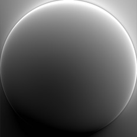

[[1024px](https://github.com/nidorx/matcaps/raw/master/1024/3B3B3B_3B3B3B_C7C7C7_878787.png)]
[[512px](https://github.com/nidorx/matcaps/raw/master/512/3B3B3B_3B3B3B_C7C7C7_878787-512px.png)]
[[256px](https://github.com/nidorx/matcaps/raw/master/256/3B3B3B_3B3B3B_C7C7C7_878787-256px.png)]
[[128px](https://github.com/nidorx/matcaps/raw/master/128/3B3B3B_3B3B3B_C7C7C7_878787-128px.png)]
[[64px](https://github.com/nidorx/matcaps/raw/master/64/3B3B3B_3B3B3B_C7C7C7_878787-64px.png)]
[[ZBrush Material (ZMT)](https://github.com/nidorx/matcaps/raw/master/zmt/3B3B3B_3B3B3B_C7C7C7_878787.zmt)]

---
### 3B3C3F_3B3C3F_DAD9D5_929290

[[1024px](https://github.com/nidorx/matcaps/raw/master/1024/3B3C3F_3B3C3F_DAD9D5_929290.png)]
[[512px](https://github.com/nidorx/matcaps/raw/master/512/3B3C3F_3B3C3F_DAD9D5_929290-512px.png)]
[[256px](https://github.com/nidorx/matcaps/raw/master/256/3B3C3F_3B3C3F_DAD9D5_929290-256px.png)]
[[128px](https://github.com/nidorx/matcaps/raw/master/128/3B3C3F_3B3C3F_DAD9D5_929290-128px.png)]
[[64px](https://github.com/nidorx/matcaps/raw/master/64/3B3C3F_3B3C3F_DAD9D5_929290-64px.png)]
[[ZBrush Material (ZMT)](https://github.com/nidorx/matcaps/raw/master/zmt/3B3C3F_3B3C3F_DAD9D5_929290.zmt)]

---
### 3B4235_3B4235_7B9395_5B716C
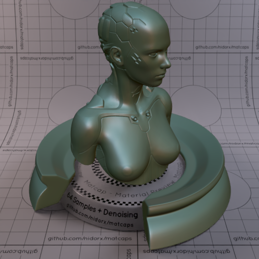
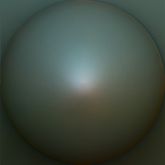

[[1024px](https://github.com/nidorx/matcaps/raw/master/1024/3B4235_3B4235_7B9395_5B716C.png)]
[[512px](https://github.com/nidorx/matcaps/raw/master/512/3B4235_3B4235_7B9395_5B716C-512px.png)]
[[256px](https://github.com/nidorx/matcaps/raw/master/256/3B4235_3B4235_7B9395_5B716C-256px.png)]
[[128px](https://github.com/nidorx/matcaps/raw/master/128/3B4235_3B4235_7B9395_5B716C-128px.png)]
[[64px](https://github.com/nidorx/matcaps/raw/master/64/3B4235_3B4235_7B9395_5B716C-64px.png)]
[[ZBrush Material (ZMT)](https://github.com/nidorx/matcaps/raw/master/zmt/3B4235_3B4235_7B9395_5B716C.zmt)]

---
### 3B6E10_3B6E10_E3F2C3_88AC2E

[[1024px](https://github.com/nidorx/matcaps/raw/master/1024/3B6E10_3B6E10_E3F2C3_88AC2E.png)]
[[512px](https://github.com/nidorx/matcaps/raw/master/512/3B6E10_3B6E10_E3F2C3_88AC2E-512px.png)]
[[256px](https://github.com/nidorx/matcaps/raw/master/256/3B6E10_3B6E10_E3F2C3_88AC2E-256px.png)]
[[128px](https://github.com/nidorx/matcaps/raw/master/128/3B6E10_3B6E10_E3F2C3_88AC2E-128px.png)]
[[64px](https://github.com/nidorx/matcaps/raw/master/64/3B6E10_3B6E10_E3F2C3_88AC2E-64px.png)]
[~~ZBrush Material (ZMT)~~]

---
### 3D1F12_3D1F12_653821_070404

[[1024px](https://github.com/nidorx/matcaps/raw/master/1024/3D1F12_3D1F12_653821_070404.png)]
[[512px](https://github.com/nidorx/matcaps/raw/master/512/3D1F12_3D1F12_653821_070404-512px.png)]
[[256px](https://github.com/nidorx/matcaps/raw/master/256/3D1F12_3D1F12_653821_070404-256px.png)]
[[128px](https://github.com/nidorx/matcaps/raw/master/128/3D1F12_3D1F12_653821_070404-128px.png)]
[[64px](https://github.com/nidorx/matcaps/raw/master/64/3D1F12_3D1F12_653821_070404-64px.png)]
[[ZBrush Material (ZMT)](https://github.com/nidorx/matcaps/raw/master/zmt/3D1F12_3D1F12_653821_070404.zmt)]

---