Huge library of matcap PNG textures organized by color

## Navigation
* [Home](/)
* [Page 1](PAGE-1.md)
* [Page 2](PAGE-2.md)
* [Page 3](PAGE-3.md)
* [Page 4](PAGE-4.md)
* Page 5
* [Page 6](PAGE-6.md)
* [Page 7](PAGE-7.md)
* [Page 8](PAGE-8.md)
## Page 9 Matcaps
### 8F894E_8F894E_DAD79B_C9C384

[[1024px](https://github.com/nidorx/matcaps/raw/master/1024/8F894E_8F894E_DAD79B_C9C384.png)]
[[512px](https://github.com/nidorx/matcaps/raw/master/512/8F894E_8F894E_DAD79B_C9C384-512px.png)]
[[256px](https://github.com/nidorx/matcaps/raw/master/256/8F894E_8F894E_DAD79B_C9C384-256px.png)]
[[128px](https://github.com/nidorx/matcaps/raw/master/128/8F894E_8F894E_DAD79B_C9C384-128px.png)]
[[64px](https://github.com/nidorx/matcaps/raw/master/64/8F894E_8F894E_DAD79B_C9C384-64px.png)]
[~~ZBrush Material (ZMT)~~]

---
### 903B2A_903B2A_EC9888_D96747
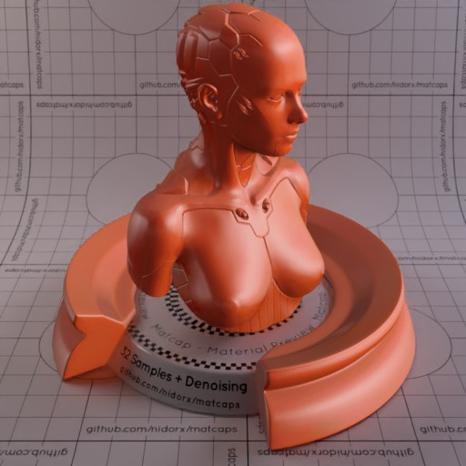

[[1024px](https://github.com/nidorx/matcaps/raw/master/1024/903B2A_903B2A_EC9888_D96747.png)]
[[512px](https://github.com/nidorx/matcaps/raw/master/512/903B2A_903B2A_EC9888_D96747-512px.png)]
[[256px](https://github.com/nidorx/matcaps/raw/master/256/903B2A_903B2A_EC9888_D96747-256px.png)]
[[128px](https://github.com/nidorx/matcaps/raw/master/128/903B2A_903B2A_EC9888_D96747-128px.png)]
[[64px](https://github.com/nidorx/matcaps/raw/master/64/903B2A_903B2A_EC9888_D96747-64px.png)]
[[ZBrush Material (ZMT)](https://github.com/nidorx/matcaps/raw/master/zmt/903B2A_903B2A_EC9888_D96747.zmt)]

---
### 908E8E_908E8E_292828_454444
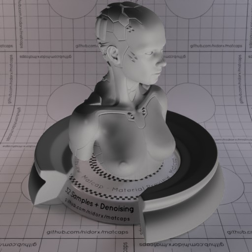

[[1024px](https://github.com/nidorx/matcaps/raw/master/1024/908E8E_908E8E_292828_454444.png)]
[[512px](https://github.com/nidorx/matcaps/raw/master/512/908E8E_908E8E_292828_454444-512px.png)]
[[256px](https://github.com/nidorx/matcaps/raw/master/256/908E8E_908E8E_292828_454444-256px.png)]
[[128px](https://github.com/nidorx/matcaps/raw/master/128/908E8E_908E8E_292828_454444-128px.png)]
[[64px](https://github.com/nidorx/matcaps/raw/master/64/908E8E_908E8E_292828_454444-64px.png)]
[[ZBrush Material (ZMT)](https://github.com/nidorx/matcaps/raw/master/zmt/908E8E_908E8E_292828_454444.zmt)]

---
### 909473_909473_555D4B_C2CCA2
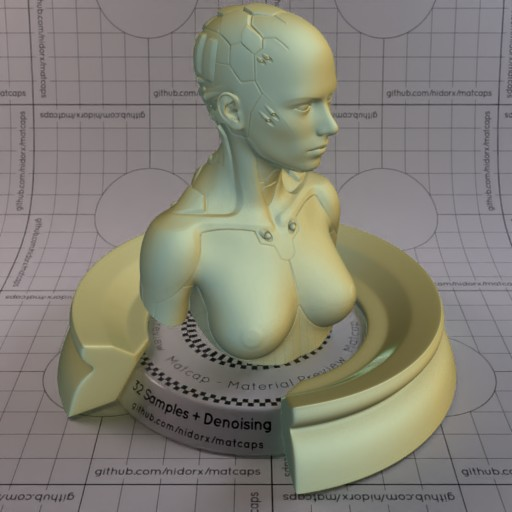
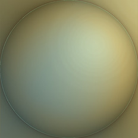

[[1024px](https://github.com/nidorx/matcaps/raw/master/1024/909473_909473_555D4B_C2CCA2.png)]
[[512px](https://github.com/nidorx/matcaps/raw/master/512/909473_909473_555D4B_C2CCA2-512px.png)]
[[256px](https://github.com/nidorx/matcaps/raw/master/256/909473_909473_555D4B_C2CCA2-256px.png)]
[[128px](https://github.com/nidorx/matcaps/raw/master/128/909473_909473_555D4B_C2CCA2-128px.png)]
[[64px](https://github.com/nidorx/matcaps/raw/master/64/909473_909473_555D4B_C2CCA2-64px.png)]
[[ZBrush Material (ZMT)](https://github.com/nidorx/matcaps/raw/master/zmt/909473_909473_555D4B_C2CCA2.zmt)]

---
### 910E5A_910E5A_E127C3_CF1CA3
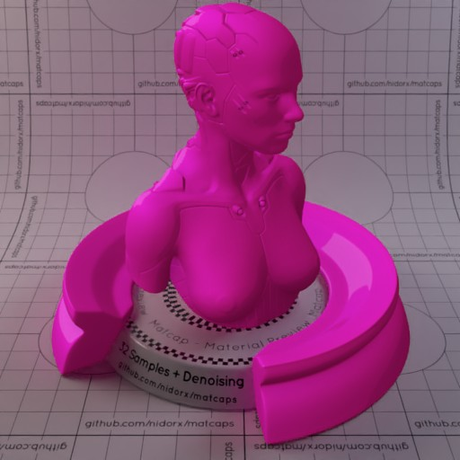
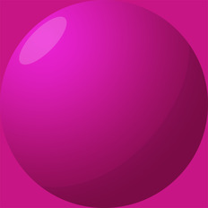

[[1024px](https://github.com/nidorx/matcaps/raw/master/1024/910E5A_910E5A_E127C3_CF1CA3.png)]
[[512px](https://github.com/nidorx/matcaps/raw/master/512/910E5A_910E5A_E127C3_CF1CA3-512px.png)]
[[256px](https://github.com/nidorx/matcaps/raw/master/256/910E5A_910E5A_E127C3_CF1CA3-256px.png)]
[[128px](https://github.com/nidorx/matcaps/raw/master/128/910E5A_910E5A_E127C3_CF1CA3-128px.png)]
[[64px](https://github.com/nidorx/matcaps/raw/master/64/910E5A_910E5A_E127C3_CF1CA3-64px.png)]
[~~ZBrush Material (ZMT)~~]

---
### 927253_927253_EECEA7_D8B792
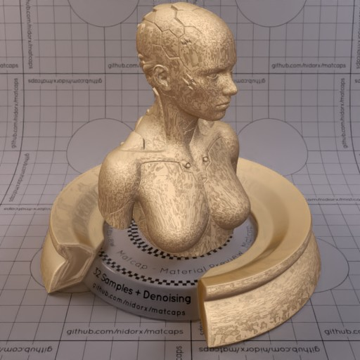

[[1024px](https://github.com/nidorx/matcaps/raw/master/1024/927253_927253_EECEA7_D8B792.png)]
[[512px](https://github.com/nidorx/matcaps/raw/master/512/927253_927253_EECEA7_D8B792-512px.png)]
[[256px](https://github.com/nidorx/matcaps/raw/master/256/927253_927253_EECEA7_D8B792-256px.png)]
[[128px](https://github.com/nidorx/matcaps/raw/master/128/927253_927253_EECEA7_D8B792-128px.png)]
[[64px](https://github.com/nidorx/matcaps/raw/master/64/927253_927253_EECEA7_D8B792-64px.png)]
[[ZBrush Material (ZMT)](https://github.com/nidorx/matcaps/raw/master/zmt/927253_927253_EECEA7_D8B792.zmt)]

---
### 935555_935555_F6DAD9_D39393
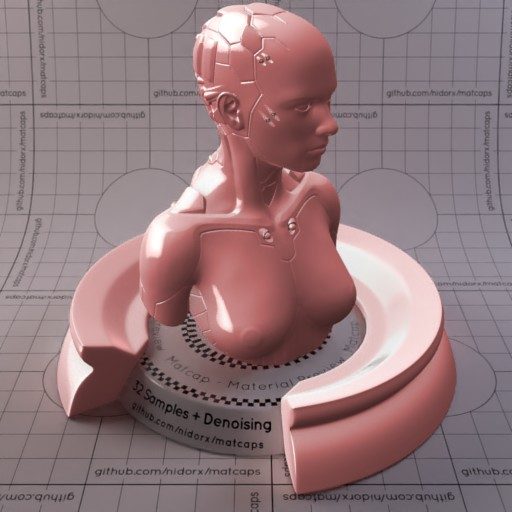

[[1024px](https://github.com/nidorx/matcaps/raw/master/1024/935555_935555_F6DAD9_D39393.png)]
[[512px](https://github.com/nidorx/matcaps/raw/master/512/935555_935555_F6DAD9_D39393-512px.png)]
[[256px](https://github.com/nidorx/matcaps/raw/master/256/935555_935555_F6DAD9_D39393-256px.png)]
[[128px](https://github.com/nidorx/matcaps/raw/master/128/935555_935555_F6DAD9_D39393-128px.png)]
[[64px](https://github.com/nidorx/matcaps/raw/master/64/935555_935555_F6DAD9_D39393-64px.png)]
[[ZBrush Material (ZMT)](https://github.com/nidorx/matcaps/raw/master/zmt/935555_935555_F6DAD9_D39393.zmt)]

---
### 942967_942967_D292B5_C76E9E

[[1024px](https://github.com/nidorx/matcaps/raw/master/1024/942967_942967_D292B5_C76E9E.png)]
[[512px](https://github.com/nidorx/matcaps/raw/master/512/942967_942967_D292B5_C76E9E-512px.png)]
[[256px](https://github.com/nidorx/matcaps/raw/master/256/942967_942967_D292B5_C76E9E-256px.png)]
[[128px](https://github.com/nidorx/matcaps/raw/master/128/942967_942967_D292B5_C76E9E-128px.png)]
[[64px](https://github.com/nidorx/matcaps/raw/master/64/942967_942967_D292B5_C76E9E-64px.png)]
[[ZBrush Material (ZMT)](https://github.com/nidorx/matcaps/raw/master/zmt/942967_942967_D292B5_C76E9E.zmt)]

---
### 945D43_945D43_E5AAA0_351F14
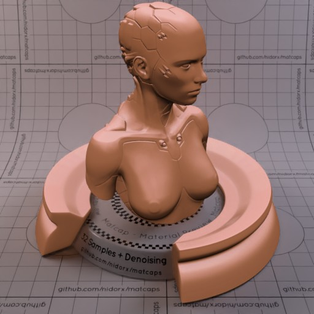
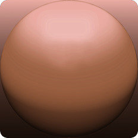

[[1024px](https://github.com/nidorx/matcaps/raw/master/1024/945D43_945D43_E5AAA0_351F14.png)]
[[512px](https://github.com/nidorx/matcaps/raw/master/512/945D43_945D43_E5AAA0_351F14-512px.png)]
[[256px](https://github.com/nidorx/matcaps/raw/master/256/945D43_945D43_E5AAA0_351F14-256px.png)]
[[128px](https://github.com/nidorx/matcaps/raw/master/128/945D43_945D43_E5AAA0_351F14-128px.png)]
[[64px](https://github.com/nidorx/matcaps/raw/master/64/945D43_945D43_E5AAA0_351F14-64px.png)]
[~~ZBrush Material (ZMT)~~]

---
### 9650CA_9650CA_46236A_7239A6
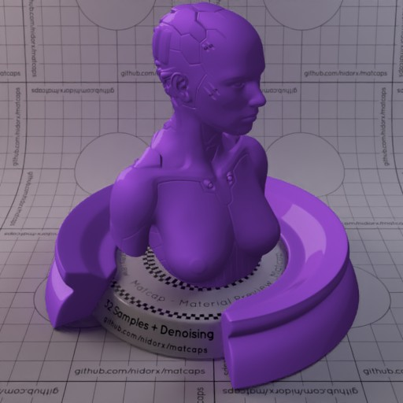

[[1024px](https://github.com/nidorx/matcaps/raw/master/1024/9650CA_9650CA_46236A_7239A6.png)]
[[512px](https://github.com/nidorx/matcaps/raw/master/512/9650CA_9650CA_46236A_7239A6-512px.png)]
[[256px](https://github.com/nidorx/matcaps/raw/master/256/9650CA_9650CA_46236A_7239A6-256px.png)]
[[128px](https://github.com/nidorx/matcaps/raw/master/128/9650CA_9650CA_46236A_7239A6-128px.png)]
[[64px](https://github.com/nidorx/matcaps/raw/master/64/9650CA_9650CA_46236A_7239A6-64px.png)]
[~~ZBrush Material (ZMT)~~]

---
### 965146_965146_2B191D_DF7A5C
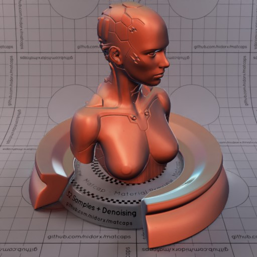

[[1024px](https://github.com/nidorx/matcaps/raw/master/1024/965146_965146_2B191D_DF7A5C.png)]
[[512px](https://github.com/nidorx/matcaps/raw/master/512/965146_965146_2B191D_DF7A5C-512px.png)]
[[256px](https://github.com/nidorx/matcaps/raw/master/256/965146_965146_2B191D_DF7A5C-256px.png)]
[[128px](https://github.com/nidorx/matcaps/raw/master/128/965146_965146_2B191D_DF7A5C-128px.png)]
[[64px](https://github.com/nidorx/matcaps/raw/master/64/965146_965146_2B191D_DF7A5C-64px.png)]
[[ZBrush Material (ZMT)](https://github.com/nidorx/matcaps/raw/master/zmt/965146_965146_2B191D_DF7A5C.zmt)]

---
### 977970_977970_E1D9D8_DAC8C1

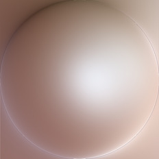

[[1024px](https://github.com/nidorx/matcaps/raw/master/1024/977970_977970_E1D9D8_DAC8C1.png)]
[[512px](https://github.com/nidorx/matcaps/raw/master/512/977970_977970_E1D9D8_DAC8C1-512px.png)]
[[256px](https://github.com/nidorx/matcaps/raw/master/256/977970_977970_E1D9D8_DAC8C1-256px.png)]
[[128px](https://github.com/nidorx/matcaps/raw/master/128/977970_977970_E1D9D8_DAC8C1-128px.png)]
[[64px](https://github.com/nidorx/matcaps/raw/master/64/977970_977970_E1D9D8_DAC8C1-64px.png)]
[[ZBrush Material (ZMT)](https://github.com/nidorx/matcaps/raw/master/zmt/977970_977970_E1D9D8_DAC8C1.zmt)]

---
### 989784_989784_665542_BFECE5
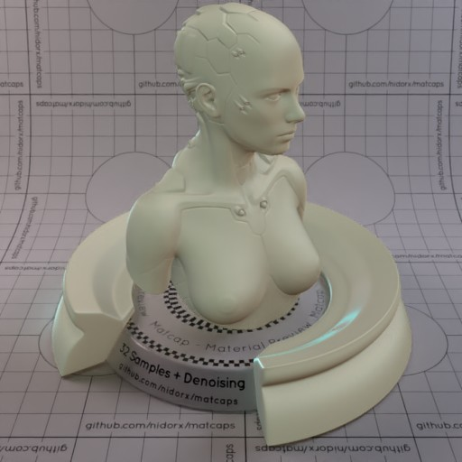

[[1024px](https://github.com/nidorx/matcaps/raw/master/1024/989784_989784_665542_BFECE5.png)]
[[512px](https://github.com/nidorx/matcaps/raw/master/512/989784_989784_665542_BFECE5-512px.png)]
[[256px](https://github.com/nidorx/matcaps/raw/master/256/989784_989784_665542_BFECE5-256px.png)]
[[128px](https://github.com/nidorx/matcaps/raw/master/128/989784_989784_665542_BFECE5-128px.png)]
[[64px](https://github.com/nidorx/matcaps/raw/master/64/989784_989784_665542_BFECE5-64px.png)]
[[ZBrush Material (ZMT)](https://github.com/nidorx/matcaps/raw/master/zmt/989784_989784_665542_BFECE5.zmt)]

---
### 9B4816_9B4816_E8A138_CC7421
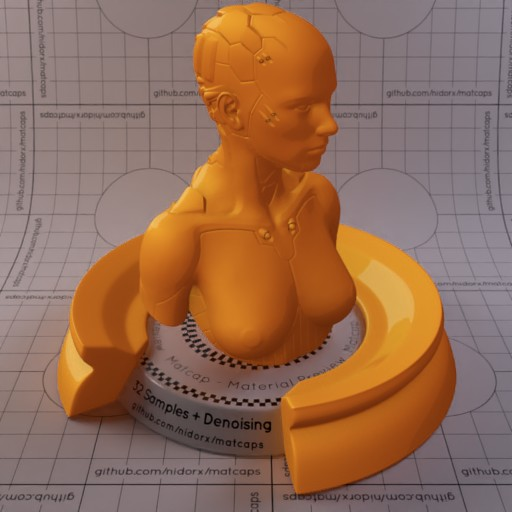

[[1024px](https://github.com/nidorx/matcaps/raw/master/1024/9B4816_9B4816_E8A138_CC7421.png)]
[[512px](https://github.com/nidorx/matcaps/raw/master/512/9B4816_9B4816_E8A138_CC7421-512px.png)]
[[256px](https://github.com/nidorx/matcaps/raw/master/256/9B4816_9B4816_E8A138_CC7421-256px.png)]
[[128px](https://github.com/nidorx/matcaps/raw/master/128/9B4816_9B4816_E8A138_CC7421-128px.png)]
[[64px](https://github.com/nidorx/matcaps/raw/master/64/9B4816_9B4816_E8A138_CC7421-64px.png)]
[~~ZBrush Material (ZMT)~~]

---
### 9B9994_9B9994_E1E0DB_474643
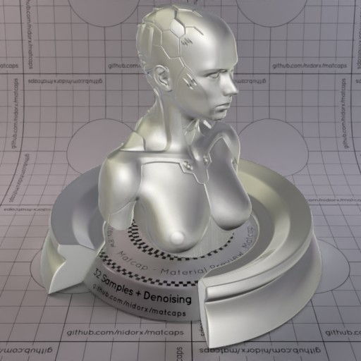

[[1024px](https://github.com/nidorx/matcaps/raw/master/1024/9B9994_9B9994_E1E0DB_474643.png)]
[[512px](https://github.com/nidorx/matcaps/raw/master/512/9B9994_9B9994_E1E0DB_474643-512px.png)]
[[256px](https://github.com/nidorx/matcaps/raw/master/256/9B9994_9B9994_E1E0DB_474643-256px.png)]
[[128px](https://github.com/nidorx/matcaps/raw/master/128/9B9994_9B9994_E1E0DB_474643-128px.png)]
[[64px](https://github.com/nidorx/matcaps/raw/master/64/9B9994_9B9994_E1E0DB_474643-64px.png)]
[[ZBrush Material (ZMT)](https://github.com/nidorx/matcaps/raw/master/zmt/9B9994_9B9994_E1E0DB_474643.zmt)]

---
### 9CC338_9CC338_4E671A_799F27
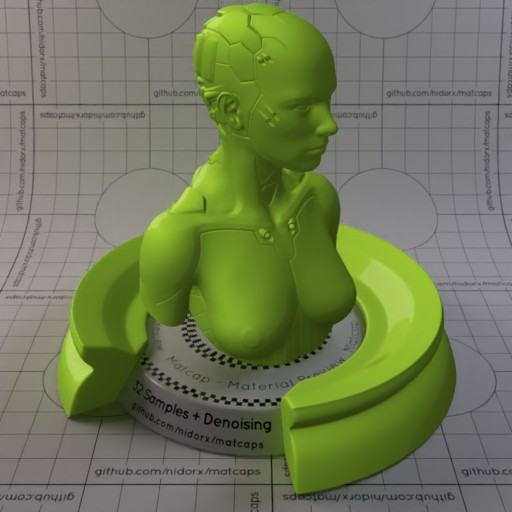

[[1024px](https://github.com/nidorx/matcaps/raw/master/1024/9CC338_9CC338_4E671A_799F27.png)]
[[512px](https://github.com/nidorx/matcaps/raw/master/512/9CC338_9CC338_4E671A_799F27-512px.png)]
[[256px](https://github.com/nidorx/matcaps/raw/master/256/9CC338_9CC338_4E671A_799F27-256px.png)]
[[128px](https://github.com/nidorx/matcaps/raw/master/128/9CC338_9CC338_4E671A_799F27-128px.png)]
[[64px](https://github.com/nidorx/matcaps/raw/master/64/9CC338_9CC338_4E671A_799F27-64px.png)]
[~~ZBrush Material (ZMT)~~]

---
### 9D4343_9D4343_E38989_D37474
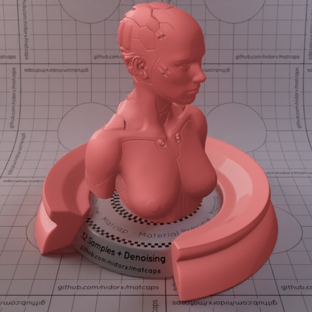
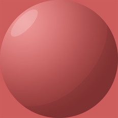

[[1024px](https://github.com/nidorx/matcaps/raw/master/1024/9D4343_9D4343_E38989_D37474.png)]
[[512px](https://github.com/nidorx/matcaps/raw/master/512/9D4343_9D4343_E38989_D37474-512px.png)]
[[256px](https://github.com/nidorx/matcaps/raw/master/256/9D4343_9D4343_E38989_D37474-256px.png)]
[[128px](https://github.com/nidorx/matcaps/raw/master/128/9D4343_9D4343_E38989_D37474-128px.png)]
[[64px](https://github.com/nidorx/matcaps/raw/master/64/9D4343_9D4343_E38989_D37474-64px.png)]
[~~ZBrush Material (ZMT)~~]

---
### 9D602E_9D602E_E4C363_D5A64F
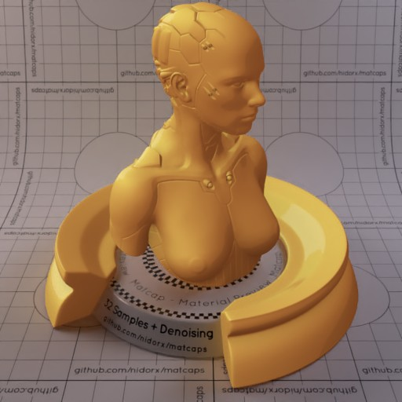

[[1024px](https://github.com/nidorx/matcaps/raw/master/1024/9D602E_9D602E_E4C363_D5A64F.png)]
[[512px](https://github.com/nidorx/matcaps/raw/master/512/9D602E_9D602E_E4C363_D5A64F-512px.png)]
[[256px](https://github.com/nidorx/matcaps/raw/master/256/9D602E_9D602E_E4C363_D5A64F-256px.png)]
[[128px](https://github.com/nidorx/matcaps/raw/master/128/9D602E_9D602E_E4C363_D5A64F-128px.png)]
[[64px](https://github.com/nidorx/matcaps/raw/master/64/9D602E_9D602E_E4C363_D5A64F-64px.png)]
[~~ZBrush Material (ZMT)~~]

---
### 9D8F84_9D8F84_5D4544_D9D3C9
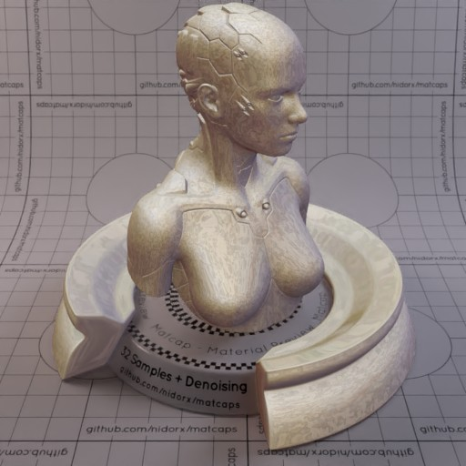
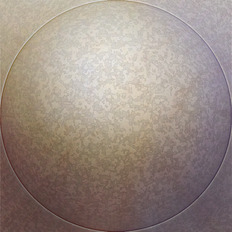

[[1024px](https://github.com/nidorx/matcaps/raw/master/1024/9D8F84_9D8F84_5D4544_D9D3C9.png)]
[[512px](https://github.com/nidorx/matcaps/raw/master/512/9D8F84_9D8F84_5D4544_D9D3C9-512px.png)]
[[256px](https://github.com/nidorx/matcaps/raw/master/256/9D8F84_9D8F84_5D4544_D9D3C9-256px.png)]
[[128px](https://github.com/nidorx/matcaps/raw/master/128/9D8F84_9D8F84_5D4544_D9D3C9-128px.png)]
[[64px](https://github.com/nidorx/matcaps/raw/master/64/9D8F84_9D8F84_5D4544_D9D3C9-64px.png)]
[[ZBrush Material (ZMT)](https://github.com/nidorx/matcaps/raw/master/zmt/9D8F84_9D8F84_5D4544_D9D3C9.zmt)]

---
### 9E9C77_9E9C77_6E6F4E_7C7C54
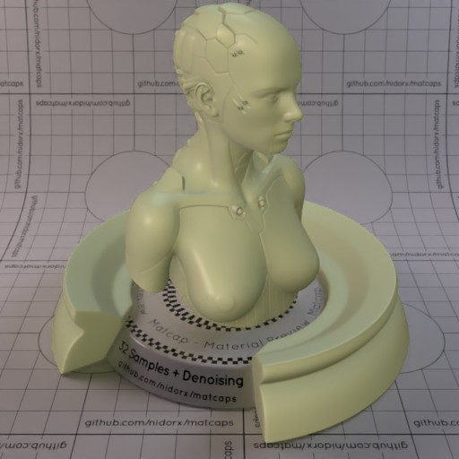
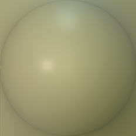

[[1024px](https://github.com/nidorx/matcaps/raw/master/1024/9E9C77_9E9C77_6E6F4E_7C7C54.png)]
[[512px](https://github.com/nidorx/matcaps/raw/master/512/9E9C77_9E9C77_6E6F4E_7C7C54-512px.png)]
[[256px](https://github.com/nidorx/matcaps/raw/master/256/9E9C77_9E9C77_6E6F4E_7C7C54-256px.png)]
[[128px](https://github.com/nidorx/matcaps/raw/master/128/9E9C77_9E9C77_6E6F4E_7C7C54-128px.png)]
[[64px](https://github.com/nidorx/matcaps/raw/master/64/9E9C77_9E9C77_6E6F4E_7C7C54-64px.png)]
[[ZBrush Material (ZMT)](https://github.com/nidorx/matcaps/raw/master/zmt/9E9C77_9E9C77_6E6F4E_7C7C54.zmt)]

---
### 9F9F9F_9F9F9F_E4E4E4_D4D4D4
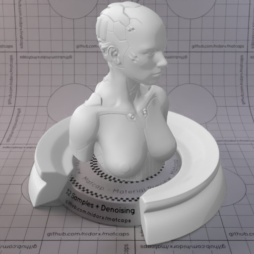

[[1024px](https://github.com/nidorx/matcaps/raw/master/1024/9F9F9F_9F9F9F_E4E4E4_D4D4D4.png)]
[[512px](https://github.com/nidorx/matcaps/raw/master/512/9F9F9F_9F9F9F_E4E4E4_D4D4D4-512px.png)]
[[256px](https://github.com/nidorx/matcaps/raw/master/256/9F9F9F_9F9F9F_E4E4E4_D4D4D4-256px.png)]
[[128px](https://github.com/nidorx/matcaps/raw/master/128/9F9F9F_9F9F9F_E4E4E4_D4D4D4-128px.png)]
[[64px](https://github.com/nidorx/matcaps/raw/master/64/9F9F9F_9F9F9F_E4E4E4_D4D4D4-64px.png)]
[~~ZBrush Material (ZMT)~~]

---
### A27216_A27216_E9D036_D0AB24
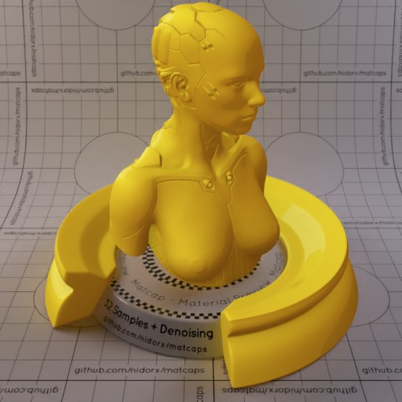
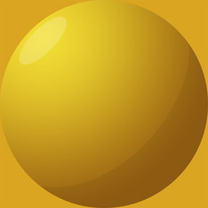

[[1024px](https://github.com/nidorx/matcaps/raw/master/1024/A27216_A27216_E9D036_D0AB24.png)]
[[512px](https://github.com/nidorx/matcaps/raw/master/512/A27216_A27216_E9D036_D0AB24-512px.png)]
[[256px](https://github.com/nidorx/matcaps/raw/master/256/A27216_A27216_E9D036_D0AB24-256px.png)]
[[128px](https://github.com/nidorx/matcaps/raw/master/128/A27216_A27216_E9D036_D0AB24-128px.png)]
[[64px](https://github.com/nidorx/matcaps/raw/master/64/A27216_A27216_E9D036_D0AB24-64px.png)]
[~~ZBrush Material (ZMT)~~]

---
### A28766_A28766_E4D6C3_D6C4AA-1
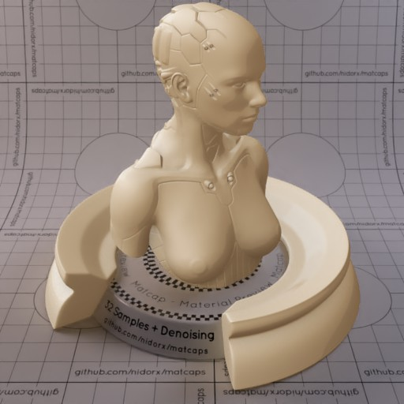

[[1024px](https://github.com/nidorx/matcaps/raw/master/1024/A28766_A28766_E4D6C3_D6C4AA-1.png)]
[[512px](https://github.com/nidorx/matcaps/raw/master/512/A28766_A28766_E4D6C3_D6C4AA-1-512px.png)]
[[256px](https://github.com/nidorx/matcaps/raw/master/256/A28766_A28766_E4D6C3_D6C4AA-1-256px.png)]
[[128px](https://github.com/nidorx/matcaps/raw/master/128/A28766_A28766_E4D6C3_D6C4AA-1-128px.png)]
[[64px](https://github.com/nidorx/matcaps/raw/master/64/A28766_A28766_E4D6C3_D6C4AA-1-64px.png)]
[~~ZBrush Material (ZMT)~~]

---
### A28766_A28766_E4D6C3_D6C4AA

[[1024px](https://github.com/nidorx/matcaps/raw/master/1024/A28766_A28766_E4D6C3_D6C4AA.png)]
[[512px](https://github.com/nidorx/matcaps/raw/master/512/A28766_A28766_E4D6C3_D6C4AA-512px.png)]
[[256px](https://github.com/nidorx/matcaps/raw/master/256/A28766_A28766_E4D6C3_D6C4AA-256px.png)]
[[128px](https://github.com/nidorx/matcaps/raw/master/128/A28766_A28766_E4D6C3_D6C4AA-128px.png)]
[[64px](https://github.com/nidorx/matcaps/raw/master/64/A28766_A28766_E4D6C3_D6C4AA-64px.png)]
[~~ZBrush Material (ZMT)~~]

---
### A48DA4_A48DA4_E8DDE8_C9B7C9
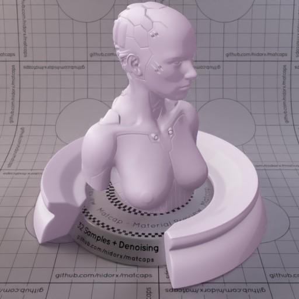

[[1024px](https://github.com/nidorx/matcaps/raw/master/1024/A48DA4_A48DA4_E8DDE8_C9B7C9.png)]
[[512px](https://github.com/nidorx/matcaps/raw/master/512/A48DA4_A48DA4_E8DDE8_C9B7C9-512px.png)]
[[256px](https://github.com/nidorx/matcaps/raw/master/256/A48DA4_A48DA4_E8DDE8_C9B7C9-256px.png)]
[[128px](https://github.com/nidorx/matcaps/raw/master/128/A48DA4_A48DA4_E8DDE8_C9B7C9-128px.png)]
[[64px](https://github.com/nidorx/matcaps/raw/master/64/A48DA4_A48DA4_E8DDE8_C9B7C9-64px.png)]
[~~ZBrush Material (ZMT)~~]

---
### A49994_A49994_695244_C4C2CF
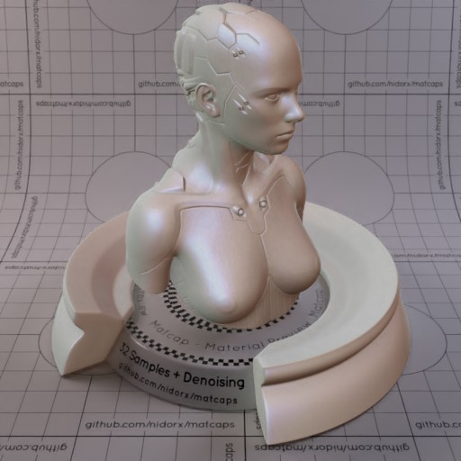

[[1024px](https://github.com/nidorx/matcaps/raw/master/1024/A49994_A49994_695244_C4C2CF.png)]
[[512px](https://github.com/nidorx/matcaps/raw/master/512/A49994_A49994_695244_C4C2CF-512px.png)]
[[256px](https://github.com/nidorx/matcaps/raw/master/256/A49994_A49994_695244_C4C2CF-256px.png)]
[[128px](https://github.com/nidorx/matcaps/raw/master/128/A49994_A49994_695244_C4C2CF-128px.png)]
[[64px](https://github.com/nidorx/matcaps/raw/master/64/A49994_A49994_695244_C4C2CF-64px.png)]
[[ZBrush Material (ZMT)](https://github.com/nidorx/matcaps/raw/master/zmt/A49994_A49994_695244_C4C2CF.zmt)]

---
### A88C77_A88C77_DAD2C7_623532-1
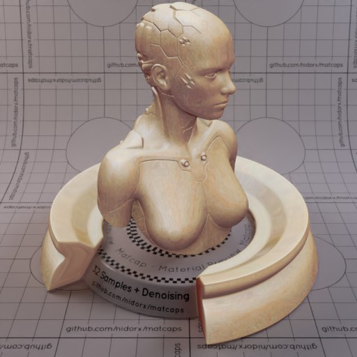
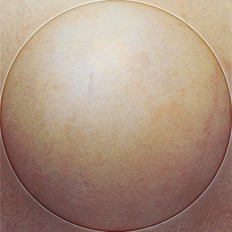

[[1024px](https://github.com/nidorx/matcaps/raw/master/1024/A88C77_A88C77_DAD2C7_623532-1.png)]
[[512px](https://github.com/nidorx/matcaps/raw/master/512/A88C77_A88C77_DAD2C7_623532-1-512px.png)]
[[256px](https://github.com/nidorx/matcaps/raw/master/256/A88C77_A88C77_DAD2C7_623532-1-256px.png)]
[[128px](https://github.com/nidorx/matcaps/raw/master/128/A88C77_A88C77_DAD2C7_623532-1-128px.png)]
[[64px](https://github.com/nidorx/matcaps/raw/master/64/A88C77_A88C77_DAD2C7_623532-1-64px.png)]
[~~ZBrush Material (ZMT)~~]

---
### A88C77_A88C77_DAD2C7_623532

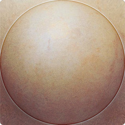

[[1024px](https://github.com/nidorx/matcaps/raw/master/1024/A88C77_A88C77_DAD2C7_623532.png)]
[[512px](https://github.com/nidorx/matcaps/raw/master/512/A88C77_A88C77_DAD2C7_623532-512px.png)]
[[256px](https://github.com/nidorx/matcaps/raw/master/256/A88C77_A88C77_DAD2C7_623532-256px.png)]
[[128px](https://github.com/nidorx/matcaps/raw/master/128/A88C77_A88C77_DAD2C7_623532-128px.png)]
[[64px](https://github.com/nidorx/matcaps/raw/master/64/A88C77_A88C77_DAD2C7_623532-64px.png)]
[[ZBrush Material (ZMT)](https://github.com/nidorx/matcaps/raw/master/zmt/A88C77_A88C77_DAD2C7_623532.zmt)]

---
### A971A9_A971A9_E8CBE8_D4A8D4
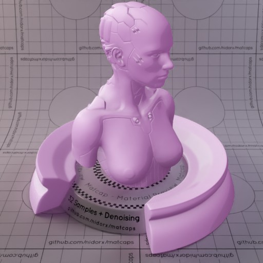

[[1024px](https://github.com/nidorx/matcaps/raw/master/1024/A971A9_A971A9_E8CBE8_D4A8D4.png)]
[[512px](https://github.com/nidorx/matcaps/raw/master/512/A971A9_A971A9_E8CBE8_D4A8D4-512px.png)]
[[256px](https://github.com/nidorx/matcaps/raw/master/256/A971A9_A971A9_E8CBE8_D4A8D4-256px.png)]
[[128px](https://github.com/nidorx/matcaps/raw/master/128/A971A9_A971A9_E8CBE8_D4A8D4-128px.png)]
[[64px](https://github.com/nidorx/matcaps/raw/master/64/A971A9_A971A9_E8CBE8_D4A8D4-64px.png)]
[~~ZBrush Material (ZMT)~~]

---
### A98D6A_A98D6A_F2D3AB_FBE6BE
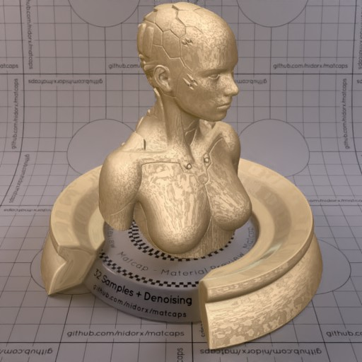

[[1024px](https://github.com/nidorx/matcaps/raw/master/1024/A98D6A_A98D6A_F2D3AB_FBE6BE.png)]
[[512px](https://github.com/nidorx/matcaps/raw/master/512/A98D6A_A98D6A_F2D3AB_FBE6BE-512px.png)]
[[256px](https://github.com/nidorx/matcaps/raw/master/256/A98D6A_A98D6A_F2D3AB_FBE6BE-256px.png)]
[[128px](https://github.com/nidorx/matcaps/raw/master/128/A98D6A_A98D6A_F2D3AB_FBE6BE-128px.png)]
[[64px](https://github.com/nidorx/matcaps/raw/master/64/A98D6A_A98D6A_F2D3AB_FBE6BE-64px.png)]
[[ZBrush Material (ZMT)](https://github.com/nidorx/matcaps/raw/master/zmt/A98D6A_A98D6A_F2D3AB_FBE6BE.zmt)]

---
### AA526C_AA526C_EAA6C9_DC88AF
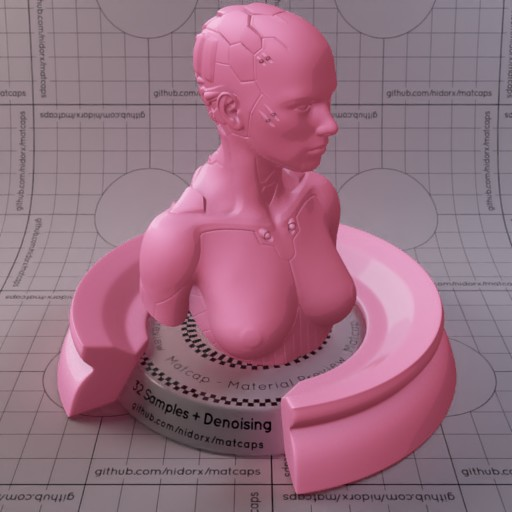
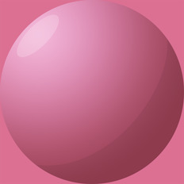

[[1024px](https://github.com/nidorx/matcaps/raw/master/1024/AA526C_AA526C_EAA6C9_DC88AF.png)]
[[512px](https://github.com/nidorx/matcaps/raw/master/512/AA526C_AA526C_EAA6C9_DC88AF-512px.png)]
[[256px](https://github.com/nidorx/matcaps/raw/master/256/AA526C_AA526C_EAA6C9_DC88AF-256px.png)]
[[128px](https://github.com/nidorx/matcaps/raw/master/128/AA526C_AA526C_EAA6C9_DC88AF-128px.png)]
[[64px](https://github.com/nidorx/matcaps/raw/master/64/AA526C_AA526C_EAA6C9_DC88AF-64px.png)]
[~~ZBrush Material (ZMT)~~]

---
### AB54A8_AB54A8_EBAAE9_DF8FDD
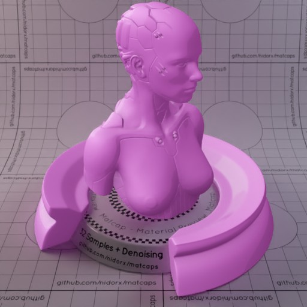
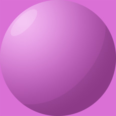

[[1024px](https://github.com/nidorx/matcaps/raw/master/1024/AB54A8_AB54A8_EBAAE9_DF8FDD.png)]
[[512px](https://github.com/nidorx/matcaps/raw/master/512/AB54A8_AB54A8_EBAAE9_DF8FDD-512px.png)]
[[256px](https://github.com/nidorx/matcaps/raw/master/256/AB54A8_AB54A8_EBAAE9_DF8FDD-256px.png)]
[[128px](https://github.com/nidorx/matcaps/raw/master/128/AB54A8_AB54A8_EBAAE9_DF8FDD-128px.png)]
[[64px](https://github.com/nidorx/matcaps/raw/master/64/AB54A8_AB54A8_EBAAE9_DF8FDD-64px.png)]
[~~ZBrush Material (ZMT)~~]

---
### AC8961_AC8961_EBDAC3_D1B791-1

[[1024px](https://github.com/nidorx/matcaps/raw/master/1024/AC8961_AC8961_EBDAC3_D1B791-1.png)]
[[512px](https://github.com/nidorx/matcaps/raw/master/512/AC8961_AC8961_EBDAC3_D1B791-1-512px.png)]
[[256px](https://github.com/nidorx/matcaps/raw/master/256/AC8961_AC8961_EBDAC3_D1B791-1-256px.png)]
[[128px](https://github.com/nidorx/matcaps/raw/master/128/AC8961_AC8961_EBDAC3_D1B791-1-128px.png)]
[[64px](https://github.com/nidorx/matcaps/raw/master/64/AC8961_AC8961_EBDAC3_D1B791-1-64px.png)]
[~~ZBrush Material (ZMT)~~]

---
### AC8961_AC8961_EBDAC3_D1B791
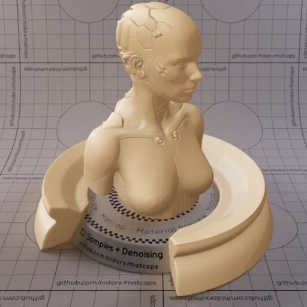

[[1024px](https://github.com/nidorx/matcaps/raw/master/1024/AC8961_AC8961_EBDAC3_D1B791.png)]
[[512px](https://github.com/nidorx/matcaps/raw/master/512/AC8961_AC8961_EBDAC3_D1B791-512px.png)]
[[256px](https://github.com/nidorx/matcaps/raw/master/256/AC8961_AC8961_EBDAC3_D1B791-256px.png)]
[[128px](https://github.com/nidorx/matcaps/raw/master/128/AC8961_AC8961_EBDAC3_D1B791-128px.png)]
[[64px](https://github.com/nidorx/matcaps/raw/master/64/AC8961_AC8961_EBDAC3_D1B791-64px.png)]
[~~ZBrush Material (ZMT)~~]

---
### AD9E81_AD9E81_F1E5CE_6B5C3E
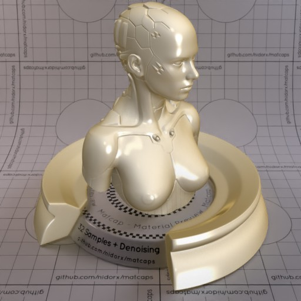
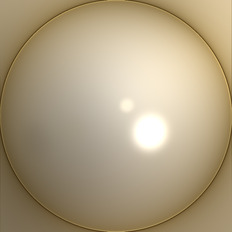

[[1024px](https://github.com/nidorx/matcaps/raw/master/1024/AD9E81_AD9E81_F1E5CE_6B5C3E.png)]
[[512px](https://github.com/nidorx/matcaps/raw/master/512/AD9E81_AD9E81_F1E5CE_6B5C3E-512px.png)]
[[256px](https://github.com/nidorx/matcaps/raw/master/256/AD9E81_AD9E81_F1E5CE_6B5C3E-256px.png)]
[[128px](https://github.com/nidorx/matcaps/raw/master/128/AD9E81_AD9E81_F1E5CE_6B5C3E-128px.png)]
[[64px](https://github.com/nidorx/matcaps/raw/master/64/AD9E81_AD9E81_F1E5CE_6B5C3E-64px.png)]
[[ZBrush Material (ZMT)](https://github.com/nidorx/matcaps/raw/master/zmt/AD9E81_AD9E81_F1E5CE_6B5C3E.zmt)]

---
### ADC2CD_ADC2CD_DFF7FA_C9E6F5
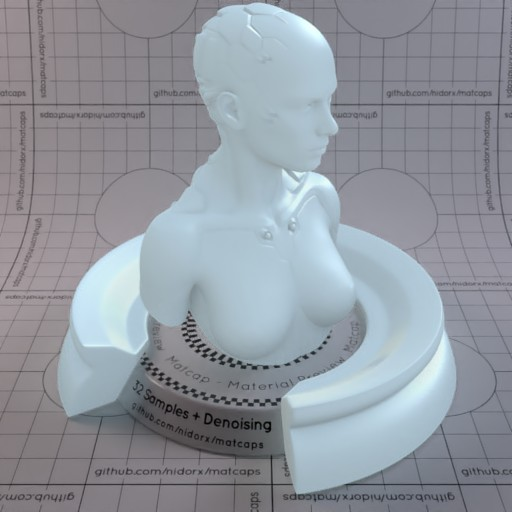
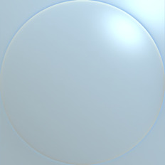

[[1024px](https://github.com/nidorx/matcaps/raw/master/1024/ADC2CD_ADC2CD_DFF7FA_C9E6F5.png)]
[[512px](https://github.com/nidorx/matcaps/raw/master/512/ADC2CD_ADC2CD_DFF7FA_C9E6F5-512px.png)]
[[256px](https://github.com/nidorx/matcaps/raw/master/256/ADC2CD_ADC2CD_DFF7FA_C9E6F5-256px.png)]
[[128px](https://github.com/nidorx/matcaps/raw/master/128/ADC2CD_ADC2CD_DFF7FA_C9E6F5-128px.png)]
[[64px](https://github.com/nidorx/matcaps/raw/master/64/ADC2CD_ADC2CD_DFF7FA_C9E6F5-64px.png)]
[[ZBrush Material (ZMT)](https://github.com/nidorx/matcaps/raw/master/zmt/ADC2CD_ADC2CD_DFF7FA_C9E6F5.zmt)]

---
### AE9D99_AE9D99_29303B_585F70
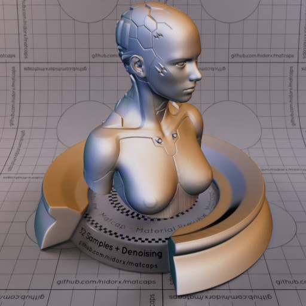
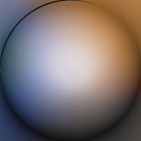

[[1024px](https://github.com/nidorx/matcaps/raw/master/1024/AE9D99_AE9D99_29303B_585F70.png)]
[[512px](https://github.com/nidorx/matcaps/raw/master/512/AE9D99_AE9D99_29303B_585F70-512px.png)]
[[256px](https://github.com/nidorx/matcaps/raw/master/256/AE9D99_AE9D99_29303B_585F70-256px.png)]
[[128px](https://github.com/nidorx/matcaps/raw/master/128/AE9D99_AE9D99_29303B_585F70-128px.png)]
[[64px](https://github.com/nidorx/matcaps/raw/master/64/AE9D99_AE9D99_29303B_585F70-64px.png)]
[[ZBrush Material (ZMT)](https://github.com/nidorx/matcaps/raw/master/zmt/AE9D99_AE9D99_29303B_585F70.zmt)]

---
### AF986F_AF986F_CDB489_9C7C5B
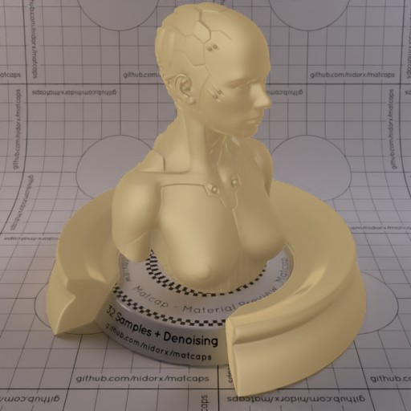
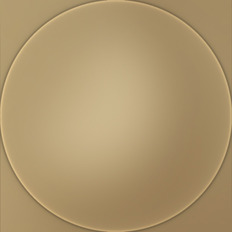

[[1024px](https://github.com/nidorx/matcaps/raw/master/1024/AF986F_AF986F_CDB489_9C7C5B.png)]
[[512px](https://github.com/nidorx/matcaps/raw/master/512/AF986F_AF986F_CDB489_9C7C5B-512px.png)]
[[256px](https://github.com/nidorx/matcaps/raw/master/256/AF986F_AF986F_CDB489_9C7C5B-256px.png)]
[[128px](https://github.com/nidorx/matcaps/raw/master/128/AF986F_AF986F_CDB489_9C7C5B-128px.png)]
[[64px](https://github.com/nidorx/matcaps/raw/master/64/AF986F_AF986F_CDB489_9C7C5B-64px.png)]
[[ZBrush Material (ZMT)](https://github.com/nidorx/matcaps/raw/master/zmt/AF986F_AF986F_CDB489_9C7C5B.zmt)]

---
### AF987A_AF987A_2F2416_523F27
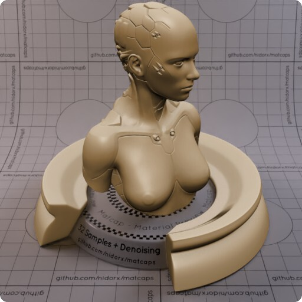
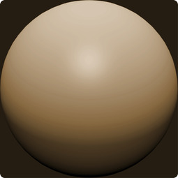

[[1024px](https://github.com/nidorx/matcaps/raw/master/1024/AF987A_AF987A_2F2416_523F27.png)]
[[512px](https://github.com/nidorx/matcaps/raw/master/512/AF987A_AF987A_2F2416_523F27-512px.png)]
[[256px](https://github.com/nidorx/matcaps/raw/master/256/AF987A_AF987A_2F2416_523F27-256px.png)]
[[128px](https://github.com/nidorx/matcaps/raw/master/128/AF987A_AF987A_2F2416_523F27-128px.png)]
[[64px](https://github.com/nidorx/matcaps/raw/master/64/AF987A_AF987A_2F2416_523F27-64px.png)]
[~~ZBrush Material (ZMT)~~]

---
### B06932_B06932_451B09_7B3E16

[[1024px](https://github.com/nidorx/matcaps/raw/master/1024/B06932_B06932_451B09_7B3E16.png)]
[[512px](https://github.com/nidorx/matcaps/raw/master/512/B06932_B06932_451B09_7B3E16-512px.png)]
[[256px](https://github.com/nidorx/matcaps/raw/master/256/B06932_B06932_451B09_7B3E16-256px.png)]
[[128px](https://github.com/nidorx/matcaps/raw/master/128/B06932_B06932_451B09_7B3E16-128px.png)]
[[64px](https://github.com/nidorx/matcaps/raw/master/64/B06932_B06932_451B09_7B3E16-64px.png)]
[~~ZBrush Material (ZMT)~~]

---
### B09273_B09273_7A573D_C7AF97

[[1024px](https://github.com/nidorx/matcaps/raw/master/1024/B09273_B09273_7A573D_C7AF97.png)]
[[512px](https://github.com/nidorx/matcaps/raw/master/512/B09273_B09273_7A573D_C7AF97-512px.png)]
[[256px](https://github.com/nidorx/matcaps/raw/master/256/B09273_B09273_7A573D_C7AF97-256px.png)]
[[128px](https://github.com/nidorx/matcaps/raw/master/128/B09273_B09273_7A573D_C7AF97-128px.png)]
[[64px](https://github.com/nidorx/matcaps/raw/master/64/B09273_B09273_7A573D_C7AF97-64px.png)]
[[ZBrush Material (ZMT)](https://github.com/nidorx/matcaps/raw/master/zmt/B09273_B09273_7A573D_C7AF97.zmt)]

---
### B0B0B0_B0B0B0_6E6E6E_848484

[[1024px](https://github.com/nidorx/matcaps/raw/master/1024/B0B0B0_B0B0B0_6E6E6E_848484.png)]
[[512px](https://github.com/nidorx/matcaps/raw/master/512/B0B0B0_B0B0B0_6E6E6E_848484-512px.png)]
[[256px](https://github.com/nidorx/matcaps/raw/master/256/B0B0B0_B0B0B0_6E6E6E_848484-256px.png)]
[[128px](https://github.com/nidorx/matcaps/raw/master/128/B0B0B0_B0B0B0_6E6E6E_848484-128px.png)]
[[64px](https://github.com/nidorx/matcaps/raw/master/64/B0B0B0_B0B0B0_6E6E6E_848484-64px.png)]
[~~ZBrush Material (ZMT)~~]

---
### B1A395_B1A395_EFE6E1_635A47

[[1024px](https://github.com/nidorx/matcaps/raw/master/1024/B1A395_B1A395_EFE6E1_635A47.png)]
[[512px](https://github.com/nidorx/matcaps/raw/master/512/B1A395_B1A395_EFE6E1_635A47-512px.png)]
[[256px](https://github.com/nidorx/matcaps/raw/master/256/B1A395_B1A395_EFE6E1_635A47-256px.png)]
[[128px](https://github.com/nidorx/matcaps/raw/master/128/B1A395_B1A395_EFE6E1_635A47-128px.png)]
[[64px](https://github.com/nidorx/matcaps/raw/master/64/B1A395_B1A395_EFE6E1_635A47-64px.png)]
[~~ZBrush Material (ZMT)~~]

---
### B3AA93_B3AA93_F4EFD7_E1DDC2

[[1024px](https://github.com/nidorx/matcaps/raw/master/1024/B3AA93_B3AA93_F4EFD7_E1DDC2.png)]
[[512px](https://github.com/nidorx/matcaps/raw/master/512/B3AA93_B3AA93_F4EFD7_E1DDC2-512px.png)]
[[256px](https://github.com/nidorx/matcaps/raw/master/256/B3AA93_B3AA93_F4EFD7_E1DDC2-256px.png)]
[[128px](https://github.com/nidorx/matcaps/raw/master/128/B3AA93_B3AA93_F4EFD7_E1DDC2-128px.png)]
[[64px](https://github.com/nidorx/matcaps/raw/master/64/B3AA93_B3AA93_F4EFD7_E1DDC2-64px.png)]
[[ZBrush Material (ZMT)](https://github.com/nidorx/matcaps/raw/master/zmt/B3AA93_B3AA93_F4EFD7_E1DDC2.zmt)]

---
### B47A5B_B47A5B_301E14_704A31

[[1024px](https://github.com/nidorx/matcaps/raw/master/1024/B47A5B_B47A5B_301E14_704A31.png)]
[[512px](https://github.com/nidorx/matcaps/raw/master/512/B47A5B_B47A5B_301E14_704A31-512px.png)]
[[256px](https://github.com/nidorx/matcaps/raw/master/256/B47A5B_B47A5B_301E14_704A31-256px.png)]
[[128px](https://github.com/nidorx/matcaps/raw/master/128/B47A5B_B47A5B_301E14_704A31-128px.png)]
[[64px](https://github.com/nidorx/matcaps/raw/master/64/B47A5B_B47A5B_301E14_704A31-64px.png)]
[[ZBrush Material (ZMT)](https://github.com/nidorx/matcaps/raw/master/zmt/B47A5B_B47A5B_301E14_704A31.zmt)]

---
### B5987E_B5987E_F8E4DC_6F5939

[[1024px](https://github.com/nidorx/matcaps/raw/master/1024/B5987E_B5987E_F8E4DC_6F5939.png)]
[[512px](https://github.com/nidorx/matcaps/raw/master/512/B5987E_B5987E_F8E4DC_6F5939-512px.png)]
[[256px](https://github.com/nidorx/matcaps/raw/master/256/B5987E_B5987E_F8E4DC_6F5939-256px.png)]
[[128px](https://github.com/nidorx/matcaps/raw/master/128/B5987E_B5987E_F8E4DC_6F5939-128px.png)]
[[64px](https://github.com/nidorx/matcaps/raw/master/64/B5987E_B5987E_F8E4DC_6F5939-64px.png)]
[~~ZBrush Material (ZMT)~~]

---
### B62D33_B62D33_E4868B_7E2D34

[[1024px](https://github.com/nidorx/matcaps/raw/master/1024/B62D33_B62D33_E4868B_7E2D34.png)]
[[512px](https://github.com/nidorx/matcaps/raw/master/512/B62D33_B62D33_E4868B_7E2D34-512px.png)]
[[256px](https://github.com/nidorx/matcaps/raw/master/256/B62D33_B62D33_E4868B_7E2D34-256px.png)]
[[128px](https://github.com/nidorx/matcaps/raw/master/128/B62D33_B62D33_E4868B_7E2D34-128px.png)]
[[64px](https://github.com/nidorx/matcaps/raw/master/64/B62D33_B62D33_E4868B_7E2D34-64px.png)]
[[ZBrush Material (ZMT)](https://github.com/nidorx/matcaps/raw/master/zmt/B62D33_B62D33_E4868B_7E2D34.zmt)]

---
### B66D59_B66D59_F0C9B2_E5B49C

[[1024px](https://github.com/nidorx/matcaps/raw/master/1024/B66D59_B66D59_F0C9B2_E5B49C.png)]
[[512px](https://github.com/nidorx/matcaps/raw/master/512/B66D59_B66D59_F0C9B2_E5B49C-512px.png)]
[[256px](https://github.com/nidorx/matcaps/raw/master/256/B66D59_B66D59_F0C9B2_E5B49C-256px.png)]
[[128px](https://github.com/nidorx/matcaps/raw/master/128/B66D59_B66D59_F0C9B2_E5B49C-128px.png)]
[[64px](https://github.com/nidorx/matcaps/raw/master/64/B66D59_B66D59_F0C9B2_E5B49C-64px.png)]
[~~ZBrush Material (ZMT)~~]

---
### B86137_B86137_FBCA6F_6F3C37

[[1024px](https://github.com/nidorx/matcaps/raw/master/1024/B86137_B86137_FBCA6F_6F3C37.png)]
[[512px](https://github.com/nidorx/matcaps/raw/master/512/B86137_B86137_FBCA6F_6F3C37-512px.png)]
[[256px](https://github.com/nidorx/matcaps/raw/master/256/B86137_B86137_FBCA6F_6F3C37-256px.png)]
[[128px](https://github.com/nidorx/matcaps/raw/master/128/B86137_B86137_FBCA6F_6F3C37-128px.png)]
[[64px](https://github.com/nidorx/matcaps/raw/master/64/B86137_B86137_FBCA6F_6F3C37-64px.png)]
[[ZBrush Material (ZMT)](https://github.com/nidorx/matcaps/raw/master/zmt/B86137_B86137_FBCA6F_6F3C37.zmt)]

---