Huge library of matcap PNG textures organized by color

## Navigation
* [Home](/)
* [Page 1](PAGE-1.md)
* [Page 2](PAGE-2.md)
* [Page 3](PAGE-3.md)
* [Page 4](PAGE-4.md)
* [Page 5](PAGE-5.md)
* Page 6
* [Page 7](PAGE-7.md)
* [Page 8](PAGE-8.md)
## Page 9 Matcaps
### B98A6D_B98A6D_7B4F38_D1A68F

[[1024px](https://github.com/nidorx/matcaps/raw/master/1024/B98A6D_B98A6D_7B4F38_D1A68F.png)]
[[512px](https://github.com/nidorx/matcaps/raw/master/512/B98A6D_B98A6D_7B4F38_D1A68F-512px.png)]
[[256px](https://github.com/nidorx/matcaps/raw/master/256/B98A6D_B98A6D_7B4F38_D1A68F-256px.png)]
[[128px](https://github.com/nidorx/matcaps/raw/master/128/B98A6D_B98A6D_7B4F38_D1A68F-128px.png)]
[[64px](https://github.com/nidorx/matcaps/raw/master/64/B98A6D_B98A6D_7B4F38_D1A68F-64px.png)]
[[ZBrush Material (ZMT)](https://github.com/nidorx/matcaps/raw/master/zmt/B98A6D_B98A6D_7B4F38_D1A68F.zmt)]

---
### B9B37A_B9B37A_F1EED0_E5E4BA

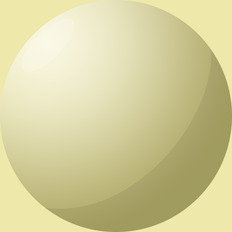

[[1024px](https://github.com/nidorx/matcaps/raw/master/1024/B9B37A_B9B37A_F1EED0_E5E4BA.png)]
[[512px](https://github.com/nidorx/matcaps/raw/master/512/B9B37A_B9B37A_F1EED0_E5E4BA-512px.png)]
[[256px](https://github.com/nidorx/matcaps/raw/master/256/B9B37A_B9B37A_F1EED0_E5E4BA-256px.png)]
[[128px](https://github.com/nidorx/matcaps/raw/master/128/B9B37A_B9B37A_F1EED0_E5E4BA-128px.png)]
[[64px](https://github.com/nidorx/matcaps/raw/master/64/B9B37A_B9B37A_F1EED0_E5E4BA-64px.png)]
[~~ZBrush Material (ZMT)~~]

---
### BA5DBA_BA5DBA_F2BEF2_E69BE6
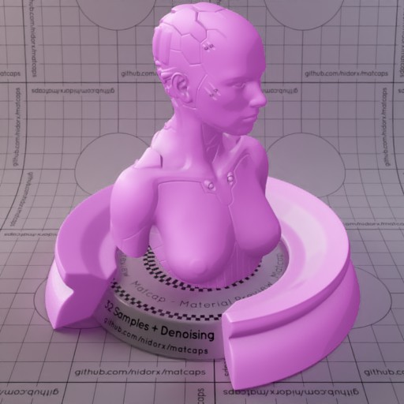

[[1024px](https://github.com/nidorx/matcaps/raw/master/1024/BA5DBA_BA5DBA_F2BEF2_E69BE6.png)]
[[512px](https://github.com/nidorx/matcaps/raw/master/512/BA5DBA_BA5DBA_F2BEF2_E69BE6-512px.png)]
[[256px](https://github.com/nidorx/matcaps/raw/master/256/BA5DBA_BA5DBA_F2BEF2_E69BE6-256px.png)]
[[128px](https://github.com/nidorx/matcaps/raw/master/128/BA5DBA_BA5DBA_F2BEF2_E69BE6-128px.png)]
[[64px](https://github.com/nidorx/matcaps/raw/master/64/BA5DBA_BA5DBA_F2BEF2_E69BE6-64px.png)]
[~~ZBrush Material (ZMT)~~]

---
### BAADA8_BAADA8_ECE6E7_9A8378

[[1024px](https://github.com/nidorx/matcaps/raw/master/1024/BAADA8_BAADA8_ECE6E7_9A8378.png)]
[[512px](https://github.com/nidorx/matcaps/raw/master/512/BAADA8_BAADA8_ECE6E7_9A8378-512px.png)]
[[256px](https://github.com/nidorx/matcaps/raw/master/256/BAADA8_BAADA8_ECE6E7_9A8378-256px.png)]
[[128px](https://github.com/nidorx/matcaps/raw/master/128/BAADA8_BAADA8_ECE6E7_9A8378-128px.png)]
[[64px](https://github.com/nidorx/matcaps/raw/master/64/BAADA8_BAADA8_ECE6E7_9A8378-64px.png)]
[[ZBrush Material (ZMT)](https://github.com/nidorx/matcaps/raw/master/zmt/BAADA8_BAADA8_ECE6E7_9A8378.zmt)]

---
### BC928D_BC928D_F9E2D6_654445

[[1024px](https://github.com/nidorx/matcaps/raw/master/1024/BC928D_BC928D_F9E2D6_654445.png)]
[[512px](https://github.com/nidorx/matcaps/raw/master/512/BC928D_BC928D_F9E2D6_654445-512px.png)]
[[256px](https://github.com/nidorx/matcaps/raw/master/256/BC928D_BC928D_F9E2D6_654445-256px.png)]
[[128px](https://github.com/nidorx/matcaps/raw/master/128/BC928D_BC928D_F9E2D6_654445-128px.png)]
[[64px](https://github.com/nidorx/matcaps/raw/master/64/BC928D_BC928D_F9E2D6_654445-64px.png)]
[[ZBrush Material (ZMT)](https://github.com/nidorx/matcaps/raw/master/zmt/BC928D_BC928D_F9E2D6_654445.zmt)]

---
### BD0D0D_BD0D0D_970404_7B0404
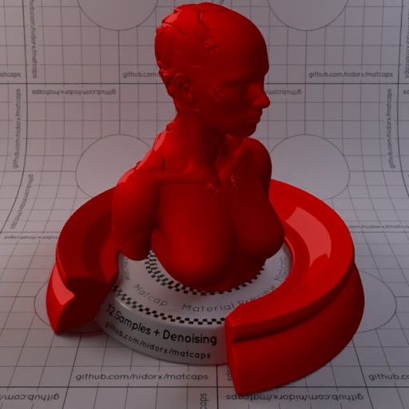

[[1024px](https://github.com/nidorx/matcaps/raw/master/1024/BD0D0D_BD0D0D_970404_7B0404.png)]
[[512px](https://github.com/nidorx/matcaps/raw/master/512/BD0D0D_BD0D0D_970404_7B0404-512px.png)]
[[256px](https://github.com/nidorx/matcaps/raw/master/256/BD0D0D_BD0D0D_970404_7B0404-256px.png)]
[[128px](https://github.com/nidorx/matcaps/raw/master/128/BD0D0D_BD0D0D_970404_7B0404-128px.png)]
[[64px](https://github.com/nidorx/matcaps/raw/master/64/BD0D0D_BD0D0D_970404_7B0404-64px.png)]
[~~ZBrush Material (ZMT)~~]

---
### BD5345_BD5345_460F11_732622

[[1024px](https://github.com/nidorx/matcaps/raw/master/1024/BD5345_BD5345_460F11_732622.png)]
[[512px](https://github.com/nidorx/matcaps/raw/master/512/BD5345_BD5345_460F11_732622-512px.png)]
[[256px](https://github.com/nidorx/matcaps/raw/master/256/BD5345_BD5345_460F11_732622-256px.png)]
[[128px](https://github.com/nidorx/matcaps/raw/master/128/BD5345_BD5345_460F11_732622-128px.png)]
[[64px](https://github.com/nidorx/matcaps/raw/master/64/BD5345_BD5345_460F11_732622-64px.png)]
[~~ZBrush Material (ZMT)~~]

---
### BDB466_BDB466_F3EDC3_E3DD9F

[[1024px](https://github.com/nidorx/matcaps/raw/master/1024/BDB466_BDB466_F3EDC3_E3DD9F.png)]
[[512px](https://github.com/nidorx/matcaps/raw/master/512/BDB466_BDB466_F3EDC3_E3DD9F-512px.png)]
[[256px](https://github.com/nidorx/matcaps/raw/master/256/BDB466_BDB466_F3EDC3_E3DD9F-256px.png)]
[[128px](https://github.com/nidorx/matcaps/raw/master/128/BDB466_BDB466_F3EDC3_E3DD9F-128px.png)]
[[64px](https://github.com/nidorx/matcaps/raw/master/64/BDB466_BDB466_F3EDC3_E3DD9F-64px.png)]
[~~ZBrush Material (ZMT)~~]

---
### BE5F5F_BE5F5F_F4BDBD_ECA4A4-1

[[1024px](https://github.com/nidorx/matcaps/raw/master/1024/BE5F5F_BE5F5F_F4BDBD_ECA4A4-1.png)]
[[512px](https://github.com/nidorx/matcaps/raw/master/512/BE5F5F_BE5F5F_F4BDBD_ECA4A4-1-512px.png)]
[[256px](https://github.com/nidorx/matcaps/raw/master/256/BE5F5F_BE5F5F_F4BDBD_ECA4A4-1-256px.png)]
[[128px](https://github.com/nidorx/matcaps/raw/master/128/BE5F5F_BE5F5F_F4BDBD_ECA4A4-1-128px.png)]
[[64px](https://github.com/nidorx/matcaps/raw/master/64/BE5F5F_BE5F5F_F4BDBD_ECA4A4-1-64px.png)]
[~~ZBrush Material (ZMT)~~]

---
### BE5F5F_BE5F5F_F4BDBD_ECA4A4

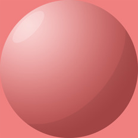

[[1024px](https://github.com/nidorx/matcaps/raw/master/1024/BE5F5F_BE5F5F_F4BDBD_ECA4A4.png)]
[[512px](https://github.com/nidorx/matcaps/raw/master/512/BE5F5F_BE5F5F_F4BDBD_ECA4A4-512px.png)]
[[256px](https://github.com/nidorx/matcaps/raw/master/256/BE5F5F_BE5F5F_F4BDBD_ECA4A4-256px.png)]
[[128px](https://github.com/nidorx/matcaps/raw/master/128/BE5F5F_BE5F5F_F4BDBD_ECA4A4-128px.png)]
[[64px](https://github.com/nidorx/matcaps/raw/master/64/BE5F5F_BE5F5F_F4BDBD_ECA4A4-64px.png)]
[~~ZBrush Material (ZMT)~~]

---
### BF7745_BF7745_F5D08E_E5AE6B

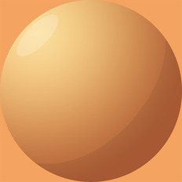

[[1024px](https://github.com/nidorx/matcaps/raw/master/1024/BF7745_BF7745_F5D08E_E5AE6B.png)]
[[512px](https://github.com/nidorx/matcaps/raw/master/512/BF7745_BF7745_F5D08E_E5AE6B-512px.png)]
[[256px](https://github.com/nidorx/matcaps/raw/master/256/BF7745_BF7745_F5D08E_E5AE6B-256px.png)]
[[128px](https://github.com/nidorx/matcaps/raw/master/128/BF7745_BF7745_F5D08E_E5AE6B-128px.png)]
[[64px](https://github.com/nidorx/matcaps/raw/master/64/BF7745_BF7745_F5D08E_E5AE6B-64px.png)]
[~~ZBrush Material (ZMT)~~]

---
### BF8E78_BF8E78_E5CCBF_753E32

[[1024px](https://github.com/nidorx/matcaps/raw/master/1024/BF8E78_BF8E78_E5CCBF_753E32.png)]
[[512px](https://github.com/nidorx/matcaps/raw/master/512/BF8E78_BF8E78_E5CCBF_753E32-512px.png)]
[[256px](https://github.com/nidorx/matcaps/raw/master/256/BF8E78_BF8E78_E5CCBF_753E32-256px.png)]
[[128px](https://github.com/nidorx/matcaps/raw/master/128/BF8E78_BF8E78_E5CCBF_753E32-128px.png)]
[[64px](https://github.com/nidorx/matcaps/raw/master/64/BF8E78_BF8E78_E5CCBF_753E32-64px.png)]
[[ZBrush Material (ZMT)](https://github.com/nidorx/matcaps/raw/master/zmt/BF8E78_BF8E78_E5CCBF_753E32.zmt)]

---
### BFAA83_BFAA83_F5EAD6_E1D0B1

[[1024px](https://github.com/nidorx/matcaps/raw/master/1024/BFAA83_BFAA83_F5EAD6_E1D0B1.png)]
[[512px](https://github.com/nidorx/matcaps/raw/master/512/BFAA83_BFAA83_F5EAD6_E1D0B1-512px.png)]
[[256px](https://github.com/nidorx/matcaps/raw/master/256/BFAA83_BFAA83_F5EAD6_E1D0B1-256px.png)]
[[128px](https://github.com/nidorx/matcaps/raw/master/128/BFAA83_BFAA83_F5EAD6_E1D0B1-128px.png)]
[[64px](https://github.com/nidorx/matcaps/raw/master/64/BFAA83_BFAA83_F5EAD6_E1D0B1-64px.png)]
[~~ZBrush Material (ZMT)~~]

---
### BFB5A4_BFB5A4_DEDCCB_D7D4CC

[[1024px](https://github.com/nidorx/matcaps/raw/master/1024/BFB5A4_BFB5A4_DEDCCB_D7D4CC.png)]
[[512px](https://github.com/nidorx/matcaps/raw/master/512/BFB5A4_BFB5A4_DEDCCB_D7D4CC-512px.png)]
[[256px](https://github.com/nidorx/matcaps/raw/master/256/BFB5A4_BFB5A4_DEDCCB_D7D4CC-256px.png)]
[[128px](https://github.com/nidorx/matcaps/raw/master/128/BFB5A4_BFB5A4_DEDCCB_D7D4CC-128px.png)]
[[64px](https://github.com/nidorx/matcaps/raw/master/64/BFB5A4_BFB5A4_DEDCCB_D7D4CC-64px.png)]
[[ZBrush Material (ZMT)](https://github.com/nidorx/matcaps/raw/master/zmt/BFB5A4_BFB5A4_DEDCCB_D7D4CC.zmt)]

---
### C05429_C05429_ED6129_94492A

[[1024px](https://github.com/nidorx/matcaps/raw/master/1024/C05429_C05429_ED6129_94492A.png)]
[[512px](https://github.com/nidorx/matcaps/raw/master/512/C05429_C05429_ED6129_94492A-512px.png)]
[[256px](https://github.com/nidorx/matcaps/raw/master/256/C05429_C05429_ED6129_94492A-256px.png)]
[[128px](https://github.com/nidorx/matcaps/raw/master/128/C05429_C05429_ED6129_94492A-128px.png)]
[[64px](https://github.com/nidorx/matcaps/raw/master/64/C05429_C05429_ED6129_94492A-64px.png)]
[[ZBrush Material (ZMT)](https://github.com/nidorx/matcaps/raw/master/zmt/C05429_C05429_ED6129_94492A.zmt)]

---
### C1AA92_C1AA92_AD6E29_737889

[[1024px](https://github.com/nidorx/matcaps/raw/master/1024/C1AA92_C1AA92_AD6E29_737889.png)]
[[512px](https://github.com/nidorx/matcaps/raw/master/512/C1AA92_C1AA92_AD6E29_737889-512px.png)]
[[256px](https://github.com/nidorx/matcaps/raw/master/256/C1AA92_C1AA92_AD6E29_737889-256px.png)]
[[128px](https://github.com/nidorx/matcaps/raw/master/128/C1AA92_C1AA92_AD6E29_737889-128px.png)]
[[64px](https://github.com/nidorx/matcaps/raw/master/64/C1AA92_C1AA92_AD6E29_737889-64px.png)]
[[ZBrush Material (ZMT)](https://github.com/nidorx/matcaps/raw/master/zmt/C1AA92_C1AA92_AD6E29_737889.zmt)]

---
### C1B3A1_C1B3A1_F6EEE5_E1D7C7

[[1024px](https://github.com/nidorx/matcaps/raw/master/1024/C1B3A1_C1B3A1_F6EEE5_E1D7C7.png)]
[[512px](https://github.com/nidorx/matcaps/raw/master/512/C1B3A1_C1B3A1_F6EEE5_E1D7C7-512px.png)]
[[256px](https://github.com/nidorx/matcaps/raw/master/256/C1B3A1_C1B3A1_F6EEE5_E1D7C7-256px.png)]
[[128px](https://github.com/nidorx/matcaps/raw/master/128/C1B3A1_C1B3A1_F6EEE5_E1D7C7-128px.png)]
[[64px](https://github.com/nidorx/matcaps/raw/master/64/C1B3A1_C1B3A1_F6EEE5_E1D7C7-64px.png)]
[~~ZBrush Material (ZMT)~~]

---
### C21338_C21338_920C24_E71C54
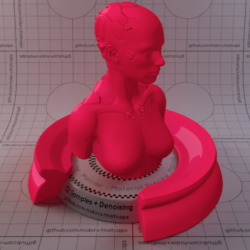

[[1024px](https://github.com/nidorx/matcaps/raw/master/1024/C21338_C21338_920C24_E71C54.png)]
[[512px](https://github.com/nidorx/matcaps/raw/master/512/C21338_C21338_920C24_E71C54-512px.png)]
[[256px](https://github.com/nidorx/matcaps/raw/master/256/C21338_C21338_920C24_E71C54-256px.png)]
[[128px](https://github.com/nidorx/matcaps/raw/master/128/C21338_C21338_920C24_E71C54-128px.png)]
[[64px](https://github.com/nidorx/matcaps/raw/master/64/C21338_C21338_920C24_E71C54-64px.png)]
[~~ZBrush Material (ZMT)~~]

---
### C28E4E_C28E4E_845119_0B0805

[[1024px](https://github.com/nidorx/matcaps/raw/master/1024/C28E4E_C28E4E_845119_0B0805.png)]
[[512px](https://github.com/nidorx/matcaps/raw/master/512/C28E4E_C28E4E_845119_0B0805-512px.png)]
[[256px](https://github.com/nidorx/matcaps/raw/master/256/C28E4E_C28E4E_845119_0B0805-256px.png)]
[[128px](https://github.com/nidorx/matcaps/raw/master/128/C28E4E_C28E4E_845119_0B0805-128px.png)]
[[64px](https://github.com/nidorx/matcaps/raw/master/64/C28E4E_C28E4E_845119_0B0805-64px.png)]
[[ZBrush Material (ZMT)](https://github.com/nidorx/matcaps/raw/master/zmt/C28E4E_C28E4E_845119_0B0805.zmt)]

---
### C2A391_C2A391_523728_785741

[[1024px](https://github.com/nidorx/matcaps/raw/master/1024/C2A391_C2A391_523728_785741.png)]
[[512px](https://github.com/nidorx/matcaps/raw/master/512/C2A391_C2A391_523728_785741-512px.png)]
[[256px](https://github.com/nidorx/matcaps/raw/master/256/C2A391_C2A391_523728_785741-256px.png)]
[[128px](https://github.com/nidorx/matcaps/raw/master/128/C2A391_C2A391_523728_785741-128px.png)]
[[64px](https://github.com/nidorx/matcaps/raw/master/64/C2A391_C2A391_523728_785741-64px.png)]
[[ZBrush Material (ZMT)](https://github.com/nidorx/matcaps/raw/master/zmt/C2A391_C2A391_523728_785741.zmt)]

---
### C2AB7D_C2AB7D_4A412E_7A6B4E

[[1024px](https://github.com/nidorx/matcaps/raw/master/1024/C2AB7D_C2AB7D_4A412E_7A6B4E.png)]
[[512px](https://github.com/nidorx/matcaps/raw/master/512/C2AB7D_C2AB7D_4A412E_7A6B4E-512px.png)]
[[256px](https://github.com/nidorx/matcaps/raw/master/256/C2AB7D_C2AB7D_4A412E_7A6B4E-256px.png)]
[[128px](https://github.com/nidorx/matcaps/raw/master/128/C2AB7D_C2AB7D_4A412E_7A6B4E-128px.png)]
[[64px](https://github.com/nidorx/matcaps/raw/master/64/C2AB7D_C2AB7D_4A412E_7A6B4E-64px.png)]
[[ZBrush Material (ZMT)](https://github.com/nidorx/matcaps/raw/master/zmt/C2AB7D_C2AB7D_4A412E_7A6B4E.zmt)]

---
### C30C0C_C30C0C_9F0404_830404

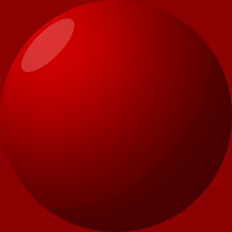

[[1024px](https://github.com/nidorx/matcaps/raw/master/1024/C30C0C_C30C0C_9F0404_830404.png)]
[[512px](https://github.com/nidorx/matcaps/raw/master/512/C30C0C_C30C0C_9F0404_830404-512px.png)]
[[256px](https://github.com/nidorx/matcaps/raw/master/256/C30C0C_C30C0C_9F0404_830404-256px.png)]
[[128px](https://github.com/nidorx/matcaps/raw/master/128/C30C0C_C30C0C_9F0404_830404-128px.png)]
[[64px](https://github.com/nidorx/matcaps/raw/master/64/C30C0C_C30C0C_9F0404_830404-64px.png)]
[~~ZBrush Material (ZMT)~~]

---
### C345EC_C345EC_5F1DAA_9F31DB
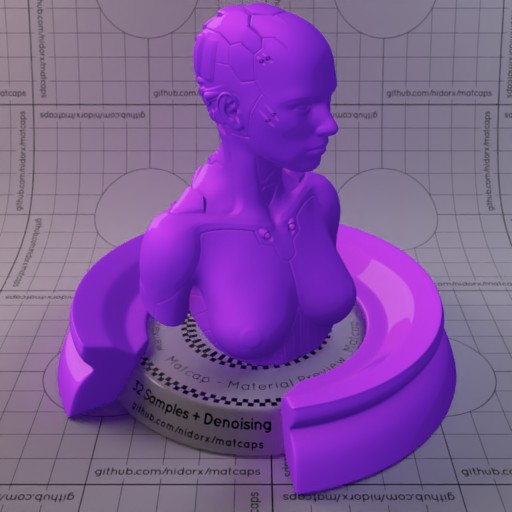
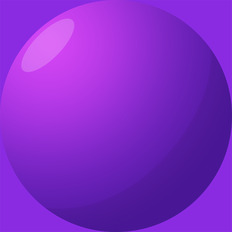

[[1024px](https://github.com/nidorx/matcaps/raw/master/1024/C345EC_C345EC_5F1DAA_9F31DB.png)]
[[512px](https://github.com/nidorx/matcaps/raw/master/512/C345EC_C345EC_5F1DAA_9F31DB-512px.png)]
[[256px](https://github.com/nidorx/matcaps/raw/master/256/C345EC_C345EC_5F1DAA_9F31DB-256px.png)]
[[128px](https://github.com/nidorx/matcaps/raw/master/128/C345EC_C345EC_5F1DAA_9F31DB-128px.png)]
[[64px](https://github.com/nidorx/matcaps/raw/master/64/C345EC_C345EC_5F1DAA_9F31DB-64px.png)]
[~~ZBrush Material (ZMT)~~]

---
### C35C04_C35C04_F9C30C_EE9F04
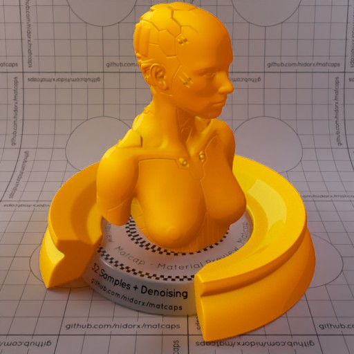

[[1024px](https://github.com/nidorx/matcaps/raw/master/1024/C35C04_C35C04_F9C30C_EE9F04.png)]
[[512px](https://github.com/nidorx/matcaps/raw/master/512/C35C04_C35C04_F9C30C_EE9F04-512px.png)]
[[256px](https://github.com/nidorx/matcaps/raw/master/256/C35C04_C35C04_F9C30C_EE9F04-256px.png)]
[[128px](https://github.com/nidorx/matcaps/raw/master/128/C35C04_C35C04_F9C30C_EE9F04-128px.png)]
[[64px](https://github.com/nidorx/matcaps/raw/master/64/C35C04_C35C04_F9C30C_EE9F04-64px.png)]
[~~ZBrush Material (ZMT)~~]

---
### C47004_C47004_F9D00C_EDAF04
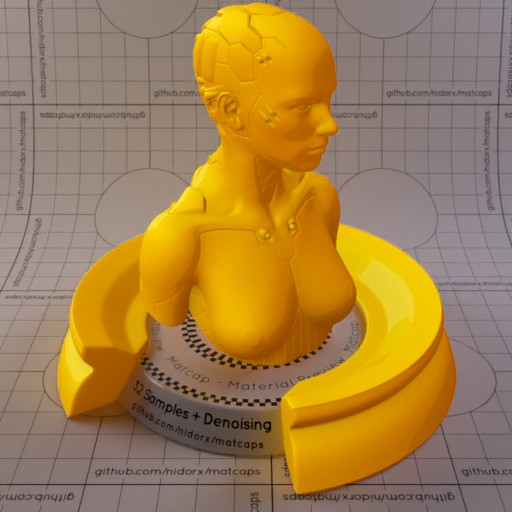

[[1024px](https://github.com/nidorx/matcaps/raw/master/1024/C47004_C47004_F9D00C_EDAF04.png)]
[[512px](https://github.com/nidorx/matcaps/raw/master/512/C47004_C47004_F9D00C_EDAF04-512px.png)]
[[256px](https://github.com/nidorx/matcaps/raw/master/256/C47004_C47004_F9D00C_EDAF04-256px.png)]
[[128px](https://github.com/nidorx/matcaps/raw/master/128/C47004_C47004_F9D00C_EDAF04-128px.png)]
[[64px](https://github.com/nidorx/matcaps/raw/master/64/C47004_C47004_F9D00C_EDAF04-64px.png)]
[~~ZBrush Material (ZMT)~~]

---
### C4A591_C4A591_635448_F2D9D5

[[1024px](https://github.com/nidorx/matcaps/raw/master/1024/C4A591_C4A591_635448_F2D9D5.png)]
[[512px](https://github.com/nidorx/matcaps/raw/master/512/C4A591_C4A591_635448_F2D9D5-512px.png)]
[[256px](https://github.com/nidorx/matcaps/raw/master/256/C4A591_C4A591_635448_F2D9D5-256px.png)]
[[128px](https://github.com/nidorx/matcaps/raw/master/128/C4A591_C4A591_635448_F2D9D5-128px.png)]
[[64px](https://github.com/nidorx/matcaps/raw/master/64/C4A591_C4A591_635448_F2D9D5-64px.png)]
[~~ZBrush Material (ZMT)~~]

---
### C4C6C6_C4C6C6_4D5756_646463

[[1024px](https://github.com/nidorx/matcaps/raw/master/1024/C4C6C6_C4C6C6_4D5756_646463.png)]
[[512px](https://github.com/nidorx/matcaps/raw/master/512/C4C6C6_C4C6C6_4D5756_646463-512px.png)]
[[256px](https://github.com/nidorx/matcaps/raw/master/256/C4C6C6_C4C6C6_4D5756_646463-256px.png)]
[[128px](https://github.com/nidorx/matcaps/raw/master/128/C4C6C6_C4C6C6_4D5756_646463-128px.png)]
[[64px](https://github.com/nidorx/matcaps/raw/master/64/C4C6C6_C4C6C6_4D5756_646463-64px.png)]
[~~ZBrush Material (ZMT)~~]

---
### C4DEDE_C4DEDE_97B5B5_EAF9F9
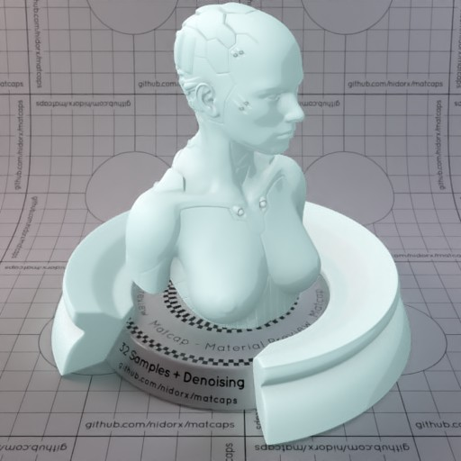

[[1024px](https://github.com/nidorx/matcaps/raw/master/1024/C4DEDE_C4DEDE_97B5B5_EAF9F9.png)]
[[512px](https://github.com/nidorx/matcaps/raw/master/512/C4DEDE_C4DEDE_97B5B5_EAF9F9-512px.png)]
[[256px](https://github.com/nidorx/matcaps/raw/master/256/C4DEDE_C4DEDE_97B5B5_EAF9F9-256px.png)]
[[128px](https://github.com/nidorx/matcaps/raw/master/128/C4DEDE_C4DEDE_97B5B5_EAF9F9-128px.png)]
[[64px](https://github.com/nidorx/matcaps/raw/master/64/C4DEDE_C4DEDE_97B5B5_EAF9F9-64px.png)]
[~~ZBrush Material (ZMT)~~]

---
### C5A292_C5A292_635247_F2D7D6

[[1024px](https://github.com/nidorx/matcaps/raw/master/1024/C5A292_C5A292_635247_F2D7D6.png)]
[[512px](https://github.com/nidorx/matcaps/raw/master/512/C5A292_C5A292_635247_F2D7D6-512px.png)]
[[256px](https://github.com/nidorx/matcaps/raw/master/256/C5A292_C5A292_635247_F2D7D6-256px.png)]
[[128px](https://github.com/nidorx/matcaps/raw/master/128/C5A292_C5A292_635247_F2D7D6-128px.png)]
[[64px](https://github.com/nidorx/matcaps/raw/master/64/C5A292_C5A292_635247_F2D7D6-64px.png)]
[~~ZBrush Material (ZMT)~~]

---
### C5BBB6_C5BBB6_F8F4F1_E2DAD6

[[1024px](https://github.com/nidorx/matcaps/raw/master/1024/C5BBB6_C5BBB6_F8F4F1_E2DAD6.png)]
[[512px](https://github.com/nidorx/matcaps/raw/master/512/C5BBB6_C5BBB6_F8F4F1_E2DAD6-512px.png)]
[[256px](https://github.com/nidorx/matcaps/raw/master/256/C5BBB6_C5BBB6_F8F4F1_E2DAD6-256px.png)]
[[128px](https://github.com/nidorx/matcaps/raw/master/128/C5BBB6_C5BBB6_F8F4F1_E2DAD6-128px.png)]
[[64px](https://github.com/nidorx/matcaps/raw/master/64/C5BBB6_C5BBB6_F8F4F1_E2DAD6-64px.png)]
[~~ZBrush Material (ZMT)~~]

---
### C75F55_C75F55_F8BDA9_EB9484
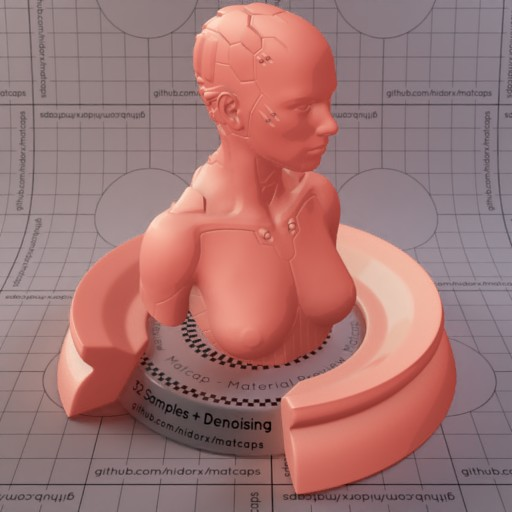

[[1024px](https://github.com/nidorx/matcaps/raw/master/1024/C75F55_C75F55_F8BDA9_EB9484.png)]
[[512px](https://github.com/nidorx/matcaps/raw/master/512/C75F55_C75F55_F8BDA9_EB9484-512px.png)]
[[256px](https://github.com/nidorx/matcaps/raw/master/256/C75F55_C75F55_F8BDA9_EB9484-256px.png)]
[[128px](https://github.com/nidorx/matcaps/raw/master/128/C75F55_C75F55_F8BDA9_EB9484-128px.png)]
[[64px](https://github.com/nidorx/matcaps/raw/master/64/C75F55_C75F55_F8BDA9_EB9484-64px.png)]
[~~ZBrush Material (ZMT)~~]

---
### C7B9A1_C7B9A1_F8F1E4_EEE4D2

[[1024px](https://github.com/nidorx/matcaps/raw/master/1024/C7B9A1_C7B9A1_F8F1E4_EEE4D2.png)]
[[512px](https://github.com/nidorx/matcaps/raw/master/512/C7B9A1_C7B9A1_F8F1E4_EEE4D2-512px.png)]
[[256px](https://github.com/nidorx/matcaps/raw/master/256/C7B9A1_C7B9A1_F8F1E4_EEE4D2-256px.png)]
[[128px](https://github.com/nidorx/matcaps/raw/master/128/C7B9A1_C7B9A1_F8F1E4_EEE4D2-128px.png)]
[[64px](https://github.com/nidorx/matcaps/raw/master/64/C7B9A1_C7B9A1_F8F1E4_EEE4D2-64px.png)]
[~~ZBrush Material (ZMT)~~]

---
### C7C0AC_C7C0AC_2E181B_543B30

[[1024px](https://github.com/nidorx/matcaps/raw/master/1024/C7C0AC_C7C0AC_2E181B_543B30.png)]
[[512px](https://github.com/nidorx/matcaps/raw/master/512/C7C0AC_C7C0AC_2E181B_543B30-512px.png)]
[[256px](https://github.com/nidorx/matcaps/raw/master/256/C7C0AC_C7C0AC_2E181B_543B30-256px.png)]
[[128px](https://github.com/nidorx/matcaps/raw/master/128/C7C0AC_C7C0AC_2E181B_543B30-128px.png)]
[[64px](https://github.com/nidorx/matcaps/raw/master/64/C7C0AC_C7C0AC_2E181B_543B30-64px.png)]
[[ZBrush Material (ZMT)](https://github.com/nidorx/matcaps/raw/master/zmt/C7C0AC_C7C0AC_2E181B_543B30.zmt)]

---
### C87157_C87157_F8CBAE_E9A582
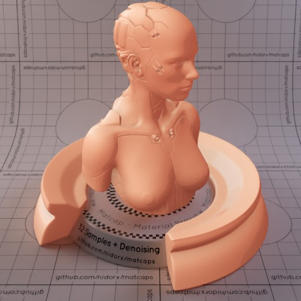

[[1024px](https://github.com/nidorx/matcaps/raw/master/1024/C87157_C87157_F8CBAE_E9A582.png)]
[[512px](https://github.com/nidorx/matcaps/raw/master/512/C87157_C87157_F8CBAE_E9A582-512px.png)]
[[256px](https://github.com/nidorx/matcaps/raw/master/256/C87157_C87157_F8CBAE_E9A582-256px.png)]
[[128px](https://github.com/nidorx/matcaps/raw/master/128/C87157_C87157_F8CBAE_E9A582-128px.png)]
[[64px](https://github.com/nidorx/matcaps/raw/master/64/C87157_C87157_F8CBAE_E9A582-64px.png)]
[~~ZBrush Material (ZMT)~~]

---
### C8AF84_C8AF84_F9ECD7_EFDEBF

[[1024px](https://github.com/nidorx/matcaps/raw/master/1024/C8AF84_C8AF84_F9ECD7_EFDEBF.png)]
[[512px](https://github.com/nidorx/matcaps/raw/master/512/C8AF84_C8AF84_F9ECD7_EFDEBF-512px.png)]
[[256px](https://github.com/nidorx/matcaps/raw/master/256/C8AF84_C8AF84_F9ECD7_EFDEBF-256px.png)]
[[128px](https://github.com/nidorx/matcaps/raw/master/128/C8AF84_C8AF84_F9ECD7_EFDEBF-128px.png)]
[[64px](https://github.com/nidorx/matcaps/raw/master/64/C8AF84_C8AF84_F9ECD7_EFDEBF-64px.png)]
[~~ZBrush Material (ZMT)~~]

---
### C8C8C8_C8C8C8_3F3F3F_787878

[[1024px](https://github.com/nidorx/matcaps/raw/master/1024/C8C8C8_C8C8C8_3F3F3F_787878.png)]
[[512px](https://github.com/nidorx/matcaps/raw/master/512/C8C8C8_C8C8C8_3F3F3F_787878-512px.png)]
[[256px](https://github.com/nidorx/matcaps/raw/master/256/C8C8C8_C8C8C8_3F3F3F_787878-256px.png)]
[[128px](https://github.com/nidorx/matcaps/raw/master/128/C8C8C8_C8C8C8_3F3F3F_787878-128px.png)]
[[64px](https://github.com/nidorx/matcaps/raw/master/64/C8C8C8_C8C8C8_3F3F3F_787878-64px.png)]
[[ZBrush Material (ZMT)](https://github.com/nidorx/matcaps/raw/master/zmt/C8C8C8_C8C8C8_3F3F3F_787878.zmt)]

---
### C8D1DC_C8D1DC_575B62_818892

[[1024px](https://github.com/nidorx/matcaps/raw/master/1024/C8D1DC_C8D1DC_575B62_818892.png)]
[[512px](https://github.com/nidorx/matcaps/raw/master/512/C8D1DC_C8D1DC_575B62_818892-512px.png)]
[[256px](https://github.com/nidorx/matcaps/raw/master/256/C8D1DC_C8D1DC_575B62_818892-256px.png)]
[[128px](https://github.com/nidorx/matcaps/raw/master/128/C8D1DC_C8D1DC_575B62_818892-128px.png)]
[[64px](https://github.com/nidorx/matcaps/raw/master/64/C8D1DC_C8D1DC_575B62_818892-64px.png)]
[[ZBrush Material (ZMT)](https://github.com/nidorx/matcaps/raw/master/zmt/C8D1DC_C8D1DC_575B62_818892.zmt)]

---
### C99A8B_C99A8B_491B0E_6E4136

[[1024px](https://github.com/nidorx/matcaps/raw/master/1024/C99A8B_C99A8B_491B0E_6E4136.png)]
[[512px](https://github.com/nidorx/matcaps/raw/master/512/C99A8B_C99A8B_491B0E_6E4136-512px.png)]
[[256px](https://github.com/nidorx/matcaps/raw/master/256/C99A8B_C99A8B_491B0E_6E4136-256px.png)]
[[128px](https://github.com/nidorx/matcaps/raw/master/128/C99A8B_C99A8B_491B0E_6E4136-128px.png)]
[[64px](https://github.com/nidorx/matcaps/raw/master/64/C99A8B_C99A8B_491B0E_6E4136-64px.png)]
[[ZBrush Material (ZMT)](https://github.com/nidorx/matcaps/raw/master/zmt/C99A8B_C99A8B_491B0E_6E4136.zmt)]

---
### CA4FE1_CA4FE1_6B2398_A337C7
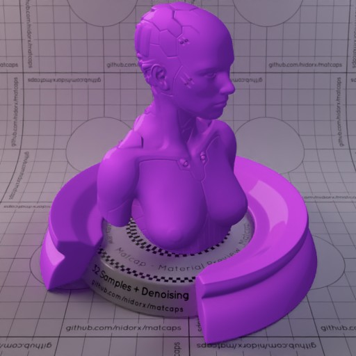

[[1024px](https://github.com/nidorx/matcaps/raw/master/1024/CA4FE1_CA4FE1_6B2398_A337C7.png)]
[[512px](https://github.com/nidorx/matcaps/raw/master/512/CA4FE1_CA4FE1_6B2398_A337C7-512px.png)]
[[256px](https://github.com/nidorx/matcaps/raw/master/256/CA4FE1_CA4FE1_6B2398_A337C7-256px.png)]
[[128px](https://github.com/nidorx/matcaps/raw/master/128/CA4FE1_CA4FE1_6B2398_A337C7-128px.png)]
[[64px](https://github.com/nidorx/matcaps/raw/master/64/CA4FE1_CA4FE1_6B2398_A337C7-64px.png)]
[~~ZBrush Material (ZMT)~~]

---
### CA8892_CA8892_F9D7DC_EBB8C0
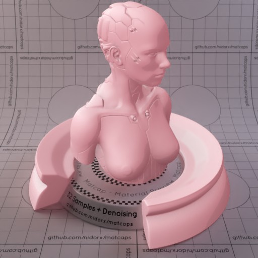

[[1024px](https://github.com/nidorx/matcaps/raw/master/1024/CA8892_CA8892_F9D7DC_EBB8C0.png)]
[[512px](https://github.com/nidorx/matcaps/raw/master/512/CA8892_CA8892_F9D7DC_EBB8C0-512px.png)]
[[256px](https://github.com/nidorx/matcaps/raw/master/256/CA8892_CA8892_F9D7DC_EBB8C0-256px.png)]
[[128px](https://github.com/nidorx/matcaps/raw/master/128/CA8892_CA8892_F9D7DC_EBB8C0-128px.png)]
[[64px](https://github.com/nidorx/matcaps/raw/master/64/CA8892_CA8892_F9D7DC_EBB8C0-64px.png)]
[~~ZBrush Material (ZMT)~~]

---
### CAA78A_CAA78A_F9E7D7_EAD0B9

[[1024px](https://github.com/nidorx/matcaps/raw/master/1024/CAA78A_CAA78A_F9E7D7_EAD0B9.png)]
[[512px](https://github.com/nidorx/matcaps/raw/master/512/CAA78A_CAA78A_F9E7D7_EAD0B9-512px.png)]
[[256px](https://github.com/nidorx/matcaps/raw/master/256/CAA78A_CAA78A_F9E7D7_EAD0B9-256px.png)]
[[128px](https://github.com/nidorx/matcaps/raw/master/128/CAA78A_CAA78A_F9E7D7_EAD0B9-128px.png)]
[[64px](https://github.com/nidorx/matcaps/raw/master/64/CAA78A_CAA78A_F9E7D7_EAD0B9-64px.png)]
[~~ZBrush Material (ZMT)~~]

---
### CAAC80_CAAC80_FAEBD5_F2DEBF
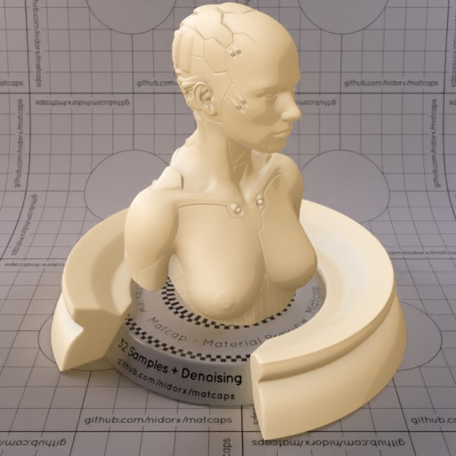

[[1024px](https://github.com/nidorx/matcaps/raw/master/1024/CAAC80_CAAC80_FAEBD5_F2DEBF.png)]
[[512px](https://github.com/nidorx/matcaps/raw/master/512/CAAC80_CAAC80_FAEBD5_F2DEBF-512px.png)]
[[256px](https://github.com/nidorx/matcaps/raw/master/256/CAAC80_CAAC80_FAEBD5_F2DEBF-256px.png)]
[[128px](https://github.com/nidorx/matcaps/raw/master/128/CAAC80_CAAC80_FAEBD5_F2DEBF-128px.png)]
[[64px](https://github.com/nidorx/matcaps/raw/master/64/CAAC80_CAAC80_FAEBD5_F2DEBF-64px.png)]
[~~ZBrush Material (ZMT)~~]

---
### CAB094_CAB094_F9ECDD_EFDEC8

[[1024px](https://github.com/nidorx/matcaps/raw/master/1024/CAB094_CAB094_F9ECDD_EFDEC8.png)]
[[512px](https://github.com/nidorx/matcaps/raw/master/512/CAB094_CAB094_F9ECDD_EFDEC8-512px.png)]
[[256px](https://github.com/nidorx/matcaps/raw/master/256/CAB094_CAB094_F9ECDD_EFDEC8-256px.png)]
[[128px](https://github.com/nidorx/matcaps/raw/master/128/CAB094_CAB094_F9ECDD_EFDEC8-128px.png)]
[[64px](https://github.com/nidorx/matcaps/raw/master/64/CAB094_CAB094_F9ECDD_EFDEC8-64px.png)]
[~~ZBrush Material (ZMT)~~]

---
### CAB79D_CAB79D_F9F1E3_F1E5D1

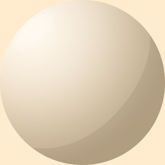

[[1024px](https://github.com/nidorx/matcaps/raw/master/1024/CAB79D_CAB79D_F9F1E3_F1E5D1.png)]
[[512px](https://github.com/nidorx/matcaps/raw/master/512/CAB79D_CAB79D_F9F1E3_F1E5D1-512px.png)]
[[256px](https://github.com/nidorx/matcaps/raw/master/256/CAB79D_CAB79D_F9F1E3_F1E5D1-256px.png)]
[[128px](https://github.com/nidorx/matcaps/raw/master/128/CAB79D_CAB79D_F9F1E3_F1E5D1-128px.png)]
[[64px](https://github.com/nidorx/matcaps/raw/master/64/CAB79D_CAB79D_F9F1E3_F1E5D1-64px.png)]
[~~ZBrush Material (ZMT)~~]

---
### CAE24E_CAE24E_6C9A23_A3C737
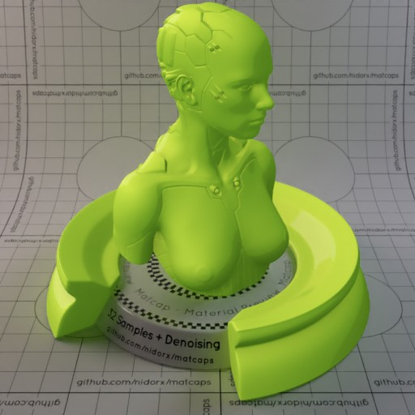

[[1024px](https://github.com/nidorx/matcaps/raw/master/1024/CAE24E_CAE24E_6C9A23_A3C737.png)]
[[512px](https://github.com/nidorx/matcaps/raw/master/512/CAE24E_CAE24E_6C9A23_A3C737-512px.png)]
[[256px](https://github.com/nidorx/matcaps/raw/master/256/CAE24E_CAE24E_6C9A23_A3C737-256px.png)]
[[128px](https://github.com/nidorx/matcaps/raw/master/128/CAE24E_CAE24E_6C9A23_A3C737-128px.png)]
[[64px](https://github.com/nidorx/matcaps/raw/master/64/CAE24E_CAE24E_6C9A23_A3C737-64px.png)]
[~~ZBrush Material (ZMT)~~]

---
### CB4934_CB4934_FB9971_F07554
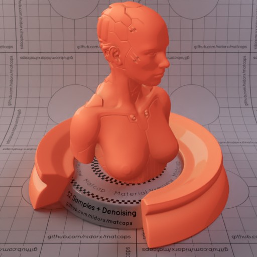

[[1024px](https://github.com/nidorx/matcaps/raw/master/1024/CB4934_CB4934_FB9971_F07554.png)]
[[512px](https://github.com/nidorx/matcaps/raw/master/512/CB4934_CB4934_FB9971_F07554-512px.png)]
[[256px](https://github.com/nidorx/matcaps/raw/master/256/CB4934_CB4934_FB9971_F07554-256px.png)]
[[128px](https://github.com/nidorx/matcaps/raw/master/128/CB4934_CB4934_FB9971_F07554-128px.png)]
[[64px](https://github.com/nidorx/matcaps/raw/master/64/CB4934_CB4934_FB9971_F07554-64px.png)]
[~~ZBrush Material (ZMT)~~]

---
### CB4E88_CB4E88_F99AD6_F384C3
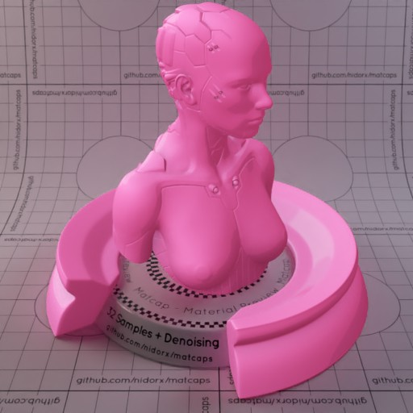

[[1024px](https://github.com/nidorx/matcaps/raw/master/1024/CB4E88_CB4E88_F99AD6_F384C3.png)]
[[512px](https://github.com/nidorx/matcaps/raw/master/512/CB4E88_CB4E88_F99AD6_F384C3-512px.png)]
[[256px](https://github.com/nidorx/matcaps/raw/master/256/CB4E88_CB4E88_F99AD6_F384C3-256px.png)]
[[128px](https://github.com/nidorx/matcaps/raw/master/128/CB4E88_CB4E88_F99AD6_F384C3-128px.png)]
[[64px](https://github.com/nidorx/matcaps/raw/master/64/CB4E88_CB4E88_F99AD6_F384C3-64px.png)]
[~~ZBrush Material (ZMT)~~]

---
### CB5E3B_CB5E3B_FABC7A_EF965E
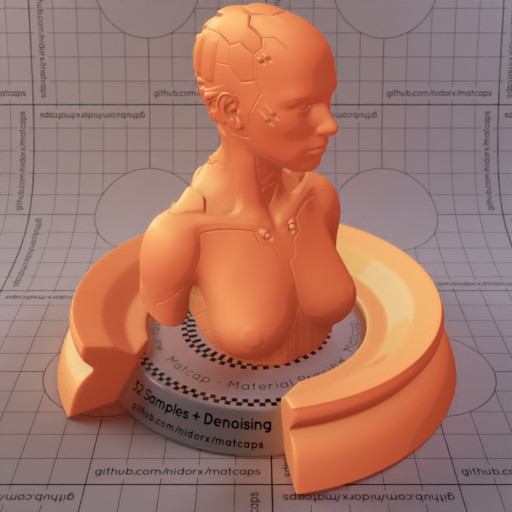
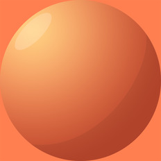

[[1024px](https://github.com/nidorx/matcaps/raw/master/1024/CB5E3B_CB5E3B_FABC7A_EF965E.png)]
[[512px](https://github.com/nidorx/matcaps/raw/master/512/CB5E3B_CB5E3B_FABC7A_EF965E-512px.png)]
[[256px](https://github.com/nidorx/matcaps/raw/master/256/CB5E3B_CB5E3B_FABC7A_EF965E-256px.png)]
[[128px](https://github.com/nidorx/matcaps/raw/master/128/CB5E3B_CB5E3B_FABC7A_EF965E-128px.png)]
[[64px](https://github.com/nidorx/matcaps/raw/master/64/CB5E3B_CB5E3B_FABC7A_EF965E-64px.png)]
[~~ZBrush Material (ZMT)~~]

---
### CB7146_CB7146_551D0F_7C270D

[[1024px](https://github.com/nidorx/matcaps/raw/master/1024/CB7146_CB7146_551D0F_7C270D.png)]
[[512px](https://github.com/nidorx/matcaps/raw/master/512/CB7146_CB7146_551D0F_7C270D-512px.png)]
[[256px](https://github.com/nidorx/matcaps/raw/master/256/CB7146_CB7146_551D0F_7C270D-256px.png)]
[[128px](https://github.com/nidorx/matcaps/raw/master/128/CB7146_CB7146_551D0F_7C270D-128px.png)]
[[64px](https://github.com/nidorx/matcaps/raw/master/64/CB7146_CB7146_551D0F_7C270D-64px.png)]
[[ZBrush Material (ZMT)](https://github.com/nidorx/matcaps/raw/master/zmt/CB7146_CB7146_551D0F_7C270D.zmt)]

---