A huge library of MatCap textures in PNG and ZMT.

## Navigation
* [Home](/)
* [Page 1](PAGE-1.md)
* [Page 2](PAGE-2.md)
* [Page 3](PAGE-3.md)
* [Page 4](PAGE-4.md)
* [Page 5](PAGE-5.md)
* Page 6
* [Page 7](PAGE-7.md)
* [Page 8](PAGE-8.md)
* [Page 9](PAGE-9.md)
* [Page 10](PAGE-10.md)
* [Page 11](PAGE-11.md)
* [Page 12](PAGE-12.md)
* [Page 13](PAGE-13.md)
* [Page 14](PAGE-14.md)
* [Page 15](PAGE-15.md)
* [Page 16](PAGE-16.md)
* [Page 17](PAGE-17.md)
* [Page 18](PAGE-18.md)
* [Page 19](PAGE-19.md)
* [Page 20](PAGE-20.md)
* [Page 21](PAGE-21.md)
* [Page 22](PAGE-22.md)
* [Page 23](PAGE-23.md)
* [Page 24](PAGE-24.md)
* [Page 25](PAGE-25.md)
* [Page 26](PAGE-26.md)
* [Page 27](PAGE-27.md)
* [Page 28](PAGE-28.md)
* [Page 29](PAGE-29.md)
* [Page 30](PAGE-30.md)
* [Page 31](PAGE-31.md)
* [Page 32](PAGE-32.md)
* [Page 33](PAGE-33.md)
## Page 6 Matcaps
### 3E2335_D36A1B_8E4A2E_2842A5
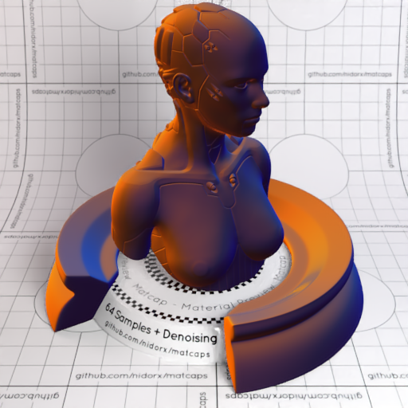
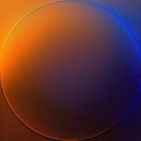

[[1024px](https://github.com/nidorx/matcaps/raw/master/1024/3E2335_D36A1B_8E4A2E_2842A5.png)]
[[512px](https://github.com/nidorx/matcaps/raw/master/512/3E2335_D36A1B_8E4A2E_2842A5-512px.png)]
[[256px](https://github.com/nidorx/matcaps/raw/master/256/3E2335_D36A1B_8E4A2E_2842A5-256px.png)]
[[128px](https://github.com/nidorx/matcaps/raw/master/128/3E2335_D36A1B_8E4A2E_2842A5-128px.png)]
[[64px](https://github.com/nidorx/matcaps/raw/master/64/3E2335_D36A1B_8E4A2E_2842A5-64px.png)]
[[ZBrush Material (ZMT)](https://github.com/nidorx/matcaps/raw/master/zmt/3E2335_D36A1B_8E4A2E_2842A5.zmt)]

---
### 3E3D39_D6CEAF_91BAC1_897966
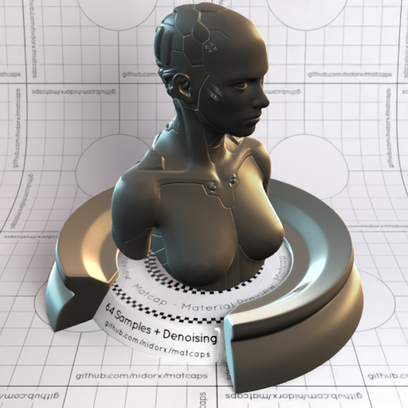

[[1024px](https://github.com/nidorx/matcaps/raw/master/1024/3E3D39_D6CEAF_91BAC1_897966.png)]
[[512px](https://github.com/nidorx/matcaps/raw/master/512/3E3D39_D6CEAF_91BAC1_897966-512px.png)]
[[256px](https://github.com/nidorx/matcaps/raw/master/256/3E3D39_D6CEAF_91BAC1_897966-256px.png)]
[[128px](https://github.com/nidorx/matcaps/raw/master/128/3E3D39_D6CEAF_91BAC1_897966-128px.png)]
[[64px](https://github.com/nidorx/matcaps/raw/master/64/3E3D39_D6CEAF_91BAC1_897966-64px.png)]
[[ZBrush Material (ZMT)](https://github.com/nidorx/matcaps/raw/master/zmt/3E3D39_D6CEAF_91BAC1_897966.zmt)]

---
### 3E3E36_72726D_63645D_0E0F0C
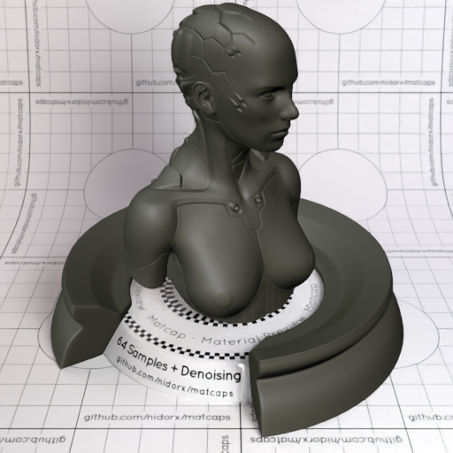
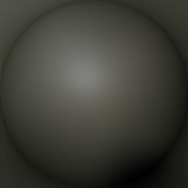

[[1024px](https://github.com/nidorx/matcaps/raw/master/1024/3E3E36_72726D_63645D_0E0F0C.png)]
[[512px](https://github.com/nidorx/matcaps/raw/master/512/3E3E36_72726D_63645D_0E0F0C-512px.png)]
[[256px](https://github.com/nidorx/matcaps/raw/master/256/3E3E36_72726D_63645D_0E0F0C-256px.png)]
[[128px](https://github.com/nidorx/matcaps/raw/master/128/3E3E36_72726D_63645D_0E0F0C-128px.png)]
[[64px](https://github.com/nidorx/matcaps/raw/master/64/3E3E36_72726D_63645D_0E0F0C-64px.png)]
[[ZBrush Material (ZMT)](https://github.com/nidorx/matcaps/raw/master/zmt/3E3E36_72726D_63645D_0E0F0C.zmt)]

---
### 3E3E3E_AEAEAE_848484_777777
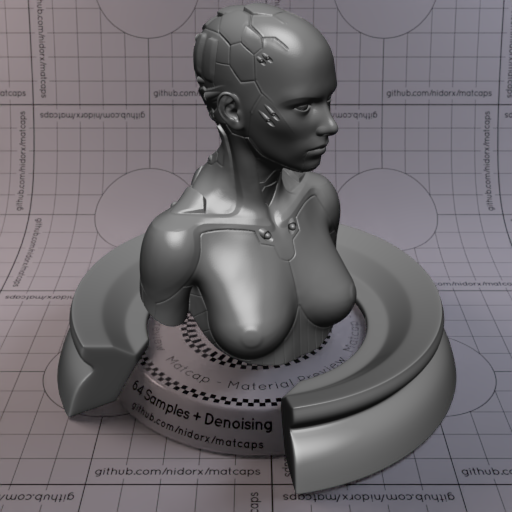

[[1024px](https://github.com/nidorx/matcaps/raw/master/1024/3E3E3E_AEAEAE_848484_777777.png)]
[[512px](https://github.com/nidorx/matcaps/raw/master/512/3E3E3E_AEAEAE_848484_777777-512px.png)]
[[256px](https://github.com/nidorx/matcaps/raw/master/256/3E3E3E_AEAEAE_848484_777777-256px.png)]
[[128px](https://github.com/nidorx/matcaps/raw/master/128/3E3E3E_AEAEAE_848484_777777-128px.png)]
[[64px](https://github.com/nidorx/matcaps/raw/master/64/3E3E3E_AEAEAE_848484_777777-64px.png)]
[[ZBrush Material (ZMT)](https://github.com/nidorx/matcaps/raw/master/zmt/3E3E3E_AEAEAE_848484_777777.zmt)]

---
### 3E95CC_65D9F1_A2E2F6_679BD4
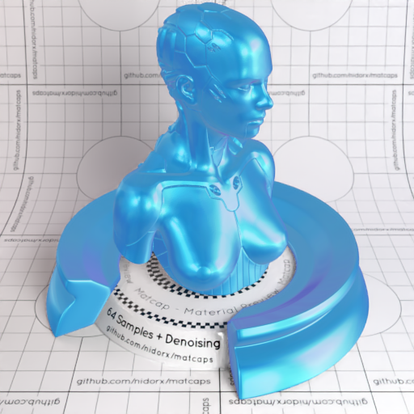
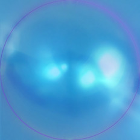

[[1024px](https://github.com/nidorx/matcaps/raw/master/1024/3E95CC_65D9F1_A2E2F6_679BD4.png)]
[[512px](https://github.com/nidorx/matcaps/raw/master/512/3E95CC_65D9F1_A2E2F6_679BD4-512px.png)]
[[256px](https://github.com/nidorx/matcaps/raw/master/256/3E95CC_65D9F1_A2E2F6_679BD4-256px.png)]
[[128px](https://github.com/nidorx/matcaps/raw/master/128/3E95CC_65D9F1_A2E2F6_679BD4-128px.png)]
[[64px](https://github.com/nidorx/matcaps/raw/master/64/3E95CC_65D9F1_A2E2F6_679BD4-64px.png)]
[[ZBrush Material (ZMT)](https://github.com/nidorx/matcaps/raw/master/zmt/3E95CC_65D9F1_A2E2F6_679BD4.zmt)]

---
### 3F3A2F_91D0A5_7D876A_94977B
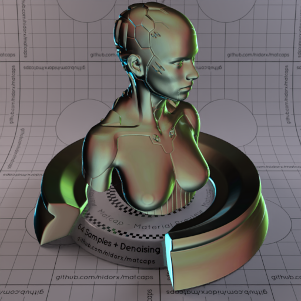
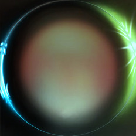

[[1024px](https://github.com/nidorx/matcaps/raw/master/1024/3F3A2F_91D0A5_7D876A_94977B.png)]
[[512px](https://github.com/nidorx/matcaps/raw/master/512/3F3A2F_91D0A5_7D876A_94977B-512px.png)]
[[256px](https://github.com/nidorx/matcaps/raw/master/256/3F3A2F_91D0A5_7D876A_94977B-256px.png)]
[[128px](https://github.com/nidorx/matcaps/raw/master/128/3F3A2F_91D0A5_7D876A_94977B-128px.png)]
[[64px](https://github.com/nidorx/matcaps/raw/master/64/3F3A2F_91D0A5_7D876A_94977B-64px.png)]
[[ZBrush Material (ZMT)](https://github.com/nidorx/matcaps/raw/master/zmt/3F3A2F_91D0A5_7D876A_94977B.zmt)]

---
### 3F3D52_CCCED9_AFB0C6_8D8CAC
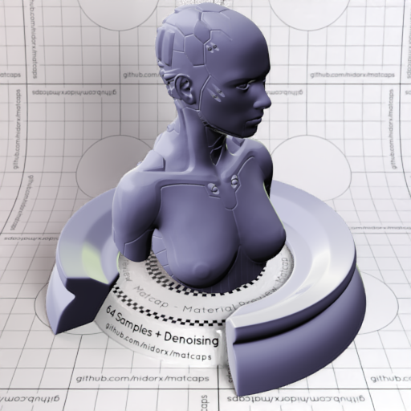

[[1024px](https://github.com/nidorx/matcaps/raw/master/1024/3F3D52_CCCED9_AFB0C6_8D8CAC.png)]
[[512px](https://github.com/nidorx/matcaps/raw/master/512/3F3D52_CCCED9_AFB0C6_8D8CAC-512px.png)]
[[256px](https://github.com/nidorx/matcaps/raw/master/256/3F3D52_CCCED9_AFB0C6_8D8CAC-256px.png)]
[[128px](https://github.com/nidorx/matcaps/raw/master/128/3F3D52_CCCED9_AFB0C6_8D8CAC-128px.png)]
[[64px](https://github.com/nidorx/matcaps/raw/master/64/3F3D52_CCCED9_AFB0C6_8D8CAC-64px.png)]
[[ZBrush Material (ZMT)](https://github.com/nidorx/matcaps/raw/master/zmt/3F3D52_CCCED9_AFB0C6_8D8CAC.zmt)]

---
### 3F4441_D1D7D6_888F87_A2ADA1
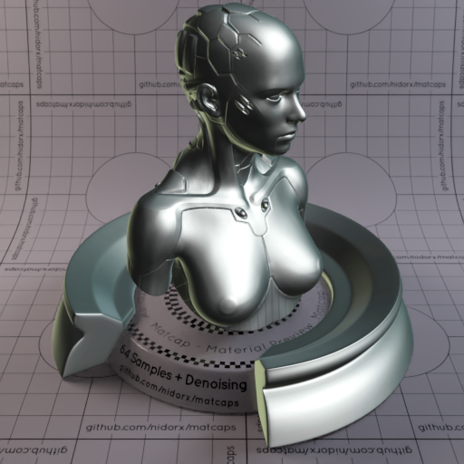

[[1024px](https://github.com/nidorx/matcaps/raw/master/1024/3F4441_D1D7D6_888F87_A2ADA1.png)]
[[512px](https://github.com/nidorx/matcaps/raw/master/512/3F4441_D1D7D6_888F87_A2ADA1-512px.png)]
[[256px](https://github.com/nidorx/matcaps/raw/master/256/3F4441_D1D7D6_888F87_A2ADA1-256px.png)]
[[128px](https://github.com/nidorx/matcaps/raw/master/128/3F4441_D1D7D6_888F87_A2ADA1-128px.png)]
[[64px](https://github.com/nidorx/matcaps/raw/master/64/3F4441_D1D7D6_888F87_A2ADA1-64px.png)]
[[ZBrush Material (ZMT)](https://github.com/nidorx/matcaps/raw/master/zmt/3F4441_D1D7D6_888F87_A2ADA1.zmt)]

---
### 403A34_B0936E_7F979C_7E6956
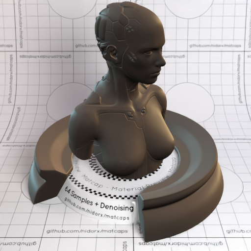
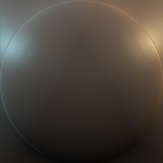

[[1024px](https://github.com/nidorx/matcaps/raw/master/1024/403A34_B0936E_7F979C_7E6956.png)]
[[512px](https://github.com/nidorx/matcaps/raw/master/512/403A34_B0936E_7F979C_7E6956-512px.png)]
[[256px](https://github.com/nidorx/matcaps/raw/master/256/403A34_B0936E_7F979C_7E6956-256px.png)]
[[128px](https://github.com/nidorx/matcaps/raw/master/128/403A34_B0936E_7F979C_7E6956-128px.png)]
[[64px](https://github.com/nidorx/matcaps/raw/master/64/403A34_B0936E_7F979C_7E6956-64px.png)]
[[ZBrush Material (ZMT)](https://github.com/nidorx/matcaps/raw/master/zmt/403A34_B0936E_7F979C_7E6956.zmt)]

---
### 415325_83A24E_678239_748C3C
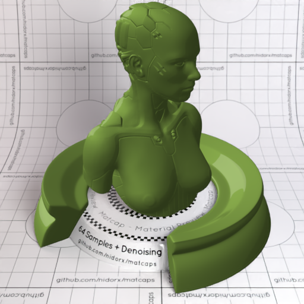

[[1024px](https://github.com/nidorx/matcaps/raw/master/1024/415325_83A24E_678239_748C3C.png)]
[[512px](https://github.com/nidorx/matcaps/raw/master/512/415325_83A24E_678239_748C3C-512px.png)]
[[256px](https://github.com/nidorx/matcaps/raw/master/256/415325_83A24E_678239_748C3C-256px.png)]
[[128px](https://github.com/nidorx/matcaps/raw/master/128/415325_83A24E_678239_748C3C-128px.png)]
[[64px](https://github.com/nidorx/matcaps/raw/master/64/415325_83A24E_678239_748C3C-64px.png)]
[~~ZBrush Material (ZMT)~~]

---
### 416BA7_A5B8D0_0D2549_65ABEB

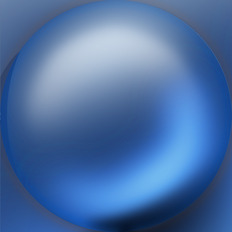

[[1024px](https://github.com/nidorx/matcaps/raw/master/1024/416BA7_A5B8D0_0D2549_65ABEB.png)]
[[512px](https://github.com/nidorx/matcaps/raw/master/512/416BA7_A5B8D0_0D2549_65ABEB-512px.png)]
[[256px](https://github.com/nidorx/matcaps/raw/master/256/416BA7_A5B8D0_0D2549_65ABEB-256px.png)]
[[128px](https://github.com/nidorx/matcaps/raw/master/128/416BA7_A5B8D0_0D2549_65ABEB-128px.png)]
[[64px](https://github.com/nidorx/matcaps/raw/master/64/416BA7_A5B8D0_0D2549_65ABEB-64px.png)]
[[ZBrush Material (ZMT)](https://github.com/nidorx/matcaps/raw/master/zmt/416BA7_A5B8D0_0D2549_65ABEB.zmt)]

---
### 422509_C89536_824512_0A0604
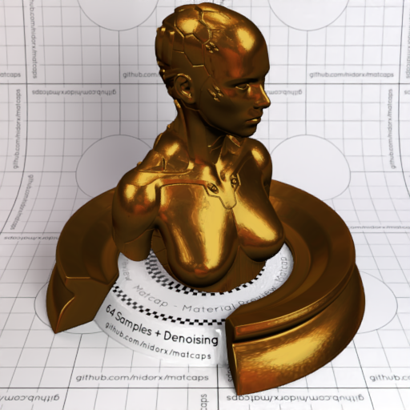
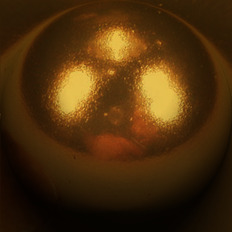

[[1024px](https://github.com/nidorx/matcaps/raw/master/1024/422509_C89536_824512_0A0604.png)]
[[512px](https://github.com/nidorx/matcaps/raw/master/512/422509_C89536_824512_0A0604-512px.png)]
[[256px](https://github.com/nidorx/matcaps/raw/master/256/422509_C89536_824512_0A0604-256px.png)]
[[128px](https://github.com/nidorx/matcaps/raw/master/128/422509_C89536_824512_0A0604-128px.png)]
[[64px](https://github.com/nidorx/matcaps/raw/master/64/422509_C89536_824512_0A0604-64px.png)]
[[ZBrush Material (ZMT)](https://github.com/nidorx/matcaps/raw/master/zmt/422509_C89536_824512_0A0604.zmt)]

---
### 422A1E_716767_685D59_5E4F4A
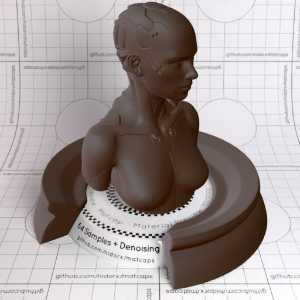

[[1024px](https://github.com/nidorx/matcaps/raw/master/1024/422A1E_716767_685D59_5E4F4A.png)]
[[512px](https://github.com/nidorx/matcaps/raw/master/512/422A1E_716767_685D59_5E4F4A-512px.png)]
[[256px](https://github.com/nidorx/matcaps/raw/master/256/422A1E_716767_685D59_5E4F4A-256px.png)]
[[128px](https://github.com/nidorx/matcaps/raw/master/128/422A1E_716767_685D59_5E4F4A-128px.png)]
[[64px](https://github.com/nidorx/matcaps/raw/master/64/422A1E_716767_685D59_5E4F4A-64px.png)]
[[ZBrush Material (ZMT)](https://github.com/nidorx/matcaps/raw/master/zmt/422A1E_716767_685D59_5E4F4A.zmt)]

---
### 424244_BDBBBE_8A898E_A3A4A9
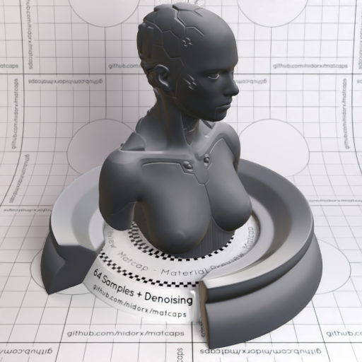

[[1024px](https://github.com/nidorx/matcaps/raw/master/1024/424244_BDBBBE_8A898E_A3A4A9.png)]
[[512px](https://github.com/nidorx/matcaps/raw/master/512/424244_BDBBBE_8A898E_A3A4A9-512px.png)]
[[256px](https://github.com/nidorx/matcaps/raw/master/256/424244_BDBBBE_8A898E_A3A4A9-256px.png)]
[[128px](https://github.com/nidorx/matcaps/raw/master/128/424244_BDBBBE_8A898E_A3A4A9-128px.png)]
[[64px](https://github.com/nidorx/matcaps/raw/master/64/424244_BDBBBE_8A898E_A3A4A9-64px.png)]
[[ZBrush Material (ZMT)](https://github.com/nidorx/matcaps/raw/master/zmt/424244_BDBBBE_8A898E_A3A4A9.zmt)]

---
### 425F84_1C2939_2A3F57_24344C
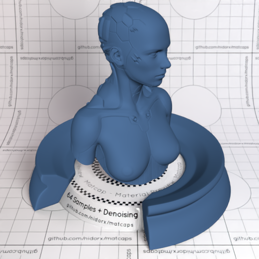
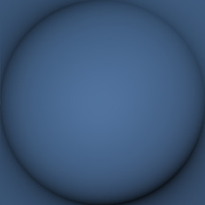

[[1024px](https://github.com/nidorx/matcaps/raw/master/1024/425F84_1C2939_2A3F57_24344C.png)]
[[512px](https://github.com/nidorx/matcaps/raw/master/512/425F84_1C2939_2A3F57_24344C-512px.png)]
[[256px](https://github.com/nidorx/matcaps/raw/master/256/425F84_1C2939_2A3F57_24344C-256px.png)]
[[128px](https://github.com/nidorx/matcaps/raw/master/128/425F84_1C2939_2A3F57_24344C-128px.png)]
[[64px](https://github.com/nidorx/matcaps/raw/master/64/425F84_1C2939_2A3F57_24344C-64px.png)]
[[ZBrush Material (ZMT)](https://github.com/nidorx/matcaps/raw/master/zmt/425F84_1C2939_2A3F57_24344C.zmt)]

---
### 430404_BD9295_7E1E21_94544C
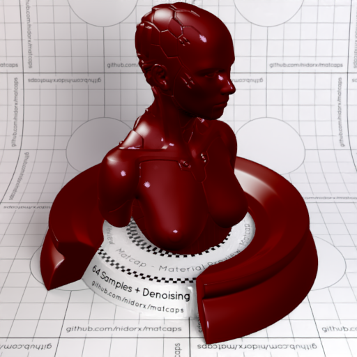

[[1024px](https://github.com/nidorx/matcaps/raw/master/1024/430404_BD9295_7E1E21_94544C.png)]
[[512px](https://github.com/nidorx/matcaps/raw/master/512/430404_BD9295_7E1E21_94544C-512px.png)]
[[256px](https://github.com/nidorx/matcaps/raw/master/256/430404_BD9295_7E1E21_94544C-256px.png)]
[[128px](https://github.com/nidorx/matcaps/raw/master/128/430404_BD9295_7E1E21_94544C-128px.png)]
[[64px](https://github.com/nidorx/matcaps/raw/master/64/430404_BD9295_7E1E21_94544C-64px.png)]
[[ZBrush Material (ZMT)](https://github.com/nidorx/matcaps/raw/master/zmt/430404_BD9295_7E1E21_94544C.zmt)]

---
### 432322_5E3839_170C0B_543433
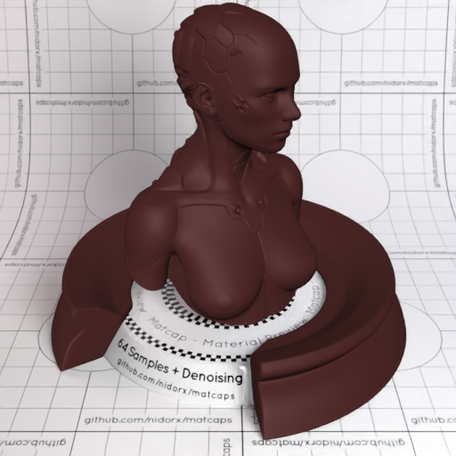

[[1024px](https://github.com/nidorx/matcaps/raw/master/1024/432322_5E3839_170C0B_543433.png)]
[[512px](https://github.com/nidorx/matcaps/raw/master/512/432322_5E3839_170C0B_543433-512px.png)]
[[256px](https://github.com/nidorx/matcaps/raw/master/256/432322_5E3839_170C0B_543433-256px.png)]
[[128px](https://github.com/nidorx/matcaps/raw/master/128/432322_5E3839_170C0B_543433-128px.png)]
[[64px](https://github.com/nidorx/matcaps/raw/master/64/432322_5E3839_170C0B_543433-64px.png)]
[[ZBrush Material (ZMT)](https://github.com/nidorx/matcaps/raw/master/zmt/432322_5E3839_170C0B_543433.zmt)]

---
### 433D3F_A58D7D_786760_8C7C6D
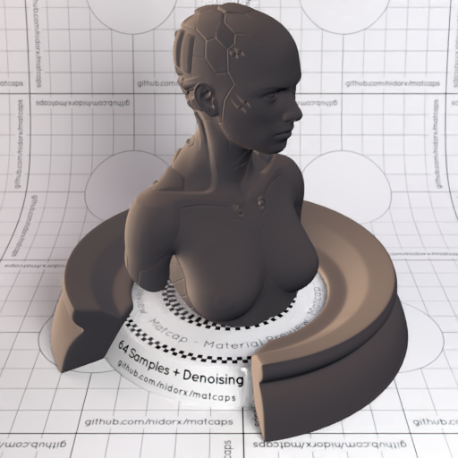
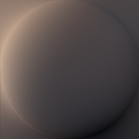

[[1024px](https://github.com/nidorx/matcaps/raw/master/1024/433D3F_A58D7D_786760_8C7C6D.png)]
[[512px](https://github.com/nidorx/matcaps/raw/master/512/433D3F_A58D7D_786760_8C7C6D-512px.png)]
[[256px](https://github.com/nidorx/matcaps/raw/master/256/433D3F_A58D7D_786760_8C7C6D-256px.png)]
[[128px](https://github.com/nidorx/matcaps/raw/master/128/433D3F_A58D7D_786760_8C7C6D-128px.png)]
[[64px](https://github.com/nidorx/matcaps/raw/master/64/433D3F_A58D7D_786760_8C7C6D-64px.png)]
[[ZBrush Material (ZMT)](https://github.com/nidorx/matcaps/raw/master/zmt/433D3F_A58D7D_786760_8C7C6D.zmt)]

---
### 434240_D3D3CF_898784_A4A49F
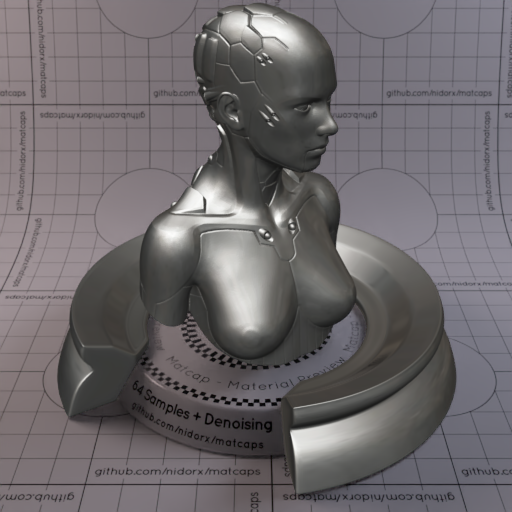
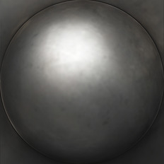

[[1024px](https://github.com/nidorx/matcaps/raw/master/1024/434240_D3D3CF_898784_A4A49F.png)]
[[512px](https://github.com/nidorx/matcaps/raw/master/512/434240_D3D3CF_898784_A4A49F-512px.png)]
[[256px](https://github.com/nidorx/matcaps/raw/master/256/434240_D3D3CF_898784_A4A49F-256px.png)]
[[128px](https://github.com/nidorx/matcaps/raw/master/128/434240_D3D3CF_898784_A4A49F-128px.png)]
[[64px](https://github.com/nidorx/matcaps/raw/master/64/434240_D3D3CF_898784_A4A49F-64px.png)]
[[ZBrush Material (ZMT)](https://github.com/nidorx/matcaps/raw/master/zmt/434240_D3D3CF_898784_A4A49F.zmt)]

---
### 434343_9E9E9E_8C8C8C_848484
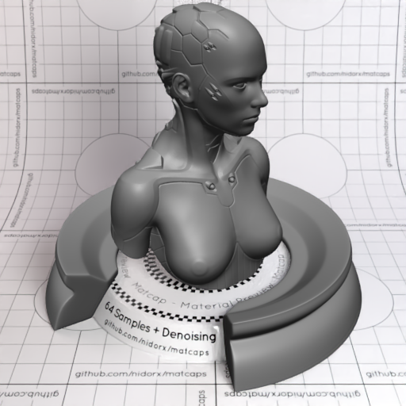

[[1024px](https://github.com/nidorx/matcaps/raw/master/1024/434343_9E9E9E_8C8C8C_848484.png)]
[[512px](https://github.com/nidorx/matcaps/raw/master/512/434343_9E9E9E_8C8C8C_848484-512px.png)]
[[256px](https://github.com/nidorx/matcaps/raw/master/256/434343_9E9E9E_8C8C8C_848484-256px.png)]
[[128px](https://github.com/nidorx/matcaps/raw/master/128/434343_9E9E9E_8C8C8C_848484-128px.png)]
[[64px](https://github.com/nidorx/matcaps/raw/master/64/434343_9E9E9E_8C8C8C_848484-64px.png)]
[[ZBrush Material (ZMT)](https://github.com/nidorx/matcaps/raw/master/zmt/434343_9E9E9E_8C8C8C_848484.zmt)]

---