A huge library of MatCap textures in PNG and ZMT.

## Navigation
* [Home](/)
* [Page 1](PAGE-1.md)
* [Page 2](PAGE-2.md)
* [Page 3](PAGE-3.md)
* [Page 4](PAGE-4.md)
* [Page 5](PAGE-5.md)
* [Page 6](PAGE-6.md)
* Page 7
* [Page 8](PAGE-8.md)
* [Page 9](PAGE-9.md)
* [Page 10](PAGE-10.md)
* [Page 11](PAGE-11.md)
* [Page 12](PAGE-12.md)
* [Page 13](PAGE-13.md)
* [Page 14](PAGE-14.md)
* [Page 15](PAGE-15.md)
* [Page 16](PAGE-16.md)
* [Page 17](PAGE-17.md)
* [Page 18](PAGE-18.md)
* [Page 19](PAGE-19.md)
* [Page 20](PAGE-20.md)
* [Page 21](PAGE-21.md)
* [Page 22](PAGE-22.md)
* [Page 23](PAGE-23.md)
* [Page 24](PAGE-24.md)
* [Page 25](PAGE-25.md)
* [Page 26](PAGE-26.md)
* [Page 27](PAGE-27.md)
* [Page 28](PAGE-28.md)
* [Page 29](PAGE-29.md)
* [Page 30](PAGE-30.md)
* [Page 31](PAGE-31.md)
* [Page 32](PAGE-32.md)
* [Page 33](PAGE-33.md)
## Page 7 Matcaps
### 434C32_62704C_546244_2F3220
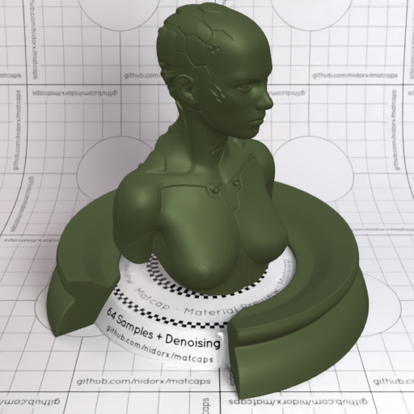

[[1024px](https://github.com/nidorx/matcaps/raw/master/1024/434C32_62704C_546244_2F3220.png)]
[[512px](https://github.com/nidorx/matcaps/raw/master/512/434C32_62704C_546244_2F3220-512px.png)]
[[256px](https://github.com/nidorx/matcaps/raw/master/256/434C32_62704C_546244_2F3220-256px.png)]
[[128px](https://github.com/nidorx/matcaps/raw/master/128/434C32_62704C_546244_2F3220-128px.png)]
[[64px](https://github.com/nidorx/matcaps/raw/master/64/434C32_62704C_546244_2F3220-64px.png)]
[[ZBrush Material (ZMT)](https://github.com/nidorx/matcaps/raw/master/zmt/434C32_62704C_546244_2F3220.zmt)]

---
### 442C27_A79E90_847066_8D837C
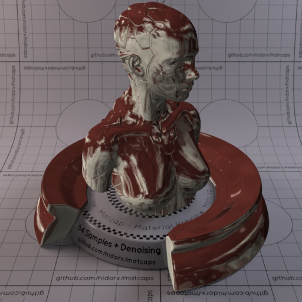

[[1024px](https://github.com/nidorx/matcaps/raw/master/1024/442C27_A79E90_847066_8D837C.png)]
[[512px](https://github.com/nidorx/matcaps/raw/master/512/442C27_A79E90_847066_8D837C-512px.png)]
[[256px](https://github.com/nidorx/matcaps/raw/master/256/442C27_A79E90_847066_8D837C-256px.png)]
[[128px](https://github.com/nidorx/matcaps/raw/master/128/442C27_A79E90_847066_8D837C-128px.png)]
[[64px](https://github.com/nidorx/matcaps/raw/master/64/442C27_A79E90_847066_8D837C-64px.png)]
[[ZBrush Material (ZMT)](https://github.com/nidorx/matcaps/raw/master/zmt/442C27_A79E90_847066_8D837C.zmt)]

---
### 447072_8ACACB_65A4A5_74B3B3
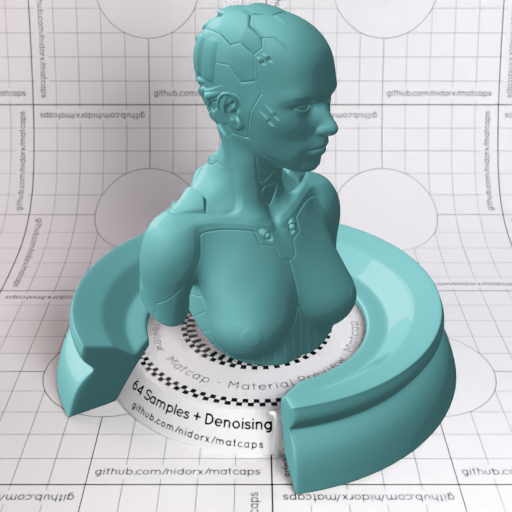
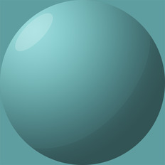

[[1024px](https://github.com/nidorx/matcaps/raw/master/1024/447072_8ACACB_65A4A5_74B3B3.png)]
[[512px](https://github.com/nidorx/matcaps/raw/master/512/447072_8ACACB_65A4A5_74B3B3-512px.png)]
[[256px](https://github.com/nidorx/matcaps/raw/master/256/447072_8ACACB_65A4A5_74B3B3-256px.png)]
[[128px](https://github.com/nidorx/matcaps/raw/master/128/447072_8ACACB_65A4A5_74B3B3-128px.png)]
[[64px](https://github.com/nidorx/matcaps/raw/master/64/447072_8ACACB_65A4A5_74B3B3-64px.png)]
[~~ZBrush Material (ZMT)~~]

---
### 45432C_808361_B8C8BC_A5A27A
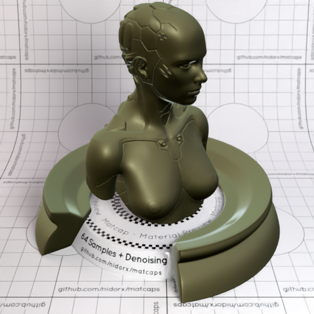

[[1024px](https://github.com/nidorx/matcaps/raw/master/1024/45432C_808361_B8C8BC_A5A27A.png)]
[[512px](https://github.com/nidorx/matcaps/raw/master/512/45432C_808361_B8C8BC_A5A27A-512px.png)]
[[256px](https://github.com/nidorx/matcaps/raw/master/256/45432C_808361_B8C8BC_A5A27A-256px.png)]
[[128px](https://github.com/nidorx/matcaps/raw/master/128/45432C_808361_B8C8BC_A5A27A-128px.png)]
[[64px](https://github.com/nidorx/matcaps/raw/master/64/45432C_808361_B8C8BC_A5A27A-64px.png)]
[[ZBrush Material (ZMT)](https://github.com/nidorx/matcaps/raw/master/zmt/45432C_808361_B8C8BC_A5A27A.zmt)]

---
### 454447_908E9A_181716_7C7C7B
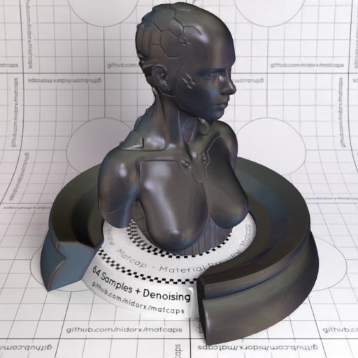

[[1024px](https://github.com/nidorx/matcaps/raw/master/1024/454447_908E9A_181716_7C7C7B.png)]
[[512px](https://github.com/nidorx/matcaps/raw/master/512/454447_908E9A_181716_7C7C7B-512px.png)]
[[256px](https://github.com/nidorx/matcaps/raw/master/256/454447_908E9A_181716_7C7C7B-256px.png)]
[[128px](https://github.com/nidorx/matcaps/raw/master/128/454447_908E9A_181716_7C7C7B-128px.png)]
[[64px](https://github.com/nidorx/matcaps/raw/master/64/454447_908E9A_181716_7C7C7B-64px.png)]
[[ZBrush Material (ZMT)](https://github.com/nidorx/matcaps/raw/master/zmt/454447_908E9A_181716_7C7C7B.zmt)]

---
### 456A73_779B9E_173A46_154C5D
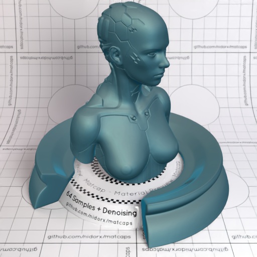
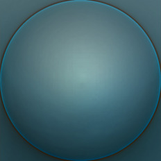

[[1024px](https://github.com/nidorx/matcaps/raw/master/1024/456A73_779B9E_173A46_154C5D.png)]
[[512px](https://github.com/nidorx/matcaps/raw/master/512/456A73_779B9E_173A46_154C5D-512px.png)]
[[256px](https://github.com/nidorx/matcaps/raw/master/256/456A73_779B9E_173A46_154C5D-256px.png)]
[[128px](https://github.com/nidorx/matcaps/raw/master/128/456A73_779B9E_173A46_154C5D-128px.png)]
[[64px](https://github.com/nidorx/matcaps/raw/master/64/456A73_779B9E_173A46_154C5D-64px.png)]
[[ZBrush Material (ZMT)](https://github.com/nidorx/matcaps/raw/master/zmt/456A73_779B9E_173A46_154C5D.zmt)]

---
### 463F37_ACCFBB_818B78_91A494
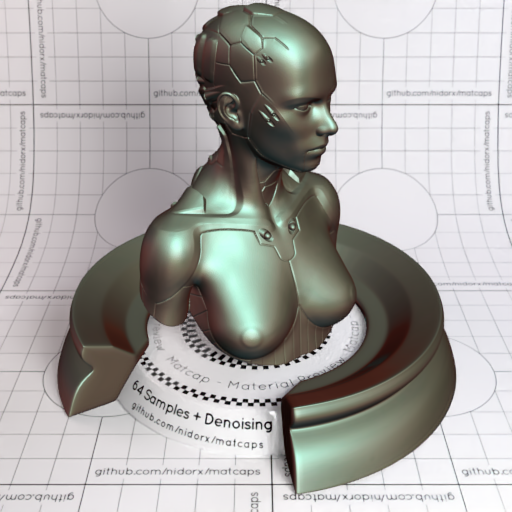

[[1024px](https://github.com/nidorx/matcaps/raw/master/1024/463F37_ACCFBB_818B78_91A494.png)]
[[512px](https://github.com/nidorx/matcaps/raw/master/512/463F37_ACCFBB_818B78_91A494-512px.png)]
[[256px](https://github.com/nidorx/matcaps/raw/master/256/463F37_ACCFBB_818B78_91A494-256px.png)]
[[128px](https://github.com/nidorx/matcaps/raw/master/128/463F37_ACCFBB_818B78_91A494-128px.png)]
[[64px](https://github.com/nidorx/matcaps/raw/master/64/463F37_ACCFBB_818B78_91A494-64px.png)]
[[ZBrush Material (ZMT)](https://github.com/nidorx/matcaps/raw/master/zmt/463F37_ACCFBB_818B78_91A494.zmt)]

---
### 464445_D2D0CB_919196_A8ADB0
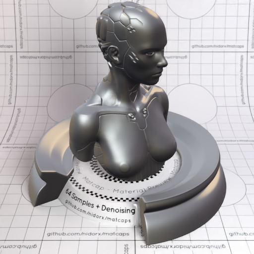

[[1024px](https://github.com/nidorx/matcaps/raw/master/1024/464445_D2D0CB_919196_A8ADB0.png)]
[[512px](https://github.com/nidorx/matcaps/raw/master/512/464445_D2D0CB_919196_A8ADB0-512px.png)]
[[256px](https://github.com/nidorx/matcaps/raw/master/256/464445_D2D0CB_919196_A8ADB0-256px.png)]
[[128px](https://github.com/nidorx/matcaps/raw/master/128/464445_D2D0CB_919196_A8ADB0-128px.png)]
[[64px](https://github.com/nidorx/matcaps/raw/master/64/464445_D2D0CB_919196_A8ADB0-64px.png)]
[[ZBrush Material (ZMT)](https://github.com/nidorx/matcaps/raw/master/zmt/464445_D2D0CB_919196_A8ADB0.zmt)]

---
### 464543_D1CFC1_8E8C83_A4AC9C
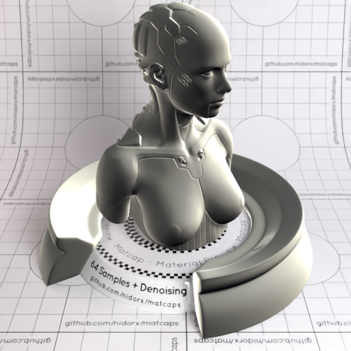

[[1024px](https://github.com/nidorx/matcaps/raw/master/1024/464543_D1CFC1_8E8C83_A4AC9C.png)]
[[512px](https://github.com/nidorx/matcaps/raw/master/512/464543_D1CFC1_8E8C83_A4AC9C-512px.png)]
[[256px](https://github.com/nidorx/matcaps/raw/master/256/464543_D1CFC1_8E8C83_A4AC9C-256px.png)]
[[128px](https://github.com/nidorx/matcaps/raw/master/128/464543_D1CFC1_8E8C83_A4AC9C-128px.png)]
[[64px](https://github.com/nidorx/matcaps/raw/master/64/464543_D1CFC1_8E8C83_A4AC9C-64px.png)]
[[ZBrush Material (ZMT)](https://github.com/nidorx/matcaps/raw/master/zmt/464543_D1CFC1_8E8C83_A4AC9C.zmt)]

---
### 46804D_CBE9AC_90B57C_95D38F
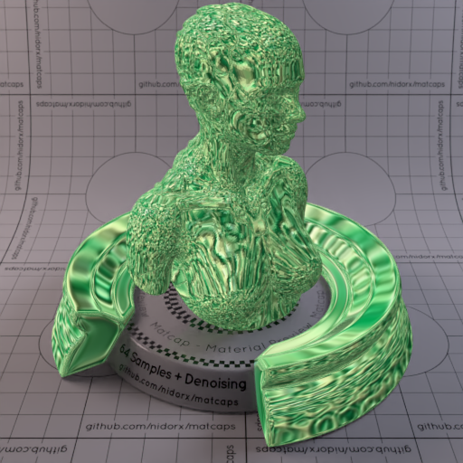

[[1024px](https://github.com/nidorx/matcaps/raw/master/1024/46804D_CBE9AC_90B57C_95D38F.png)]
[[512px](https://github.com/nidorx/matcaps/raw/master/512/46804D_CBE9AC_90B57C_95D38F-512px.png)]
[[256px](https://github.com/nidorx/matcaps/raw/master/256/46804D_CBE9AC_90B57C_95D38F-256px.png)]
[[128px](https://github.com/nidorx/matcaps/raw/master/128/46804D_CBE9AC_90B57C_95D38F-128px.png)]
[[64px](https://github.com/nidorx/matcaps/raw/master/64/46804D_CBE9AC_90B57C_95D38F-64px.png)]
[[ZBrush Material (ZMT)](https://github.com/nidorx/matcaps/raw/master/zmt/46804D_CBE9AC_90B57C_95D38F.zmt)]

---
### 468126_C1DDB5_8AC460_A1D07C
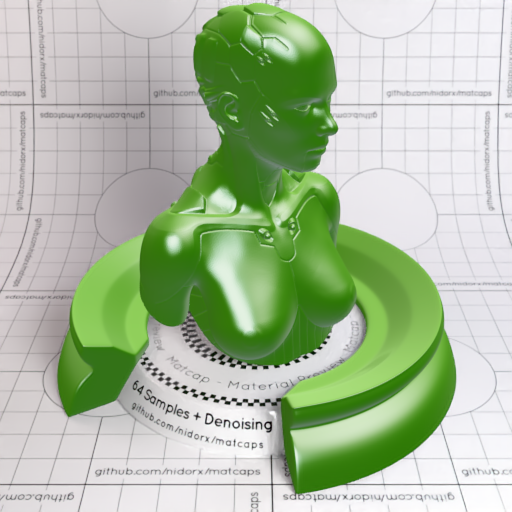

[[1024px](https://github.com/nidorx/matcaps/raw/master/1024/468126_C1DDB5_8AC460_A1D07C.png)]
[[512px](https://github.com/nidorx/matcaps/raw/master/512/468126_C1DDB5_8AC460_A1D07C-512px.png)]
[[256px](https://github.com/nidorx/matcaps/raw/master/256/468126_C1DDB5_8AC460_A1D07C-256px.png)]
[[128px](https://github.com/nidorx/matcaps/raw/master/128/468126_C1DDB5_8AC460_A1D07C-128px.png)]
[[64px](https://github.com/nidorx/matcaps/raw/master/64/468126_C1DDB5_8AC460_A1D07C-64px.png)]
[[ZBrush Material (ZMT)](https://github.com/nidorx/matcaps/raw/master/zmt/468126_C1DDB5_8AC460_A1D07C.zmt)]

---
### 47392E_997E69_7C6553_8B745F
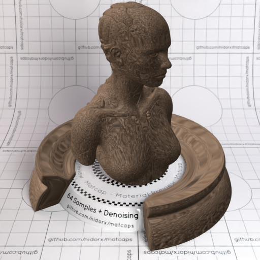

[[1024px](https://github.com/nidorx/matcaps/raw/master/1024/47392E_997E69_7C6553_8B745F.png)]
[[512px](https://github.com/nidorx/matcaps/raw/master/512/47392E_997E69_7C6553_8B745F-512px.png)]
[[256px](https://github.com/nidorx/matcaps/raw/master/256/47392E_997E69_7C6553_8B745F-256px.png)]
[[128px](https://github.com/nidorx/matcaps/raw/master/128/47392E_997E69_7C6553_8B745F-128px.png)]
[[64px](https://github.com/nidorx/matcaps/raw/master/64/47392E_997E69_7C6553_8B745F-64px.png)]
[[ZBrush Material (ZMT)](https://github.com/nidorx/matcaps/raw/master/zmt/47392E_997E69_7C6553_8B745F.zmt)]

---
### 474444_7B7575_9E9899_8C8C8B
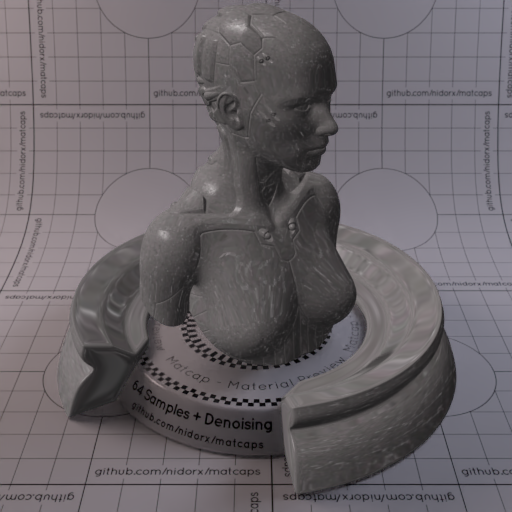

[[1024px](https://github.com/nidorx/matcaps/raw/master/1024/474444_7B7575_9E9899_8C8C8B.png)]
[[512px](https://github.com/nidorx/matcaps/raw/master/512/474444_7B7575_9E9899_8C8C8B-512px.png)]
[[256px](https://github.com/nidorx/matcaps/raw/master/256/474444_7B7575_9E9899_8C8C8B-256px.png)]
[[128px](https://github.com/nidorx/matcaps/raw/master/128/474444_7B7575_9E9899_8C8C8B-128px.png)]
[[64px](https://github.com/nidorx/matcaps/raw/master/64/474444_7B7575_9E9899_8C8C8B-64px.png)]
[[ZBrush Material (ZMT)](https://github.com/nidorx/matcaps/raw/master/zmt/474444_7B7575_9E9899_8C8C8B.zmt)]

---
### 474643_696F7D_A9ABB8_8B8C93
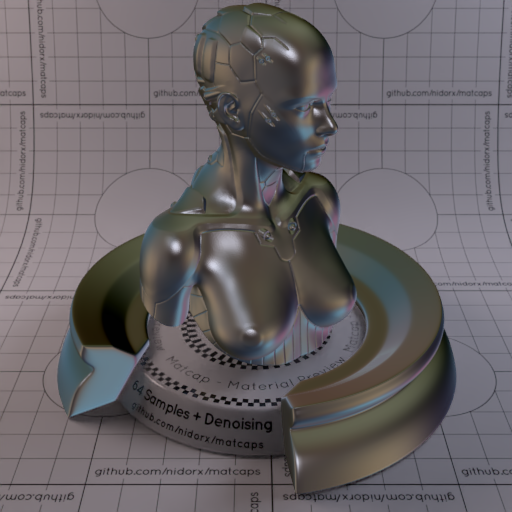
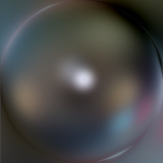

[[1024px](https://github.com/nidorx/matcaps/raw/master/1024/474643_696F7D_A9ABB8_8B8C93.png)]
[[512px](https://github.com/nidorx/matcaps/raw/master/512/474643_696F7D_A9ABB8_8B8C93-512px.png)]
[[256px](https://github.com/nidorx/matcaps/raw/master/256/474643_696F7D_A9ABB8_8B8C93-256px.png)]
[[128px](https://github.com/nidorx/matcaps/raw/master/128/474643_696F7D_A9ABB8_8B8C93-128px.png)]
[[64px](https://github.com/nidorx/matcaps/raw/master/64/474643_696F7D_A9ABB8_8B8C93-64px.png)]
[[ZBrush Material (ZMT)](https://github.com/nidorx/matcaps/raw/master/zmt/474643_696F7D_A9ABB8_8B8C93.zmt)]

---
### 474843_CECEC4_898883_A3A3A4
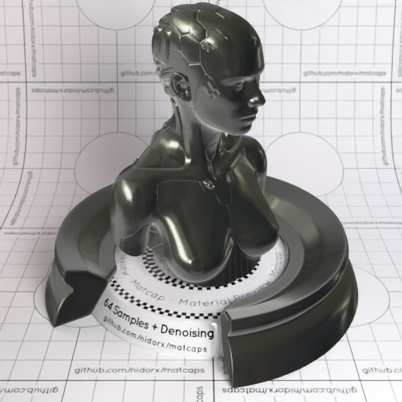
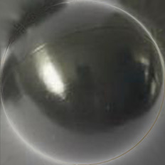

[[1024px](https://github.com/nidorx/matcaps/raw/master/1024/474843_CECEC4_898883_A3A3A4.png)]
[[512px](https://github.com/nidorx/matcaps/raw/master/512/474843_CECEC4_898883_A3A3A4-512px.png)]
[[256px](https://github.com/nidorx/matcaps/raw/master/256/474843_CECEC4_898883_A3A3A4-256px.png)]
[[128px](https://github.com/nidorx/matcaps/raw/master/128/474843_CECEC4_898883_A3A3A4-128px.png)]
[[64px](https://github.com/nidorx/matcaps/raw/master/64/474843_CECEC4_898883_A3A3A4-64px.png)]
[[ZBrush Material (ZMT)](https://github.com/nidorx/matcaps/raw/master/zmt/474843_CECEC4_898883_A3A3A4.zmt)]

---
### 48270F_C4723B_9B5728_7B431B
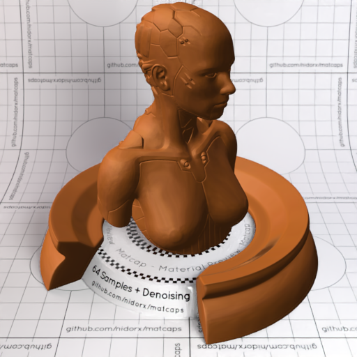

[[1024px](https://github.com/nidorx/matcaps/raw/master/1024/48270F_C4723B_9B5728_7B431B.png)]
[[512px](https://github.com/nidorx/matcaps/raw/master/512/48270F_C4723B_9B5728_7B431B-512px.png)]
[[256px](https://github.com/nidorx/matcaps/raw/master/256/48270F_C4723B_9B5728_7B431B-256px.png)]
[[128px](https://github.com/nidorx/matcaps/raw/master/128/48270F_C4723B_9B5728_7B431B-128px.png)]
[[64px](https://github.com/nidorx/matcaps/raw/master/64/48270F_C4723B_9B5728_7B431B-64px.png)]
[[ZBrush Material (ZMT)](https://github.com/nidorx/matcaps/raw/master/zmt/48270F_C4723B_9B5728_7B431B.zmt)]

---
### 482908_894E0D_FBDB52_CA7420
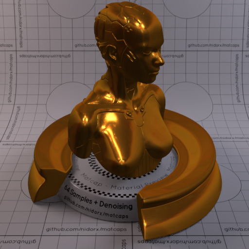
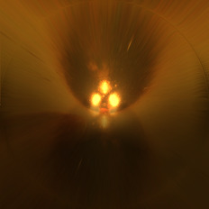

[[1024px](https://github.com/nidorx/matcaps/raw/master/1024/482908_894E0D_FBDB52_CA7420.png)]
[[512px](https://github.com/nidorx/matcaps/raw/master/512/482908_894E0D_FBDB52_CA7420-512px.png)]
[[256px](https://github.com/nidorx/matcaps/raw/master/256/482908_894E0D_FBDB52_CA7420-256px.png)]
[[128px](https://github.com/nidorx/matcaps/raw/master/128/482908_894E0D_FBDB52_CA7420-128px.png)]
[[64px](https://github.com/nidorx/matcaps/raw/master/64/482908_894E0D_FBDB52_CA7420-64px.png)]
[[ZBrush Material (ZMT)](https://github.com/nidorx/matcaps/raw/master/zmt/482908_894E0D_FBDB52_CA7420.zmt)]

---
### 487FC9_A8E7F8_88CCF2_70AFDE
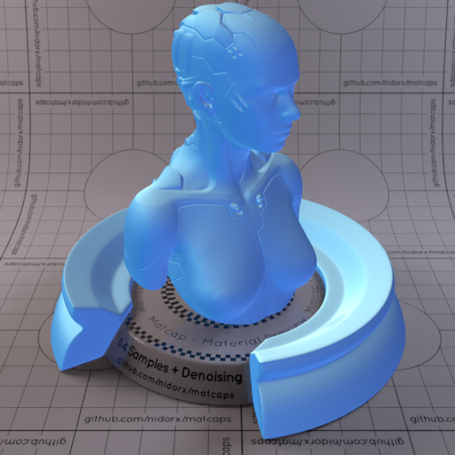

[[1024px](https://github.com/nidorx/matcaps/raw/master/1024/487FC9_A8E7F8_88CCF2_70AFDE.png)]
[[512px](https://github.com/nidorx/matcaps/raw/master/512/487FC9_A8E7F8_88CCF2_70AFDE-512px.png)]
[[256px](https://github.com/nidorx/matcaps/raw/master/256/487FC9_A8E7F8_88CCF2_70AFDE-256px.png)]
[[128px](https://github.com/nidorx/matcaps/raw/master/128/487FC9_A8E7F8_88CCF2_70AFDE-128px.png)]
[[64px](https://github.com/nidorx/matcaps/raw/master/64/487FC9_A8E7F8_88CCF2_70AFDE-64px.png)]
[[ZBrush Material (ZMT)](https://github.com/nidorx/matcaps/raw/master/zmt/487FC9_A8E7F8_88CCF2_70AFDE.zmt)]

---
### 489B7A_A0E7D9_6DC5AC_87DAC7
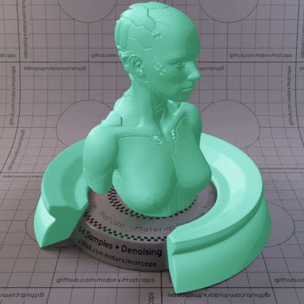

[[1024px](https://github.com/nidorx/matcaps/raw/master/1024/489B7A_A0E7D9_6DC5AC_87DAC7.png)]
[[512px](https://github.com/nidorx/matcaps/raw/master/512/489B7A_A0E7D9_6DC5AC_87DAC7-512px.png)]
[[256px](https://github.com/nidorx/matcaps/raw/master/256/489B7A_A0E7D9_6DC5AC_87DAC7-256px.png)]
[[128px](https://github.com/nidorx/matcaps/raw/master/128/489B7A_A0E7D9_6DC5AC_87DAC7-128px.png)]
[[64px](https://github.com/nidorx/matcaps/raw/master/64/489B7A_A0E7D9_6DC5AC_87DAC7-64px.png)]
[~~ZBrush Material (ZMT)~~]

---
### 48C381_226640_369F64_3CAC74
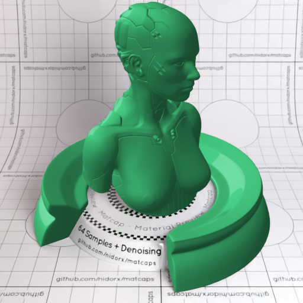

[[1024px](https://github.com/nidorx/matcaps/raw/master/1024/48C381_226640_369F64_3CAC74.png)]
[[512px](https://github.com/nidorx/matcaps/raw/master/512/48C381_226640_369F64_3CAC74-512px.png)]
[[256px](https://github.com/nidorx/matcaps/raw/master/256/48C381_226640_369F64_3CAC74-256px.png)]
[[128px](https://github.com/nidorx/matcaps/raw/master/128/48C381_226640_369F64_3CAC74-128px.png)]
[[64px](https://github.com/nidorx/matcaps/raw/master/64/48C381_226640_369F64_3CAC74-64px.png)]
[~~ZBrush Material (ZMT)~~]

---