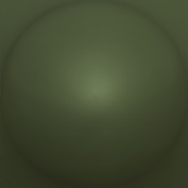
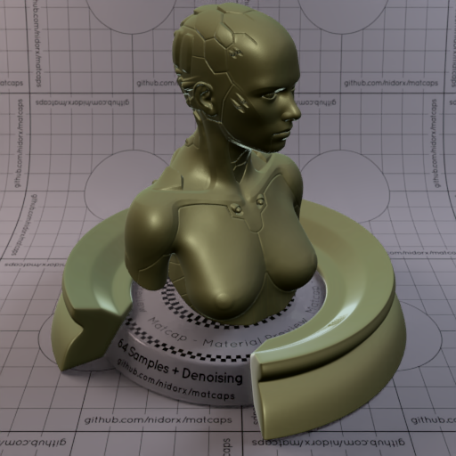
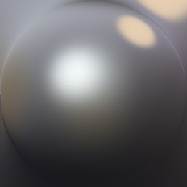
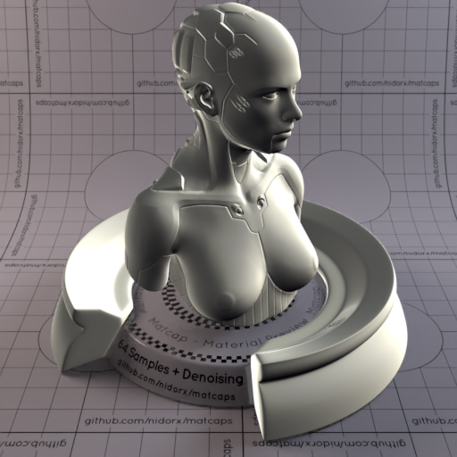
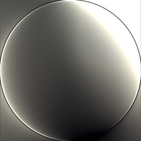
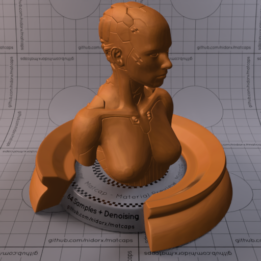
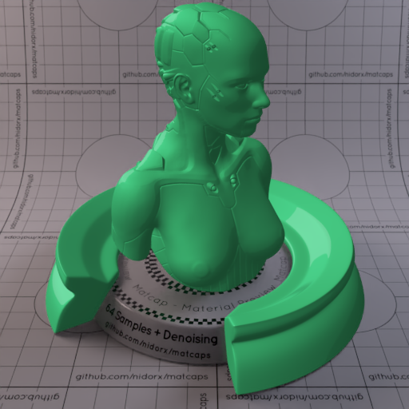

A huge library of MatCap textures in PNG and ZMT.

## Navigation
* [Home](/)
* [Page 1](PAGE-1.md)
* [Page 2](PAGE-2.md)
* [Page 3](PAGE-3.md)
* [Page 4](PAGE-4.md)
* [Page 5](PAGE-5.md)
* [Page 6](PAGE-6.md)
* Page 7
* [Page 8](PAGE-8.md)
* [Page 9](PAGE-9.md)
* [Page 10](PAGE-10.md)
* [Page 11](PAGE-11.md)
* [Page 12](PAGE-12.md)
* [Page 13](PAGE-13.md)
* [Page 14](PAGE-14.md)
* [Page 15](PAGE-15.md)
* [Page 16](PAGE-16.md)
* [Page 17](PAGE-17.md)
* [Page 18](PAGE-18.md)
* [Page 19](PAGE-19.md)
* [Page 20](PAGE-20.md)
* [Page 21](PAGE-21.md)
* [Page 22](PAGE-22.md)
* [Page 23](PAGE-23.md)
* [Page 24](PAGE-24.md)
* [Page 25](PAGE-25.md)
* [Page 26](PAGE-26.md)
* [Page 27](PAGE-27.md)
* [Page 28](PAGE-28.md)
* [Page 29](PAGE-29.md)
* [Page 30](PAGE-30.md)
* [Page 31](PAGE-31.md)
* [Page 32](PAGE-32.md)
* [Page 33](PAGE-33.md)
## Page 7 Matcaps
### 434C32_434C32_62704C_546244

[[1024px](https://github.com/nidorx/matcaps/raw/master/1024/434C32_434C32_62704C_546244.png)]
[[512px](https://github.com/nidorx/matcaps/raw/master/512/434C32_434C32_62704C_546244-512px.png)]
[[256px](https://github.com/nidorx/matcaps/raw/master/256/434C32_434C32_62704C_546244-256px.png)]
[[128px](https://github.com/nidorx/matcaps/raw/master/128/434C32_434C32_62704C_546244-128px.png)]
[[64px](https://github.com/nidorx/matcaps/raw/master/64/434C32_434C32_62704C_546244-64px.png)]
[[ZBrush Material (ZMT)](https://github.com/nidorx/matcaps/raw/master/zmt/434C32_434C32_62704C_546244.zmt)]

---
### 442C27_442C27_A79E90_847066

[[1024px](https://github.com/nidorx/matcaps/raw/master/1024/442C27_442C27_A79E90_847066.png)]
[[512px](https://github.com/nidorx/matcaps/raw/master/512/442C27_442C27_A79E90_847066-512px.png)]
[[256px](https://github.com/nidorx/matcaps/raw/master/256/442C27_442C27_A79E90_847066-256px.png)]
[[128px](https://github.com/nidorx/matcaps/raw/master/128/442C27_442C27_A79E90_847066-128px.png)]
[[64px](https://github.com/nidorx/matcaps/raw/master/64/442C27_442C27_A79E90_847066-64px.png)]
[[ZBrush Material (ZMT)](https://github.com/nidorx/matcaps/raw/master/zmt/442C27_442C27_A79E90_847066.zmt)]

---
### 447072_447072_8ACACB_65A4A5

[[1024px](https://github.com/nidorx/matcaps/raw/master/1024/447072_447072_8ACACB_65A4A5.png)]
[[512px](https://github.com/nidorx/matcaps/raw/master/512/447072_447072_8ACACB_65A4A5-512px.png)]
[[256px](https://github.com/nidorx/matcaps/raw/master/256/447072_447072_8ACACB_65A4A5-256px.png)]
[[128px](https://github.com/nidorx/matcaps/raw/master/128/447072_447072_8ACACB_65A4A5-128px.png)]
[[64px](https://github.com/nidorx/matcaps/raw/master/64/447072_447072_8ACACB_65A4A5-64px.png)]
[~~ZBrush Material (ZMT)~~]

---
### 45432C_45432C_808361_B8C8BC

[[1024px](https://github.com/nidorx/matcaps/raw/master/1024/45432C_45432C_808361_B8C8BC.png)]
[[512px](https://github.com/nidorx/matcaps/raw/master/512/45432C_45432C_808361_B8C8BC-512px.png)]
[[256px](https://github.com/nidorx/matcaps/raw/master/256/45432C_45432C_808361_B8C8BC-256px.png)]
[[128px](https://github.com/nidorx/matcaps/raw/master/128/45432C_45432C_808361_B8C8BC-128px.png)]
[[64px](https://github.com/nidorx/matcaps/raw/master/64/45432C_45432C_808361_B8C8BC-64px.png)]
[[ZBrush Material (ZMT)](https://github.com/nidorx/matcaps/raw/master/zmt/45432C_45432C_808361_B8C8BC.zmt)]

---
### 454447_454447_908E9A_181716

[[1024px](https://github.com/nidorx/matcaps/raw/master/1024/454447_454447_908E9A_181716.png)]
[[512px](https://github.com/nidorx/matcaps/raw/master/512/454447_454447_908E9A_181716-512px.png)]
[[256px](https://github.com/nidorx/matcaps/raw/master/256/454447_454447_908E9A_181716-256px.png)]
[[128px](https://github.com/nidorx/matcaps/raw/master/128/454447_454447_908E9A_181716-128px.png)]
[[64px](https://github.com/nidorx/matcaps/raw/master/64/454447_454447_908E9A_181716-64px.png)]
[[ZBrush Material (ZMT)](https://github.com/nidorx/matcaps/raw/master/zmt/454447_454447_908E9A_181716.zmt)]

---
### 456A73_456A73_779B9E_173A46

[[1024px](https://github.com/nidorx/matcaps/raw/master/1024/456A73_456A73_779B9E_173A46.png)]
[[512px](https://github.com/nidorx/matcaps/raw/master/512/456A73_456A73_779B9E_173A46-512px.png)]
[[256px](https://github.com/nidorx/matcaps/raw/master/256/456A73_456A73_779B9E_173A46-256px.png)]
[[128px](https://github.com/nidorx/matcaps/raw/master/128/456A73_456A73_779B9E_173A46-128px.png)]
[[64px](https://github.com/nidorx/matcaps/raw/master/64/456A73_456A73_779B9E_173A46-64px.png)]
[[ZBrush Material (ZMT)](https://github.com/nidorx/matcaps/raw/master/zmt/456A73_456A73_779B9E_173A46.zmt)]

---
### 463F37_463F37_ACCFBB_818B78

[[1024px](https://github.com/nidorx/matcaps/raw/master/1024/463F37_463F37_ACCFBB_818B78.png)]
[[512px](https://github.com/nidorx/matcaps/raw/master/512/463F37_463F37_ACCFBB_818B78-512px.png)]
[[256px](https://github.com/nidorx/matcaps/raw/master/256/463F37_463F37_ACCFBB_818B78-256px.png)]
[[128px](https://github.com/nidorx/matcaps/raw/master/128/463F37_463F37_ACCFBB_818B78-128px.png)]
[[64px](https://github.com/nidorx/matcaps/raw/master/64/463F37_463F37_ACCFBB_818B78-64px.png)]
[[ZBrush Material (ZMT)](https://github.com/nidorx/matcaps/raw/master/zmt/463F37_463F37_ACCFBB_818B78.zmt)]

---
### 464445_464445_D2D0CB_919196

[[1024px](https://github.com/nidorx/matcaps/raw/master/1024/464445_464445_D2D0CB_919196.png)]
[[512px](https://github.com/nidorx/matcaps/raw/master/512/464445_464445_D2D0CB_919196-512px.png)]
[[256px](https://github.com/nidorx/matcaps/raw/master/256/464445_464445_D2D0CB_919196-256px.png)]
[[128px](https://github.com/nidorx/matcaps/raw/master/128/464445_464445_D2D0CB_919196-128px.png)]
[[64px](https://github.com/nidorx/matcaps/raw/master/64/464445_464445_D2D0CB_919196-64px.png)]
[[ZBrush Material (ZMT)](https://github.com/nidorx/matcaps/raw/master/zmt/464445_464445_D2D0CB_919196.zmt)]

---
### 464543_464543_D1CFC1_8E8C83

[[1024px](https://github.com/nidorx/matcaps/raw/master/1024/464543_464543_D1CFC1_8E8C83.png)]
[[512px](https://github.com/nidorx/matcaps/raw/master/512/464543_464543_D1CFC1_8E8C83-512px.png)]
[[256px](https://github.com/nidorx/matcaps/raw/master/256/464543_464543_D1CFC1_8E8C83-256px.png)]
[[128px](https://github.com/nidorx/matcaps/raw/master/128/464543_464543_D1CFC1_8E8C83-128px.png)]
[[64px](https://github.com/nidorx/matcaps/raw/master/64/464543_464543_D1CFC1_8E8C83-64px.png)]
[[ZBrush Material (ZMT)](https://github.com/nidorx/matcaps/raw/master/zmt/464543_464543_D1CFC1_8E8C83.zmt)]

---
### 46804D_46804D_CBE9AC_90B57C

[[1024px](https://github.com/nidorx/matcaps/raw/master/1024/46804D_46804D_CBE9AC_90B57C.png)]
[[512px](https://github.com/nidorx/matcaps/raw/master/512/46804D_46804D_CBE9AC_90B57C-512px.png)]
[[256px](https://github.com/nidorx/matcaps/raw/master/256/46804D_46804D_CBE9AC_90B57C-256px.png)]
[[128px](https://github.com/nidorx/matcaps/raw/master/128/46804D_46804D_CBE9AC_90B57C-128px.png)]
[[64px](https://github.com/nidorx/matcaps/raw/master/64/46804D_46804D_CBE9AC_90B57C-64px.png)]
[[ZBrush Material (ZMT)](https://github.com/nidorx/matcaps/raw/master/zmt/46804D_46804D_CBE9AC_90B57C.zmt)]

---
### 468126_468126_C1DDB5_8AC460

[[1024px](https://github.com/nidorx/matcaps/raw/master/1024/468126_468126_C1DDB5_8AC460.png)]
[[512px](https://github.com/nidorx/matcaps/raw/master/512/468126_468126_C1DDB5_8AC460-512px.png)]
[[256px](https://github.com/nidorx/matcaps/raw/master/256/468126_468126_C1DDB5_8AC460-256px.png)]
[[128px](https://github.com/nidorx/matcaps/raw/master/128/468126_468126_C1DDB5_8AC460-128px.png)]
[[64px](https://github.com/nidorx/matcaps/raw/master/64/468126_468126_C1DDB5_8AC460-64px.png)]
[[ZBrush Material (ZMT)](https://github.com/nidorx/matcaps/raw/master/zmt/468126_468126_C1DDB5_8AC460.zmt)]

---
### 47392E_47392E_997E69_7C6553

[[1024px](https://github.com/nidorx/matcaps/raw/master/1024/47392E_47392E_997E69_7C6553.png)]
[[512px](https://github.com/nidorx/matcaps/raw/master/512/47392E_47392E_997E69_7C6553-512px.png)]
[[256px](https://github.com/nidorx/matcaps/raw/master/256/47392E_47392E_997E69_7C6553-256px.png)]
[[128px](https://github.com/nidorx/matcaps/raw/master/128/47392E_47392E_997E69_7C6553-128px.png)]
[[64px](https://github.com/nidorx/matcaps/raw/master/64/47392E_47392E_997E69_7C6553-64px.png)]
[[ZBrush Material (ZMT)](https://github.com/nidorx/matcaps/raw/master/zmt/47392E_47392E_997E69_7C6553.zmt)]

---
### 474444_474444_7B7575_9E9899

[[1024px](https://github.com/nidorx/matcaps/raw/master/1024/474444_474444_7B7575_9E9899.png)]
[[512px](https://github.com/nidorx/matcaps/raw/master/512/474444_474444_7B7575_9E9899-512px.png)]
[[256px](https://github.com/nidorx/matcaps/raw/master/256/474444_474444_7B7575_9E9899-256px.png)]
[[128px](https://github.com/nidorx/matcaps/raw/master/128/474444_474444_7B7575_9E9899-128px.png)]
[[64px](https://github.com/nidorx/matcaps/raw/master/64/474444_474444_7B7575_9E9899-64px.png)]
[[ZBrush Material (ZMT)](https://github.com/nidorx/matcaps/raw/master/zmt/474444_474444_7B7575_9E9899.zmt)]

---
### 474643_474643_696F7D_A9ABB8

[[1024px](https://github.com/nidorx/matcaps/raw/master/1024/474643_474643_696F7D_A9ABB8.png)]
[[512px](https://github.com/nidorx/matcaps/raw/master/512/474643_474643_696F7D_A9ABB8-512px.png)]
[[256px](https://github.com/nidorx/matcaps/raw/master/256/474643_474643_696F7D_A9ABB8-256px.png)]
[[128px](https://github.com/nidorx/matcaps/raw/master/128/474643_474643_696F7D_A9ABB8-128px.png)]
[[64px](https://github.com/nidorx/matcaps/raw/master/64/474643_474643_696F7D_A9ABB8-64px.png)]
[[ZBrush Material (ZMT)](https://github.com/nidorx/matcaps/raw/master/zmt/474643_474643_696F7D_A9ABB8.zmt)]

---
### 474843_474843_CECEC4_898883

[[1024px](https://github.com/nidorx/matcaps/raw/master/1024/474843_474843_CECEC4_898883.png)]
[[512px](https://github.com/nidorx/matcaps/raw/master/512/474843_474843_CECEC4_898883-512px.png)]
[[256px](https://github.com/nidorx/matcaps/raw/master/256/474843_474843_CECEC4_898883-256px.png)]
[[128px](https://github.com/nidorx/matcaps/raw/master/128/474843_474843_CECEC4_898883-128px.png)]
[[64px](https://github.com/nidorx/matcaps/raw/master/64/474843_474843_CECEC4_898883-64px.png)]
[[ZBrush Material (ZMT)](https://github.com/nidorx/matcaps/raw/master/zmt/474843_474843_CECEC4_898883.zmt)]

---
### 48270F_48270F_C4723B_9B5728

[[1024px](https://github.com/nidorx/matcaps/raw/master/1024/48270F_48270F_C4723B_9B5728.png)]
[[512px](https://github.com/nidorx/matcaps/raw/master/512/48270F_48270F_C4723B_9B5728-512px.png)]
[[256px](https://github.com/nidorx/matcaps/raw/master/256/48270F_48270F_C4723B_9B5728-256px.png)]
[[128px](https://github.com/nidorx/matcaps/raw/master/128/48270F_48270F_C4723B_9B5728-128px.png)]
[[64px](https://github.com/nidorx/matcaps/raw/master/64/48270F_48270F_C4723B_9B5728-64px.png)]
[[ZBrush Material (ZMT)](https://github.com/nidorx/matcaps/raw/master/zmt/48270F_48270F_C4723B_9B5728.zmt)]

---
### 482908_482908_894E0D_FBDB52

[[1024px](https://github.com/nidorx/matcaps/raw/master/1024/482908_482908_894E0D_FBDB52.png)]
[[512px](https://github.com/nidorx/matcaps/raw/master/512/482908_482908_894E0D_FBDB52-512px.png)]
[[256px](https://github.com/nidorx/matcaps/raw/master/256/482908_482908_894E0D_FBDB52-256px.png)]
[[128px](https://github.com/nidorx/matcaps/raw/master/128/482908_482908_894E0D_FBDB52-128px.png)]
[[64px](https://github.com/nidorx/matcaps/raw/master/64/482908_482908_894E0D_FBDB52-64px.png)]
[[ZBrush Material (ZMT)](https://github.com/nidorx/matcaps/raw/master/zmt/482908_482908_894E0D_FBDB52.zmt)]

---
### 487FC9_487FC9_A8E7F8_88CCF2

[[1024px](https://github.com/nidorx/matcaps/raw/master/1024/487FC9_487FC9_A8E7F8_88CCF2.png)]
[[512px](https://github.com/nidorx/matcaps/raw/master/512/487FC9_487FC9_A8E7F8_88CCF2-512px.png)]
[[256px](https://github.com/nidorx/matcaps/raw/master/256/487FC9_487FC9_A8E7F8_88CCF2-256px.png)]
[[128px](https://github.com/nidorx/matcaps/raw/master/128/487FC9_487FC9_A8E7F8_88CCF2-128px.png)]
[[64px](https://github.com/nidorx/matcaps/raw/master/64/487FC9_487FC9_A8E7F8_88CCF2-64px.png)]
[[ZBrush Material (ZMT)](https://github.com/nidorx/matcaps/raw/master/zmt/487FC9_487FC9_A8E7F8_88CCF2.zmt)]

---
### 489B7A_489B7A_A0E7D9_6DC5AC

[[1024px](https://github.com/nidorx/matcaps/raw/master/1024/489B7A_489B7A_A0E7D9_6DC5AC.png)]
[[512px](https://github.com/nidorx/matcaps/raw/master/512/489B7A_489B7A_A0E7D9_6DC5AC-512px.png)]
[[256px](https://github.com/nidorx/matcaps/raw/master/256/489B7A_489B7A_A0E7D9_6DC5AC-256px.png)]
[[128px](https://github.com/nidorx/matcaps/raw/master/128/489B7A_489B7A_A0E7D9_6DC5AC-128px.png)]
[[64px](https://github.com/nidorx/matcaps/raw/master/64/489B7A_489B7A_A0E7D9_6DC5AC-64px.png)]
[~~ZBrush Material (ZMT)~~]

---
### 48C381_48C381_226640_369F64

[[1024px](https://github.com/nidorx/matcaps/raw/master/1024/48C381_48C381_226640_369F64.png)]
[[512px](https://github.com/nidorx/matcaps/raw/master/512/48C381_48C381_226640_369F64-512px.png)]
[[256px](https://github.com/nidorx/matcaps/raw/master/256/48C381_48C381_226640_369F64-256px.png)]
[[128px](https://github.com/nidorx/matcaps/raw/master/128/48C381_48C381_226640_369F64-128px.png)]
[[64px](https://github.com/nidorx/matcaps/raw/master/64/48C381_48C381_226640_369F64-64px.png)]
[~~ZBrush Material (ZMT)~~]

---