Huge library of matcap PNG textures organized by color

## Navigation
* [Home](/)
* [Page 1](PAGE-1.md)
* [Page 2](PAGE-2.md)
* [Page 3](PAGE-3.md)
* [Page 4](PAGE-4.md)
* [Page 5](PAGE-5.md)
* [Page 6](PAGE-6.md)
* Page 7
* [Page 8](PAGE-8.md)
## Page 9 Matcaps
### CB7846_CB7846_753C22_AB5C32
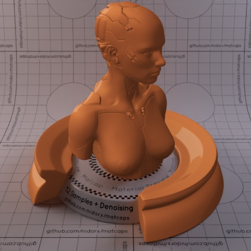
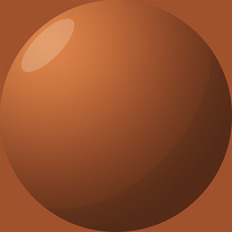

[[1024px](https://github.com/nidorx/matcaps/raw/master/1024/CB7846_CB7846_753C22_AB5C32.png)]
[[512px](https://github.com/nidorx/matcaps/raw/master/512/CB7846_CB7846_753C22_AB5C32-512px.png)]
[[256px](https://github.com/nidorx/matcaps/raw/master/256/CB7846_CB7846_753C22_AB5C32-256px.png)]
[[128px](https://github.com/nidorx/matcaps/raw/master/128/CB7846_CB7846_753C22_AB5C32-128px.png)]
[[64px](https://github.com/nidorx/matcaps/raw/master/64/CB7846_CB7846_753C22_AB5C32-64px.png)]
[~~ZBrush Material (ZMT)~~]

---
### CB919B_CB919B_F9DDE1_ECC0C8
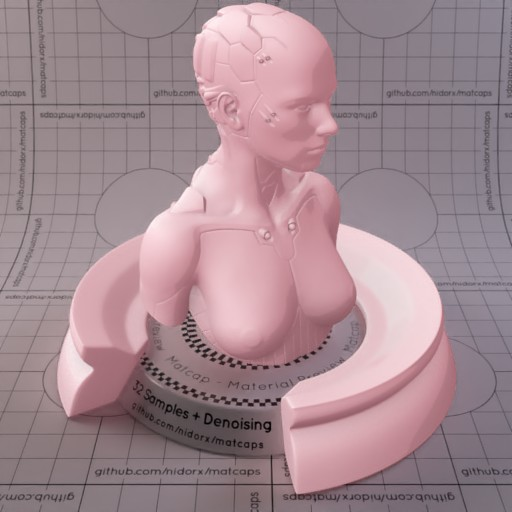
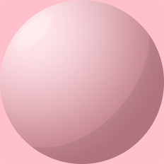

[[1024px](https://github.com/nidorx/matcaps/raw/master/1024/CB919B_CB919B_F9DDE1_ECC0C8.png)]
[[512px](https://github.com/nidorx/matcaps/raw/master/512/CB919B_CB919B_F9DDE1_ECC0C8-512px.png)]
[[256px](https://github.com/nidorx/matcaps/raw/master/256/CB919B_CB919B_F9DDE1_ECC0C8-256px.png)]
[[128px](https://github.com/nidorx/matcaps/raw/master/128/CB919B_CB919B_F9DDE1_ECC0C8-128px.png)]
[[64px](https://github.com/nidorx/matcaps/raw/master/64/CB919B_CB919B_F9DDE1_ECC0C8-64px.png)]
[~~ZBrush Material (ZMT)~~]

---
### CBCBCB_CBCBCB_595959_8C8C8C

[[1024px](https://github.com/nidorx/matcaps/raw/master/1024/CBCBCB_CBCBCB_595959_8C8C8C.png)]
[[512px](https://github.com/nidorx/matcaps/raw/master/512/CBCBCB_CBCBCB_595959_8C8C8C-512px.png)]
[[256px](https://github.com/nidorx/matcaps/raw/master/256/CBCBCB_CBCBCB_595959_8C8C8C-256px.png)]
[[128px](https://github.com/nidorx/matcaps/raw/master/128/CBCBCB_CBCBCB_595959_8C8C8C-128px.png)]
[[64px](https://github.com/nidorx/matcaps/raw/master/64/CBCBCB_CBCBCB_595959_8C8C8C-64px.png)]
[[ZBrush Material (ZMT)](https://github.com/nidorx/matcaps/raw/master/zmt/CBCBCB_CBCBCB_595959_8C8C8C.zmt)]

---
### CC9A7E_CC9A7E_8A5249_C06A3E

[[1024px](https://github.com/nidorx/matcaps/raw/master/1024/CC9A7E_CC9A7E_8A5249_C06A3E.png)]
[[512px](https://github.com/nidorx/matcaps/raw/master/512/CC9A7E_CC9A7E_8A5249_C06A3E-512px.png)]
[[256px](https://github.com/nidorx/matcaps/raw/master/256/CC9A7E_CC9A7E_8A5249_C06A3E-256px.png)]
[[128px](https://github.com/nidorx/matcaps/raw/master/128/CC9A7E_CC9A7E_8A5249_C06A3E-128px.png)]
[[64px](https://github.com/nidorx/matcaps/raw/master/64/CC9A7E_CC9A7E_8A5249_C06A3E-64px.png)]
[[ZBrush Material (ZMT)](https://github.com/nidorx/matcaps/raw/master/zmt/CC9A7E_CC9A7E_8A5249_C06A3E.zmt)]

---
### CDC3B8_CDC3B8_5A3F3C_67545A

[[1024px](https://github.com/nidorx/matcaps/raw/master/1024/CDC3B8_CDC3B8_5A3F3C_67545A.png)]
[[512px](https://github.com/nidorx/matcaps/raw/master/512/CDC3B8_CDC3B8_5A3F3C_67545A-512px.png)]
[[256px](https://github.com/nidorx/matcaps/raw/master/256/CDC3B8_CDC3B8_5A3F3C_67545A-256px.png)]
[[128px](https://github.com/nidorx/matcaps/raw/master/128/CDC3B8_CDC3B8_5A3F3C_67545A-128px.png)]
[[64px](https://github.com/nidorx/matcaps/raw/master/64/CDC3B8_CDC3B8_5A3F3C_67545A-64px.png)]
[[ZBrush Material (ZMT)](https://github.com/nidorx/matcaps/raw/master/zmt/CDC3B8_CDC3B8_5A3F3C_67545A.zmt)]

---
### CDCBC8_CDCBC8_444342_696765

[[1024px](https://github.com/nidorx/matcaps/raw/master/1024/CDCBC8_CDCBC8_444342_696765.png)]
[[512px](https://github.com/nidorx/matcaps/raw/master/512/CDCBC8_CDCBC8_444342_696765-512px.png)]
[[256px](https://github.com/nidorx/matcaps/raw/master/256/CDCBC8_CDCBC8_444342_696765-256px.png)]
[[128px](https://github.com/nidorx/matcaps/raw/master/128/CDCBC8_CDCBC8_444342_696765-128px.png)]
[[64px](https://github.com/nidorx/matcaps/raw/master/64/CDCBC8_CDCBC8_444342_696765-64px.png)]
[[ZBrush Material (ZMT)](https://github.com/nidorx/matcaps/raw/master/zmt/CDCBC8_CDCBC8_444342_696765.zmt)]

---
### CEB299_CEB299_6B5C4C_887564

[[1024px](https://github.com/nidorx/matcaps/raw/master/1024/CEB299_CEB299_6B5C4C_887564.png)]
[[512px](https://github.com/nidorx/matcaps/raw/master/512/CEB299_CEB299_6B5C4C_887564-512px.png)]
[[256px](https://github.com/nidorx/matcaps/raw/master/256/CEB299_CEB299_6B5C4C_887564-256px.png)]
[[128px](https://github.com/nidorx/matcaps/raw/master/128/CEB299_CEB299_6B5C4C_887564-128px.png)]
[[64px](https://github.com/nidorx/matcaps/raw/master/64/CEB299_CEB299_6B5C4C_887564-64px.png)]
[[ZBrush Material (ZMT)](https://github.com/nidorx/matcaps/raw/master/zmt/CEB299_CEB299_6B5C4C_887564.zmt)]

---
### D04444_D04444_AF2F2F_8B2424
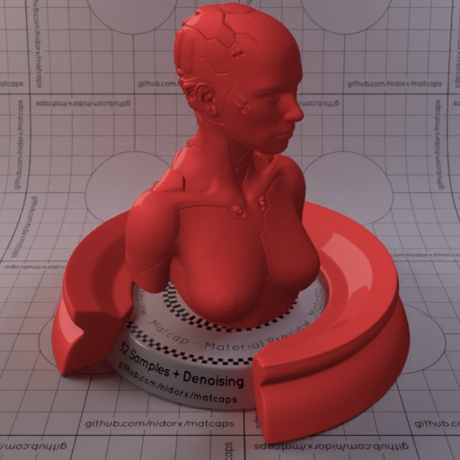

[[1024px](https://github.com/nidorx/matcaps/raw/master/1024/D04444_D04444_AF2F2F_8B2424.png)]
[[512px](https://github.com/nidorx/matcaps/raw/master/512/D04444_D04444_AF2F2F_8B2424-512px.png)]
[[256px](https://github.com/nidorx/matcaps/raw/master/256/D04444_D04444_AF2F2F_8B2424-256px.png)]
[[128px](https://github.com/nidorx/matcaps/raw/master/128/D04444_D04444_AF2F2F_8B2424-128px.png)]
[[64px](https://github.com/nidorx/matcaps/raw/master/64/D04444_D04444_AF2F2F_8B2424-64px.png)]
[~~ZBrush Material (ZMT)~~]

---
### D0D3BE_D0D3BE_816854_998366

[[1024px](https://github.com/nidorx/matcaps/raw/master/1024/D0D3BE_D0D3BE_816854_998366.png)]
[[512px](https://github.com/nidorx/matcaps/raw/master/512/D0D3BE_D0D3BE_816854_998366-512px.png)]
[[256px](https://github.com/nidorx/matcaps/raw/master/256/D0D3BE_D0D3BE_816854_998366-256px.png)]
[[128px](https://github.com/nidorx/matcaps/raw/master/128/D0D3BE_D0D3BE_816854_998366-128px.png)]
[[64px](https://github.com/nidorx/matcaps/raw/master/64/D0D3BE_D0D3BE_816854_998366-64px.png)]
[[ZBrush Material (ZMT)](https://github.com/nidorx/matcaps/raw/master/zmt/D0D3BE_D0D3BE_816854_998366.zmt)]

---
### D1AC04_D1AC04_F8E50A_EDD004
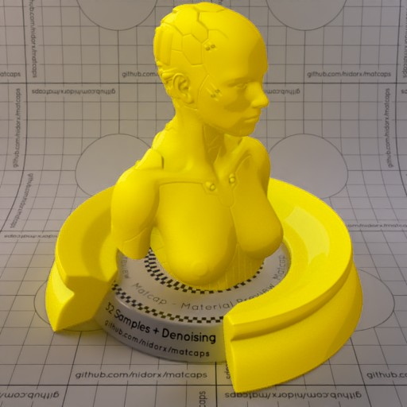

[[1024px](https://github.com/nidorx/matcaps/raw/master/1024/D1AC04_D1AC04_F8E50A_EDD004.png)]
[[512px](https://github.com/nidorx/matcaps/raw/master/512/D1AC04_D1AC04_F8E50A_EDD004-512px.png)]
[[256px](https://github.com/nidorx/matcaps/raw/master/256/D1AC04_D1AC04_F8E50A_EDD004-256px.png)]
[[128px](https://github.com/nidorx/matcaps/raw/master/128/D1AC04_D1AC04_F8E50A_EDD004-128px.png)]
[[64px](https://github.com/nidorx/matcaps/raw/master/64/D1AC04_D1AC04_F8E50A_EDD004-64px.png)]
[~~ZBrush Material (ZMT)~~]

---
### D3CAAB_D3CAAB_8C866E_C0B89A

[[1024px](https://github.com/nidorx/matcaps/raw/master/1024/D3CAAB_D3CAAB_8C866E_C0B89A.png)]
[[512px](https://github.com/nidorx/matcaps/raw/master/512/D3CAAB_D3CAAB_8C866E_C0B89A-512px.png)]
[[256px](https://github.com/nidorx/matcaps/raw/master/256/D3CAAB_D3CAAB_8C866E_C0B89A-256px.png)]
[[128px](https://github.com/nidorx/matcaps/raw/master/128/D3CAAB_D3CAAB_8C866E_C0B89A-128px.png)]
[[64px](https://github.com/nidorx/matcaps/raw/master/64/D3CAAB_D3CAAB_8C866E_C0B89A-64px.png)]
[[ZBrush Material (ZMT)](https://github.com/nidorx/matcaps/raw/master/zmt/D3CAAB_D3CAAB_8C866E_C0B89A.zmt)]

---
### D5D5D5_D5D5D5_929292_ACACAC
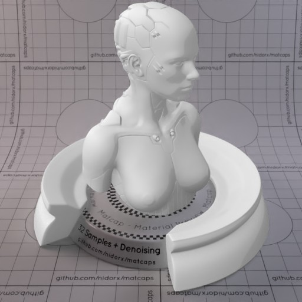

[[1024px](https://github.com/nidorx/matcaps/raw/master/1024/D5D5D5_D5D5D5_929292_ACACAC.png)]
[[512px](https://github.com/nidorx/matcaps/raw/master/512/D5D5D5_D5D5D5_929292_ACACAC-512px.png)]
[[256px](https://github.com/nidorx/matcaps/raw/master/256/D5D5D5_D5D5D5_929292_ACACAC-256px.png)]
[[128px](https://github.com/nidorx/matcaps/raw/master/128/D5D5D5_D5D5D5_929292_ACACAC-128px.png)]
[[64px](https://github.com/nidorx/matcaps/raw/master/64/D5D5D5_D5D5D5_929292_ACACAC-64px.png)]
[~~ZBrush Material (ZMT)~~]

---
### D64480_D64480_E27497_EA9BB1-1

[[1024px](https://github.com/nidorx/matcaps/raw/master/1024/D64480_D64480_E27497_EA9BB1-1.png)]
[[512px](https://github.com/nidorx/matcaps/raw/master/512/D64480_D64480_E27497_EA9BB1-1-512px.png)]
[[256px](https://github.com/nidorx/matcaps/raw/master/256/D64480_D64480_E27497_EA9BB1-1-256px.png)]
[[128px](https://github.com/nidorx/matcaps/raw/master/128/D64480_D64480_E27497_EA9BB1-1-128px.png)]
[[64px](https://github.com/nidorx/matcaps/raw/master/64/D64480_D64480_E27497_EA9BB1-1-64px.png)]
[~~ZBrush Material (ZMT)~~]

---
### D64480_D64480_E27497_EA9BB1

[[1024px](https://github.com/nidorx/matcaps/raw/master/1024/D64480_D64480_E27497_EA9BB1.png)]
[[512px](https://github.com/nidorx/matcaps/raw/master/512/D64480_D64480_E27497_EA9BB1-512px.png)]
[[256px](https://github.com/nidorx/matcaps/raw/master/256/D64480_D64480_E27497_EA9BB1-256px.png)]
[[128px](https://github.com/nidorx/matcaps/raw/master/128/D64480_D64480_E27497_EA9BB1-128px.png)]
[[64px](https://github.com/nidorx/matcaps/raw/master/64/D64480_D64480_E27497_EA9BB1-64px.png)]
[[ZBrush Material (ZMT)](https://github.com/nidorx/matcaps/raw/master/zmt/D64480_D64480_E27497_EA9BB1.zmt)]

---
### D7D7C3_D7D7C3_AAAA92_F5F5EA
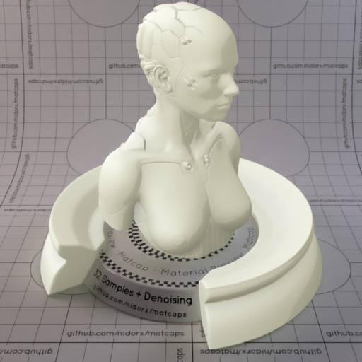

[[1024px](https://github.com/nidorx/matcaps/raw/master/1024/D7D7C3_D7D7C3_AAAA92_F5F5EA.png)]
[[512px](https://github.com/nidorx/matcaps/raw/master/512/D7D7C3_D7D7C3_AAAA92_F5F5EA-512px.png)]
[[256px](https://github.com/nidorx/matcaps/raw/master/256/D7D7C3_D7D7C3_AAAA92_F5F5EA-256px.png)]
[[128px](https://github.com/nidorx/matcaps/raw/master/128/D7D7C3_D7D7C3_AAAA92_F5F5EA-128px.png)]
[[64px](https://github.com/nidorx/matcaps/raw/master/64/D7D7C3_D7D7C3_AAAA92_F5F5EA-64px.png)]
[~~ZBrush Material (ZMT)~~]

---
### D7DFDB_D7DFDB_AAB5AF_F5FAF7-1
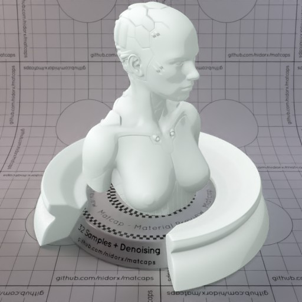

[[1024px](https://github.com/nidorx/matcaps/raw/master/1024/D7DFDB_D7DFDB_AAB5AF_F5FAF7-1.png)]
[[512px](https://github.com/nidorx/matcaps/raw/master/512/D7DFDB_D7DFDB_AAB5AF_F5FAF7-1-512px.png)]
[[256px](https://github.com/nidorx/matcaps/raw/master/256/D7DFDB_D7DFDB_AAB5AF_F5FAF7-1-256px.png)]
[[128px](https://github.com/nidorx/matcaps/raw/master/128/D7DFDB_D7DFDB_AAB5AF_F5FAF7-1-128px.png)]
[[64px](https://github.com/nidorx/matcaps/raw/master/64/D7DFDB_D7DFDB_AAB5AF_F5FAF7-1-64px.png)]
[~~ZBrush Material (ZMT)~~]

---
### D7DFDB_D7DFDB_AAB5AF_F5FAF7

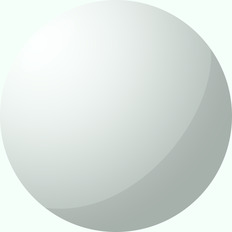

[[1024px](https://github.com/nidorx/matcaps/raw/master/1024/D7DFDB_D7DFDB_AAB5AF_F5FAF7.png)]
[[512px](https://github.com/nidorx/matcaps/raw/master/512/D7DFDB_D7DFDB_AAB5AF_F5FAF7-512px.png)]
[[256px](https://github.com/nidorx/matcaps/raw/master/256/D7DFDB_D7DFDB_AAB5AF_F5FAF7-256px.png)]
[[128px](https://github.com/nidorx/matcaps/raw/master/128/D7DFDB_D7DFDB_AAB5AF_F5FAF7-128px.png)]
[[64px](https://github.com/nidorx/matcaps/raw/master/64/D7DFDB_D7DFDB_AAB5AF_F5FAF7-64px.png)]
[~~ZBrush Material (ZMT)~~]

---
### D8388B_D8388B_230A14_FCC8FC

[[1024px](https://github.com/nidorx/matcaps/raw/master/1024/D8388B_D8388B_230A14_FCC8FC.png)]
[[512px](https://github.com/nidorx/matcaps/raw/master/512/D8388B_D8388B_230A14_FCC8FC-512px.png)]
[[256px](https://github.com/nidorx/matcaps/raw/master/256/D8388B_D8388B_230A14_FCC8FC-256px.png)]
[[128px](https://github.com/nidorx/matcaps/raw/master/128/D8388B_D8388B_230A14_FCC8FC-128px.png)]
[[64px](https://github.com/nidorx/matcaps/raw/master/64/D8388B_D8388B_230A14_FCC8FC-64px.png)]
[[ZBrush Material (ZMT)](https://github.com/nidorx/matcaps/raw/master/zmt/D8388B_D8388B_230A14_FCC8FC.zmt)]

---
### D8D8E5_D8D8E5_9D9DAF_B4B4C4
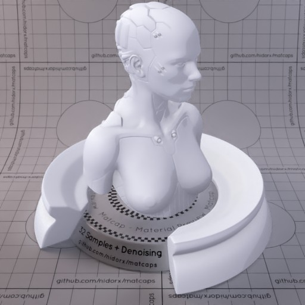
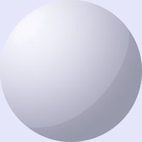

[[1024px](https://github.com/nidorx/matcaps/raw/master/1024/D8D8E5_D8D8E5_9D9DAF_B4B4C4.png)]
[[512px](https://github.com/nidorx/matcaps/raw/master/512/D8D8E5_D8D8E5_9D9DAF_B4B4C4-512px.png)]
[[256px](https://github.com/nidorx/matcaps/raw/master/256/D8D8E5_D8D8E5_9D9DAF_B4B4C4-256px.png)]
[[128px](https://github.com/nidorx/matcaps/raw/master/128/D8D8E5_D8D8E5_9D9DAF_B4B4C4-128px.png)]
[[64px](https://github.com/nidorx/matcaps/raw/master/64/D8D8E5_D8D8E5_9D9DAF_B4B4C4-64px.png)]
[~~ZBrush Material (ZMT)~~]

---
### DBDBBB_DBDBBB_F7F7E4_AFAF89
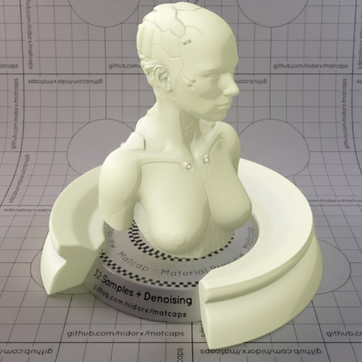

[[1024px](https://github.com/nidorx/matcaps/raw/master/1024/DBDBBB_DBDBBB_F7F7E4_AFAF89.png)]
[[512px](https://github.com/nidorx/matcaps/raw/master/512/DBDBBB_DBDBBB_F7F7E4_AFAF89-512px.png)]
[[256px](https://github.com/nidorx/matcaps/raw/master/256/DBDBBB_DBDBBB_F7F7E4_AFAF89-256px.png)]
[[128px](https://github.com/nidorx/matcaps/raw/master/128/DBDBBB_DBDBBB_F7F7E4_AFAF89-128px.png)]
[[64px](https://github.com/nidorx/matcaps/raw/master/64/DBDBBB_DBDBBB_F7F7E4_AFAF89-64px.png)]
[~~ZBrush Material (ZMT)~~]

---
### DC3E04_DC3E04_B52604_FC7D20
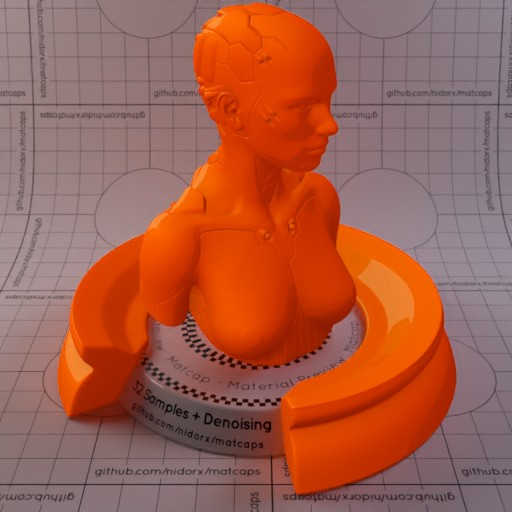
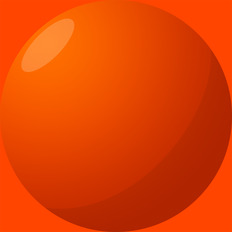

[[1024px](https://github.com/nidorx/matcaps/raw/master/1024/DC3E04_DC3E04_B52604_FC7D20.png)]
[[512px](https://github.com/nidorx/matcaps/raw/master/512/DC3E04_DC3E04_B52604_FC7D20-512px.png)]
[[256px](https://github.com/nidorx/matcaps/raw/master/256/DC3E04_DC3E04_B52604_FC7D20-256px.png)]
[[128px](https://github.com/nidorx/matcaps/raw/master/128/DC3E04_DC3E04_B52604_FC7D20-128px.png)]
[[64px](https://github.com/nidorx/matcaps/raw/master/64/DC3E04_DC3E04_B52604_FC7D20-64px.png)]
[~~ZBrush Material (ZMT)~~]

---
### DEDEC4_DEDEC4_B5B597_F9F9EA
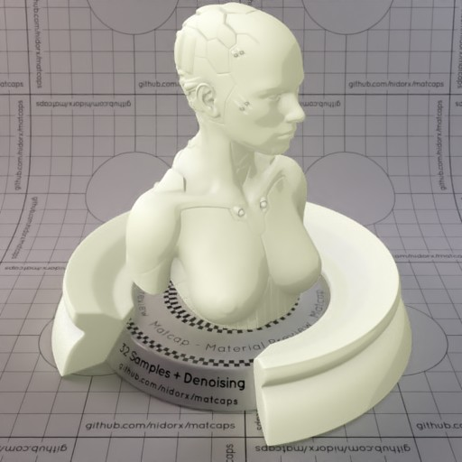

[[1024px](https://github.com/nidorx/matcaps/raw/master/1024/DEDEC4_DEDEC4_B5B597_F9F9EA.png)]
[[512px](https://github.com/nidorx/matcaps/raw/master/512/DEDEC4_DEDEC4_B5B597_F9F9EA-512px.png)]
[[256px](https://github.com/nidorx/matcaps/raw/master/256/DEDEC4_DEDEC4_B5B597_F9F9EA-256px.png)]
[[128px](https://github.com/nidorx/matcaps/raw/master/128/DEDEC4_DEDEC4_B5B597_F9F9EA-128px.png)]
[[64px](https://github.com/nidorx/matcaps/raw/master/64/DEDEC4_DEDEC4_B5B597_F9F9EA-64px.png)]
[~~ZBrush Material (ZMT)~~]

---
### DEE3E8_DEE3E8_A6AEB5_BCC4CC
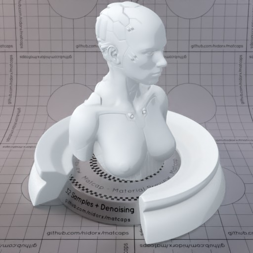

[[1024px](https://github.com/nidorx/matcaps/raw/master/1024/DEE3E8_DEE3E8_A6AEB5_BCC4CC.png)]
[[512px](https://github.com/nidorx/matcaps/raw/master/512/DEE3E8_DEE3E8_A6AEB5_BCC4CC-512px.png)]
[[256px](https://github.com/nidorx/matcaps/raw/master/256/DEE3E8_DEE3E8_A6AEB5_BCC4CC-256px.png)]
[[128px](https://github.com/nidorx/matcaps/raw/master/128/DEE3E8_DEE3E8_A6AEB5_BCC4CC-128px.png)]
[[64px](https://github.com/nidorx/matcaps/raw/master/64/DEE3E8_DEE3E8_A6AEB5_BCC4CC-64px.png)]
[~~ZBrush Material (ZMT)~~]

---
### DEE8DE_DEE8DE_A6B5A6_BCCCBC
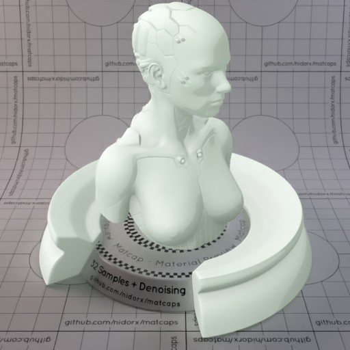

[[1024px](https://github.com/nidorx/matcaps/raw/master/1024/DEE8DE_DEE8DE_A6B5A6_BCCCBC.png)]
[[512px](https://github.com/nidorx/matcaps/raw/master/512/DEE8DE_DEE8DE_A6B5A6_BCCCBC-512px.png)]
[[256px](https://github.com/nidorx/matcaps/raw/master/256/DEE8DE_DEE8DE_A6B5A6_BCCCBC-256px.png)]
[[128px](https://github.com/nidorx/matcaps/raw/master/128/DEE8DE_DEE8DE_A6B5A6_BCCCBC-128px.png)]
[[64px](https://github.com/nidorx/matcaps/raw/master/64/DEE8DE_DEE8DE_A6B5A6_BCCCBC-64px.png)]
[~~ZBrush Material (ZMT)~~]

---
### DEE8E8_DEE8E8_A6B5B5_BCCCCC
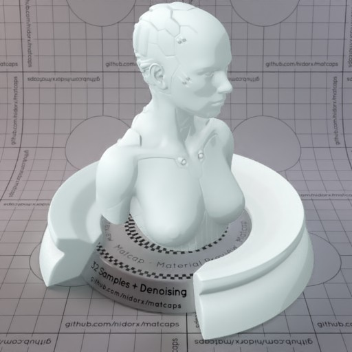

[[1024px](https://github.com/nidorx/matcaps/raw/master/1024/DEE8E8_DEE8E8_A6B5B5_BCCCCC.png)]
[[512px](https://github.com/nidorx/matcaps/raw/master/512/DEE8E8_DEE8E8_A6B5B5_BCCCCC-512px.png)]
[[256px](https://github.com/nidorx/matcaps/raw/master/256/DEE8E8_DEE8E8_A6B5B5_BCCCCC-256px.png)]
[[128px](https://github.com/nidorx/matcaps/raw/master/128/DEE8E8_DEE8E8_A6B5B5_BCCCCC-128px.png)]
[[64px](https://github.com/nidorx/matcaps/raw/master/64/DEE8E8_DEE8E8_A6B5B5_BCCCCC-64px.png)]
[~~ZBrush Material (ZMT)~~]

---
### DFD9C2_DFD9C2_B5AE92_F9F7EA

[[1024px](https://github.com/nidorx/matcaps/raw/master/1024/DFD9C2_DFD9C2_B5AE92_F9F7EA.png)]
[[512px](https://github.com/nidorx/matcaps/raw/master/512/DFD9C2_DFD9C2_B5AE92_F9F7EA-512px.png)]
[[256px](https://github.com/nidorx/matcaps/raw/master/256/DFD9C2_DFD9C2_B5AE92_F9F7EA-256px.png)]
[[128px](https://github.com/nidorx/matcaps/raw/master/128/DFD9C2_DFD9C2_B5AE92_F9F7EA-128px.png)]
[[64px](https://github.com/nidorx/matcaps/raw/master/64/DFD9C2_DFD9C2_B5AE92_F9F7EA-64px.png)]
[~~ZBrush Material (ZMT)~~]

---
### DFDBB7_DFDBB7_F9F8E3_B5AF86
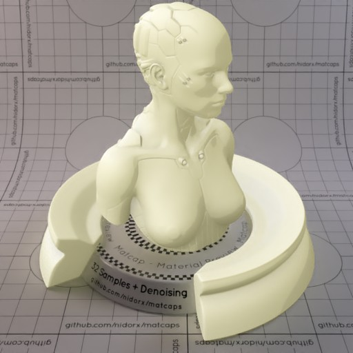

[[1024px](https://github.com/nidorx/matcaps/raw/master/1024/DFDBB7_DFDBB7_F9F8E3_B5AF86.png)]
[[512px](https://github.com/nidorx/matcaps/raw/master/512/DFDBB7_DFDBB7_F9F8E3_B5AF86-512px.png)]
[[256px](https://github.com/nidorx/matcaps/raw/master/256/DFDBB7_DFDBB7_F9F8E3_B5AF86-256px.png)]
[[128px](https://github.com/nidorx/matcaps/raw/master/128/DFDBB7_DFDBB7_F9F8E3_B5AF86-128px.png)]
[[64px](https://github.com/nidorx/matcaps/raw/master/64/DFDBB7_DFDBB7_F9F8E3_B5AF86-64px.png)]
[~~ZBrush Material (ZMT)~~]

---
### E1E1E0_E1E1E0_363636_989897

[[1024px](https://github.com/nidorx/matcaps/raw/master/1024/E1E1E0_E1E1E0_363636_989897.png)]
[[512px](https://github.com/nidorx/matcaps/raw/master/512/E1E1E0_E1E1E0_363636_989897-512px.png)]
[[256px](https://github.com/nidorx/matcaps/raw/master/256/E1E1E0_E1E1E0_363636_989897-256px.png)]
[[128px](https://github.com/nidorx/matcaps/raw/master/128/E1E1E0_E1E1E0_363636_989897-128px.png)]
[[64px](https://github.com/nidorx/matcaps/raw/master/64/E1E1E0_E1E1E0_363636_989897-64px.png)]
[[ZBrush Material (ZMT)](https://github.com/nidorx/matcaps/raw/master/zmt/E1E1E0_E1E1E0_363636_989897.zmt)]

---
### E2E2E7_E2E2E7_AEAEB5_C4C4CC
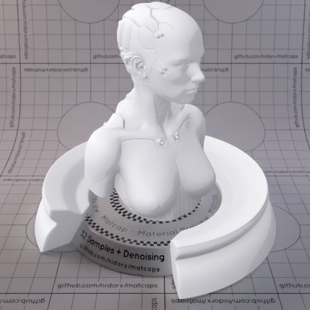

[[1024px](https://github.com/nidorx/matcaps/raw/master/1024/E2E2E7_E2E2E7_AEAEB5_C4C4CC.png)]
[[512px](https://github.com/nidorx/matcaps/raw/master/512/E2E2E7_E2E2E7_AEAEB5_C4C4CC-512px.png)]
[[256px](https://github.com/nidorx/matcaps/raw/master/256/E2E2E7_E2E2E7_AEAEB5_C4C4CC-256px.png)]
[[128px](https://github.com/nidorx/matcaps/raw/master/128/E2E2E7_E2E2E7_AEAEB5_C4C4CC-128px.png)]
[[64px](https://github.com/nidorx/matcaps/raw/master/64/E2E2E7_E2E2E7_AEAEB5_C4C4CC-64px.png)]
[~~ZBrush Material (ZMT)~~]

---
### E42E12_E42E12_F35132_F86949

[[1024px](https://github.com/nidorx/matcaps/raw/master/1024/E42E12_E42E12_F35132_F86949.png)]
[[512px](https://github.com/nidorx/matcaps/raw/master/512/E42E12_E42E12_F35132_F86949-512px.png)]
[[256px](https://github.com/nidorx/matcaps/raw/master/256/E42E12_E42E12_F35132_F86949-256px.png)]
[[128px](https://github.com/nidorx/matcaps/raw/master/128/E42E12_E42E12_F35132_F86949-128px.png)]
[[64px](https://github.com/nidorx/matcaps/raw/master/64/E42E12_E42E12_F35132_F86949-64px.png)]
[[ZBrush Material (ZMT)](https://github.com/nidorx/matcaps/raw/master/zmt/E42E12_E42E12_F35132_F86949.zmt)]

---
### E5DED7_E5DED7_AFA69D_C4BCB4

[[1024px](https://github.com/nidorx/matcaps/raw/master/1024/E5DED7_E5DED7_AFA69D_C4BCB4.png)]
[[512px](https://github.com/nidorx/matcaps/raw/master/512/E5DED7_E5DED7_AFA69D_C4BCB4-512px.png)]
[[256px](https://github.com/nidorx/matcaps/raw/master/256/E5DED7_E5DED7_AFA69D_C4BCB4-256px.png)]
[[128px](https://github.com/nidorx/matcaps/raw/master/128/E5DED7_E5DED7_AFA69D_C4BCB4-128px.png)]
[[64px](https://github.com/nidorx/matcaps/raw/master/64/E5DED7_E5DED7_AFA69D_C4BCB4-64px.png)]
[~~ZBrush Material (ZMT)~~]

---
### E6BF3C_E6BF3C_5A4719_977726

[[1024px](https://github.com/nidorx/matcaps/raw/master/1024/E6BF3C_E6BF3C_5A4719_977726.png)]
[[512px](https://github.com/nidorx/matcaps/raw/master/512/E6BF3C_E6BF3C_5A4719_977726-512px.png)]
[[256px](https://github.com/nidorx/matcaps/raw/master/256/E6BF3C_E6BF3C_5A4719_977726-256px.png)]
[[128px](https://github.com/nidorx/matcaps/raw/master/128/E6BF3C_E6BF3C_5A4719_977726-128px.png)]
[[64px](https://github.com/nidorx/matcaps/raw/master/64/E6BF3C_E6BF3C_5A4719_977726-64px.png)]
[[ZBrush Material (ZMT)](https://github.com/nidorx/matcaps/raw/master/zmt/E6BF3C_E6BF3C_5A4719_977726.zmt)]

---
### E6E3E3_E6E3E3_B5AFAF_CCC4C4
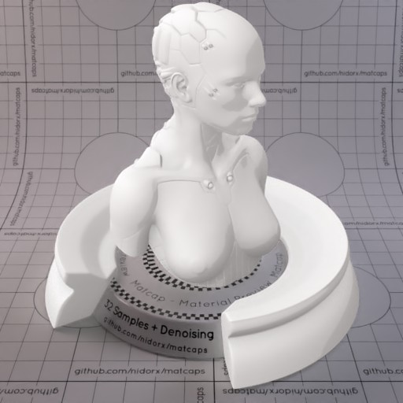

[[1024px](https://github.com/nidorx/matcaps/raw/master/1024/E6E3E3_E6E3E3_B5AFAF_CCC4C4.png)]
[[512px](https://github.com/nidorx/matcaps/raw/master/512/E6E3E3_E6E3E3_B5AFAF_CCC4C4-512px.png)]
[[256px](https://github.com/nidorx/matcaps/raw/master/256/E6E3E3_E6E3E3_B5AFAF_CCC4C4-256px.png)]
[[128px](https://github.com/nidorx/matcaps/raw/master/128/E6E3E3_E6E3E3_B5AFAF_CCC4C4-128px.png)]
[[64px](https://github.com/nidorx/matcaps/raw/master/64/E6E3E3_E6E3E3_B5AFAF_CCC4C4-64px.png)]
[~~ZBrush Material (ZMT)~~]

---
### E6E6E6_E6E6E6_AAAAAA_C4C4C4

[[1024px](https://github.com/nidorx/matcaps/raw/master/1024/E6E6E6_E6E6E6_AAAAAA_C4C4C4.png)]
[[512px](https://github.com/nidorx/matcaps/raw/master/512/E6E6E6_E6E6E6_AAAAAA_C4C4C4-512px.png)]
[[256px](https://github.com/nidorx/matcaps/raw/master/256/E6E6E6_E6E6E6_AAAAAA_C4C4C4-256px.png)]
[[128px](https://github.com/nidorx/matcaps/raw/master/128/E6E6E6_E6E6E6_AAAAAA_C4C4C4-128px.png)]
[[64px](https://github.com/nidorx/matcaps/raw/master/64/E6E6E6_E6E6E6_AAAAAA_C4C4C4-64px.png)]
[~~ZBrush Material (ZMT)~~]

---
### E7E2D8_E7E2D8_B1AA9D_C9C2B3-1
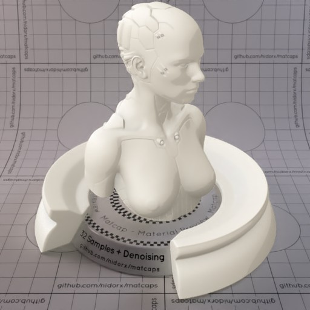

[[1024px](https://github.com/nidorx/matcaps/raw/master/1024/E7E2D8_E7E2D8_B1AA9D_C9C2B3-1.png)]
[[512px](https://github.com/nidorx/matcaps/raw/master/512/E7E2D8_E7E2D8_B1AA9D_C9C2B3-1-512px.png)]
[[256px](https://github.com/nidorx/matcaps/raw/master/256/E7E2D8_E7E2D8_B1AA9D_C9C2B3-1-256px.png)]
[[128px](https://github.com/nidorx/matcaps/raw/master/128/E7E2D8_E7E2D8_B1AA9D_C9C2B3-1-128px.png)]
[[64px](https://github.com/nidorx/matcaps/raw/master/64/E7E2D8_E7E2D8_B1AA9D_C9C2B3-1-64px.png)]
[~~ZBrush Material (ZMT)~~]

---
### E7E2D8_E7E2D8_B1AA9D_C9C2B3

[[1024px](https://github.com/nidorx/matcaps/raw/master/1024/E7E2D8_E7E2D8_B1AA9D_C9C2B3.png)]
[[512px](https://github.com/nidorx/matcaps/raw/master/512/E7E2D8_E7E2D8_B1AA9D_C9C2B3-512px.png)]
[[256px](https://github.com/nidorx/matcaps/raw/master/256/E7E2D8_E7E2D8_B1AA9D_C9C2B3-256px.png)]
[[128px](https://github.com/nidorx/matcaps/raw/master/128/E7E2D8_E7E2D8_B1AA9D_C9C2B3-128px.png)]
[[64px](https://github.com/nidorx/matcaps/raw/master/64/E7E2D8_E7E2D8_B1AA9D_C9C2B3-64px.png)]
[~~ZBrush Material (ZMT)~~]

---
### E80404_E80404_B50404_CB0404
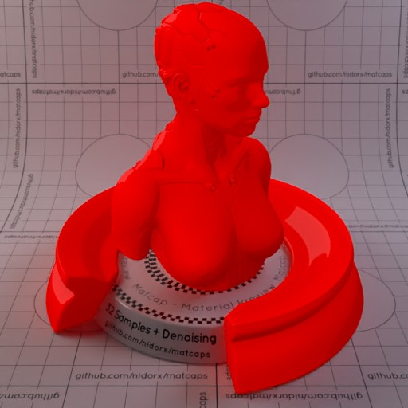

[[1024px](https://github.com/nidorx/matcaps/raw/master/1024/E80404_E80404_B50404_CB0404.png)]
[[512px](https://github.com/nidorx/matcaps/raw/master/512/E80404_E80404_B50404_CB0404-512px.png)]
[[256px](https://github.com/nidorx/matcaps/raw/master/256/E80404_E80404_B50404_CB0404-256px.png)]
[[128px](https://github.com/nidorx/matcaps/raw/master/128/E80404_E80404_B50404_CB0404-128px.png)]
[[64px](https://github.com/nidorx/matcaps/raw/master/64/E80404_E80404_B50404_CB0404-64px.png)]
[~~ZBrush Material (ZMT)~~]

---
### E804E8_E804E8_B504B5_CC04CC

[[1024px](https://github.com/nidorx/matcaps/raw/master/1024/E804E8_E804E8_B504B5_CC04CC.png)]
[[512px](https://github.com/nidorx/matcaps/raw/master/512/E804E8_E804E8_B504B5_CC04CC-512px.png)]
[[256px](https://github.com/nidorx/matcaps/raw/master/256/E804E8_E804E8_B504B5_CC04CC-256px.png)]
[[128px](https://github.com/nidorx/matcaps/raw/master/128/E804E8_E804E8_B504B5_CC04CC-128px.png)]
[[64px](https://github.com/nidorx/matcaps/raw/master/64/E804E8_E804E8_B504B5_CC04CC-64px.png)]
[~~ZBrush Material (ZMT)~~]

---
### E8DEE1_E8DEE1_B5A6AA_CCBCC1
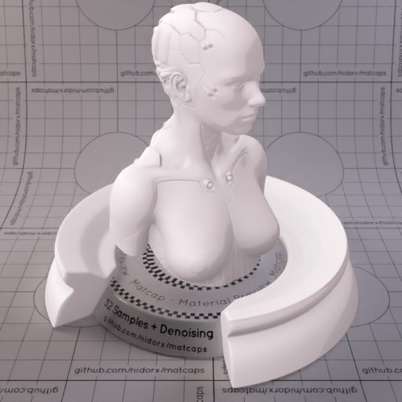
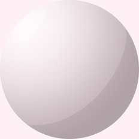

[[1024px](https://github.com/nidorx/matcaps/raw/master/1024/E8DEE1_E8DEE1_B5A6AA_CCBCC1.png)]
[[512px](https://github.com/nidorx/matcaps/raw/master/512/E8DEE1_E8DEE1_B5A6AA_CCBCC1-512px.png)]
[[256px](https://github.com/nidorx/matcaps/raw/master/256/E8DEE1_E8DEE1_B5A6AA_CCBCC1-256px.png)]
[[128px](https://github.com/nidorx/matcaps/raw/master/128/E8DEE1_E8DEE1_B5A6AA_CCBCC1-128px.png)]
[[64px](https://github.com/nidorx/matcaps/raw/master/64/E8DEE1_E8DEE1_B5A6AA_CCBCC1-64px.png)]
[~~ZBrush Material (ZMT)~~]

---
### E8E5DE_E8E5DE_B5AFA6_CCC5BC
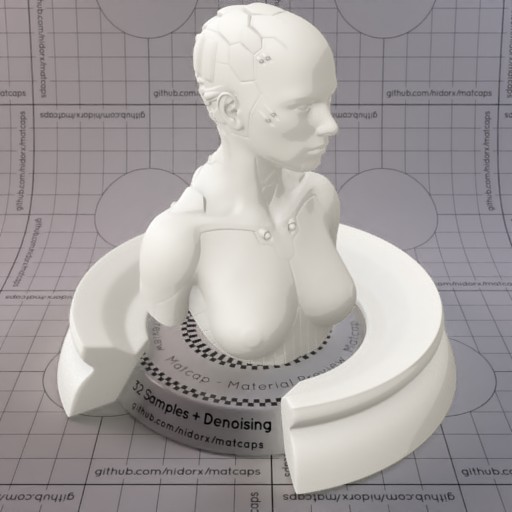

[[1024px](https://github.com/nidorx/matcaps/raw/master/1024/E8E5DE_E8E5DE_B5AFA6_CCC5BC.png)]
[[512px](https://github.com/nidorx/matcaps/raw/master/512/E8E5DE_E8E5DE_B5AFA6_CCC5BC-512px.png)]
[[256px](https://github.com/nidorx/matcaps/raw/master/256/E8E5DE_E8E5DE_B5AFA6_CCC5BC-256px.png)]
[[128px](https://github.com/nidorx/matcaps/raw/master/128/E8E5DE_E8E5DE_B5AFA6_CCC5BC-128px.png)]
[[64px](https://github.com/nidorx/matcaps/raw/master/64/E8E5DE_E8E5DE_B5AFA6_CCC5BC-64px.png)]
[~~ZBrush Material (ZMT)~~]

---
### E8E8DE_E8E8DE_B5B5A6_CCCCBC
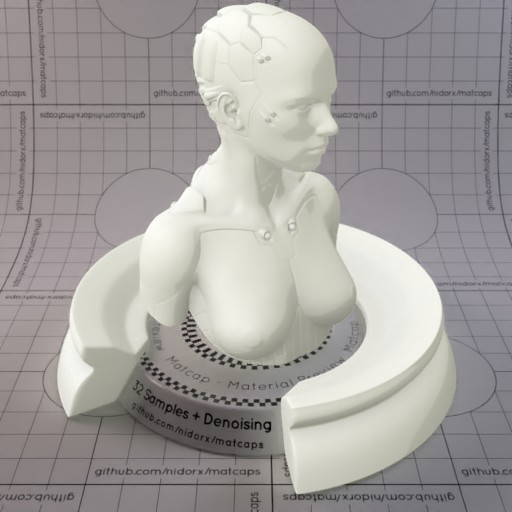
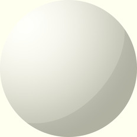

[[1024px](https://github.com/nidorx/matcaps/raw/master/1024/E8E8DE_E8E8DE_B5B5A6_CCCCBC.png)]
[[512px](https://github.com/nidorx/matcaps/raw/master/512/E8E8DE_E8E8DE_B5B5A6_CCCCBC-512px.png)]
[[256px](https://github.com/nidorx/matcaps/raw/master/256/E8E8DE_E8E8DE_B5B5A6_CCCCBC-256px.png)]
[[128px](https://github.com/nidorx/matcaps/raw/master/128/E8E8DE_E8E8DE_B5B5A6_CCCCBC-128px.png)]
[[64px](https://github.com/nidorx/matcaps/raw/master/64/E8E8DE_E8E8DE_B5B5A6_CCCCBC-64px.png)]
[~~ZBrush Material (ZMT)~~]

---
### EA783E_EA783E_6D4830_905837

[[1024px](https://github.com/nidorx/matcaps/raw/master/1024/EA783E_EA783E_6D4830_905837.png)]
[[512px](https://github.com/nidorx/matcaps/raw/master/512/EA783E_EA783E_6D4830_905837-512px.png)]
[[256px](https://github.com/nidorx/matcaps/raw/master/256/EA783E_EA783E_6D4830_905837-256px.png)]
[[128px](https://github.com/nidorx/matcaps/raw/master/128/EA783E_EA783E_6D4830_905837-128px.png)]
[[64px](https://github.com/nidorx/matcaps/raw/master/64/EA783E_EA783E_6D4830_905837-64px.png)]
[[ZBrush Material (ZMT)](https://github.com/nidorx/matcaps/raw/master/zmt/EA783E_EA783E_6D4830_905837.zmt)]

---
### EAD8D6_EAD8D6_B59A97_CCB4B0

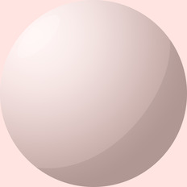

[[1024px](https://github.com/nidorx/matcaps/raw/master/1024/EAD8D6_EAD8D6_B59A97_CCB4B0.png)]
[[512px](https://github.com/nidorx/matcaps/raw/master/512/EAD8D6_EAD8D6_B59A97_CCB4B0-512px.png)]
[[256px](https://github.com/nidorx/matcaps/raw/master/256/EAD8D6_EAD8D6_B59A97_CCB4B0-256px.png)]
[[128px](https://github.com/nidorx/matcaps/raw/master/128/EAD8D6_EAD8D6_B59A97_CCB4B0-128px.png)]
[[64px](https://github.com/nidorx/matcaps/raw/master/64/EAD8D6_EAD8D6_B59A97_CCB4B0-64px.png)]
[~~ZBrush Material (ZMT)~~]

---
### EAEAEA_EAEAEA_B5B5B5_CCCCCC
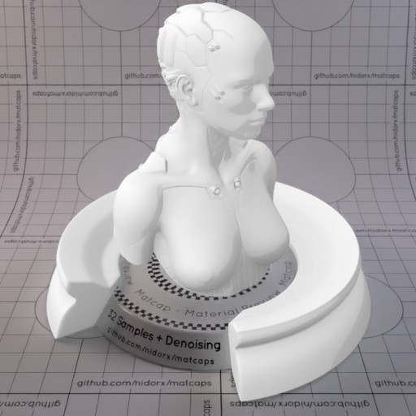

[[1024px](https://github.com/nidorx/matcaps/raw/master/1024/EAEAEA_EAEAEA_B5B5B5_CCCCCC.png)]
[[512px](https://github.com/nidorx/matcaps/raw/master/512/EAEAEA_EAEAEA_B5B5B5_CCCCCC-512px.png)]
[[256px](https://github.com/nidorx/matcaps/raw/master/256/EAEAEA_EAEAEA_B5B5B5_CCCCCC-256px.png)]
[[128px](https://github.com/nidorx/matcaps/raw/master/128/EAEAEA_EAEAEA_B5B5B5_CCCCCC-128px.png)]
[[64px](https://github.com/nidorx/matcaps/raw/master/64/EAEAEA_EAEAEA_B5B5B5_CCCCCC-64px.png)]
[~~ZBrush Material (ZMT)~~]

---
### ED5087_ED5087_FAC3D0_1C0B0C

[[1024px](https://github.com/nidorx/matcaps/raw/master/1024/ED5087_ED5087_FAC3D0_1C0B0C.png)]
[[512px](https://github.com/nidorx/matcaps/raw/master/512/ED5087_ED5087_FAC3D0_1C0B0C-512px.png)]
[[256px](https://github.com/nidorx/matcaps/raw/master/256/ED5087_ED5087_FAC3D0_1C0B0C-256px.png)]
[[128px](https://github.com/nidorx/matcaps/raw/master/128/ED5087_ED5087_FAC3D0_1C0B0C-128px.png)]
[[64px](https://github.com/nidorx/matcaps/raw/master/64/ED5087_ED5087_FAC3D0_1C0B0C-64px.png)]
[[ZBrush Material (ZMT)](https://github.com/nidorx/matcaps/raw/master/zmt/ED5087_ED5087_FAC3D0_1C0B0C.zmt)]

---
### EDED06_EDED06_B5B504_CCCC04
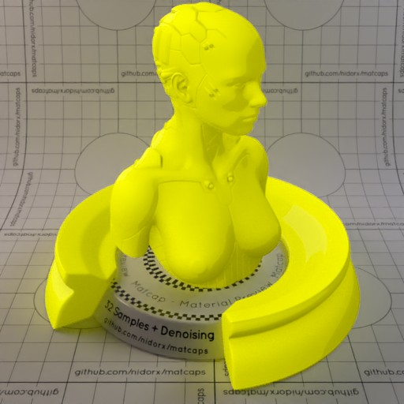

[[1024px](https://github.com/nidorx/matcaps/raw/master/1024/EDED06_EDED06_B5B504_CCCC04.png)]
[[512px](https://github.com/nidorx/matcaps/raw/master/512/EDED06_EDED06_B5B504_CCCC04-512px.png)]
[[256px](https://github.com/nidorx/matcaps/raw/master/256/EDED06_EDED06_B5B504_CCCC04-256px.png)]
[[128px](https://github.com/nidorx/matcaps/raw/master/128/EDED06_EDED06_B5B504_CCCC04-128px.png)]
[[64px](https://github.com/nidorx/matcaps/raw/master/64/EDED06_EDED06_B5B504_CCCC04-64px.png)]
[~~ZBrush Material (ZMT)~~]

---
### EEECFB_EEECFB_BFB6D5_D0C8EB

[[1024px](https://github.com/nidorx/matcaps/raw/master/1024/EEECFB_EEECFB_BFB6D5_D0C8EB.png)]
[[512px](https://github.com/nidorx/matcaps/raw/master/512/EEECFB_EEECFB_BFB6D5_D0C8EB-512px.png)]
[[256px](https://github.com/nidorx/matcaps/raw/master/256/EEECFB_EEECFB_BFB6D5_D0C8EB-256px.png)]
[[128px](https://github.com/nidorx/matcaps/raw/master/128/EEECFB_EEECFB_BFB6D5_D0C8EB-128px.png)]
[[64px](https://github.com/nidorx/matcaps/raw/master/64/EEECFB_EEECFB_BFB6D5_D0C8EB-64px.png)]
[[ZBrush Material (ZMT)](https://github.com/nidorx/matcaps/raw/master/zmt/EEECFB_EEECFB_BFB6D5_D0C8EB.zmt)]

---
### F0D504_F0D504_FBFAD3_B98609

[[1024px](https://github.com/nidorx/matcaps/raw/master/1024/F0D504_F0D504_FBFAD3_B98609.png)]
[[512px](https://github.com/nidorx/matcaps/raw/master/512/F0D504_F0D504_FBFAD3_B98609-512px.png)]
[[256px](https://github.com/nidorx/matcaps/raw/master/256/F0D504_F0D504_FBFAD3_B98609-256px.png)]
[[128px](https://github.com/nidorx/matcaps/raw/master/128/F0D504_F0D504_FBFAD3_B98609-128px.png)]
[[64px](https://github.com/nidorx/matcaps/raw/master/64/F0D504_F0D504_FBFAD3_B98609-64px.png)]
[~~ZBrush Material (ZMT)~~]

---
### F75F0B_F75F0B_461604_9A3004
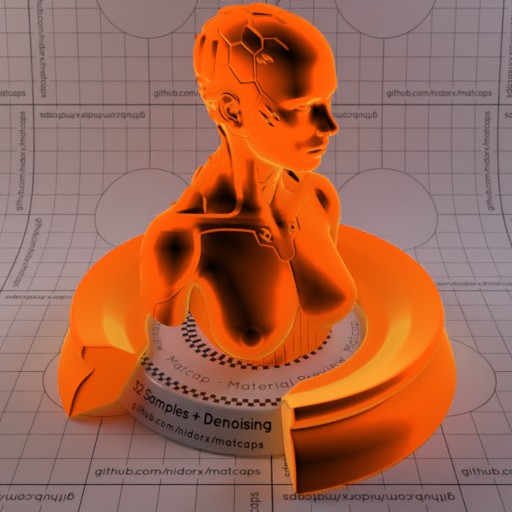
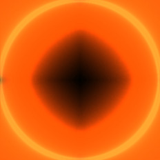

[[1024px](https://github.com/nidorx/matcaps/raw/master/1024/F75F0B_F75F0B_461604_9A3004.png)]
[[512px](https://github.com/nidorx/matcaps/raw/master/512/F75F0B_F75F0B_461604_9A3004-512px.png)]
[[256px](https://github.com/nidorx/matcaps/raw/master/256/F75F0B_F75F0B_461604_9A3004-256px.png)]
[[128px](https://github.com/nidorx/matcaps/raw/master/128/F75F0B_F75F0B_461604_9A3004-128px.png)]
[[64px](https://github.com/nidorx/matcaps/raw/master/64/F75F0B_F75F0B_461604_9A3004-64px.png)]
[[ZBrush Material (ZMT)](https://github.com/nidorx/matcaps/raw/master/zmt/F75F0B_F75F0B_461604_9A3004.zmt)]

---