A huge library of MatCap textures in PNG and ZMT.

## Navigation
* [Home](/)
* [Page 1](PAGE-1.md)
* [Page 2](PAGE-2.md)
* [Page 3](PAGE-3.md)
* [Page 4](PAGE-4.md)
* [Page 5](PAGE-5.md)
* [Page 6](PAGE-6.md)
* [Page 7](PAGE-7.md)
* Page 8
* [Page 9](PAGE-9.md)
* [Page 10](PAGE-10.md)
* [Page 11](PAGE-11.md)
* [Page 12](PAGE-12.md)
* [Page 13](PAGE-13.md)
* [Page 14](PAGE-14.md)
* [Page 15](PAGE-15.md)
* [Page 16](PAGE-16.md)
* [Page 17](PAGE-17.md)
* [Page 18](PAGE-18.md)
* [Page 19](PAGE-19.md)
* [Page 20](PAGE-20.md)
* [Page 21](PAGE-21.md)
* [Page 22](PAGE-22.md)
* [Page 23](PAGE-23.md)
* [Page 24](PAGE-24.md)
* [Page 25](PAGE-25.md)
* [Page 26](PAGE-26.md)
* [Page 27](PAGE-27.md)
* [Page 28](PAGE-28.md)
* [Page 29](PAGE-29.md)
* [Page 30](PAGE-30.md)
* [Page 31](PAGE-31.md)
* [Page 32](PAGE-32.md)
* [Page 33](PAGE-33.md)
## Page 8 Matcaps
### 49200B_C6926C_9C642B_A45C26
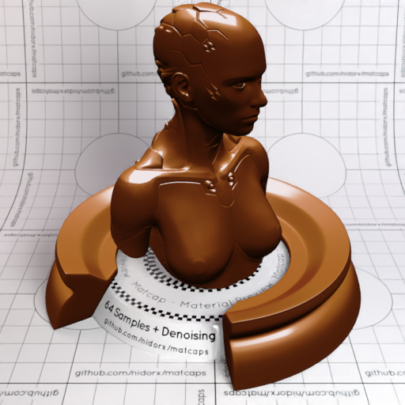
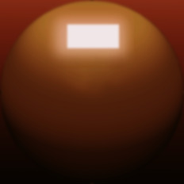

[[1024px](https://github.com/nidorx/matcaps/raw/master/1024/49200B_C6926C_9C642B_A45C26.png)]
[[512px](https://github.com/nidorx/matcaps/raw/master/512/49200B_C6926C_9C642B_A45C26-512px.png)]
[[256px](https://github.com/nidorx/matcaps/raw/master/256/49200B_C6926C_9C642B_A45C26-256px.png)]
[[128px](https://github.com/nidorx/matcaps/raw/master/128/49200B_C6926C_9C642B_A45C26-128px.png)]
[[64px](https://github.com/nidorx/matcaps/raw/master/64/49200B_C6926C_9C642B_A45C26-64px.png)]
[~~ZBrush Material (ZMT)~~]

---
### 495CA6_CCD2E6_A5B1D8_1E2852
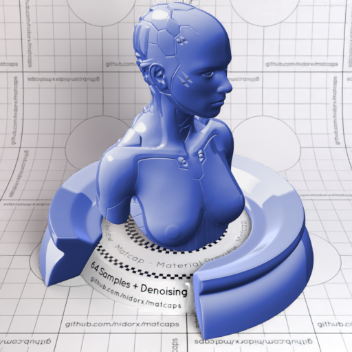

[[1024px](https://github.com/nidorx/matcaps/raw/master/1024/495CA6_CCD2E6_A5B1D8_1E2852.png)]
[[512px](https://github.com/nidorx/matcaps/raw/master/512/495CA6_CCD2E6_A5B1D8_1E2852-512px.png)]
[[256px](https://github.com/nidorx/matcaps/raw/master/256/495CA6_CCD2E6_A5B1D8_1E2852-256px.png)]
[[128px](https://github.com/nidorx/matcaps/raw/master/128/495CA6_CCD2E6_A5B1D8_1E2852-128px.png)]
[[64px](https://github.com/nidorx/matcaps/raw/master/64/495CA6_CCD2E6_A5B1D8_1E2852-64px.png)]
[[ZBrush Material (ZMT)](https://github.com/nidorx/matcaps/raw/master/zmt/495CA6_CCD2E6_A5B1D8_1E2852.zmt)]

---
### 495E48_0D100D_9D9C87_9ECC9C
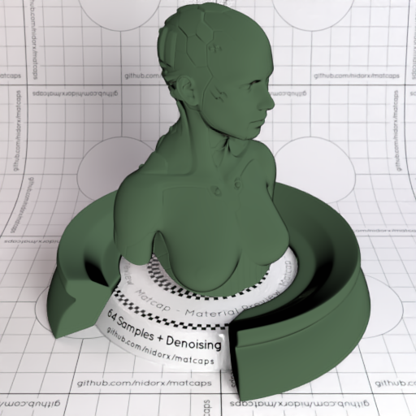

[[1024px](https://github.com/nidorx/matcaps/raw/master/1024/495E48_0D100D_9D9C87_9ECC9C.png)]
[[512px](https://github.com/nidorx/matcaps/raw/master/512/495E48_0D100D_9D9C87_9ECC9C-512px.png)]
[[256px](https://github.com/nidorx/matcaps/raw/master/256/495E48_0D100D_9D9C87_9ECC9C-256px.png)]
[[128px](https://github.com/nidorx/matcaps/raw/master/128/495E48_0D100D_9D9C87_9ECC9C-128px.png)]
[[64px](https://github.com/nidorx/matcaps/raw/master/64/495E48_0D100D_9D9C87_9ECC9C-64px.png)]
[[ZBrush Material (ZMT)](https://github.com/nidorx/matcaps/raw/master/zmt/495E48_0D100D_9D9C87_9ECC9C.zmt)]

---
### 496DBA_94C9F2_72A7E2_84B4EC
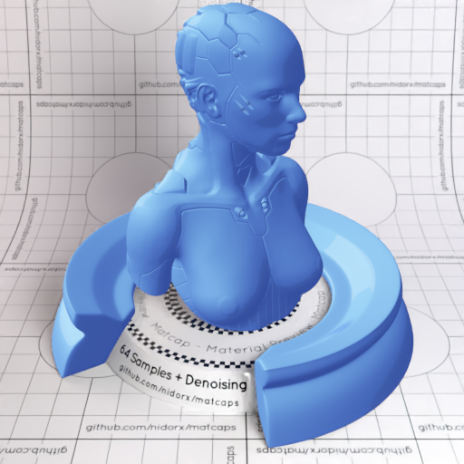
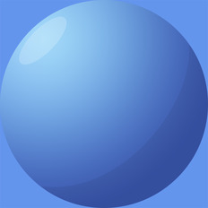

[[1024px](https://github.com/nidorx/matcaps/raw/master/1024/496DBA_94C9F2_72A7E2_84B4EC.png)]
[[512px](https://github.com/nidorx/matcaps/raw/master/512/496DBA_94C9F2_72A7E2_84B4EC-512px.png)]
[[256px](https://github.com/nidorx/matcaps/raw/master/256/496DBA_94C9F2_72A7E2_84B4EC-256px.png)]
[[128px](https://github.com/nidorx/matcaps/raw/master/128/496DBA_94C9F2_72A7E2_84B4EC-128px.png)]
[[64px](https://github.com/nidorx/matcaps/raw/master/64/496DBA_94C9F2_72A7E2_84B4EC-64px.png)]
[~~ZBrush Material (ZMT)~~]

---
### 4A6442_D0AB75_81CD94_181B12
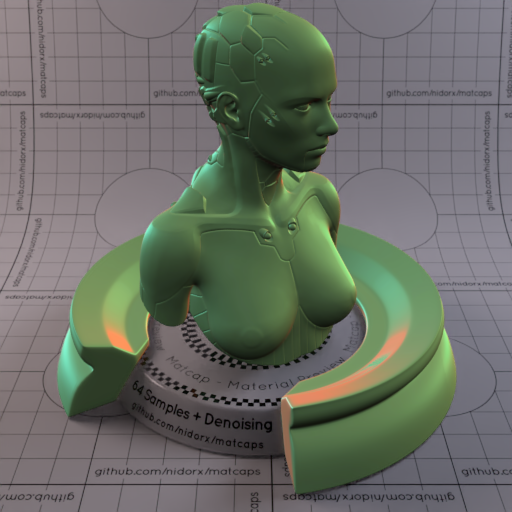
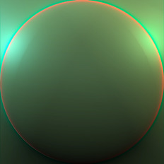

[[1024px](https://github.com/nidorx/matcaps/raw/master/1024/4A6442_D0AB75_81CD94_181B12.png)]
[[512px](https://github.com/nidorx/matcaps/raw/master/512/4A6442_D0AB75_81CD94_181B12-512px.png)]
[[256px](https://github.com/nidorx/matcaps/raw/master/256/4A6442_D0AB75_81CD94_181B12-256px.png)]
[[128px](https://github.com/nidorx/matcaps/raw/master/128/4A6442_D0AB75_81CD94_181B12-128px.png)]
[[64px](https://github.com/nidorx/matcaps/raw/master/64/4A6442_D0AB75_81CD94_181B12-64px.png)]
[[ZBrush Material (ZMT)](https://github.com/nidorx/matcaps/raw/master/zmt/4A6442_D0AB75_81CD94_181B12.zmt)]

---
### 4B362C_715A4F_211913_644C44
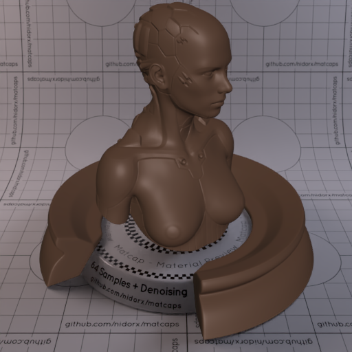
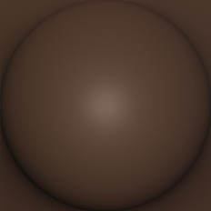

[[1024px](https://github.com/nidorx/matcaps/raw/master/1024/4B362C_715A4F_211913_644C44.png)]
[[512px](https://github.com/nidorx/matcaps/raw/master/512/4B362C_715A4F_211913_644C44-512px.png)]
[[256px](https://github.com/nidorx/matcaps/raw/master/256/4B362C_715A4F_211913_644C44-256px.png)]
[[128px](https://github.com/nidorx/matcaps/raw/master/128/4B362C_715A4F_211913_644C44-128px.png)]
[[64px](https://github.com/nidorx/matcaps/raw/master/64/4B362C_715A4F_211913_644C44-64px.png)]
[[ZBrush Material (ZMT)](https://github.com/nidorx/matcaps/raw/master/zmt/4B362C_715A4F_211913_644C44.zmt)]

---
### 4B4A3A_94A3A4_68766F_988475
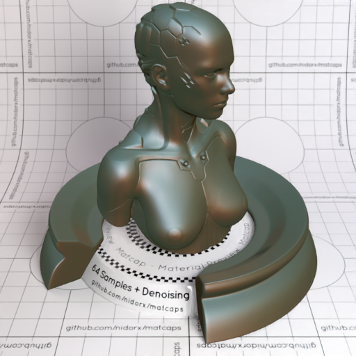
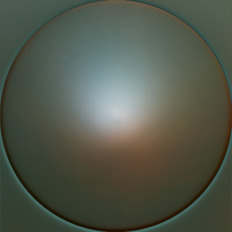

[[1024px](https://github.com/nidorx/matcaps/raw/master/1024/4B4A3A_94A3A4_68766F_988475.png)]
[[512px](https://github.com/nidorx/matcaps/raw/master/512/4B4A3A_94A3A4_68766F_988475-512px.png)]
[[256px](https://github.com/nidorx/matcaps/raw/master/256/4B4A3A_94A3A4_68766F_988475-256px.png)]
[[128px](https://github.com/nidorx/matcaps/raw/master/128/4B4A3A_94A3A4_68766F_988475-128px.png)]
[[64px](https://github.com/nidorx/matcaps/raw/master/64/4B4A3A_94A3A4_68766F_988475-64px.png)]
[[ZBrush Material (ZMT)](https://github.com/nidorx/matcaps/raw/master/zmt/4B4A3A_94A3A4_68766F_988475.zmt)]

---
### 4B5455_BBBFC4_97A0A6_838C90
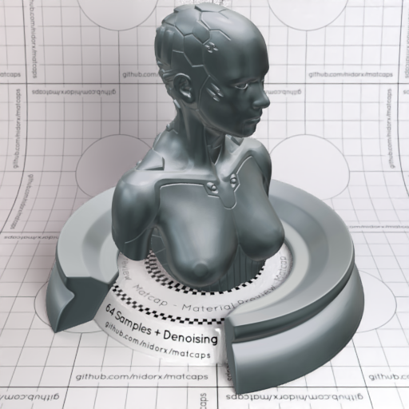

[[1024px](https://github.com/nidorx/matcaps/raw/master/1024/4B5455_BBBFC4_97A0A6_838C90.png)]
[[512px](https://github.com/nidorx/matcaps/raw/master/512/4B5455_BBBFC4_97A0A6_838C90-512px.png)]
[[256px](https://github.com/nidorx/matcaps/raw/master/256/4B5455_BBBFC4_97A0A6_838C90-256px.png)]
[[128px](https://github.com/nidorx/matcaps/raw/master/128/4B5455_BBBFC4_97A0A6_838C90-128px.png)]
[[64px](https://github.com/nidorx/matcaps/raw/master/64/4B5455_BBBFC4_97A0A6_838C90-64px.png)]
[~~ZBrush Material (ZMT)~~]

---
### 4C240E_A5613B_895134_734C44
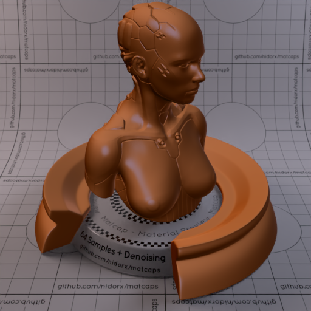

[[1024px](https://github.com/nidorx/matcaps/raw/master/1024/4C240E_A5613B_895134_734C44.png)]
[[512px](https://github.com/nidorx/matcaps/raw/master/512/4C240E_A5613B_895134_734C44-512px.png)]
[[256px](https://github.com/nidorx/matcaps/raw/master/256/4C240E_A5613B_895134_734C44-256px.png)]
[[128px](https://github.com/nidorx/matcaps/raw/master/128/4C240E_A5613B_895134_734C44-128px.png)]
[[64px](https://github.com/nidorx/matcaps/raw/master/64/4C240E_A5613B_895134_734C44-64px.png)]
[[ZBrush Material (ZMT)](https://github.com/nidorx/matcaps/raw/master/zmt/4C240E_A5613B_895134_734C44.zmt)]

---
### 4C342A_7B584B_271912_6B4C44
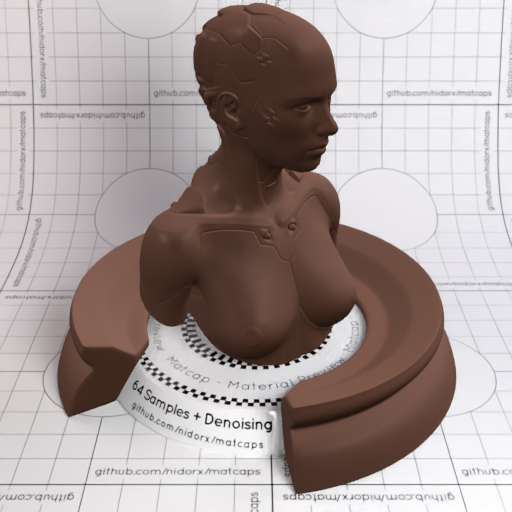

[[1024px](https://github.com/nidorx/matcaps/raw/master/1024/4C342A_7B584B_271912_6B4C44.png)]
[[512px](https://github.com/nidorx/matcaps/raw/master/512/4C342A_7B584B_271912_6B4C44-512px.png)]
[[256px](https://github.com/nidorx/matcaps/raw/master/256/4C342A_7B584B_271912_6B4C44-256px.png)]
[[128px](https://github.com/nidorx/matcaps/raw/master/128/4C342A_7B584B_271912_6B4C44-128px.png)]
[[64px](https://github.com/nidorx/matcaps/raw/master/64/4C342A_7B584B_271912_6B4C44-64px.png)]
[[ZBrush Material (ZMT)](https://github.com/nidorx/matcaps/raw/master/zmt/4C342A_7B584B_271912_6B4C44.zmt)]

---
### 4C462E_6D876C_9AAC8F_9AABA6
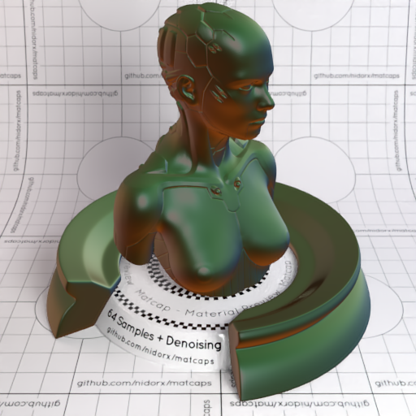

[[1024px](https://github.com/nidorx/matcaps/raw/master/1024/4C462E_6D876C_9AAC8F_9AABA6.png)]
[[512px](https://github.com/nidorx/matcaps/raw/master/512/4C462E_6D876C_9AAC8F_9AABA6-512px.png)]
[[256px](https://github.com/nidorx/matcaps/raw/master/256/4C462E_6D876C_9AAC8F_9AABA6-256px.png)]
[[128px](https://github.com/nidorx/matcaps/raw/master/128/4C462E_6D876C_9AAC8F_9AABA6-128px.png)]
[[64px](https://github.com/nidorx/matcaps/raw/master/64/4C462E_6D876C_9AAC8F_9AABA6-64px.png)]
[[ZBrush Material (ZMT)](https://github.com/nidorx/matcaps/raw/master/zmt/4C462E_6D876C_9AAC8F_9AABA6.zmt)]

---
### 4C4C4C_D2D2D2_8F8F8F_ACACAC
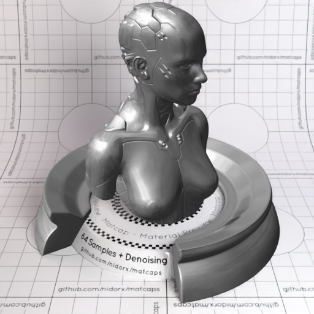
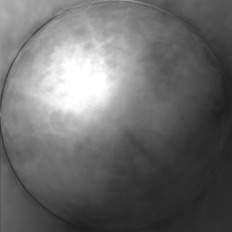

[[1024px](https://github.com/nidorx/matcaps/raw/master/1024/4C4C4C_D2D2D2_8F8F8F_ACACAC.png)]
[[512px](https://github.com/nidorx/matcaps/raw/master/512/4C4C4C_D2D2D2_8F8F8F_ACACAC-512px.png)]
[[256px](https://github.com/nidorx/matcaps/raw/master/256/4C4C4C_D2D2D2_8F8F8F_ACACAC-256px.png)]
[[128px](https://github.com/nidorx/matcaps/raw/master/128/4C4C4C_D2D2D2_8F8F8F_ACACAC-128px.png)]
[[64px](https://github.com/nidorx/matcaps/raw/master/64/4C4C4C_D2D2D2_8F8F8F_ACACAC-64px.png)]
[[ZBrush Material (ZMT)](https://github.com/nidorx/matcaps/raw/master/zmt/4C4C4C_D2D2D2_8F8F8F_ACACAC.zmt)]

---
### 4D595E_858D87_596F84_748480
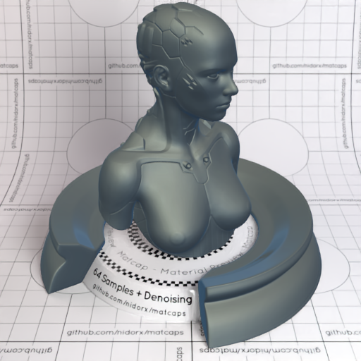

[[1024px](https://github.com/nidorx/matcaps/raw/master/1024/4D595E_858D87_596F84_748480.png)]
[[512px](https://github.com/nidorx/matcaps/raw/master/512/4D595E_858D87_596F84_748480-512px.png)]
[[256px](https://github.com/nidorx/matcaps/raw/master/256/4D595E_858D87_596F84_748480-256px.png)]
[[128px](https://github.com/nidorx/matcaps/raw/master/128/4D595E_858D87_596F84_748480-128px.png)]
[[64px](https://github.com/nidorx/matcaps/raw/master/64/4D595E_858D87_596F84_748480-64px.png)]
[[ZBrush Material (ZMT)](https://github.com/nidorx/matcaps/raw/master/zmt/4D595E_858D87_596F84_748480.zmt)]

---
### 4E4C42_B8C4C5_898E89_A3ACA4
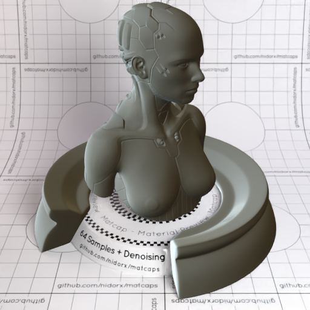

[[1024px](https://github.com/nidorx/matcaps/raw/master/1024/4E4C42_B8C4C5_898E89_A3ACA4.png)]
[[512px](https://github.com/nidorx/matcaps/raw/master/512/4E4C42_B8C4C5_898E89_A3ACA4-512px.png)]
[[256px](https://github.com/nidorx/matcaps/raw/master/256/4E4C42_B8C4C5_898E89_A3ACA4-256px.png)]
[[128px](https://github.com/nidorx/matcaps/raw/master/128/4E4C42_B8C4C5_898E89_A3ACA4-128px.png)]
[[64px](https://github.com/nidorx/matcaps/raw/master/64/4E4C42_B8C4C5_898E89_A3ACA4-64px.png)]
[[ZBrush Material (ZMT)](https://github.com/nidorx/matcaps/raw/master/zmt/4E4C42_B8C4C5_898E89_A3ACA4.zmt)]

---
### 4E4D40_979786_AEAEA1_878678
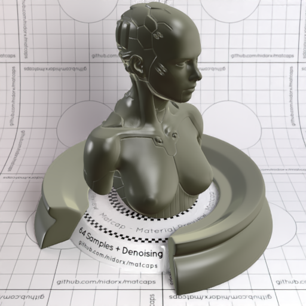
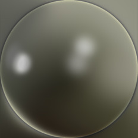

[[1024px](https://github.com/nidorx/matcaps/raw/master/1024/4E4D40_979786_AEAEA1_878678.png)]
[[512px](https://github.com/nidorx/matcaps/raw/master/512/4E4D40_979786_AEAEA1_878678-512px.png)]
[[256px](https://github.com/nidorx/matcaps/raw/master/256/4E4D40_979786_AEAEA1_878678-256px.png)]
[[128px](https://github.com/nidorx/matcaps/raw/master/128/4E4D40_979786_AEAEA1_878678-128px.png)]
[[64px](https://github.com/nidorx/matcaps/raw/master/64/4E4D40_979786_AEAEA1_878678-64px.png)]
[[ZBrush Material (ZMT)](https://github.com/nidorx/matcaps/raw/master/zmt/4E4D40_979786_AEAEA1_878678.zmt)]

---
### 4E5150_9FA3A3_848C8A_82848C
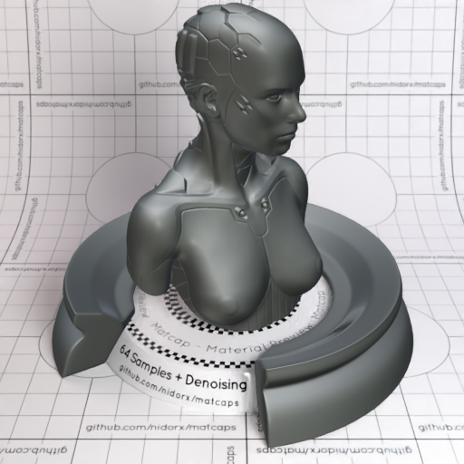
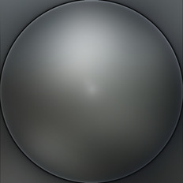

[[1024px](https://github.com/nidorx/matcaps/raw/master/1024/4E5150_9FA3A3_848C8A_82848C.png)]
[[512px](https://github.com/nidorx/matcaps/raw/master/512/4E5150_9FA3A3_848C8A_82848C-512px.png)]
[[256px](https://github.com/nidorx/matcaps/raw/master/256/4E5150_9FA3A3_848C8A_82848C-256px.png)]
[[128px](https://github.com/nidorx/matcaps/raw/master/128/4E5150_9FA3A3_848C8A_82848C-128px.png)]
[[64px](https://github.com/nidorx/matcaps/raw/master/64/4E5150_9FA3A3_848C8A_82848C-64px.png)]
[[ZBrush Material (ZMT)](https://github.com/nidorx/matcaps/raw/master/zmt/4E5150_9FA3A3_848C8A_82848C.zmt)]

---
### 4F251B_381710_43241B_602F23

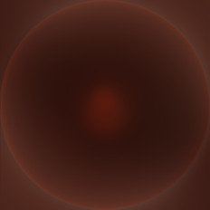

[[1024px](https://github.com/nidorx/matcaps/raw/master/1024/4F251B_381710_43241B_602F23.png)]
[[512px](https://github.com/nidorx/matcaps/raw/master/512/4F251B_381710_43241B_602F23-512px.png)]
[[256px](https://github.com/nidorx/matcaps/raw/master/256/4F251B_381710_43241B_602F23-256px.png)]
[[128px](https://github.com/nidorx/matcaps/raw/master/128/4F251B_381710_43241B_602F23-128px.png)]
[[64px](https://github.com/nidorx/matcaps/raw/master/64/4F251B_381710_43241B_602F23-64px.png)]
[[ZBrush Material (ZMT)](https://github.com/nidorx/matcaps/raw/master/zmt/4F251B_381710_43241B_602F23.zmt)]

---
### 4F439F_A28BE5_8570D6_7765C9

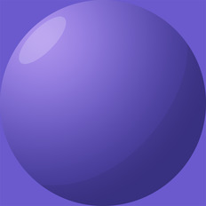

[[1024px](https://github.com/nidorx/matcaps/raw/master/1024/4F439F_A28BE5_8570D6_7765C9.png)]
[[512px](https://github.com/nidorx/matcaps/raw/master/512/4F439F_A28BE5_8570D6_7765C9-512px.png)]
[[256px](https://github.com/nidorx/matcaps/raw/master/256/4F439F_A28BE5_8570D6_7765C9-256px.png)]
[[128px](https://github.com/nidorx/matcaps/raw/master/128/4F439F_A28BE5_8570D6_7765C9-128px.png)]
[[64px](https://github.com/nidorx/matcaps/raw/master/64/4F439F_A28BE5_8570D6_7765C9-64px.png)]
[~~ZBrush Material (ZMT)~~]

---
### 4F4742_B7B1AA_847E79_969294
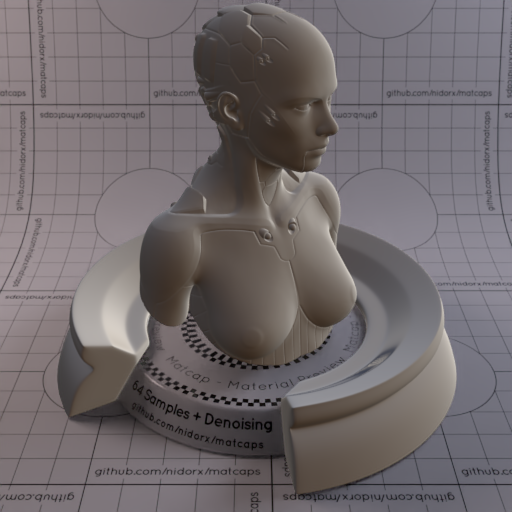

[[1024px](https://github.com/nidorx/matcaps/raw/master/1024/4F4742_B7B1AA_847E79_969294.png)]
[[512px](https://github.com/nidorx/matcaps/raw/master/512/4F4742_B7B1AA_847E79_969294-512px.png)]
[[256px](https://github.com/nidorx/matcaps/raw/master/256/4F4742_B7B1AA_847E79_969294-256px.png)]
[[128px](https://github.com/nidorx/matcaps/raw/master/128/4F4742_B7B1AA_847E79_969294-128px.png)]
[[64px](https://github.com/nidorx/matcaps/raw/master/64/4F4742_B7B1AA_847E79_969294-64px.png)]
[[ZBrush Material (ZMT)](https://github.com/nidorx/matcaps/raw/master/zmt/4F4742_B7B1AA_847E79_969294.zmt)]

---
### 4F4C45_A7AEAA_7A8575_9D97A2
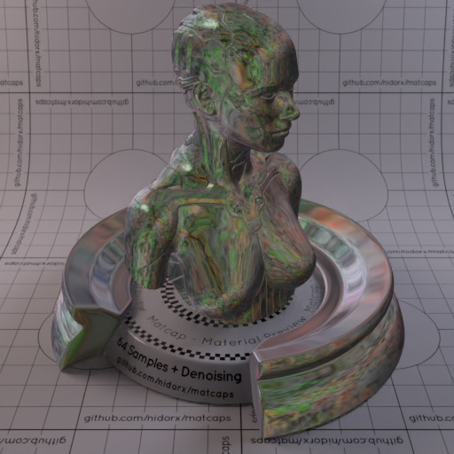
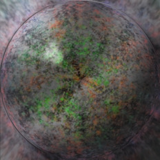

[[1024px](https://github.com/nidorx/matcaps/raw/master/1024/4F4C45_A7AEAA_7A8575_9D97A2.png)]
[[512px](https://github.com/nidorx/matcaps/raw/master/512/4F4C45_A7AEAA_7A8575_9D97A2-512px.png)]
[[256px](https://github.com/nidorx/matcaps/raw/master/256/4F4C45_A7AEAA_7A8575_9D97A2-256px.png)]
[[128px](https://github.com/nidorx/matcaps/raw/master/128/4F4C45_A7AEAA_7A8575_9D97A2-128px.png)]
[[64px](https://github.com/nidorx/matcaps/raw/master/64/4F4C45_A7AEAA_7A8575_9D97A2-64px.png)]
[[ZBrush Material (ZMT)](https://github.com/nidorx/matcaps/raw/master/zmt/4F4C45_A7AEAA_7A8575_9D97A2.zmt)]

---