A huge library of MatCap textures in PNG and ZMT.

## Navigation
* [Home](/)
* [Page 1](PAGE-1.md)
* [Page 2](PAGE-2.md)
* [Page 3](PAGE-3.md)
* [Page 4](PAGE-4.md)
* [Page 5](PAGE-5.md)
* [Page 6](PAGE-6.md)
* [Page 7](PAGE-7.md)
* Page 8
* [Page 9](PAGE-9.md)
* [Page 10](PAGE-10.md)
* [Page 11](PAGE-11.md)
* [Page 12](PAGE-12.md)
* [Page 13](PAGE-13.md)
* [Page 14](PAGE-14.md)
* [Page 15](PAGE-15.md)
* [Page 16](PAGE-16.md)
* [Page 17](PAGE-17.md)
* [Page 18](PAGE-18.md)
* [Page 19](PAGE-19.md)
* [Page 20](PAGE-20.md)
* [Page 21](PAGE-21.md)
* [Page 22](PAGE-22.md)
* [Page 23](PAGE-23.md)
* [Page 24](PAGE-24.md)
* [Page 25](PAGE-25.md)
* [Page 26](PAGE-26.md)
* [Page 27](PAGE-27.md)
* [Page 28](PAGE-28.md)
* [Page 29](PAGE-29.md)
* [Page 30](PAGE-30.md)
* [Page 31](PAGE-31.md)
* [Page 32](PAGE-32.md)
* [Page 33](PAGE-33.md)
## Page 8 Matcaps
### 49200B_49200B_C6926C_9C642B
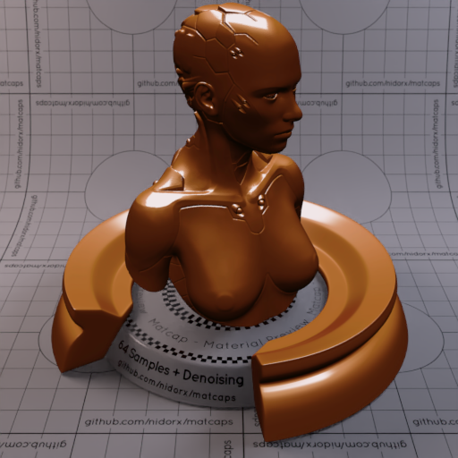

[[1024px](https://github.com/nidorx/matcaps/raw/master/1024/49200B_49200B_C6926C_9C642B.png)]
[[512px](https://github.com/nidorx/matcaps/raw/master/512/49200B_49200B_C6926C_9C642B-512px.png)]
[[256px](https://github.com/nidorx/matcaps/raw/master/256/49200B_49200B_C6926C_9C642B-256px.png)]
[[128px](https://github.com/nidorx/matcaps/raw/master/128/49200B_49200B_C6926C_9C642B-128px.png)]
[[64px](https://github.com/nidorx/matcaps/raw/master/64/49200B_49200B_C6926C_9C642B-64px.png)]
[~~ZBrush Material (ZMT)~~]

---
### 495CA6_495CA6_CCD2E6_A5B1D8

[[1024px](https://github.com/nidorx/matcaps/raw/master/1024/495CA6_495CA6_CCD2E6_A5B1D8.png)]
[[512px](https://github.com/nidorx/matcaps/raw/master/512/495CA6_495CA6_CCD2E6_A5B1D8-512px.png)]
[[256px](https://github.com/nidorx/matcaps/raw/master/256/495CA6_495CA6_CCD2E6_A5B1D8-256px.png)]
[[128px](https://github.com/nidorx/matcaps/raw/master/128/495CA6_495CA6_CCD2E6_A5B1D8-128px.png)]
[[64px](https://github.com/nidorx/matcaps/raw/master/64/495CA6_495CA6_CCD2E6_A5B1D8-64px.png)]
[[ZBrush Material (ZMT)](https://github.com/nidorx/matcaps/raw/master/zmt/495CA6_495CA6_CCD2E6_A5B1D8.zmt)]

---
### 495E48_495E48_0D100D_9D9C87
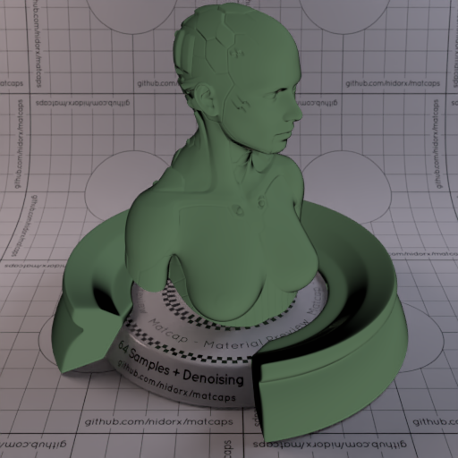
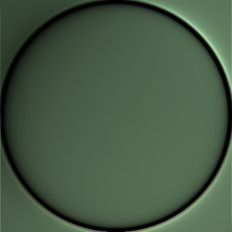

[[1024px](https://github.com/nidorx/matcaps/raw/master/1024/495E48_495E48_0D100D_9D9C87.png)]
[[512px](https://github.com/nidorx/matcaps/raw/master/512/495E48_495E48_0D100D_9D9C87-512px.png)]
[[256px](https://github.com/nidorx/matcaps/raw/master/256/495E48_495E48_0D100D_9D9C87-256px.png)]
[[128px](https://github.com/nidorx/matcaps/raw/master/128/495E48_495E48_0D100D_9D9C87-128px.png)]
[[64px](https://github.com/nidorx/matcaps/raw/master/64/495E48_495E48_0D100D_9D9C87-64px.png)]
[[ZBrush Material (ZMT)](https://github.com/nidorx/matcaps/raw/master/zmt/495E48_495E48_0D100D_9D9C87.zmt)]

---
### 496DBA_496DBA_94C9F2_72A7E2
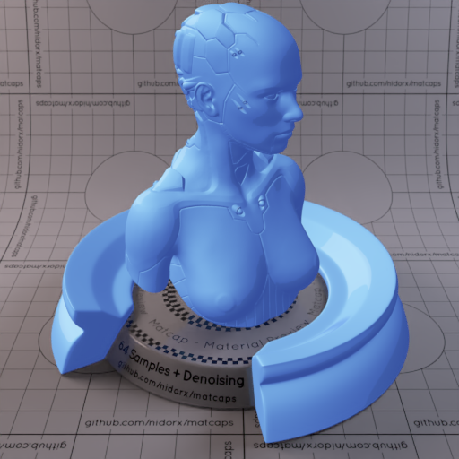

[[1024px](https://github.com/nidorx/matcaps/raw/master/1024/496DBA_496DBA_94C9F2_72A7E2.png)]
[[512px](https://github.com/nidorx/matcaps/raw/master/512/496DBA_496DBA_94C9F2_72A7E2-512px.png)]
[[256px](https://github.com/nidorx/matcaps/raw/master/256/496DBA_496DBA_94C9F2_72A7E2-256px.png)]
[[128px](https://github.com/nidorx/matcaps/raw/master/128/496DBA_496DBA_94C9F2_72A7E2-128px.png)]
[[64px](https://github.com/nidorx/matcaps/raw/master/64/496DBA_496DBA_94C9F2_72A7E2-64px.png)]
[~~ZBrush Material (ZMT)~~]

---
### 4A6442_4A6442_D0AB75_81CD94

[[1024px](https://github.com/nidorx/matcaps/raw/master/1024/4A6442_4A6442_D0AB75_81CD94.png)]
[[512px](https://github.com/nidorx/matcaps/raw/master/512/4A6442_4A6442_D0AB75_81CD94-512px.png)]
[[256px](https://github.com/nidorx/matcaps/raw/master/256/4A6442_4A6442_D0AB75_81CD94-256px.png)]
[[128px](https://github.com/nidorx/matcaps/raw/master/128/4A6442_4A6442_D0AB75_81CD94-128px.png)]
[[64px](https://github.com/nidorx/matcaps/raw/master/64/4A6442_4A6442_D0AB75_81CD94-64px.png)]
[[ZBrush Material (ZMT)](https://github.com/nidorx/matcaps/raw/master/zmt/4A6442_4A6442_D0AB75_81CD94.zmt)]

---
### 4B362C_4B362C_715A4F_211913

[[1024px](https://github.com/nidorx/matcaps/raw/master/1024/4B362C_4B362C_715A4F_211913.png)]
[[512px](https://github.com/nidorx/matcaps/raw/master/512/4B362C_4B362C_715A4F_211913-512px.png)]
[[256px](https://github.com/nidorx/matcaps/raw/master/256/4B362C_4B362C_715A4F_211913-256px.png)]
[[128px](https://github.com/nidorx/matcaps/raw/master/128/4B362C_4B362C_715A4F_211913-128px.png)]
[[64px](https://github.com/nidorx/matcaps/raw/master/64/4B362C_4B362C_715A4F_211913-64px.png)]
[[ZBrush Material (ZMT)](https://github.com/nidorx/matcaps/raw/master/zmt/4B362C_4B362C_715A4F_211913.zmt)]

---
### 4B4A3A_4B4A3A_94A3A4_68766F

[[1024px](https://github.com/nidorx/matcaps/raw/master/1024/4B4A3A_4B4A3A_94A3A4_68766F.png)]
[[512px](https://github.com/nidorx/matcaps/raw/master/512/4B4A3A_4B4A3A_94A3A4_68766F-512px.png)]
[[256px](https://github.com/nidorx/matcaps/raw/master/256/4B4A3A_4B4A3A_94A3A4_68766F-256px.png)]
[[128px](https://github.com/nidorx/matcaps/raw/master/128/4B4A3A_4B4A3A_94A3A4_68766F-128px.png)]
[[64px](https://github.com/nidorx/matcaps/raw/master/64/4B4A3A_4B4A3A_94A3A4_68766F-64px.png)]
[[ZBrush Material (ZMT)](https://github.com/nidorx/matcaps/raw/master/zmt/4B4A3A_4B4A3A_94A3A4_68766F.zmt)]

---
### 4B5455_4B5455_BBBFC4_97A0A6
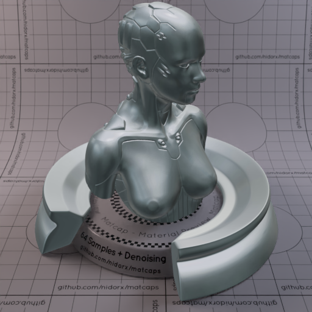

[[1024px](https://github.com/nidorx/matcaps/raw/master/1024/4B5455_4B5455_BBBFC4_97A0A6.png)]
[[512px](https://github.com/nidorx/matcaps/raw/master/512/4B5455_4B5455_BBBFC4_97A0A6-512px.png)]
[[256px](https://github.com/nidorx/matcaps/raw/master/256/4B5455_4B5455_BBBFC4_97A0A6-256px.png)]
[[128px](https://github.com/nidorx/matcaps/raw/master/128/4B5455_4B5455_BBBFC4_97A0A6-128px.png)]
[[64px](https://github.com/nidorx/matcaps/raw/master/64/4B5455_4B5455_BBBFC4_97A0A6-64px.png)]
[~~ZBrush Material (ZMT)~~]

---
### 4C240E_4C240E_A5613B_895134

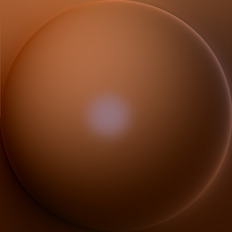

[[1024px](https://github.com/nidorx/matcaps/raw/master/1024/4C240E_4C240E_A5613B_895134.png)]
[[512px](https://github.com/nidorx/matcaps/raw/master/512/4C240E_4C240E_A5613B_895134-512px.png)]
[[256px](https://github.com/nidorx/matcaps/raw/master/256/4C240E_4C240E_A5613B_895134-256px.png)]
[[128px](https://github.com/nidorx/matcaps/raw/master/128/4C240E_4C240E_A5613B_895134-128px.png)]
[[64px](https://github.com/nidorx/matcaps/raw/master/64/4C240E_4C240E_A5613B_895134-64px.png)]
[[ZBrush Material (ZMT)](https://github.com/nidorx/matcaps/raw/master/zmt/4C240E_4C240E_A5613B_895134.zmt)]

---
### 4C342A_4C342A_7B584B_271912
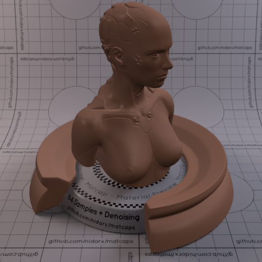
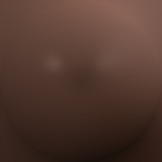

[[1024px](https://github.com/nidorx/matcaps/raw/master/1024/4C342A_4C342A_7B584B_271912.png)]
[[512px](https://github.com/nidorx/matcaps/raw/master/512/4C342A_4C342A_7B584B_271912-512px.png)]
[[256px](https://github.com/nidorx/matcaps/raw/master/256/4C342A_4C342A_7B584B_271912-256px.png)]
[[128px](https://github.com/nidorx/matcaps/raw/master/128/4C342A_4C342A_7B584B_271912-128px.png)]
[[64px](https://github.com/nidorx/matcaps/raw/master/64/4C342A_4C342A_7B584B_271912-64px.png)]
[[ZBrush Material (ZMT)](https://github.com/nidorx/matcaps/raw/master/zmt/4C342A_4C342A_7B584B_271912.zmt)]

---
### 4C462E_4C462E_6D876C_9AAC8F
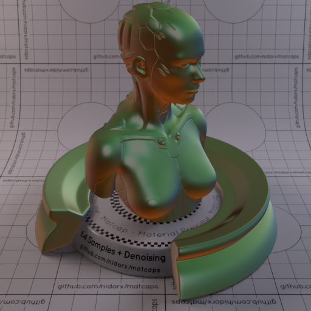
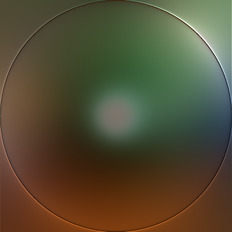

[[1024px](https://github.com/nidorx/matcaps/raw/master/1024/4C462E_4C462E_6D876C_9AAC8F.png)]
[[512px](https://github.com/nidorx/matcaps/raw/master/512/4C462E_4C462E_6D876C_9AAC8F-512px.png)]
[[256px](https://github.com/nidorx/matcaps/raw/master/256/4C462E_4C462E_6D876C_9AAC8F-256px.png)]
[[128px](https://github.com/nidorx/matcaps/raw/master/128/4C462E_4C462E_6D876C_9AAC8F-128px.png)]
[[64px](https://github.com/nidorx/matcaps/raw/master/64/4C462E_4C462E_6D876C_9AAC8F-64px.png)]
[[ZBrush Material (ZMT)](https://github.com/nidorx/matcaps/raw/master/zmt/4C462E_4C462E_6D876C_9AAC8F.zmt)]

---
### 4C4C4C_4C4C4C_D2D2D2_8F8F8F

[[1024px](https://github.com/nidorx/matcaps/raw/master/1024/4C4C4C_4C4C4C_D2D2D2_8F8F8F.png)]
[[512px](https://github.com/nidorx/matcaps/raw/master/512/4C4C4C_4C4C4C_D2D2D2_8F8F8F-512px.png)]
[[256px](https://github.com/nidorx/matcaps/raw/master/256/4C4C4C_4C4C4C_D2D2D2_8F8F8F-256px.png)]
[[128px](https://github.com/nidorx/matcaps/raw/master/128/4C4C4C_4C4C4C_D2D2D2_8F8F8F-128px.png)]
[[64px](https://github.com/nidorx/matcaps/raw/master/64/4C4C4C_4C4C4C_D2D2D2_8F8F8F-64px.png)]
[[ZBrush Material (ZMT)](https://github.com/nidorx/matcaps/raw/master/zmt/4C4C4C_4C4C4C_D2D2D2_8F8F8F.zmt)]

---
### 4D595E_4D595E_858D87_596F84

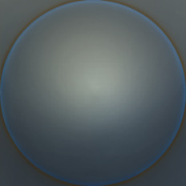

[[1024px](https://github.com/nidorx/matcaps/raw/master/1024/4D595E_4D595E_858D87_596F84.png)]
[[512px](https://github.com/nidorx/matcaps/raw/master/512/4D595E_4D595E_858D87_596F84-512px.png)]
[[256px](https://github.com/nidorx/matcaps/raw/master/256/4D595E_4D595E_858D87_596F84-256px.png)]
[[128px](https://github.com/nidorx/matcaps/raw/master/128/4D595E_4D595E_858D87_596F84-128px.png)]
[[64px](https://github.com/nidorx/matcaps/raw/master/64/4D595E_4D595E_858D87_596F84-64px.png)]
[[ZBrush Material (ZMT)](https://github.com/nidorx/matcaps/raw/master/zmt/4D595E_4D595E_858D87_596F84.zmt)]

---
### 4E4C42_4E4C42_B8C4C5_898E89

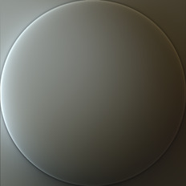

[[1024px](https://github.com/nidorx/matcaps/raw/master/1024/4E4C42_4E4C42_B8C4C5_898E89.png)]
[[512px](https://github.com/nidorx/matcaps/raw/master/512/4E4C42_4E4C42_B8C4C5_898E89-512px.png)]
[[256px](https://github.com/nidorx/matcaps/raw/master/256/4E4C42_4E4C42_B8C4C5_898E89-256px.png)]
[[128px](https://github.com/nidorx/matcaps/raw/master/128/4E4C42_4E4C42_B8C4C5_898E89-128px.png)]
[[64px](https://github.com/nidorx/matcaps/raw/master/64/4E4C42_4E4C42_B8C4C5_898E89-64px.png)]
[[ZBrush Material (ZMT)](https://github.com/nidorx/matcaps/raw/master/zmt/4E4C42_4E4C42_B8C4C5_898E89.zmt)]

---
### 4E4D40_4E4D40_979786_AEAEA1
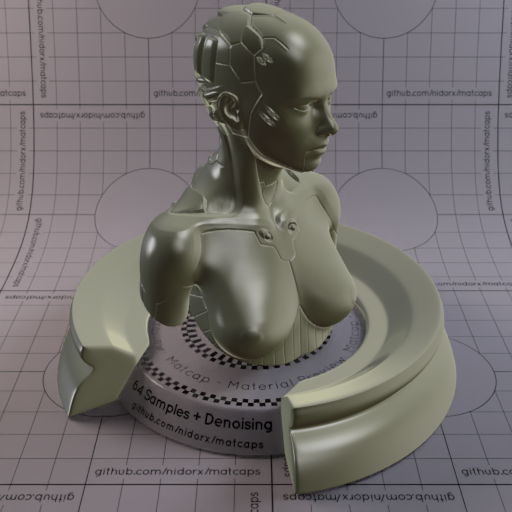

[[1024px](https://github.com/nidorx/matcaps/raw/master/1024/4E4D40_4E4D40_979786_AEAEA1.png)]
[[512px](https://github.com/nidorx/matcaps/raw/master/512/4E4D40_4E4D40_979786_AEAEA1-512px.png)]
[[256px](https://github.com/nidorx/matcaps/raw/master/256/4E4D40_4E4D40_979786_AEAEA1-256px.png)]
[[128px](https://github.com/nidorx/matcaps/raw/master/128/4E4D40_4E4D40_979786_AEAEA1-128px.png)]
[[64px](https://github.com/nidorx/matcaps/raw/master/64/4E4D40_4E4D40_979786_AEAEA1-64px.png)]
[[ZBrush Material (ZMT)](https://github.com/nidorx/matcaps/raw/master/zmt/4E4D40_4E4D40_979786_AEAEA1.zmt)]

---
### 4E5150_4E5150_9FA3A3_848C8A
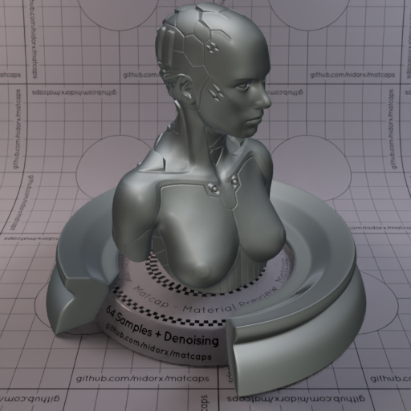

[[1024px](https://github.com/nidorx/matcaps/raw/master/1024/4E5150_4E5150_9FA3A3_848C8A.png)]
[[512px](https://github.com/nidorx/matcaps/raw/master/512/4E5150_4E5150_9FA3A3_848C8A-512px.png)]
[[256px](https://github.com/nidorx/matcaps/raw/master/256/4E5150_4E5150_9FA3A3_848C8A-256px.png)]
[[128px](https://github.com/nidorx/matcaps/raw/master/128/4E5150_4E5150_9FA3A3_848C8A-128px.png)]
[[64px](https://github.com/nidorx/matcaps/raw/master/64/4E5150_4E5150_9FA3A3_848C8A-64px.png)]
[[ZBrush Material (ZMT)](https://github.com/nidorx/matcaps/raw/master/zmt/4E5150_4E5150_9FA3A3_848C8A.zmt)]

---
### 4F251B_4F251B_381710_43241B

[[1024px](https://github.com/nidorx/matcaps/raw/master/1024/4F251B_4F251B_381710_43241B.png)]
[[512px](https://github.com/nidorx/matcaps/raw/master/512/4F251B_4F251B_381710_43241B-512px.png)]
[[256px](https://github.com/nidorx/matcaps/raw/master/256/4F251B_4F251B_381710_43241B-256px.png)]
[[128px](https://github.com/nidorx/matcaps/raw/master/128/4F251B_4F251B_381710_43241B-128px.png)]
[[64px](https://github.com/nidorx/matcaps/raw/master/64/4F251B_4F251B_381710_43241B-64px.png)]
[[ZBrush Material (ZMT)](https://github.com/nidorx/matcaps/raw/master/zmt/4F251B_4F251B_381710_43241B.zmt)]

---
### 4F439F_4F439F_A28BE5_8570D6

[[1024px](https://github.com/nidorx/matcaps/raw/master/1024/4F439F_4F439F_A28BE5_8570D6.png)]
[[512px](https://github.com/nidorx/matcaps/raw/master/512/4F439F_4F439F_A28BE5_8570D6-512px.png)]
[[256px](https://github.com/nidorx/matcaps/raw/master/256/4F439F_4F439F_A28BE5_8570D6-256px.png)]
[[128px](https://github.com/nidorx/matcaps/raw/master/128/4F439F_4F439F_A28BE5_8570D6-128px.png)]
[[64px](https://github.com/nidorx/matcaps/raw/master/64/4F439F_4F439F_A28BE5_8570D6-64px.png)]
[~~ZBrush Material (ZMT)~~]

---
### 4F4742_4F4742_B7B1AA_847E79

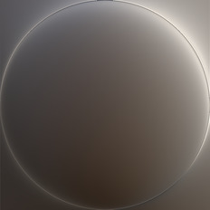

[[1024px](https://github.com/nidorx/matcaps/raw/master/1024/4F4742_4F4742_B7B1AA_847E79.png)]
[[512px](https://github.com/nidorx/matcaps/raw/master/512/4F4742_4F4742_B7B1AA_847E79-512px.png)]
[[256px](https://github.com/nidorx/matcaps/raw/master/256/4F4742_4F4742_B7B1AA_847E79-256px.png)]
[[128px](https://github.com/nidorx/matcaps/raw/master/128/4F4742_4F4742_B7B1AA_847E79-128px.png)]
[[64px](https://github.com/nidorx/matcaps/raw/master/64/4F4742_4F4742_B7B1AA_847E79-64px.png)]
[[ZBrush Material (ZMT)](https://github.com/nidorx/matcaps/raw/master/zmt/4F4742_4F4742_B7B1AA_847E79.zmt)]

---
### 4F4C45_4F4C45_A7AEAA_7A8575

[[1024px](https://github.com/nidorx/matcaps/raw/master/1024/4F4C45_4F4C45_A7AEAA_7A8575.png)]
[[512px](https://github.com/nidorx/matcaps/raw/master/512/4F4C45_4F4C45_A7AEAA_7A8575-512px.png)]
[[256px](https://github.com/nidorx/matcaps/raw/master/256/4F4C45_4F4C45_A7AEAA_7A8575-256px.png)]
[[128px](https://github.com/nidorx/matcaps/raw/master/128/4F4C45_4F4C45_A7AEAA_7A8575-128px.png)]
[[64px](https://github.com/nidorx/matcaps/raw/master/64/4F4C45_4F4C45_A7AEAA_7A8575-64px.png)]
[[ZBrush Material (ZMT)](https://github.com/nidorx/matcaps/raw/master/zmt/4F4C45_4F4C45_A7AEAA_7A8575.zmt)]

---