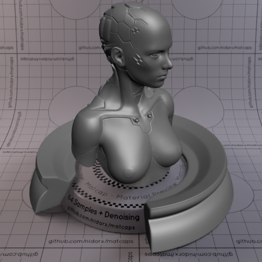
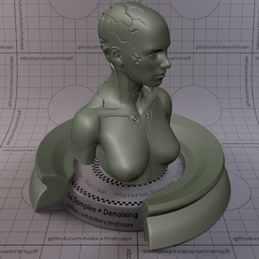
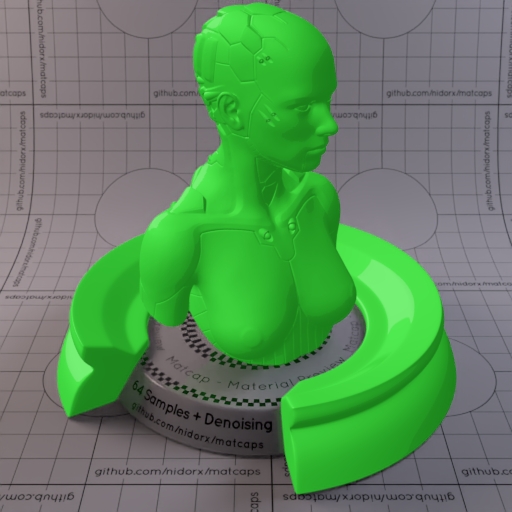
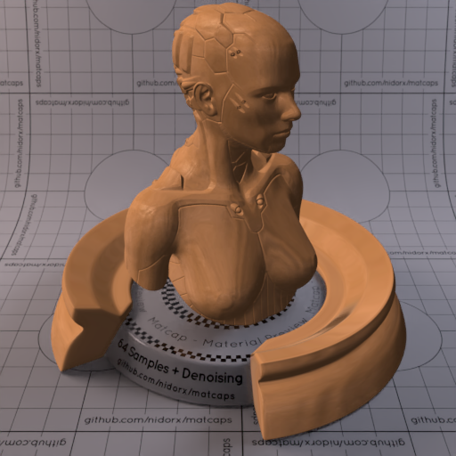
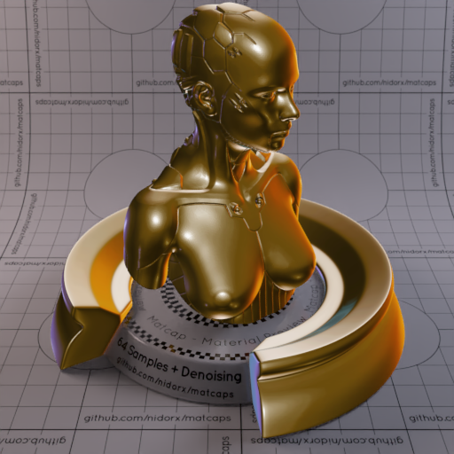
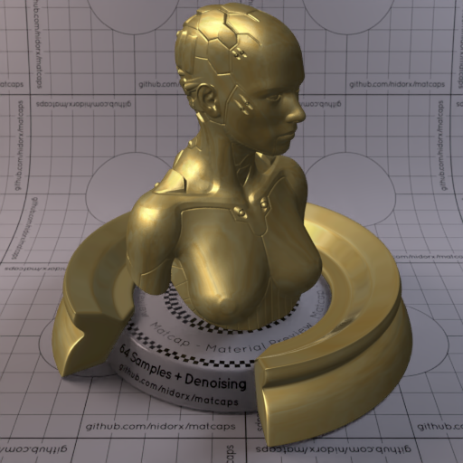
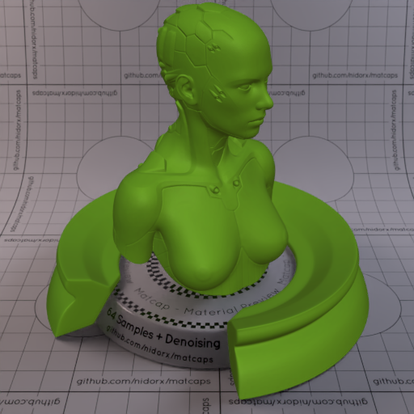
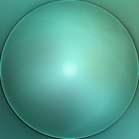
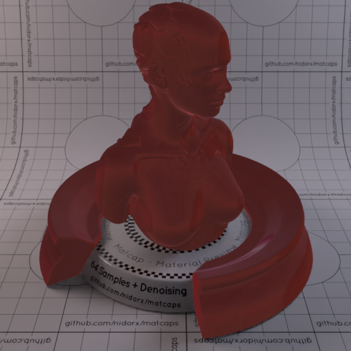
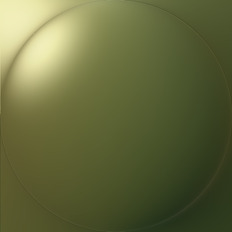

A huge library of MatCap textures in PNG and ZMT.

## Navigation
* [Home](/)
* [Page 1](PAGE-1.md)
* [Page 2](PAGE-2.md)
* [Page 3](PAGE-3.md)
* [Page 4](PAGE-4.md)
* [Page 5](PAGE-5.md)
* [Page 6](PAGE-6.md)
* [Page 7](PAGE-7.md)
* [Page 8](PAGE-8.md)
* Page 9
* [Page 10](PAGE-10.md)
* [Page 11](PAGE-11.md)
* [Page 12](PAGE-12.md)
* [Page 13](PAGE-13.md)
* [Page 14](PAGE-14.md)
* [Page 15](PAGE-15.md)
* [Page 16](PAGE-16.md)
* [Page 17](PAGE-17.md)
* [Page 18](PAGE-18.md)
* [Page 19](PAGE-19.md)
* [Page 20](PAGE-20.md)
* [Page 21](PAGE-21.md)
* [Page 22](PAGE-22.md)
* [Page 23](PAGE-23.md)
* [Page 24](PAGE-24.md)
* [Page 25](PAGE-25.md)
* [Page 26](PAGE-26.md)
* [Page 27](PAGE-27.md)
* [Page 28](PAGE-28.md)
* [Page 29](PAGE-29.md)
* [Page 30](PAGE-30.md)
* [Page 31](PAGE-31.md)
* [Page 32](PAGE-32.md)
* [Page 33](PAGE-33.md)
## Page 9 Matcaps
### 4F4F4F_4F4F4F_9C9C9C_121212

[[1024px](https://github.com/nidorx/matcaps/raw/master/1024/4F4F4F_4F4F4F_9C9C9C_121212.png)]
[[512px](https://github.com/nidorx/matcaps/raw/master/512/4F4F4F_4F4F4F_9C9C9C_121212-512px.png)]
[[256px](https://github.com/nidorx/matcaps/raw/master/256/4F4F4F_4F4F4F_9C9C9C_121212-256px.png)]
[[128px](https://github.com/nidorx/matcaps/raw/master/128/4F4F4F_4F4F4F_9C9C9C_121212-128px.png)]
[[64px](https://github.com/nidorx/matcaps/raw/master/64/4F4F4F_4F4F4F_9C9C9C_121212-64px.png)]
[[ZBrush Material (ZMT)](https://github.com/nidorx/matcaps/raw/master/zmt/4F4F4F_4F4F4F_9C9C9C_121212.zmt)]

---
### 4F4F4F_4F4F4F_A1A1A1_8C8C8C

[[1024px](https://github.com/nidorx/matcaps/raw/master/1024/4F4F4F_4F4F4F_A1A1A1_8C8C8C.png)]
[[512px](https://github.com/nidorx/matcaps/raw/master/512/4F4F4F_4F4F4F_A1A1A1_8C8C8C-512px.png)]
[[256px](https://github.com/nidorx/matcaps/raw/master/256/4F4F4F_4F4F4F_A1A1A1_8C8C8C-256px.png)]
[[128px](https://github.com/nidorx/matcaps/raw/master/128/4F4F4F_4F4F4F_A1A1A1_8C8C8C-128px.png)]
[[64px](https://github.com/nidorx/matcaps/raw/master/64/4F4F4F_4F4F4F_A1A1A1_8C8C8C-64px.png)]
[~~ZBrush Material (ZMT)~~]

---
### 4F5246_4F5246_8C8D84_7B7C74

[[1024px](https://github.com/nidorx/matcaps/raw/master/1024/4F5246_4F5246_8C8D84_7B7C74.png)]
[[512px](https://github.com/nidorx/matcaps/raw/master/512/4F5246_4F5246_8C8D84_7B7C74-512px.png)]
[[256px](https://github.com/nidorx/matcaps/raw/master/256/4F5246_4F5246_8C8D84_7B7C74-256px.png)]
[[128px](https://github.com/nidorx/matcaps/raw/master/128/4F5246_4F5246_8C8D84_7B7C74-128px.png)]
[[64px](https://github.com/nidorx/matcaps/raw/master/64/4F5246_4F5246_8C8D84_7B7C74-64px.png)]
[[ZBrush Material (ZMT)](https://github.com/nidorx/matcaps/raw/master/zmt/4F5246_4F5246_8C8D84_7B7C74.zmt)]

---
### 4FE34F_4FE34F_2BB02B_3CD03C

[[1024px](https://github.com/nidorx/matcaps/raw/master/1024/4FE34F_4FE34F_2BB02B_3CD03C.png)]
[[512px](https://github.com/nidorx/matcaps/raw/master/512/4FE34F_4FE34F_2BB02B_3CD03C-512px.png)]
[[256px](https://github.com/nidorx/matcaps/raw/master/256/4FE34F_4FE34F_2BB02B_3CD03C-256px.png)]
[[128px](https://github.com/nidorx/matcaps/raw/master/128/4FE34F_4FE34F_2BB02B_3CD03C-128px.png)]
[[64px](https://github.com/nidorx/matcaps/raw/master/64/4FE34F_4FE34F_2BB02B_3CD03C-64px.png)]
[~~ZBrush Material (ZMT)~~]

---
### 50332C_50332C_D98D79_955F52

[[1024px](https://github.com/nidorx/matcaps/raw/master/1024/50332C_50332C_D98D79_955F52.png)]
[[512px](https://github.com/nidorx/matcaps/raw/master/512/50332C_50332C_D98D79_955F52-512px.png)]
[[256px](https://github.com/nidorx/matcaps/raw/master/256/50332C_50332C_D98D79_955F52-256px.png)]
[[128px](https://github.com/nidorx/matcaps/raw/master/128/50332C_50332C_D98D79_955F52-128px.png)]
[[64px](https://github.com/nidorx/matcaps/raw/master/64/50332C_50332C_D98D79_955F52-64px.png)]
[[ZBrush Material (ZMT)](https://github.com/nidorx/matcaps/raw/master/zmt/50332C_50332C_D98D79_955F52.zmt)]

---
### 503522_503522_C38254_9F6B45

[[1024px](https://github.com/nidorx/matcaps/raw/master/1024/503522_503522_C38254_9F6B45.png)]
[[512px](https://github.com/nidorx/matcaps/raw/master/512/503522_503522_C38254_9F6B45-512px.png)]
[[256px](https://github.com/nidorx/matcaps/raw/master/256/503522_503522_C38254_9F6B45-256px.png)]
[[128px](https://github.com/nidorx/matcaps/raw/master/128/503522_503522_C38254_9F6B45-128px.png)]
[[64px](https://github.com/nidorx/matcaps/raw/master/64/503522_503522_C38254_9F6B45-64px.png)]
[[ZBrush Material (ZMT)](https://github.com/nidorx/matcaps/raw/master/zmt/503522_503522_C38254_9F6B45.zmt)]

---
### 504D3C_504D3C_979C9D_81837D

[[1024px](https://github.com/nidorx/matcaps/raw/master/1024/504D3C_504D3C_979C9D_81837D.png)]
[[512px](https://github.com/nidorx/matcaps/raw/master/512/504D3C_504D3C_979C9D_81837D-512px.png)]
[[256px](https://github.com/nidorx/matcaps/raw/master/256/504D3C_504D3C_979C9D_81837D-256px.png)]
[[128px](https://github.com/nidorx/matcaps/raw/master/128/504D3C_504D3C_979C9D_81837D-128px.png)]
[[64px](https://github.com/nidorx/matcaps/raw/master/64/504D3C_504D3C_979C9D_81837D-64px.png)]
[[ZBrush Material (ZMT)](https://github.com/nidorx/matcaps/raw/master/zmt/504D3C_504D3C_979C9D_81837D.zmt)]

---
### 513A11_513A11_CDBEB5_C8811C

[[1024px](https://github.com/nidorx/matcaps/raw/master/1024/513A11_513A11_CDBEB5_C8811C.png)]
[[512px](https://github.com/nidorx/matcaps/raw/master/512/513A11_513A11_CDBEB5_C8811C-512px.png)]
[[256px](https://github.com/nidorx/matcaps/raw/master/256/513A11_513A11_CDBEB5_C8811C-256px.png)]
[[128px](https://github.com/nidorx/matcaps/raw/master/128/513A11_513A11_CDBEB5_C8811C-128px.png)]
[[64px](https://github.com/nidorx/matcaps/raw/master/64/513A11_513A11_CDBEB5_C8811C-64px.png)]
[[ZBrush Material (ZMT)](https://github.com/nidorx/matcaps/raw/master/zmt/513A11_513A11_CDBEB5_C8811C.zmt)]

---
### 51462B_51462B_DFCA7E_948050

[[1024px](https://github.com/nidorx/matcaps/raw/master/1024/51462B_51462B_DFCA7E_948050.png)]
[[512px](https://github.com/nidorx/matcaps/raw/master/512/51462B_51462B_DFCA7E_948050-512px.png)]
[[256px](https://github.com/nidorx/matcaps/raw/master/256/51462B_51462B_DFCA7E_948050-256px.png)]
[[128px](https://github.com/nidorx/matcaps/raw/master/128/51462B_51462B_DFCA7E_948050-128px.png)]
[[64px](https://github.com/nidorx/matcaps/raw/master/64/51462B_51462B_DFCA7E_948050-64px.png)]
[[ZBrush Material (ZMT)](https://github.com/nidorx/matcaps/raw/master/zmt/51462B_51462B_DFCA7E_948050.zmt)]

---
### 515151_515151_DCDCDC_B7B7B7

[[1024px](https://github.com/nidorx/matcaps/raw/master/1024/515151_515151_DCDCDC_B7B7B7.png)]
[[512px](https://github.com/nidorx/matcaps/raw/master/512/515151_515151_DCDCDC_B7B7B7-512px.png)]
[[256px](https://github.com/nidorx/matcaps/raw/master/256/515151_515151_DCDCDC_B7B7B7-256px.png)]
[[128px](https://github.com/nidorx/matcaps/raw/master/128/515151_515151_DCDCDC_B7B7B7-128px.png)]
[[64px](https://github.com/nidorx/matcaps/raw/master/64/515151_515151_DCDCDC_B7B7B7-64px.png)]
[[ZBrush Material (ZMT)](https://github.com/nidorx/matcaps/raw/master/zmt/515151_515151_DCDCDC_B7B7B7.zmt)]

---
### 515341_515341_9A9C86_16180D

[[1024px](https://github.com/nidorx/matcaps/raw/master/1024/515341_515341_9A9C86_16180D.png)]
[[512px](https://github.com/nidorx/matcaps/raw/master/512/515341_515341_9A9C86_16180D-512px.png)]
[[256px](https://github.com/nidorx/matcaps/raw/master/256/515341_515341_9A9C86_16180D-256px.png)]
[[128px](https://github.com/nidorx/matcaps/raw/master/128/515341_515341_9A9C86_16180D-128px.png)]
[[64px](https://github.com/nidorx/matcaps/raw/master/64/515341_515341_9A9C86_16180D-64px.png)]
[[ZBrush Material (ZMT)](https://github.com/nidorx/matcaps/raw/master/zmt/515341_515341_9A9C86_16180D.zmt)]

---
### 517919_517919_659623_34460C

[[1024px](https://github.com/nidorx/matcaps/raw/master/1024/517919_517919_659623_34460C.png)]
[[512px](https://github.com/nidorx/matcaps/raw/master/512/517919_517919_659623_34460C-512px.png)]
[[256px](https://github.com/nidorx/matcaps/raw/master/256/517919_517919_659623_34460C-256px.png)]
[[128px](https://github.com/nidorx/matcaps/raw/master/128/517919_517919_659623_34460C-128px.png)]
[[64px](https://github.com/nidorx/matcaps/raw/master/64/517919_517919_659623_34460C-64px.png)]
[[ZBrush Material (ZMT)](https://github.com/nidorx/matcaps/raw/master/zmt/517919_517919_659623_34460C.zmt)]

---
### 519C8D_519C8D_83DAC7_9DEDE0

[[1024px](https://github.com/nidorx/matcaps/raw/master/1024/519C8D_519C8D_83DAC7_9DEDE0.png)]
[[512px](https://github.com/nidorx/matcaps/raw/master/512/519C8D_519C8D_83DAC7_9DEDE0-512px.png)]
[[256px](https://github.com/nidorx/matcaps/raw/master/256/519C8D_519C8D_83DAC7_9DEDE0-256px.png)]
[[128px](https://github.com/nidorx/matcaps/raw/master/128/519C8D_519C8D_83DAC7_9DEDE0-128px.png)]
[[64px](https://github.com/nidorx/matcaps/raw/master/64/519C8D_519C8D_83DAC7_9DEDE0-64px.png)]
[[ZBrush Material (ZMT)](https://github.com/nidorx/matcaps/raw/master/zmt/519C8D_519C8D_83DAC7_9DEDE0.zmt)]

---
### 522221_522221_91343B_7F6F6B

[[1024px](https://github.com/nidorx/matcaps/raw/master/1024/522221_522221_91343B_7F6F6B.png)]
[[512px](https://github.com/nidorx/matcaps/raw/master/512/522221_522221_91343B_7F6F6B-512px.png)]
[[256px](https://github.com/nidorx/matcaps/raw/master/256/522221_522221_91343B_7F6F6B-256px.png)]
[[128px](https://github.com/nidorx/matcaps/raw/master/128/522221_522221_91343B_7F6F6B-128px.png)]
[[64px](https://github.com/nidorx/matcaps/raw/master/64/522221_522221_91343B_7F6F6B-64px.png)]
[[ZBrush Material (ZMT)](https://github.com/nidorx/matcaps/raw/master/zmt/522221_522221_91343B_7F6F6B.zmt)]

---
### 522A1A_522A1A_94543A_C3896F

[[1024px](https://github.com/nidorx/matcaps/raw/master/1024/522A1A_522A1A_94543A_C3896F.png)]
[[512px](https://github.com/nidorx/matcaps/raw/master/512/522A1A_522A1A_94543A_C3896F-512px.png)]
[[256px](https://github.com/nidorx/matcaps/raw/master/256/522A1A_522A1A_94543A_C3896F-256px.png)]
[[128px](https://github.com/nidorx/matcaps/raw/master/128/522A1A_522A1A_94543A_C3896F-128px.png)]
[[64px](https://github.com/nidorx/matcaps/raw/master/64/522A1A_522A1A_94543A_C3896F-64px.png)]
[[ZBrush Material (ZMT)](https://github.com/nidorx/matcaps/raw/master/zmt/522A1A_522A1A_94543A_C3896F.zmt)]

---
### 525050_525050_D4D3D3_959393

[[1024px](https://github.com/nidorx/matcaps/raw/master/1024/525050_525050_D4D3D3_959393.png)]
[[512px](https://github.com/nidorx/matcaps/raw/master/512/525050_525050_D4D3D3_959393-512px.png)]
[[256px](https://github.com/nidorx/matcaps/raw/master/256/525050_525050_D4D3D3_959393-256px.png)]
[[128px](https://github.com/nidorx/matcaps/raw/master/128/525050_525050_D4D3D3_959393-128px.png)]
[[64px](https://github.com/nidorx/matcaps/raw/master/64/525050_525050_D4D3D3_959393-64px.png)]
[~~ZBrush Material (ZMT)~~]

---
### 533B33_533B33_AF9998_866965

[[1024px](https://github.com/nidorx/matcaps/raw/master/1024/533B33_533B33_AF9998_866965.png)]
[[512px](https://github.com/nidorx/matcaps/raw/master/512/533B33_533B33_AF9998_866965-512px.png)]
[[256px](https://github.com/nidorx/matcaps/raw/master/256/533B33_533B33_AF9998_866965-256px.png)]
[[128px](https://github.com/nidorx/matcaps/raw/master/128/533B33_533B33_AF9998_866965-128px.png)]
[[64px](https://github.com/nidorx/matcaps/raw/master/64/533B33_533B33_AF9998_866965-64px.png)]
[[ZBrush Material (ZMT)](https://github.com/nidorx/matcaps/raw/master/zmt/533B33_533B33_AF9998_866965.zmt)]

---
### 535A2F_535A2F_CDCA91_91915B

[[1024px](https://github.com/nidorx/matcaps/raw/master/1024/535A2F_535A2F_CDCA91_91915B.png)]
[[512px](https://github.com/nidorx/matcaps/raw/master/512/535A2F_535A2F_CDCA91_91915B-512px.png)]
[[256px](https://github.com/nidorx/matcaps/raw/master/256/535A2F_535A2F_CDCA91_91915B-256px.png)]
[[128px](https://github.com/nidorx/matcaps/raw/master/128/535A2F_535A2F_CDCA91_91915B-128px.png)]
[[64px](https://github.com/nidorx/matcaps/raw/master/64/535A2F_535A2F_CDCA91_91915B-64px.png)]
[[ZBrush Material (ZMT)](https://github.com/nidorx/matcaps/raw/master/zmt/535A2F_535A2F_CDCA91_91915B.zmt)]

---
### 535F6B_535F6B_A6BDC8_8FA3B4

[[1024px](https://github.com/nidorx/matcaps/raw/master/1024/535F6B_535F6B_A6BDC8_8FA3B4.png)]
[[512px](https://github.com/nidorx/matcaps/raw/master/512/535F6B_535F6B_A6BDC8_8FA3B4-512px.png)]
[[256px](https://github.com/nidorx/matcaps/raw/master/256/535F6B_535F6B_A6BDC8_8FA3B4-256px.png)]
[[128px](https://github.com/nidorx/matcaps/raw/master/128/535F6B_535F6B_A6BDC8_8FA3B4-128px.png)]
[[64px](https://github.com/nidorx/matcaps/raw/master/64/535F6B_535F6B_A6BDC8_8FA3B4-64px.png)]
[~~ZBrush Material (ZMT)~~]

---
### 537387_537387_75BBB9_152E5B

[[1024px](https://github.com/nidorx/matcaps/raw/master/1024/537387_537387_75BBB9_152E5B.png)]
[[512px](https://github.com/nidorx/matcaps/raw/master/512/537387_537387_75BBB9_152E5B-512px.png)]
[[256px](https://github.com/nidorx/matcaps/raw/master/256/537387_537387_75BBB9_152E5B-256px.png)]
[[128px](https://github.com/nidorx/matcaps/raw/master/128/537387_537387_75BBB9_152E5B-128px.png)]
[[64px](https://github.com/nidorx/matcaps/raw/master/64/537387_537387_75BBB9_152E5B-64px.png)]
[[ZBrush Material (ZMT)](https://github.com/nidorx/matcaps/raw/master/zmt/537387_537387_75BBB9_152E5B.zmt)]

---