A huge library of MatCap textures in PNG and ZMT.

## Navigation
* [Home](/)
* [Page 1](PAGE-1.md)
* [Page 2](PAGE-2.md)
* [Page 3](PAGE-3.md)
* [Page 4](PAGE-4.md)
* [Page 5](PAGE-5.md)
* [Page 6](PAGE-6.md)
* [Page 7](PAGE-7.md)
* [Page 8](PAGE-8.md)
* Page 9
* [Page 10](PAGE-10.md)
* [Page 11](PAGE-11.md)
* [Page 12](PAGE-12.md)
* [Page 13](PAGE-13.md)
* [Page 14](PAGE-14.md)
* [Page 15](PAGE-15.md)
* [Page 16](PAGE-16.md)
* [Page 17](PAGE-17.md)
* [Page 18](PAGE-18.md)
* [Page 19](PAGE-19.md)
* [Page 20](PAGE-20.md)
* [Page 21](PAGE-21.md)
* [Page 22](PAGE-22.md)
* [Page 23](PAGE-23.md)
* [Page 24](PAGE-24.md)
* [Page 25](PAGE-25.md)
* [Page 26](PAGE-26.md)
* [Page 27](PAGE-27.md)
* [Page 28](PAGE-28.md)
* [Page 29](PAGE-29.md)
* [Page 30](PAGE-30.md)
* [Page 31](PAGE-31.md)
* [Page 32](PAGE-32.md)
* [Page 33](PAGE-33.md)
## Page 9 Matcaps
### 4F4F4F_9C9C9C_121212_7C7C7C
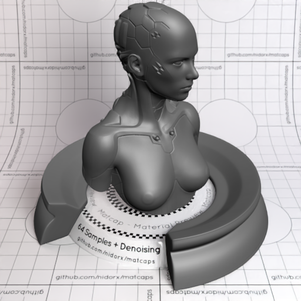

[[1024px](https://github.com/nidorx/matcaps/raw/master/1024/4F4F4F_9C9C9C_121212_7C7C7C.png)]
[[512px](https://github.com/nidorx/matcaps/raw/master/512/4F4F4F_9C9C9C_121212_7C7C7C-512px.png)]
[[256px](https://github.com/nidorx/matcaps/raw/master/256/4F4F4F_9C9C9C_121212_7C7C7C-256px.png)]
[[128px](https://github.com/nidorx/matcaps/raw/master/128/4F4F4F_9C9C9C_121212_7C7C7C-128px.png)]
[[64px](https://github.com/nidorx/matcaps/raw/master/64/4F4F4F_9C9C9C_121212_7C7C7C-64px.png)]
[[ZBrush Material (ZMT)](https://github.com/nidorx/matcaps/raw/master/zmt/4F4F4F_9C9C9C_121212_7C7C7C.zmt)]

---
### 4F4F4F_A1A1A1_8C8C8C_848484
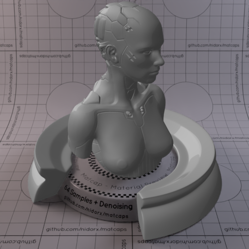
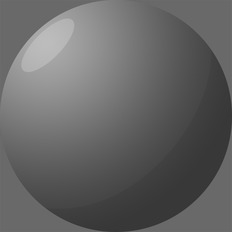

[[1024px](https://github.com/nidorx/matcaps/raw/master/1024/4F4F4F_A1A1A1_8C8C8C_848484.png)]
[[512px](https://github.com/nidorx/matcaps/raw/master/512/4F4F4F_A1A1A1_8C8C8C_848484-512px.png)]
[[256px](https://github.com/nidorx/matcaps/raw/master/256/4F4F4F_A1A1A1_8C8C8C_848484-256px.png)]
[[128px](https://github.com/nidorx/matcaps/raw/master/128/4F4F4F_A1A1A1_8C8C8C_848484-128px.png)]
[[64px](https://github.com/nidorx/matcaps/raw/master/64/4F4F4F_A1A1A1_8C8C8C_848484-64px.png)]
[~~ZBrush Material (ZMT)~~]

---
### 4F5246_8C8D84_7B7C74_131611
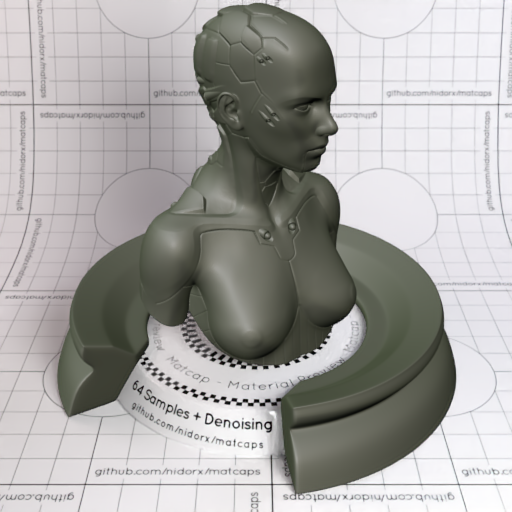
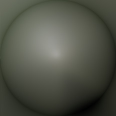

[[1024px](https://github.com/nidorx/matcaps/raw/master/1024/4F5246_8C8D84_7B7C74_131611.png)]
[[512px](https://github.com/nidorx/matcaps/raw/master/512/4F5246_8C8D84_7B7C74_131611-512px.png)]
[[256px](https://github.com/nidorx/matcaps/raw/master/256/4F5246_8C8D84_7B7C74_131611-256px.png)]
[[128px](https://github.com/nidorx/matcaps/raw/master/128/4F5246_8C8D84_7B7C74_131611-128px.png)]
[[64px](https://github.com/nidorx/matcaps/raw/master/64/4F5246_8C8D84_7B7C74_131611-64px.png)]
[[ZBrush Material (ZMT)](https://github.com/nidorx/matcaps/raw/master/zmt/4F5246_8C8D84_7B7C74_131611.zmt)]

---
### 4FE34F_2BB02B_3CD03C_1C861C
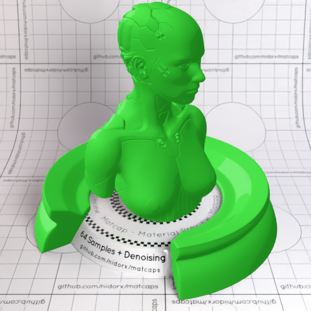

[[1024px](https://github.com/nidorx/matcaps/raw/master/1024/4FE34F_2BB02B_3CD03C_1C861C.png)]
[[512px](https://github.com/nidorx/matcaps/raw/master/512/4FE34F_2BB02B_3CD03C_1C861C-512px.png)]
[[256px](https://github.com/nidorx/matcaps/raw/master/256/4FE34F_2BB02B_3CD03C_1C861C-256px.png)]
[[128px](https://github.com/nidorx/matcaps/raw/master/128/4FE34F_2BB02B_3CD03C_1C861C-128px.png)]
[[64px](https://github.com/nidorx/matcaps/raw/master/64/4FE34F_2BB02B_3CD03C_1C861C-64px.png)]
[~~ZBrush Material (ZMT)~~]

---
### 50332C_D98D79_955F52_AA7C6C
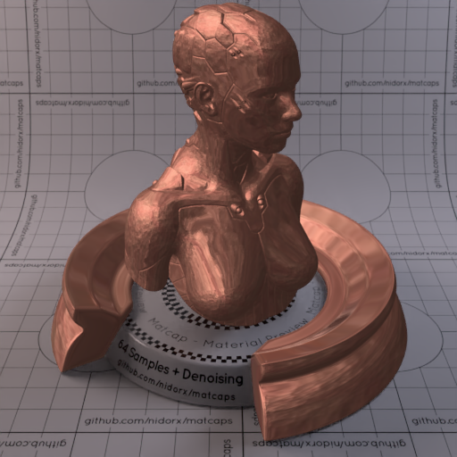

[[1024px](https://github.com/nidorx/matcaps/raw/master/1024/50332C_D98D79_955F52_AA7C6C.png)]
[[512px](https://github.com/nidorx/matcaps/raw/master/512/50332C_D98D79_955F52_AA7C6C-512px.png)]
[[256px](https://github.com/nidorx/matcaps/raw/master/256/50332C_D98D79_955F52_AA7C6C-256px.png)]
[[128px](https://github.com/nidorx/matcaps/raw/master/128/50332C_D98D79_955F52_AA7C6C-128px.png)]
[[64px](https://github.com/nidorx/matcaps/raw/master/64/50332C_D98D79_955F52_AA7C6C-64px.png)]
[[ZBrush Material (ZMT)](https://github.com/nidorx/matcaps/raw/master/zmt/50332C_D98D79_955F52_AA7C6C.zmt)]

---
### 503522_C38254_9F6B45_845838
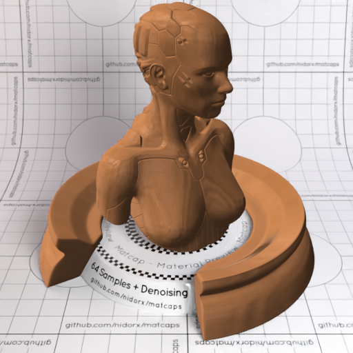
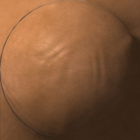

[[1024px](https://github.com/nidorx/matcaps/raw/master/1024/503522_C38254_9F6B45_845838.png)]
[[512px](https://github.com/nidorx/matcaps/raw/master/512/503522_C38254_9F6B45_845838-512px.png)]
[[256px](https://github.com/nidorx/matcaps/raw/master/256/503522_C38254_9F6B45_845838-256px.png)]
[[128px](https://github.com/nidorx/matcaps/raw/master/128/503522_C38254_9F6B45_845838-128px.png)]
[[64px](https://github.com/nidorx/matcaps/raw/master/64/503522_C38254_9F6B45_845838-64px.png)]
[[ZBrush Material (ZMT)](https://github.com/nidorx/matcaps/raw/master/zmt/503522_C38254_9F6B45_845838.zmt)]

---
### 504D3C_979C9D_81837D_9C998A
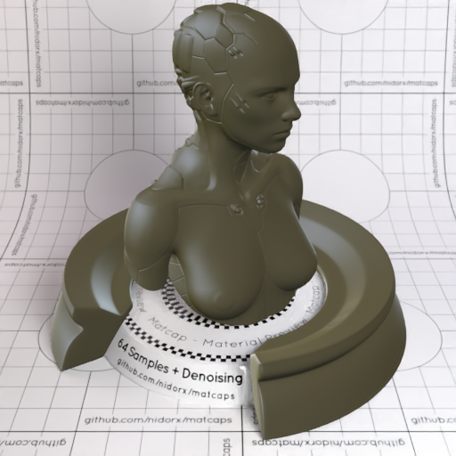
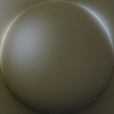

[[1024px](https://github.com/nidorx/matcaps/raw/master/1024/504D3C_979C9D_81837D_9C998A.png)]
[[512px](https://github.com/nidorx/matcaps/raw/master/512/504D3C_979C9D_81837D_9C998A-512px.png)]
[[256px](https://github.com/nidorx/matcaps/raw/master/256/504D3C_979C9D_81837D_9C998A-256px.png)]
[[128px](https://github.com/nidorx/matcaps/raw/master/128/504D3C_979C9D_81837D_9C998A-128px.png)]
[[64px](https://github.com/nidorx/matcaps/raw/master/64/504D3C_979C9D_81837D_9C998A-64px.png)]
[[ZBrush Material (ZMT)](https://github.com/nidorx/matcaps/raw/master/zmt/504D3C_979C9D_81837D_9C998A.zmt)]

---
### 513A11_CDBEB5_C8811C_9A733F
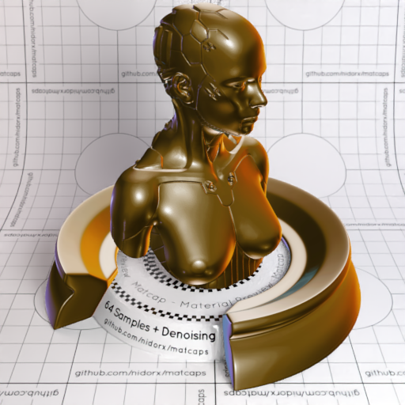
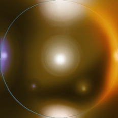

[[1024px](https://github.com/nidorx/matcaps/raw/master/1024/513A11_CDBEB5_C8811C_9A733F.png)]
[[512px](https://github.com/nidorx/matcaps/raw/master/512/513A11_CDBEB5_C8811C_9A733F-512px.png)]
[[256px](https://github.com/nidorx/matcaps/raw/master/256/513A11_CDBEB5_C8811C_9A733F-256px.png)]
[[128px](https://github.com/nidorx/matcaps/raw/master/128/513A11_CDBEB5_C8811C_9A733F-128px.png)]
[[64px](https://github.com/nidorx/matcaps/raw/master/64/513A11_CDBEB5_C8811C_9A733F-64px.png)]
[[ZBrush Material (ZMT)](https://github.com/nidorx/matcaps/raw/master/zmt/513A11_CDBEB5_C8811C_9A733F.zmt)]

---
### 51462B_DFCA7E_948050_A49874
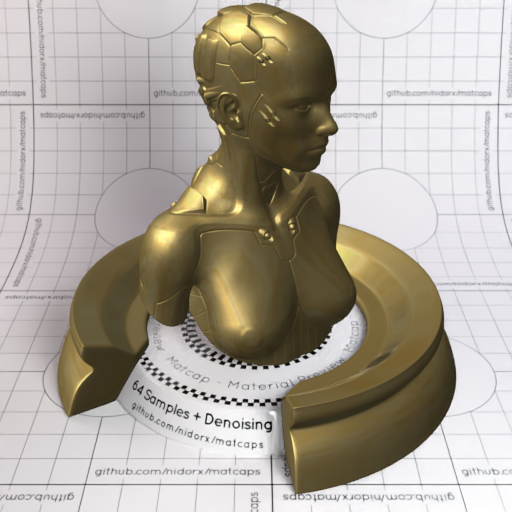
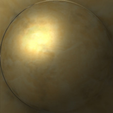

[[1024px](https://github.com/nidorx/matcaps/raw/master/1024/51462B_DFCA7E_948050_A49874.png)]
[[512px](https://github.com/nidorx/matcaps/raw/master/512/51462B_DFCA7E_948050_A49874-512px.png)]
[[256px](https://github.com/nidorx/matcaps/raw/master/256/51462B_DFCA7E_948050_A49874-256px.png)]
[[128px](https://github.com/nidorx/matcaps/raw/master/128/51462B_DFCA7E_948050_A49874-128px.png)]
[[64px](https://github.com/nidorx/matcaps/raw/master/64/51462B_DFCA7E_948050_A49874-64px.png)]
[[ZBrush Material (ZMT)](https://github.com/nidorx/matcaps/raw/master/zmt/51462B_DFCA7E_948050_A49874.zmt)]

---
### 515151_DCDCDC_B7B7B7_9B9B9B
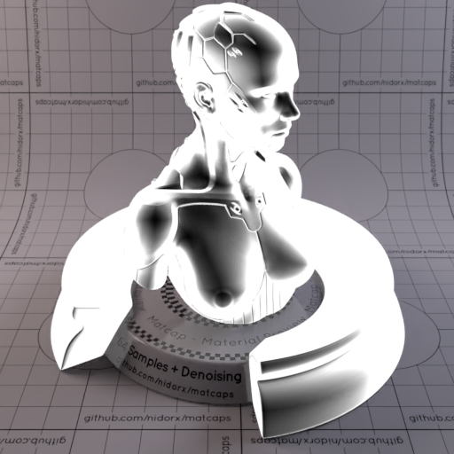

[[1024px](https://github.com/nidorx/matcaps/raw/master/1024/515151_DCDCDC_B7B7B7_9B9B9B.png)]
[[512px](https://github.com/nidorx/matcaps/raw/master/512/515151_DCDCDC_B7B7B7_9B9B9B-512px.png)]
[[256px](https://github.com/nidorx/matcaps/raw/master/256/515151_DCDCDC_B7B7B7_9B9B9B-256px.png)]
[[128px](https://github.com/nidorx/matcaps/raw/master/128/515151_DCDCDC_B7B7B7_9B9B9B-128px.png)]
[[64px](https://github.com/nidorx/matcaps/raw/master/64/515151_DCDCDC_B7B7B7_9B9B9B-64px.png)]
[[ZBrush Material (ZMT)](https://github.com/nidorx/matcaps/raw/master/zmt/515151_DCDCDC_B7B7B7_9B9B9B.zmt)]

---
### 515341_9A9C86_16180D_838474
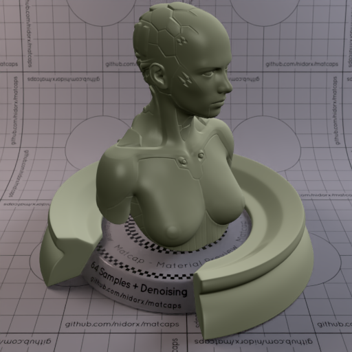

[[1024px](https://github.com/nidorx/matcaps/raw/master/1024/515341_9A9C86_16180D_838474.png)]
[[512px](https://github.com/nidorx/matcaps/raw/master/512/515341_9A9C86_16180D_838474-512px.png)]
[[256px](https://github.com/nidorx/matcaps/raw/master/256/515341_9A9C86_16180D_838474-256px.png)]
[[128px](https://github.com/nidorx/matcaps/raw/master/128/515341_9A9C86_16180D_838474-128px.png)]
[[64px](https://github.com/nidorx/matcaps/raw/master/64/515341_9A9C86_16180D_838474-64px.png)]
[[ZBrush Material (ZMT)](https://github.com/nidorx/matcaps/raw/master/zmt/515341_9A9C86_16180D_838474.zmt)]

---
### 517919_659623_34460C_3E5813
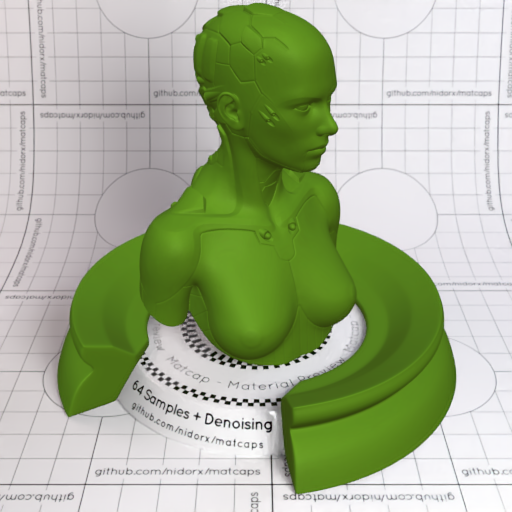
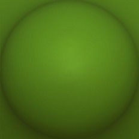

[[1024px](https://github.com/nidorx/matcaps/raw/master/1024/517919_659623_34460C_3E5813.png)]
[[512px](https://github.com/nidorx/matcaps/raw/master/512/517919_659623_34460C_3E5813-512px.png)]
[[256px](https://github.com/nidorx/matcaps/raw/master/256/517919_659623_34460C_3E5813-256px.png)]
[[128px](https://github.com/nidorx/matcaps/raw/master/128/517919_659623_34460C_3E5813-128px.png)]
[[64px](https://github.com/nidorx/matcaps/raw/master/64/517919_659623_34460C_3E5813-64px.png)]
[[ZBrush Material (ZMT)](https://github.com/nidorx/matcaps/raw/master/zmt/517919_659623_34460C_3E5813.zmt)]

---
### 519C8D_83DAC7_9DEDE0_2B5B4C
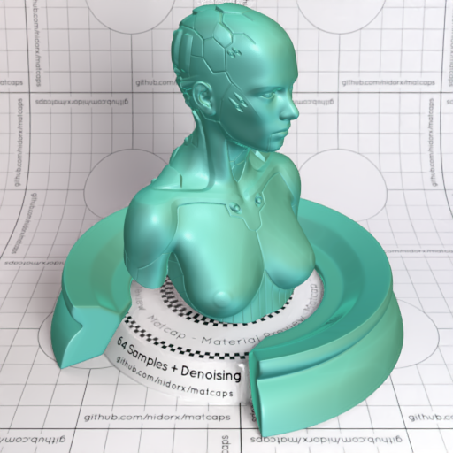

[[1024px](https://github.com/nidorx/matcaps/raw/master/1024/519C8D_83DAC7_9DEDE0_2B5B4C.png)]
[[512px](https://github.com/nidorx/matcaps/raw/master/512/519C8D_83DAC7_9DEDE0_2B5B4C-512px.png)]
[[256px](https://github.com/nidorx/matcaps/raw/master/256/519C8D_83DAC7_9DEDE0_2B5B4C-256px.png)]
[[128px](https://github.com/nidorx/matcaps/raw/master/128/519C8D_83DAC7_9DEDE0_2B5B4C-128px.png)]
[[64px](https://github.com/nidorx/matcaps/raw/master/64/519C8D_83DAC7_9DEDE0_2B5B4C-64px.png)]
[[ZBrush Material (ZMT)](https://github.com/nidorx/matcaps/raw/master/zmt/519C8D_83DAC7_9DEDE0_2B5B4C.zmt)]

---
### 522221_91343B_7F6F6B_744960
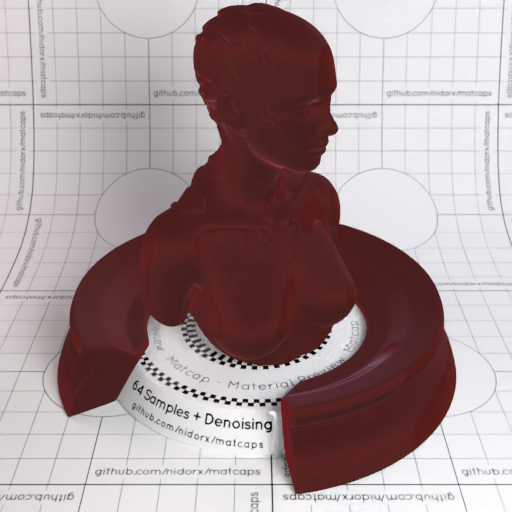

[[1024px](https://github.com/nidorx/matcaps/raw/master/1024/522221_91343B_7F6F6B_744960.png)]
[[512px](https://github.com/nidorx/matcaps/raw/master/512/522221_91343B_7F6F6B_744960-512px.png)]
[[256px](https://github.com/nidorx/matcaps/raw/master/256/522221_91343B_7F6F6B_744960-256px.png)]
[[128px](https://github.com/nidorx/matcaps/raw/master/128/522221_91343B_7F6F6B_744960-128px.png)]
[[64px](https://github.com/nidorx/matcaps/raw/master/64/522221_91343B_7F6F6B_744960-64px.png)]
[[ZBrush Material (ZMT)](https://github.com/nidorx/matcaps/raw/master/zmt/522221_91343B_7F6F6B_744960.zmt)]

---
### 522A1A_94543A_C3896F_AB7D66
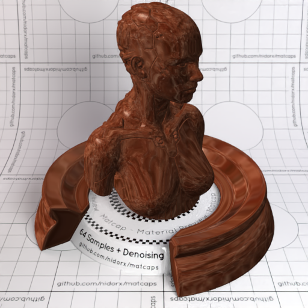
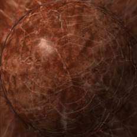

[[1024px](https://github.com/nidorx/matcaps/raw/master/1024/522A1A_94543A_C3896F_AB7D66.png)]
[[512px](https://github.com/nidorx/matcaps/raw/master/512/522A1A_94543A_C3896F_AB7D66-512px.png)]
[[256px](https://github.com/nidorx/matcaps/raw/master/256/522A1A_94543A_C3896F_AB7D66-256px.png)]
[[128px](https://github.com/nidorx/matcaps/raw/master/128/522A1A_94543A_C3896F_AB7D66-128px.png)]
[[64px](https://github.com/nidorx/matcaps/raw/master/64/522A1A_94543A_C3896F_AB7D66-64px.png)]
[[ZBrush Material (ZMT)](https://github.com/nidorx/matcaps/raw/master/zmt/522A1A_94543A_C3896F_AB7D66.zmt)]

---
### 525050_D4D3D3_959393_ACACAC
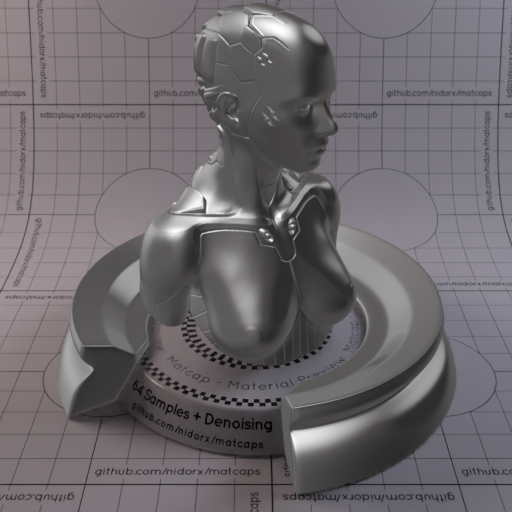
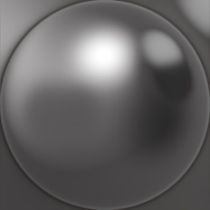

[[1024px](https://github.com/nidorx/matcaps/raw/master/1024/525050_D4D3D3_959393_ACACAC.png)]
[[512px](https://github.com/nidorx/matcaps/raw/master/512/525050_D4D3D3_959393_ACACAC-512px.png)]
[[256px](https://github.com/nidorx/matcaps/raw/master/256/525050_D4D3D3_959393_ACACAC-256px.png)]
[[128px](https://github.com/nidorx/matcaps/raw/master/128/525050_D4D3D3_959393_ACACAC-128px.png)]
[[64px](https://github.com/nidorx/matcaps/raw/master/64/525050_D4D3D3_959393_ACACAC-64px.png)]
[~~ZBrush Material (ZMT)~~]

---
### 533B33_AF9998_866965_9C7E7B
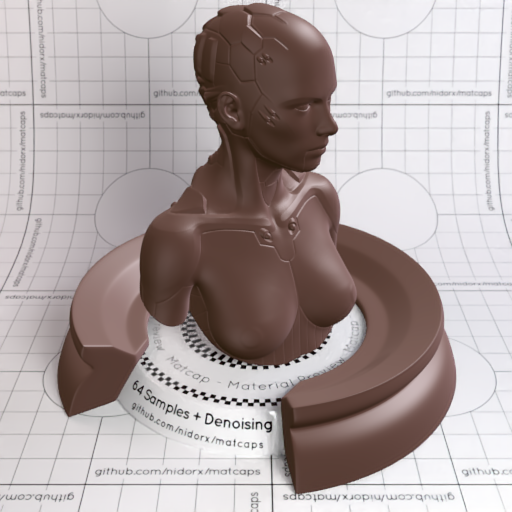
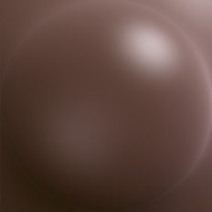

[[1024px](https://github.com/nidorx/matcaps/raw/master/1024/533B33_AF9998_866965_9C7E7B.png)]
[[512px](https://github.com/nidorx/matcaps/raw/master/512/533B33_AF9998_866965_9C7E7B-512px.png)]
[[256px](https://github.com/nidorx/matcaps/raw/master/256/533B33_AF9998_866965_9C7E7B-256px.png)]
[[128px](https://github.com/nidorx/matcaps/raw/master/128/533B33_AF9998_866965_9C7E7B-128px.png)]
[[64px](https://github.com/nidorx/matcaps/raw/master/64/533B33_AF9998_866965_9C7E7B-64px.png)]
[[ZBrush Material (ZMT)](https://github.com/nidorx/matcaps/raw/master/zmt/533B33_AF9998_866965_9C7E7B.zmt)]

---
### 535A2F_CDCA91_91915B_A4AC6F
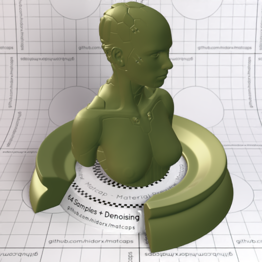

[[1024px](https://github.com/nidorx/matcaps/raw/master/1024/535A2F_CDCA91_91915B_A4AC6F.png)]
[[512px](https://github.com/nidorx/matcaps/raw/master/512/535A2F_CDCA91_91915B_A4AC6F-512px.png)]
[[256px](https://github.com/nidorx/matcaps/raw/master/256/535A2F_CDCA91_91915B_A4AC6F-256px.png)]
[[128px](https://github.com/nidorx/matcaps/raw/master/128/535A2F_CDCA91_91915B_A4AC6F-128px.png)]
[[64px](https://github.com/nidorx/matcaps/raw/master/64/535A2F_CDCA91_91915B_A4AC6F-64px.png)]
[[ZBrush Material (ZMT)](https://github.com/nidorx/matcaps/raw/master/zmt/535A2F_CDCA91_91915B_A4AC6F.zmt)]

---
### 535F6B_A6BDC8_8FA3B4_7F91A2
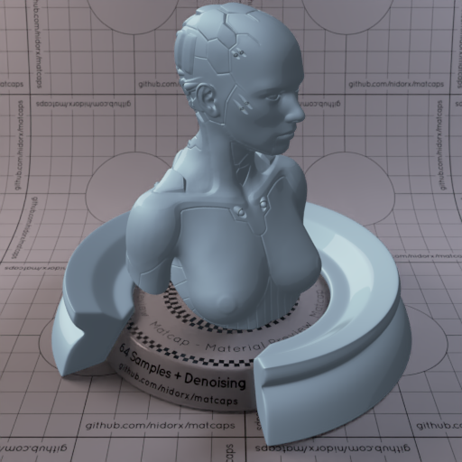

[[1024px](https://github.com/nidorx/matcaps/raw/master/1024/535F6B_A6BDC8_8FA3B4_7F91A2.png)]
[[512px](https://github.com/nidorx/matcaps/raw/master/512/535F6B_A6BDC8_8FA3B4_7F91A2-512px.png)]
[[256px](https://github.com/nidorx/matcaps/raw/master/256/535F6B_A6BDC8_8FA3B4_7F91A2-256px.png)]
[[128px](https://github.com/nidorx/matcaps/raw/master/128/535F6B_A6BDC8_8FA3B4_7F91A2-128px.png)]
[[64px](https://github.com/nidorx/matcaps/raw/master/64/535F6B_A6BDC8_8FA3B4_7F91A2-64px.png)]
[~~ZBrush Material (ZMT)~~]

---
### 537387_75BBB9_152E5B_0E85E8
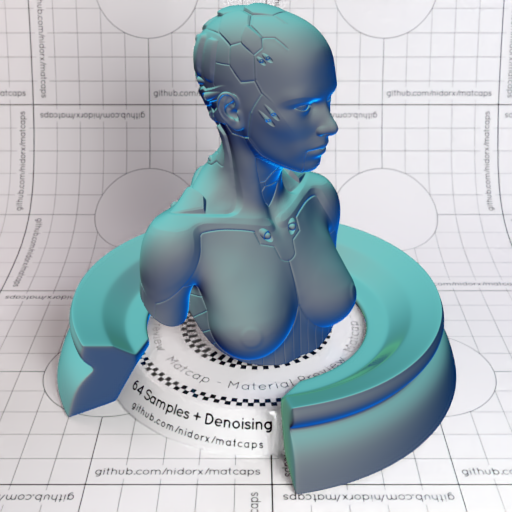

[[1024px](https://github.com/nidorx/matcaps/raw/master/1024/537387_75BBB9_152E5B_0E85E8.png)]
[[512px](https://github.com/nidorx/matcaps/raw/master/512/537387_75BBB9_152E5B_0E85E8-512px.png)]
[[256px](https://github.com/nidorx/matcaps/raw/master/256/537387_75BBB9_152E5B_0E85E8-256px.png)]
[[128px](https://github.com/nidorx/matcaps/raw/master/128/537387_75BBB9_152E5B_0E85E8-128px.png)]
[[64px](https://github.com/nidorx/matcaps/raw/master/64/537387_75BBB9_152E5B_0E85E8-64px.png)]
[[ZBrush Material (ZMT)](https://github.com/nidorx/matcaps/raw/master/zmt/537387_75BBB9_152E5B_0E85E8.zmt)]

---