# Matcaps (PAGE ${PAGE})

Huge library of matcap PNG textures organized by color

# Matcaps

<table style="width:100%">
<tr>
    <td align="center">
        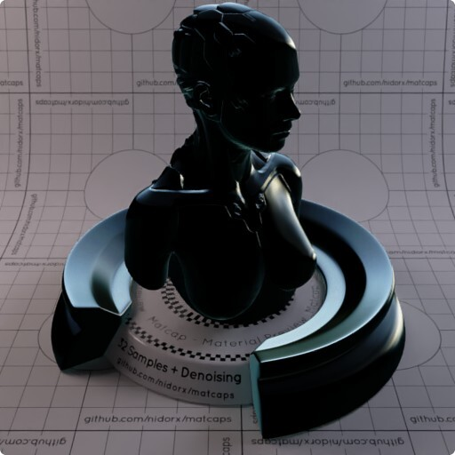
    </td>
    <td align="right">
        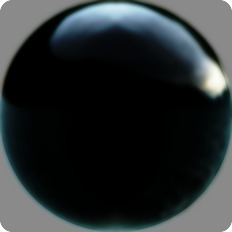
         
        
         
        <a href="https://github.com/nidorx/matcaps/raw/master/1024/070B0C_070B0C_B2C7CE_728FA3.png" target="_blank">1024px</a> 
        <a href="https://github.com/nidorx/matcaps/raw/master/512/070B0C_070B0C_B2C7CE_728FA3-512px.png" target="_blank">512px</a> 
        <a href="https://github.com/nidorx/matcaps/raw/master/256/070B0C_070B0C_B2C7CE_728FA3-256px.png" target="_blank">256px</a> 
        <a href="https://github.com/nidorx/matcaps/raw/master/128/070B0C_070B0C_B2C7CE_728FA3-128px.png" target="_blank">128px</a> 
        <a href="https://github.com/nidorx/matcaps/raw/master/64/070B0C_070B0C_B2C7CE_728FA3-64px.png" target="_blank">64px</a> 
        <a href="https://github.com/nidorx/matcaps/raw/master/zmt/070B0C_070B0C_B2C7CE_728FA3-ZMT.zip" target="_blank">ZBrush Material (ZMT)</a>
        
<strong>070B0C_070B0C_B2C7CE_728FA3</strong>

    </td>
</tr>
<tr>
    <td align="center">
        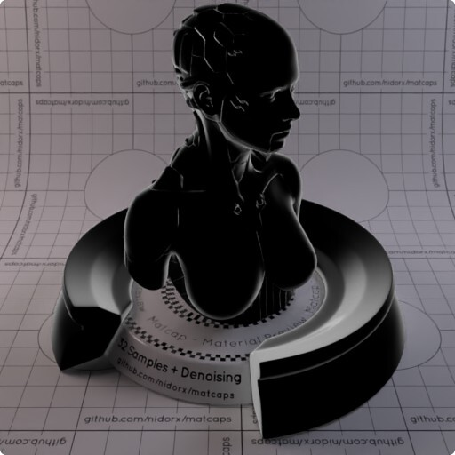
    </td>
    <td align="right">
        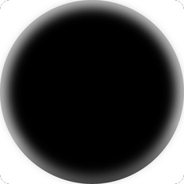
         
        
         
        <a href="https://github.com/nidorx/matcaps/raw/master/1024/090909_090909_9C9C9C_555555.png" target="_blank">1024px</a> 
        <a href="https://github.com/nidorx/matcaps/raw/master/512/090909_090909_9C9C9C_555555-512px.png" target="_blank">512px</a> 
        <a href="https://github.com/nidorx/matcaps/raw/master/256/090909_090909_9C9C9C_555555-256px.png" target="_blank">256px</a> 
        <a href="https://github.com/nidorx/matcaps/raw/master/128/090909_090909_9C9C9C_555555-128px.png" target="_blank">128px</a> 
        <a href="https://github.com/nidorx/matcaps/raw/master/64/090909_090909_9C9C9C_555555-64px.png" target="_blank">64px</a> 
        <a href="https://github.com/nidorx/matcaps/raw/master/zmt/090909_090909_9C9C9C_555555-ZMT.zip" target="_blank">ZBrush Material (ZMT)</a>
        
<strong>090909_090909_9C9C9C_555555</strong>

    </td>
</tr>
<tr>
    <td align="center">
        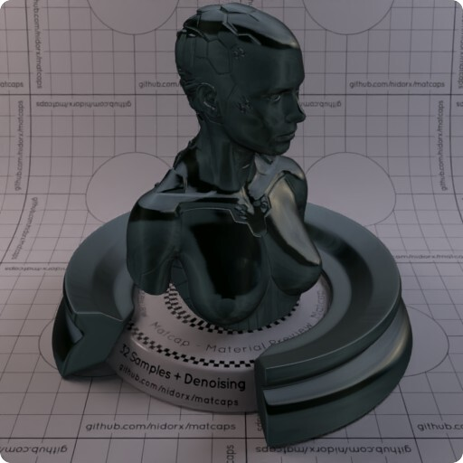
    </td>
    <td align="right">
        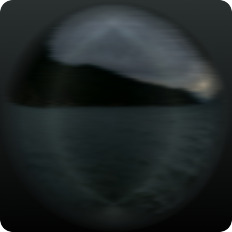
         
        
         
        <a href="https://github.com/nidorx/matcaps/raw/master/1024/181F1F_181F1F_475057_616566.png" target="_blank">1024px</a> 
        <a href="https://github.com/nidorx/matcaps/raw/master/512/181F1F_181F1F_475057_616566-512px.png" target="_blank">512px</a> 
        <a href="https://github.com/nidorx/matcaps/raw/master/256/181F1F_181F1F_475057_616566-256px.png" target="_blank">256px</a> 
        <a href="https://github.com/nidorx/matcaps/raw/master/128/181F1F_181F1F_475057_616566-128px.png" target="_blank">128px</a> 
        <a href="https://github.com/nidorx/matcaps/raw/master/64/181F1F_181F1F_475057_616566-64px.png" target="_blank">64px</a> 
        <a href="https://github.com/nidorx/matcaps/raw/master/zmt/181F1F_181F1F_475057_616566-ZMT.zip" target="_blank">ZBrush Material (ZMT)</a>
        
<strong>181F1F_181F1F_475057_616566</strong>

    </td>
</tr>
<tr>
    <td align="center">
        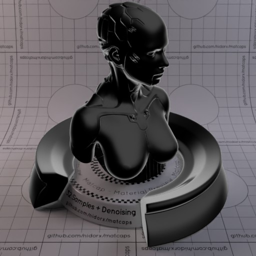
    </td>
    <td align="right">
        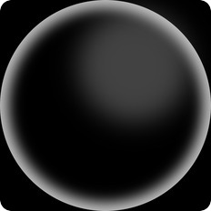
         
        
         
        <a href="https://github.com/nidorx/matcaps/raw/master/1024/1B1B1B_1B1B1B_999999_575757.png" target="_blank">1024px</a> 
        <a href="https://github.com/nidorx/matcaps/raw/master/512/1B1B1B_1B1B1B_999999_575757-512px.png" target="_blank">512px</a> 
        <a href="https://github.com/nidorx/matcaps/raw/master/256/1B1B1B_1B1B1B_999999_575757-256px.png" target="_blank">256px</a> 
        <a href="https://github.com/nidorx/matcaps/raw/master/128/1B1B1B_1B1B1B_999999_575757-128px.png" target="_blank">128px</a> 
        <a href="https://github.com/nidorx/matcaps/raw/master/64/1B1B1B_1B1B1B_999999_575757-64px.png" target="_blank">64px</a> 
        <a href="https://github.com/nidorx/matcaps/raw/master/zmt/1B1B1B_1B1B1B_999999_575757-ZMT.zip" target="_blank">ZBrush Material (ZMT)</a>
        
<strong>1B1B1B_1B1B1B_999999_575757</strong>

    </td>
</tr>
<tr>
    <td align="center">
        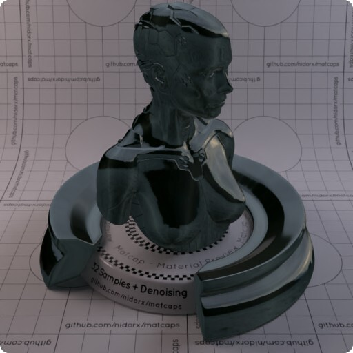
    </td>
    <td align="right">
        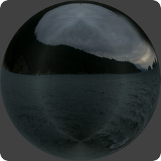
         
        
         
        <a href="https://github.com/nidorx/matcaps/raw/master/1024/1D2424_1D2424_565F66_4E555A.png" target="_blank">1024px</a> 
        <a href="https://github.com/nidorx/matcaps/raw/master/512/1D2424_1D2424_565F66_4E555A-512px.png" target="_blank">512px</a> 
        <a href="https://github.com/nidorx/matcaps/raw/master/256/1D2424_1D2424_565F66_4E555A-256px.png" target="_blank">256px</a> 
        <a href="https://github.com/nidorx/matcaps/raw/master/128/1D2424_1D2424_565F66_4E555A-128px.png" target="_blank">128px</a> 
        <a href="https://github.com/nidorx/matcaps/raw/master/64/1D2424_1D2424_565F66_4E555A-64px.png" target="_blank">64px</a> 
        <a href="https://github.com/nidorx/matcaps/raw/master/zmt/1D2424_1D2424_565F66_4E555A-ZMT.zip" target="_blank">ZBrush Material (ZMT)</a>
        
<strong>1D2424_1D2424_565F66_4E555A</strong>

    </td>
</tr>
<tr>
    <td align="center">
        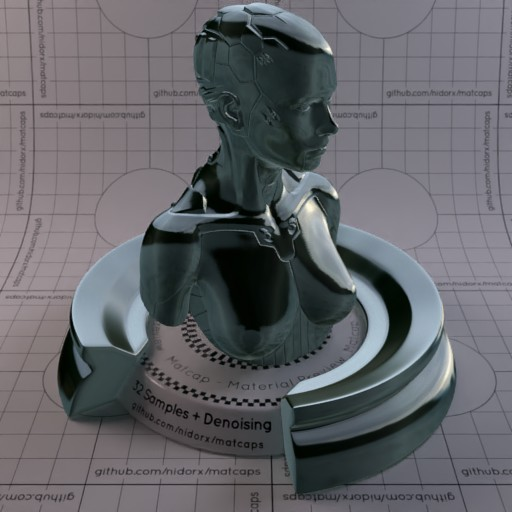
    </td>
    <td align="right">
        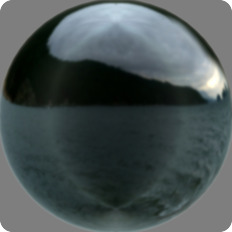
         
        
         
        <a href="https://github.com/nidorx/matcaps/raw/master/1024/293534_293534_B2BFC5_738289.png" target="_blank">1024px</a> 
        <a href="https://github.com/nidorx/matcaps/raw/master/512/293534_293534_B2BFC5_738289-512px.png" target="_blank">512px</a> 
        <a href="https://github.com/nidorx/matcaps/raw/master/256/293534_293534_B2BFC5_738289-256px.png" target="_blank">256px</a> 
        <a href="https://github.com/nidorx/matcaps/raw/master/128/293534_293534_B2BFC5_738289-128px.png" target="_blank">128px</a> 
        <a href="https://github.com/nidorx/matcaps/raw/master/64/293534_293534_B2BFC5_738289-64px.png" target="_blank">64px</a> 
        <a href="https://github.com/nidorx/matcaps/raw/master/zmt/293534_293534_B2BFC5_738289-ZMT.zip" target="_blank">ZBrush Material (ZMT)</a>
        
<strong>293534_293534_B2BFC5_738289</strong>

    </td>
</tr>
<tr>
    <td align="center">
        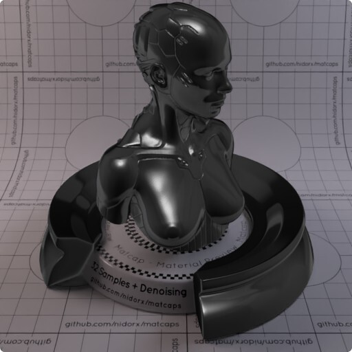
    </td>
    <td align="right">
        
         
        
         
        <a href="https://github.com/nidorx/matcaps/raw/master/1024/2A2A2A_2A2A2A_B3B3B3_6D6D6D.png" target="_blank">1024px</a> 
        <a href="https://github.com/nidorx/matcaps/raw/master/512/2A2A2A_2A2A2A_B3B3B3_6D6D6D-512px.png" target="_blank">512px</a> 
        <a href="https://github.com/nidorx/matcaps/raw/master/256/2A2A2A_2A2A2A_B3B3B3_6D6D6D-256px.png" target="_blank">256px</a> 
        <a href="https://github.com/nidorx/matcaps/raw/master/128/2A2A2A_2A2A2A_B3B3B3_6D6D6D-128px.png" target="_blank">128px</a> 
        <a href="https://github.com/nidorx/matcaps/raw/master/64/2A2A2A_2A2A2A_B3B3B3_6D6D6D-64px.png" target="_blank">64px</a> 
        <a href="https://github.com/nidorx/matcaps/raw/master/zmt/2A2A2A_2A2A2A_B3B3B3_6D6D6D-ZMT.zip" target="_blank">ZBrush Material (ZMT)</a>
        
<strong>2A2A2A_2A2A2A_B3B3B3_6D6D6D</strong>

    </td>
</tr>
<tr>
    <td align="center">
        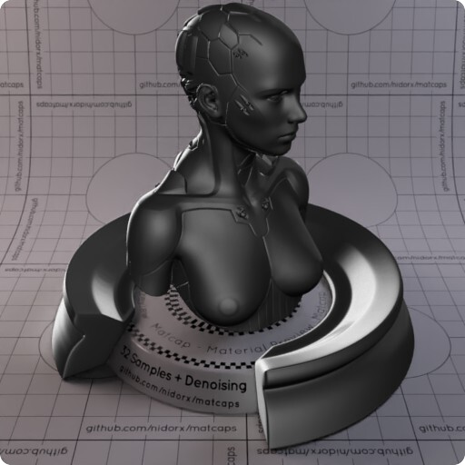
    </td>
    <td align="right">
        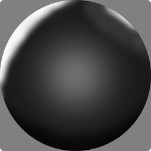
         
        
         
        <a href="https://github.com/nidorx/matcaps/raw/master/1024/2A2A2A_2A2A2A_DBDBDB_6A6A6A.png" target="_blank">1024px</a> 
        <a href="https://github.com/nidorx/matcaps/raw/master/512/2A2A2A_2A2A2A_DBDBDB_6A6A6A-512px.png" target="_blank">512px</a> 
        <a href="https://github.com/nidorx/matcaps/raw/master/256/2A2A2A_2A2A2A_DBDBDB_6A6A6A-256px.png" target="_blank">256px</a> 
        <a href="https://github.com/nidorx/matcaps/raw/master/128/2A2A2A_2A2A2A_DBDBDB_6A6A6A-128px.png" target="_blank">128px</a> 
        <a href="https://github.com/nidorx/matcaps/raw/master/64/2A2A2A_2A2A2A_DBDBDB_6A6A6A-64px.png" target="_blank">64px</a> 
        <a href="https://github.com/nidorx/matcaps/raw/master/zmt/2A2A2A_2A2A2A_DBDBDB_6A6A6A-ZMT.zip" target="_blank">ZBrush Material (ZMT)</a>
        
<strong>2A2A2A_2A2A2A_DBDBDB_6A6A6A</strong>

    </td>
</tr>
<tr>
    <td align="center">
        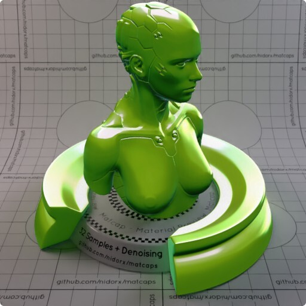
    </td>
    <td align="right">
        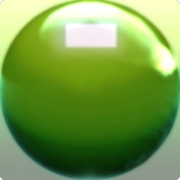
         
        
         
        <a href="https://github.com/nidorx/matcaps/raw/master/1024/3B6E10_3B6E10_E3F2C3_88AC2E.png" target="_blank">1024px</a> 
        <a href="https://github.com/nidorx/matcaps/raw/master/512/3B6E10_3B6E10_E3F2C3_88AC2E-512px.png" target="_blank">512px</a> 
        <a href="https://github.com/nidorx/matcaps/raw/master/256/3B6E10_3B6E10_E3F2C3_88AC2E-256px.png" target="_blank">256px</a> 
        <a href="https://github.com/nidorx/matcaps/raw/master/128/3B6E10_3B6E10_E3F2C3_88AC2E-128px.png" target="_blank">128px</a> 
        <a href="https://github.com/nidorx/matcaps/raw/master/64/3B6E10_3B6E10_E3F2C3_88AC2E-64px.png" target="_blank">64px</a> 
        <a href="https://github.com/nidorx/matcaps/raw/master/zmt/3B6E10_3B6E10_E3F2C3_88AC2E-ZMT.zip" target="_blank">ZBrush Material (ZMT)</a>
        
<strong>3B6E10_3B6E10_E3F2C3_88AC2E</strong>

    </td>
</tr>
<tr>
    <td align="center">
        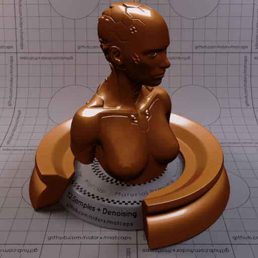
    </td>
    <td align="right">
        
         
        
         
        <a href="https://github.com/nidorx/matcaps/raw/master/1024/49200B_49200B_C6926C_9C642B.png" target="_blank">1024px</a> 
        <a href="https://github.com/nidorx/matcaps/raw/master/512/49200B_49200B_C6926C_9C642B-512px.png" target="_blank">512px</a> 
        <a href="https://github.com/nidorx/matcaps/raw/master/256/49200B_49200B_C6926C_9C642B-256px.png" target="_blank">256px</a> 
        <a href="https://github.com/nidorx/matcaps/raw/master/128/49200B_49200B_C6926C_9C642B-128px.png" target="_blank">128px</a> 
        <a href="https://github.com/nidorx/matcaps/raw/master/64/49200B_49200B_C6926C_9C642B-64px.png" target="_blank">64px</a> 
        <a href="https://github.com/nidorx/matcaps/raw/master/zmt/49200B_49200B_C6926C_9C642B-ZMT.zip" target="_blank">ZBrush Material (ZMT)</a>
        
<strong>49200B_49200B_C6926C_9C642B</strong>

    </td>
</tr>
<tr>
    <td align="center">
        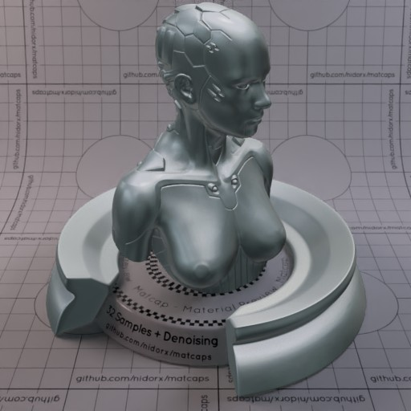
    </td>
    <td align="right">
        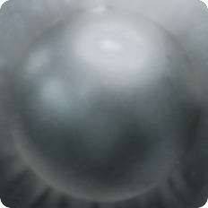
         
        
         
        <a href="https://github.com/nidorx/matcaps/raw/master/1024/4B5455_4B5455_BBBFC4_97A0A6.png" target="_blank">1024px</a> 
        <a href="https://github.com/nidorx/matcaps/raw/master/512/4B5455_4B5455_BBBFC4_97A0A6-512px.png" target="_blank">512px</a> 
        <a href="https://github.com/nidorx/matcaps/raw/master/256/4B5455_4B5455_BBBFC4_97A0A6-256px.png" target="_blank">256px</a> 
        <a href="https://github.com/nidorx/matcaps/raw/master/128/4B5455_4B5455_BBBFC4_97A0A6-128px.png" target="_blank">128px</a> 
        <a href="https://github.com/nidorx/matcaps/raw/master/64/4B5455_4B5455_BBBFC4_97A0A6-64px.png" target="_blank">64px</a> 
        <a href="https://github.com/nidorx/matcaps/raw/master/zmt/4B5455_4B5455_BBBFC4_97A0A6-ZMT.zip" target="_blank">ZBrush Material (ZMT)</a>
        
<strong>4B5455_4B5455_BBBFC4_97A0A6</strong>

    </td>
</tr>
<tr>
    <td align="center">
        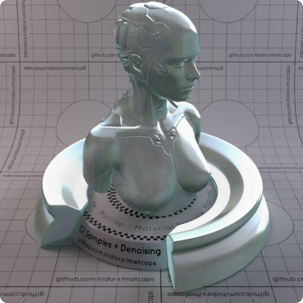
    </td>
    <td align="right">
        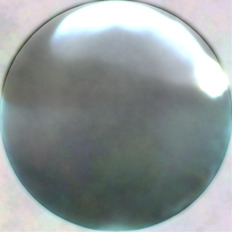
         
        
         
        <a href="https://github.com/nidorx/matcaps/raw/master/1024/636D6C_636D6C_D4E7ED_ABBCC4.png" target="_blank">1024px</a> 
        <a href="https://github.com/nidorx/matcaps/raw/master/512/636D6C_636D6C_D4E7ED_ABBCC4-512px.png" target="_blank">512px</a> 
        <a href="https://github.com/nidorx/matcaps/raw/master/256/636D6C_636D6C_D4E7ED_ABBCC4-256px.png" target="_blank">256px</a> 
        <a href="https://github.com/nidorx/matcaps/raw/master/128/636D6C_636D6C_D4E7ED_ABBCC4-128px.png" target="_blank">128px</a> 
        <a href="https://github.com/nidorx/matcaps/raw/master/64/636D6C_636D6C_D4E7ED_ABBCC4-64px.png" target="_blank">64px</a> 
        <a href="https://github.com/nidorx/matcaps/raw/master/zmt/636D6C_636D6C_D4E7ED_ABBCC4-ZMT.zip" target="_blank">ZBrush Material (ZMT)</a>
        
<strong>636D6C_636D6C_D4E7ED_ABBCC4</strong>

    </td>
</tr>
<tr>
    <td align="center">
        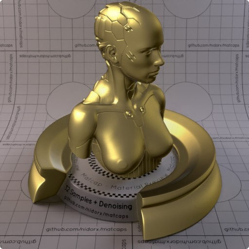
    </td>
    <td align="right">
        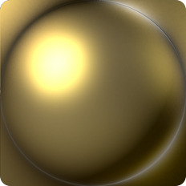
         
        
         
        <a href="https://github.com/nidorx/matcaps/raw/master/1024/71623B_71623B_ECDE8C_30250A.png" target="_blank">1024px</a> 
        <a href="https://github.com/nidorx/matcaps/raw/master/512/71623B_71623B_ECDE8C_30250A-512px.png" target="_blank">512px</a> 
        <a href="https://github.com/nidorx/matcaps/raw/master/256/71623B_71623B_ECDE8C_30250A-256px.png" target="_blank">256px</a> 
        <a href="https://github.com/nidorx/matcaps/raw/master/128/71623B_71623B_ECDE8C_30250A-128px.png" target="_blank">128px</a> 
        <a href="https://github.com/nidorx/matcaps/raw/master/64/71623B_71623B_ECDE8C_30250A-64px.png" target="_blank">64px</a> 
        <a href="https://github.com/nidorx/matcaps/raw/master/zmt/71623B_71623B_ECDE8C_30250A-ZMT.zip" target="_blank">ZBrush Material (ZMT)</a>
        
<strong>71623B_71623B_ECDE8C_30250A</strong>

    </td>
</tr>
<tr>
    <td align="center">
        
    </td>
    <td align="right">
        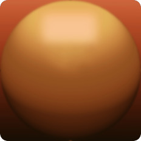
         
        
         
        <a href="https://github.com/nidorx/matcaps/raw/master/1024/8F4E20_8F4E20_E8B06B_391A08.png" target="_blank">1024px</a> 
        <a href="https://github.com/nidorx/matcaps/raw/master/512/8F4E20_8F4E20_E8B06B_391A08-512px.png" target="_blank">512px</a> 
        <a href="https://github.com/nidorx/matcaps/raw/master/256/8F4E20_8F4E20_E8B06B_391A08-256px.png" target="_blank">256px</a> 
        <a href="https://github.com/nidorx/matcaps/raw/master/128/8F4E20_8F4E20_E8B06B_391A08-128px.png" target="_blank">128px</a> 
        <a href="https://github.com/nidorx/matcaps/raw/master/64/8F4E20_8F4E20_E8B06B_391A08-64px.png" target="_blank">64px</a> 
        <a href="https://github.com/nidorx/matcaps/raw/master/zmt/8F4E20_8F4E20_E8B06B_391A08-ZMT.zip" target="_blank">ZBrush Material (ZMT)</a>
        
<strong>8F4E20_8F4E20_E8B06B_391A08</strong>

    </td>
</tr>
<tr>
    <td align="center">
        
    </td>
    <td align="right">
        
         
        
         
        <a href="https://github.com/nidorx/matcaps/raw/master/1024/945D43_945D43_E5AAA0_351F14.png" target="_blank">1024px</a> 
        <a href="https://github.com/nidorx/matcaps/raw/master/512/945D43_945D43_E5AAA0_351F14-512px.png" target="_blank">512px</a> 
        <a href="https://github.com/nidorx/matcaps/raw/master/256/945D43_945D43_E5AAA0_351F14-256px.png" target="_blank">256px</a> 
        <a href="https://github.com/nidorx/matcaps/raw/master/128/945D43_945D43_E5AAA0_351F14-128px.png" target="_blank">128px</a> 
        <a href="https://github.com/nidorx/matcaps/raw/master/64/945D43_945D43_E5AAA0_351F14-64px.png" target="_blank">64px</a> 
        <a href="https://github.com/nidorx/matcaps/raw/master/zmt/945D43_945D43_E5AAA0_351F14-ZMT.zip" target="_blank">ZBrush Material (ZMT)</a>
        
<strong>945D43_945D43_E5AAA0_351F14</strong>

    </td>
</tr>
<tr>
    <td align="center">
        
    </td>
    <td align="right">
        
         
        
         
        <a href="https://github.com/nidorx/matcaps/raw/master/1024/A88C77_A88C77_DAD2C7_623532.png" target="_blank">1024px</a> 
        <a href="https://github.com/nidorx/matcaps/raw/master/512/A88C77_A88C77_DAD2C7_623532-512px.png" target="_blank">512px</a> 
        <a href="https://github.com/nidorx/matcaps/raw/master/256/A88C77_A88C77_DAD2C7_623532-256px.png" target="_blank">256px</a> 
        <a href="https://github.com/nidorx/matcaps/raw/master/128/A88C77_A88C77_DAD2C7_623532-128px.png" target="_blank">128px</a> 
        <a href="https://github.com/nidorx/matcaps/raw/master/64/A88C77_A88C77_DAD2C7_623532-64px.png" target="_blank">64px</a> 
        <a href="https://github.com/nidorx/matcaps/raw/master/zmt/A88C77_A88C77_DAD2C7_623532-ZMT.zip" target="_blank">ZBrush Material (ZMT)</a>
        
<strong>A88C77_A88C77_DAD2C7_623532</strong>

    </td>
</tr>
<tr>
    <td align="center">
        
    </td>
    <td align="right">
        
         
        
         
        <a href="https://github.com/nidorx/matcaps/raw/master/1024/AF987A_AF987A_2F2416_523F27.png" target="_blank">1024px</a> 
        <a href="https://github.com/nidorx/matcaps/raw/master/512/AF987A_AF987A_2F2416_523F27-512px.png" target="_blank">512px</a> 
        <a href="https://github.com/nidorx/matcaps/raw/master/256/AF987A_AF987A_2F2416_523F27-256px.png" target="_blank">256px</a> 
        <a href="https://github.com/nidorx/matcaps/raw/master/128/AF987A_AF987A_2F2416_523F27-128px.png" target="_blank">128px</a> 
        <a href="https://github.com/nidorx/matcaps/raw/master/64/AF987A_AF987A_2F2416_523F27-64px.png" target="_blank">64px</a> 
        <a href="https://github.com/nidorx/matcaps/raw/master/zmt/AF987A_AF987A_2F2416_523F27-ZMT.zip" target="_blank">ZBrush Material (ZMT)</a>
        
<strong>AF987A_AF987A_2F2416_523F27</strong>

    </td>
</tr>
<tr>
    <td align="center">
        
    </td>
    <td align="right">
        
         
        
         
        <a href="https://github.com/nidorx/matcaps/raw/master/1024/B06932_B06932_451B09_7B3E16.png" target="_blank">1024px</a> 
        <a href="https://github.com/nidorx/matcaps/raw/master/512/B06932_B06932_451B09_7B3E16-512px.png" target="_blank">512px</a> 
        <a href="https://github.com/nidorx/matcaps/raw/master/256/B06932_B06932_451B09_7B3E16-256px.png" target="_blank">256px</a> 
        <a href="https://github.com/nidorx/matcaps/raw/master/128/B06932_B06932_451B09_7B3E16-128px.png" target="_blank">128px</a> 
        <a href="https://github.com/nidorx/matcaps/raw/master/64/B06932_B06932_451B09_7B3E16-64px.png" target="_blank">64px</a> 
        <a href="https://github.com/nidorx/matcaps/raw/master/zmt/B06932_B06932_451B09_7B3E16-ZMT.zip" target="_blank">ZBrush Material (ZMT)</a>
        
<strong>B06932_B06932_451B09_7B3E16</strong>

    </td>
</tr>
<tr>
    <td align="center">
        
    </td>
    <td align="right">
        
         
        
         
        <a href="https://github.com/nidorx/matcaps/raw/master/1024/B0B0B0_B0B0B0_6E6E6E_848484.png" target="_blank">1024px</a> 
        <a href="https://github.com/nidorx/matcaps/raw/master/512/B0B0B0_B0B0B0_6E6E6E_848484-512px.png" target="_blank">512px</a> 
        <a href="https://github.com/nidorx/matcaps/raw/master/256/B0B0B0_B0B0B0_6E6E6E_848484-256px.png" target="_blank">256px</a> 
        <a href="https://github.com/nidorx/matcaps/raw/master/128/B0B0B0_B0B0B0_6E6E6E_848484-128px.png" target="_blank">128px</a> 
        <a href="https://github.com/nidorx/matcaps/raw/master/64/B0B0B0_B0B0B0_6E6E6E_848484-64px.png" target="_blank">64px</a> 
        <a href="https://github.com/nidorx/matcaps/raw/master/zmt/B0B0B0_B0B0B0_6E6E6E_848484-ZMT.zip" target="_blank">ZBrush Material (ZMT)</a>
        
<strong>B0B0B0_B0B0B0_6E6E6E_848484</strong>

    </td>
</tr>
<tr>
    <td align="center">
        
    </td>
    <td align="right">
        
         
        
         
        <a href="https://github.com/nidorx/matcaps/raw/master/1024/B1A395_B1A395_EFE6E1_635A47.png" target="_blank">1024px</a> 
        <a href="https://github.com/nidorx/matcaps/raw/master/512/B1A395_B1A395_EFE6E1_635A47-512px.png" target="_blank">512px</a> 
        <a href="https://github.com/nidorx/matcaps/raw/master/256/B1A395_B1A395_EFE6E1_635A47-256px.png" target="_blank">256px</a> 
        <a href="https://github.com/nidorx/matcaps/raw/master/128/B1A395_B1A395_EFE6E1_635A47-128px.png" target="_blank">128px</a> 
        <a href="https://github.com/nidorx/matcaps/raw/master/64/B1A395_B1A395_EFE6E1_635A47-64px.png" target="_blank">64px</a> 
        <a href="https://github.com/nidorx/matcaps/raw/master/zmt/B1A395_B1A395_EFE6E1_635A47-ZMT.zip" target="_blank">ZBrush Material (ZMT)</a>
        
<strong>B1A395_B1A395_EFE6E1_635A47</strong>

    </td>
</tr>
<tr>
    <td align="center">
        
    </td>
    <td align="right">
        
         
        
         
        <a href="https://github.com/nidorx/matcaps/raw/master/1024/B5987E_B5987E_F8E4DC_6F5939.png" target="_blank">1024px</a> 
        <a href="https://github.com/nidorx/matcaps/raw/master/512/B5987E_B5987E_F8E4DC_6F5939-512px.png" target="_blank">512px</a> 
        <a href="https://github.com/nidorx/matcaps/raw/master/256/B5987E_B5987E_F8E4DC_6F5939-256px.png" target="_blank">256px</a> 
        <a href="https://github.com/nidorx/matcaps/raw/master/128/B5987E_B5987E_F8E4DC_6F5939-128px.png" target="_blank">128px</a> 
        <a href="https://github.com/nidorx/matcaps/raw/master/64/B5987E_B5987E_F8E4DC_6F5939-64px.png" target="_blank">64px</a> 
        <a href="https://github.com/nidorx/matcaps/raw/master/zmt/B5987E_B5987E_F8E4DC_6F5939-ZMT.zip" target="_blank">ZBrush Material (ZMT)</a>
        
<strong>B5987E_B5987E_F8E4DC_6F5939</strong>

    </td>
</tr>
<tr>
    <td align="center">
        
    </td>
    <td align="right">
        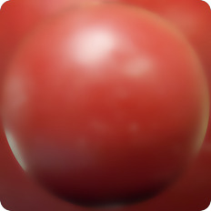
         
        
         
        <a href="https://github.com/nidorx/matcaps/raw/master/1024/BD5345_BD5345_460F11_732622.png" target="_blank">1024px</a> 
        <a href="https://github.com/nidorx/matcaps/raw/master/512/BD5345_BD5345_460F11_732622-512px.png" target="_blank">512px</a> 
        <a href="https://github.com/nidorx/matcaps/raw/master/256/BD5345_BD5345_460F11_732622-256px.png" target="_blank">256px</a> 
        <a href="https://github.com/nidorx/matcaps/raw/master/128/BD5345_BD5345_460F11_732622-128px.png" target="_blank">128px</a> 
        <a href="https://github.com/nidorx/matcaps/raw/master/64/BD5345_BD5345_460F11_732622-64px.png" target="_blank">64px</a> 
        <a href="https://github.com/nidorx/matcaps/raw/master/zmt/BD5345_BD5345_460F11_732622-ZMT.zip" target="_blank">ZBrush Material (ZMT)</a>
        
<strong>BD5345_BD5345_460F11_732622</strong>

    </td>
</tr>
<tr>
    <td align="center">
        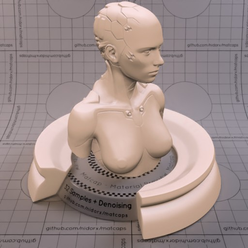
    </td>
    <td align="right">
        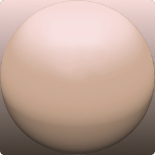
         
        
         
        <a href="https://github.com/nidorx/matcaps/raw/master/1024/C4A591_C4A591_635448_F2D9D5.png" target="_blank">1024px</a> 
        <a href="https://github.com/nidorx/matcaps/raw/master/512/C4A591_C4A591_635448_F2D9D5-512px.png" target="_blank">512px</a> 
        <a href="https://github.com/nidorx/matcaps/raw/master/256/C4A591_C4A591_635448_F2D9D5-256px.png" target="_blank">256px</a> 
        <a href="https://github.com/nidorx/matcaps/raw/master/128/C4A591_C4A591_635448_F2D9D5-128px.png" target="_blank">128px</a> 
        <a href="https://github.com/nidorx/matcaps/raw/master/64/C4A591_C4A591_635448_F2D9D5-64px.png" target="_blank">64px</a> 
        <a href="https://github.com/nidorx/matcaps/raw/master/zmt/C4A591_C4A591_635448_F2D9D5-ZMT.zip" target="_blank">ZBrush Material (ZMT)</a>
        
<strong>C4A591_C4A591_635448_F2D9D5</strong>

    </td>
</tr>
<tr>
    <td align="center">
        
    </td>
    <td align="right">
        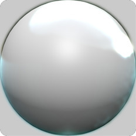
         
        
         
        <a href="https://github.com/nidorx/matcaps/raw/master/1024/C4C6C6_C4C6C6_4D5756_646463.png" target="_blank">1024px</a> 
        <a href="https://github.com/nidorx/matcaps/raw/master/512/C4C6C6_C4C6C6_4D5756_646463-512px.png" target="_blank">512px</a> 
        <a href="https://github.com/nidorx/matcaps/raw/master/256/C4C6C6_C4C6C6_4D5756_646463-256px.png" target="_blank">256px</a> 
        <a href="https://github.com/nidorx/matcaps/raw/master/128/C4C6C6_C4C6C6_4D5756_646463-128px.png" target="_blank">128px</a> 
        <a href="https://github.com/nidorx/matcaps/raw/master/64/C4C6C6_C4C6C6_4D5756_646463-64px.png" target="_blank">64px</a> 
        <a href="https://github.com/nidorx/matcaps/raw/master/zmt/C4C6C6_C4C6C6_4D5756_646463-ZMT.zip" target="_blank">ZBrush Material (ZMT)</a>
        
<strong>C4C6C6_C4C6C6_4D5756_646463</strong>

    </td>
</tr>
<tr>
    <td align="center">
        
    </td>
    <td align="right">
        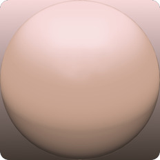
         
        
         
        <a href="https://github.com/nidorx/matcaps/raw/master/1024/C5A292_C5A292_635247_F2D7D6.png" target="_blank">1024px</a> 
        <a href="https://github.com/nidorx/matcaps/raw/master/512/C5A292_C5A292_635247_F2D7D6-512px.png" target="_blank">512px</a> 
        <a href="https://github.com/nidorx/matcaps/raw/master/256/C5A292_C5A292_635247_F2D7D6-256px.png" target="_blank">256px</a> 
        <a href="https://github.com/nidorx/matcaps/raw/master/128/C5A292_C5A292_635247_F2D7D6-128px.png" target="_blank">128px</a> 
        <a href="https://github.com/nidorx/matcaps/raw/master/64/C5A292_C5A292_635247_F2D7D6-64px.png" target="_blank">64px</a> 
        <a href="https://github.com/nidorx/matcaps/raw/master/zmt/C5A292_C5A292_635247_F2D7D6-ZMT.zip" target="_blank">ZBrush Material (ZMT)</a>
        
<strong>C5A292_C5A292_635247_F2D7D6</strong>

    </td>
</tr>
<tr>
    <td align="center">
        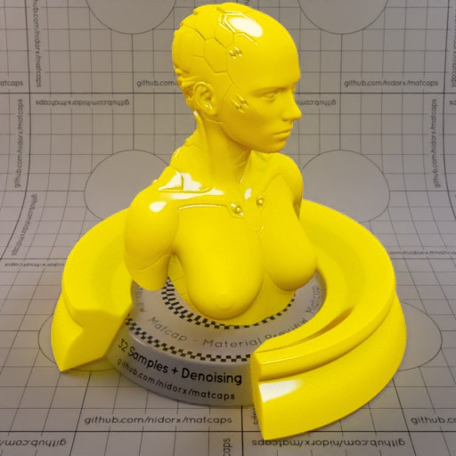
    </td>
    <td align="right">
        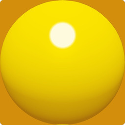
         
        
         
        <a href="https://github.com/nidorx/matcaps/raw/master/1024/F0D504_F0D504_FBFAD3_B98609.png" target="_blank">1024px</a> 
        <a href="https://github.com/nidorx/matcaps/raw/master/512/F0D504_F0D504_FBFAD3_B98609-512px.png" target="_blank">512px</a> 
        <a href="https://github.com/nidorx/matcaps/raw/master/256/F0D504_F0D504_FBFAD3_B98609-256px.png" target="_blank">256px</a> 
        <a href="https://github.com/nidorx/matcaps/raw/master/128/F0D504_F0D504_FBFAD3_B98609-128px.png" target="_blank">128px</a> 
        <a href="https://github.com/nidorx/matcaps/raw/master/64/F0D504_F0D504_FBFAD3_B98609-64px.png" target="_blank">64px</a> 
        <a href="https://github.com/nidorx/matcaps/raw/master/zmt/F0D504_F0D504_FBFAD3_B98609-ZMT.zip" target="_blank">ZBrush Material (ZMT)</a>
        
<strong>F0D504_F0D504_FBFAD3_B98609</strong>

    </td>
</tr>
</table>